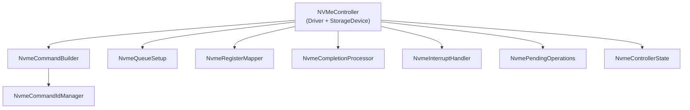

# NVMe Driver Hyper-Decomposition

> AI-agent conceptual memory. Read before modifying NVMe driver code.

## Decision

The NVMe driver is decomposed into **19 header files and 14 source files** — one class per file, following the SECRET RULE.

## Rationale

NVMe is inherently complex: submission/completion queues, MMIO registers, interrupt handling, namespace management, command building, and error recovery. Decomposing into fine-grained classes:

1. **Single responsibility**: Each class does exactly one thing
2. **Independent testability**: `NvmeCommandIdManager` can be tested without hardware
3. **Clear naming**: File name reveals responsibility immediately
4. **Small classes**: Most are 50-150 lines

## File → Responsibility Map

| Header | Class | Responsibility |
|--------|-------|----------------|
| `nvme_controller.h` | `NVMeController` | Main controller, dual-inherits Driver + StorageDevice |
| `nvme_command.h` | `NvmeCommand` | Command structure (16 bytes, packed) |
| `nvme_command_builder.h` | `NvmeCommandBuilder` | Builds read/write/identify commands |
| `nvme_command_id_manager.h` | `NvmeCommandIdManager` | Tracks in-flight command IDs |
| `nvme_completion_processor.h` | `NvmeCompletionProcessor` | Processes completion queue entries |
| `nvme_queue_setup.h` | `NvmeQueueSetup` | Configures admin + IO queues |
| `nvme_register_mapper.h` | `NvmeRegisterMapper` | Maps PCI BAR to MMIO pointers |
| `nvme_register_access.h` | `NvmeRegisterAccess` | Read/write NVMe registers |
| `nvme_interrupt_handler.h` | `NvmeInterruptHandler` | Handles NVMe IRQs |
| `nvme_interrupt_configurator.h` | `NvmeInterruptConfigurator` | Configures MSI-X |
| `nvme_interrupt_line.h` | `NvmeInterruptLine` | Manages single interrupt line |
| `nvme_pending_operations.h` | `NvmePendingOperations` | Tracks in-flight I/O |
| `nvme_device_configuration.h` | `NvmeDeviceConfiguration` | Stores device config (queue sizes, etc.) |
| `nvme_controller_state.h` | `NvmeControllerState` | State machine (reset → ready → live) |
| `nvme_async_operation.h` | `NvmeAsyncOperation` | Async I/O completion tracking |
| `nvme_utilities.h` | `NvmeUtilities` | Helper functions |
| `interrupt_driven_nvme.h` | `InterruptDrivenNVMe` | Interrupt-driven I/O wrapper |
| `NvmeCompletionProcessor.h` | (alternate naming) | Legacy/compat header |
| `NvmeQueueManager.h` | (alternate naming) | Legacy/compat header |

## Architecture

## Gotchas

- Some headers use PascalCase naming (`NvmeCompletionProcessor.h`) while others use snake_case (`nvme_completion_processor.h`). This is an inconsistency being tracked.
- The `NVMeController` class has nested structs (`Namespace`, `QueuePair`, `Command`, `Completion`) — these are NVMe-spec-defined structures, not arbitrary nesting.
- `NVMeController` dual-inherits from `Driver` and `StorageDevice` — see dual-inheritance pattern.
