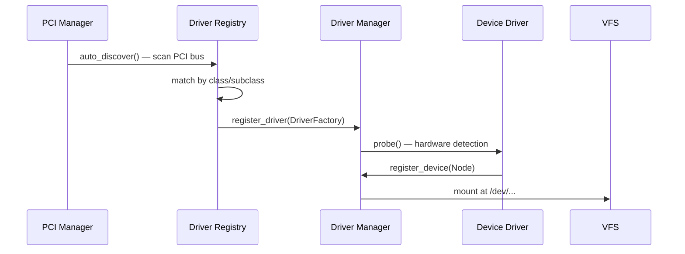
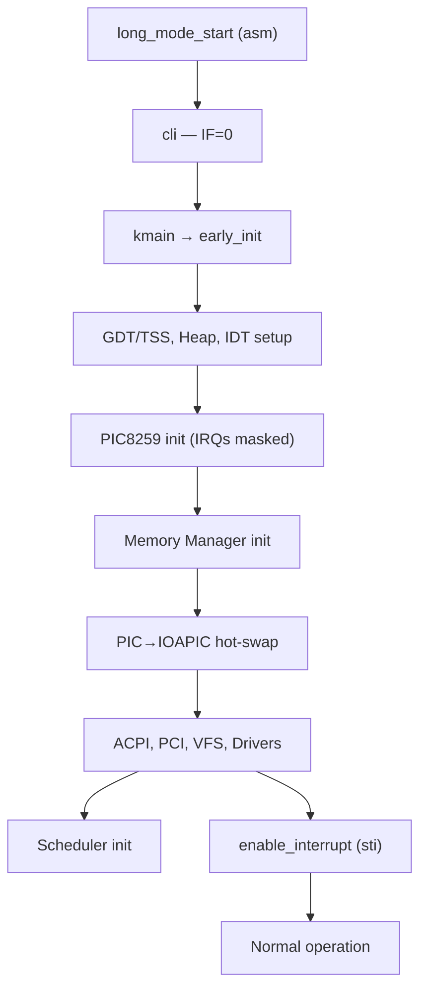
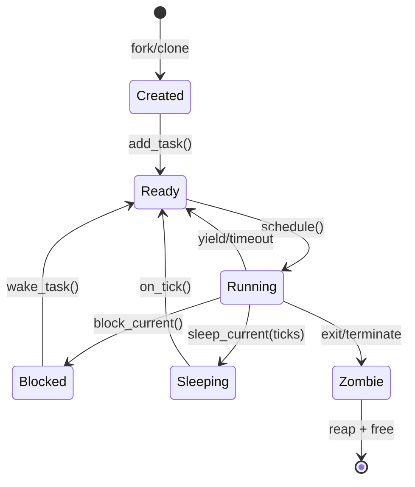
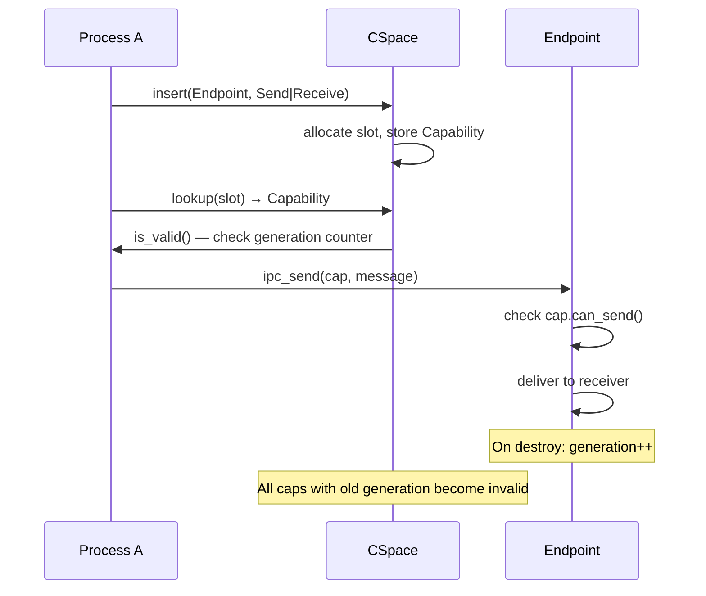
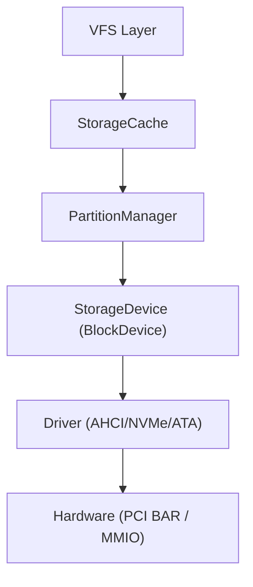
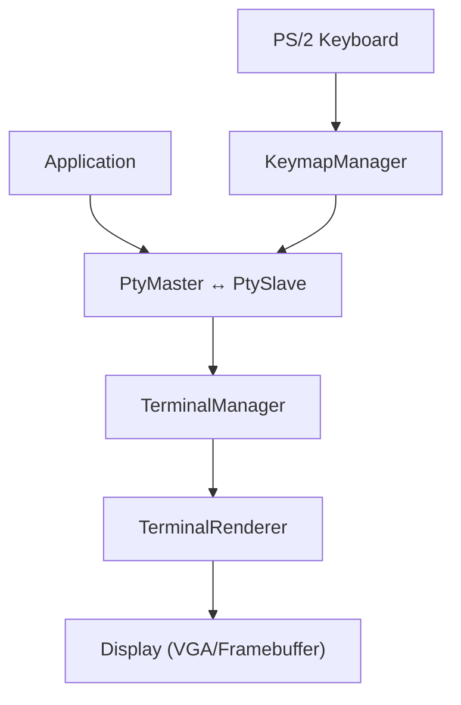
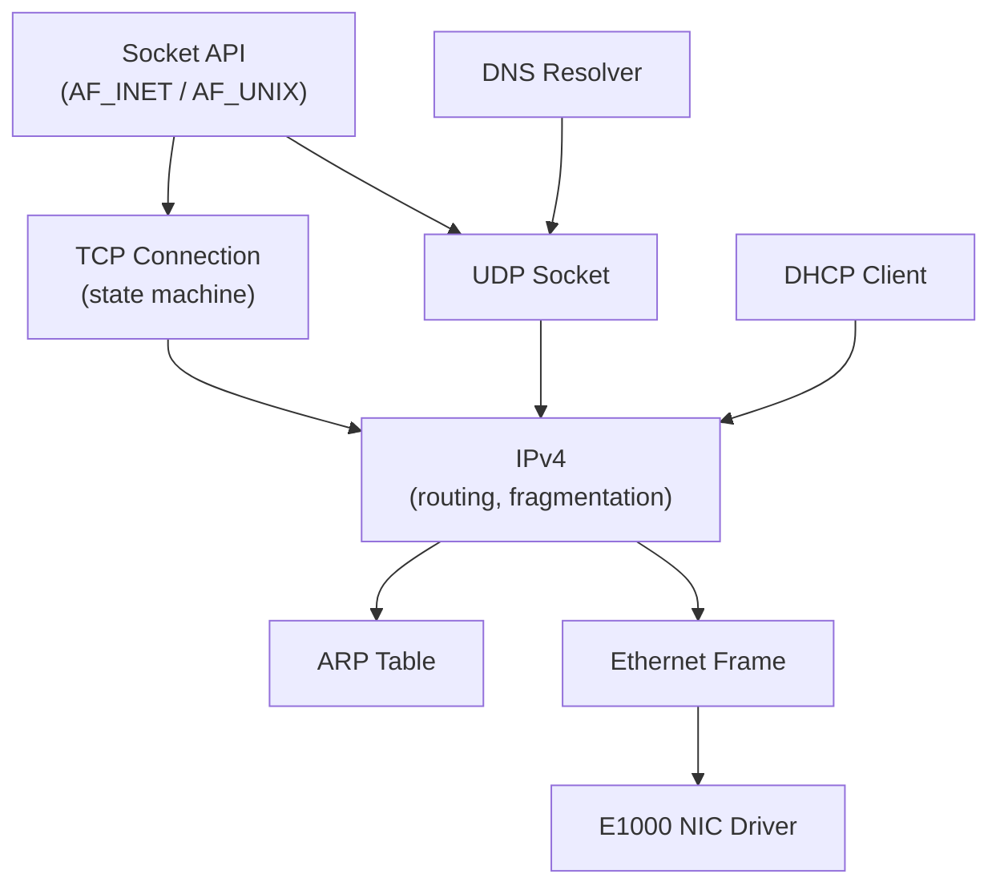

# Implementation Patterns

This document describes the concrete coding patterns used across the FKernel codebase. For high-level design philosophy, see [design-philosophy.md](./design-philosophy.md). For unconventional decisions, see [unconventional-design.md](./unconventional-design.md).

## 1. Error Propagation with TRY

Every fallible operation returns `Result<T, Error>`. Errors propagate automatically with `TRY()`:

```cpp
Result<void, Error> initialize() {
  auto page = TRY(allocate_page());   // Returns error if allocation fails
  TRY(map_page(page, virtual_addr));  // Returns error if mapping fails
  return {};                           // Success
}
```

- `TRY()` uses GCC statement expressions (`({...})`) to capture the result
- On error, it returns the error immediately
- On success, it yields the value
- `kerror()` halts the system — never use for recoverable errors
- `kwarn()` logs a warning and continues

Key files: `Include/LibFK/Core/Result.h`

## 2. VFS Node Hierarchy

All filesystem objects inherit from `Node`, which provides a virtual interface:

```
Node (RefCounted)
├── Fat12Node, Fat16Node, Fat32Node   (on-disk filesystem nodes)
├── TmpFsNode, TmpFsDirectoryNode     (in-memory filesystem)
├── DevFsNode → NullDevice, URandomDevice, PtmxDevice
├── DebugLogNode, SyscallLogNode, IpcLogNode  (debug ring buffers)
├── PipeNode, EventFdNode, TimerFdNode, SignalFdNode
├── EpollNode, KqueueNode
├── ProcFsNode → ProcStatNode, ProcMemInfoNode, ... (19 /proc nodes)
├── SerialNode, KeyboardNode          (device nodes)
└── PTY: PtyMaster, PtySlave
```

Key pattern: `Node` uses `Result<T, Error>` for ALL operations (read, write, lookup, mkdir, etc.). Default implementations return `Error::NotImplemented` or `Error::NotADirectory`.

Key files: `Include/Kernel/Fs/Vfs/node.h`

## 3. Driver Registration Flow



Drivers register via class/subclass matching (Newbus-inspired). The driver registry maps PCI class codes to factory functions. During probe, the driver checks hardware presence and registers itself as a VFS node.

Key files: `Include/Kernel/Driver/driver_registry.h`, `Include/Kernel/Driver/Device/driver_manager.h`

## 4. Interrupt Lifecycle



Key rules:
- Interrupts DISABLED throughout early_init and most of init
- `enable_interrupt()` called ONLY at end of init, after scheduler
- All hardware access in dispatch path must be phase-guarded
- IST1 (double fault) uses dedicated 16 KiB stack

Key files: `Src/Kernel/Arch/x86_64/Init/early_init.cpp`, `Src/Kernel/Init/init.cpp`

## 5. Process Lifecycle



- `Task` struct contains all per-process state (registers, memory map, file table, signal mask)
- Zombie processes are reaped by parent via `wait4()`
- `SchedulerManager` maintains per-CPU current task pointers
- PID generation uses `__sync_fetch_and_add` for atomic increment

Key files: `Include/Kernel/Scheduler/Task/task.h`, `Include/Kernel/Scheduler/scheduler.h`

## 6. Capability Lifecycle



Key pattern: Capabilities carry a `revoke_counter` pointer and `issued_generation`. When the IPC object is destroyed, its generation increments, and all outstanding capabilities are automatically invalidated without needing to遍历 CSpace.

Key files: `Include/Kernel/Ipc/capability.h`, `Include/Kernel/Ipc/cspace.h`

## 7. Storage Stack Layering



- **StorageCache**: Caches sector reads/writes to reduce hardware access
- **PartitionManager**: Scans MBR/GPT, creates child block devices per partition
- **StorageDevice**: Abstract block device interface (read_sectors/write_sectors)
- **Driver**: Concrete hardware driver (AHCI, NVMe, ATA PIO/DMA)

Key files: `Include/Kernel/Driver/Storage/storage_cache.h`, `Include/Kernel/Driver/Storage/Partitions/partition_manager.h`

## 8. ELF Loading Pipeline


Each domain is a separate class in its own file. The `ElfLoader` coordinates them. Security features enforced during loading:
- **ASLR**: Random load base for ET_DYN executables
- **NX**: No-execute bit on non-executable segments
- **RELRO**: Partial/full relocation read-only
- **SMEP/SMAP**: Kernel-mode execution/access prevention (set in CR4)

Key files: `Include/Kernel/Loader/Domains/`, `Src/Kernel/Loader/`

## 9. Terminal and PTY System



- **PTY**: Pseudoterminal pair (master/slave) for shell sessions
- **TerminalManager**: Tracks active TTY, foreground process group
- **TerminalRenderer**: ANSI escape sequence rendering to display
- **KeymapManager**: Keyboard layout mapping (US-QWERTY default)

Key files: `Include/Kernel/Driver/Terminal/terminal_manager.h`, `Include/Kernel/Driver/Pty/pty_master.h`

## 10. Network Stack



Full userspace-compatible TCP/IP stack:
- TCP: Three-way handshake, sliding window, state machine (SYN_SENT→ESTABLISHED→CLOSED)
- UDP: Connectionless datagrams
- ARP: Address resolution with cache
- ICMP: Ping/echo support
- DHCP: Automatic IP configuration
- DNS: Name resolution via UDP
- Routing table with longest-prefix matching

Key files: `Include/Kernel/Net/`, `Src/Kernel/Net/`

## 11. ProcFs Node Pattern

Each `/proc` entry is a separate class inheriting from `ProcFsNode`:

```
proc/
├── cpuinfo      → ProcCpuinfoNode
├── meminfo      → ProcMeminfoNode
├── uptime       → ProcUptimeNode
├── version      → ProcVersionNode
├── stat         → ProcStatNode
├── mounts       → ProcMountsNode
├── partitions   → ProcPartitionsNode
├── loadavg      → ProcLoadavgNode
├── self → /proc/[pid] (symlink)
├── [pid]/
│   ├── cmdline  → ProcPidCmdlineNode
│   ├── stat     → ProcPidStatNode
│   └── ... (directory node)
└── sys/
    └── kernel/  → ProcSysKernelNode
```

Each node implements `read()` returning formatted text on demand. No data is cached — it's generated fresh on each read (Linux-compatible behavior).

Key files: `Include/Kernel/Fs/ProcFs/` (18 headers)
