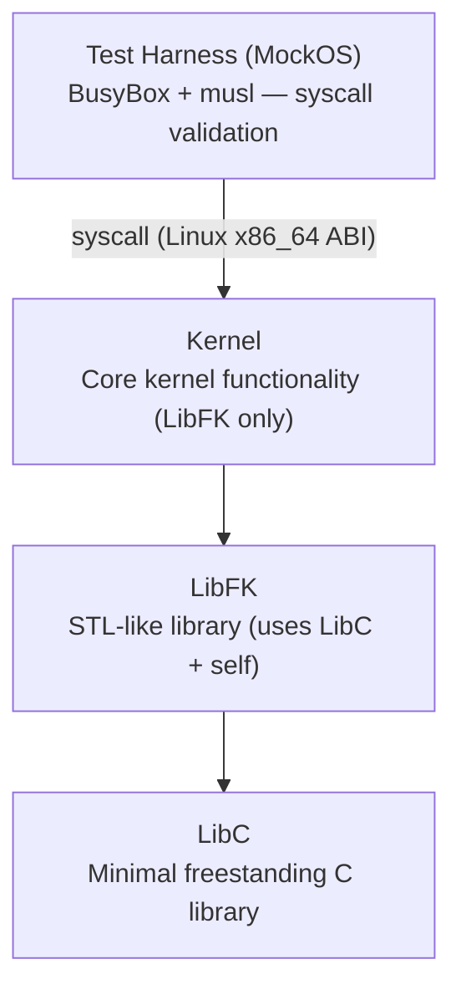

# FKernel — Kernel Architecture Overview

## Kernel Architecture

FKernel follows a **hybrid kernel architecture** with strict layer separation:

### Kernel Context

```mermaid
flowchart LR
    subgraph MockOS["MockOS (Test Harness)"]
        BB["BusyBox 1.36.1"]
        MUSL["musl 1.2.4"]
    end
    subgraph FKernel["FKernel Kernel"]
        MEM["Memory<br/>Buddy+Zones+VMM"]
        SCHED["Scheduler<br/>Priority+WorkStealing"]
        VFS["VFS<br/>Ext2/3/4, FAT, TmpFs, ..."]
        IPC["IPC<br/>seL4 Capabilities"]
        NET["Networking<br/>TCP/IP+E1000"]
        ELF["ELF Loader<br/>ASLR+TLS+RELRO"]
    end
    subgraph Hardware
        CPU["x86_64 CPU<br/>SMEP/SMAP/NX"]
        DISK["Storage<br/>ATA/AHCI/NVMe"]
        NIC["Network<br/>E1000"]
    end
    BB --> MUSL
    MUSL -->|"syscalls"| FKernel
    FKernel --> Hardware
```

## Architectural Identity

FKernel is a **hybrid kernel** — see [design-philosophy.md](design-philosophy.md) for full rationale:
- **ABI**: Linux x86_64 (syscall numbers, ELF loading)
- **Internals**: BSD-inspired (VFS, scheduler, process model, kqueue, driver framework)
- **Practices**: Rust-style errors, seL4 capabilities, Object Calisthenics

## Project Status

**Kernel Completion**: ~70% — POSIX-compatible x86_64 hobby kernel, boots to MockOS test harness with BusyBox 1.36.1 (~60 applets, ~40 fully functional)
**POSIX Compliance**: ~60% (206 implemented syscall handlers, ELF dynamic linking, real-time scheduling, major FS families)
**Immediate Priority**: Kernel test coverage (Phase 43 — 10 kernel test files so far, target 75% of critical paths)
**Long-term Goal**: Full POSIX compliance for a well-designed hobby kernel

> **Note**: FKernel is a **kernel**, not an operating system. MockOS is a test harness for validating POSIX syscall compatibility, not a userspace OS. BusyBox, musl, and OpenRC are validation tools, not the project's "userspace."

## Architectural Principles

### 1. Strict Layer Separation
- **LibC**: Minimal C standard library (strings, memory, types) — C17 freestanding
- **LibFK**: STL-like containers and utilities (uses only LibC) — C++20 freestanding
- **Kernel**: Core kernel functionality (uses only LibFK, NEVER LibC)

### 2. Domain-Based Organization
- Each directory represents a **cohesive domain**
- Files contain **exactly one** struct/class (SECRET RULE)
- Self-documenting hierarchy

### 3. Object Calisthenics
- Max 200 lines per class, 20 lines per method
- No `else` keyword, one dot per line
- Max 2 instance variables per class
- Rich domain models, no getters/setters

### 4. Hardware Compatibility
- ACPI-driven discovery (HPET, MCFG/ECAM, MADT)
- PCI driver matching (class/subclass based)
- Supports real hardware, not just QEMU — with caveats: ATA DMA, E1000, PS/2 verified on real hardware; NVMe (PRP2, interrupt-driven) and AHCI async DMA implemented; **VBE real-mode bridge is a placeholder** (framebuffer via Multiboot2 only). IOMMU VT-d parses DMAR but does not translate (3/3 methods `NotImplemented`).

## Key Domains

### Core Kernel Domains
- **Memory**: Physical (Buddy+Zones), Virtual (4-level paging), Object (Slab)
- **Process**: Task management, scheduling (priority + work stealing + real-time SCHED_FIFO/RR with 32 priority levels), SMP AP startup (INIT/STARTUP IPI), IPC, lazy FPU context switching
- **Hardware**: CPU, ACPI, PCI, APIC/IOAPIC, MSI-X
- **Filesystem**: VFS (BSD-style dentry/vnode/mount), Ext2/3/4, FAT12/16/32, exFAT, ISO9660, MinixFS, TmpFs, DevFs, ProcFs, DebugFs, PtsFs, SemFs, MqueueFs, ShmFs, PipeFs, Epoll, EventFd, SignalFd, TimerFd
- **Drivers**: Storage (ATA/AHCI/NVMe), Network (E1000), PS/2 mouse, Serial, PTY, USB (headers)
- **Syscalls**: POSIX-compatible Linux x86_64 interface (206 registered syscalls)

### Networking (Full Stack)
- **E1000**: MMIO, RX/TX rings, MAC
- **IPv4**: TCP, UDP, ARP, ICMP
- **Sockets**: AF_UNIX, AF_INET
- **Advanced**: TCP sliding window, retransmit with exponential backoff, routing table, DHCP client, DNS resolver

### Security & Isolation
- **Capabilities**: seL4-style fine-grained rights (send/receive/manage) via CSpace + generation-based revocation. Used by raw `sys_ipc_*` syscalls. Phase 27 implemented: POSIX FDs install as CSpace capabilities (`Task::add_file_descriptor` → `CSpace::install_fd`, per-FD rights derived from open flags; revoke on close/dup2).
- **IPC**: Endpoint (synchronous rendezvous), Notification (async bitmask + payload queue), SharedMemory (page-level). SCM_RIGHTS and SCM_CREDENTIALS via sendmsg/recvmsg. PipeNode, EventFd, Semaphore, Mqueue, Epoll/KQueue, SignalFd all use Notification embedded members.
- **Kernel Events**: EVFILT_PROC, EVFILT_SIGNAL, EVFILT_TIMER in kqueue.
- **ELF Security**: ASLR (ChaCha20 CSPRNG, 30-bit), NX, SMEP, SMAP, W^X enforcement, RELRO (all segments), TLS, dynamic linking.
- **Memory**: NX pages, user/kernel isolation, SMAP/SMEP enabled, CoW fork (`clone_table_recursive`), demand paging (`handle_demand_paging`).

> **Known security gaps**: KPTI (Meltdown mitigation) not implemented; IOMMU (VT-d) parses DMAR but does not translate DMA; ASLR entropy comes from the CSPRNG (seeded via RDTSC) — no RDRAND/other hardware entropy sources yet.

## Design Patterns

### Error Handling
- `Result<T, Error>` for fallible operations
- `Optional<T>` for nullable values
- `TRY` macro for error propagation
- No exceptions, no RTTI

### Memory Management
- RAII with smart pointers (`OwnPtr`, `RefPtr`)
- Stack allocation preferred
- No C++ standard library

### Hardware Interaction
- Strategy pattern for different hardware types
- Abstract interfaces with concrete implementations
- Volatile access for MMIO registers

## Technology Stack

- **Language**: C++20 (freestanding), C17 (LibC), NASM (assembly)
- **Build System**: XMake (Lua-based)
- **Compiler**: Clang/LLD with freestanding flags (`-ffreestanding`, `-fno-exceptions`, `-fno-rtti`)
- **Boot**: GRUB + Multiboot2
- **Testing**: Custom framework (coverage targets: LibC 90%, LibFK 85%)
- **Test Harness**: BusyBox 1.36.1 + musl 1.2.4 via MockOS ISO image

## Development Philosophy

1. **Extensible over Rewritable**: Build on existing abstractions
2. **Strategy Pattern Consistency**: Maintain architectural coherence
3. **Code Quality First**: Object Calisthenics non-negotiable
4. **Security by Design**: Capabilities, isolation, minimal trust
5. **Hardware Realism**: Support real hardware, not just emulation
6. **ABI Pragmatism**: Linux compatibility for test tooling, BSD design for kernel internals
