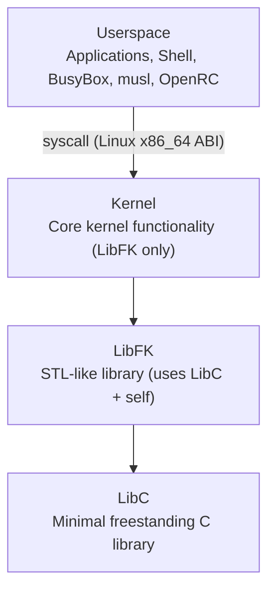
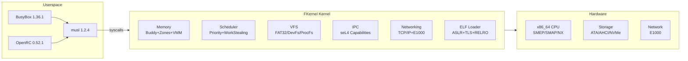

# FKernel Architecture Overview

## System Architecture

FKernel follows a **layered architecture** inspired by BSD/XNU with strict separation of concerns:

### System Context

## Architectural Identity

FKernel is a **hybrid kernel** -- see [design-philosophy.md](design-philosophy.md) for full rationale:
- **ABI**: Linux x86_64 (syscall numbers, ELF loading)
- **Internals**: BSD-inspired (VFS, scheduler, process model, kqueue, driver framework)
- **Practices**: Rust-style errors, seL4 capabilities, Object Calisthenics

## Project Status

**Completion**: ~75% -- boots to userspace with BusyBox 1.36.1 (~60 applets, ~40 fully functional)
**POSIX Compliance**: ~30-35% (Phase 14 complete, ~40 networking syscalls missing)
**Immediate Priority**: Fix ~76 open bugs (19 P0 + 15 High + 8 Concurrency + 22 Driver), build OpenRC
**Long-term Goal**: Full POSIX compliance -> OpenRC boot -> multi-service OS

## Architectural Principles

### 1. Strict Layer Separation
- **LibC**: Minimal C standard library (strings, memory, types) -- C17 freestanding
- **LibFK**: STL-like containers and utilities (uses only LibC) -- C++20 freestanding
- **Kernel**: Core kernel functionality (uses only LibFK, NEVER LibC)

### 2. Domain-Based Organization
- Each directory represents a **cohesive domain**
- Files contain **exactly one** struct/class (SECRET RULE)
- Self-documenting hierarchy

### 3. Object Calisthenics
- Max 200 lines per class, 20 lines per method
- No `else` keyword, one dot per line
- Max 2 instance variables per class
- Rich domain models, no getters/setters

### 4. Hardware Compatibility
- ACPI-driven discovery (HPET, MCFG/ECAM, MADT)
- PCI driver matching (class/subclass based)
- Supports real hardware, not just QEMU

## Key Domains

### Core Kernel Domains
- **Memory**: Physical (Buddy+Zones), Virtual (4-level paging), Object (Slab)
- **Process**: Task management, scheduling (priority queues + load balancing), IPC
- **Hardware**: CPU, ACPI, PCI, APIC/IOAPIC, MSI-X
- **Filesystem**: VFS (BSD-style dentry/vnode/mount), FAT12/16/32, DevFs, ProcFs, TmpFs
- **Drivers**: Storage (ATA/AHCI/NVMe), Network (E1000), PS/2 mouse, Serial, PTY, USB (headers)
- **Syscalls**: POSIX-compatible Linux x86_64 interface (~139 registered syscalls)

### Networking (Full Stack)
- **E1000**: MMIO, RX/TX rings, MAC
- **IPv4**: TCP, UDP, ARP, ICMP
- **Sockets**: AF_UNIX, AF_INET
- **Advanced**: TCP sliding window, routing table, DHCP client, DNS resolver

### Security & Isolation
- **Capabilities**: seL4-style fine-grained rights (send/receive/manage)
- **IPC**: Secure inter-process communication with cspace + revocation
- **ELF Security**: ASLR, NX, SMEP, SMAP, RELRO, TLS
- **Memory**: NX pages, user/kernel isolation, SMAP/SMEP enabled

## Design Patterns

### Error Handling
- `Result<T, Error>` for fallible operations
- `Optional<T>` for nullable values
- `TRY` macro for error propagation
- No exceptions, no RTTI

### Memory Management
- RAII with smart pointers (`OwnPtr`, `RefPtr`)
- Stack allocation preferred
- No C++ standard library

### Hardware Interaction
- Strategy pattern for different hardware types
- Abstract interfaces with concrete implementations
- Volatile access for MMIO registers

## Technology Stack

- **Language**: C++20 (freestanding), C17 (LibC), NASM (assembly)
- **Build System**: XMake (Lua-based)
- **Compiler**: Clang/LLD with freestanding flags (`-ffreestanding`, `-fno-exceptions`, `-fno-rtti`)
- **Boot**: GRUB + Multiboot2
- **Testing**: Custom framework (coverage targets: LibC 90%, LibFK 85%, Kernel 75%)
- **Userland**: BusyBox 1.36.1 + musl 1.2.4 + OpenRC 0.52.1

## Development Philosophy

1. **Extensible over Rewritable**: Build on existing abstractions
2. **Strategy Pattern Consistency**: Maintain architectural coherence
3. **Code Quality First**: Object Calisthenics non-negotiable
4. **Security by Design**: Capabilities, isolation, minimal trust
5. **Hardware Realism**: Support real hardware, not just emulation
6. **ABI Pragmatism**: Linux compatibility for userspace, BSD design for kernel internals
