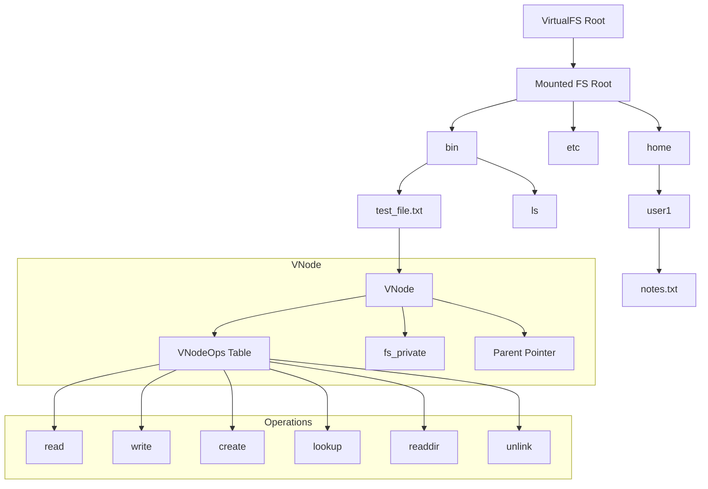

# FKernel: Implement a Filesystem from scratch

This guide shows how implement a basic filesystem on FKernel. 

The approach is generic and can be adapted to different types of filesystems:

- Ram-based
- Disk-based
- Network-based
...



## Explanation of the Diagram

1. VirtualFS Root

- Singleton entry point: `VirtualFS::the()`.

- Mounted filesystems appear under directories like `/mnt`.

2. VNode Structure

- Every file/directory is a VNode.

- Each VNode has:

* `VNodeOps` table → defines behavior.

* `fs_private` → filesystem-specific data (e.g., `RamFile`).

* `parent` → pointer to parent directory.

* `dir_entries` → child nodes if it’s a directory.

## Operations Flow

- `read` → fetch content from `fs_private`.

- `write` → update `fs_private`.

- `create` → add a new child VNode to `dir_entries`.

- `lookup` → search a child in `dir_entries`.

- `readdir` → list all children in `dir_entries`.

- `unlink` → remove a child from `dir_entries`.


## 1. Define the Core Structure 

A filesystem in FKernel is a built around [**VNodes _(Virtual Nodes)_**](https://www.filesystems.org/docs/linux-stacking/node1.html) that represents: 

* Files
* Directory

or another objects.

Each `VNodeOps` table to define its operations. 

```cpp
struct VNode {
    fixed_string<64> m_name;
    VNodeType type;
    uint32_t permission;
    uint64_t size;
    VNodeOps* ops;         // Pointer to operations table
    void* fs_private;      // Filesystem-specific data (like RamFile)
    RetainPtr<VNode> parent;
    static_vector<DirEntry, 16> dir_entries;

    int read(void* buf, size_t sz, size_t off);
    int write(const void* buf, size_t sz, size_t off);
    int create(const char* name, VNodeType type, RetainPtr<VNode>& out);
    int lookup(const char* name, RetainPtr<VNode>& out);
};
```

## 2. Define the VNode Operations 

`VNodeOps` is an interface for filesystem operations.
Every VNode will have a pointer to its ops table. 

```cpp
struct VNodeOps {
    int (*read)(VNode* vnode, void* buffer, size_t size, size_t offset);
    int (*write)(VNode* vnode, const void* buffer, size_t size, size_t offset);
    int (*open)(VNode* vnode, int flags);
    int (*close)(VNode* vnode);
    int (*lookup)(VNode* vnode, const char* name, RetainPtr<VNode>& result);
    int (*create)(VNode* vnode, const char* name, VNodeType type, RetainPtr<VNode>& result);
    int (*readdir)(VNode* vnode, void* dirent_buffer, size_t max_entries);
    int (*unlink)(VNode* vnode, const char* name);
};
```

>[!NOTE]
> Every VNode has a pointer to its ops table (VNodeOps* ops). Without it, the VNode cannot be accessed.

## 3. Create a Filesystem-Specific Structures

Each filesystem can define your own data structures. For example:

```cpp
struct MyFile {
    char name[256];
    uint8_t data[1024];
    size_t size{0};
};

struct MyFS {
    RetainPtr<VNode> m_root;

    static int myfs_read(VNode* vnode, void* buffer, size_t size, size_t offset);
    static int myfs_write(VNode* vnode, const void* buffer, size_t size, size_t offset);
    static int myfs_create(VNode* vnode, const char* name, VNodeType type, RetainPtr<VNode>& out);
    static int myfs_readdir(VNode* vnode, void* buffer, size_t max_entries);
    
    static VNodeOps ops;
};
```

## 4. Implement a Basic Operations
Operations should access `fs_private` to read/write data.

```cpp
int MyFS::myfs_write(VNode* vnode, const void* buffer, size_t size, size_t offset) {
    MyFile* file = reinterpret_cast<MyFile*>(vnode->fs_private);
    if (!file) return -1;

    size_t max_size = sizeof(file->data);
    size_t to_write = (size < max_size - offset) ? size : max_size - offset;

    memcpy(file->data + offset, buffer, to_write);
    file->size = std::max(file->size, offset + to_write);
    vnode->size = file->size;

    return static_cast<int>(to_write);
}
```

>[!TIP]
> Always check for null pointers and bounds to prevent memory corruption.

## 5. Create and Lookup Files 

VNodes representing directories can contain child VNodes in ` dir_entries`.

```cpp
int MyFS::myfs_create(VNode* vnode, const char* name, VNodeType type, RetainPtr<VNode>& out) {
    auto child = adopt_retain(new VNode());
    child->m_name = name;
    child->type = type;
    child->parent = vnode;
    child->ops = &ops;

    if (type == VNodeType::Regular)
        child->fs_private = new MyFile();

    vnode->dir_entries.push_back(DirEntry{name, child});
    out = child;
    return 0;
}

int MyFS::myfs_lookup(VNode* vnode, const char* name, RetainPtr<VNode>& out) {
    for (auto& entry : vnode->dir_entries) {
        if (strcmp(entry.m_name.c_str(), name) == 0) {
            out = entry.m_vnode;
            return 0;
        }
    }
    return -1;
}
```

## 6. Mounting the Filesystem

FKernel provides a `VirtualFS` singleton to mount filesystems:

```cpp
VirtualFS::the().mount("/mnt", my_fs_root);
``` 

After mounting, all VNodes in the filesystem can be accessed via absolute paths:

```cpp
RetainPtr<VNode> file;
VirtualFS::the().lookup("/mnt/bin/test_file.txt", file);
```

## 7. Directory Listing 

```cpp 
DirEntry buffer[32];
int n = vnode->ops->readdir(vnode.get(), buffer, 32);
for (int i = 0; i < n; ++i) {
    printf("%s\n", buffer[i].m_name.c_str());
}

## Recent changes (branch: feature/init)

Note for filesystem implementers:

- Partition-aware device nodes are now created by the ATA controller. When writing a DiskFS, prefer to accept a partition VNode (e.g. `/dev/ada0p1`) and perform block I/O via the VNodeOps provided by the partition node.
- A `PartitionBlockDevice` adapter exists to translate partition-relative offsets into LBA-based requests to the underlying disk; you do not need to perform manual offset math when using those VNodes.

Design tip: keep your DiskFS mount code small and accept a `VNode` representing a block device; if your code needs direct access to the raw disk image, document the requirement and provide safe checks.
```
