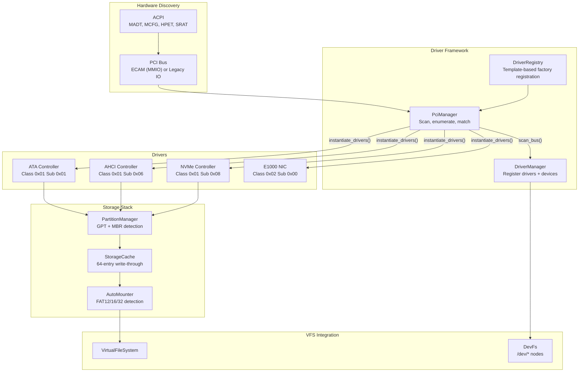
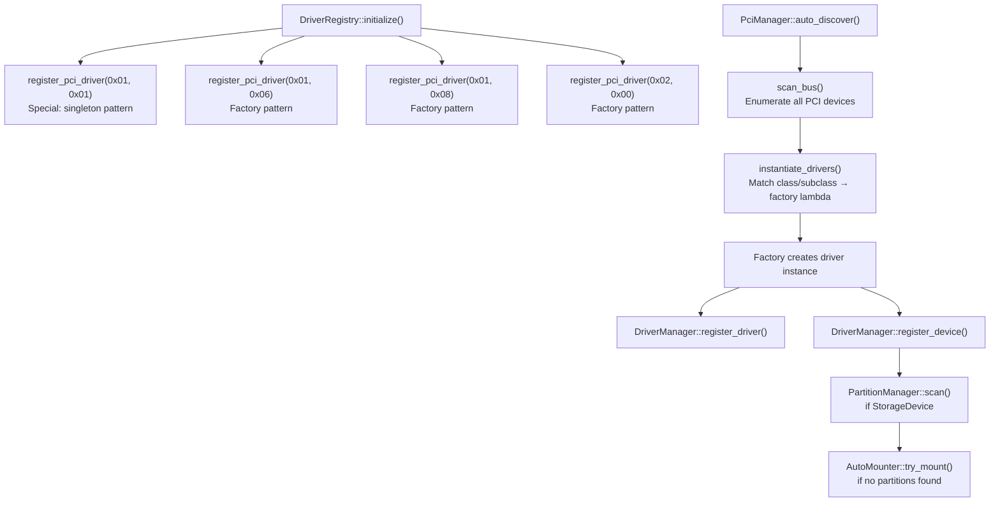
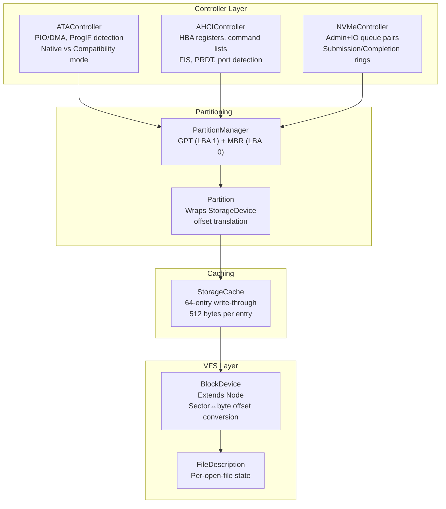
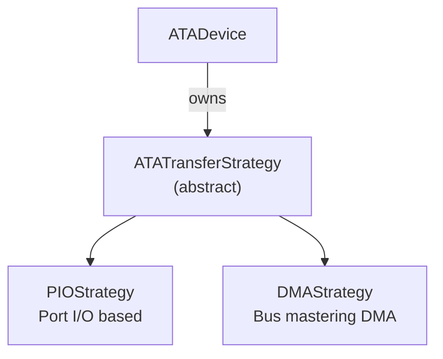
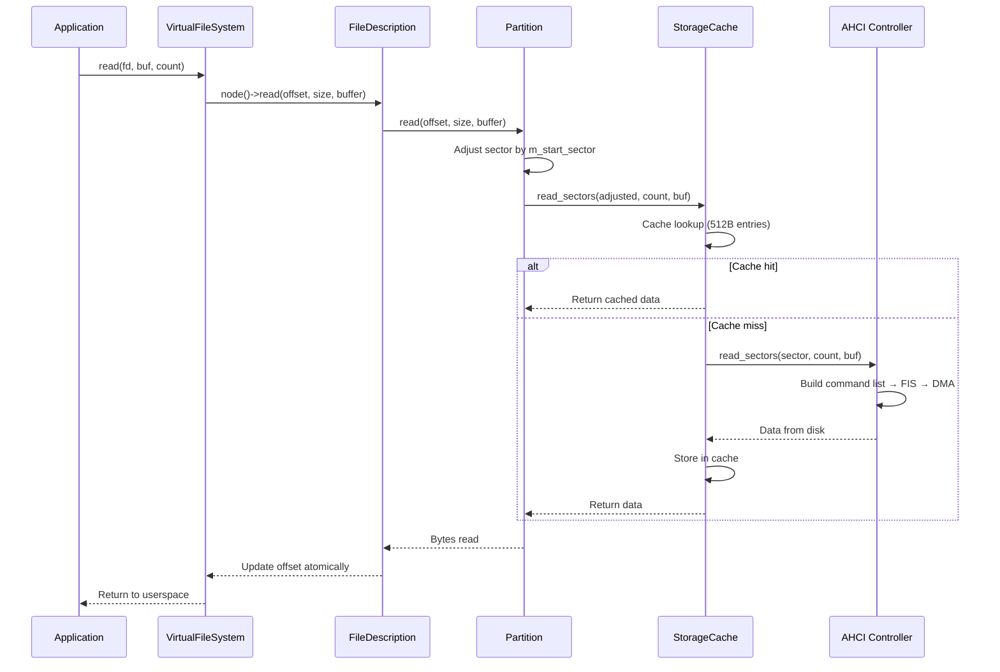
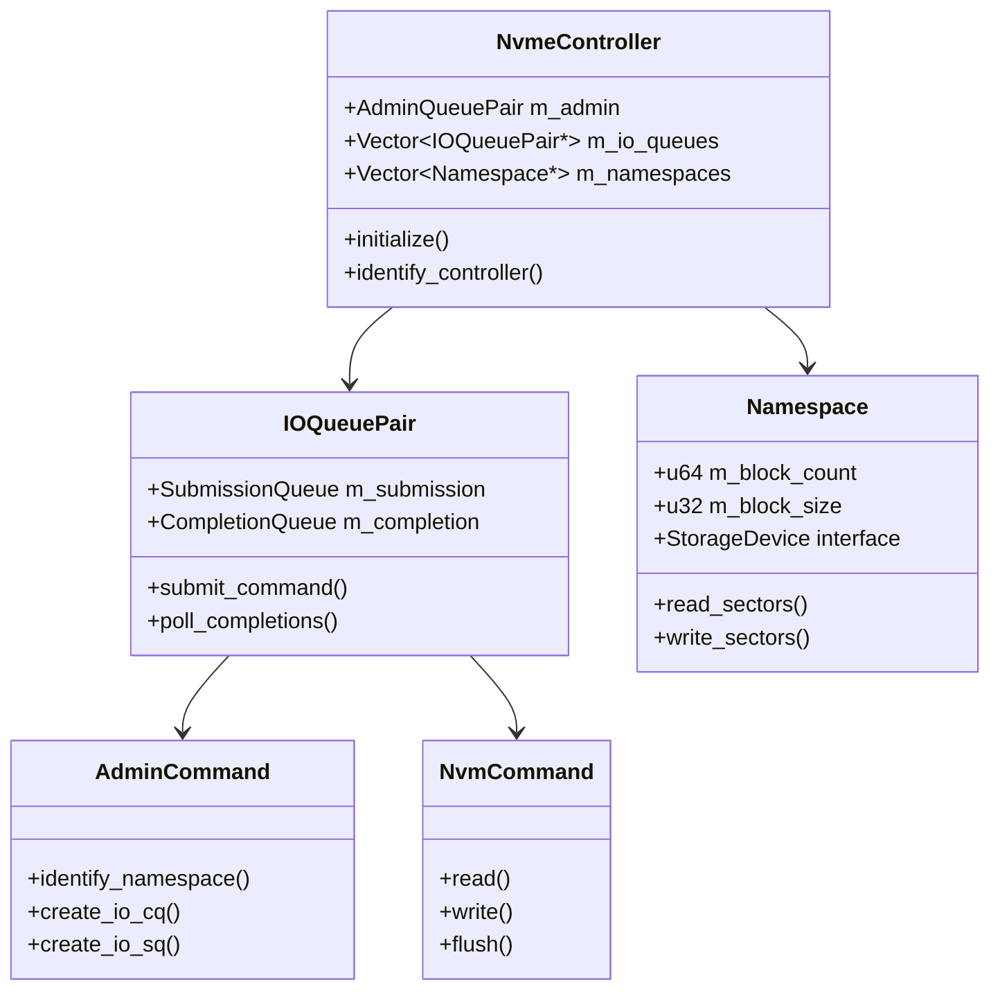
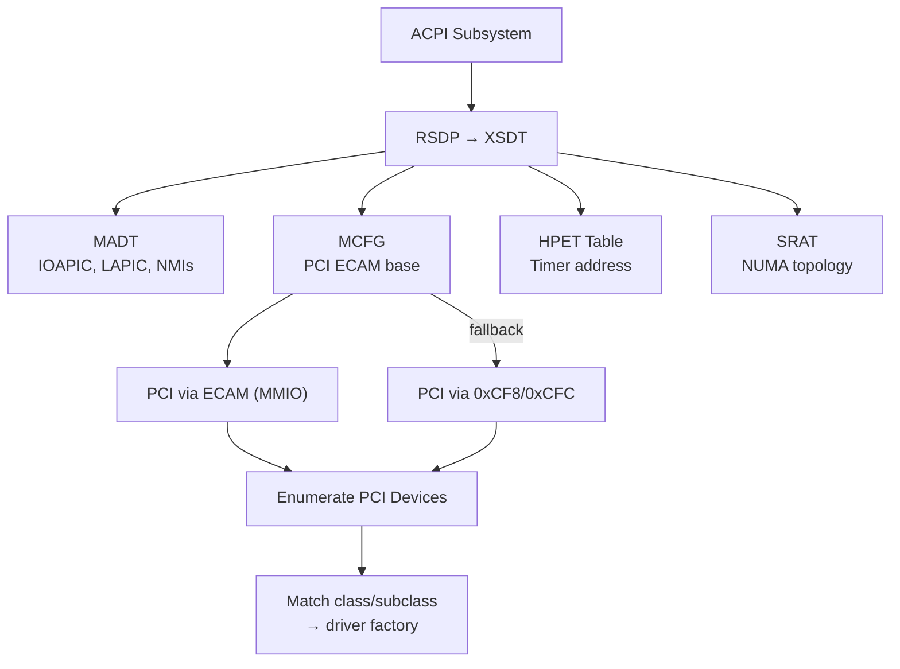
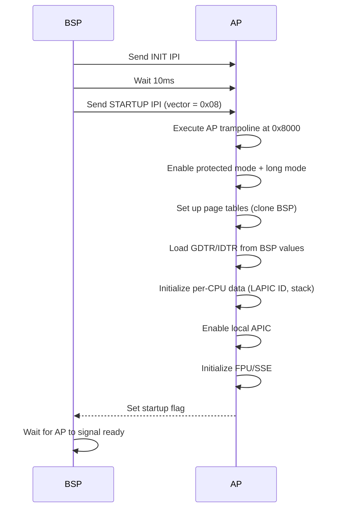

# Driver Framework

## Overview

FKernel's driver framework is inspired by **FreeBSD's Newbus** -- drivers register for device classes, and the PCI subsystem matches devices to drivers automatically. The framework supports storage, network, input, and terminal devices.

## Architecture

## PCI Driver Matching (Newbus-inspired)

### Registration Flow

### Device Classes

| Class | Subclass | Driver | Pattern |
|-------|----------|--------|---------|
| 0x01 (Mass Storage) | 0x01 (IDE) | ATA Controller | Singleton |
| 0x01 (Mass Storage) | 0x06 (AHCI) | AHCI Controller | Factory |
| 0x01 (Mass Storage) | 0x08 (NVMe) | NVMe Controller | Factory |
| 0x02 (Network) | 0x00 (Ethernet) | E1000 | Factory |

### Driver Implementation Status

| Driver | Status | Notes |
|--------|--------|-------|
| ATA | ✅ | PIO and DMA modes (strategy pattern) |
| AHCI | ✅ | Full HBA, command lists, FIS, PRDT |
| NVMe | ✅ | Controller/Namespace/Queue/Command decomposition |
| E1000 | ✅ | Interrupt-driven, full duplex |
| HPET | ✅ | System timer from ACPI HPET table |
| PS/2 Keyboard | ✅ | IRQ1, scancode translation |
| PS/2 Mouse | ✅ | IRQ12, 3-byte packet decoding |
| VGA Text Mode | ✅ | 80x25, ANSI parser |
| Framebuffer | ✅ | ANSI parser |

## Storage Stack

### ATA Strategy Pattern

### Data Flow (Read from Disk)

### NVMe Controller Decomposition

The NVMe driver is decomposed into four classes:

## Network Drivers

### E1000 (Intel Gigabit Ethernet)

- MMIO register access via BAR0
- RX/TX descriptor rings (128 entries each)
- MAC address from RAL/RAH registers (EEPROM)
- PCI bus mastering enabled for DMA
- Interrupt-driven TX/RX (full duplex)

## Input Drivers

| Device | Interface | Device Node | Notes |
|--------|-----------|-------------|-------|
| PS/2 Mouse | IRQ12 | `/dev/mouse` | 3-byte packet decoding |
| Serial Terminal | UART polling | `/dev/ttyS0` | Read via DR bit, write via THR |
| Keyboard | IRQ1 | (internal) | PS/2 scancode set |

## Terminal Drivers

### Pseudo-Terminal (PTY)

- `PtyMaster` / `PtySlave` / `PtyBuffer`
- `SYS_OPENPTY=503` syscall for userspace allocation
- `/dev/ptmx` pseudo-device
- Blocking reads via `Notification::wait()`

### VGATerminal

- Hardware VGA text mode (80x25)
- Terminal I/O control: TCGETS/TCSETS (echo, raw mode)
- Job control: TIOCGPGRP/TIOCSPGRP/TIOCSCTTY
- Foreground process group signal delivery (Ctrl+C/Z/\)
- Window size reporting (TIOCGWINSZ)

## Hardware Discovery

### ACPI Status

| Table | Status | Notes |
|-------|--------|-------|
| FADT | Partial | Complete ACPI 6.x fields pending |
| HPET | ✅ | Address from ACPI table (was hardcoded) |
| MCFG | ✅ | ECAM base, legacy fallback |
| MADT | ✅ | IOAPIC, LAPIC from MSR |
| SRAT | 60% | NUMA topology parsing |
| DSDT/SSDT | ❌ | AML interpreter pending |
| DMAR | ✅ | DMA remapping supported |

### DMAR (DMA Remapping)

The DMAR (DMA Remapping) table provides IOMMU/VT-d information:

- **DRHD (DMA Remapping Hardware Definition)**: Identifies IOMMU units and their scope
- **RMRR (Reserved Memory Region Reporting)**: Reserved memory regions requiring identity mapping
- DMA remapping is supported for device isolation and security

## SMP Boot

The SMP boot path starts Application Processors (APs) via the INIT/STARTUP IPI sequence:

### Per-CPU Data

Each CPU has a dedicated per-CPU data structure accessible via `GS_BASE`:

- LAPIC ID
- Kernel stack pointer
- Process idling state
- Scheduler run queue
- Local timer state

## Key Design Decisions

- **Newbus-style PCI matching** over Linux's `struct pci_driver` — simpler, class-based
- **Strategy pattern**: Abstract driver interfaces with concrete implementations (ATA PIO vs DMA)
- **Dual-inheritance controllers**: AHCI/NVMe are both `Driver` and `StorageDevice`
- **Partition as StorageDevice**: Transparent offset, can be mounted directly in VFS
- **Polling-based storage** currently (interrupt-driven removed for code quality)
- **ACPI-driven discovery** over hardcoded addresses (progressive removal complete)
- **VFS integration**: All devices appear as files in `/dev`
