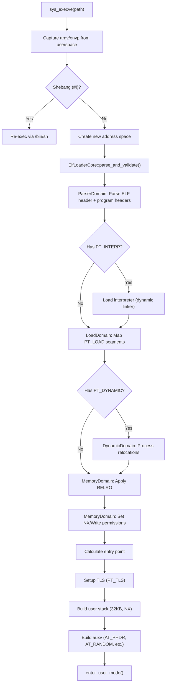
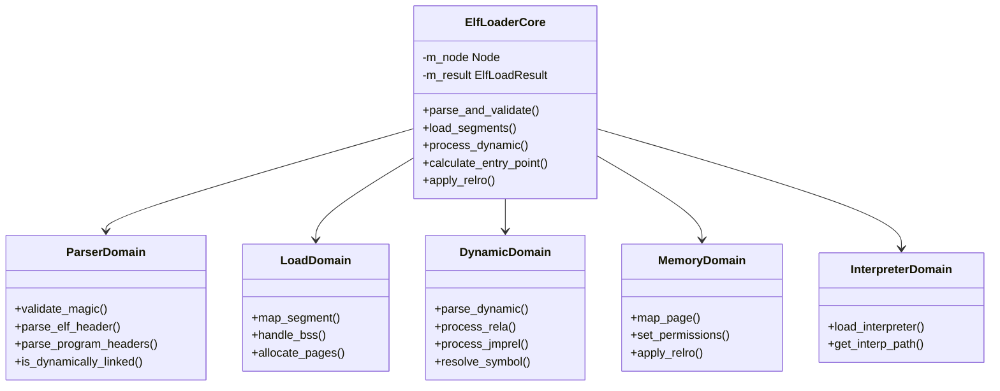

# ELF Loader

## Overview

FKernel's ELF loader handles loading ELF64 executables (ET_EXEC and ET_DYN) with full support for dynamic linking, ASLR, TLS, and RELRO. The loader is decomposed into domain objects for clean separation of concerns.

## Loading Pipeline

## Domain Objects

## Supported Features

### Program Headers Processed
| Type | Purpose |
|------|---------|
| `PT_LOAD` | Loadable segments (code, data, BSS) |
| `PT_DYNAMIC` | Dynamic linking information |
| `PT_INTERP` | Interpreter (dynamic linker) path |
| `PT_TLS` | Thread-local storage template |
| `PT_GNU_STACK` | Stack permissions (NX enforcement) |
| `PT_GNU_RELRO` | Read-only after relocation |
| `PT_PHDR` | Program header table location (for auxv) |

### Relocation Types
| Type | Action |
|------|--------|
| `R_X86_64_RELATIVE` | Base + addend |
| `R_X86_64_64` | Symbol + addend |
| `R_X86_64_GLOB_DAT` | Global data symbol |
| `R_X86_64_JUMP_SLOT` | PLT/GOT entry (eager binding) |

### Security Features
- **ASLR**: ET_DYN randomized base in [0x10000000, 0x70000000)
- **NX**: Non-executable stack by default (PT_GNU_STACK)
- **RELRO**: Full RELRO — GOT made read-only after relocations
- **Bounds checking**: e_phoff, e_phnum validated against file size
- **Architecture check**: e_machine must be EM_X86_64

### TLS (Variant II)
- TLS block allocated at 0x7FFFFE000000
- Self-referencing thread pointer
- FS_BASE set via arch_prctl

## Key Files

| File | Lines | Purpose |
|------|-------|---------|
| `elf_loader.cpp` | 17 | Entry point, delegates to ElfLoaderCore |
| `elf_loader_core.cpp` | 198 | Pipeline orchestration |
| `parser_domain.cpp` | 92 | ELF header validation, ASLR base |
| `load_domain.cpp` | ~100 | PT_LOAD segment mapping |
| `dynamic_domain.cpp` | 144 | Relocation processing |
| `memory_domain.cpp` | 106 | Page allocation, permissions |
| `interpreter_domain.cpp` | 94 | Dynamic linker loading |
