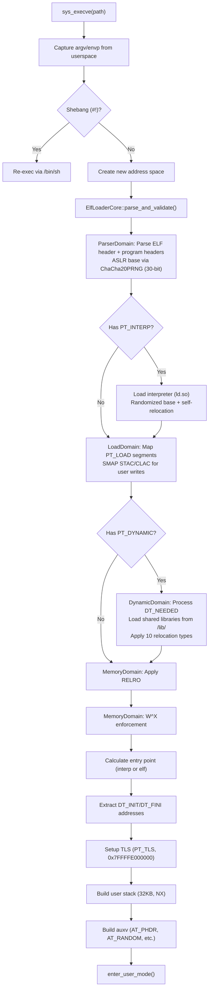
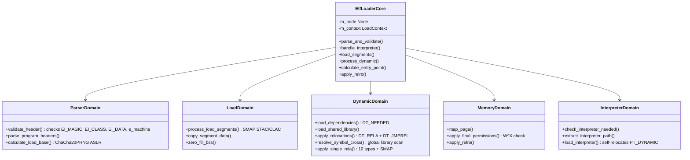

# ELF Loader

## Overview

FKernel's ELF loader handles loading ELF64 executables (ET_EXEC and ET_DYN) with full support for dynamic linking (DT_NEEDED shared libraries, ld.so self-relocation), ASLR (ChaCha20PRNG, 30-bit entropy), W^X enforcement, full RELRO, TLS (Variant II), SMAP-safe user memory access, and cross-object symbol resolution.

## Loading Pipeline

## Domain Objects

## Dynamic Linking

### DT_NEEDED Pipeline

1. `load_dependencies()` scans `DT_NEEDED` entries in dynamic segment, deduplicates via global `s_global_libraries`
2. `load_shared_library()` opens `/lib/<name>` via VFS, parses ELF header + PHDRs, loads PT_LOAD segments, extracts symtab/strtab, applies relocations
3. Libraries registered in global `LibraryContext` vector for cross-object symbol resolution

### Cross-Object Symbol Resolution

`resolve_symbol_cross()` — if local resolution fails for `SHN_UNDEF` symbols:
1. Tries matching `sym_idx` in each library's symtab
2. Falls back to linear name scan (up to 65536 entries per library)
3. Handles `SHN_COMMON` (returns 0 with debug log)

### Relocation Types

All 10 X86_64 relocation types implemented with SMAP STAC/CLAC:

| Type | Action |
|------|--------|
| `R_X86_64_NONE` | No-op |
| `R_X86_64_RELATIVE` | Base + addend |
| `R_X86_64_64` | Symbol value + addend |
| `R_X86_64_GLOB_DAT` | Global data symbol + addend |
| `R_X86_64_JUMP_SLOT` | PLT/GOT entry (eager binding) + addend |
| `R_X86_64_COPY` | Copy data from shared library (addend = size) |
| `R_X86_64_IRELATIVE` | Indirect function call (ifunc at base + addend) |
| `R_X86_64_TPOFF64` | TLS offset + symbol + addend |
| `R_X86_64_DTPMOD64` | TLS module ID (always 1) |
| `R_X86_64_DTPOFF64` | TLS offset within module + addend |

## Supported Features

### Program Headers Processed
| Type | Purpose |
|------|---------|
| `PT_LOAD` | Loadable segments (code, data, BSS) |
| `PT_DYNAMIC` | Dynamic linking information |
| `PT_INTERP` | Interpreter (dynamic linker) path |
| `PT_TLS` | Thread-local storage template |
| `PT_GNU_STACK` | Stack permissions (NX enforcement) |
| `PT_GNU_RELRO` | Read-only after relocation — all segments, start rounded UP, interpreter RELRO included |
| `PT_PHDR` | Program header table location (for auxv) |

### Security Features
- **ASLR**: ChaCha20PRNG with 30-bit entropy. Main executable: `[0x10000000, 0x70000000)`. ld.so base independently randomized.
- **NX**: ExecuteDisable on non-executable segments. PT_GNU_STACK enforces NX stack by default.
- **W^X**: `apply_final_permissions()` rejects segments with both Writable and !ExecuteDisable.
- **RELRO**: All PT_GNU_RELRO segments processed (no single-segment limit). Start rounded UP `(addr + 0xFFF) & ~0xFFF`. Interpreter RELRO applied.
- **SMAP**: `arch_smap_begin()`/`arch_smap_end()` in all user-memory write paths: `copy_segment_data`, `zero_fill_bss`, `apply_single_rela` targets, `map_single_page` zero-fill.
- **SMEP**: CR4.SMEP enabled — kernel cannot execute user pages.
- **Architecture check**: `e_machine` must be `EM_X86_64`.
- **Bounds checking**: `e_phoff`, `e_phnum`, and per-segment `p_offset + p_filesz` validated against file size.
- **Endianness checking**: `EI_DATA` verified to match host endianness (little-endian).

### Security Features Matrix

| Feature | Status | Details |
|---------|--------|---------|
| W^X | ✅ | Rejects Writable+Executable segments at load |
| RELRO | ✅ | All PT_GNU_RELRO segments, correct alignment |
| ASLR | ✅ | ChaCha20PRNG, 30-bit entropy, randomized ld.so |
| NX | ✅ | PT_GNU_STACK, non-exec segments |
| SMAP | ✅ | STAC/CLAC in all user-memory paths |
| SMEP | ✅ | CR4.SMEP enabled |
| kASLR | 🔄 Planned | Kernel image randomization |
| CET Shadow Stack | 🔄 Planned | Intel CET hardware shadow stack |
| Retpoline Injection | 🔄 Planned | Spectre v2 mitigation |

### TLS (Variant II)
- TLS block allocated at `0x7FFFFE000000`
- Self-referencing thread pointer (points to TLS block)
- FS_BASE set via `arch_prctl`
- Full relocation types for TLS: `R_X86_64_TPOFF64`, `R_X86_64_DTPMOD64`, `R_X86_64_DTPOFF64`

## Key Files

| File | Lines | Purpose |
|------|-------|---------|
| `elf_loader.cpp` | ~17 | Entry point, delegates to ElfLoaderCore |
| `elf_loader_core.cpp` | ~260 | Pipeline orchestration, RELRO, entry point, init/fini extraction |
| `parser_domain.cpp` | ~92 | ELF header validation, ASLR base via ChaCha20PRNG |
| `load_domain.cpp` | ~100 | PT_LOAD segment mapping with SMAP |
| `dynamic_domain.cpp` | ~367 | DT_NEEDED loading, all 10 relocations, cross-object symbols |
| `memory_domain.cpp` | ~106 | Page allocation, W^X enforcement, final permissions |
| `interpreter_domain.cpp` | ~94 | Dynamic linker loading, self-relocation |

## Notable Design Decisions

- **Domain-driven design**: Each concern isolated in its own class, independently testable
- **Global library registry**: `s_global_libraries` vector for cross-object symbol resolution
- **SMAP everywhere**: Every user-memory write uses `arch_smap_begin()`/`arch_smap_end()`
- **ChaCha20PRNG ASLR**: 30-bit entropy with hardware CSPRNG seed (was 16-bit deterministic)
- **All RELRO segments**: No break-after-first; start correctly rounded UP
- **W^X enforcement**: Rejects Writable+Executable segments at load time
- **Init/fini extraction**: DT_INIT, DT_FINI, DT_INIT_ARRAY, DT_FINI_ARRAY addresses in load result

## Current Status

~90% complete. ET_EXEC and ET_DYN loading fully functional. Dynamic linking with DT_NEEDED + shared library loading + ld.so self-relocation. All 10 X86_64 relocation types. Cross-object symbol resolution via global library registry. ASLR with ChaCha20PRNG + 30-bit entropy + randomized ld.so base. Full RELRO (all segments, correct alignment, interpreter RELRO). W^X enforcement. SMAP STAC/CLAC safety. TLS Variant II at 0x7FFFFE000000. Init/fini addresses extracted. Endianness checking (EI_DATA) implemented. Per-segment file-size bounds checking implemented. Remaining: symbol versioning (DT_VERSYM/DT_VERNEED macros defined, parsing not implemented). ET_REL not yet supported. Planned security features: kASLR, Intel CET shadow stack, retpoline injection.
