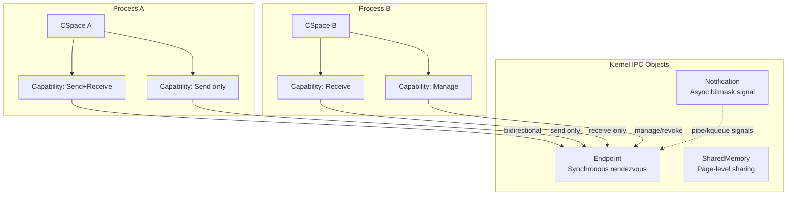
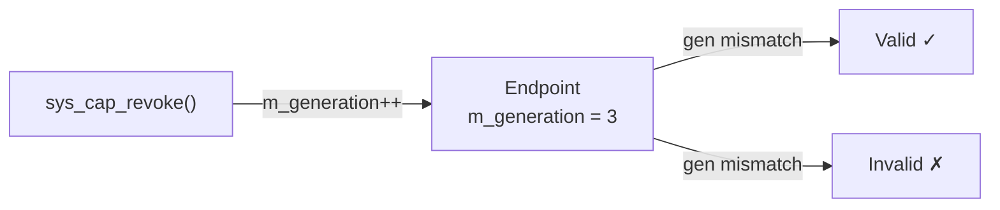
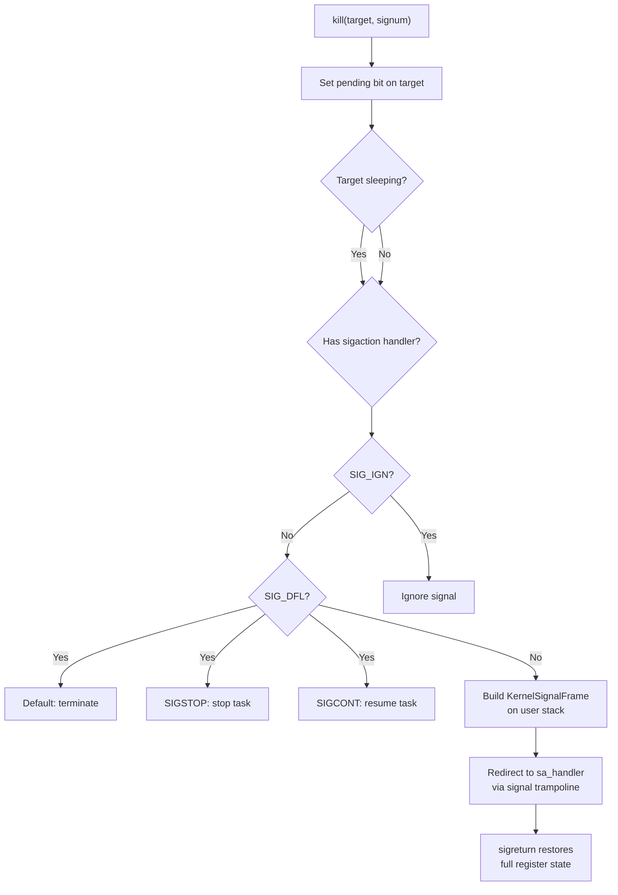
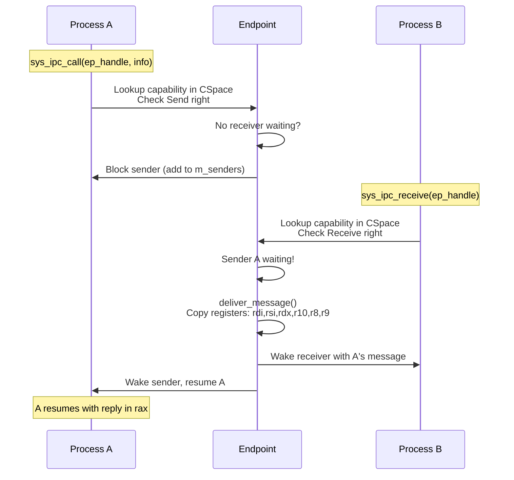
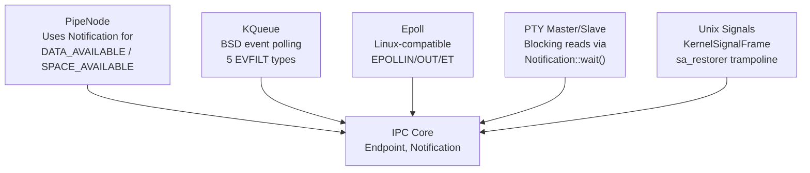
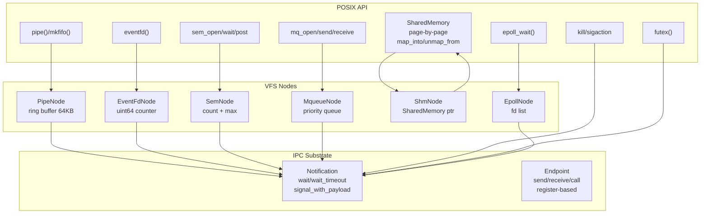

# IPC and Capabilities

## Overview

FKernel's IPC subsystem is inspired by **seL4's capability-based model**. Instead of traditional Unix IPC (pipes, signals, sockets), FKernel uses **capabilities** for fine-grained access control over communication channels.

## Architecture



## Capability Model

### Core Concepts
- **Capability**: An unforgeable token granting access to a kernel object
- **CSpace**: Per-task capability table (slot array with free-list)
- **Rights**: Bitmask controlling allowed operations on a capability
- **Revocation**: Invalidation of capabilities via generation counter

### Rights

| Right | Permission |
|-------|-----------|
| `Send` | Send a message through this capability |
| `Receive` | Receive a message through this capability |
| `Manage` | Modify/move/revoke this capability |

### Capability Types

| Type | Kernel Object | Access |
|------|--------------|--------|
| `Endpoint` | Synchronous IPC channel | Send, Receive, Manage |
| `IRQ` | Interrupt line binding | Ack, Manage |
| `IO` | I/O port range | In, Out, Manage |
| `Memory` | Physical memory region | Map, Read, Write, Manage |
| `Node` | VFS filesystem node | Read, Write, Lookup, Manage |
| `Process` | Process handle | Kill, Signal, Manage |
| `Thread` | Thread handle | Suspend, Resume, SetPriority, Manage |
| `SharedMemory` | Shared memory region | Map, Read, Write, Manage |

### CSpace

- Array of capability slots per task
- Free-list for O(1) slot allocation
- Each slot holds: pointer to kernel object, rights mask, generation counter
- `cspace_insert()` copies a capability between CSpaces with rights masking

### Revocation Mechanism



No need to search all process CSpaces — just increment the generation counter and capabilities become invalid on next use.

### Revocation Details

Revocation uses a **lazy** strategy: each Capability stores an `m_issued_generation` from the moment of its creation/transfer. The kernel object holds a `m_revoke_counter` (monotonically incrementing generation). On `revoke()`, the counter increments — all existing capabilities with a stale generation become invalid on next use without scanning CSpaces.

```cpp
struct Capability {
  CapabilityType m_type;
  Rights m_rights;
  uint64_t m_revoke_counter;   // matches object's counter at issuance
  uint64_t m_generation;       // CSpace slot generation for reuse
  KernelObject* m_object;
};

struct KernelObject {
  uint64_t m_revoke_counter;   // incremented on each revoke()
};
```

- `sys_cap_revoke(handle)`: increments `object->m_revoke_counter`, invalidates all copies
- `check_validity()`: compares `cap->m_revoke_counter == object->m_revoke_counter`
- No CSpace traversal required — O(1) per capability check

## IPC Primitives

### Migration from Port-Based IPC

Earlier FKernel versions used a **port** abstraction (similar to L4) for message passing. The current architecture migrates to **Endpoint** as the sole synchronous IPC primitive:

| Aspect | Old (Port) | Current (Endpoint) |
|--------|-----------|-------------------|
| Binding | Port needs explicit binding | Endpoint referenced via capability |
| Wait queues | Single shared queue | Separate `m_senders` / `m_receivers` |
| Reply routing | Port-based reply | Direct `m_call_sender` tracking |
| Capability transfer | Not supported | `send_cap()` / `recv_cap()` |
| Revocation | Port deletion | Generation counter (O(1)) |

### IPC Syscalls

| Syscall | Purpose |
|---------|---------|
| `sys_ipc_send(ep_handle, msg_info, args...)` | Send message via Endpoint capability |
| `sys_ipc_recv(ep_handle, msg_info)` | Receive message via Endpoint capability |
| `sys_ipc_send_cap(ep_handle, cap_handle)` | Transfer a capability through an Endpoint |
| `sys_ipc_recv_cap(ep_handle)` | Receive a capability through an Endpoint |
| `sys_ipc_call(ep_handle, msg_info, args...)` | Atomic send+recv (blocking RPC) |
| `sys_cap_grant(pid, local_handle, rights)` | Copy capability to another process's CSpace |
| `sys_cap_revoke(handle)` | Increment revoke counter on kernel object |

Total syscall count: **207**.

### Endpoint

- Bidirectional synchronous rendezvous channel
- Separate `m_senders` and `m_receivers` wait lists (both `IntrusiveList<Task>`)
- `send()`: blocks sender if no receiver waiting, otherwise delivers immediately
- `receive()`: blocks receiver if no sender waiting, otherwise delivers immediately
- Message passing via CPU registers (rdi, rsi, rdx, r10, r8, r9) — zero-copy for short messages

### MessageInfo

Packed into a single 64-bit register:

```
[Label (48 bits) | Length (12 bits) | Flags (4 bits)]
```

### Notification

- Non-blocking signaling mechanism using a 64-bit bitmask (`m_pending_bits`)
- `signal(bits)`: sets bits, wakes waiting task with accumulated bits
- `wait()`: returns pending bits immediately or blocks until signal
- `poll()`: non-blocking check, returns and clears pending bits
- Same generation-based revocation as Endpoint

### Signal Delivery



## IPC Flow



## Integration with Other Subsystems



### Pipes
- `PipeNode` uses separate `Notification` objects for DATA_AVAILABLE and SPACE_AVAILABLE
- Reader blocks via `Notification::wait()`, writer signals via `Notification::signal()`

### KQueue
- BSD-style event notification with `EVFILT_READ`, `EVFILT_WRITE`, `EVFILT_PROC`, `EVFILT_SIGNAL`, `EVFILT_TIMER`
- Integrates with scheduler for proper blocking with timeout
- Used by `select()`/`poll()` implementations (epoll available as a separate VFS node)

### PTY
- `PtyMaster`/`PtySlave` block reader via `Notification::wait()`
- Writer signals reader via `Notification::signal()`

## Key Design Decisions

- **seL4-style capabilities** over traditional Unix permission model
- **Revocation via generation counter** (not reference counting) — O(1) revocation
- **Separate send/receive wait nodes** to prevent corruption
- **Register-passing IPC** — short messages in CPU registers, no memory copies
- **OS-level integration**: signals, pipes, kqueue all use underlying IPC primitives

### Userspace Drivers and Filesystems (Architectural Support)

The Capability model enables userspace drivers and filesystems natively:

1. **Userspace Drivers**: A driver process holds `IO` capabilities for port ranges and `IRQ` capabilities for interrupt lines. Interrupt delivery routes through Endpoint IPC (the IRQ capability is bound to an Endpoint, and the handler's `recv()` blocks waiting for interrupt notifications).

2. **Userspace Filesystems**: A filesystem process holds `Node` capabilities. The VFS layer can delegate `read()`/`write()`/`lookup()` operations via Endpoint IPC to a userspace server, analogous to FUSE but built directly on the capability primitives.

**Status**: Architectural foundation is complete (CSpace, Endpoint IPC, capability types). **Implementation: pending** — no userspace drivers or filesystem servers are active in the current boot flow.

## Enhanced IPC Primitives (2026-07-26)

### Notification::wait_timeout()

Blocks with a deadline. Returns delivered bits or 0 on timeout. Uses `sleep_current(ticks)` under the hood, allowing the scheduler timer to wake the task. The caller checks list membership after waking to distinguish timeout from signal.

```cpp
uint64_t timeout_ticks = freq * timeout_ms / 1000;
uint64_t result = notif.wait_timeout(timeout_ticks);
if (result == 0) // timeout
if (result > 0)  // signal received, result = accumulated bits
```

Used by: pipes O_NONBLOCK, eventfd O_NONBLOCK, epoll_wait with timeout, futex FUTEX_WAIT with timeout.

### Notification::signal_with_payload()

Enqueues a `NotificationPayload` (64-byte data + bitmask) alongside the signal. Up to 16 payloads buffered in a circular queue. Wakeup delivers accumulated bits; payload is accessible on next `poll()`.

```cpp
siginfo_t si = {.si_signo = SIGCHLD, .si_pid = child_pid, ...};
notif.signal_with_payload(1 << SIGCHLD, &si, sizeof(si));
```

Used by: signal delivery (siginfo_t → SA_SIGINFO handlers), eventfd value preservation.

### Endpoint::call()

Atomic send+receive: sends a message and immediately waits for a reply without allowing another task to intercept. The kernel marks the caller as `m_call_sender` so the reply is routed directly back.

```cpp
auto result = endpoint.call(MessageInfo::create(label, len, flags));
// result contains the reply MessageInfo
```

### Endpoint::send_timeout() / receive_timeout()

Time-bounded variants. Return `Error::Timeout` on expiry. Use same `sleep_current()` mechanism as `Notification::wait_timeout()`.

### SharedMemory

Page-by-page physical memory sharing. Allocates individual 4KB pages via `PhysicalMemoryManager::alloc_page()`. Maps into multiple tasks' address spaces via `VirtualMemoryManager::map_page()`.

```cpp
auto* shm = SharedMemory::create(4096);  // 1 page
shm->map_into(task_a, 0x700000000000, PageFlags::Present | PageFlags::Writable | PageFlags::User);
shm->map_into(task_b, 0x700000000000, PageFlags::Present | PageFlags::User);
shm->revoke();  // invalidates all capability holders
```

Integrated via `ShmNode` VFS node at `/dev/shm/`. `mmap(MAP_SHARED, fd)` calls `shm->map_into()`.

## POSIX over IPC Architecture

All POSIX IPC mechanisms are implemented as VFS nodes backed by native IPC primitives:



### Namespace Layout

```
/dev/
├── pts/       # PTY slaves (existing)
├── sem/       # POSIX named semaphores (SemDirNode → SemNode)
├── mqueue/    # POSIX message queues (MqueueDirNode → MqueueNode)
└── shm/       # POSIX shared memory (ShmDirNode → ShmNode)
```

### Capability Transfer

Runtime capability sharing between processes (see IPC syscall table above):

- `sys_cap_grant(pid, handle, rights_mask)` — copies capability from current CSpace to target
- `sys_ipc_send_cap(ep_handle, cap_handle)` — transfers a capability through an Endpoint
- `sys_ipc_recv_cap(ep_handle)` — receives a capability through an Endpoint

All transfer operations require `Manage` rights on the source capability.
