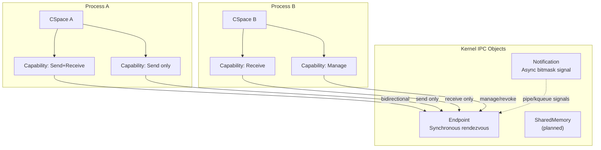
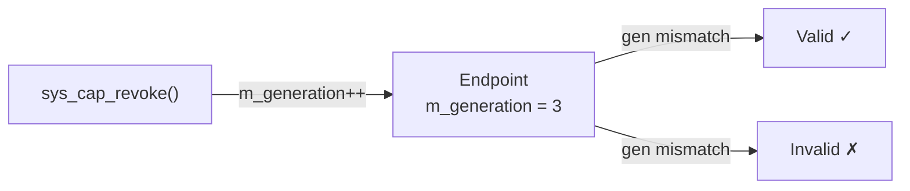
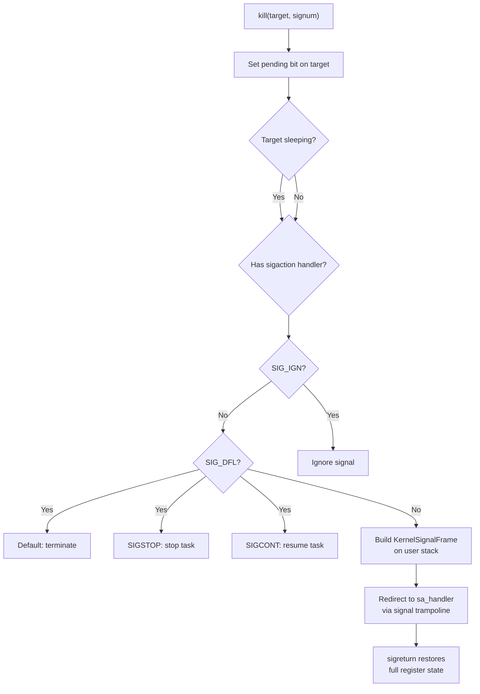
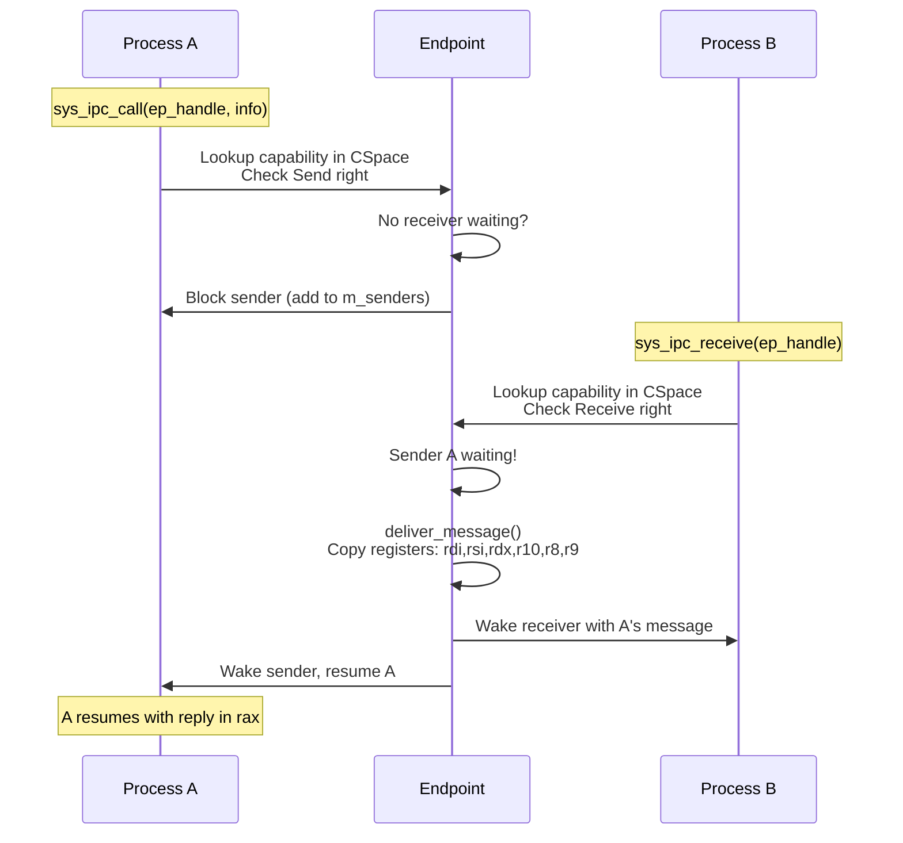
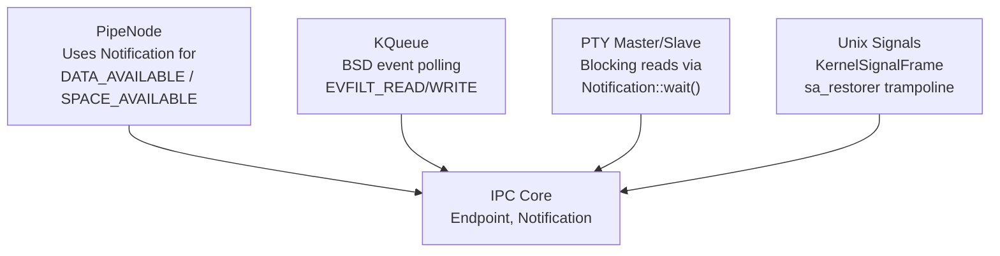

# IPC and Capabilities

## Overview

FKernel's IPC subsystem is inspired by **seL4's capability-based model**. Instead of traditional Unix IPC (pipes, signals, sockets), FKernel uses **capabilities** for fine-grained access control over communication channels.

## Architecture



## Capability Model

### Core Concepts
- **Capability**: An unforgeable token granting access to a kernel object
- **CSpace**: Per-task capability table (slot array with free-list)
- **Rights**: Bitmask controlling allowed operations on a capability
- **Revocation**: Invalidation of capabilities via generation counter

### Rights

| Right | Permission |
|-------|-----------|
| `Send` | Send a message through this capability |
| `Receive` | Receive a message through this capability |
| `Manage` | Modify/move/revoke this capability |

### CSpace

- Array of capability slots per task
- Free-list for O(1) slot allocation
- Each slot holds: pointer to kernel object, rights mask, generation counter
- `cspace_insert()` copies a capability between CSpaces with rights masking

### Revocation Mechanism



No need to search all process CSpaces — just increment the generation counter and capabilities become invalid on next use.

## IPC Primitives

### Endpoint

- Bidirectional synchronous rendezvous channel
- Separate `m_senders` and `m_receivers` wait lists (both `IntrusiveList<Task>`)
- `send()`: blocks sender if no receiver waiting, otherwise delivers immediately
- `receive()`: blocks receiver if no sender waiting, otherwise delivers immediately
- Message passing via CPU registers (rdi, rsi, rdx, r10, r8, r9) — zero-copy for short messages

### MessageInfo

Packed into a single 64-bit register:

```
[Label (48 bits) | Length (12 bits) | Flags (4 bits)]
```

### Notification

- Non-blocking signaling mechanism using a 64-bit bitmask (`m_pending_bits`)
- `signal(bits)`: sets bits, wakes waiting task with accumulated bits
- `wait()`: returns pending bits immediately or blocks until signal
- `poll()`: non-blocking check, returns and clears pending bits
- Same generation-based revocation as Endpoint

### Signal Delivery



## IPC Flow



## Integration with Other Subsystems



### Pipes
- `PipeNode` uses separate `Notification` objects for DATA_AVAILABLE and SPACE_AVAILABLE
- Reader blocks via `Notification::wait()`, writer signals via `Notification::signal()`

### KQueue
- BSD-style event notification (not epoll)
- Integrates with scheduler for proper blocking with timeout
- Used by `select()`/`poll()` implementations

### PTY
- `PtyMaster`/`PtySlave` block reader via `Notification::wait()`
- Writer signals reader via `Notification::signal()`

## Key Design Decisions

- **seL4-style capabilities** over traditional Unix permission model
- **Revocation via generation counter** (not reference counting) — O(1) revocation
- **Separate send/receive wait nodes** to prevent corruption
- **Register-passing IPC** — short messages in CPU registers, no memory copies
- **OS-level integration**: signals, pipes, kqueue all use underlying IPC primitives

## Security Properties

- Capabilities are kernel-managed, user-space cannot forge them
- Rights bitmask prevents privilege escalation
- Revocation is immediate and complete (generation mismatch)
- CSpace isolation between processes
- No ambient authority — all operations require explicit capability
