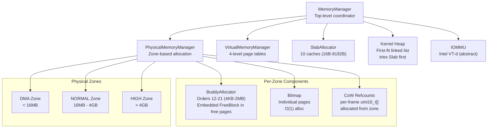
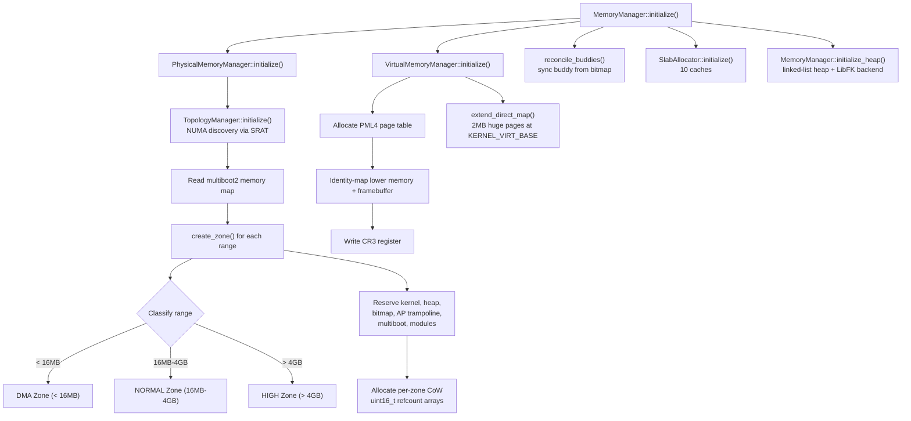
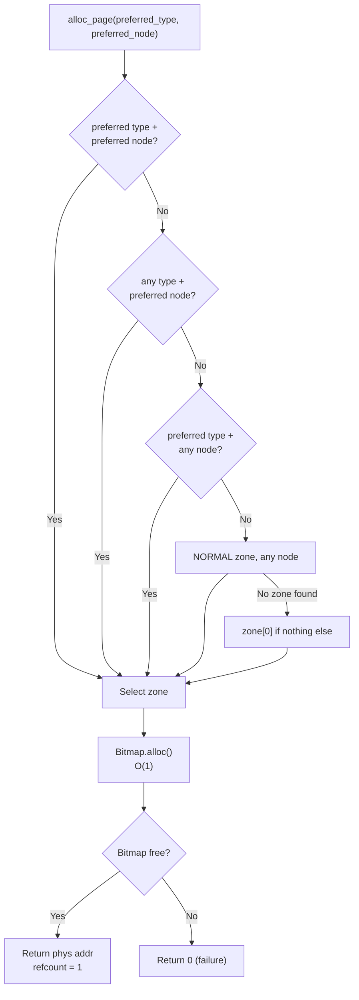
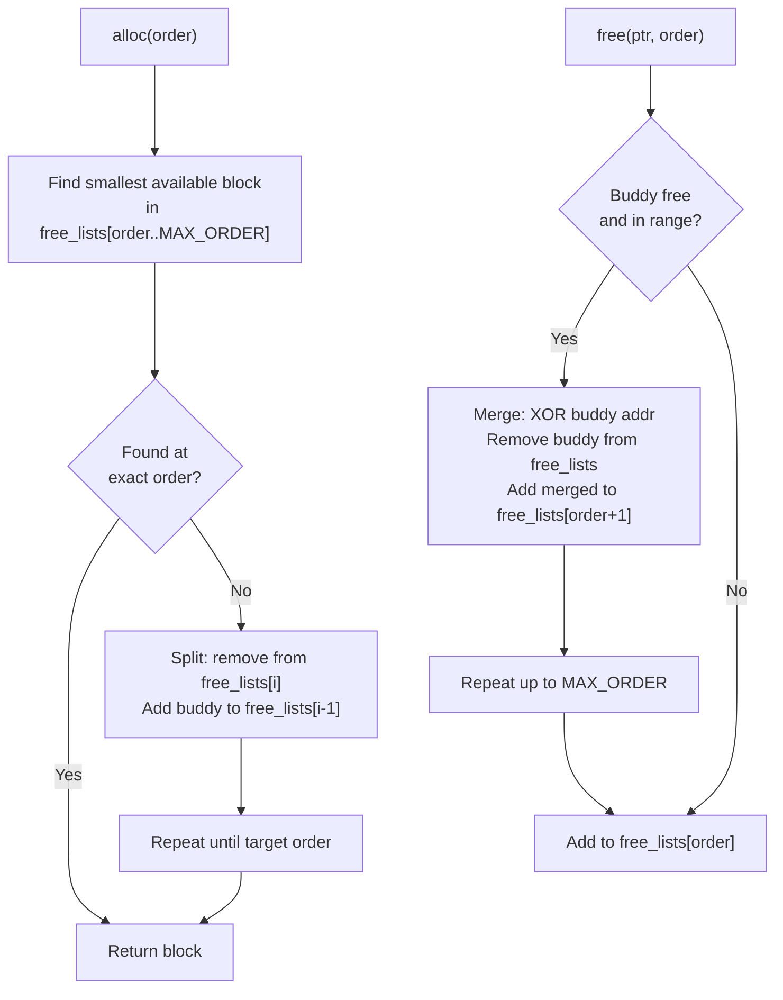
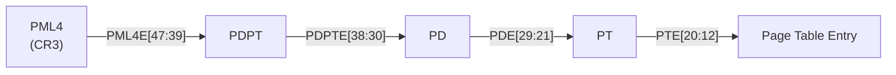
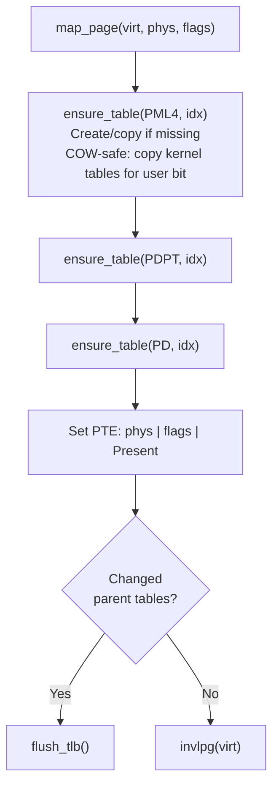
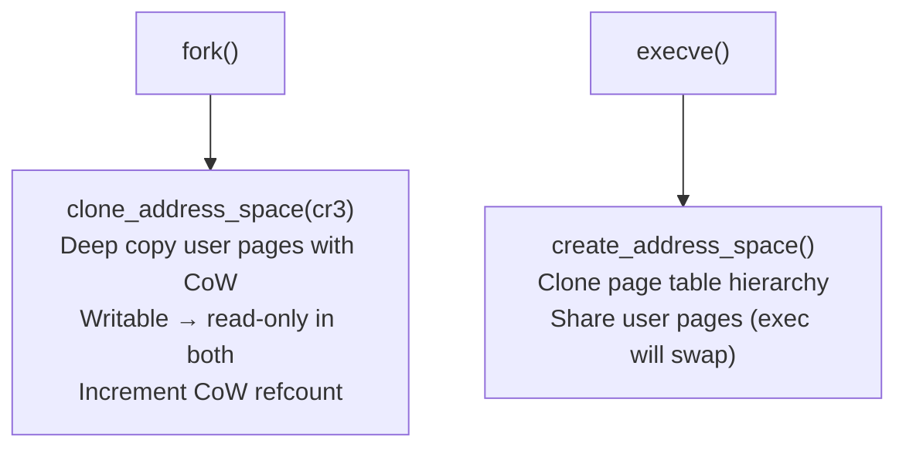
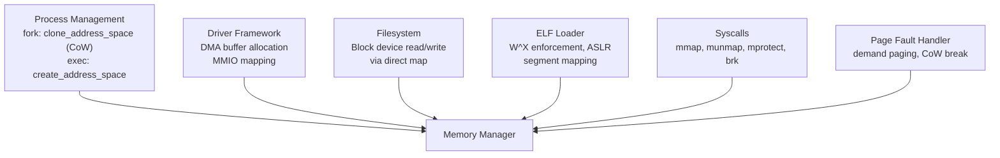

# Memory Management Domain Guide

## Overview

The Memory Management domain handles all memory operations in FKernel, from physical page allocation to virtual memory management. Features: dual bitmap+buddy per zone, CoW reference counting with fork support, slab allocator, demand paging for anonymous and file-backed memory, 2MB huge pages for direct map, ASLR, W^X enforcement, RELRO, and NUMA-aware zone selection.

## Architecture

## Initialization Flow

## Physical Memory Manager

### Dual Allocator per Zone

| Allocator | Use Case | Operation |
|-----------|----------|-----------|
| **Bitmap** | Single 4KB pages | `bitmap.alloc()` — O(1) first clear bit |
| **Buddy** | Contiguous blocks (orders 12-21) | `buddy.alloc(order)` — power-of-two splits |

`alloc_page()` uses bitmap first, then invalidates the buddy page. `alloc_contiguous()` uses buddy first, then marks all resulting pages in bitmap. Both are reconciled via `reconcile_buddies()` after the direct map is available.

### Zone Selection (NUMA-aware)

### Buddy Allocator

Orders 12-21 (4KB to 2MB blocks):

**Embedded FreeBlock**: Buddy metadata (`FreeBlock` node) is stored IN the free pages themselves, accessed via the `KERNEL_VIRT_BASE` direct map. This saves ~1MB of BSS compared to a static pool. A 16384-entry static pool is also available for bootstrap before the direct map is ready.

### Buddy Math

$$\text{buddy}(ptr, order) = ptr \oplus (2^{order})$$

Merge condition: both the block and its buddy must be free and within the zone bounds.

### CoW Reference Counting

Each zone has a per-frame `uint16_t` reference count array, allocated from the zone's own physical pages:

- `alloc_page()`: sets refcount = 1
- `free_page()`: decrements refcount; only frees when it reaches 0
- `increment_refcount(phys)`: ++ on CoW fork
- `decrement_refcount(phys)`: -- on page unmap
- `get_refcount(phys)`: read-only query

## Virtual Memory Manager

### 4-Level Page Table Walk

### Map Page Flow

### Page Flags

| Flag | Bit | Purpose |
|------|-----|---------|
| Present | 0 | Page is in physical memory |
| Writable | 1 | Page is writable |
| User | 2 | Page accessible from ring 3 |
| WriteThrough | 3 | Write-through caching |
| CacheDisabled | 4 | Disable caching (MMIO) |
| Accessed | 5 | Page has been accessed (set by CPU) |
| Dirty | 6 | Page has been written (set by CPU) |
| HugePage | 7 | 2MB huge page (used in direct map) |
| Global | 8 | Global page (not flushed on CR3 switch) |
| ExecuteDisable | 63 | NX bit (no-execute) |

### Fork vs Exec Address Space

### CoW Fork Details

`clone_table_recursive(cr3, target_cr3, virtual_address, max_depth, deep_copy)` implements the actual page table copying:
- `deep_copy = true` (fork): Allocates new physical pages at every table level, copies entries, sets user pages read-only and increments CoW refcounts
- `deep_copy = false` (exec): Creates a shallow clone of the table hierarchy (will be swapped during ELF loading)

### Demand Paging

Memory is mapped lazily on first access. The page fault handler (`pf_handler.cpp` — `handle_demand_paging()`) handles two types of regions:

1. **Anonymous memory** (`mmap MAP_ANONYMOUS`):
   - **Not-present fault**: Allocate + zero-fill a physical page, map into user address space
   - **Write-protection fault**: CoW break — allocate new page, copy data, update PTE with Writable

2. **File-backed memory** (`mmap of a file descriptor`):
   - **Not-present fault**: Read the missing page from the file's page cache via the filesystem; map into address space
   - **Write-protection fault**: CoW break for private mappings; for shared mappings, write-through to page cache

### Direct Map

`extend_direct_map()` maps ALL physical RAM at `KERNEL_VIRT_BASE` using 2MB huge pages (`PageFlags::HugePage`). This provides a linear kernel-accessible view of all physical memory, used by:
- Buddy allocator's embedded FreeBlock metadata
- CoW refcount arrays (accessed as `phys + KERNEL_VIRT_BASE`)
- Any kernel code needing physical address access

### User Access Safety

- `copy_from_user()` / `copy_to_user()` validate addresses are in userspace (`< 0x800000000000`)
- Uses STAC/CLAC instructions when hardware SMAP is available
- Returns `Result<void, Error>` for error propagation

## ASLR, W^X, and RELRO

Implemented in Phase 30b:

**ASLR (Address Space Layout Randomization)**:
- Randomizes `mmap` base address and ELF load address per process
- Stack and heap randomization included
- Entropy sources: CPU RDRAND or TSC-based seed mixed with per-process PID

**W^X Enforcement**:
- No page may be simultaneously writable and executable
- ELF segment mapping sets W or X, never both
- `mprotect` rejects PROT_WRITE | PROT_EXEC combinations
- Applied at page-table level via NX bit (bit 63) and Writable bit

**RELRO (Relocation Read-Only)**:
- After ELF relocations are applied, the GOT is marked read-only
- Full RELRO: entire GOT read-only after initialization
- Partial RELRO: GOT entries used before initialization remain writable

## Slab Allocator

`SlabAllocator` provides fast, fixed-size object allocation with 10 caches:

| Cache Size | Use Case |
|------------|----------|
| 16B | Tiny objects, pointers |
| 32B | Small objects |
| 64B | Medium objects |
| 128B | |
| 256B | |
| 512B | |
| 1024B | |
| 2048B | |
| 4096B | Page-sized allocations |
| 8192B | Large kernel objects |

The kernel heap (`MemoryManager::allocate()`) tries slab first for allocations ≤8192 bytes, falling back to the linked-list heap only when the slab cache is exhausted.

## Kernel Heap

Simple first-fit linked-list allocator:

- 16-byte alignment for all allocations
- Block splitting: if free block is large enough, carve out exactly needed size + split remainder
- Free coalescing: merges both forward and backward with adjacent free blocks
- Magic number `0xC0FFEE` checked on every operation for corruption detection
- Interrupt-safe: saves/restores RFLAGS, acquires `m_heap_lock` spinlock
- LibFK integration via `AllocatorBackend` callback structure

## Integration Points

## Key Design Decisions

- **Dual allocator per zone**: Bitmap for fast single-page, Buddy for contiguous — reconciled, not redundant
- **Embedded buddy metadata**: FreeBlock stored in free pages via direct map, saving ~1MB BSS
- **CoW refcounts**: Per-zone uint16_t arrays for accurate shared page tracking
- **COW-safe table creation**: `ensure_table()` copies shared kernel tables when user bit needed
- **2MB huge pages**: Direct map via `PageFlags::HugePage` for low TLB pressure
- **Slab-first heap**: `allocate()` tries slab for ≤8192B, falls back to linked-list heap
- **ASLR**: Randomized mmap/ELF/stack/heap base per process (Phase 30b)
- **W^X**: No page may be simultaneously writable and executable; enforced at PTE level
- **RELRO**: GOT marked read-only after ELF relocations applied (Phase 30b)
- **NUMA-aware**: Zone selection considers proximity domain with 4-level fallback
- **SMAP/STAC-CLAC**: Hardware-enforced user/kernel memory access control

## Future Enhancements

### Short Term
1. Per-CPU page caches to reduce PMM lock contention
2. Memory compaction for long-running systems
3. Per-segment ELF bounds validation (p_offset + p_filesz)

### Long Term
1. Transparent huge pages (2MB/1GB) for user mappings
2. Swap support
3. Memory hot-plug
4. Advanced NUMA policies with distance metrics (Phase 34)
