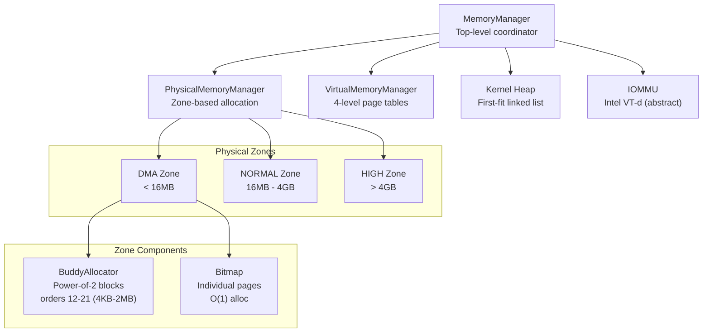
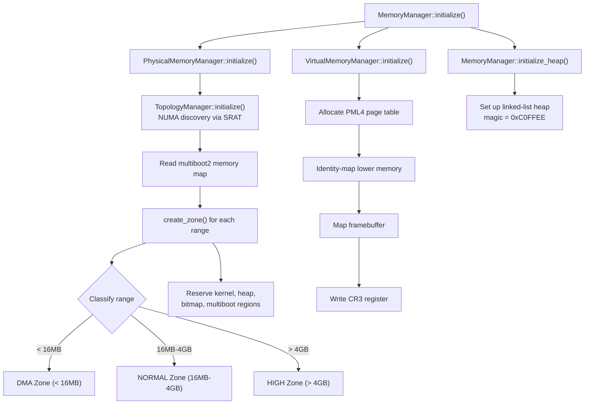
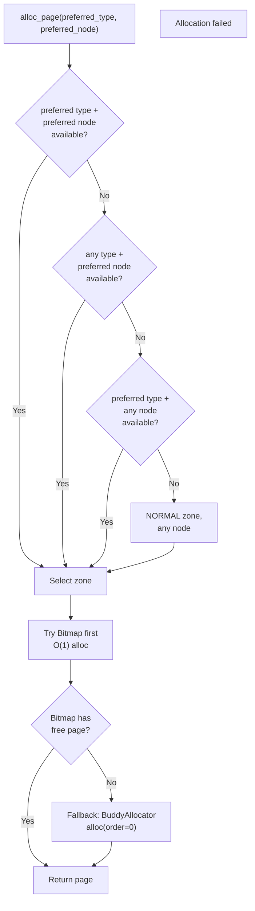
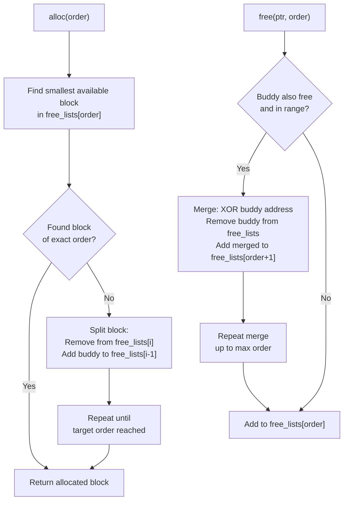
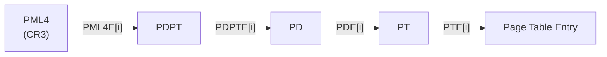
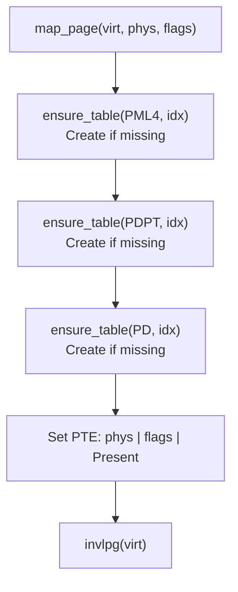
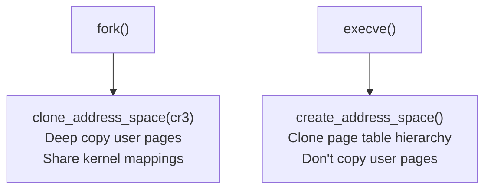
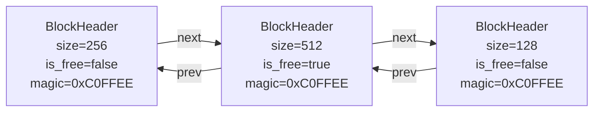
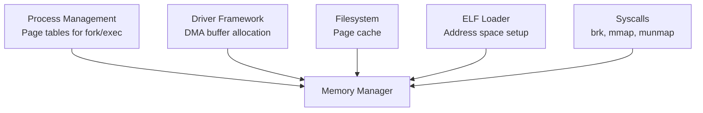

# Memory Management Domain Guide

## Overview

The Memory Management domain handles all memory operations in FKernel, from physical page allocation to virtual memory management. This domain is critical for system stability and performance.

## Architecture

## Initialization Flow

## Physical Memory Manager

### Zone Selection (NUMA-aware)

### Buddy Allocator

The buddy allocator handles **contiguous** physical page allocation (orders 12-21, i.e., 4KB to 2MB blocks):

**Key detail**: Uses a static pool of 16384 `FreeBlock` nodes to avoid the chicken-and-egg problem of allocating metadata from the allocator you're building.

### Buddy Math

The buddy address is calculated via XOR:

$$\text{buddy}(ptr, order) = ptr \oplus (2^{\text{order}} \times \text{PAGE\_SIZE})$$

Merge condition: both the block and its buddy must be free and within the zone bounds.

## Virtual Memory Manager

### 4-Level Page Table Walk

### Map Page Flow

### Page Flags

| Flag | Bit | Purpose |
|------|-----|---------|
| Present | 0 | Page is in physical memory |
| Writable | 1 | Page is writable |
| User | 2 | Page accessible from ring 3 |
| WriteThrough | 3 | Write-through caching |
| CacheDisabled | 4 | Disable caching (MMIO) |
| Accessed | 5 | Page has been accessed |
| Dirty | 6 | Page has been written |
| HugePage | 7 | 2MB/1GB huge page |
| Global | 8 | Global page (not flushed on CR3 switch) |
| ExecuteDisable | 63 | NX bit (no-execute) |

### Fork vs Exec Address Space

### User Access Safety

- `copy_from_user()` / `copy_to_user()` validate addresses are in userspace (< 0x800000000000)
- Uses STAC/CLAC instructions when hardware SMAP is available

## Kernel Heap

Simple first-fit linked-list allocator:

- `allocate(size)`: Walk block list, find free block >= size, split if large enough
- `free(ptr)`: Coalesce with adjacent free blocks (both forward and backward)
- All operations save/restore interrupts and use a `Spinlock`
- Magic number `0xC0FFEE` checked on every operation for corruption detection

## Integration Points

## Key Design Decisions

- **Dual allocator per zone**: Bitmap for individual pages (fast), Buddy for contiguous blocks
- **Static buddy node pool**: 16384 pre-allocated nodes avoid chicken-and-egg allocation
- **Coalescing kernel heap**: Free merges both forward and backward with adjacent free blocks
- **NUMA-aware zone selection**: 4-level fallback across type and node preferences
- **SMAP/STAC-CLAC**: Hardware-enforced user/kernel memory access control

## Future Enhancements

### Short Term
1. Complete NUMA-aware allocation policies
2. Memory compaction for long-running systems
3. Per-CPU caches to reduce contention

### Long Term
1. Transparent huge pages (2MB/1GB)
2. Memory hot-plug support
3. Advanced NUMA policies with distance metrics
