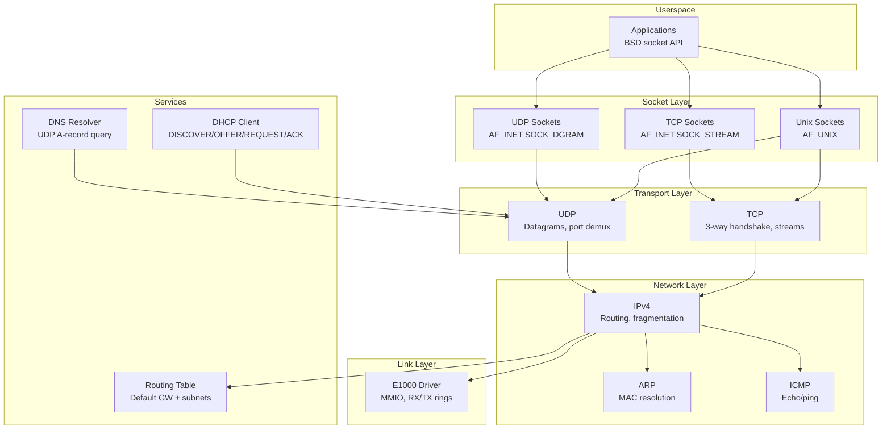
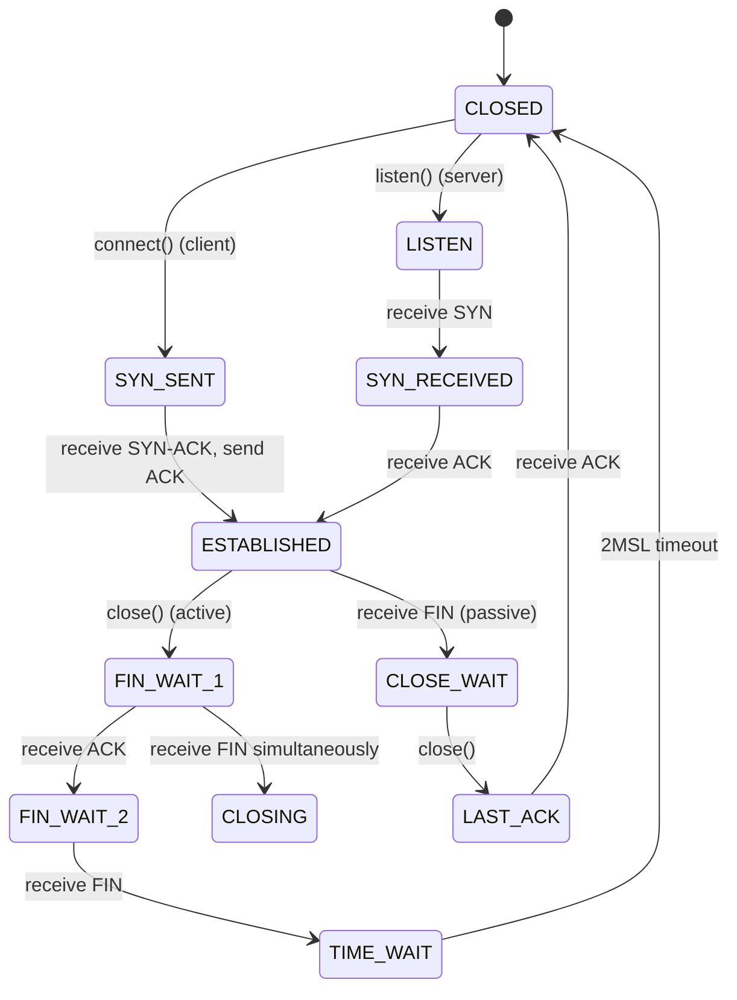

# Networking Stack

## Overview

FKernel implements a complete TCP/IP networking stack with E1000 ethernet driver, supporting IPv4, TCP, UDP, ARP, ICMP, DHCP, and DNS. The stack is designed for both kernel-internal use (NFS, remote debugging) and userspace applications.

## Architecture

## TCP Connection State Machine

## Key Components

### E1000 Ethernet Driver
- MMIO register access via BAR0
- RX/TX descriptor rings (128 entries each)
- MAC address from RAL/RAH registers
- Interrupt-driven TX completion (scheduler blocks on TX ring availability)
- PCI bus mastering enabled for DMA

### TCP Implementation
- 3-way handshake (SYN → SYN-ACK → ACK)
- MSS segmentation (1460 bytes)
- FIN-based connection teardown
- Per-connection state machine
- Port-based demultiplexing

**Known Limitations:**
- No retransmission timer
- No congestion control
- No out-of-order buffer
- TX checksum not computed

### UDP Implementation
- Simple send/receive
- Port-based demultiplexing
- No checksum verification

### ARP
- Request/reply handling
- Vector-based table (no expiry)

### DHCP Client
- Full DORA protocol
- Option parsing (message type, server ID, subnet, router, DNS)
- Configures IP/GW/DNS on NetworkStack

### DNS Resolver
- UDP A-record queries
- Name compression support
- Multiple retry attempts

## Socket API

| Syscall | Implementation |
|---------|---------------|
| `socket(domain, type, protocol)` | Creates AF_UNIX, AF_INET TCP/UDP socket |
| `bind(fd, addr, len)` | Binds to port/IP |
| `connect(fd, addr, len)` | TCP 3-way handshake or UDP remote set |
| `listen(fd, backlog)` | TCP server mode |
| `accept(fd, addr, len)` | Blocking accept from connection queue |
| `send/recv/sendto/recvto` | Data transfer |

## Known Issues

1. **No IP fragmentation** — packets > MTU dropped
2. **No TCP/UDP TX checksum** — real stacks may drop packets
3. **ARP entries never expire** — stale entries accumulate
4. **No ICMP redirect handling**
5. **Fixed-size socket arrays** — no dynamic growth
