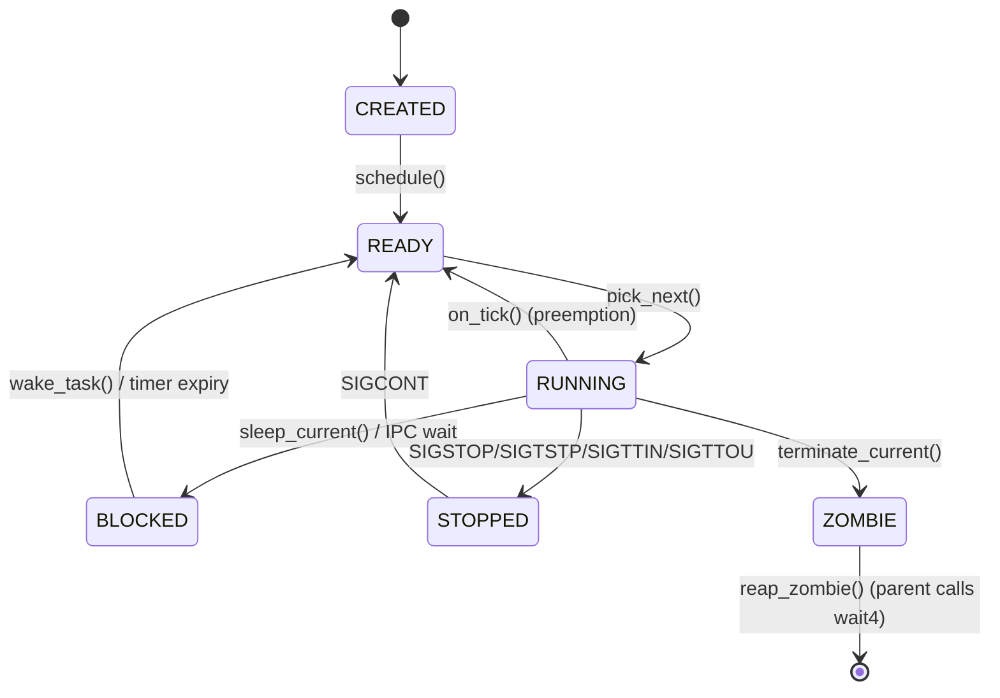
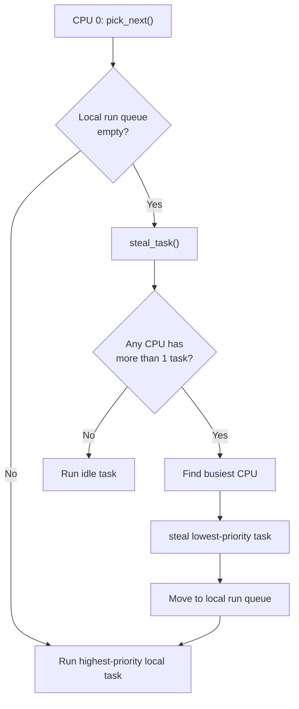
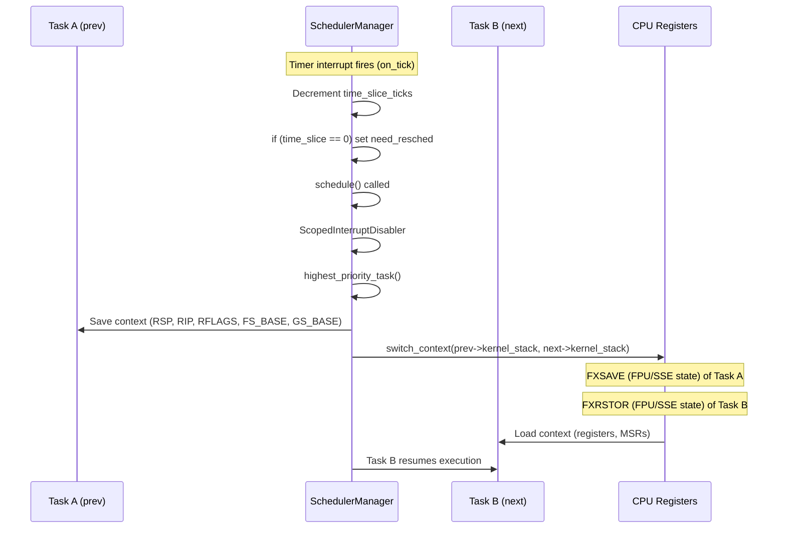

# Process and Scheduling

## Overview

FKernel implements a **preemptive, priority-based scheduler** with support for process groups, sessions, signals, and load balancing. Inspired by BSD scheduling semantics with Linux ABI compatibility.

## Task States



- **CREATED**: Task allocated but not yet scheduled
- **READY**: Runnable, waiting for CPU
- **RUNNING**: Currently executing on a CPU
- **BLOCKED**: Waiting on a resource (I/O, sleep, IPC)
- **STOPPED**: Suspended by signal (job control)
- **ZOMBIE**: Terminated, awaiting `wait4()`/`waitpid()`

## Scheduler Architecture

### Priority Queues
- Tasks are assigned priority levels
- Higher priority tasks run first
- Round-robin within same priority level
- Preemption on timer tick

### Load Balancing
- Work stealing: idle CPUs steal tasks from busy CPU run queues
- Least-loaded CPU selection on `add_task()`
- Per-CPU run queues for SMP readiness
- Sleep queue processed on all CPUs (was CPU-0-only bug, fixed)



### Scheduling Operations
- `pick_next()`: Select next task from highest-priority non-empty queue
- `add_task()`: Add task to least-loaded CPU
- `on_tick()`: Timer interrupt handler, preemption, sleep queue processing
- `yield()`: Voluntarily relinquish CPU
- `sleep_current()`: Block task for specified duration



## Task Structure

```cpp
class Task {
    // Identity
    ProcessId m_pid;
    ProcessId m_ppid;
    ProcessId m_pgid;       // Process group
    ProcessId m_sid;         // Session
    bool m_is_session_leader;
    
    // State
    TaskState m_state;
    uint8_t m_priority;
    mode_t m_umask;          // File creation mask
    
    // Terminal
    int m_controlling_terminal_fd;
    int m_foreground_pgid;
    
    // Resources
    OwnPtr<PageTable> m_page_table;
    FileDescriptorTable m_fds;
    SignalActions m_signal_actions;
    WaitNode m_wait_node;
};
```

## Process Groups and Sessions

- **Session**: Collection of process groups. Created by `setsid()`
- **Session Leader**: First process in session (usually a shell)
- **Process Group**: Collection of processes in same job. Created by `setpgid()`
- **Foreground Process Group**: Receives terminal I/O and signals
- **Controlling Terminal**: Assigned via `TIOCSCTTY`

## Signals

### Delivery
- Signals are delivered via `sigaction()` registered handlers or default actions
- Kernel pushes a signal trampoline frame on the user stack before redirecting to `sa_handler`
- `sigreturn` syscall restores full register state from kernel frame

### Default Actions
| Signal | Action |
|--------|--------|
| SIGSTOP/SIGTSTP/SIGTTIN/SIGTTOU | TaskState::Stopped, yield |
| SIGCONT | TaskState::Ready, wake |
| SIGPIPE | Terminate (delivered on write to broken pipe) |
| SIGINT/SIGQUIT | Terminate (sent to foreground group on Ctrl+C/\) |
| Most others | Terminate |

### Group Delivery
- `kill(-pgid, sig)` delivers to all processes in group
- Ctrl+C/Z/\ send to foreground process group

## Lifecycle

1. **Fork**: `sys_clone()` creates child with copied page tables and FDs
2. **Exec**: `sys_execve()` loads ELF binary, replaces address space
3. **Exit**: `sys_exit()` sets Zombie state, notifies parent
4. **Wait**: `sys_wait4()` collects child exit status
5. **Reap**: Zombie resources deallocated (stack, page tables, FDs)

## Key Design Decisions

- **Preemptive**: Timer interrupt triggers context switch
- **BSD-style process groups** over Linux's `CLONE_*` flags for most cases
- **Priority queues** over pure round-robin (was RR-only, fixed)
- **Work stealing** for SMP load balancing (not per-CPU load calculation)
- `ScopedLockIRQ` for interrupt-safe scheduler state access
