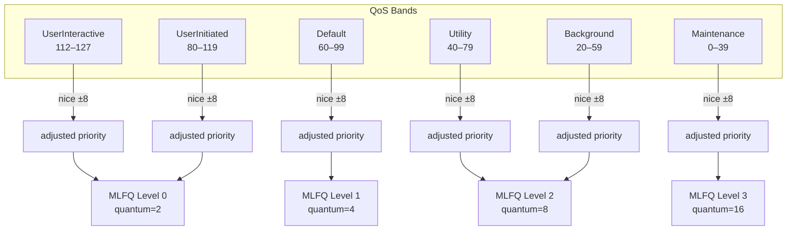
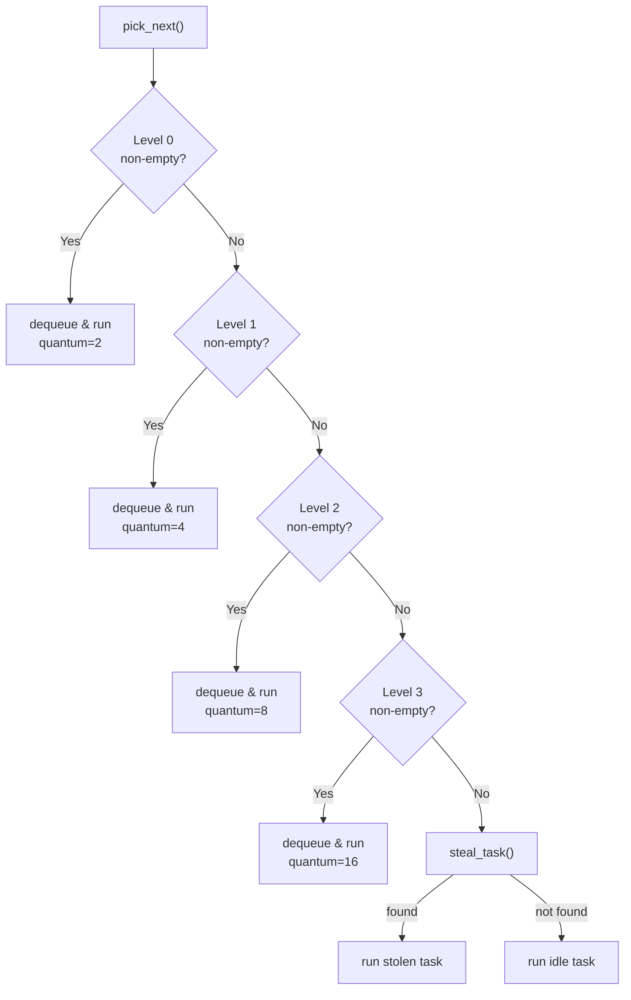
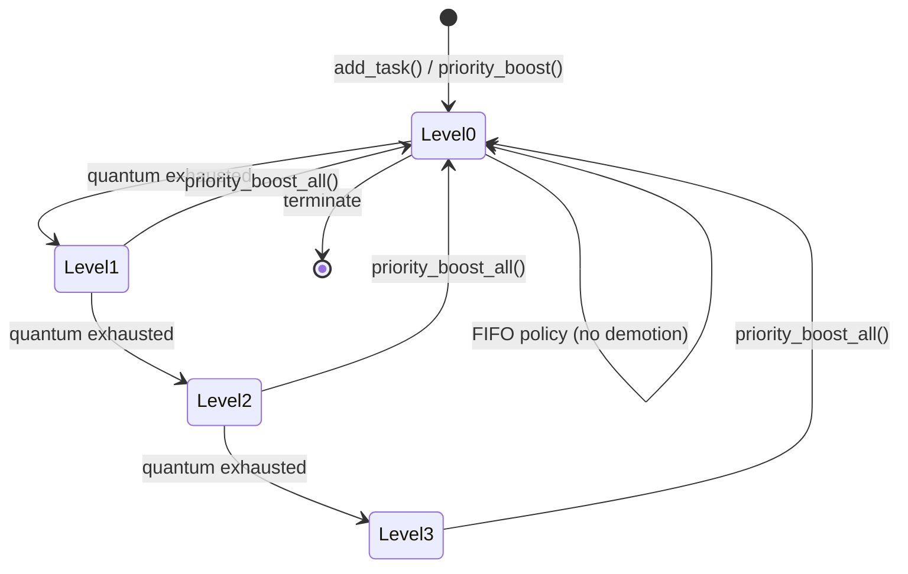
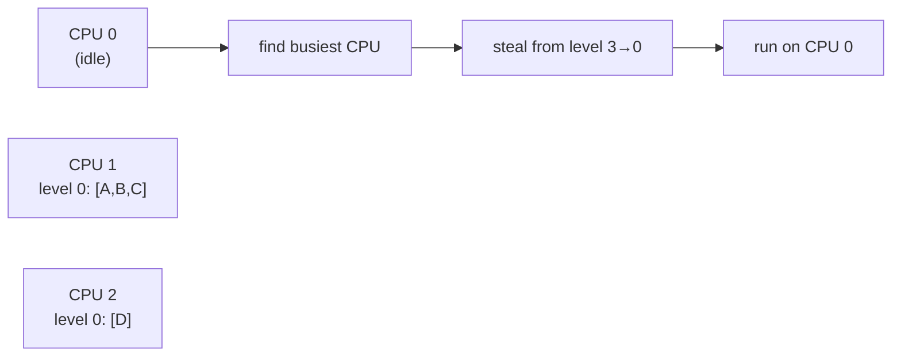
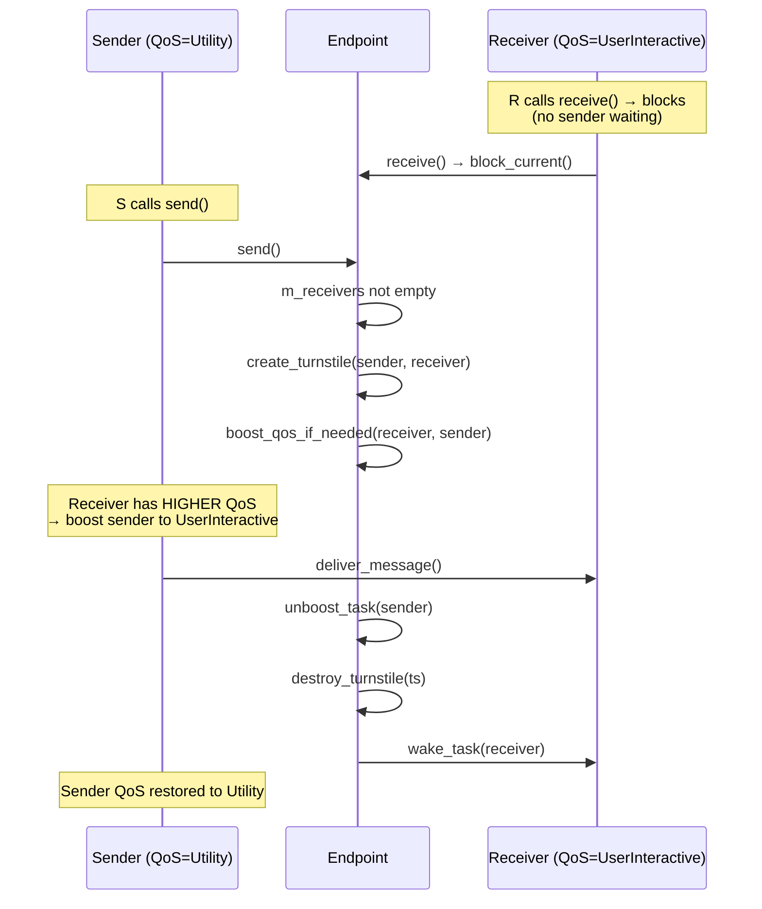
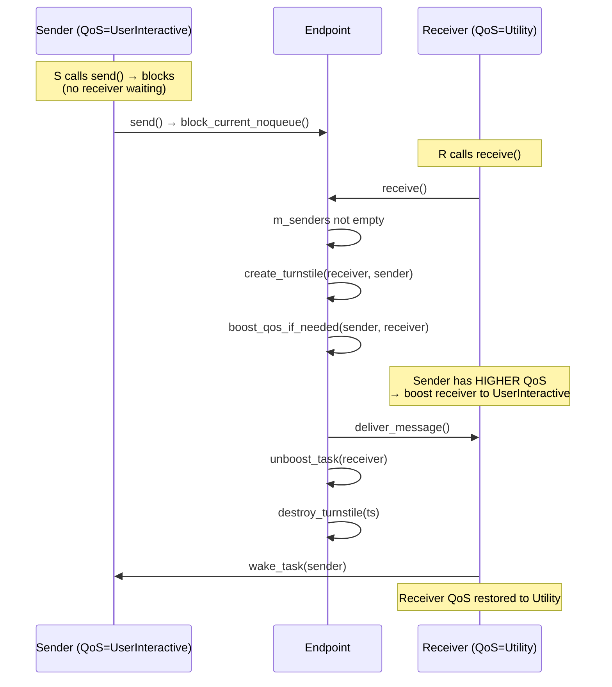
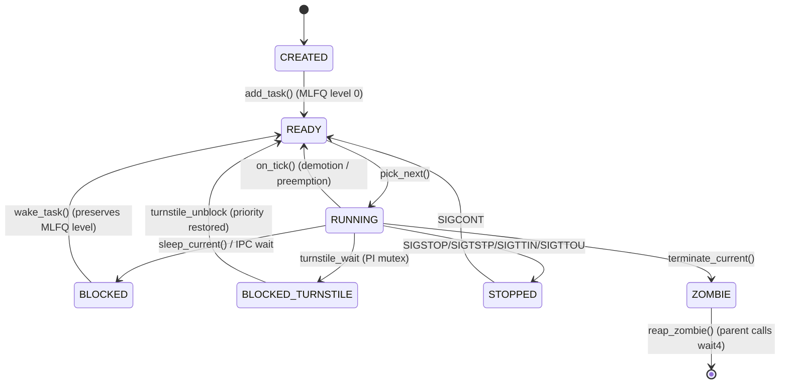
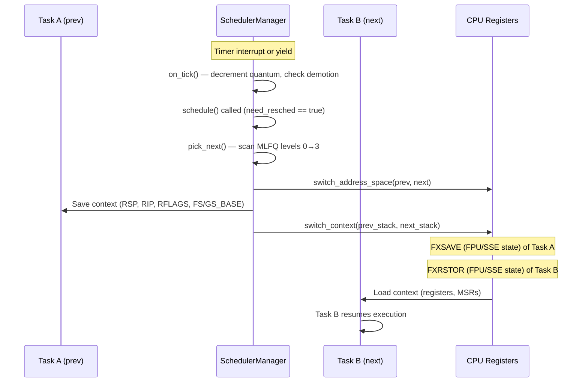
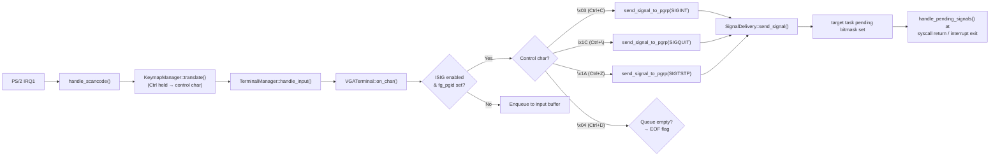

# Process and Scheduling

## Overview

FKernel implements an **XNU-inspired Quality-of-Service (QoS) scheduler** with a classic 4-level **Multi-Level Feedback Queue (MLFQ)**, periodic priority boost for starvation prevention, and **turnstile-based priority inheritance** for IPC. The design eliminates priority inversion, provides QoS-aware scheduling across six classes, and uses work-stealing for SMP load balancing.

- **QoS Classes**: 6-tier (UserInteractive → Maintenance) mapped to internal priority bands
- **MLFQ**: 4 levels with escalating quantum and allotment, demotion on exhaustion, periodic boost every 500 ticks
- **Turnstiles**: Transitive priority inheritance through `Endpoint::send()`/`receive()`
- **Linux ABI**: `sched_*`, `nice`/`getpriority`/`setpriority`, and custom `SYS_THREAD_SET/GET_QOS_CLASS` syscalls

## QoS Classes

Six QoS classes (inspired by XNU/Darwin) determine base priority, quantum, allotment, and default MLFQ level:

| QoS Class | Priority Band | Quantum (ticks) | Allotment (ticks) | Default MLFQ Level | Linux Policy Mapping |
|-----------|---------------|-----------------|-------------------|-------------------|---------------------|
| `UserInteractive` (0) | 112–127 | 2 | 8 | 0 | — |
| `UserInitiated` (1) | 80–119 | 4 | 16 | 0 | SCHED_FIFO, SCHED_RR |
| `Default` (2) | 60–99 | 8 | 32 | 1 | SCHED_OTHER |
| `Utility` (3) | 40–79 | 16 | 64 | 2 | SCHED_BATCH |
| `Background` (4) | 20–59 | 32 | 128 | 2 | — |
| `Maintenance` (5) | 0–39 | 64 | 256 | 3 | SCHED_IDLE |

Within each QoS band, `nice` values (-20 to +19) adjust the base priority by up to ±8:
- `nice = -20` → +7 priority
- `nice = 0` → +0 priority  
- `nice = +19` → -8 priority



### QoS Inheritance

QoS is inherited across process creation:
- `fork()`/`vfork()`/`clone()`: child inherits parent's `qos`, `policy`, `nice`, and `mlfq_level`
- `create_a_new_task()`: idle tasks use `Background`, init uses `Default`
- Turnstile boost: temporary QoS elevation during IPC delivery

## MLFQ Scheduler

### Architecture

Each CPU has 4 MLFQ levels (`MLFQ_LEVELS = 4`). Higher-priority levels are scanned first:



### Demotion (on_tick)

When a task exhausts its quantum at the current level, it is demoted one level (unless already at level 3). New level receives a fresh quantum matching that level:



Quantum per level:
| Level | Quantum (ticks) |
|-------|----------------|
| 0 | 2 |
| 1 | 4 |
| 2 | 8 |
| 3 | 16 |

### Priority Boost (Aging)

Every `BOOST_PERIOD_TICKS` (500 ticks), `priority_boost_all()` moves all tasks from levels 1–3 back to level 0. This prevents starvation of CPU-bound tasks that were demoted to lower levels. Tasks reset their `cpu_time_consumed` counter and receive a fresh level-0 quantum.

### Scheduling Policies

| Policy | Behavior |
|--------|----------|
| `Normal` | MLFQ with demotion and boost (default) |
| `Fifo` | Runs until blocked; no demotion, no preemption |
| `RoundRobin` | Yield on quantum expiry; re-enqueues at same level |
| `Batch` | Normal MLFQ behavior |
| `Idle` | Runs only when nothing else is ready |

### Real-Time Scheduling

Real-time scheduling follows the POSIX SCHED_FIFO and SCHED_RR policies with 32 priority levels (0–31), managed within the MLFQ framework:

**SCHED_FIFO**:
- Run-to-completion: a running task is never preempted by another FIFO task of equal or lower priority
- Preempted only by a higher-priority FIFO task or a SCHED_RR task of higher priority
- No time-slicing; tasks yield voluntarily or block on I/O/IPC
- Mapped to `SchedulingPolicy::Fifo` in the QoS system

**SCHED_RR**:
- Time-sliced round-robin within the same priority level
- Each task receives a fixed quantum (configurable, default 4 ticks)
- On quantum expiry, the task is re-enqueued at the tail of its priority level
- Mapped to `SchedulingPolicy::RoundRobin` in the QoS system

Priority levels 0–31 map directly into MLFQ level 0, ensuring real-time tasks are scheduled before any non-real-time work. The `sched_setscheduler()` syscall accepts `SCHED_FIFO` and `SCHED_RR` with `sched_priority` in the range [1, 99] (Linux ABI), which is mapped to internal level [0, 31].

### Work Stealing

`steal_task()` scans all CPUs for the busiest run queue, then steals from the **lowest** MLFQ level (scanning 3→0) to minimize disruption to interactive tasks at higher levels.



## Turnstiles (QoS-over-IPC)

Turnstiles implement priority inheritance for IPC. When a higher-QoS task is waiting on a lower-QoS task (via endpoint send/receive), the lower-QoS task is temporarily boosted to the waiter's QoS.

### Flow





### Key Turnstile Functions

| Function | Behavior |
|----------|----------|
| `create_turnstile(holder, waiter)` | Allocates turnstile, records original QoS |
| `boost_qos_if_needed(waiter, holder)` | If waiter QoS > holder QoS, boost holder |
| `unboost_task(task)` | Restore original QoS, remove boost flag |
| `destroy_turnstile(ts)` | Recursively destroys chained turnstiles |
| `reprioritize_task(task)` | Recalculates priority from QoS + nice |

### Rules

- Boost triggers only if waiter QoS > holder QoS AND holder is not already boosted
- Unboost restores original QoS and recalculates priority
- Chain depth limited (MAX_CHAIN_DEPTH for future transitive chain support)

## Task States



- **CREATED**: Task allocated but not yet scheduled
- **READY**: Runnable, waiting for CPU at a specific MLFQ level
- **RUNNING**: Currently executing on a CPU
- **BLOCKED**: Waiting on a resource (I/O, sleep, IPC endpoint)
- **BLOCKED_TURNSTILE**: Blocked on a PI mutex via turnstile; priority inheritance active
- **STOPPED**: Suspended by signal (job control)
- **ZOMBIE**: Terminated, awaiting `wait4()`/`waitpid()`

## Context Switch



## Task Structure

```cpp
struct TaskLifecycle {
    TaskState state;
    uint8_t priority;           // Effective priority (QoS + nice + boost)
    int8_t nice;                // Nice value (-20 to +19)

    // QoS and MLFQ
    QoSClass qos{QoSClass::Default};
    SchedulingPolicy policy{SchedulingPolicy::Normal};
    uint8_t base_priority{0};   // Priority before MLFQ/boost adjustments
    uint8_t mlfq_level{0};      // Current MLFQ level (0–3)
    uint64_t cpu_time_consumed{0};
    uint64_t allotment_ticks{0};
    bool boosted{false};
    QoSClass original_qos{QoSClass::Default};

    uint64_t time_slice_ticks;
    uint64_t wake_up_time_ticks;
    // ... other fields
};

struct TaskIpc {
    Turnstile* pending_turnstile{nullptr};  // Turnstile where this task is waiter
    Turnstile* active_turnstile{nullptr};   // Turnstile where this task is holder (boosted)
};
```

## Syscalls

### QoS Syscalls (custom, non-Linux)

| Syscall | Number | Description |
|---------|--------|-------------|
| `SYS_THREAD_SET_QOS_CLASS` | 504 | `sys_thread_set_qos_class(pid, qos_class)` — sets QoS class, recalculates priority |
| `SYS_THREAD_GET_QOS_CLASS` | 505 | `sys_thread_get_qos_class(pid)` — returns QoS class (0–5) |

### Linux-Compatible Syscalls

| Syscall | Description |
|---------|-------------|
| `nice(increment)` | Adjusts nice value (-20..+19), recalculates priority within QoS band |
| `getpriority/setpriority` | Query/set priority (20 - nice), QoS-aware |
| `sched_getscheduler(pid)` | Returns Linux policy number mapped from SchedulingPolicy |
| `sched_setscheduler(pid, policy, param)` | Sets scheduling policy, optionally sets fixed priority (SCHED_FIFO/RR) |
| `sched_getparam/setparam` | Get/set sched_priority from Task |
| `sched_get_priority_max/min` | Returns 99/1 for FIFO/RR, 0 for OTHER/BATCH/IDLE |

## Process Groups and Sessions

- **Session**: Collection of process groups. Created by `setsid()`
- **Session Leader**: First process in session (usually a shell)
- **Process Group**: Collection of processes in same job. Created by `setpgid()`
- **Foreground Process Group**: Receives terminal I/O and signals
- **Controlling Terminal**: Assigned via `TIOCSCTTY`

## Signals

### Delivery
- Signals are delivered via `sigaction()` registered handlers or default actions
- Kernel pushes a signal trampoline frame on the user stack before redirecting to `sa_handler`
- `sigreturn` syscall restores full register state from kernel frame

### Terminal Signal Delivery (ISIG)
Keyboard input flows through a chain that delivers signals to the foreground process group:



### Default Actions
| Signal | Action |
|--------|--------|
| SIGSTOP/SIGTSTP/SIGTTIN/SIGTTOU | TaskState::Stopped, yield |
| SIGCONT | TaskState::Ready, wake |
| SIGPIPE | Terminate (delivered on write to broken pipe) |
| SIGINT/SIGQUIT | Terminate (sent to foreground group on Ctrl+C/\) |
| Most others | Terminate |

## Lifecycle

1. **Fork**: `sys_clone()` creates child with copied page tables, FDs, and inherited QoS
2. **Exec**: `sys_execve()` loads ELF binary, replaces address space
3. **Exit**: `sys_exit()` sets Zombie state, notifies parent via SIGCHLD
4. **Wait**: `sys_wait4()` collects child exit status
5. **Reap**: Zombie resources deallocated (stack, page tables, FDs)

## Key Design Decisions

- **XNU-inspired QoS**: 6 classes with banded priority ranges, not flat priority levels
- **Classic MLFQ**: 4 levels with escalating quantum (2→4→8→16 config ticks) for CPU-I/O balance
- **Periodic boost**: 500-tick anti-starvation (`priority_boost_all()`) moves all tasks to level 0
- **Turnstile inheritance**: IPC Endpoint boost/unboost cycle prevents priority inversion
- **Work stealing**: Idle CPUs steal from lowest MLFQ levels first (3→0), preserving interactive latency
- **BSD-style process groups** over Linux's `CLONE_*` flags for most cases
- `ScopedLockIRQ` for interrupt-safe scheduler state access
- `SchedulingPolicy::Fifo` tasks are exempt from MLFQ demotion (real-time semantics)
- **Real-time scheduling**: SCHED_FIFO (run-to-completion) and SCHED_RR (time-sliced) with 32 priority levels mapped to MLFQ level 0
- **Per-CPU run queues**: Each CPU has its own run queue with work-stealing for load balance

## Future Enhancements

### Planned
1. CPU affinity (`sched_setaffinity`/`sched_getaffinity`) — Phase 34
2. CPU hotplug — Phase 34
3. Energy-aware scheduling (EAS) with frequency scaling hints

## Key Files

| File | Purpose |
|------|---------|
| `Include/Kernel/Scheduler/Qos/qos.h` | QoSClass enum, SchedulingPolicy, mapping table, helper declarations |
| `Include/Kernel/Scheduler/Qos/mlfq_queue.h` | MLFQQueue struct (IntrusiveList + quantum + allotment) |
| `Include/Kernel/Scheduler/Sync/turnstile.h` | Turnstile struct and boost/unboost function declarations |
| `Src/Kernel/Scheduler/Qos/qos.cpp` | QoS→priority/quantum/allotment mappings, nice→offset, Linux policy conversion |
| `Src/Kernel/Scheduler/Sync/turnstile.cpp` | Turnstile create/destroy/boost/unboost/reprioritize |
| `Src/Kernel/Scheduler/Core/scheduler_manager.cpp` | Scheduler init, pick_next (MLFQ), steal_task, context switch |
| `Src/Kernel/Scheduler/Core/scheduler_lifecycle.cpp` | add_task, wake_task, yield, on_tick (demotion), priority_boost_all |
| `Include/Kernel/Scheduler/Task/task.h` | TaskLifecycle (QoS/MLFQ fields), TaskIpc (turnstile pointers) |
| `Src/Kernel/Ipc/Endpoints/endpoint.cpp` | Turnstile boost/unboost in send()/receive() |
| `Src/Kernel/Syscall/syscall_list/Process/thread_get_qos_class.cpp` | SYS_THREAD_GET_QOS_CLASS handler |
| `Src/Kernel/Syscall/syscall_list/Process/thread_set_qos_class.cpp` | SYS_THREAD_SET_QOS_CLASS handler |
| `Src/Kernel/Syscall/syscall_list/Process/nice.cpp` | QoS-aware nice/getpriority/setpriority |
| `Src/Kernel/Syscall/syscall_list/Process/sched_setscheduler.cpp` | Real-time scheduling policy setter |
| `Src/Kernel/Syscall/syscall_list/Process/sched_getparam.cpp` | sched_getparam/sched_setparam handlers |
| `Include/LibFK/Syscalls/numbers.h` | SYS_THREAD_SET_QOS_CLASS=504, SYS_THREAD_GET_QOS_CLASS=505 |
