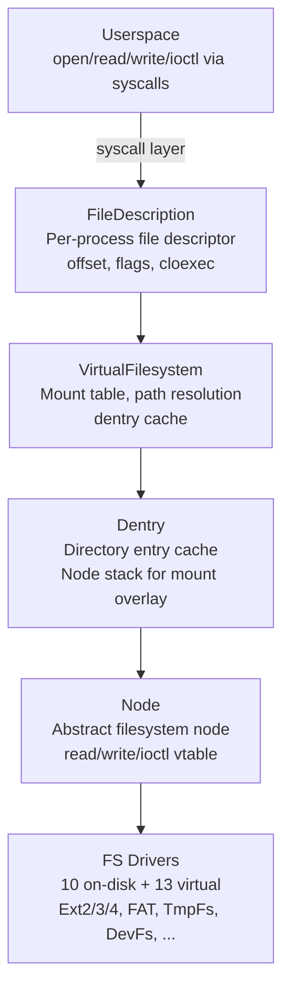
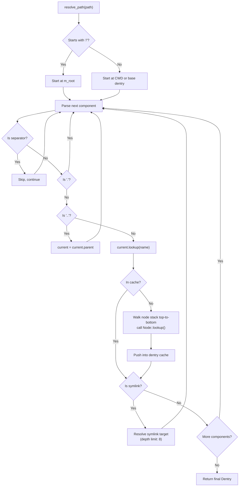
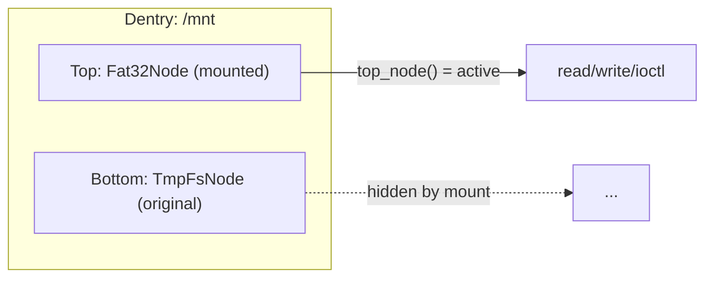
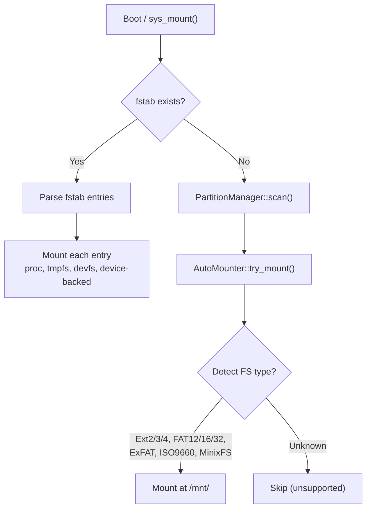

# VFS Architecture

## Overview

FKernel's Virtual File System (VFS) is inspired by the **BSD vnode/dentry/mount** model. It provides a unified interface for multiple filesystem types, device nodes, and process information.

## Architecture

### Path Resolution Flow

### Mount Point Overlay

The Dentry uses a **node stack** for mount-point overlaying. When a filesystem is mounted at `/mnt`, its `Node` is pushed onto the existing dentry's stack:

Multiple filesystems can be stacked on the same dentry. The topmost node wins for operations. Directory listings merge entries from ALL stack layers with deduplication.

## Key Components

### FileDescription

- Per-process, per-open-file state
- Wraps a `Dentry` reference + `m_current_offset` + `m_flags` + `m_cloexec`
- Read/write operations delegate to `node()->read()/write()` and atomically advance offset
- Created by `open()`/`creat()`, duplicated by `dup()`/`dup2()`/`dup3()`

### VirtualFilesystem

- Global singleton (`VirtualFileSystem::the()`)
- Mount table management (mount/umount)
- Path resolution (`resolve_path()` -> traverse dentry tree)
- Inode number allocation (monotonic, lock-free via `__sync_fetch_and_add`)
- All operations use `ScopedLockIRQ` (interrupt-safe locking)

### Dentry

- In-memory directory entry with a **node stack** (`DentryNodeStack`) for mount overlay
- `lookup(name)` checks cached children first, then walks the node stack
- Supports `.` and `..` directly
- Lock held during lookup to prevent TOCTOU races

### Node (filesystem node)

- Abstract interface for all filesystem objects (`RefCounted`)
- I/O: `read()`, `write()`, `ioctl()`, `truncate()`, `fsync()`, `select()`, `poll()`
- Directory ops: `lookup()`, `list_dir()`, `create_child()`, `mkdir()`, `symlink()`, `rmdir()`, `unlink()`, `link()`, `rename()`, `readlink()`
- Metadata: `stat()`, `chmod()`, `chown()`, `utimens()`
- Socket ops: `bind()`, `connect()`, `accept()`, `listen()`, `shutdown()`, `getsockname()`, `getpeername()`, `setsockopt()`, `getsockopt()`
- Type queries: `is_directory()`, `is_symlink()`, `is_block_device()`, `is_character_device()`, `is_pipe()`
- Atomic inode allocation via `__sync_fetch_and_add`

## Filesystem Implementations

| Filesystem | Mount Point | Type | Key Features |
|------------|------------|------|--------------|
| **Ext2** | `/mnt/<disk>` | Disk-backed | Linux ext2, block-oriented, inode table |
| **Ext3** | `/mnt/<disk>` | Disk-backed | ext2 + journaling, V1/V2 superblocks |
| **Ext4** | `/mnt/<disk>` | Disk-backed | extents, flex_bg, 48-bit block numbers, journal |
| **FAT32** | `/mnt/<disk>` | Disk-backed | LFN support, cluster chain traversal, write support |
| **FAT16** | `/mnt/<disk>` | Disk-backed | LFN support, cluster chain reading |
| **FAT12** | `/mnt/<disk>` | Disk-backed | Floppy images, cluster chain traversal |
| **ExFAT** | `/mnt/<disk>` | Disk-backed | Large file support, contiguous clusters |
| **ISO9660** | `/mnt/<disk>` | Disk-backed | CD/DVD images, Rock Ridge extensions |
| **MinixFS** | `/mnt/<disk>` | Disk-backed | Minix v1/v2/v3 filesystem |
| **TmpFs** | `/tmp`, `/var/run` | In-memory | Temporary file storage |
| **DevFs** | `/dev` | Virtual | Dynamic device registration, pseudo-devices |
| **ProcFs** | `/proc` | Virtual | Per-pid entries: cmdline, status, mem, fd, maps, cwd, exe, root |
| **DebugFs** | `/debug` | Virtual | Debug info, IPC log at `/debug/ipc` |
| **PtsFs** | `/dev/pts` | Virtual | PTY slave device files |
| **SemFs** | `/dev/sem` | Virtual | POSIX named semaphores |
| **MqueueFs** | `/dev/mqueue` | Virtual | POSIX message queues |
| **ShmFs** | `/dev/shm` | Virtual | POSIX shared memory |
| **Pipe** | (anonymous) | In-memory | Circular buffer, Notification-based signaling |
| **Epoll** | (anonymous) | In-memory | Full epoll implementation, fd event monitoring |
| **EventFd** | (anonymous) | In-memory | eventfd counter + Notification signaling |
| **SignalFd** | (anonymous) | In-memory | Signal-to-fd demultiplexing |
| **TimerFd** | (anonymous) | In-memory | Timer expiration via file descriptor |
| **KQueue** | (anonymous) | In-memory | BSD event polling (EVFILT_READ/WRITE/PROC/SIGNAL/TIMER) |

### Userspace FS via Capabilities

Filesystem operations in userspace are architecturally supported through the Capability model (see `ipc-capabilities.md`). A userspace process can serve as a filesystem driver by receiving Node capabilities, handling `read()`/`write()`/`lookup()` via Endpoint IPC, and exposing results through the VFS layer. This enables FUSE-like functionality natively through the capability system. **Phase: pending — not yet implemented.**

## Event Notification

Two event notification subsystems coexist in FKernel:

### KQueue (BSD-style)

Full `kqueue()` implementation with the following event filters:

| Filter | Trigger |
|--------|---------|
| `EVFILT_READ` | Data available on fd |
| `EVFILT_WRITE` | Space available on fd |
| `EVFILT_PROC` | Process lifecycle events (exit, fork, exec) |
| `EVFILT_SIGNAL` | Signal delivery |
| `EVFILT_TIMER` | Timer expiration |

### Epoll (Linux-compatible)

Full `epoll_create()`/`epoll_ctl()`/`epoll_wait()` implementation backed by `EpollNode`, supporting `EPOLLIN`, `EPOLLOUT`, `EPOLLERR`, `EPOLLET` (edge-triggered), and `EPOLLONESHOT`.

## AutoMounter and Fstab

## Key Design Decisions

- **BSD-style layered VFS** over Linux's single-struct inode model
- **Node stack mount overlay** — multiple FS on one dentry, topmost wins
- **Dentry cache** for fast path resolution (not a full dcache like Linux)
- **FileDescription** separates per-open state from inode (like BSD's file struct)
- **Interrupt-safe locking** — all VFS operations use `ScopedLockIRQ`
- **Lock-free inode allocation** — atomic counter, no lock contention
