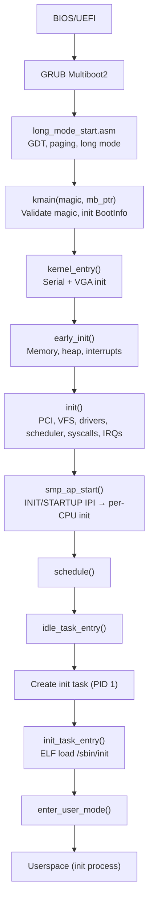

# Boot Process

## Overview

FKernel boots via Multiboot2 (BIOS). The bootloader loads the kernel binary, which transitions from 32-bit protected mode through long mode setup into the C++ `kmain()` entry point. BootInfo is initialized early, then serial/VGA output is available before any subsystem init runs.

## Architecture

## Boot Flow

### Stage 1: Assembly (`long_mode_start.asm`)
- GDT setup and protected mode entry
- Page table setup (`setup_page_tables.asm`) for initial identity mapping
- Long mode enable and jump to `kmain()`

### Stage 2: kmain (`kmain.cpp`)
- Validates Multiboot2 magic (`0x36d76289`)
- Calls `BootInfo::the().initialize_from_multiboot2()` to parse tags
- Calls `kernel_entry()`

### Stage 3: kernel_entry (`kernel_entry.cpp`)
- Initializes serial port (COM1) for logging
- Initializes VGA adapter for display
- Asserts BootInfo is initialized
- Logs framebuffer info if available
- Calls `early_init()`

### Stage 4: early_init (`early_init.cpp`)
- `PhysicalMemoryManager::the().initialize()` — zones, bitmaps, reserves
- `VirtualMemoryManager::the().initialize()` — PML4, identity map, framebuffer map
- Heap initialization (`MemoryManager`)
- Interrupt/timer setup

### Stage 5: init (`init.cpp`)
- Kernel puts hook (routes libc_puts to serial/VGA/DebugFS)
- PCI discovery (`PciManager::the().initialize()`)
- VFS init (TmpFS root, DevFS, ProcFS, DebugFS)
- Driver registry + auto-discover PCI devices
- Display switch to framebuffer if available
- Terminal manager init
- PS/2 keyboard + mouse init
- `SchedulerManager::the().initialize()`
- `SyscallManager::the().initialize()`
- Enable hardware interrupts (timer, keyboard, clock, mouse, ATA)
- `SmpManager::the().start_aps()` — INIT/STARTUP IPI sequence, per-CPU data init
- `SchedulerManager::the().schedule()`

### Stage 6: SMP AP startup
- `smp_ap_start()` sends INIT IPI → STARTUP IPI to each AP
- APs enter `ap_entry.cpp` (under `Arch/x86_64/Smp`), set up GDT, load per-CPU data
- APs initialize local APIC timer and enter idle loop

### Stage 7: idle_task → init_task
- `idle_task_entry()` creates PID 1 on first invocation
- `init_task_entry()` loads `/sbin/init` via ELF loader
- Mounts RamDisk + DevFS, opens `/dev/tty0` for stdio
- Maps user stack (32KB), builds System V ABI stack (argc, argv, envp, auxv)
- `enter_user_mode()` transitions to ring 3

## Key Files

| File | Purpose |
|------|---------|
| `Src/Kernel/Arch/x86_64/Boot/long_mode_start.asm` | Assembly entry: GDT, paging, long mode |
| `Src/Kernel/Arch/x86_64/Boot/setup_page_tables.asm` | Initial page table setup |
| `Src/Kernel/Boot/Multiboot/kmain.cpp` | Multiboot2 entry point, magic validation |
| `Src/Kernel/Boot/Core/kernel_entry.cpp` | Early HW init, serial/VGA, calls `early_init()` |
| `Src/Kernel/Boot/Core/boot_info.cpp` | Multiboot2 tag parser (memory map, framebuffer, modules) |
| `Src/Kernel/Arch/x86_64/Init/early_init.cpp` | Physical/virtual memory, heap, interrupts |
| `Src/Kernel/Init/init.cpp` | PCI, VFS, drivers, scheduler, interrupts |
| `Src/Kernel/Scheduler/Task/init_task.cpp` | PID 1 bootstrap (ELF load, user stack, auxv) |
| `Src/Kernel/Scheduler/Task/idle_task.cpp` | Idle task entry, spawns init on first run |

## Multiboot2 Tags Parsed

- Memory map (type 6) — physical regions for PMM zones
- Framebuffer (type 8) — VGA/LFB for early display (indexed or RGB only)
- Module info (type 3) — initrd location and command line

## BootInfo Singleton

`BootInfo` is a Meyer's singleton providing unified access to boot data:
- `get_memory_map_iterator()` — deferred iterator creation after heap init
- `get_framebuffer_info()` — resolution, pitch, BPP, RGB positions
- `get_modules()` — initrd start/end addresses
- `get_acpi_info()` — RSDP/RSDT/XSDT pointers (reserved for future use)

## Initial Address Space

- Kernel: Higher-half identity-mapped
- User: 32KB stack at top of user address space
- ELF: Loaded at ASLR-randomized base (ET_DYN) or fixed (ET_EXEC)
- Auxv: AT_PHDR, AT_PHENT, AT_PHNUM, AT_PAGESZ, AT_UID, AT_GID, AT_SECURE, AT_RANDOM, AT_EXECFN, AT_TLS

## Notable Design Decisions

- **Two-phase iterator creation**: `BootInfo::create_iterators()` is called after heap init to allocate the memory map iterator, since early boot has no heap
- **Deferred module discovery**: Multiboot2 modules are scanned lazily via the raw multiboot pointer
- **Framebuffer type filtering**: EGA text mode (type 2) is explicitly rejected in favor of VGA text mode fallback
- **Serial-first logging**: Serial port is initialized before VGA so boot messages are always visible on hardware

## Current Status

~95% complete. Multiboot2 boot path is fully functional. UEFI boot is not yet implemented (BootMode enum has placeholder for future expansion). SMP AP boot via INIT/STARTUP IPI implemented.
