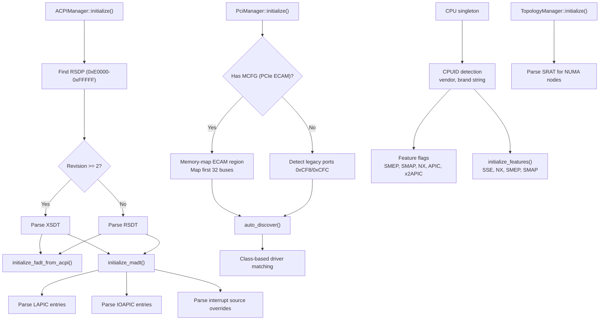

# Hardware Abstraction Layer

## Overview

FKernel implements a comprehensive hardware abstraction layer that manages CPU detection, ACPI table parsing, PCI bus enumeration, and interrupt controllers. The HAL provides singleton managers for unified hardware discovery and configuration during boot and runtime.

## Architecture

## Key Files

| File | Purpose |
|------|---------|
| `Src/Kernel/Hardware/Firmware/Acpi/acpi.cpp` | RSDP scan, RSDT/XSDT parsing, table lookup by signature |
| `Src/Kernel/Hardware/Firmware/Acpi/topology_manager.cpp` | NUMA node and CPU affinity mapping from SRAT |
| `Src/Kernel/Hardware/Firmware/Madt/madt.cpp` | MADT entry parsing (LAPIC, IOAPIC, overrides, local APIC address) |
| `Src/Kernel/Hardware/Firmware/Fadt/fadt_manager.cpp` | FADT power management configuration |
| `Src/Kernel/Hardware/Buses/Pci/pci.cpp` | PCI config space read/write (ECAM + legacy), bus scanning, driver matching |
| `Src/Kernel/Hardware/Buses/Pci/pci_node.cpp` | VFS node for `/sys/pci/` |
| `Src/Kernel/Hardware/Cpu/cpu.cpp` | CPUID vendor/brand, feature detection (SMEP, SMAP, NX, APIC) |
| `Src/Kernel/Hardware/Cpu/cpu_register.cpp` | Register abstraction (CR0, CR3, EFER, etc.) |
| `Src/Kernel/Hardware/Cpu/cpu_context.cpp` | Context save/restore (FPU/SSE state) |
| `Src/Kernel/Driver/Storage/Controllers/Ahci/ahci_controller.cpp` | AHCI SATA controller |
| `Src/Kernel/Driver/Storage/Controllers/Nvme/nvme_controller.cpp` | NVMe SSD controller |
| `Src/Kernel/Driver/Storage/Controllers/Ata/ata_controller.cpp` | Legacy ATA PIO/DMA |
| `Src/Kernel/Driver/Network/E1000/e1000.cpp` | Intel E1000 NIC (interrupt-driven) |

## Key Data Structures

| Structure | Purpose |
|-----------|---------|
| `ACPIManager` | Singleton: RSDP scan, table lookup, checksum validation |
| `PciManager` | Singleton: PCI bus enumeration, ECAM/legacy I/O, driver registration |
| `CPU` | Singleton: CPUID feature detection, MSR read/write, SMEP/SMAP/NX |
| `Processor` | Per-CPU state: current task, idle task, run queue, need_resched |
| `PciDevice` | PCI device descriptor: address, vendor/device IDs, class codes |
| `PciAddress` | Bus/device/function encoding for config space access |
| `Madt` | MADT table with variable-length entry array |
| `TopologyManager` | NUMA proximity domain → node mapping for physical memory |

## ACPI Tables

| Table | Purpose | Status |
|-------|---------|--------|
| RSDP | Root System Description Pointer (entry point) | Active |
| RSDT/XSDT | Root/Extended System Description Table (table directory) | Active |
| MADT | Multiple APIC Description Table (interrupt controllers) | Active |
| FADT | Fixed ACPI Description Table (power management) | Active |
| MCFG | PCI Express Memory-Mapped Configuration (ECAM) | Active |
| SRAT | System Resource Affinity Table (NUMA topology) | Active (via TopologyManager) |
| HPET | High Precision Event Timer | Detected via CPUID + table lookup |
| DMAR | DMA Remapping Table (IOMMU) | Parsed — DMA translation not yet enabled |

## PCI Enumeration

Two access methods:
- **PCIe ECAM**: Memory-mapped config space via MCFG table (preferred). First 32MB identity-mapped for bus scanning.
- **Legacy I/O**: Port 0xCF8 (address) and 0xCFC (data) for pre-PCIe systems.

Driver registration uses class/subclass codes with factory functions for automatic instantiation during `auto_discover()`. PCI device node registered in DevFS at `/dev/pci`.

## CPU Feature Detection

CPUID-based detection at construction:
- Vendor string (leaf 0), brand string (leaf 0x80000002-0x80000004)
- APIC (leaf 1, EDX bit 9), x2APIC (leaf 1, ECX bit 21)
- NX support (leaf 0x80000001, EDX bit 20) — enables EFER.NXE
- SMEP (leaf 7, EBX bit 7) — prevents kernel from executing user pages
- SMAP (leaf 7, EBX bit 20) — prevents kernel from accessing user pages directly
- SSE/FPU — CR0.EM cleared, CR4.OSFXSR/OSXMMEXCPT set

## Notable Design Decisions

- **Singleton pattern**: `ACPIManager`, `PciManager`, `CPU`, `TopologyManager` use Meyer's singleton for global access
- **Flexible array members**: MADT uses `uint8_t entries[]` for variable-length entry parsing
- **Checksum validation**: All ACPI tables validated via byte checksum before use
- **ECAM memory mapping**: First 32 buses identity-mapped for PCIe scanning
- **Per-CPU state**: `Processor` struct tracks per-core scheduling state for SMP support
- **SRAT integration**: TopologyManager reads NUMA proximity domains and assigns them to physical memory zones

## Current Status

~90% complete. ACPI table parsing is functional (RSDP, RSDT/XSDT, MADT, FADT, MCFG, SRAT, DMAR, HPET). PCI enumeration works via both ECAM and legacy paths. CPU feature detection covers SMEP, SMAP, NX, APIC, x2APIC, xSAVE. IOMMU parses DMAR but does not translate DMA. SMP support with per-CPU Processor data and INIT/STARTUP IPI boot. Storage: AHCI, NVMe, and legacy ATA drivers. Networking: Intel E1000 interrupt-driven NIC. HPET detected and configured. No IOAPIC rebalancing. No CPU hotplug.
