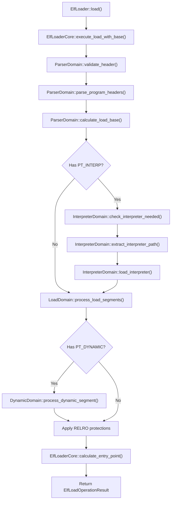

# ELF Loader

## Overview

FKernel implements a domain-driven ELF loader that handles loading executables into memory. The loader supports ET_EXEC and ET_DYN binaries with domain-based separation of concerns for parsing, segment loading, and dynamic linking. Security features include ASLR, NX, and RELRO.

## Architecture

## Domain Pipeline

Five specialized domains with single responsibility each:

| Domain | Responsibility |
|--------|----------------|
| `ParserDomain` | Validate ELF header, parse program headers, identify executable type, calculate load base |
| `InterpreterDomain` | Check for PT_INTERP, extract dynamic linker path, load interpreter |
| `LoadDomain` | Process PT_LOAD segments: map pages, copy data, zero BSS |
| `MemoryDomain` | Allocate physical pages, map virtual addresses, apply page permissions |
| `DynamicDomain` | Process PT_DYNAMIC segment, apply RELA/JMPREL relocations |

**Note**: `MemoryDomain` is used internally by `LoadDomain` and `InterpreterDomain`, not as a separate orchestrator step.

## Security Features

| Feature | Implementation |
|---------|---------------|
| **ASLR** | Random load base for ET_DYN binaries; fixed base for ET_EXEC |
| **NX** | ExecuteDisable flag on RELRO and non-executable segments |
| **RELRO** | Partial RELRO applied via `PT_GNU_RELRO` — pages set to read-only + NX after relocation |
| **TLS** | PT_TLS segment parsed; vaddr, filesz, memsz, align extracted for thread-local storage |
| **Stack NX** | PT_GNU_STACK checked for executable flag; passed to userspace for stack protection |

## Key Files

| File | Purpose |
|------|---------|
| `Src/Kernel/Loader/elf_loader.cpp` | Public API entry point |
| `Src/Kernel/Loader/elf_loader_core.cpp` | Orchestrates domain pipeline execution |
| `Src/Kernel/Loader/Domains/parser_domain.cpp` | ELF header validation and parsing |
| `Src/Kernel/Loader/Domains/interpreter_domain.cpp` | Dynamic linker loading |
| `Src/Kernel/Loader/Domains/load_domain.cpp` | PT_LOAD segment processing |
| `Src/Kernel/Loader/Domains/memory_domain.cpp` | Physical page allocation and mapping |
| `Src/Kernel/Loader/Domains/dynamic_domain.cpp` | Dynamic linking and relocations |
| `Src/Kernel/Loader/Domains/Base/elf_domain.cpp` | Base class for all domains |
| `Src/Kernel/Loader/Domains/Types/load_context.cpp` | Shared context state across domains |
| `Src/Kernel/Loader/Domains/Types/memory_region.cpp` | Memory region descriptors |

## Key Data Structures

| Structure | Purpose |
|-----------|---------|
| `ElfLoaderCore` | Orchestrates domain pipeline execution |
| `LoadContext` | Shared state: header, load_base, has_interpreter, interpreter_entry, interpreter_path |
| `MemoryRegion` | Describes a mapped segment: vaddr, filesz, memsz, flags |
| `ElfLoadOperationResult` | Result type with entry point, phdr info, TLS info, stack flags |
| `TlsInfo` | Thread-local storage metadata (vaddr, filesz, memsz, align) |
| `Elf64_Ehdr` | ELF header structure |
| `Elf64_Phdr` | Program header (segment descriptor) |

## ELF Types Supported

| Type | Support Level |
|------|---------------|
| ET_EXEC | Static executables, fixed base address |
| ET_DYN | Position-independent executables (PIE) and shared libraries |
| ET_REL | Relocatable objects (not yet supported) |

## Notable Design Decisions

- **Domain-driven design**: Each concern (parsing, loading, dynamic linking) is isolated in its own domain class inheriting from `ElfDomain`
- **Fallible operations**: All public APIs use `Result<T, Error>` for explicit error handling without exceptions
- **RELRO applied unconditionally**: Full RELRO protection set after dynamic processing (if PT_GNU_RELRO present)
- **First-page mapping**: ELF header and PHDRs are always mapped to ensure program header access
- **Entry point resolution**: Interpreter entry used when PT_INTERP present; otherwise e_entry + load_base for PIE or e_entry directly for ET_EXEC

## Current Status

~80% complete. ET_EXEC and ET_DYN loading functional. ASLR, NX, RELRO, and TLS support implemented. Dynamic linker loading works when PT_INTERP is present. ET_REL (relocatable objects) not yet supported. Symbol resolution for dynamic linking is partial.
