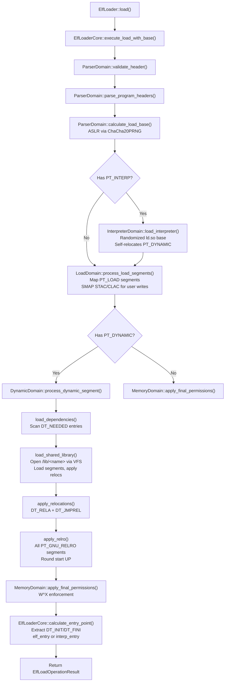

# ELF Loader

## Overview

FKernel implements a domain-driven ELF64 loader supporting static executables, dynamically linked binaries (DT_NEEDED + ld.so), and shared libraries. Features include ASLR (ChaCha20PRNG, 30-bit entropy), NX enforcement, full RELRO, W^X protection, TLS, SMAP-safe user memory access, and cross-object symbol resolution.

## Architecture

## Domain Pipeline

Five specialized domains with single responsibility:

| Domain | Responsibility |
|--------|----------------|
| `ParserDomain` | Validate ELF header (e_machine=EM_X86_64), parse program headers, calculate ASLR load base |
| `InterpreterDomain` | Check for PT_INTERP, extract dynamic linker path, load and self-relocate interpreter |
| `LoadDomain` | Process PT_LOAD segments: map pages, copy data via SMAP STAC/CLAC, zero BSS |
| `MemoryDomain` | Allocate physical pages, map virtual addresses, apply W^X enforcement, apply RELRO |
| `DynamicDomain` | Process PT_DYNAMIC, load DT_NEEDED shared libraries, apply all relocation types, cross-object symbol resolution |

## Dynamic Linking

### DT_NEEDED Processing

`DynamicDomain::load_dependencies()` scans the dynamic segment for `DT_NEEDED` entries and records them in a global `s_global_libraries` vector. `DynamicDomain::load_shared_library()` resolves each library path as `/lib/<name>`, opens via VFS, parses its ELF header, loads its PT_LOAD segments, extracts symtab/strtab, and applies its relocations.

### Cross-Object Symbol Resolution

`DynamicDomain::resolve_symbol_cross()` first tries local symbol resolution. For unresolved symbols (`SHN_UNDEF`), it scans all loaded shared libraries' symbol tables, matching by name. Handles `SHN_COMMON` symbols (returns 0 with debug log).

### Relocation Types

All 10 relocation types are implemented with SMAP STAC/CLAC safety:

| Type | Action |
|------|--------|
| `R_X86_64_NONE` | No-op |
| `R_X86_64_RELATIVE` | Base + addend |
| `R_X86_64_64` | Symbol value + addend |
| `R_X86_64_GLOB_DAT` | Global data symbol + addend |
| `R_X86_64_JUMP_SLOT` | PLT/GOT entry (eager binding) + addend |
| `R_X86_64_COPY` | Copy symbol data from shared library (addend = size) |
| `R_X86_64_IRELATIVE` | Indirect function (call ifunc at load_base + addend) |
| `R_X86_64_TPOFF64` | TLS offset + symbol value + addend |
| `R_X86_64_DTPMOD64` | TLS module ID (always 1) |
| `R_X86_64_DTPOFF64` | TLS offset within module + addend |

All write targets are accessed via `arch_smap_begin()` / `arch_smap_end()` pairs.

## Security Features

| Feature | Implementation |
|---------|---------------|
| **ASLR** | ChaCha20PRNG with 30-bit entropy. Main executable: `[0x10000000, 0x70000000)`. ld.so base independently randomized. |
| **NX** | ExecuteDisable flag on non-executable segments, NX stack by default (PT_GNU_STACK) |
| **W^X** | `apply_final_permissions()` rejects segments with both Writable and !ExecuteDisable |
| **RELRO** | All PT_GNU_RELRO segments processed (no single-segment limit). Start rounded UP. Interpreter RELRO also applied. |
| **SMAP** | `arch_smap_begin()`/`arch_smap_end()` in all user-memory write paths: `copy_segment_data`, `zero_fill_bss`, `apply_single_rela` targets, `map_single_page` zero-fill |
| **TLS** | PT_TLS parsed; TLS block at 0x7FFFFE000000 (Variant II); FS_BASE set via `arch_prctl` |

## ELF Types Supported

| Type | Support Level |
|------|---------------|
| ET_EXEC | Static executables, fixed base address |
| ET_DYN | PIE and shared libraries, ASLR-randomized base |
| ET_REL | Not yet supported |

## Program Headers Processed

| Type | Purpose |
|------|---------|
| `PT_LOAD` | Loadable segments (code, data, BSS) |
| `PT_DYNAMIC` | Dynamic linking information (DT_NEEDED, DT_RELA, DT_JMPREL, DT_SYMTAB, DT_STRTAB) |
| `PT_INTERP` | Dynamic linker path |
| `PT_TLS` | Thread-local storage template |
| `PT_GNU_STACK` | Stack NX enforcement |
| `PT_GNU_RELRO` | Read-only after relocations (all segments) |
| `PT_PHDR` | Program header table location (for auxv) |

## Key Files

| File | Purpose |
|------|---------|
| `Src/Kernel/Loader/elf_loader.cpp` | Public API entry point |
| `Src/Kernel/Loader/elf_loader_core.cpp` | Orchestrates domain pipeline, RELRO, entry point calculation |
| `Src/Kernel/Loader/Domains/parser_domain.cpp` | ELF header validation, PHDR parsing, ASLR base calculation |
| `Src/Kernel/Loader/Domains/interpreter_domain.cpp` | ld.so loading and self-relocation |
| `Src/Kernel/Loader/Domains/load_domain.cpp` | PT_LOAD segment mapping (SMAP-safe user writes) |
| `Src/Kernel/Loader/Domains/memory_domain.cpp` | Page allocation, permissions, W^X enforcement |
| `Src/Kernel/Loader/Domains/dynamic_domain.cpp` | DT_NEEDED loading, all 10 relocation types, cross-object symbols |
| `Src/Kernel/Loader/Domains/Base/elf_domain.cpp` | Base class for all domains |
| `Src/Kernel/Loader/Domains/Types/load_context.cpp` | Shared context state across domains |

## Key Data Structures

| Structure | Purpose |
|-----------|---------|
| `ElfLoaderCore` | Orchestrates domain pipeline execution |
| `LoadContext` | Shared state: header, load_base, has_interpreter, interpreter_entry, interpreter_path |
| `ElfLoadResult` | Entry point, PHDR info, TLS info, stack flags, init/fini addresses |
| `TlsInfo` | PT_TLS metadata (vaddr, filesz, memsz, align) |
| `LibraryContext` | Per-shared-library tracking: load_base, symtab, strtab, name |
| `SymbolContext` | Symbol resolution context: symtab + strtab pointers |

## Notable Design Decisions

- **Domain-driven design**: Each concern isolated in its own domain class, independently testable
- **Global library registry**: `s_global_libraries` vector tracks all loaded shared libraries for cross-object resolution
- **SMAP everywhere**: Every write to user memory goes through `arch_smap_begin()`/`arch_smap_end()`
- **ChaCha20PRNG ASLR**: Hardware CSPRNG-seeded randomness, 30-bit entropy (was 16-bit + deterministic)
- **All RELRO segments**: No single-segment limit; start address rounded UP for safety
- **W^X enforcement**: Rejects segments with both Writable and !ExecuteDisable at load time
- **Init/fini extraction**: DT_INIT, DT_FINI, DT_INIT_ARRAY, DT_FINI_ARRAY addresses passed in ElfLoadResult
- **Fallible operations**: All public APIs use `Result<T, Error>` without exceptions

## Current Status

~85% complete. ET_EXEC and ET_DYN loading functional. Full dynamic linking: DT_NEEDED shared library loading, cross-object symbol resolution, all 10 X86_64 relocation types. ASLR with ChaCha20PRNG + 30-bit entropy + randomized ld.so base. Full RELRO with correct alignment + interpreter RELRO. W^X enforcement active. SMAP STAC/CLAC in all user-memory write paths. TLS block at 0x7FFFFE000000 with FS_BASE. Init/fini addresses extracted. Remaining: endianness check (EI_DATA), file-size bounds validation on p_offset + p_filesz, symbol versioning (DT_VERSYM/DT_VERNEED). ET_REL not yet supported.
