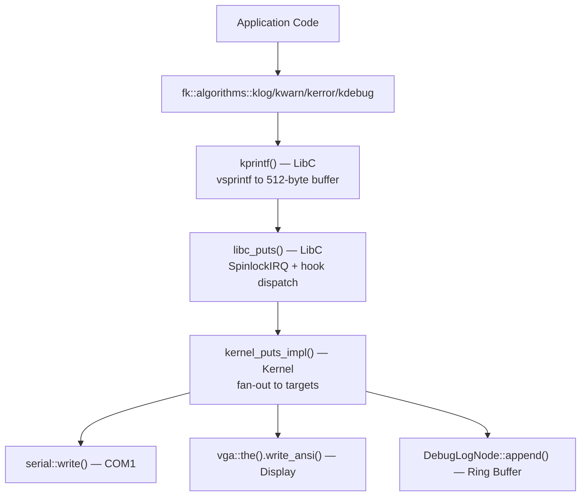

# Kernel Logging Subsystem

## Architecture

The kernel uses a four-layer logging pipeline:



## Key Files

| File | Path | Role |
|------|------|------|
| Log functions | `Include/LibFK/Algorithms/log.h` | `klog`, `kwarn`, `kerror`, `kdebug`, `kexception`, `klog_color` |
| kprintf | `Src/LibC/stdio/kprintf.c` | Printf implementation, 512-byte stack buffer |
| libc_puts dispatch | `Src/LibC/stdio/_impl/libc_putc.cpp` | Hook registration, target bitmask, SpinlockIRQ |
| Kernel fan-out | `Src/Kernel/Io/kernel_puts.cpp` | Routes to serial + VGA + DebugLogNode |
| DebugLogNode | `Src/Kernel/Fs/Virtual/DebugFs/debug_fs.cpp` | 64 KB ring buffer for dmesg |
| SyscallLogNode | `Src/Kernel/Fs/Virtual/DebugFs/debug_fs.cpp` | 128 KB ring buffer for syscall tracing |
| IpcLogNode | `Src/Kernel/Ipc/ipc_log_node.cpp` | 64 KB ring buffer for IPC tracing |
| Panic | `Src/Kernel/Arch/x86_64/Panic/Panic.cpp` | Panic output (currently bypasses logging) |

## Log Levels

| Function | Color | Halts | Use Case |
|----------|-------|-------|----------|
| `kerror(prefix, fmt, ...)` | Red | **Yes** | Unrecoverable errors (proposed: split into `kfatal()` halt + `kerror()` non-halting) |
| `kexception(prefix, fmt, ...)` | Red | No | Exception handler output |
| `kwarn(prefix, fmt, ...)` | Yellow | No | Warnings, degraded operation |
| `kdebug(prefix, fmt, ...)` | White | No | Debug diagnostics |
| `klog(prefix, fmt, ...)` | Green | No | Normal operational messages |
| `klog_color(prefix, color, fmt, ...)` | Custom | No | Custom-colored output |

## Log Targets

Controlled by bitmask in `libc_putc.cpp`:

```cpp
enum LogTarget : uint32_t {
    None     = 0,
    Display  = 1 << 0,   // VGA/framebuffer
    Serial   = 1 << 1,   // COM1
    DebugFS  = 1 << 2,   // Ring buffer for dmesg
    All      = Display | Serial | DebugFS
};
```

### Boot Stage Target Changes

| Stage | Targets | File:Line |
|-------|---------|-----------|
| Default | All (Display \| DebugFS \| Serial) | `libc_putc.cpp:5-8` |
| Early HW init | Serial only | `init.cpp:23` |
| After display ready | Serial \| Display | `init.cpp:43-44` |
| Idle task spawns init | All | `idle_task.cpp:23-25` |

## Usage

```cpp
#include <LibFK/Algorithms/log.h>

// Standard logging
fk::algorithms::klog("VFS", "Mounted %s at %s", fstype, path);
fk::algorithms::kwarn("NVME", "Sector size mismatch: expected %u got %u", expected, actual);
fk::algorithms::kerror("MEMORY", "Page allocation failed: order=%u", order);

// Exception logging (does not halt)
fk::algorithms::kexception("PAGE_FAULT", "RIP=%p CR2=%p error=%u", rip, cr2, error);
```

## Known Issues

1. **No log-level filtering** — all levels always compiled in
2. **Panic bypasses logging** — messages never reach dmesg
3. **`kerror()` halts on every call** — no non-halting error level; proposed split: `kfatal()` (halt) + `kerror()` (non-halting)
4. **Inconsistent prefix naming** — mixed conventions across ~100+ call sites
5. **Dead code** — StdoutLogNode/StderrLogNode never instantiated
6. **`set_log_target_bits()` declared but not implemented** in `kernel_puts.h`
7. **512-byte buffer truncation is silent**

## Future: Proposed Log Levels

```
FATAL   — halts the system (cli;hlt) — current kerror() behavior
ERROR   — non-halting error, requires attention
WARN    — warning, operation degraded but continues
INFO    — normal operational messages (init, state changes)
DEBUG   — verbose diagnostic output (gated behind LogLevel in release)
TRACE   — extremely verbose (function entry/exit)
```

## Related Documentation

- [Logging Development Pattern](../../.ai-docs/development-patterns/kernel-logging.md) — AI agent conventions
- [Logging Domain Guide](../../Docs/Domains/logging.md) — Architecture overview
