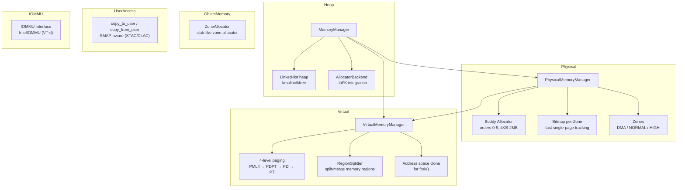

# Memory Management

## Overview

FKernel implements a multi-layered memory management system with physical memory (buddy allocator + zones), virtual memory (4-level paging), a kernel heap (linked-list allocator), zone-based object allocation, user-space memory access (SMAP-aware), and an IOMMU abstraction.

## Architecture

## Physical Memory Management

### Buddy Allocator
- Manages contiguous blocks of physical memory in power-of-two orders
- Orders 0-9 (4KB to 2MB)
- Fallback path: bitmap allocation first, buddy allocator as reserve

### Zones
Physical memory divided into zones based on hardware constraints:

| Zone | Range | Purpose |
|------|-------|---------|
| DMA | Below 16MB | Legacy hardware (ISA DMA) |
| NORMAL | Up to 4GB | Standard system memory |
| HIGH | Above 4GB | Extended memory (x86_64) |

### Physical Memory Manager
- Scans Multiboot2 memory map to populate zones
- Reserves kernel, heap, PMM bitmap, Multiboot data, and module regions
- NUMA-aware zone selection via `TopologyManager::get_node_for_paddr()`
- IRQ-safe allocation via `ScopedLockIRQ`

## Virtual Memory Management

### 4-Level Paging (x86_64)
- PML4 → PDPT → PD → PT
- Identity mapping for lower memory + framebuffer during early boot
- `ensure_table()` handles COW-safe page table creation (copies shared kernel tables when user bit needed)

### Key Operations
| Operation | Description |
|-----------|-------------|
| `map_page()` | Map virtual to physical with flags |
| `unmap_page()` | Remove mapping, flush TLB |
| `protect_page()` | Change page flags (used for RELRO) |
| `translate()` | Virtual → physical address translation |
| `create_address_space()` | Clone kernel PML4 for new process |
| `clone_address_space()` | Deep copy user pages for fork() |
| `free_address_space()` | Recursively free user page tables + pages |
| `unmap_page_range()` | Unmap range, free pages, clean up empty tables |

### RegionSplitter
Manages virtual memory regions (heap, mmap) with split/merge operations for `munmap()`.

## Kernel Heap

- Linked-list allocator with block splitting and merging
- 16-byte alignment enforced for SSE/performance
- Magic number headers for corruption detection
- Interrupt-safe: saves/restores RFLAGS, acquires spinlock
- LibFK integration via `AllocatorBackend` (operator new/delete route through this)

## ObjectMemory (Zone Allocator)

- Slab-like zone allocator for fixed-size kernel objects
- Configured via `ZoneType` and `ZoneDefs`
- Used for frequent small allocations

## UserAccess

SMAP-aware memory copy between kernel and userspace:
- `copy_to_user()` / `copy_from_user()` with address validation
- STAC/CLAC instructions used when CPU supports SMAP
- Returns `Result<void, Error>` for error propagation

## IOMMU

- Abstract `IOMMU` interface: `create_domain()`, `map_device()`, `set_translation()`
- Intel VT-d implementation (`IntelIOMMU`) initialized during `MemoryManager::initialize()`
- Active status checked; returns `nullptr` if hardware not present

## Key Files

| File | Purpose |
|------|---------|
| `Src/Kernel/Memory/memory_manager.cpp` | Central orchestrator: heap, page alloc/free wrappers |
| `Src/Kernel/Memory/PhysicalMemory/physical_memory_manager.cpp` | Zone creation, bitmap + buddy allocation |
| `Src/Kernel/Memory/PhysicalMemory/Buddy/buddy_allocator.cpp` | Buddy allocator implementation |
| `Src/Kernel/Memory/PhysicalMemory/Buddy/buddy_state.cpp` | Buddy state tracking |
| `Src/Kernel/Memory/VirtualMemory/virtual_memory_manager.cpp` | 4-level paging, address space management |
| `Src/Kernel/Memory/VirtualMemory/RegionSplitter/region_splitter.cpp` | Virtual memory region split/merge |
| `Src/Kernel/Memory/ObjectMemory/Zone/zone_allocator.cpp` | Slab-like zone allocator |
| `Src/Kernel/Memory/UserAccess/user_access.cpp` | SMAP-aware user memory copy |
| `Include/Kernel/Memory/iommu.h` | IOMMU abstract interface |

## Initialization Flow

1. **Assembly**: `setup_page_tables.asm` creates initial identity mapping
2. **Early Init**: `PhysicalMemoryManager::initialize()` scans Multiboot2 memory map, creates zones
3. **Early Init**: `VirtualMemoryManager::initialize()` allocates PML4, identity-maps, maps framebuffer
4. **Early Init**: `IntelIOMMU::initialize()` probes for VT-d hardware
5. **Early Init**: `MemoryManager::initialize_heap()` sets up linked-list heap, wires LibFK allocator backend

## Notable Design Decisions

- **Two-tier page allocation**: Bitmap for fast single-page, buddy allocator for contiguous multi-page
- **NUMA-aware**: Zone selection considers proximity domain from SRAT
- **COW-safe page table cloning**: `ensure_table()` copies shared kernel page table entries when user bit is needed, preventing modification of kernel page tables
- **IOMMU abstraction**: Clean interface allows future IOMMU implementations without changing callers
- **Interrupt-safe heap**: All heap operations save/restore interrupt state

## Current Status

~80% complete. Physical buddy allocator + zones functional. Virtual memory with 4-level paging, address space cloning, and RegionSplitter working. Kernel heap operational. UserAccess with SMAP support. IOMMU interface defined, Intel VT-d stub initialized. No demand paging or swap yet. No huge page (2MB/1GB) support in VMM.
