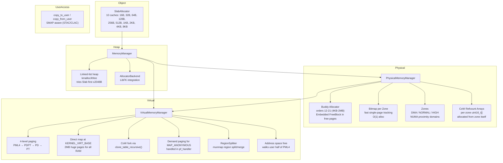

# Memory Management

## Overview

FKernel implements a multi-layered memory management system: physical memory (bitmap + buddy allocator with CoW reference counting), virtual memory (4-level paging with demand paging), a slab allocator for kernel objects, a linked-list kernel heap, NUMA-aware zone selection, SMAP-aware user memory access, and an IOMMU abstraction.

## Architecture

## Physical Memory Management

### Dual Allocator per Zone

Each zone has both a bitmap (for fast single-page allocation) and a buddy allocator (for contiguous multi-page blocks):

| Allocator | Use Case | Operation |
|-----------|----------|-----------|
| **Bitmap** | Single 4KB pages | `bitmap.alloc()` — O(1) set first clear bit |
| **Buddy** | Contiguous blocks (orders 12-21) | `buddy.alloc(order)` — power-of-two splits |

`alloc_page()` uses bitmap first, invalidating the corresponding buddy page. `alloc_contiguous()` uses buddy first, then marks all resulting bitmap pages as used. Both are reconciled during init via `reconcile_buddies()`.

### Zones

Physical memory divided into zones based on hardware constraints:

| Zone | Range | Purpose |
|------|-------|---------|
| DMA | Below 16MB | Legacy hardware (ISA DMA) |
| NORMAL | Up to 4GB | Standard system memory |
| HIGH | Above 4GB | Extended memory (x86_64) |

Zone selection is NUMA-aware: 4-level fallback across type and proximity domain preferences.

### CoW Reference Counting

Each zone has a per-frame `uint16_t` reference count array, allocated from the zone's own physical pages during initialization (`physical_memory_manager.cpp:156-181`). Used by:

- `fork()` — `clone_table_recursive()` increments refcount for shared writable pages
- `free_page()` — only frees when refcount reaches 0
- `increment_refcount()` / `decrement_refcount()` — explicit frame-level tracking

### Buddy Allocator

Orders 12-21 (4KB to 2MB). Key details:

- **Embedded FreeBlock**: metadata stored IN the free pages themselves via `KERNEL_VIRT_BASE` direct map — no separate metadata allocation
- **Static pool**: 16384 pre-allocated `FreeBlock` nodes for bootstrap (avoids chicken-and-egg allocation)
- **Buddy address**: `buddy(ptr, order) = ptr ⊕ (1 << order)`
- **Merge condition**: both block and its buddy must be free, within zone bounds

## Virtual Memory Management

### 4-Level Paging (x86_64)

PML4 → PDPT → PD → PT. Key operations:

| Operation | Description |
|-----------|-------------|
| `map_page()` | Map virtual to physical with flags, `ensure_table()` creates intermediate tables |
| `unmap_page()` | Remove single mapping, flush TLB |
| `protect_page()` | Change page flags in-place (used for RELRO, CoW) |
| `translate()` | Virtual → physical address walk |
| `create_address_space()` | Clone kernel PML4 hierarchy, share user pages (for execve) |
| `clone_address_space()` | Deep copy user pages with CoW semantics (for fork) |
| `free_address_space()` | Walk user half of PML4, free all pages + intermediate tables |
| `unmap_page_range()` | Unmap range, free underlying pages, clean up empty tables |
| `extend_direct_map()` | Map ALL physical RAM at `KERNEL_VIRT_BASE` using 2MB huge pages |

### ensure_table() — COW-Safe Table Creation

When a user mapping needs intermediate page tables, `ensure_table()` checks if existing entries are kernel-only. If a user bit is needed but the entry lacks it, the table is **copied** to a new page rather than modifying shared kernel page tables. This prevents user mappings from corrupting kernel address space.

### Demand Paging

Anonymous memory (`mmap MAP_ANONYMOUS`) is mapped lazily. The page fault handler (`pf_handler.cpp`) allocates and zero-fills a physical page on first access. Only triggers for not-present faults (`error_code & 1 == 0`).

### CoW Fork

`clone_table_recursive()` deep-copies the page table hierarchy. At the leaf (PT) level:
- **Writable pages**: remove Writable bit in BOTH parent and child PTEs, increment CoW refcount
- **Non-writable pages**: share PTE directly
- **Kernel mappings**: copy entry (no CoW needed)

Write-protection faults trigger `handle_write_protection()` which allocates a new physical page, copies data, and updates the PTE.

### Direct Map

`extend_direct_map()` maps all physical memory at `KERNEL_VIRT_BASE` using 2MB huge pages (`PageFlags::HugePage`). This allows kernel code to access any physical address as `phys + KERNEL_VIRT_BASE`, used by the buddy allocator's embedded FreeBlock metadata.

## Slab Allocator

`SlabAllocator` provides fast, fixed-size object allocation with 10 caches:

| Cache | Object Size |
|-------|-------------|
| 16B | Small objects, pointers |
| 32B | Medium objects |
| 64B | Larger objects |
| 128B | |
| 256B | |
| 512B | |
| 1KB | |
| 2KB | |
| 4KB | |
| 8KB | Max slab size |

The kernel heap (`MemoryManager::allocate()`) tries slab first for allocations ≤2KB before falling back to the linked-list heap.

## Kernel Heap

- Linked-list first-fit allocator with block splitting and 16-byte alignment
- Free coalesces both forward and backward with adjacent blocks
- Magic number (`0xC0FFEE`) checked on every operation for corruption detection
- Interrupt-safe: saves/restores RFLAGS, acquires spinlock
- LibFK integration via `AllocatorBackend` callback structure

## UserAccess

SMAP-aware memory copy between kernel and userspace:
- `copy_to_user()` / `copy_from_user()` with address validation
- `is_user_address()` checks range is `< 0x800000000000`
- STAC/CLAC instructions when CPU supports SMAP
- Returns `Result<void, Error>` for error propagation

## Initialization Flow

1. **PhysicalMemoryManager::initialize()** — scans Multiboot2 memory map, creates zones, reserves kernel/heap/bitmap/modules, allocates CoW refcount arrays
2. **VirtualMemoryManager::initialize()** — allocates PML4, identity-maps lower memory + framebuffer, writes CR3
3. **VirtualMemoryManager::extend_direct_map()** — maps all physical RAM at KERNEL_VIRT_BASE with 2MB huge pages
4. **PhysicalMemoryManager::reconcile_buddies()** — syncs buddy state from bitmap (requires direct map)
5. **SlabAllocator::initialize()** — sets up 10 object caches (16B through 8KB)
6. **IntelIOMMU::initialize()** — probes VT-d hardware, parses DMAR (DMA translation not yet enabled)
7. **MemoryManager::initialize_heap()** — sets up linked-list heap, wires LibFK allocator backend

## Key Files

| File | Purpose |
|------|---------|
| `Src/Kernel/Memory/memory_manager.cpp` | Central orchestrator: heap, page alloc/free wrappers |
| `Src/Kernel/Memory/PhysicalMemory/physical_memory_manager.cpp` | Zone creation, bitmap + buddy allocation, CoW refcounts |
| `Src/Kernel/Memory/PhysicalMemory/Buddy/buddy_allocator.cpp` | Buddy allocator (orders 12-21) |
| `Src/Kernel/Memory/PhysicalMemory/Buddy/buddy_state.cpp` | Buddy state tracking |
| `Src/Kernel/Memory/VirtualMemory/virtual_memory_manager.cpp` | 4-level paging, address space management, direct map |
| `Src/Kernel/Memory/VirtualMemory/RegionSplitter/region_splitter.cpp` | Virtual memory region split/merge |
| `Src/Kernel/Memory/ObjectMemory/slab_allocator.cpp` | Slab allocator (10 caches, 16B–8KB) |
| `Src/Kernel/Memory/UserAccess/user_access.cpp` | SMAP-aware user memory copy |
| `Include/Kernel/Memory/iommu.h` | IOMMU abstract interface |
| `Src/Kernel/Arch/x86_64/Interrupt/Handler/Exception/pf_handler.cpp` | Page fault handler (demand paging + CoW) |

## Notable Design Decisions

- **Dual allocator per zone**: Bitmap for fast single-page, Buddy for contiguous blocks — reconciled, not redundant
- **Embedded buddy metadata**: FreeBlock stored in free pages via direct map, saving ~1MB BSS
- **CoW refcounts**: Per-zone uint16_t arrays for accurate page sharing tracking
- **COW-safe page table cloning**: `ensure_table()` copies shared kernel tables when user bit needed
- **2MB huge pages**: Direct map uses `PageFlags::HugePage` for low TLB pressure
- **Slab-first heap**: kernel `allocate()` tries slab for ≤2KB, falls back to linked-list heap
- **ASLR/W^X/RELRO**: Page permissions enforce NX, W^X, and RELRO via mprotect and PTE flag manipulation
- **NUMA-aware**: Zone selection considers proximity domain from SRAT
- **Interrupt-safe**: All heap and PMM operations save/restore interrupt state

## Current Status

~90% complete. Physical buddy + bitmap + zones functional. Virtual memory with 4-level paging, CoW fork, demand paging for anonymous memory. Slab allocator with 10 caches (16B–8KB). Kernel heap operational. Direct map with 2MB huge pages. CoW refcount arrays per zone. UserAccess with SMAP support. IOMMU (Intel VT-d) parses DMAR but does not yet translate DMA. ASLR, W^X, and RELRO enforced via page permissions. No swap support. No transparent huge pages beyond the kernel direct map.
