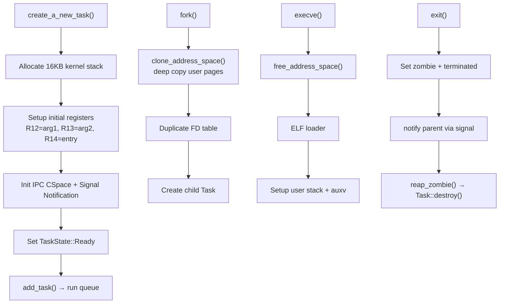

# Process Management

## Overview

FKernel implements BSD-style process management with Linux x86_64 ABI compatibility. Each task (process/thread) is represented by a `Task` struct containing identity, lifecycle, resources (memory, files, IPC), and CPU context. Process groups and sessions support job control.

## Architecture



## Task States

```mermaid
stateDiagram-v2
    [*] --> Created : create_a_new_task()
    Created --> Ready : add_task()
    Ready --> Running : pick_next()
    Running --> Ready : preemption (on_tick)
    Running --> Blocked : sleep/IPC wait
    Running --> Sleeping : sleep_current()
    Blocked --> Ready : wake_task()
    Sleeping --> Ready : wake_task()
    Running --> Zombie : zombify_current()
    Zombie --> [*] : reap_zombie() → Task::destroy()
```

## Task Structure

### Identity (`TaskIdentity`)
| Field | Type | Description |
|-------|------|-------------|
| `id` | `ProcessId` | Unique PID (atomic generation) |
| `ppid` | `ProcessId` | Parent PID |
| `pgid` | `ProcessId` | Process group ID |
| `sid` | `ProcessId` | Session ID |
| `name` | `fixed_string<64>` | Task name |

### Lifecycle (`TaskLifecycle`)
| Field | Description |
|-------|-------------|
| `state` | Current `TaskState` |
| `priority` | Scheduling priority |
| `nice` | Nice value (not yet integrated into priority) |
| `cpu_affinity` | CPU affinity mask |
| `time_slice_ticks` | Remaining time slice |
| `wake_up_time_ticks` | Wake-up time for sleeping tasks |
| `is_a_kernel_task` | Kernel vs user task flag |
| `terminated` | Exit requested flag |
| `exit_status` | Exit code |
| `clear_child_tid` | For `clone()` CLONE_CHILD_CLEARTID |
| `vfork_*` | vfork synchronization fields |

### Resources
| Sub-struct | Contents |
|------------|----------|
| `TaskMemory` | CR3, heap/mmap regions, memory region list |
| `TaskFiles` | CWD (`"/"`), file descriptor table (dynamic `Vector<RefPtr<FileDescription>>`) |
| `TaskIpc` | CSpace pointer, signal notification endpoint, pending/blocked signal masks |
| `TaskContext` | CPU registers, kernel/user stack pointers, FPU/SSE state, FS/GS base |

## Process Groups & Sessions

- `setsid()` — Create new session, become session leader
- `setpgid()` — Set process group ID
- `getpgid()` / `getpgrp()` — Query process group
- Foreground process group tracked per-terminal for job control
- Signal delivery respects process groups (`tgkill`, `kill`)

## Zombie Reaping

1. `exit()` sets `terminated = true`, `state = Zombie`
2. Parent notified via signal delivery
3. `wait4()` collects exit status
4. `reap_zombie()` calls `Task::destroy()`:
   - Unregisters signal notification from global IPC table
   - Frees CSpace and signal notification
   - Frees kernel stack (16KB)
   - Frees prev_cr3 (pre-execve address space)
   - Frees current user address space

## PID Generation

Atomic PID allocation via `__sync_fetch_and_add` in `SchedulerManager::generate_pid()` — lock-free, SMP-safe.

## Key Files

| File | Purpose |
|------|---------|
| `Src/Kernel/Scheduler/Task/task.cpp` | Task creation, destruction, FD management |
| `Src/Kernel/Scheduler/SchedulerManager.cpp` | Core scheduler: pick_next, schedule, steal_task, PID generation |
| `Src/Kernel/Scheduler/SchedulerLifecycle.cpp` | Task lifecycle: add, block, sleep, zombify, wake, on_tick |
| `Src/Kernel/Scheduler/SchedulerIntrospection.cpp` | Debug: print_all_tasks, find_task |
| `Src/Kernel/Scheduler/idle_task.cpp` | Idle task entry, spawns init on first run |
| `Src/Kernel/Scheduler/init_task.cpp` | PID 1 bootstrap, ELF loading, user stack setup |
| `Src/Kernel/Scheduler/start_user_task.cpp` | User task entry, signal delivery |
| `Src/Kernel/Syscall/SyscallList/Process/fork.cpp` | fork() implementation |
| `Src/Kernel/Syscall/SyscallList/Process/execve.cpp` | execve() implementation |
| `Src/Kernel/Syscall/SyscallList/Process/exit.cpp` | exit/exit_group implementation |

## Key Syscalls

| Syscall | Number | Description |
|---------|--------|-------------|
| `fork` | 57 | Clone task, page tables, FDs |
| `vfork` | 58 | Fork with shared address space |
| `clone` | 56 | Clone with flags |
| `execve` | 59 | Load ELF, replace address space |
| `exit` | 60 | Set zombie, notify parent |
| `exit_group` | 231 | Exit all threads in process |
| `wait4` | 61 | Collect child exit status |
| `getpid` | 39 | Return task PID |
| `gettid` | 186 | Return thread ID |
| `getppid` | 110 | Return parent PID |
| `kill` | 62 | Send signal to process/group |
| `setsid` | 112 | Create new session |
| `setpgid` | 109 | Set process group |

## Notable Design Decisions

- **16KB kernel stacks**: Each task gets a 16KB kernel stack allocated via `kmalloc`
- **Intrusive list nodes**: Tasks use `IntrusiveListNode<Task>` members for queue membership (no extra allocation)
- **Per-task signal notification**: Each task has its own IPC notification endpoint registered in a global manager
- **COW-safe fork**: `clone_address_space()` deep-copies user pages; kernel pages shared via entry copy
- **Lock IRQ-safe FD table**: File descriptor operations acquire per-task spinlock with IRQs disabled

## Current Status

~75% complete. Fork, exec, exit, wait functional. Process groups and sessions implemented. Signal delivery working. No thread groups (clone with CLONE_THREAD) yet. Nice values not integrated into priority. No resource limits enforcement.
