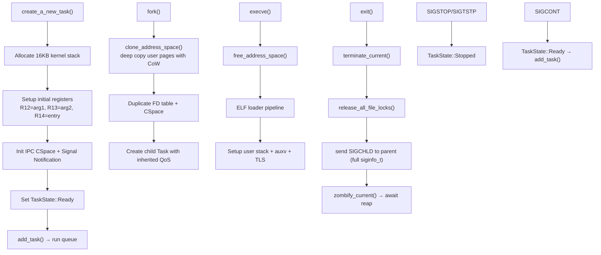

# Process Management

## Overview

FKernel implements BSD-style process management with Linux x86_64 ABI compatibility. Each task is represented by a `Task` struct containing identity, lifecycle, resources (memory, files, IPC), and CPU context. Process groups, sessions, and job control signals are fully wired.

## Architecture



## Task States

```mermaid
stateDiagram-v2
    [*] --> Created : create_a_new_task()
    Created --> Ready : add_task()
    Ready --> Running : pick_next()
    Running --> Ready : preemption / yield
    Running --> Blocked : block_current() / IPC wait
    Running --> Sleeping : sleep_current()
    Blocked --> Ready : wake_task()
    Sleeping --> Ready : wake_task() (on_tick)
    Running --> Stopped : SIGSTOP/SIGTSTP/SIGTTIN/SIGTTOU
    Stopped --> Ready : SIGCONT
    Running --> Zombie : terminate_current()
    Zombie --> [*] : reap_zombie() → Task::destroy()
```

All states are actively used. `Stopped` is set by `SignalDelivery::apply_default()` and restored by SIGCONT handling. `Zombie` is reaped by parent via `wait4()`.

## Task Structure

### Identity (`TaskIdentity`)
| Field | Type | Description |
|-------|------|-------------|
| `id` | `ProcessId` | Unique PID (atomic via `__sync_fetch_and_add`) |
| `ppid` | `ProcessId` | Parent PID |
| `pgid` | `ProcessId` | Process group ID |
| `sid` | `ProcessId` | Session ID |
| `uid`/`gid` | `uint32_t` | User/group ID |
| `name` | `fixed_string<64>` | Task name |

### Lifecycle (`TaskLifecycle`)
| Field | Description |
|-------|-------------|
| `state` | Current `TaskState` (Created/Ready/Running/Blocked/Sleeping/Stopped/Zombie) |
| `qos` | QoSClass (0-5), mapped to MLFQ level + quantum |
| `policy` | SchedulingPolicy (Normal/Fifo/RoundRobin/Batch/Idle) |
| `nice` | Nice value (-20 to +19), adjusts priority within QoS band |
| `mlfq_level` | Current MLFQ level (0-3) |
| `time_slice_ticks` | Remaining time slice at current level |
| `cpu_time_consumed` | Accumulated CPU time for demotion decisions |
| `allotment_ticks` | CPU allotment before demotion |
| `priority` | Effective priority (QoS base + nice + boost) |
| `cpu_affinity` | CPU affinity mask |
| `wake_up_time_ticks` | Wake-up deadline for sleeping tasks |
| `boosted` / `original_qos` | Turnstile priority inheritance state |
| `is_a_kernel_task` | Kernel vs user task flag |
| `terminated` | Exit requested flag |
| `exit_status` | Exit code |
| `clear_child_tid` | For `clone()` CLONE_CHILD_CLEARTID |
| `vfork_*` | vfork synchronization fields |

### Resources
| Sub-struct | Contents |
|------------|----------|
| `TaskMemory` | CR3, heap/mmap regions, memory region list |
| `TaskFiles` | CWD (`"/"`), file descriptor table (dynamic `Vector<RefPtr<FileDescription>>`) |
| `TaskIpc` | CSpace pointer, signal notification endpoint, pending/blocked signal masks, sigaction array, pending turnstile, active turnstile |
| `TaskContext` | CPU registers, kernel/user stack pointers, FPU/SSE state (512 bytes), FS/GS base, saved RIP/RSP/RFLAGS |

## Process Groups & Sessions

- **Session**: Collection of process groups. Created by `setsid()`
- **Session Leader**: First process in session (usually a shell)
- **Process Group**: Collection of processes in same job. Created by `setpgid()`
- **Foreground Process Group**: Receives terminal I/O and signals (tracked per-terminal)
- **Controlling Terminal**: Assigned via `TIOCSCTTY`
- Signal delivery respects process groups: `kill(-pgid, sig)` → all members of group

## Zombie Reaping

1. `terminate_current()` sets `terminated = true`, `exit_status`, sends SIGCHLD, calls `zombify_current()`
2. `zombify_current()` sets `state = Zombie`, `terminated = true`, adds to zombie queue
3. Parent notified via `SignalDelivery::send_signal(parent, SIGCHLD, &siginfo_t)`
4. Parent's `wait4()` collects exit status from zombie queue
5. `reap_zombie()` calls `Task::destroy()`:
   - Unregisters signal notification from global IPC table
   - Frees CSpace and signal notification
   - Frees kernel stack (16KB)
   - Frees prev_cr3 (pre-execve address space)
   - Frees current user address space

## PID Generation

Atomic PID allocation via `__sync_fetch_and_add` in `SchedulerManager::generate_pid()` — lock-free, SMP-safe. Starts at PID 2 (PID 0 = idle, PID 1 = init).

## Demand Paging

Anonymous memory allocated via `mmap(MAP_ANONYMOUS)` is mapped lazily. The page fault handler (`pf_handler.cpp`) detects not-present faults on anonymous regions and allocates a zero-filled physical page on first access. This defers physical page allocation until actual memory use, reducing memory overhead for sparse mappings.

## Lazy FPU Context Switching

FPU/SSE state (512 bytes per task) is saved and restored lazily. On context switch, the current task's FPU state is saved only if it was used since the last save. On first FPU access by a new task, a `DeviceNotAvailable` (#NM) exception triggers `fpu_restore()` which reloads the saved state. This minimizes the cost of FPU context switching for tasks that don't use floating-point.

## vfork Semantics

`vfork()` creates a child that shares the parent's address space. Parent is blocked (`vfork_waiting = true`) until child calls `execve()` or `exit()`. `terminate_current()` checks `vfork_parent_id` and clears `vfork_waiting` on child exit.

## Key Files

| File | Purpose |
|------|---------|
| `Src/Kernel/Scheduler/Task/task.cpp` | Task creation, destruction, FD management |
| `Src/Kernel/Scheduler/Core/scheduler_manager.cpp` | Core scheduler: pick_next, schedule, steal_task, PID generation |
| `Src/Kernel/Scheduler/Core/scheduler_lifecycle.cpp` | Task lifecycle: add, block, sleep, zombify, wake, on_tick, terminate_current |
| `Src/Kernel/Scheduler/Core/scheduler_introspection.cpp` | Debug: print_all_tasks, find_task |
| `Src/Kernel/Scheduler/Task/idle_task.cpp` | Idle task entry, spawns init on first run |
| `Src/Kernel/Scheduler/Task/init_task.cpp` | PID 1 bootstrap, ELF loading, user stack + TLS setup |
| `Src/Kernel/Scheduler/Task/start_user_task.cpp` | User task entry, signal delivery before iret |
| `Src/Kernel/Scheduler/Qos/qos.cpp` | QoS↔priority/quantum/allotment mappings |
| `Src/Kernel/Scheduler/Sync/turnstile.cpp` | Turnstile create/destroy/boost/unboost |
| `Src/Kernel/Ipc/Signals/signal_delivery.cpp` | Signal delivery, default actions (Stop/Continue/Terminate) |
| `Src/Kernel/Syscall/syscall_list/Process/fork.cpp` | fork() — CoW clone |
| `Src/Kernel/Syscall/syscall_list/Process/vfork.cpp` | vfork() — shared address space |
| `Src/Kernel/Syscall/syscall_list/Process/clone.cpp` | clone() — with flags |
| `Src/Kernel/Syscall/syscall_list/Process/execve.cpp` | execve() — ELF load + address space swap |
| `Src/Kernel/Syscall/syscall_list/Process/exit.cpp` | exit/exit_group |
| `Src/Kernel/Syscall/syscall_list/Process/wait4.cpp` | wait4() — zombie reaping |

## Key Syscalls

| Syscall | Number | Description |
|---------|--------|-------------|
| `fork` | 57 | Clone task, CoW page tables, duplicate FDs |
| `vfork` | 58 | Fork with shared address space, parent blocked |
| `clone` | 56 | Clone with flags (CLONE_CHILD_CLEARTID, etc.) |
| `execve` | 59 | Load ELF, replace address space, setup TLS + auxv |
| `exit` | 60 | Set zombie, notify parent |
| `exit_group` | 231 | Exit all threads in process |
| `wait4` | 61 | Collect child exit status |
| `getpid`/`gettid` | 39/186 | Return task PID/thread ID |
| `getppid` | 110 | Return parent PID |
| `kill`/`tgkill` | 62/234 | Send signal to process/thread/group |
| `setsid` | 112 | Create new session |
| `setpgid`/`getpgid`/`getpgrp` | 109/121/111 | Process group management |

## Notable Design Decisions

- **16KB kernel stacks**: Each task gets a 16KB kernel stack allocated via `kmalloc`
- **Intrusive list nodes**: Tasks use `IntrusiveListNode<Task>` members (run_node, wait_node, recv_wait_node, sleep_node, zombie_node) for zero-allocation queue ops
- **Per-task signal notification**: Each task has its own IPC notification endpoint for siginfo_t delivery
- **CoW fork**: `clone_address_space()` deep-copies user pages with CoW semantics; kernel pages shared via entry copy
- **Lock IRQ-safe FD table**: File descriptor operations acquire per-task spinlock with IRQs disabled
- **QoS inheritance**: Child inherits parent's QoS, policy, nice, and MLFQ level on fork/vfork/clone
- **Turnstile inheritance**: Priority inheritance during IPC operations

## Current Status

~85% complete. Fork, vfork, clone, execve, exit, wait4 all functional. Process groups, sessions, and job control signals (SIGSTOP/SIGCONT/SIGTSTP) wired. Signal delivery with siginfo_t via notification endpoint. CoW fork with refcounted physical pages. Demand paging for anonymous memory via not-present page faults. Lazy FPU context switching with #NM trap and delayed restore. Zombie reaping with full resource cleanup. vfork parent blocking. Thread groups (CLONE_THREAD) partial — tgid tracking and CLONE_THREAD implemented (`clone.cpp:45-46`); signal delivery per group incomplete (Phase 44). No resource limits enforcement (rlimit returns unlimited). No cgroups.
