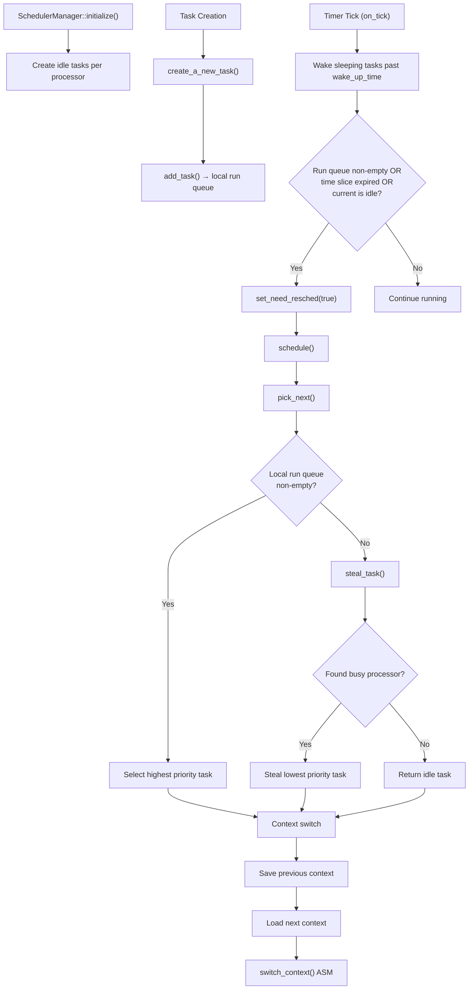
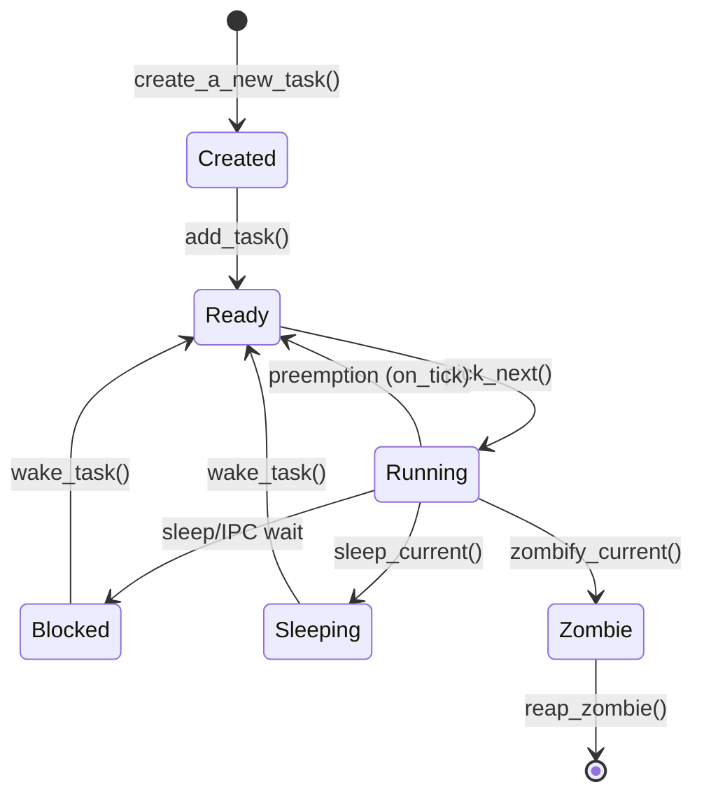
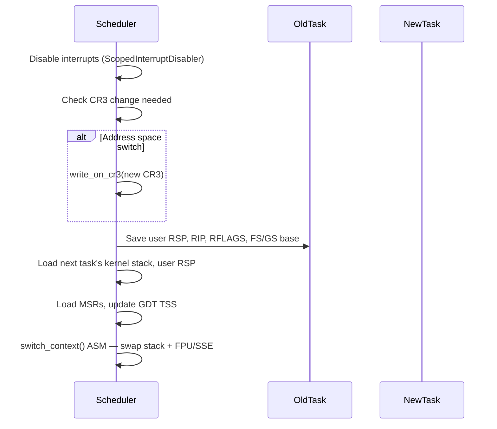

# Scheduler

## Overview

FKernel implements a preemptive, priority-based scheduler with SMP support and work-stealing load balancing. The scheduler manages task lifecycle, context switching, and processor affinity across up to 32 per-CPU processors.

## Architecture

## Task States

**Note**: `TaskState::Stopped` is defined in the enum but no scheduler code currently transitions tasks to/from `Stopped`. SIGSTOP/SIGTSTP/SIGCONT handling is wired at the signal layer but the scheduler does not implement the state transitions.

## Per-CPU Processors

Up to 32 processors supported. Each `Processor` struct contains:
- Current task pointer
- Idle task pointer
- Local run queue (intrusive linked list)
- `need_resched` flag

## Work Stealing

When a processor's local run queue is empty:
1. Find processor with most tasks (minimum > 1 to avoid stealing idle tasks)
2. Lock the victim's run queue
3. Select the lowest priority task
4. Remove from victim's queue and add to local queue

This ensures load balancing without centralized coordination.

## Context Switch

Assembly implementation in `Src/Kernel/Arch/x86_64/Scheduler/context_switch.asm`.

## Scheduling Algorithm

- **Priority-based**: Higher priority tasks run first
- **Preemptive**: Timer ticks decrement time slice; preempt when expired
- **Default quantum**: 5 ticks per time slice
- **Nice values**: Supported in task struct but not yet integrated into priority calculation

## Key Files

| File | Purpose |
|------|---------|
| `Src/Kernel/Scheduler/SchedulerManager.cpp` | Core: pick_next, schedule, steal_task, PID generation |
| `Src/Kernel/Scheduler/SchedulerLifecycle.cpp` | Lifecycle: add, block, sleep, zombify, wake, on_tick |
| `Src/Kernel/Scheduler/SchedulerIntrospection.cpp` | Debug: print_all_tasks, find_task |
| `Src/Kernel/Scheduler/idle_task.cpp` | Idle task entry, spawns init on first run |
| `Src/Kernel/Scheduler/init_task.cpp` | PID 1 bootstrap, ELF loading, user stack setup |
| `Src/Kernel/Scheduler/start_user_task.cpp` | User task entry, signal delivery |
| `Src/Kernel/Scheduler/Task/task.cpp` | Task structure methods (FD management, memory regions) |
| `Src/Kernel/Arch/x86_64/Scheduler/context_switch.asm` | Assembly context switch |
| `Src/Kernel/Arch/x86_64/Scheduler/enter_user_mode.asm` | Ring 3 transition |

## Key Data Structures

| Structure | Purpose |
|-----------|---------|
| `SchedulerManager` | Singleton managing all processors and task queues |
| `Task` | Central task object with identity, resources, and scheduling state |
| `TaskIdentity` | PID, PPID, PGID, SID, UID/GID, session leader flag |
| `TaskMemory` | CR3, heap/mmap regions, memory region list |
| `TaskFiles` | CWD, file descriptor table (dynamic Vector) |
| `TaskIpc` | CSpace pointer, signal pending/blocked masks, actions |
| `TaskContext` | CPU registers, kernel/user stack pointers, FPU/SSE state |
| `TaskLifecycle` | State, priority, nice, CPU affinity, time slice |
| `Processor` | Per-CPU state: current task, idle task, run queue, need_resched |

**Note**: The `Task` struct uses direct `IntrusiveListNode<Task>` members for queue membership (run_node, wait_node, recv_wait_node, sleep_node, zombie_node), not a separate `TaskNodes` wrapper.

## Notable Design Decisions

- **Per-CPU run queues**: Each processor maintains its own run queue to minimize contention
- **Intrusive lists**: Tasks use intrusive list nodes for queue membership (no extra allocation)
- **Atomic PID allocation**: `__sync_fetch_and_add` for lock-free PID generation
- **Spinlock protection**: Per-processor run queue locks for SMP safety
- **Interrupt-safe scheduling**: Context switch runs with interrupts disabled to prevent races

## Current Status

~80% complete. Preemptive scheduling with priority queues functional. Per-CPU processors and work stealing implemented. Context switch working. Timer-based preemption active. No real-time scheduling classes. No CPU hotplug. Nice values not yet integrated into priority.
