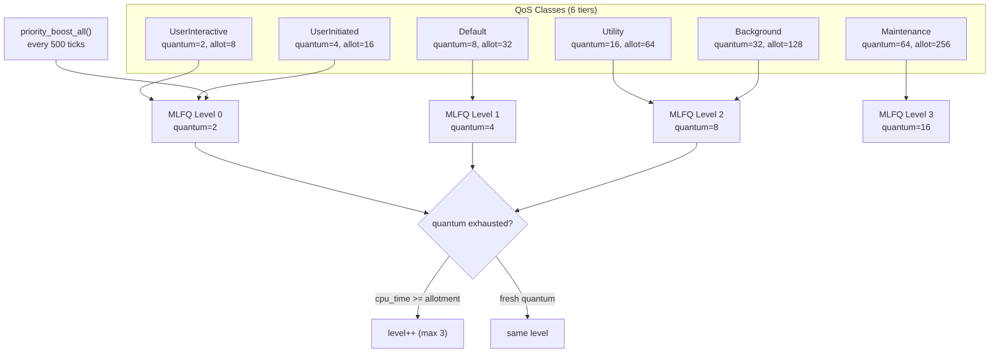
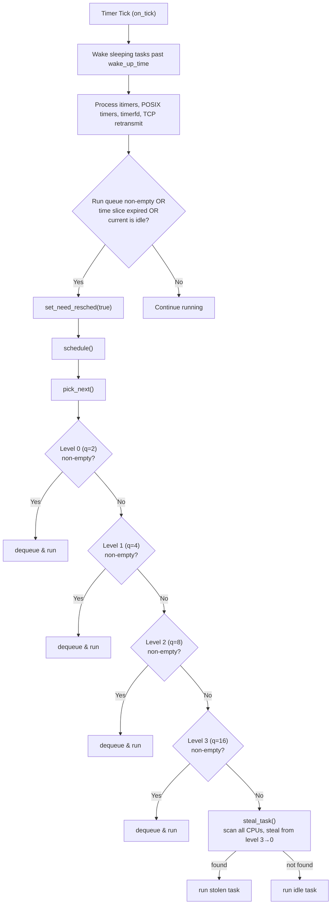
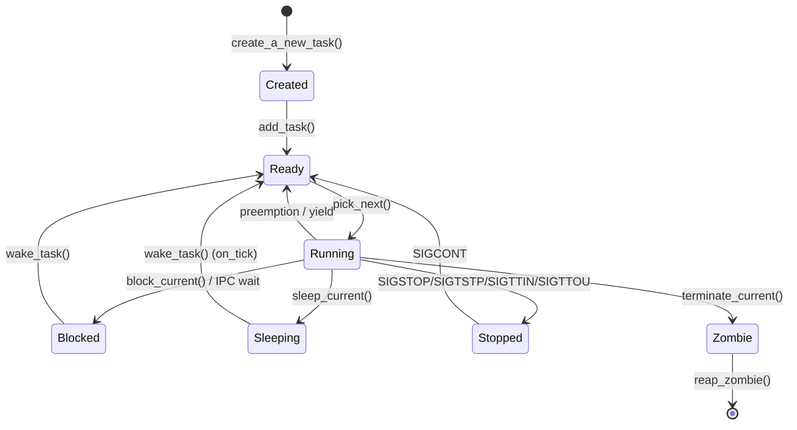
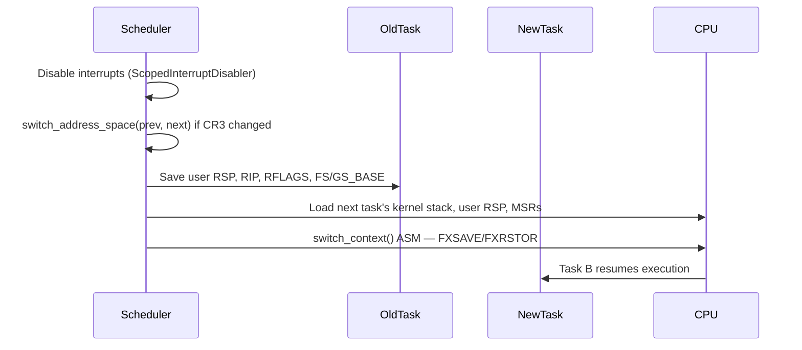

# Scheduler

## Overview

FKernel implements an **XNU-inspired QoS-aware scheduler** with a 4-level **Multi-Level Feedback Queue (MLFQ)**, periodic priority boost for starvation prevention, and **turnstile-based priority inheritance** for IPC. SMP support with work-stealing load balancing across up to 32 per-CPU processors.

## Architecture

### Scheduling Flow

## Task States

All states are actively used in scheduler code. `Stopped` is set by `SignalDelivery::apply_default()` (`signal_delivery.cpp:77-84`), and `SIGCONT` transitions back to `Ready` via `SchedulerManager::add_task()`.

## QoS Classes and MLFQ Mapping

| QoS Class | Priority Band | Quantum (ticks) | Allotment (ticks) | Default MLFQ Level |
|-----------|---------------|------------------|--------------------|---------------------|
| `UserInteractive` (0) | 112–127 | 2 | 8 | 0 |
| `UserInitiated` (1) | 80–119 | 4 | 16 | 0 |
| `Default` (2) | 60–99 | 8 | 32 | 1 |
| `Utility` (3) | 40–79 | 16 | 64 | 2 |
| `Background` (4) | 20–59 | 32 | 128 | 2 |
| `Maintenance` (5) | 0–39 | 64 | 256 | 3 |

Within each QoS band, `nice` values (-20 to +19) adjust base priority by ±7..-8.

## MLFQ Levels

4 levels (`MLFQ_LEVELS = 4`) with escalating quantum:

| Level | Quantum (ticks) |
|-------|----------------|
| 0 | 2 |
| 1 | 4 |
| 2 | 8 |
| 3 | 16 |

### Demotion (on_tick)

When a task exhausts its quantum AND its `cpu_time_consumed >= allotment_ticks`, it is demoted one level (unless already at level 3). `SchedulingPolicy::Fifo` tasks are exempt from demotion.

### Priority Boost (Aging)

Every `BOOST_PERIOD_TICKS` (500 ticks), `priority_boost_all()` moves all tasks from levels 1–3 back to level 0. This prevents starvation of CPU-bound tasks demoted to lower levels.

## Scheduling Policies

| Policy | Behavior |
|--------|----------|
| `Normal` | MLFQ with demotion and boost (default) |
| `Fifo` | Runs until blocked; no demotion, no preemption |
| `RoundRobin` | Yield on quantum expiry; re-enqueues at same level |
| `Batch` | Normal MLFQ behavior |
| `Idle` | Runs only when nothing else is ready |

## Work Stealing

`steal_task()` scans all CPUs for the busiest run queue, then steals from the **lowest** MLFQ level (scanning 3→0) to minimize disruption to interactive tasks. When all run queues are empty, returns the idle task.

## Turnstiles (Priority Inheritance)

Turnstiles prevent priority inversion during IPC. When a higher-QoS task waits on a lower-QoS task via `Endpoint::send()`/`receive()`, the lower-QoS task is temporarily boosted:

- `boost_qos_if_needed()` — if waiter QoS > holder QoS, boost holder
- `unboost_task()` — restore original QoS after IPC completes
- Called in `Endpoint::wake_and_unblock()` during message delivery

## Per-CPU Processors

Up to 32 processors. Each `Processor` struct contains:
- Current task pointer
- Idle task pointer (per-CPU idle task, runs when no other task is ready)
- 4 MLFQ run queues (intrusive linked lists)
- `run_queue_lock` (Spinlock, IRQ-safe)
- `need_resched` flag

### Real-Time Scheduling

SCHED_FIFO tasks run until they block or yield; they are never demoted across MLFQ levels and are exempt from the priority boost mechanism. SCHED_RR tasks are similar but yield voluntarily when their timeslice expires and are re-enqueued at the same priority. Both enforce strict priority ordering: a real-time task at any MLFQ level preempts non-real-time tasks at the same or lower level.

## Context Switch

Assembly: `Src/Kernel/Arch/x86_64/Scheduler/context_switch.asm`.

## Notable Design Decisions

- **QoS + MLFQ**: 6 QoS classes mapped to 4 MLFQ levels with escalating quantum
- **Turnstile inheritance**: IPC Endpoint boost/unboost cycle prevents priority inversion
- **Per-CPU run queues**: Minimize contention with per-processor spinlock
- **Intrusive lists**: Tasks use `IntrusiveListNode<Task>` members for zero-allocation queue ops
- **Atomic PID allocation**: `__sync_fetch_and_add` for lock-free generation
- **Interrupt-safe scheduling**: Context switch runs with interrupts disabled
- **Linux ABI**: `sched_*`, `nice`/`getpriority`/`setpriority`, custom `SYS_THREAD_SET/GET_QOS_CLASS` syscalls

## Key Files

| File | Purpose |
|------|---------|
| `Src/Kernel/Scheduler/scheduler_manager.cpp` | Core: pick_next (MLFQ), schedule, steal_task, SMP AP startup, context switch |
| `Src/Kernel/Scheduler/scheduler_lifecycle.cpp` | Lifecycle: add, block, sleep, zombify, wake, on_tick (demotion + boost) |
| `Src/Kernel/Scheduler/qos.cpp` | QoS↔priority/quantum/allotment mappings, nice↔offset, Linux policy conversion |
| `Src/Kernel/Scheduler/turnstile.cpp` | Turnstile create/destroy/boost/unboost/reprioritize |
| `Src/Kernel/Scheduler/scheduler_introspection.cpp` | Debug: print_all_tasks, find_task |
| `Src/Kernel/Scheduler/idle_task.cpp` | Idle task entry, spawns init on first run |
| `Src/Kernel/Scheduler/init_task.cpp` | PID 1 bootstrap, ELF loading, user stack setup |
| `Src/Kernel/Scheduler/start_user_task.cpp` | User task entry, signal delivery |
| `Src/Kernel/Scheduler/Task/task.cpp` | Task structure methods (FD management, memory regions) |
| `Src/Kernel/Arch/x86_64/Scheduler/context_switch.asm` | Assembly context switch |
| `Src/Kernel/Arch/x86_64/Scheduler/enter_user_mode.asm` | Ring 3 transition |
| `Include/Kernel/Scheduler/qos.h` | QoSClass, SchedulingPolicy enums, QoSLevel struct |
| `Include/Kernel/Scheduler/mlfq_queue.h` | MLFQQueue struct (IntrusiveList + quantum + allotment) |

## Current Status

~90% complete. MLFQ scheduler with 6 QoS classes and 4 levels functional. SCHED_FIFO and SCHED_RR real-time policies with strict priority ordering. Priority inheritance via turnstiles for IPC. Per-CPU processors with per-CPU idle tasks and work stealing implemented. Context switch with lazy FPU/SSE save/restore. Timer-based preemption with periodic priority boost. Stopped state wired for job control signals. Linux ABI: `sched_*`, `nice`/`getpriority`/`setpriority`, QoS syscalls, real-time policy setters. No CPU hotplug. No cgroup integration.
