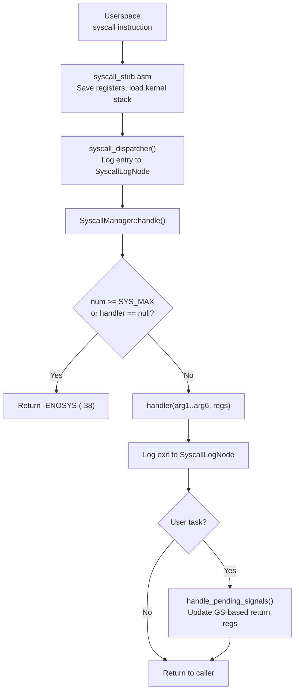

# Syscall Interface

## Overview

FKernel implements a Linux x86_64 ABI-compatible syscall interface with 199 registered handlers. The syscall stub (assembly) transitions from ring 3 to ring 0, saves registers, and calls the dispatcher. The dispatcher logs to DebugFS, looks up the handler in a dispatch table, and handles pending signals before returning to userspace.

## Architecture



## Syscall Domains (199 handlers)

Organized into 11 domain directories under `Src/Kernel/Syscall/SyscallList/`:

| Domain | Count | Key Syscalls |
|--------|-------|-------------|
| **FileSystem** | ~50 | open, close, read, write, readv, writev, lseek, stat, fstat, mkdir, rmdir, unlink, link, rename, pipe, pipe2, dup, dup2, dup3, mount, umount2, ioctl, openat, fcntl, fsync, flock, access, getdents64, sendfile, statfs, fstatfs, newfstatat, epoll_create1, epoll_ctl, epoll_wait, poll, select, signalfd, timerfd, eventfd, pselect6, ppoll, copy_file_range, fallocate, readahead, syncfs, name_to_handle_at |
| **Process** | ~35 | fork, vfork, clone, execve, exit, exit_group, wait4, waitid, yield, getpid, gettid, getppid, getuid, geteuid, getgid, getegid, getpgrp, getpgid, setpgid, setsid, setuid, setgid, setreuid, setregid, setresuid, getresuid, setresgid, getresgid, getgroups, setgroups, getrlimit, setrlimit, umask, chroot, nice, set_tid_address, arch_prctl, sysinfo, sched_* |
| **Memory** | ~10 | mmap, munmap, mprotect, brk, mlock, munlock, msync, mremap, madvise, mincore |
| **Time** | ~10 | nanosleep, clock_nanosleep, clock_gettime, clock_getres, clock_settime, gettimeofday, settimeofday, setitimer, getitimer, adjtimex |
| **Signals** | ~10 | kill, sigaction, sigprocmask, rt_sigsuspend, tgkill, tkill, sigaltstack, sigpending, rt_sigtimedwait, rt_sigqueueinfo, rt_tgsigqueueinfo |
| **Networking** | ~18 | socket, bind, connect, listen, accept, accept4, sendto, recvfrom, sendmsg, recvmsg, shutdown, getsockname, getpeername, socketpair, setsockopt, getsockopt, sendmmsg, recvmmsg |
| **IPC/Capability** | ~12 | ipc_send, ipc_receive, ipc_call, cap_revoke, cap_grant, cap_delete, semctl, semget, semop, shmctl, shmget, shmat, shmdt, msgctl, msgget, msgsnd, msgrcv |
| **KQueue** | ~8 | kqueue, kevent, kqueue_register |
| **System** | ~10 | uname, syslog, reboot, getrandom, sysinfo, prctl, getcpu, ioperm, iopl, acct |
| **Terminal** | ~8 | tty_create, tty_delete, tty_list, tcgetattr, tcsetattr, tcsendbreak, tcdrain, tty_ioctl |
| **Misc** | ~28 | openpty, futex, getpriority, setpriority, prlimit64, timer_create, timer_delete, timer_settime, timer_gettime, timer_getoverrun, memfd_create, eventfd, signalfd, userfaultfd, pidfd_open, pidfd_send_signal, close_range, fadvise64, io_setup, io_submit, io_getevents, io_destroy, io_cancel, getxattr, setxattr, listxattr, removexattr, sched_setattr, sched_getattr |

## Syscall Stub

Assembly stub at `Src/Kernel/Arch/x86_64/Syscall/syscall_stub.asm`:
- Validates syscall number against `SYS_MAX`
- Saves all registers to kernel stack
- Calls `syscall_dispatcher()`
- Restores registers and returns to userspace via `sysretq`

SMAP validation is performed by `syscall_stub_validation.cpp` for user-space pointer arguments.

## Dispatch Table

`SyscallManager` maintains a fixed-size array (`m_syscall_table[SYS_MAX]`) of function pointers. Registration happens in `initialize_syscalls()` via `register_syscall(num, fn)`.

## Key Files

| File | Purpose |
|------|---------|
| `Src/Kernel/Syscall/syscall.cpp` | Dispatcher, registration, signal handling, dmesg logging |
| `Src/Kernel/Arch/x86_64/Syscall/syscall_stub.asm` | Assembly entry/exit for syscalls |
| `Src/Kernel/Syscall/syscall_stub_validation.cpp` | SMAP-aware user pointer validation |
| `Src/Kernel/Syscall/SyscallList/FileSystem/*.cpp` | FS syscall handlers (~40 files) |
| `Src/Kernel/Syscall/SyscallList/Process/*.cpp` | Process syscall handlers (~30 files) |
| `Src/Kernel/Syscall/SyscallList/Memory/*.cpp` | Memory syscall handlers |
| `Src/Kernel/Syscall/SyscallList/Time/*.cpp` | Timer syscall handlers |
| `Src/Kernel/Syscall/SyscallList/Signals/*.cpp` | Signal syscall handlers |
| `Src/Kernel/Syscall/SyscallList/Networking/*.cpp` | Socket syscall handlers |
| `Src/Kernel/Syscall/SyscallList/Ipc/*.cpp` | IPC + capability syscall handlers |
| `Src/Kernel/Syscall/SyscallList/System/*.cpp` | System syscall handlers |
| `Src/Kernel/Syscall/SyscallList/Terminal/*.cpp` | TTY management handlers |
| `Src/Kernel/Syscall/SyscallList/Posix/*.cpp` | POSIX misc (futex, openpty, signal) |
| `Src/Kernel/Syscall/SyscallList/KQueue/*.cpp` | KQueue event notification syscalls |

## Syscall Logging

Every syscall entry and exit is logged to the `SyscallLogNode` (128KB ring buffer) with format:
```
[SYSCALL >] Task <pid> (<name>): <number> (args: ...)
[SYSCALL <] Task <pid> (<name>): <number> -> <result>
```

## Notable Design Decisions

- **Linux ABI compatibility**: Syscall numbers match Linux x86_64 for userspace compatibility
- **Dispatcher logging**: Entry/exit logged to DebugFS ring buffer for dmesg tracing
- **Signal delivery at return**: `handle_pending_signals()` called after every syscall return for user tasks
- **GS-based return registers**: `CpuControlBlock` (GS-segment) updated with modified `regs` for signal frame correctness
- **SA_RESTART support**: Original syscall number saved in signal frame for restart after signal interruption

## Current Status

~80% complete. 199 syscalls registered across 11 domains. Core FS, process, memory, and time syscalls functional. Networking syscalls with TCP/UDP socket implementations. IPC syscalls integrated with capability system (SCM_RIGHTS, SCM_CREDENTIALS). KQueue syscalls (kqueue, kevent) with EVFILT_PROC/SIGNAL/TIMER. Signal delivery working with frame installation. No seccomp or ptrace yet.
