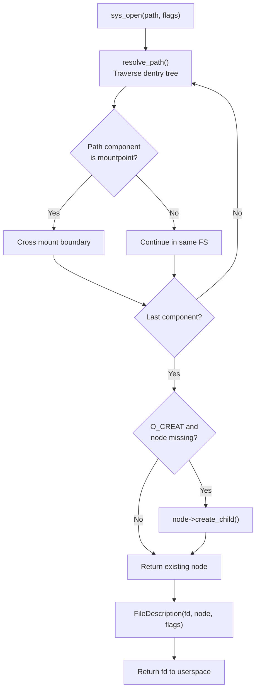

# Virtual File System

## Overview

FKernel's VFS is inspired by BSD's vnode/dentry/mount model. See [Domains/vfs-architecture.md](../../Domains/vfs-architecture.md) for full architecture documentation.

## Quick Reference

### VFS Operation Flow

### Filesystem Types

| FS | Mount Point | Type | Notes |
|----|-------------|------|-------|
| TmpFS | `/` | In-memory | Root filesystem |
| DevFS | `/dev` | Dynamic | Device nodes |
| ProcFS | `/proc` | Virtual | Process info |
| FAT32 | Auto-detected | Disk | Primary disk FS with LFN |
| FAT16 | Auto-detected | Disk | Legacy support |
| FAT12 | Auto-detected | Disk | Floppy images |
| DebugFS | `/debug` | Virtual | Kernel debug nodes |

### Key Operations

| Operation | Implementation |
|-----------|---------------|
| `open` | `vfs_operations.cpp` — path resolution + FileDescription creation |
| `read` | `file_description.cpp` — offset-based read via node vtable |
| `write` | `file_description.cpp` — offset-based write via node vtable |
| `ioctl` | `file_description.cpp` — delegates to node ioctl |
| `mount` | `virtual_filesystem.cpp` — creates dentry overlay |
| `stat` | `vfs_operations.cpp` — fills stat from node metadata |
