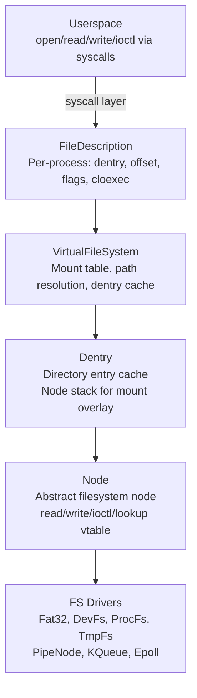
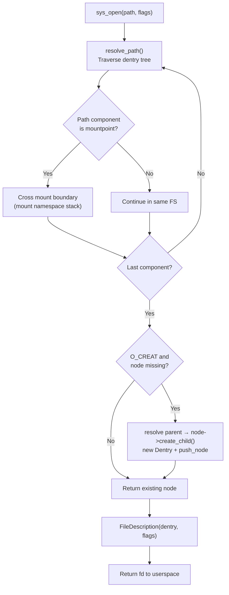

# Virtual File System

## Overview

FKernel's VFS is inspired by BSD's vnode/dentry/mount model. It provides a unified interface for 23 filesystem types (10 on-disk, 13 virtual), device nodes, and process information. Supports mount namespaces, `pivot_root`, and KQueue as the unified event notification backend.

## Architecture



## VFS Operation Flow



## Mount System

### Mount Namespaces

`MountNamespace` provides per-process mount isolation. Each namespace maintains:
- Mount records (path, fstype, dev_id) independent of global mounts
- Per-dentry node stacks that override the default stack
- `clone_mount_namespace()` deep-copies the current namespace for use with `clone()`/`unshare()`

Operations query `current_mount_namespace()` first, falling back to global `s_mounts`:

| Operation | Behavior |
|-----------|----------|
| `mount()` | Pushes node onto dentry's namespace stack (or global stack) |
| `unmount()` | Pops node from namespace stack, removes mount record |
| `pivot_root()` | Swaps root and put_old, updates all mount records |
| `for_each_mount()` | Iterates current namespace or global mounts |
| `dev_id_for_path()` | Longest-prefix matching against mount paths |

### pivot_root

Full `pivot_root(new_root, put_old)` implementation:
1. Validates put_old is under new_root
2. Swaps root dentry node with new_root dentry node
3. Moves old root to put_old
4. Updates all mount records to reflect the new hierarchy
5. Supports both namespace and global mount tables

### Filesystem Types — On-Disk (10)

| FS | Mount Point | Type | Notes |
|----|-------------|------|-------|
| Ext2 | Auto-detected | Disk | Extended FS v2 |
| Ext3 | Auto-detected | Disk | Extended FS v3 with journal |
| Ext4 | Auto-detected | Disk | Extended FS v4 with extents |
| FAT12 | Auto-detected | Disk | Floppy images with LFN |
| FAT16 | Auto-detected | Disk | Legacy support with LFN |
| FAT32 | Auto-detected | Disk | Primary disk FS with LFN, full metadata write |
| exFAT | Auto-detected | Disk | Extended FAT for large volumes |
| ISO9660 | Auto-detected | Disk | CD/DVD optical media |
| MinixFS | Auto-detected | Disk | Minix filesystem (v1/v2/v3) |

### Filesystem Types — Virtual (13)

| FS | Mount Point | Type | Notes |
|----|-------------|------|-------|
| TmpFs | `/` | In-memory | Root filesystem, directory + file nodes |
| DevFs | `/dev` | Dynamic | Device nodes (null, zero, urandom, ptmx, tty, serial, console) |
| ProcFs | `/proc` | Virtual | Process info (19 node types: stat, meminfo, uptime, version, mounts, pid/, self→ symlink) |
| DebugFs | `/debug` | Virtual | Kernel debug ring buffers (debug_log, syscall_log, ipc_log) |
| PtsFs | `/dev/pts` | Virtual | Pseudo-terminal slave devices |
| SemFs | `/dev/sem` | Virtual | POSIX semaphores |
| MqueueFs | `/dev/mqueue` | Virtual | POSIX message queues |
| ShmFs | `/dev/shm` | Virtual | POSIX shared memory |
| PipeFs | — | Virtual | Anonymous pipe pairs |
| Epoll | — | Virtual | Event poll backend |
| EventFd | — | Virtual | Event notification file descriptors |
| SignalFd | — | Virtual | Signal delivery file descriptors |
| TimerFd | — | Virtual | Timer file descriptors |

## KQueue — Unified Event Backend

KQueue (`kqueue.cpp`) serves as the unified event notification backend used by `epoll`, `poll`, and `select`:

- **Filter types**: EVFILT_READ, EVFILT_WRITE, EVFILT_TIMER, EVFILT_VNODE, EVFILT_PROC, EVFILT_SIGNAL, EVFILT_USER
- **Event-driven**: I/O paths call `notify_kqueue_readers()`/`notify_kqueue_writers()` → KNoteHook on watched Nodes → immediate wake via Notification
- **Blocking**: Uses `Notification::wait_timeout()` for proper scheduler-integrated timeout
- **Flags**: EV_ONESHOT, EV_CLEAR, EV_DISPATCH semantics

## Key Operations

| Operation | Implementation |
|-----------|---------------|
| `open` | `vfs_operations.cpp` — path resolution + O_CREAT node creation + FileDescription |
| `read`/`write` | `file_description.cpp` — offset-based, atomic offset update |
| `ioctl` | `file_description.cpp` — delegates to node ioctl |
| `mkdir` | `vfs_operations.cpp` — resolve parent, node->mkdir(), create Dentry |
| `mkfifo` | `vfs_operations.cpp` — creates PipeNode, wraps in Dentry |
| `symlink` | `vfs_operations.cpp` — resolve parent, node->symlink(target) |
| `rmdir` | `vfs_operations.cpp` — resolve parent, node->rmdir(name) |
| `unlink` | `vfs_operations.cpp` — resolve parent, node->unlink(name) |
| `link` | `vfs_operations.cpp` — resolve parent, node->link(name, target) |
| `rename` | `vfs_operations.cpp` — resolve both parents, node->rename(old, new) |
| `mount` | `virtual_filesystem.cpp` — dentry::push_node() + mount record |
| `unmount` | `virtual_filesystem.cpp` — dentry::pop_node() + remove record |
| `pivot_root` | `virtual_filesystem.cpp` — swap + update all records |
| `stat` | `vfs_operations.cpp` — fills stat from node metadata (inode, size, mode, uid/gid, timestamps) |
| `truncate` | `vfs_operations.cpp` — node->truncate(size) |
| `fsync` | `vfs_operations.cpp` — node->fsync() |
| `chmod`/`chown` | `vfs_operations.cpp` — node->set_permissions()/set_owner() |

All VFS operations acquire `m_lock` (Spinlock, IRQ-safe) during path resolution.

## Path Resolution

`PathResolver` handles component-by-component traversal:
- **Absolute paths**: Start at root dentry
- **Relative paths**: Start at CWD or provided base dentry
- **Mount crossing**: When dentry has a mount namespace override stack, uses top of that stack
- **Symlink resolution**: Recursive with depth limit (8)
- **Cache**: Dentry children cached in `Dentry::m_children` HashMap

## Node Hierarchy

```
Node (RefCounted)
├── Ext2Node, Ext3Node, Ext4Node          (journaling disk FS)
├── Fat12Node, Fat16Node, Fat32Node       (FAT disk FS)
├── ExFatNode                             (exFAT disk FS)
├── Iso9660Node                           (optical media FS)
├── MinixNode                             (Minix FS)
├── TmpFsNode, TmpFsDirectoryNode         (in-memory filesystem)
├── DevFs: NullDevice, ZeroDevice, UrandomDevice, PtmxDevice, SerialNode, ConsoleNode
├── PipeNode, EventFdNode, TimerFdNode, SignalFdNode
├── EpollNode, KQueueNode
├── ProcFsNode → 19 /proc/* node types
├── PtsDirNode, SemDirNode, MqueueDirNode, ShmDirNode
└── PTY: PtyMaster, PtySlave
```

## Key Files

| File | Purpose |
|------|---------|
| `Src/Kernel/Fs/Vfs/virtual_filesystem.cpp` | VFS init, mount/unmount/pivot_root, mount namespaces, dev_id |
| `Src/Kernel/Fs/Vfs/vfs_operations.cpp` | open, mkdir, mkfifo, symlink, rmdir, unlink, link, rename, stat, truncate, chmod, chown |
| `Src/Kernel/Fs/Vfs/dentry.cpp` | Dentry cache, child lookup/add, node stack |
| `Src/Kernel/Fs/Vfs/path_resolver.cpp` | Path component traversal, mount crossing, symlink resolution |
| `Src/Kernel/Fs/Vfs/file_description.cpp` | Read/write/ioctl with atomic offset, seek, FileLock |
| `Src/Kernel/Fs/Vfs/kqueue.cpp` | KQueue backend: event registration, kevent, KNoteHook |
| `Src/Kernel/Fs/Vfs/mount_namespace.cpp` | Per-process mount isolation |
| `Src/Kernel/Fs/Vfs/auto_mounter.cpp` | FAT type detection and auto-mount |
| `Include/Kernel/Fs/Vfs/node.h` | Abstract Node interface (read, write, ioctl, lookup, mkdir, etc.) |
| `Include/Kernel/Fs/Vfs/dentry.h` | Dentry with node stack, mount namespace stack |

## Notable Design Decisions

- **BSD vnode/dentry/mount model**: Clean layered design with mount overlay stacks
- **Mount namespaces**: Per-process mount isolation for container support
- **KQueue over epoll**: BSD kqueue as unified backend; `epoll`/`poll`/`select` compat shims
- **Interrupt-safe**: All VFS ops use `ScopedLockIRQ` on `m_lock` for SMP safety
- **Longest-prefix dev_id**: Accurate device identification for stat()
- **Node vtable**: Every filesystem operation is virtual, allowing heterogeneous FS composition
- **Dentry cache**: In-memory cache of directory entries for fast repeated lookups

## Current Status

~85% complete. Full VFS operations: open (with O_CREAT), mkdir, mkfifo, symlink, rmdir, unlink, link, rename, mount, unmount, pivot_root, stat, truncate, chmod, chown, fsync. Mount namespaces for per-process isolation. KQueue as unified event backend for epoll/poll/select. 10 on-disk filesystems: Ext2/3/4, FAT12/16/32, exFAT, ISO9660, MinixFS. 13 virtual filesystems: TmpFs, DevFs, ProcFs, DebugFs, PtsFs, SemFs, MqueueFs, ShmFs, PipeFs, Epoll, EventFd, SignalFd, TimerFd. DevFs with all standard device nodes. ProcFs with 19 node types. TmpFs for root. DebugFs ring buffers. No page cache. No extended attributes (xattr). No ACLs.
