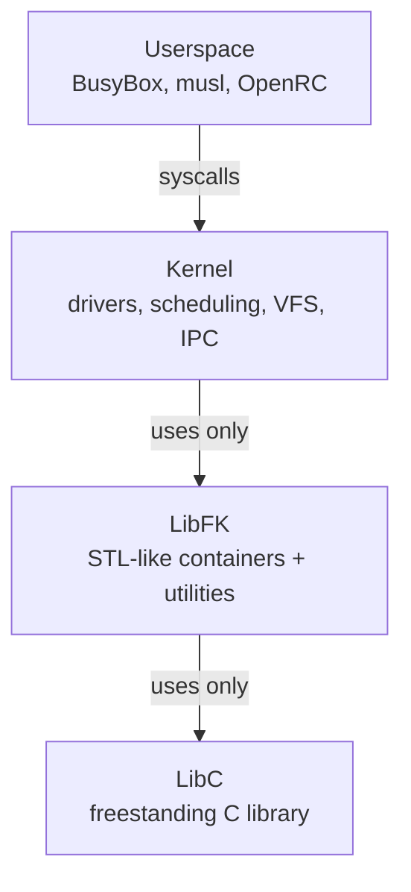

# FKernel Directory Structure

> Reference for developers and AI agents. 378 directories, 1135+ files across `Include/` and `Src/`.

## Layer Architecture



> Headers mirror sources: `Include/` mirrors `Src/`. Trees below list directories to file granularity, except the `Src/Kernel/Syscall/syscall_list/` subtree, summarised by category (one `sys_*` handler per file, verified by `xmake check-syscalls`).
```
Include/
├── Kernel/
│   ├── Arch/
│   │   └── x86_64/
│   │       ├── Driver/
│   │       │   └── Vga/
│   │       │       ├── bios_service.h
│   │       │       ├── vbe_types.h
│   │       │       └── vesa.h
│   │       ├── Hardware/
│   │       │   └── Cpu/
│   │       │       └── cpu_ops.h
│   │       ├── Interrupt/
│   │       │   ├── Handler/
│   │       │   │   ├── exception_macros.h
│   │       │   │   ├── handlers.h
│   │       │   │   └── interrupt_frame.h
│   │       │   ├── HardwareInterrupts/
│   │       │   │   ├── InterruptController/
│   │       │   │   │   ├── 8259_pic.h
│   │       │   │   │   ├── apic.h
│   │       │   │   │   ├── apic_common.h
│   │       │   │   │   ├── ioapic.h
│   │       │   │   │   ├── ioapic_controller.h
│   │       │   │   │   ├── msi_helpers.h
│   │       │   │   │   └── x2apic.h
│   │       │   │   ├── TimerController/
│   │       │   │   │   ├── apic_timer.h
│   │       │   │   │   ├── hpet.h
│   │       │   │   │   └── pit.h
│   │       │   │   ├── hardware_interrupt.h
│   │       │   │   ├── hardware_interrupt_manager.h
│   │       │   │   ├── tick_manager.h
│   │       │   │   ├── timer.h
│   │       │   │   └── timer_interrupt.h
│   │       │   ├── gate_type.h
│   │       │   ├── interrupt_controller.h
│   │       │   ├── interrupt_types.h
│   │       │   ├── isr_stubs.h
│   │       │   └── non_maskable_interrupt.h
│   │       ├── Memory/
│   │       │   └── IntelIOMMU/
│   │       │       └── vtd.h
│   │       ├── Segments/
│   │       │   ├── Gdt/
│   │       │   │   ├── gdt_entry.h
│   │       │   │   ├── gdt_pointer.h
│   │       │   │   ├── gdt_structures.h
│   │       │   │   ├── segment_access.h
│   │       │   │   ├── segment_descriptor.h
│   │       │   │   └── segment_flags.h
│   │       │   ├── Tss/
│   │       │   │   ├── tss_descriptor.h
│   │       │   │   ├── tss_stacks.h
│   │       │   │   └── tss_structures.h
│   │       │   └── gdt.h
│   │       ├── Smp/
│   │       │   └── ap_entry.h
│   │       ├── Syscall/
│   │       │   └── syscall_arch.h
│   │       ├── arch_defs.h
│   │       ├── io.h
│   │       └── rdtsc.h
│   ├── Boot/
│   │   ├── Core/
│   │   │   ├── boot_info.h
│   │   │   ├── boot_mark.h
│   │   │   ├── boot_mode.h
│   │   │   ├── boot_timer.h
│   │   │   └── kernel_entry.h
│   │   ├── Info/
│   │   │   ├── acpi_table_info.h
│   │   │   ├── boot_framebuffer_info.h
│   │   │   ├── memory_map_entry.h
│   │   │   ├── memory_map_iterator.h
│   │   │   └── module_info.h
│   │   ├── Multiboot/
│   │   │   ├── multiboot2.h
│   │   │   └── multiboot_interpreter.h
│   │   └── Stages/
│   │       ├── early_init.h
│   │       └── init.h
│   ├── Clock/
│   │   ├── ClockController/
│   │   │   ├── cmos.h
│   │   │   └── rtc.h
│   │   ├── Types/
│   │   │   ├── clock.h
│   │   │   └── datetime.h
│   │   └── clock_interrupt.h
│   ├── Driver/
│   │   ├── Async/
│   │   │   ├── async_io.h
│   │   │   ├── async_io_operation.h
│   │   │   ├── async_io_queue.h
│   │   │   ├── dma_buffer.h
│   │   │   └── io_completion_status.h
│   │   ├── Device/
│   │   │   ├── BlockDevice/
│   │   │   │   ├── block_device.h
│   │   │   │   ├── lvm_device.h
│   │   │   │   ├── lvm_segment.h
│   │   │   │   ├── raid_device.h
│   │   │   │   ├── raid_mode.h
│   │   │   │   ├── sector_count.h
│   │   │   │   ├── sector_size.h
│   │   │   │   └── stackable_block_device.h
│   │   │   ├── CharacterDevice/
│   │   │   │   ├── character_device.h
│   │   │   │   ├── null_device.h
│   │   │   │   ├── ptmx_device.h
│   │   │   │   └── urandom_device.h
│   │   │   ├── device_id.h
│   │   │   ├── driver.h
│   │   │   └── driver_manager.h
│   │   ├── Keyboard/
│   │   │   ├── keyboard_layout.h
│   │   │   ├── keyboard_node.h
│   │   │   ├── keymap_manager.h
│   │   │   └── ps2_keyboard.h
│   │   ├── Mouse/
│   │   │   └── ps2_mouse.h
│   │   ├── Network/
│   │   │   ├── E1000/
│   │   │   │   ├── e1000.h
│   │   │   │   ├── e1000_rx_desc.h
│   │   │   │   ├── e1000_tx_desc.h
│   │   │   │   └── interrupt_driven_e1000.h
│   │   │   ├── mac_address.h
│   │   │   └── network_device.h
│   │   ├── Pty/
│   │   │   ├── pty_buffer.h
│   │   │   ├── pty_line_discipline.h
│   │   │   ├── pty_master.h
│   │   │   ├── pty_slave.h
│   │   │   └── termios.h
│   │   ├── Registry/
│   │   │   └── driver_registry.h
│   │   ├── Serial/
│   │   │   ├── serial_node.h
│   │   │   └── serial_port.h
│   │   ├── Storage/
│   │   │   ├── Ahci/
│   │   │   ├── Ata/
│   │   │   ├── Controllers/
│   │   │   │   ├── Ahci/
│   │   │   │   │   ├── ahci_controller.h
│   │   │   │   │   └── interrupt_driven_ahci.h
│   │   │   │   ├── Ata/
│   │   │   │   │   ├── ata_controller.h
│   │   │   │   │   ├── ata_device.h
│   │   │   │   │   ├── ata_transfer_strategy.h
│   │   │   │   │   ├── dma_strategy.h
│   │   │   │   │   └── pio_strategy.h
│   │   │   │   └── Nvme/
│   │   │   │       ├── interrupt_driven_nvme.h
│   │   │   │       ├── nvme_async_operation.h
│   │   │   │       ├── nvme_command.h
│   │   │   │       ├── nvme_command_builder.h
│   │   │   │       ├── nvme_command_id_manager.h
│   │   │   │       ├── nvme_completion_processor.h
│   │   │   │       ├── nvme_controller.h
│   │   │   │       ├── nvme_controller_state.h
│   │   │   │       ├── nvme_device_configuration.h
│   │   │   │       ├── nvme_dma_memory_manager.h
│   │   │   │       ├── nvme_interrupt_configurator.h
│   │   │   │       ├── nvme_interrupt_handler.h
│   │   │   │       ├── nvme_interrupt_line.h
│   │   │   │       ├── nvme_pending_operations.h
│   │   │   │       ├── nvme_queue_descriptor.h
│   │   │   │       ├── nvme_queue_manager.h
│   │   │   │       ├── nvme_queue_setup.h
│   │   │   │       ├── nvme_queue_utilities.h
│   │   │   │       ├── nvme_register_access.h
│   │   │   │       ├── nvme_register_mapper.h
│   │   │   │       └── nvme_utilities.h
│   │   │   ├── Interfaces/
│   │   │   │   ├── storage_cache.h
│   │   │   │   ├── storage_device.h
│   │   │   │   └── storage_device_name.h
│   │   │   ├── Nvme/
│   │   │   └── Partitions/
│   │   │       ├── Gpt/
│   │   │       │   ├── gpt.h
│   │   │       │   ├── gpt_header.h
│   │   │       │   └── gpt_partition_entry.h
│   │   │       ├── Mbr/
│   │   │       │   ├── mbr.h
│   │   │       │   ├── mbr_header.h
│   │   │       │   └── mbr_partition_entry.h
│   │   │       ├── partition.h
│   │   │       ├── partition_list.h
│   │   │       └── partition_manager.h
│   │   ├── Terminal/
│   │   │   ├── terminal.h
│   │   │   ├── terminal_capabilities.h
│   │   │   ├── terminal_factory.h
│   │   │   ├── terminal_id.h
│   │   │   ├── terminal_manager.h
│   │   │   ├── terminal_renderer.h
│   │   │   ├── terminal_type.h
│   │   │   └── vga_terminal.h
│   │   ├── Udi/
│   │   ├── Usb/
│   │   │   ├── usb_device.h
│   │   │   ├── usb_host_controller.h
│   │   │   ├── usb_transfer.h
│   │   │   ├── usb_transfer_direction.h
│   │   │   └── usb_transfer_type.h
│   │   ├── Vga/
│   │   │   ├── Display/
│   │   │   │   ├── cursor_manager.h
│   │   │   │   └── framebuffer_manager.h
│   │   │   ├── Types/
│   │   │   │   ├── color.h
│   │   │   │   ├── framebuffer_info.h
│   │   │   │   ├── render_command.h
│   │   │   │   └── render_command_type.h
│   │   │   ├── dirty_tracker.h
│   │   │   ├── display.h
│   │   │   ├── display_framebuffer.h
│   │   │   ├── display_text.h
│   │   │   ├── extended_font.h
│   │   │   ├── font.h
│   │   │   ├── glyph.h
│   │   │   ├── pixel_converter.h
│   │   │   ├── raw_color.h
│   │   │   ├── render_surface.h
│   │   │   ├── vga_adapter.h
│   │   │   └── vga_node.h
│   │   └── Volume/
│   ├── Fs/
│   │   ├── Disk/
│   │   │   ├── Exfat/
│   │   │   │   ├── exfat_bpb.h
│   │   │   │   ├── exfat_fs.h
│   │   │   │   └── exfat_node.h
│   │   │   ├── Ext2/
│   │   │   │   ├── ext2_fs.h
│   │   │   │   ├── ext2_node.h
│   │   │   │   └── ext2_super.h
│   │   │   ├── Ext3/
│   │   │   │   ├── ext3_fs.h
│   │   │   │   └── ext3_super.h
│   │   │   ├── Ext4/
│   │   │   │   ├── ext4_fs.h
│   │   │   │   ├── ext4_node.h
│   │   │   │   └── ext4_super.h
│   │   │   ├── Fat12/
│   │   │   │   ├── bpb.h
│   │   │   │   ├── directory_entry.h
│   │   │   │   ├── fat_12_fs.h
│   │   │   │   └── fat_12_node.h
│   │   │   ├── Fat16/
│   │   │   │   ├── bpb.h
│   │   │   │   ├── directory_entry.h
│   │   │   │   ├── fat_16_fs.h
│   │   │   │   └── fat_16_node.h
│   │   │   ├── Fat32/
│   │   │   │   ├── bpb.h
│   │   │   │   ├── directory_entry.h
│   │   │   │   ├── fat_32_fs.h
│   │   │   │   └── fat_32_node.h
│   │   │   ├── HfsPlus/
│   │   │   │   ├── hfsplus_btree.h
│   │   │   │   ├── hfsplus_catalog.h
│   │   │   │   ├── hfsplus_extents.h
│   │   │   │   ├── hfsplus_fs.h
│   │   │   │   ├── hfsplus_node.h
│   │   │   │   ├── hfsplus_unicode.h
│   │   │   │   └── hfsplus_vh.h
│   │   │   ├── Iso9660/
│   │   │   │   ├── iso9660_fs.h
│   │   │   │   ├── iso9660_node.h
│   │   │   │   └── iso9660_vd.h
│   │   │   ├── MinixFs/
│   │   │   │   ├── minix_fs.h
│   │   │   │   ├── minix_node.h
│   │   │   │   └── minix_super.h
│   │   │   ├── RamDisk/
│   │   │   │   └── ram_disk.h
│   │   │   └── Ufs/
│   │   │       ├── ufs_dir.h
│   │   │       ├── ufs_endian.h
│   │   │       ├── ufs_fs.h
│   │   │       ├── ufs_node.h
│   │   │       └── ufs_super.h
│   │   ├── UserFs/
│   │   ├── Vfs/
│   │   │   ├── Core/
│   │   │   │   ├── definitions.h
│   │   │   │   ├── dentry.h
│   │   │   │   ├── dentry_node_stack.h
│   │   │   │   ├── directory_entry.h
│   │   │   │   ├── file_description.h
│   │   │   │   ├── node.h
│   │   │   │   ├── path_resolver.h
│   │   │   │   ├── timespec.h
│   │   │   │   └── virtual_filesystem.h
│   │   │   ├── Definitions/
│   │   │   │   ├── file_descriptor.h
│   │   │   │   ├── inode_index.h
│   │   │   │   └── seek_mode.h
│   │   │   ├── Events/
│   │   │   │   ├── kevent.h
│   │   │   │   ├── knote_hook.h
│   │   │   │   ├── kqueue.h
│   │   │   │   ├── kqueue_functions.h
│   │   │   │   ├── kqueue_node.h
│   │   │   │   └── node_knote_list.h
│   │   │   ├── FileLock/
│   │   │   │   ├── file_lock.h
│   │   │   │   └── file_lock_list.h
│   │   │   └── Mount/
│   │   │       ├── auto_mounter.h
│   │   │       ├── fstab.h
│   │   │       ├── fstab_entry.h
│   │   │       ├── mount_namespace.h
│   │   │       └── mount_record.h
│   │   └── Virtual/
│   │       ├── DebugFs/
│   │       │   ├── Node/
│   │       │   │   ├── debug_log_node.h
│   │       │   │   ├── stderr_log_node.h
│   │       │   │   ├── stdout_log_node.h
│   │       │   │   └── syscall_log_node.h
│   │       │   └── debug_fs.h
│   │       ├── DevFs/
│   │       │   ├── dev_fs.h
│   │       │   └── tty.h
│   │       ├── Epoll/
│   │       │   ├── epoll_entry.h
│   │       │   └── epoll_node.h
│   │       ├── EventFd/
│   │       │   └── event_fd_node.h
│   │       ├── MqueueFs/
│   │       │   ├── mqueue_dir_node.h
│   │       │   └── mqueue_node.h
│   │       ├── PipeFs/
│   │       │   └── pipe_node.h
│   │       ├── ProcFs/
│   │       │   ├── proc_cmdline_node.h
│   │       │   ├── proc_cpuinfo_node.h
│   │       │   ├── proc_filesystems_node.h
│   │       │   ├── proc_fs.h
│   │       │   ├── proc_fs_node.h
│   │       │   ├── proc_fs_util.h
│   │       │   ├── proc_loadavg_node.h
│   │       │   ├── proc_meminfo_node.h
│   │       │   ├── proc_mounts_node.h
│   │       │   ├── proc_partitions_node.h
│   │       │   ├── proc_pid_cmdline_node.h
│   │       │   ├── proc_pid_dir_node.h
│   │       │   ├── proc_pid_exe_node.h
│   │       │   ├── proc_pid_fd_dir_node.h
│   │       │   ├── proc_pid_fd_entry_node.h
│   │       │   ├── proc_pid_fd_node.h
│   │       │   ├── proc_pid_maps_node.h
│   │       │   ├── proc_pid_sched_node.h
│   │       │   ├── proc_pid_stat_node.h
│   │       │   ├── proc_process_node.h
│   │       │   ├── proc_self_node.h
│   │       │   ├── proc_stat_node.h
│   │       │   ├── proc_sys_kernel_node.h
│   │       │   ├── proc_sys_node.h
│   │       │   ├── proc_sys_string_node.h
│   │       │   ├── proc_uptime_node.h
│   │       │   └── proc_version_node.h
│   │       ├── PtsFs/
│   │       │   └── pts_dir_node.h
│   │       ├── SemFs/
│   │       │   ├── sem_dir_node.h
│   │       │   └── sem_node.h
│   │       ├── ShmFs/
│   │       │   ├── shm_dir_node.h
│   │       │   └── shm_node.h
│   │       ├── SignalFd/
│   │       │   └── signal_fd_node.h
│   │       ├── SysFs/
│   │       │   ├── sys_attr_node.h
│   │       │   ├── sys_block_dev_dir_node.h
│   │       │   ├── sys_block_dir_node.h
│   │       │   ├── sys_devices_dir_node.h
│   │       │   ├── sys_fs.h
│   │       │   ├── sys_pci_dev_dir_node.h
│   │       │   ├── sys_pci_dir_node.h
│   │       │   └── sys_static_dir_node.h
│   │       ├── TimerFd/
│   │       │   ├── kernel_itimerspec.h
│   │       │   ├── kernel_timespec.h
│   │       │   ├── timer_fd_node.h
│   │       │   └── timer_fd_registry.h
│   │       └── TmpFs/
│   │           ├── tmp_fs.h
│   │           ├── tmp_fs_child.h
│   │           ├── tmp_fs_child_list.h
│   │           ├── tmp_fs_directory_node.h
│   │           └── tmp_fs_node.h
│   ├── Hardware/
│   │   ├── Acpi/
│   │   ├── Buses/
│   │   │   └── Pci/
│   │   │       ├── pci.h
│   │   │       ├── pci_address.h
│   │   │       ├── pci_device.h
│   │   │       ├── pci_driver_entry.h
│   │   │       ├── pci_event.h
│   │   │       ├── pci_event_type.h
│   │   │       ├── pci_legacy_ports.h
│   │   │       ├── pci_manager.h
│   │   │       └── pci_node.h
│   │   ├── Cpu/
│   │   │   ├── cpu.h
│   │   │   ├── cpu_block.h
│   │   │   ├── cpu_context.h
│   │   │   ├── cpu_register.h
│   │   │   └── processor.h
│   │   ├── Fadt/
│   │   ├── Firmware/
│   │   │   ├── Acpi/
│   │   │   │   ├── acpi.h
│   │   │   │   ├── dmar.h
│   │   │   │   ├── hpet.h
│   │   │   │   ├── mcfg.h
│   │   │   │   ├── rsdp.h
│   │   │   │   ├── rsdt.h
│   │   │   │   ├── sdt_header.h
│   │   │   │   ├── srat.h
│   │   │   │   ├── topology_manager.h
│   │   │   │   └── xsdt.h
│   │   │   ├── Fadt/
│   │   │   │   ├── fadt.h
│   │   │   │   ├── fadt_manager.h
│   │   │   │   └── generic_address_structures.h
│   │   │   └── Madt/
│   │   │       ├── madt.h
│   │   │       ├── madt_entries.h
│   │   │       ├── madt_interrupt_source_override.h
│   │   │       ├── madt_ioapic.h
│   │   │       ├── madt_lapic.h
│   │   │       └── madt_lapic_override.h
│   │   ├── Madt/
│   │   └── Pci/
│   ├── Io/
│   │   └── kernel_puts.h
│   ├── Ipc/
│   │   ├── Capabilities/
│   │   │   ├── capability.h
│   │   │   ├── capability_meta.h
│   │   │   ├── capability_rights.h
│   │   │   ├── capability_type.h
│   │   │   └── cspace.h
│   │   ├── Endpoints/
│   │   │   ├── badge.h
│   │   │   ├── endpoint.h
│   │   │   ├── global_endpoint_manager.h
│   │   │   ├── ipc_log_node.h
│   │   │   ├── message_info.h
│   │   │   └── system_labels.h
│   │   ├── Notifications/
│   │   │   ├── irq_binding.h
│   │   │   ├── notification.h
│   │   │   └── notification_payload.h
│   │   ├── SharedMemory/
│   │   │   ├── dma_shm.h
│   │   │   ├── shared_memory.h
│   │   │   └── shared_memory_mapping.h
│   │   └── Signals/
│   │       ├── signal_delivery.h
│   │       ├── signal_delivery_default_action.h
│   │       └── signal_frame.h
│   ├── Loader/
│   │   ├── Domains/
│   │   │   ├── Base/
│   │   │   │   └── elf_domain.h
│   │   │   ├── Types/
│   │   │   │   ├── load_context.h
│   │   │   │   └── memory_region.h
│   │   │   ├── domain_rela_table.h
│   │   │   ├── domain_symbol_context.h
│   │   │   ├── dynamic_domain.h
│   │   │   ├── interpreter_domain.h
│   │   │   ├── library_context.h
│   │   │   ├── load_domain.h
│   │   │   ├── memory_domain.h
│   │   │   └── parser_domain.h
│   │   ├── Types/
│   │   │   ├── elf64_dynamic.h
│   │   │   ├── elf64_ehdr.h
│   │   │   ├── elf64_phdr.h
│   │   │   ├── elf64_types.h
│   │   │   ├── elf_constants.h
│   │   │   └── elf_results.h
│   │   ├── elf_loader.h
│   │   ├── elf_loader_core.h
│   │   ├── elf_types.h
│   │   └── elf_validation.h
│   ├── Memory/
│   │   ├── Dma/
│   │   │   └── dma_buffer.h
│   │   ├── ObjectMemory/
│   │   │   ├── Zone/
│   │   │   │   ├── zone_allocator.h
│   │   │   │   ├── zone_defs.h
│   │   │   │   └── zone_types.h
│   │   │   ├── slab.h
│   │   │   ├── slab_allocator.h
│   │   │   ├── slab_cache.h
│   │   │   └── slab_free_list.h
│   │   ├── PhysicalMemory/
│   │   │   ├── Buddy/
│   │   │   │   ├── buddy_allocator.h
│   │   │   │   ├── buddy_order.h
│   │   │   │   ├── buddy_state.h
│   │   │   │   └── free_blocks.h
│   │   │   ├── physical_memory_manager.h
│   │   │   └── physical_memory_zone.h
│   │   ├── UserAccess/
│   │   │   └── user_access.h
│   │   ├── VirtualMemory/
│   │   │   ├── Pages/
│   │   │   │   ├── page_flags.h
│   │   │   │   └── page_table.h
│   │   │   ├── RegionSplitter/
│   │   │   │   └── region_splitter.h
│   │   │   ├── memory_region.h
│   │   │   └── virtual_memory_manager.h
│   │   ├── iommu.h
│   │   └── memory_manager.h
│   ├── Net/
│   │   ├── Arp/
│   │   │   ├── arp_entry.h
│   │   │   ├── arp_packet.h
│   │   │   └── arp_table.h
│   │   ├── Core/
│   │   │   ├── byte_order.h
│   │   │   ├── ethernet_frame.h
│   │   │   ├── network_stack.h
│   │   │   ├── route_entry.h
│   │   │   ├── routing_table.h
│   │   │   ├── tcp_binding.h
│   │   │   └── udp_binding.h
│   │   ├── Dhcp/
│   │   │   ├── dhcp_client.h
│   │   │   └── dhcp_packet.h
│   │   ├── Dns/
│   │   │   ├── dns_packet.h
│   │   │   └── dns_resolver.h
│   │   ├── Eth/
│   │   ├── Icmp/
│   │   │   └── icmp_packet.h
│   │   ├── InetSocket/
│   │   ├── Ip/
│   │   │   ├── ip_address.h
│   │   │   └── ipv4_header.h
│   │   ├── NetworkStack/
│   │   ├── Routing/
│   │   ├── Sockets/
│   │   │   ├── inet_socket.h
│   │   │   ├── socket.h
│   │   │   ├── socket_domain.h
│   │   │   ├── socket_type.h
│   │   │   ├── tcp_socket.h
│   │   │   ├── udp_socket.h
│   │   │   ├── unix_socket.h
│   │   │   └── unix_socket_buffer.h
│   │   ├── Tcp/
│   │   │   ├── tcp_connection.h
│   │   │   ├── tcp_endpoint.h
│   │   │   ├── tcp_header.h
│   │   │   └── tcp_state.h
│   │   └── Udp/
│   │       ├── udp_header.h
│   │       └── udp_recv_entry.h
│   ├── Posix/
│   │   ├── signal_defs.h
│   │   └── sys/
│   │       ├── errno.h
│   │       ├── stat.h
│   │       ├── time.h
│   │       └── utsname.h
│   ├── Scheduler/
│   │   ├── Core/
│   │   │   ├── scheduler.h
│   │   │   └── scheduling_policy.h
│   │   ├── Qos/
│   │   │   ├── mlfq_queue.h
│   │   │   ├── qos.h
│   │   │   ├── qos_class.h
│   │   │   └── qos_level.h
│   │   ├── Sync/
│   │   │   ├── task_entries.h
│   │   │   └── turnstile.h
│   │   └── Task/
│   │       ├── pid_generator.h
│   │       ├── task.h
│   │       ├── task_context.h
│   │       ├── task_control.h
│   │       ├── task_files.h
│   │       ├── task_identity.h
│   │       ├── task_initialize.h
│   │       ├── task_ipc.h
│   │       ├── task_lifecycle.h
│   │       ├── task_memory.h
│   │       ├── task_nodes.h
│   │       ├── task_resources.h
│   │       └── task_state.h
│   └── Syscall/
│       ├── posix_timer.h
│       ├── syscall.h
│       ├── syscall_arch.h
│       ├── syscall_numbers.h
│       ├── syscall_types.h
│       └── syscall_utils.h
├── LibC/
│   ├── assert.h
│   ├── ctype.h
│   ├── dirent.h
│   ├── errno.h
│   ├── fcntl.h
│   ├── float.h
│   ├── fstab.h
│   ├── limits.h
│   ├── pthread.h
│   ├── signal.h
│   ├── stdarg.h
│   ├── stdbool.h
│   ├── stddef.h
│   ├── stdint.h
│   ├── stdio.h
│   ├── stdlib.h
│   ├── string.h
│   ├── sys/
│   │   ├── stat.h
│   │   └── syscall.h
│   ├── termios.h
│   ├── time.h
│   ├── unistd.h
│   └── wchar.h
└── LibFK/
    ├── Algorithms/
    │   ├── Crypto/
    │   │   ├── byte_checksum.h
    │   │   ├── chacha20.h
    │   │   ├── crc32.h
    │   │   ├── djb2.h
    │   │   └── internet_checksum.h
    │   ├── Generic/
    │   │   ├── binary_search.h
    │   │   ├── byte_order.h
    │   │   ├── container_algorithms.h
    │   │   ├── fat_name.h
    │   │   ├── gather.h
    │   │   ├── math.h
    │   │   └── string_algorithms.h
    │   └── Logging/
    │       ├── format.h
    │       ├── format_checked.h
    │       └── log.h
    ├── Arch/
    │   └── x86_64/
    │       └── io.h
    ├── Container/
    │   ├── Adapters/
    │   │   ├── bitmap.h
    │   │   ├── priority_queue.h
    │   │   ├── queue.h
    │   │   └── stack.h
    │   ├── Associative/
    │   │   ├── hash_map.h
    │   │   ├── map.h
    │   │   ├── multi_map.h
    │   │   ├── multi_set.h
    │   │   ├── set.h
    │   │   └── unordered_set.h
    │   └── Sequence/
    │       ├── array.h
    │       ├── circular_buffer.h
    │       ├── deque.h
    │       ├── forward_list.h
    │       ├── intrusive_list.h
    │       ├── list.h
    │       ├── span.h
    │       ├── static_vector.h
    │       └── vector.h
    ├── Core/
    │   ├── assertions.h
    │   ├── errno_codes.h
    │   ├── error.h
    │   ├── platform.h
    │   └── result.h
    ├── Functional/
    │   └── function.h
    ├── Memory/
    │   ├── Allocators/
    │   │   ├── allocator_backend.h
    │   │   ├── bump_allocator.h
    │   │   ├── heap_malloc.h
    │   │   └── new.h
    │   ├── Pointers/
    │   │   ├── nonnull_own_ptr.h
    │   │   ├── nonnull_ref_ptr.h
    │   │   ├── own_ptr.h
    │   │   ├── ref_counted.h
    │   │   ├── ref_ptr.h
    │   │   ├── retain_ptr.h
    │   │   └── weakable.h
    │   └── optional.h
    ├── Synchronization/
    │   ├── interrupt_disabler.h
    │   ├── lock_rank.h
    │   └── spinlock.h
    ├── Syscalls/
    │   └── numbers.h
    ├── Terminal/
    │   └── ansi_parser.h
    ├── Text/
    │   ├── fixed_string.h
    │   ├── string.h
    │   ├── string_builder.h
    │   └── string_view.h
    ├── Traits/
    │   ├── crtp.h
    │   ├── traits.h
    │   └── type_traits.h
    ├── Tree/
    │   └── rb_tree.h
    ├── Types/
    │   ├── Display/
    │   │   ├── color_value.h
    │   │   ├── framebuffer_size.h
    │   │   └── screen_coord.h
    │   ├── Fs/
    │   │   ├── file_descriptor.h
    │   │   ├── file_flags.h
    │   │   └── file_offset.h
    │   ├── Ipc/
    │   │   ├── message_cookie.h
    │   │   ├── message_id.h
    │   │   ├── notification_bits.h
    │   │   ├── signal_mask.h
    │   │   └── signal_number.h
    │   ├── Memory/
    │   │   ├── buddy_order.h
    │   │   ├── frame_index.h
    │   │   ├── instruction_pointer.h
    │   │   ├── physical_address.h
    │   │   ├── segment_base.h
    │   │   ├── stack_pointer.h
    │   │   └── virtual_address.h
    │   ├── Process/
    │   │   ├── cpu_affinity.h
    │   │   ├── cpu_count.h
    │   │   ├── group_id.h
    │   │   ├── mlfq_level.h
    │   │   ├── nice_value.h
    │   │   ├── process_id.h
    │   │   ├── task_priority.h
    │   │   ├── thread_id.h
    │   │   ├── tick_count.h
    │   │   └── user_id.h
    │   └── types.h
    └── Utilities/
        ├── Archive/
        │   └── tar.h
        ├── aligner.h
        ├── converter.h
        ├── memory.h
        ├── pair.h
        ├── size_checking.h
        └── tuple.h

Src/
├── Kernel/
│   ├── Arch/
│   │   └── x86_64/
│   │       ├── Boot/
│   │       │   ├── check.asm
│   │       │   ├── error.asm
│   │       │   ├── error_logger.cpp
│   │       │   ├── long_mode_start.asm
│   │       │   ├── main.asm
│   │       │   └── setup_page_tables.asm
│   │       ├── Driver/
│   │       │   └── Vga/
│   │       │       ├── bios_int10h.cpp
│   │       │       ├── real_mode_bridge.asm
│   │       │       └── vesa.cpp
│   │       ├── Hardware/
│   │       │   └── Cpu/
│   │       │       ├── cpu_ops.cpp
│   │       │       └── cpu_register.cpp
│   │       ├── Init/
│   │       │   └── early_init.cpp
│   │       ├── Interrupt/
│   │       │   ├── Handler/
│   │       │   │   ├── Exception/
│   │       │   │   │   ├── alignment_check.cpp
│   │       │   │   │   ├── bound_range_exceeded.cpp
│   │       │   │   │   ├── breakpoint.cpp
│   │       │   │   │   ├── debug.cpp
│   │       │   │   │   ├── default_handler.cpp
│   │       │   │   │   ├── device_not_available.cpp
│   │       │   │   │   ├── divide_by_zero.cpp
│   │       │   │   │   ├── double_fault.cpp
│   │       │   │   │   ├── gp_handler.cpp
│   │       │   │   │   ├── invalid_opcode.cpp
│   │       │   │   │   ├── invalid_tss.cpp
│   │       │   │   │   ├── machine_check.cpp
│   │       │   │   │   ├── nmi_handler.cpp
│   │       │   │   │   ├── overflow.cpp
│   │       │   │   │   ├── pf_handler.cpp
│   │       │   │   │   ├── segment_not_present.cpp
│   │       │   │   │   ├── simd_floating_point_exception.cpp
│   │       │   │   │   ├── stack_segment_fault.cpp
│   │       │   │   │   ├── virtualization_exception.cpp
│   │       │   │   │   └── x87_fpu_floating_point_error.cpp
│   │       │   │   └── Routine/
│   │       │   │       ├── ata_handler.cpp
│   │       │   │       ├── clock_handler.cpp
│   │       │   │       ├── keyboard_handler.cpp
│   │       │   │       ├── mouse_handler.cpp
│   │       │   │       └── timer_handler.cpp
│   │       │   ├── HardwareInterrupts/
│   │       │   │   ├── InterruptController/
│   │       │   │   │   ├── 8259_pic.cpp
│   │       │   │   │   ├── apic.cpp
│   │       │   │   │   ├── ioapic.cpp
│   │       │   │   │   ├── msi_helpers.cpp
│   │       │   │   │   └── x2apic.cpp
│   │       │   │   ├── TimerController/
│   │       │   │   │   ├── apic_timer.cpp
│   │       │   │   │   ├── hpet.cpp
│   │       │   │   │   └── pit.cpp
│   │       │   │   ├── hardware_interrupt.cpp
│   │       │   │   ├── hardware_interrupt_manager.cpp
│   │       │   │   ├── tick_manager.cpp
│   │       │   │   └── timer_interrupt.cpp
│   │       │   ├── flush_idt.asm
│   │       │   ├── interrupt_controller.cpp
│   │       │   ├── interrupt_dispatch.cpp
│   │       │   └── interrupt_stub.asm
│   │       ├── Memory/
│   │       │   ├── IntelIOMMU/
│   │       │   │   └── vtd.cpp
│   │       │   ├── invalid_tlb.asm
│   │       │   ├── read_on_cr3.asm
│   │       │   └── write_on_cr3.asm
│   │       ├── Panic/
│   │       │   └── panic.cpp
│   │       ├── Scheduler/
│   │       │   ├── context_switch.asm
│   │       │   └── enter_user_mode.asm
│   │       ├── Section/
│   │       │   ├── bss.asm
│   │       │   ├── multiboot2.asm
│   │       │   └── rodata.asm
│   │       ├── Segments/
│   │       │   ├── flush_gdt.asm
│   │       │   ├── flush_tss.asm
│   │       │   └── gdt.cpp
│   │       ├── Smp/
│   │       │   ├── ap_entry.cpp
│   │       │   └── trampoline.asm
│   │       └── Syscall/
│   │           ├── syscall_init.cpp
│   │           ├── syscall_stub.asm
│   │           └── syscall_stub_validation.cpp
│   ├── Boot/
│   │   ├── Core/
│   │   │   ├── boot_info.cpp
│   │   │   ├── boot_timer.cpp
│   │   │   └── kernel_entry.cpp
│   │   └── Multiboot/
│   │       └── kmain.cpp
│   ├── Clock/
│   │   ├── ClockController/
│   │   │   ├── cmos.cpp
│   │   │   ├── datetime.cpp
│   │   │   └── rtc.cpp
│   │   └── clock_manager.cpp
│   ├── Driver/
│   │   ├── Device/
│   │   │   ├── BlockDevice/
│   │   │   │   ├── block_device.cpp
│   │   │   │   ├── lvm_device.cpp
│   │   │   │   └── raid_device.cpp
│   │   │   └── driver_manager.cpp
│   │   ├── Keyboard/
│   │   │   ├── keymap_manager.cpp
│   │   │   └── ps2_keyboard.cpp
│   │   ├── Mouse/
│   │   │   └── ps2_mouse.cpp
│   │   ├── Network/
│   │   │   └── E1000/
│   │   │       └── e1000.cpp
│   │   ├── Pty/
│   │   │   ├── pty_buffer.cpp
│   │   │   ├── pty_line_discipline.cpp
│   │   │   ├── pty_master.cpp
│   │   │   └── pty_slave.cpp
│   │   ├── Registry/
│   │   │   └── driver_registry.cpp
│   │   ├── Serial/
│   │   │   └── serial_port.cpp
│   │   ├── Storage/
│   │   │   ├── Ahci/
│   │   │   ├── Ata/
│   │   │   ├── Controllers/
│   │   │   │   ├── Ahci/
│   │   │   │   │   ├── ahci_controller.cpp
│   │   │   │   │   └── interrupt_driven_ahci.cpp
│   │   │   │   ├── Ata/
│   │   │   │   │   ├── ata_controller.cpp
│   │   │   │   │   ├── ata_device.cpp
│   │   │   │   │   ├── dma_strategy.cpp
│   │   │   │   │   └── pio_strategy.cpp
│   │   │   │   └── Nvme/
│   │   │   │       ├── interrupt_driven_nvme.cpp
│   │   │   │       ├── nvme_command_builder.cpp
│   │   │   │       ├── nvme_command_id_manager.cpp
│   │   │   │       ├── nvme_completion_processor.cpp
│   │   │   │       ├── nvme_controller.cpp
│   │   │   │       ├── nvme_controller_state.cpp
│   │   │   │       ├── nvme_device_configuration.cpp
│   │   │   │       ├── nvme_interrupt_configurator.cpp
│   │   │   │       ├── nvme_interrupt_handler.cpp
│   │   │   │       ├── nvme_interrupt_line.cpp
│   │   │   │       ├── nvme_pending_operations.cpp
│   │   │   │       ├── nvme_queue_setup.cpp
│   │   │   │       ├── nvme_register_mapper.cpp
│   │   │   │       └── nvme_registers.cpp
│   │   │   ├── Interfaces/
│   │   │   │   ├── storage_cache.cpp
│   │   │   │   └── storage_device.cpp
│   │   │   ├── Nvme/
│   │   │   └── Partitions/
│   │   │       ├── Gpt/
│   │   │       │   └── gpt.cpp
│   │   │       ├── Mbr/
│   │   │       │   └── mbr.cpp
│   │   │       ├── partition.cpp
│   │   │       └── partition_manager.cpp
│   │   ├── Terminal/
│   │   │   ├── terminal_factory.cpp
│   │   │   ├── terminal_manager.cpp
│   │   │   ├── terminal_renderer.cpp
│   │   │   └── vga_terminal.cpp
│   │   ├── Udi/
│   │   ├── Vga/
│   │   │   ├── Display/
│   │   │   │   ├── display_framebuffer.cpp
│   │   │   │   └── display_text.cpp
│   │   │   ├── dirty_tracker.cpp
│   │   │   ├── display.cpp
│   │   │   ├── extended_font.cpp
│   │   │   └── pixel_converter.cpp
│   │   └── Volume/
│   ├── Fs/
│   │   ├── Disk/
│   │   │   ├── Exfat/
│   │   │   │   ├── exfat_fs.cpp
│   │   │   │   └── exfat_node.cpp
│   │   │   ├── Ext2/
│   │   │   │   ├── ext2_fs.cpp
│   │   │   │   └── ext2_node.cpp
│   │   │   ├── Ext3/
│   │   │   │   └── ext3_fs.cpp
│   │   │   ├── Ext4/
│   │   │   │   ├── ext4_fs.cpp
│   │   │   │   └── ext4_node.cpp
│   │   │   ├── Fat12/
│   │   │   │   ├── fat_12_fs.cpp
│   │   │   │   └── fat_12_node.cpp
│   │   │   ├── Fat16/
│   │   │   │   ├── fat_16_fs.cpp
│   │   │   │   └── fat_16_node.cpp
│   │   │   ├── Fat32/
│   │   │   │   ├── fat_32_fs.cpp
│   │   │   │   └── fat_32_node.cpp
│   │   │   ├── HfsPlus/
│   │   │   │   ├── hfsplus_btree.cpp
│   │   │   │   ├── hfsplus_catalog.cpp
│   │   │   │   ├── hfsplus_extents.cpp
│   │   │   │   ├── hfsplus_fs.cpp
│   │   │   │   ├── hfsplus_node.cpp
│   │   │   │   └── hfsplus_unicode.cpp
│   │   │   ├── Iso9660/
│   │   │   │   ├── iso9660_fs.cpp
│   │   │   │   └── iso9660_node.cpp
│   │   │   ├── MinixFs/
│   │   │   │   ├── minix_fs.cpp
│   │   │   │   └── minix_node.cpp
│   │   │   ├── RamDisk/
│   │   │   │   └── ram_disk.cpp
│   │   │   └── Ufs/
│   │   │       ├── ufs_fs.cpp
│   │   │       └── ufs_node.cpp
│   │   ├── UserFs/
│   │   ├── Vfs/
│   │   │   ├── Core/
│   │   │   │   ├── dentry.cpp
│   │   │   │   ├── dentry_node_stack.cpp
│   │   │   │   ├── file_description.cpp
│   │   │   │   ├── node.cpp
│   │   │   │   ├── path_resolver.cpp
│   │   │   │   ├── vfs_directory.cpp
│   │   │   │   ├── vfs_operations.cpp
│   │   │   │   ├── vfs_resolve.cpp
│   │   │   │   └── virtual_filesystem.cpp
│   │   │   ├── Events/
│   │   │   │   └── kqueue.cpp
│   │   │   ├── FileLock/
│   │   │   │   └── file_lock_list.cpp
│   │   │   └── Mount/
│   │   │       ├── auto_mounter.cpp
│   │   │       ├── fstab.cpp
│   │   │       └── mount_namespace.cpp
│   │   └── Virtual/
│   │       ├── DebugFs/
│   │       │   └── debug_fs.cpp
│   │       ├── DevFs/
│   │       │   └── dev_fs.cpp
│   │       ├── Epoll/
│   │       │   └── epoll_node.cpp
│   │       ├── EventFd/
│   │       │   └── event_fd_node.cpp
│   │       ├── MqueueFs/
│   │       │   ├── mqueue_dir_node.cpp
│   │       │   └── mqueue_node.cpp
│   │       ├── PipeFs/
│   │       │   └── pipe_node.cpp
│   │       ├── ProcFs/
│   │       │   ├── proc_cmdline_node.cpp
│   │       │   ├── proc_cpuinfo_node.cpp
│   │       │   ├── proc_filesystems_node.cpp
│   │       │   ├── proc_fs_node.cpp
│   │       │   ├── proc_loadavg_node.cpp
│   │       │   ├── proc_meminfo_node.cpp
│   │       │   ├── proc_mounts_node.cpp
│   │       │   ├── proc_partitions_node.cpp
│   │       │   ├── proc_pid_cmdline_node.cpp
│   │       │   ├── proc_pid_dir_node.cpp
│   │       │   ├── proc_pid_exe_node.cpp
│   │       │   ├── proc_pid_fd_node.cpp
│   │       │   ├── proc_pid_maps_node.cpp
│   │       │   ├── proc_pid_sched_node.cpp
│   │       │   ├── proc_pid_stat_node.cpp
│   │       │   ├── proc_process_node.cpp
│   │       │   ├── proc_self_node.cpp
│   │       │   ├── proc_stat_node.cpp
│   │       │   ├── proc_sys_node.cpp
│   │       │   ├── proc_uptime_node.cpp
│   │       │   └── proc_version_node.cpp
│   │       ├── PtsFs/
│   │       │   └── pts_dir_node.cpp
│   │       ├── SemFs/
│   │       │   ├── sem_dir_node.cpp
│   │       │   └── sem_node.cpp
│   │       ├── ShmFs/
│   │       │   ├── shm_dir_node.cpp
│   │       │   └── shm_node.cpp
│   │       ├── SignalFd/
│   │       │   └── signal_fd_node.cpp
│   │       ├── SysFs/
│   │       │   ├── sys_attr_node.cpp
│   │       │   ├── sys_block_dev_dir_node.cpp
│   │       │   ├── sys_block_dir_node.cpp
│   │       │   ├── sys_devices_dir_node.cpp
│   │       │   ├── sys_fs.cpp
│   │       │   ├── sys_pci_dev_dir_node.cpp
│   │       │   ├── sys_pci_dir_node.cpp
│   │       │   └── sys_static_dir_node.cpp
│   │       ├── TimerFd/
│   │       │   ├── timer_fd_node.cpp
│   │       │   └── timer_fd_registry.cpp
│   │       └── TmpFs/
│   │           └── tmp_fs.cpp
│   ├── Hardware/
│   │   ├── Acpi/
│   │   ├── Buses/
│   │   │   └── Pci/
│   │   │       ├── pci.cpp
│   │   │       └── pci_node.cpp
│   │   ├── Cpu/
│   │   │   ├── cpu.cpp
│   │   │   └── cpu_context.cpp
│   │   ├── Fadt/
│   │   ├── Firmware/
│   │   │   ├── Acpi/
│   │   │   │   ├── acpi.cpp
│   │   │   │   └── topology_manager.cpp
│   │   │   ├── Fadt/
│   │   │   │   └── fadt_manager.cpp
│   │   │   └── Madt/
│   │   │       └── madt.cpp
│   │   ├── Madt/
│   │   └── Pci/
│   ├── Init/
│   │   └── init.cpp
│   ├── Io/
│   │   └── kernel_puts.cpp
│   ├── Ipc/
│   │   ├── Endpoints/
│   │   │   ├── endpoint.cpp
│   │   │   └── ipc_log_node.cpp
│   │   ├── Notifications/
│   │   │   ├── irq_binding.cpp
│   │   │   └── notification.cpp
│   │   ├── SharedMemory/
│   │   │   ├── dma_shm.cpp
│   │   │   └── shared_memory.cpp
│   │   └── Signals/
│   │       └── signal_delivery.cpp
│   ├── Loader/
│   │   ├── Domains/
│   │   │   ├── Base/
│   │   │   │   └── elf_domain.cpp
│   │   │   ├── Types/
│   │   │   │   ├── load_context.cpp
│   │   │   │   └── memory_region.cpp
│   │   │   ├── dynamic_domain.cpp
│   │   │   ├── interpreter_domain.cpp
│   │   │   ├── load_domain.cpp
│   │   │   ├── memory_domain.cpp
│   │   │   └── parser_domain.cpp
│   │   ├── elf_loader.cpp
│   │   └── elf_loader_core.cpp
│   ├── Memory/
│   │   ├── Dma/
│   │   │   └── dma_buffer.cpp
│   │   ├── ObjectMemory/
│   │   │   ├── Zone/
│   │   │   │   └── zone_allocator.cpp
│   │   │   └── slab_allocator.cpp
│   │   ├── PhysicalMemory/
│   │   │   ├── Buddy/
│   │   │   │   ├── buddy_allocator.cpp
│   │   │   │   └── buddy_state.cpp
│   │   │   └── physical_memory_manager.cpp
│   │   ├── UserAccess/
│   │   │   └── user_access.cpp
│   │   ├── VirtualMemory/
│   │   │   ├── RegionSplitter/
│   │   │   │   └── region_splitter.cpp
│   │   │   └── virtual_memory_manager.cpp
│   │   └── memory_manager.cpp
│   ├── Net/
│   │   ├── Arp/
│   │   │   └── arp_table.cpp
│   │   ├── Core/
│   │   │   ├── network_stack.cpp
│   │   │   └── routing_table.cpp
│   │   ├── Dhcp/
│   │   │   └── dhcp_client.cpp
│   │   ├── Dns/
│   │   │   └── dns_resolver.cpp
│   │   ├── Icmp/
│   │   │   └── icmp_packet.cpp
│   │   ├── InetSocket/
│   │   ├── NetworkStack/
│   │   ├── Routing/
│   │   ├── Sockets/
│   │   │   ├── inet_socket.cpp
│   │   │   ├── tcp_socket.cpp
│   │   │   ├── udp_socket.cpp
│   │   │   ├── unix_socket.cpp
│   │   │   └── unix_socket_buffer.cpp
│   │   ├── Tcp/
│   │   │   └── tcp_connection.cpp
│   │   └── Udp/
│   ├── Posix/
│   │   ├── errno.cpp
│   │   └── time.cpp
│   ├── Scheduler/
│   │   ├── Core/
│   │   │   ├── scheduler_introspection.cpp
│   │   │   ├── scheduler_lifecycle.cpp
│   │   │   └── scheduler_manager.cpp
│   │   ├── Qos/
│   │   │   └── qos.cpp
│   │   ├── Sync/
│   │   │   └── turnstile.cpp
│   │   └── Task/
│   │       ├── idle_task.cpp
│   │       ├── init_task.cpp
│   │       ├── start_user_task.cpp
│   │       └── task.cpp
│   └── Syscall/
│       ├── syscall.cpp
│       └── syscall_list/   (one sys_* handler per file; 207 files)
├── LibC/
│   ├── assert.c
│   ├── ctype.c
│   ├── posix_stubs.c
│   ├── stdio/
│   │   ├── _impl/
│   │   │   └── libc_putc.cpp
│   │   ├── file.c
│   │   ├── kprintf.c
│   │   ├── printf.c
│   │   ├── snprintf.c
│   │   └── vsnprintf.c
│   ├── stdlib.c
│   ├── string/
│   │   ├── atoi.c
│   │   ├── itoa.c
│   │   ├── memccpy.c
│   │   ├── memchr.c
│   │   ├── memcmp.c
│   │   ├── memcpy.c
│   │   ├── memmove.c
│   │   ├── memset.c
│   │   ├── stol.c
│   │   ├── strcasecmp.c
│   │   ├── strcat.c
│   │   ├── strchr.c
│   │   ├── strcmp.c
│   │   ├── strcoll.c
│   │   ├── strcpy.c
│   │   ├── strdup.c
│   │   ├── strerror.c
│   │   ├── string_data.c
│   │   ├── strlen.c
│   │   ├── strncat.c
│   │   ├── strnchr.c
│   │   ├── strncmp.c
│   │   ├── strncpy.c
│   │   ├── strnlen.c
│   │   ├── strrchr.c
│   │   ├── strstr.c
│   │   ├── strtok.c
│   │   ├── strxfrm.c
│   │   └── ultoa.c
│   └── wchar.c
├── LibFK/
│   ├── Algorithms/
│   │   ├── Crypto/
│   │   │   ├── chacha20.cpp
│   │   │   ├── crc32.cpp
│   │   │   └── djb2.cpp
│   │   └── Logging/
│   │       └── log_targets.cpp
│   ├── Container/
│   │   └── Sequence/
│   │       └── intrusive_list.cpp
│   ├── Core/
│   │   └── cxxabi.cpp
│   ├── Memory/
│   │   └── Allocators/
│   │       ├── heap_malloc.cpp
│   │       └── new.cpp
│   ├── Terminal/
│   │   └── ansi_parser.cpp
│   ├── Text/
│   │   ├── string.cpp
│   │   └── string_builder.cpp
│   └── Utilities/
│       └── Archive/
│           └── tar.cpp
├── Toolchain/
│   ├── busybox/
│   │   └── build.lua
│   └── musl/
│       └── build.lua
└── Userland/
    ├── cat/
    │   └── main.c
    ├── clear/
    │   └── main.c
    ├── init/
    │   └── main.c
    ├── ktest/
    │   └── main.c
    ├── lib/
    │   ├── crt0.asm
    │   ├── fk_user.h
    │   ├── syscalls.asm
    │   └── syscalls.inc
    ├── linker.ld
    ├── ls/
    │   └── main.c
    ├── shell/
    │   └── main.c
    └── uname/
        └── main.c
```

### Organization Principles

- **Domain-based**: PascalCase directories represent cohesive domains
- **One struct/class per file**: File name matches the struct/class name
- **Headers mirror source**: `Include/` structure matches `Src/` structure
- **Architecture-specific**: `Arch/x86_64/` contains all x86_64-specific code
- **Syscall handlers**: one `sys_*` handler per file under `syscall_list/`

## Coverage

The tree above covers `Include/` and `Src/` to file granularity. Sibling trees on disk comprise the build platform (`Meta/`, `toolchain scripts`), configuration (`Config/grub.cfg`, `Config/linker.ld`), and the test harness (`tests/`, including `tests/Kernel/`, `tests/LibFK/`, `tests/LibC/`, `tests/Driver/`). See `Docs/Development/getting-started.md` for build commands.
