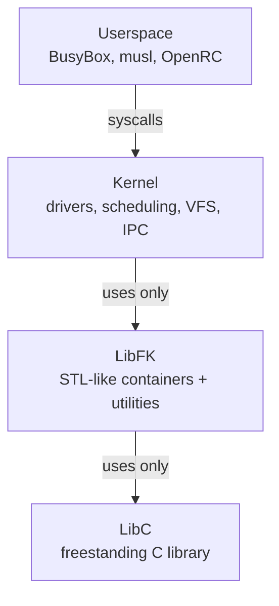

# FKernel Directory Structure

> Reference for developers and AI agents. 157 directories, 730+ files.

## Layer Architecture



## Directory Tree

```
Include/
├── Kernel
│   ├── Arch
│   │   └── x86_64
│   │       ├── arch_defs.h
│   │       ├── Driver
│   │       │   └── Vga
│   │       │       ├── bios_service.h
│   │       │       ├── vbe_types.h
│   │       │       └── vesa.h
│   │       ├── Interrupt
│   │       │   ├── Handler
│   │       │   │   ├── exception_macros.h
│   │       │   │   ├── handlers.h
│   │       │   │   └── interrupt_frame.h
│   │       │   ├── HardwareInterrupts
│   │       │   │   ├── hardware_interrupt.h
│   │       │   │   ├── InterruptController
│   │       │   │   │   ├── 8259_pic.h
│   │       │   │   │   ├── apic.h
│   │       │   │   │   ├── ioapic.h
│   │       │   │   │   └── x2apic.h
│   │       │   │   ├── tick_manager.h
│   │       │   │   ├── TimerController
│   │       │   │   │   ├── apic_timer.h
│   │       │   │   │   ├── hpet.h
│   │       │   │   │   └── pit.h
│   │       │   │   └── timer_interrupt.h
│   │       │   ├── interrupt_controller.h
│   │       │   ├── interrupt_types.h
│   │       │   ├── isr_stubs.h
│   │       │   └── non_maskable_interrupt.h
│   │       ├── io.h
│   │       ├── Memory
│   │       │   └── IntelIOMMU
│   │       │       └── vtd.h
│   │       ├── Segments
│   │       │   ├── Gdt
│   │       │   │   ├── gdt_entry.h
│   │       │   │   ├── gdt_pointer.h
│   │       │   │   └── gdt_structures.h
│   │       │   ├── gdt.h
│   │       │   └── Tss
│   │       │       ├── tss_descriptor.h
│   │       │       ├── tss_stacks.h
│   │       │       └── tss_structures.h
│   │       └── Syscall
│   │           └── syscall_arch.h
│   ├── Boot
│   │   ├── boot_info.h
│   │   ├── kernel_entry.h
│   │   ├── Multiboot
│   │   │   ├── multiboot2.h
│   │   │   └── multiboot_interpreter.h
│   │   └── Stages
│   │       ├── early_init.h
│   │       └── init.h
│   ├── Clock
│   │   ├── clock_interrupt.h
│   │   ├── ClockController
│   │   │   ├── cmos.h
│   │   │   └── rtc.h
│   │   └── Types
│   │       ├── clock.h
│   │       └── Datetime
│   │           └── Datetime.h
│   ├── Driver
│   │   ├── async_io.h
│   │   ├── driver_registry.h
│   │   ├── Device
│   │   │   ├── device_id.h
│   │   │   ├── driver_manager.h
│   │   │   ├── BlockDevice
│   │   │   │   ├── block_device.h
│   │   │   │   ├── sector_count.h
│   │   │   │   └── sector_size.h
│   │   │   └── CharacterDevice
│   │   │       ├── character_device.h
│   │   │       ├── null_device.h
│   │   │       ├── ptmx_device.h
│   │   │       └── urandom_device.h
│   │   ├── Keyboard
│   │   │   ├── keyboard_node.h
│   │   │   ├── keymap_manager.h
│   │   │   └── ps2_keyboard.h
│   │   ├── Mouse
│   │   │   └── ps2_mouse.h
│   │   ├── Network
│   │   │   ├── mac_address.h
│   │   │   ├── network_device.h
│   │   │   └── E1000
│   │   │       ├── e1000.h
│   │   │       └── interrupt_driven_e1000.h
│   │   ├── Pty
│   │   │   ├── pty_buffer.h
│   │   │   ├── pty_master.h
│   │   │   └── pty_slave.h
│   │   ├── SerialPort
│   │   │   ├── serial_node.h
│   │   │   └── serial_port.h
│   │   ├── Storage
│   │   │   ├── storage_cache.h
│   │   │   ├── storage_device.h
│   │   │   ├── storage_device_name.h
│   │   │   ├── Ahci
│   │   │   │   ├── ahci_controller.h
│   │   │   │   └── interrupt_driven_ahci.h
│   │   │   ├── Ata
│   │   │   │   ├── ata_controller.h
│   │   │   │   ├── ata_device.h
│   │   │   │   ├── ata_transfer_strategy.h
│   │   │   │   ├── dma_strategy.h
│   │   │   │   └── pio_strategy.h
│   │   │   ├── Nvme
│   │   │   │   ├── interrupt_driven_nvme.h
│   │   │   │   ├── nvme_async_operation.h
│   │   │   │   ├── nvme_command_builder.h
│   │   │   │   ├── nvme_command.h
│   │   │   │   ├── nvme_command_id_manager.h
│   │   │   │   ├── nvme_completion_processor.h
│   │   │   │   ├── nvme_controller.h
│   │   │   │   ├── nvme_controller_state.h
│   │   │   │   ├── nvme_device_configuration.h
│   │   │   │   ├── nvme_interrupt_configurator.h
│   │   │   │   ├── nvme_interrupt_handler.h
│   │   │   │   ├── nvme_interrupt_line.h
│   │   │   │   ├── nvme_pending_operations.h
│   │   │   │   ├── nvme_queue_setup.h
│   │   │   │   ├── nvme_register_mapper.h
│   │   │   │   ├── nvme_utilities.h
│   │   │   │   ├── nvme_completion_processor.h
│   │   │   │   ├── nvme_queue_manager.h
│   │   │   │   └── nvme_register_access.h
│   │   │   └── Partitions
│   │   │       ├── partition.h
│   │   │       ├── partition_list.h
│   │   │       ├── partition_manager.h
│   │   │       ├── Gpt
│   │   │       │   ├── gpt.h
│   │   │       │   ├── gpt_header.h
│   │   │       │   └── gpt_partition_entry.h
│   │   │       └── Mbr
│   │   │           ├── mbr.h
│   │   │           ├── mbr_header.h
│   │   │           └── mbr_partition_entry.h
│   │   ├── Terminal
│   │   │   ├── terminal.h
│   │   │   ├── terminal_factory.h
│   │   │   ├── terminal_manager.h
│   │   │   ├── terminal_renderer.h
│   │   │   └── vga_terminal.h
│   │   ├── Usb
│   │   │   ├── usb_device.h
│   │   │   ├── usb_host_controller.h
│   │   │   └── usb_transfer.h
│   │   └── Vga
│   │       ├── dirty_tracker.h
│   │       ├── display.h
│   │       ├── display_framebuffer.h
│   │       ├── extended_font.h
│   │       ├── font.h
│   │       ├── pixel_converter.h
│   │       ├── render_surface.h
│   │       ├── vga_adapter.h
│   │       ├── vga_node.h
│   │       ├── Display
│   │       │   ├── cursor_manager.h
│   │       │   └── framebuffer_manager.h
│   │       └── Types
│   │           ├── color.h
│   │           ├── framebuffer_info.h
│   │           └── render_command.h
│   ├── Fs
│   │   ├── DebugFs
│   │   │   ├── debug_fs.h
│   │   │   └── Node
│   │   │       ├── debug_log_node.h
│   │   │       ├── stderr_log_node.h
│   │   │       ├── stdout_log_node.h
│   │   │       └── syscall_log_node.h
│   │   ├── DevFs
│   │   │   ├── dev_fs.h
│   │   │   └── tty.h
│   │   ├── Epoll
│   │   │   └── epoll_node.h
│   │   ├── EventFd
│   │   │   └── event_fd_node.h
│   │   ├── Fat12
│   │   │   ├── bpb.h
│   │   │   ├── directory_entry.h
│   │   │   ├── fat_12_fs.h
│   │   │   └── fat_12_node.h
│   │   ├── Fat16
│   │   │   ├── bpb.h
│   │   │   ├── directory_entry.h
│   │   │   ├── fat_16_fs.h
│   │   │   └── fat_16_node.h
│   │   ├── Fat32
│   │   │   ├── bpb.h
│   │   │   ├── directory_entry.h
│   │   │   ├── fat_32_fs.h
│   │   │   └── fat_32_node.h
│   │   ├── PipeFs
│   │   │   └── pipe_node.h
│   │   ├── ProcFs
│   │   │   ├── proc_fs.h
│   │   │   ├── proc_fs_node.h
│   │   │   ├── proc_cpuinfo_node.h
│   │   │   ├── proc_loadavg_node.h
│   │   │   ├── proc_meminfo_node.h
│   │   │   ├── proc_mounts_node.h
│   │   │   ├── proc_partitions_node.h
│   │   │   ├── proc_pid_cmdline_node.h
│   │   │   ├── proc_pid_dir_node.h
│   │   │   ├── proc_pid_stat_node.h
│   │   │   ├── proc_process_node.h
│   │   │   ├── proc_self_node.h
│   │   │   ├── proc_stat_node.h
│   │   │   ├── proc_sys_kernel_node.h
│   │   │   ├── proc_sys_node.h
│   │   │   ├── proc_sys_string_node.h
│   │   │   ├── proc_uptime_node.h
│   │   │   └── proc_version_node.h
│   │   ├── PtsFs
│   │   │   └── pts_dir_node.h
│   │   ├── RamDisk
│   │   │   └── ram_disk.h
│   │   ├── SemFs
│   │   │   ├── sem_node.h
│   │   │   └── sem_dir_node.h
│   │   ├── ShmFs  
│   │   │   ├── shm_node.h
│   │   │   └── shm_dir_node.h
│   │   ├── MqueueFs
│   │   │   ├── mqueue_node.h
│   │   │   └── mqueue_dir_node.h
│   │   ├── SignalFd
│   │   │   └── signal_fd_node.h
│   │   ├── TimerFd
│   │   │   ├── timer_fd_node.h
│   │   │   └── timer_fd_registry.h
│   │   ├── TmpFs
│   │   │   ├── tmp_fs.h
│   │   │   ├── tmp_fs_child.h
│   │   │   ├── tmp_fs_child_list.h
│   │   │   ├── tmp_fs_directory_node.h
│   │   │   └── tmp_fs_node.h
│   │   └── Vfs
│   │       ├── auto_mounter.h
│   │       ├── definitions.h
│   │       ├── dentry.h
│   │       ├── dentry_node_stack.h
│   │       ├── file_description.h
│   │       ├── fstab.h
│   │       ├── kqueue.h
│   │       ├── node.h
│   │       ├── virtual_filesystem.h
│   │       └── Definitions
│   │           ├── file_descriptor.h
│   │           ├── inode_index.h
│   │           └── seek_mode.h
│   ├── Hardware
│   │   ├── Acpi
│   │   │   ├── acpi.h
│   │   │   ├── dmar.h
│   │   │   ├── hpet.h
│   │   │   ├── mcfg.h
│   │   │   ├── rsdp.h
│   │   │   ├── rsdt.h
│   │   │   ├── sdt_header.h
│   │   │   ├── srat.h
│   │   │   ├── topology_manager.h
│   │   │   └── xsdt.h
│   │   ├── Cpu
│   │   │   ├── cpu.h
│   │   │   ├── cpu_block.h
│   │   │   ├── cpu_context.h
│   │   │   ├── cpu_register.h
│   │   │   └── processor.h
│   │   ├── Fadt
│   │   │   ├── fadt.h
│   │   │   ├── fadt_manager.h
│   │   │   └── generic_address_structures.h
│   │   ├── Madt
│   │   │   ├── madt.h
│   │   │   ├── madt_entries.h
│   │   │   ├── madt_interrupt_source_override.h
│   │   │   ├── madt_ioapic.h
│   │   │   ├── madt_lapic.h
│   │   │   └── madt_lapic_override.h
│   │   └── Pci
│   │       ├── pci.h
│   │       ├── pci_address.h
│   │       ├── pci_device.h
│   │       ├── pci_event.h
│   │       └── pci_node.h
│   ├── Io
│   │   └── kernel_puts.h
│   ├── Ipc
│   │   ├── badge.h
│   │   ├── capability.h
│   │   ├── cspace.h
│   │   ├── endpoint.h
│   │   ├── global_endpoint_manager.h
│   │   ├── ipc_log_node.h
│   │   ├── message_info.h
│   │   ├── notification.h
│   │   ├── signal_delivery.h
│   │   ├── signal_frame.h
│   │   └── system_labels.h
│   ├── Loader
│   │   ├── elf_loader.h
│   │   ├── elf_loader_core.h
│   │   ├── elf_types.h
│   │   ├── Domains
│   │   │   ├── dynamic_domain.h
│   │   │   ├── interpreter_domain.h
│   │   │   ├── load_domain.h
│   │   │   ├── memory_domain.h
│   │   │   ├── parser_domain.h
│   │   │   ├── Base
│   │   │   │   └── elf_domain.h
│   │   │   └── Types
│   │   │       ├── load_context.h
│   │   │       └── memory_region.h
│   │   └── Types
│   │       ├── elf64_dynamic.h
│   │       ├── elf64_ehdr.h
│   │       ├── elf64_phdr.h
│   │       ├── elf64_types.h
│   │       ├── elf_constants.h
│   │       └── elf_results.h
│   ├── Memory
│   │   ├── iommu.h
│   │   ├── memory_manager.h
│   │   ├── ObjectMemory
│   │   │   └── Zone
│   │   │       ├── zone_allocator.h
│   │   │       ├── zone_defs.h
│   │   │       └── zone_types.h
│   │   ├── PhysicalMemory
│   │   │   ├── physical_memory_manager.h
│   │   │   ├── physical_memory_zone.h
│   │   │   └── Buddy
│   │   │       ├── buddy_allocator.h
│   │   │       ├── buddy_order.h
│   │   │       ├── buddy_state.h
│   │   │       └── free_blocks.h
│   │   ├── UserAccess
│   │   │   └── user_access.h
│   │   └── VirtualMemory
│   │       ├── memory_region.h
│   │       ├── virtual_memory_manager.h
│   │       ├── Pages
│   │       │   ├── page_flags.h
│   │       │   └── page_table.h
│   │       └── RegionSplitter
│   │           └── region_splitter.h
│   ├── Net
│   │   ├── byte_order.h
│   │   ├── socket.h
│   │   ├── unix_socket.h
│   │   ├── unix_socket_buffer.h
│   │   ├── Arp
│   │   │   ├── arp_packet.h
│   │   │   └── arp_table.h
│   │   ├── Dhcp
│   │   │   ├── dhcp_client.h
│   │   │   └── dhcp_packet.h
│   │   ├── Dns
│   │   │   ├── dns_packet.h
│   │   │   └── dns_resolver.h
│   │   ├── Eth
│   │   │   └── ethernet_frame.h
│   │   ├── Icmp
│   │   │   └── icmp_packet.h
│   │   ├── InetSocket
│   │   │   └── inet_socket.h
│   │   ├── Ip
│   │   │   ├── ip_address.h
│   │   │   └── ipv4_header.h
│   │   ├── NetworkStack
│   │   │   └── network_stack.h
│   │   ├── Routing
│   │   │   └── routing_table.h
│   │   ├── Tcp
│   │   │   ├── tcp_connection.h
│   │   │   ├── tcp_header.h
│   │   │   └── tcp_socket.h
│   │   └── Udp
│   │       ├── udp_header.h
│   │       └── udp_socket.h
│   ├── Posix
│   │   ├── signal_defs.h
│   │   └── sys
│   │       ├── errno.h
│   │       ├── stat.h
│   │       ├── time.h
│   │       └── utsname.h
│   ├── Scheduler
│   │   ├── pid_generator.h
│   │   ├── scheduler.h
│   │   ├── task_entries.h
│   │   └── Task
│   │       ├── task.h
│   │       └── task_state.h
│   └── Syscall
│       ├── syscall.h
│       ├── syscall_arch.h
│       ├── syscall_numbers.h
│       ├── syscall_types.h
│       └── syscall_utils.h
├── LibC
│   ├── assert.h
│   ├── ctype.h
│   ├── dirent.h
│   ├── errno.h
│   ├── fcntl.h
│   ├── float.h
│   ├── fstab.h
│   ├── limits.h
│   ├── pthread.h
│   ├── signal.h
│   ├── stdarg.h
│   ├── stdbool.h
│   ├── stddef.h
│   ├── stdint.h
│   ├── stdio.h
│   ├── stdlib.h
│   ├── string.h
│   ├── termios.h
│   ├── time.h
│   ├── unistd.h
│   ├── wchar.h
│   └── sys
│       ├── stat.h
│       └── syscall.h
└── LibFK
    ├── Algorithms
    │   ├── binary_search.h
    │   ├── byte_checksum.h
    │   ├── byte_order.h
    │   ├── container_algorithms.h
    │   ├── crc32.h
    │   ├── djb2.h
    │   ├── fat_name.h
    │   ├── format.h
    │   ├── gather.h
    │   ├── internet_checksum.h
    │   ├── log.h
    │   ├── math.h
    │   └── string_algorithms.h
    ├── Arch
    │   └── x86_64
    │       └── io.h
    ├── Container
    │   ├── array.h
    │   ├── bitmap.h
    │   ├── circular_buffer.h
    │   ├── deque.h
    │   ├── forward_list.h
    │   ├── hash_map.h
    │   ├── intrusive_list.h
    │   ├── list.h
    │   ├── map.h
    │   ├── multi_map.h
    │   ├── multi_set.h
    │   ├── priority_queue.h
    │   ├── queue.h
    │   ├── set.h
    │   ├── span.h
    │   ├── stack.h
    │   ├── static_vector.h
    │   ├── unordered_set.h
    │   └── vector.h
    ├── Core
    │   ├── Assertions.h
    │   ├── errno_codes.h
    │   ├── Error.h
    │   ├── Platform.h
    │   └── Result.h
    ├── Functional
    │   ├── Function.h
    │   └── Tuple.h
    ├── Memory
    │   ├── allocator_backend.h
    │   ├── heap_malloc.h
    │   ├── new.h
    │   ├── optional.h
    │   ├── own_ptr.h
    │   ├── ref_counted.h
    │   ├── ref_ptr.h
    │   └── retain_ptr.h
    ├── Synchronization
    │   ├── interrupt_disabler.h
    │   └── spinlock.h
    ├── Syscalls
    │   └── numbers.h
    ├── Terminal
    │   └── ansi_parser.h
    ├── Text
    │   ├── fixed_string.h
    │   ├── string.h
    │   ├── string_builder.h
    │   └── string_view.h
    ├── Traits
    │   ├── crtp.h
    │   ├── traits.h
    │   └── type_traits.h
    ├── Tree
    │   └── rb_tree.h
    ├── Types
    │   ├── buddy_order.h
    │   ├── fileDescriptor.h
    │   ├── file_flags.h
    │   ├── file_offset.h
    │   ├── frame_index.h
    │   ├── physicalAddress.h
    │   ├── processId.h
    │   ├── signal_number.h
    │   ├── thread_id.h
    │   ├── types.h
    │   └── virtualAddress.h
    └── Utilities
        ├── aligner.h
        ├── converter.h
        ├── Memory.h
        ├── pair.h
        ├── size_checking.h
        ├── tuple.h
        └── Archive
            └── tar.h
Src/
├── Kernel
│   ├── Arch
│   │   └── x86_64
│   │       ├── Boot
│   │       │   ├── check.asm
│   │       │   ├── error.asm
│   │       │   ├── error_logger.cpp
│   │       │   ├── long_mode_start.asm
│   │       │   ├── main.asm
│   │       │   └── setup_page_tables.asm
│   │       ├── Driver
│   │       │   └── Vga
│   │       │       ├── bios_int10h.cpp
│   │       │       ├── real_mode_bridge.asm
│   │       │       └── vesa.cpp
│   │       ├── Init
│   │       │   └── early_init.cpp
│   │       ├── Interrupt
│   │       │   ├── flush_idt.asm
│   │       │   ├── interrupt_controller.cpp
│   │       │   ├── interrupt_dispatch.cpp
│   │       │   ├── interrupt_stub.asm
│   │       │   ├── Handler
│   │       │   │   ├── Exception
│   │       │   │   │   ├── alignment_check.cpp
│   │       │   │   │   ├── bound_range_exceeded.cpp
│   │       │   │   │   ├── breakpoint.cpp
│   │       │   │   │   ├── debug.cpp
│   │       │   │   │   ├── default_handler.cpp
│   │       │   │   │   ├── device_not_available.cpp
│   │       │   │   │   ├── divide_by_zero.cpp
│   │       │   │   │   ├── double_fault.cpp
│   │       │   │   │   ├── gp_handler.cpp
│   │       │   │   │   ├── invalid_opcode.cpp
│   │       │   │   │   ├── invalid_tss.cpp
│   │       │   │   │   ├── machine_check.cpp
│   │       │   │   │   ├── nmi_handler.cpp
│   │       │   │   │   ├── overflow.cpp
│   │       │   │   │   ├── pf_handler.cpp
│   │       │   │   │   ├── segment_not_present.cpp
│   │       │   │   │   ├── simd_floating_point_exception.cpp
│   │       │   │   │   ├── stack_segment_fault.cpp
│   │       │   │   │   ├── virtualization_exception.cpp
│   │       │   │   │   └── x87_fpu_floating_point_error.cpp
│   │       │   │   └── Routine
│   │       │   │       ├── ata_handler.cpp
│   │       │   │       ├── clock_handler.cpp
│   │       │   │       ├── keyboard_handler.cpp
│   │       │   │       ├── mouse_handler.cpp
│   │       │   │       └── timer_handler.cpp
│   │       │   └── HardwareInterrupts
│   │       │       ├── hardware_interrupt.cpp
│   │       │       ├── tick_manager.cpp
│   │       │       ├── timer_interrupt.cpp
│   │       │       ├── InterruptController
│   │       │       │   ├── 8259_pic.cpp
│   │       │       │   ├── apic.cpp
│   │       │       │   ├── ioapic.cpp
│   │       │       │   └── x2apic.cpp
│   │       │       └── TimerController
│   │       │           ├── apic_timer.cpp
│   │       │           ├── hpet.cpp
│   │       │           └── pit.cpp
│   │       ├── Memory
│   │       │   ├── invalid_tlb.asm
│   │       │   ├── read_on_cr3.asm
│   │       │   ├── write_on_cr3.asm
│   │       │   └── IntelIOMMU
│   │       │       └── vtd.cpp
│   │       ├── Panic
│   │       │   └── Panic.cpp
│   │       ├── Scheduler
│   │       │   ├── context_switch.asm
│   │       │   └── enter_user_mode.asm
│   │       ├── Section
│   │       │   ├── bss.asm
│   │       │   ├── multiboot2.asm
│   │       │   └── rodata.asm
│   │       ├── Segments
│   │       │   ├── flush_gdt.asm
│   │       │   ├── flush_tss.asm
│   │       │   └── gdt.cpp
│   │       └── Syscall
│   │           ├── syscall_init.cpp
│   │           ├── syscall_stub.asm
│   │           └── syscall_stub_validation.cpp
│   ├── Boot
│   │   ├── boot_info.cpp
│   │   ├── kernel_entry.cpp
│   │   └── Multiboot
│   │       └── kmain.cpp
│   ├── Clock
│   │   ├── clock_manager.cpp
│   │   └── ClockController
│   │       ├── cmos.cpp
│   │       ├── datetime.cpp
│   │       └── rtc.cpp
│   ├── Driver
│   │   ├── async_io.h
│   │   ├── driver_registry.cpp
│   │   ├── Device
│   │   │   ├── driver_manager.cpp
│   │   │   └── BlockDevice
│   │   │       └── block_device.cpp
│   │   ├── Keyboard
│   │   │   ├── keymap_manager.cpp
│   │   │   └── ps2_keyboard.cpp
│   │   ├── Mouse
│   │   │   └── ps2_mouse.cpp
│   │   ├── Network
│   │   │   └── E1000
│   │   │       └── e1000.cpp
│   │   ├── Pty
│   │   │   ├── pty_buffer.cpp
│   │   │   ├── pty_master.cpp
│   │   │   └── pty_slave.cpp
│   │   ├── Serial
│   │   │   └── serial_port.cpp
│   │   ├── Storage
│   │   │   ├── storage_cache.cpp
│   │   │   ├── storage_device.cpp
│   │   │   ├── Ahci
│   │   │   │   ├── ahci_controller.cpp
│   │   │   │   └── interrupt_driven_ahci.cpp
│   │   │   ├── Ata
│   │   │   │   ├── ata_controller.cpp
│   │   │   │   ├── ata_device.cpp
│   │   │   │   ├── dma_strategy.cpp
│   │   │   │   └── pio_strategy.cpp
│   │   │   ├── Nvme
│   │   │   │   ├── interrupt_driven_nvme.cpp
│   │   │   │   ├── nvme_command_builder.cpp
│   │   │   │   ├── nvme_command_id_manager.cpp
│   │   │   │   ├── nvme_completion_processor.cpp
│   │   │   │   ├── nvme_controller.cpp
│   │   │   │   ├── nvme_controller_state.cpp
│   │   │   │   ├── nvme_device_configuration.cpp
│   │   │   │   ├── nvme_interrupt_configurator.cpp
│   │   │   │   ├── nvme_interrupt_handler.cpp
│   │   │   │   ├── nvme_interrupt_line.cpp
│   │   │   │   ├── nvme_pending_operations.cpp
│   │   │   │   ├── nvme_queue_setup.cpp
│   │   │   │   ├── nvme_register_mapper.cpp
│   │   │   │   └── nvme_registers.cpp
│   │   │   └── Partitions
│   │   │       ├── partition.cpp
│   │   │       ├── partition_manager.cpp
│   │   │       ├── Gpt
│   │   │       │   └── gpt.cpp
│   │   │       └── Mbr
│   │   │           └── mbr.cpp
│   │   ├── Terminal
│   │   │   ├── terminal_factory.cpp
│   │   │   ├── terminal_manager.cpp
│   │   │   ├── terminal_renderer.cpp
│   │   │   └── vga_terminal.cpp
│   │   └── Vga
│   │       ├── dirty_tracker.cpp
│   │       ├── display.cpp
│   │       ├── extended_font.cpp
│   │       ├── pixel_converter.cpp
│   │       └── Display
│   │           ├── display_framebuffer.cpp
│   │           └── display_text.cpp
│   ├── Fs
│   │   ├── DebugFs
│   │   │   └── debug_fs.cpp
│   │   ├── DevFs
│   │   │   └── dev_fs.cpp
│   │   ├── Epoll
│   │   │   └── epoll_node.cpp
│   │   ├── EventFd
│   │   │   └── event_fd_node.cpp
│   │   ├── Fat12
│   │   │   ├── fat_12_fs.cpp
│   │   │   └── fat_12_node.cpp
│   │   ├── Fat16
│   │   │   ├── fat_16_fs.cpp
│   │   │   └── fat_16_node.cpp
│   │   ├── Fat32
│   │   │   ├── fat_32_fs.cpp
│   │   │   └── fat_32_node.cpp
│   │   ├── PipeFs
│   │   │   └── pipe_node.cpp
│   │   ├── ProcFs
│   │   │   ├── proc_fs.cpp
│   │   │   └── proc_sys_node.cpp
│   │   ├── PtsFs
│   │   │   └── pts_dir_node.cpp
│   │   ├── RamDisk
│   │   │   └── ram_disk.cpp
│   │   ├── SignalFd
│   │   │   └── signal_fd_node.cpp
│   │   ├── TimerFd
│   │   │   ├── timer_fd_node.cpp
│   │   │   └── timer_fd_registry.cpp
│   │   ├── TmpFs
│   │   │   └── tmp_fs.cpp
│   │   └── Vfs
│   │       ├── auto_mounter.cpp
│   │       ├── dentry.cpp
│   │       ├── dentry_node_stack.cpp
│   │       ├── file_description.cpp
│   │       ├── Fstab.cpp
│   │       ├── kqueue.cpp
│   │       ├── vfs_directory.cpp
│   │       ├── vfs_operations.cpp
│   │       ├── vfs_resolve.cpp
│   │       └── virtual_filesystem.cpp
│   ├── Hardware
│   │   ├── Acpi
│   │   │   ├── acpi.cpp
│   │   │   └── topology_manager.cpp
│   │   ├── Cpu
│   │   │   ├── cpu.cpp
│   │   │   ├── cpu_context.cpp
│   │   │   └── cpu_register.cpp
│   │   ├── Fadt
│   │   │   └── fadt_manager.cpp
│   │   ├── Madt
│   │   │   └── madt.cpp
│   │   └── Pci
│   │       ├── pci.cpp
│   │       └── pci_node.cpp
│   ├── Init
│   │   └── init.cpp
│   ├── Io
│   │   └── kernel_puts.cpp
│   ├── Ipc
│   │   ├── endpoint.cpp
│   │   ├── ipc_log_node.cpp
│   │   ├── notification.cpp
│   │   └── signal_delivery.cpp
│   ├── Loader
│   │   ├── elf_loader.cpp
│   │   ├── elf_loader_core.cpp
│   │   └── Domains
│   │       ├── dynamic_domain.cpp
│   │       ├── interpreter_domain.cpp
│   │       ├── load_domain.cpp
│   │       ├── memory_domain.cpp
│   │       ├── parser_domain.cpp
│   │       ├── Base
│   │       │   └── elf_domain.cpp
│   │       └── Types
│   │           ├── load_context.cpp
│   │           └── memory_region.cpp
│   ├── Memory
│   │   ├── memory_manager.cpp
│   │   ├── ObjectMemory
│   │   │   └── Zone
│   │   │       └── zone_allocator.cpp
│   │   ├── PhysicalMemory
│   │   │   ├── physical_memory_manager.cpp
│   │   │   └── Buddy
│   │   │       ├── buddy_allocator.cpp
│   │   │       └── buddy_state.cpp
│   │   ├── UserAccess
│   │   │   └── user_access.cpp
│   │   └── VirtualMemory
│   │       ├── virtual_memory_manager.cpp
│   │       └── RegionSplitter
│   │           └── region_splitter.cpp
│   ├── Net
│   │   ├── unix_socket.cpp
│   │   ├── unix_socket_buffer.cpp
│   │   ├── Arp
│   │   │   └── arp_table.cpp
│   │   ├── Dhcp
│   │   │   └── dhcp_client.cpp
│   │   ├── Dns
│   │   │   └── dns_resolver.cpp
│   │   ├── Icmp
│   │   │   └── icmp_packet.cpp
│   │   ├── InetSocket
│   │   │   └── inet_socket.cpp
│   │   ├── NetworkStack
│   │   │   └── network_stack.cpp
│   │   ├── Routing
│   │   │   └── routing_table.cpp
│   │   ├── Tcp
│   │   │   ├── tcp_connection.cpp
│   │   │   └── tcp_socket.cpp
│   │   └── Udp
│   │       └── udp_socket.cpp
│   ├── Posix
│   │   ├── errno.cpp
│   │   └── time.cpp
│   ├── Scheduler
│   │   ├── idle_task.cpp
│   │   ├── init_task.cpp
│   │   ├── SchedulerIntrospection.cpp
│   │   ├── SchedulerLifecycle.cpp
│   │   ├── SchedulerManager.cpp
│   │   ├── start_user_task.cpp
│   │   └── Task
│   │       └── task.cpp
│   └── Syscall
│       ├── syscall.cpp
│       └── SyscallList
│           ├── FileSystem
│           │   ├── chdir.cpp
│           │   ├── close.cpp
│           │   ├── dup2.cpp
│           │   ├── fcntl.cpp
│           │   ├── fstat.cpp
│           │   ├── get_cwd.cpp
│           │   ├── get_dents64.cpp
│           │   ├── ioctl.cpp
│           │   ├── lseek.cpp
│           │   ├── lstat.cpp
│           │   ├── mkdir.cpp
│           │   ├── newfstatat.cpp
│           │   ├── open.cpp
│           │   ├── read.cpp
│           │   ├── stat.cpp
│           │   ├── write.cpp
│           │   └── ... (52 files)
│           ├── Ipc
│           │   ├── ipc_call.cpp
│           │   ├── ipc_receive.cpp
│           │   ├── ipc_send.cpp
│           │   └── ... (4 files)
│           ├── Memory
│           │   ├── brk.cpp
│           │   ├── mmap.cpp
│           │   └── ... (6 files)
│           ├── Networking
│           │   ├── accept.cpp
│           │   ├── bind.cpp
│           │   ├── connect.cpp
│           │   ├── listen.cpp
│           │   ├── socket.cpp
│           │   └── ... (16 files)
│           ├── Posix
│           │   ├── time.cpp
│           │   └── ... (3 files)
│           ├── Process
│           │   ├── arch_prctl.cpp
│           │   ├── execve.cpp
│           │   ├── exit.cpp
│           │   ├── fork.cpp
│           │   ├── get_pid.cpp
│           │   ├── get_uid.cpp
│           │   ├── set_tid_address.cpp
│           │   ├── wait4.cpp
│           │   ├── yield.cpp
│           │   └── ... (35 files)
│           ├── Signals
│           │   ├── kill.cpp
│           │   ├── sig_action.cpp
│           │   ├── sig_proc_mask.cpp
│           │   ├── sig_rt_sigsuspend.cpp
│           │   └── ... (5 files)
│           ├── System
│           │   ├── uname.cpp
│           │   └── ... (4 files)
│           ├── Terminal
│           │   └── ... (3 files)
│           └── Time
│               └── ... (7 files)
├── LibC
│   ├── assert.c
│   ├── ctype.c
│   ├── posix_stubs.c
│   ├── stdlib.c
│   ├── wchar.c
│   ├── stdio
│   │   ├── file.c
│   │   ├── kprintf.c
│   │   ├── printf.c
│   │   ├── snprintf.c
│   │   ├── vsnprintf.c
│   │   └── _impl
│   │       └── libc_putc.cpp
│   └── string
│       ├── atoi.c
│       ├── itoa.c
│       ├── memchr.c
│       ├── memcmp.c
│       ├── memcpy.c
│       ├── memmove.c
│       ├── memset.c
│       ├── stol.c
│       ├── strcasecmp.c
│       ├── strcat.c
│       ├── strchr.c
│       ├── strcmp.c
│       ├── strcpy.c
│       ├── strdup.c
│       ├── strerror.c
│       ├── string_data.c
│       ├── strlen.c
│       ├── strncat.c
│       ├── strnchr.c
│       ├── strncmp.c
│       ├── strncpy.c
│       ├── strnlen.c
│       ├── strrchr.c
│       ├── strstr.c
│       ├── strtok.c
│       └── ultoa.c
├── LibFK
│   ├── cxxabi.cpp
│   ├── Algorithms
│   │   ├── crc32.cpp
│   │   ├── djb2.cpp
│   │   └── log_targets.cpp
│   ├── Container
│   │   └── intrusive_list.cpp
│   ├── Memory
│   │   ├── heap_malloc.cpp
│   │   └── new.cpp
│   ├── Terminal
│   │   └── ansi_parser.cpp
│   ├── Text
│   │   ├── string.cpp
│   │   └── string_builder.cpp
│   └── Utilities
│       └── Archive
│           └── tar.cpp
├── Toolchain
│   ├── busybox
│   │   └── build.lua
│   └── musl
│       └── build.lua
└── Userland
    ├── linker.ld
    ├── lib
    │   ├── crt0.asm
    │   ├── fk_user.h
    │   ├── syscalls.asm
    │   └── syscalls.inc
    ├── cat
    │   └── main.c
    ├── clear
    │   └── main.c
    ├── init
    │   └── main.c
    ├── ktest
    │   └── main.c
    ├── ls
    │   └── main.c
    ├── shell
    │   └── main.c
    └── uname
        └── main.c
Config/
├── grub.cfg
└── linker.ld
Meta/
├── wiggum.lua
├── wiggum-dashboard.lua
├── wiggum-tools/
│   └── ...
├── Lib/
│   └── ... (build scripts)
├── Toolchain/
│   └── ... (toolchain configs)
├── UserTools/
│   └── ... (user tool scripts)
├── x86_64-tools/
│   └── ... (architecture tools)
└── make_live_iso.lua
tests/
├── main.cpp
├── test_framework.h
├── test_mock.c
├── Driver
│   └── Storage
│       └── Nvme
│           └── test_nvme_refactoring.cpp
├── LibC
│   ├── test_basic.c
│   ├── test_real_libc.c
│   ├── test_standalone.c
│   ├── test_stdio_comprehensive.cpp
│   ├── test_string_memory.cpp
│   └── test_string_memory_comprehensive.cpp
└── LibFK
    ├── test_circular_buffer.cpp
    ├── test_containers.cpp
    ├── test_multi_containers.cpp
    ├── test_smart_pointers.cpp
    ├── test_stack_queue_staticvec.cpp
    ├── test_text.cpp
    └── test_tuple.cpp
```

### Organization Principles

- **Domain-based**: PascalCase directories represent cohesive domains
- **One struct/class per file**: File name matches the struct/class name
- **Headers mirror source**: `Include/` structure matches `Src/` structure
- **Architecture-specific**: `Arch/x86_64/` contains all x86_64-specific code
