# FKernel Directory Structure

> Reference for developers and AI agents. 378 directories, 1135+ files across `Include/` and `Src/`.

## Layer Architecture

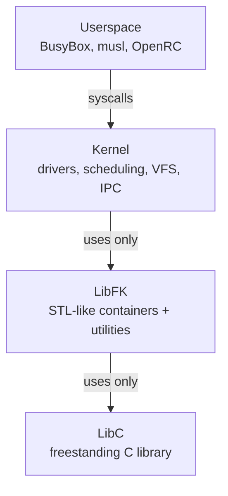
```mermaid
flowchart TD
    U["Userspace<br/>BusyBox, musl, OpenRC"]
    K["Kernel<br/>drivers, scheduling, VFS, IPC"]
    LFK["LibFK<br/>STL-like containers + utilities"]
    LC["LibC<br/>freestanding C library"]

    U -->|"syscalls"| K
    K -->|"uses only"| LFK
    LFK -->|"uses only"| LC
```

> Headers mirror sources: `Include/` mirrors `Src/`. Trees below list directories to file granularity, except the `Src/Kernel/Syscall/syscall_list/` subtree, summarised by category (one `sys_*` handler per file, verified by `xmake check-syscalls`).
```
Include/
├── Kernel/
│   ├── Arch/
│   │   └── x86_64/
│   │       ├── Driver/
│   │       │   └── Vga/
│   │       │       ├── bios_service.h
│   │       │       ├── vbe_types.h
│   │       │       └── vesa.h
│   │       ├── Hardware/
│   │       │   └── Cpu/
│   │       │       └── cpu_ops.h
│   │       ├── Interrupt/
│   │       │   ├── Handler/
│   │       │   │   ├── exception_macros.h
│   │       │   │   ├── handlers.h
│   │       │   │   └── interrupt_frame.h
│   │       │   ├── HardwareInterrupts/
│   │       │   │   ├── InterruptController/
│   │       │   │   │   ├── 8259_pic.h
│   │       │   │   │   ├── apic.h
│   │       │   │   │   ├── apic_common.h
│   │       │   │   │   ├── ioapic.h
│   │       │   │   │   ├── ioapic_controller.h
│   │       │   │   │   ├── msi_helpers.h
│   │       │   │   │   └── x2apic.h
│   │       │   │   ├── TimerController/
│   │       │   │   │   ├── apic_timer.h
│   │       │   │   │   ├── hpet.h
│   │       │   │   │   └── pit.h
│   │       │   │   ├── hardware_interrupt.h
│   │       │   │   ├── hardware_interrupt_manager.h
│   │       │   │   ├── tick_manager.h
│   │       │   │   ├── timer.h
│   │       │   │   └── timer_interrupt.h
│   │       │   ├── gate_type.h
│   │       │   ├── interrupt_controller.h
│   │       │   ├── interrupt_types.h
│   │       │   ├── isr_stubs.h
│   │       │   └── non_maskable_interrupt.h
│   │       ├── Memory/
│   │       │   └── IntelIOMMU/
│   │       │       └── vtd.h
│   │       ├── Segments/
│   │       │   ├── Gdt/
│   │       │   │   ├── gdt_entry.h
│   │       │   │   ├── gdt_pointer.h
│   │       │   │   ├── gdt_structures.h
│   │       │   │   ├── segment_access.h
│   │       │   │   ├── segment_descriptor.h
│   │       │   │   └── segment_flags.h
│   │       │   ├── Tss/
│   │       │   │   ├── tss_descriptor.h
│   │       │   │   ├── tss_stacks.h
│   │       │   │   └── tss_structures.h
│   │       │   └── gdt.h
│   │       ├── Smp/
│   │       │   └── ap_entry.h
│   │       ├── Syscall/
│   │       │   └── syscall_arch.h
│   │       ├── arch_defs.h
│   │       ├── io.h
│   │       └── rdtsc.h
│   ├── Boot/
│   │   ├── Core/
│   │   │   ├── boot_info.h
│   │   │   ├── boot_mark.h
│   │   │   ├── boot_mode.h
│   │   │   ├── boot_timer.h
│   │   │   └── kernel_entry.h
│   │   ├── Info/
│   │   │   ├── acpi_table_info.h
│   │   │   ├── boot_framebuffer_info.h
│   │   │   ├── memory_map_entry.h
│   │   │   ├── memory_map_iterator.h
│   │   │   └── module_info.h
│   │   ├── Multiboot/
│   │   │   ├── multiboot2.h
│   │   │   └── multiboot_interpreter.h
│   │   └── Stages/
│   │       ├── early_init.h
│   │       └── init.h
│   ├── Clock/
│   │   ├── ClockController/
│   │   │   ├── cmos.h
│   │   │   └── rtc.h
│   │   ├── Types/
│   │   │   ├── clock.h
│   │   │   └── datetime.h
│   │   └── clock_interrupt.h
│   ├── Driver/
│   │   ├── Async/
│   │   │   ├── async_io.h
│   │   │   ├── async_io_operation.h
│   │   │   ├── async_io_queue.h
│   │   │   ├── dma_buffer.h
│   │   │   └── io_completion_status.h
│   │   ├── Device/
│   │   │   ├── BlockDevice/
│   │   │   │   ├── block_device.h
│   │   │   │   ├── lvm_device.h
│   │   │   │   ├── lvm_segment.h
│   │   │   │   ├── raid_device.h
│   │   │   │   ├── raid_mode.h
│   │   │   │   ├── sector_count.h
│   │   │   │   ├── sector_size.h
│   │   │   │   └── stackable_block_device.h
│   │   │   ├── CharacterDevice/
│   │   │   │   ├── character_device.h
│   │   │   │   ├── null_device.h
│   │   │   │   ├── ptmx_device.h
│   │   │   │   └── urandom_device.h
│   │   │   ├── device_id.h
│   │   │   ├── driver.h
│   │   │   └── driver_manager.h
│   │   ├── Keyboard/
│   │   │   ├── keyboard_layout.h
│   │   │   ├── keyboard_node.h
│   │   │   ├── keymap_manager.h
│   │   │   └── ps2_keyboard.h
│   │   ├── Mouse/
│   │   │   └── ps2_mouse.h
│   │   ├── Network/
│   │   │   ├── E1000/
│   │   │   │   ├── e1000.h
│   │   │   │   ├── e1000_rx_desc.h
│   │   │   │   ├── e1000_tx_desc.h
│   │   │   │   └── interrupt_driven_e1000.h
│   │   │   ├── mac_address.h
│   │   │   └── network_device.h
│   │   ├── Pty/
│   │   │   ├── pty_buffer.h
│   │   │   ├── pty_line_discipline.h
│   │   │   ├── pty_master.h
│   │   │   ├── pty_slave.h
│   │   │   └── termios.h
│   │   ├── Registry/
│   │   │   └── driver_registry.h
│   │   ├── Serial/
│   │   │   ├── serial_node.h
│   │   │   └── serial_port.h
│   │   ├── Storage/
│   │   │   ├── Ahci/
│   │   │   ├── Ata/
│   │   │   ├── Controllers/
│   │   │   │   ├── Ahci/
│   │   │   │   │   ├── ahci_controller.h
│   │   │   │   │   └── interrupt_driven_ahci.h
│   │   │   │   ├── Ata/
│   │   │   │   │   ├── ata_controller.h
│   │   │   │   │   ├── ata_device.h
│   │   │   │   │   ├── ata_transfer_strategy.h
│   │   │   │   │   ├── dma_strategy.h
│   │   │   │   │   └── pio_strategy.h
│   │   │   │   └── Nvme/
│   │   │   │       ├── interrupt_driven_nvme.h
│   │   │   │       ├── nvme_async_operation.h
│   │   │   │       ├── nvme_command.h
│   │   │   │       ├── nvme_command_builder.h
│   │   │   │       ├── nvme_command_id_manager.h
│   │   │   │       ├── nvme_completion_processor.h
│   │   │   │       ├── nvme_controller.h
│   │   │   │       ├── nvme_controller_state.h
│   │   │   │       ├── nvme_device_configuration.h
│   │   │   │       ├── nvme_dma_memory_manager.h
│   │   │   │       ├── nvme_interrupt_configurator.h
│   │   │   │       ├── nvme_interrupt_handler.h
│   │   │   │       ├── nvme_interrupt_line.h
│   │   │   │       ├── nvme_pending_operations.h
│   │   │   │       ├── nvme_queue_descriptor.h
│   │   │   │       ├── nvme_queue_manager.h
│   │   │   │       ├── nvme_queue_setup.h
│   │   │   │       ├── nvme_queue_utilities.h
│   │   │   │       ├── nvme_register_access.h
│   │   │   │       ├── nvme_register_mapper.h
│   │   │   │       └── nvme_utilities.h
│   │   │   ├── Interfaces/
│   │   │   │   ├── storage_cache.h
│   │   │   │   ├── storage_device.h
│   │   │   │   └── storage_device_name.h
│   │   │   ├── Nvme/
│   │   │   └── Partitions/
│   │   │       ├── Gpt/
│   │   │       │   ├── gpt.h
│   │   │       │   ├── gpt_header.h
│   │   │       │   └── gpt_partition_entry.h
│   │   │       ├── Mbr/
│   │   │       │   ├── mbr.h
│   │   │       │   ├── mbr_header.h
│   │   │       │   └── mbr_partition_entry.h
│   │   │       ├── partition.h
│   │   │       ├── partition_list.h
│   │   │       └── partition_manager.h
│   │   ├── Terminal/
│   │   │   ├── terminal.h
│   │   │   ├── terminal_capabilities.h
│   │   │   ├── terminal_factory.h
│   │   │   ├── terminal_id.h
│   │   │   ├── terminal_manager.h
│   │   │   ├── terminal_renderer.h
│   │   │   ├── terminal_type.h
│   │   │   └── vga_terminal.h
│   │   ├── Udi/
│   │   ├── Usb/
│   │   │   ├── usb_device.h
│   │   │   ├── usb_host_controller.h
│   │   │   ├── usb_transfer.h
│   │   │   ├── usb_transfer_direction.h
│   │   │   └── usb_transfer_type.h
│   │   ├── Vga/
│   │   │   ├── Display/
│   │   │   │   ├── cursor_manager.h
│   │   │   │   └── framebuffer_manager.h
│   │   │   ├── Types/
│   │   │   │   ├── color.h
│   │   │   │   ├── framebuffer_info.h
│   │   │   │   ├── render_command.h
│   │   │   │   └── render_command_type.h
│   │   │   ├── dirty_tracker.h
│   │   │   ├── display.h
│   │   │   ├── display_framebuffer.h
│   │   │   ├── display_text.h
│   │   │   ├── extended_font.h
│   │   │   ├── font.h
│   │   │   ├── glyph.h
│   │   │   ├── pixel_converter.h
│   │   │   ├── raw_color.h
│   │   │   ├── render_surface.h
│   │   │   ├── vga_adapter.h
│   │   │   └── vga_node.h
│   │   └── Volume/
│   ├── Fs/
│   │   ├── Disk/
│   │   │   ├── Exfat/
│   │   │   │   ├── exfat_bpb.h
│   │   │   │   ├── exfat_fs.h
│   │   │   │   └── exfat_node.h
│   │   │   ├── Ext2/
│   │   │   │   ├── ext2_fs.h
│   │   │   │   ├── ext2_node.h
│   │   │   │   └── ext2_super.h
│   │   │   ├── Ext3/
│   │   │   │   ├── ext3_fs.h
│   │   │   │   └── ext3_super.h
│   │   │   ├── Ext4/
│   │   │   │   ├── ext4_fs.h
│   │   │   │   ├── ext4_node.h
│   │   │   │   └── ext4_super.h
│   │   │   ├── Fat12/
│   │   │   │   ├── bpb.h
│   │   │   │   ├── directory_entry.h
│   │   │   │   ├── fat_12_fs.h
│   │   │   │   └── fat_12_node.h
│   │   │   ├── Fat16/
│   │   │   │   ├── bpb.h
│   │   │   │   ├── directory_entry.h
│   │   │   │   ├── fat_16_fs.h
│   │   │   │   └── fat_16_node.h
│   │   │   ├── Fat32/
│   │   │   │   ├── bpb.h
│   │   │   │   ├── directory_entry.h
│   │   │   │   ├── fat_32_fs.h
│   │   │   │   └── fat_32_node.h
│   │   │   ├── HfsPlus/
│   │   │   │   ├── hfsplus_btree.h
│   │   │   │   ├── hfsplus_catalog.h
│   │   │   │   ├── hfsplus_extents.h
│   │   │   │   ├── hfsplus_fs.h
│   │   │   │   ├── hfsplus_node.h
│   │   │   │   ├── hfsplus_unicode.h
│   │   │   │   └── hfsplus_vh.h
│   │   │   ├── Iso9660/
│   │   │   │   ├── iso9660_fs.h
│   │   │   │   ├── iso9660_node.h
│   │   │   │   └── iso9660_vd.h
│   │   │   ├── MinixFs/
│   │   │   │   ├── minix_fs.h
│   │   │   │   ├── minix_node.h
│   │   │   │   └── minix_super.h
│   │   │   ├── RamDisk/
│   │   │   │   └── ram_disk.h
│   │   │   └── Ufs/
│   │   │       ├── ufs_dir.h
│   │   │       ├── ufs_endian.h
│   │   │       ├── ufs_fs.h
│   │   │       ├── ufs_node.h
│   │   │       └── ufs_super.h
│   │   ├── UserFs/
│   │   ├── Vfs/
│   │   │   ├── Core/
│   │   │   │   ├── definitions.h
│   │   │   │   ├── dentry.h
│   │   │   │   ├── dentry_node_stack.h
│   │   │   │   ├── directory_entry.h
│   │   │   │   ├── file_description.h
│   │   │   │   ├── node.h
│   │   │   │   ├── path_resolver.h
│   │   │   │   ├── timespec.h
│   │   │   │   └── virtual_filesystem.h
│   │   │   ├── Definitions/
│   │   │   │   ├── file_descriptor.h
│   │   │   │   ├── inode_index.h
│   │   │   │   └── seek_mode.h
│   │   │   ├── Events/
│   │   │   │   ├── kevent.h
│   │   │   │   ├── knote_hook.h
│   │   │   │   ├── kqueue.h
│   │   │   │   ├── kqueue_functions.h
│   │   │   │   ├── kqueue_node.h
│   │   │   │   └── node_knote_list.h
│   │   │   ├── FileLock/
│   │   │   │   ├── file_lock.h
│   │   │   │   └── file_lock_list.h
│   │   │   └── Mount/
│   │   │       ├── auto_mounter.h
│   │   │       ├── fstab.h
│   │   │       ├── fstab_entry.h
│   │   │       ├── mount_namespace.h
│   │   │       └── mount_record.h
│   │   └── Virtual/
│   │       ├── DebugFs/
│   │       │   ├── Node/
│   │       │   │   ├── debug_log_node.h
│   │       │   │   ├── stderr_log_node.h
│   │       │   │   ├── stdout_log_node.h
│   │       │   │   └── syscall_log_node.h
│   │       │   └── debug_fs.h
│   │       ├── DevFs/
│   │       │   ├── dev_fs.h
│   │       │   └── tty.h
│   │       ├── Epoll/
│   │       │   ├── epoll_entry.h
│   │       │   └── epoll_node.h
│   │       ├── EventFd/
│   │       │   └── event_fd_node.h
│   │       ├── MqueueFs/
│   │       │   ├── mqueue_dir_node.h
│   │       │   └── mqueue_node.h
│   │       ├── PipeFs/
│   │       │   └── pipe_node.h
│   │       ├── ProcFs/
│   │       │   ├── proc_cmdline_node.h
│   │       │   ├── proc_cpuinfo_node.h
│   │       │   ├── proc_filesystems_node.h
│   │       │   ├── proc_fs.h
│   │       │   ├── proc_fs_node.h
│   │       │   ├── proc_fs_util.h
│   │       │   ├── proc_loadavg_node.h
│   │       │   ├── proc_meminfo_node.h
│   │       │   ├── proc_mounts_node.h
│   │       │   ├── proc_partitions_node.h
│   │       │   ├── proc_pid_cmdline_node.h
│   │       │   ├── proc_pid_dir_node.h
│   │       │   ├── proc_pid_exe_node.h
│   │       │   ├── proc_pid_fd_dir_node.h
│   │       │   ├── proc_pid_fd_entry_node.h
│   │       │   ├── proc_pid_fd_node.h
│   │       │   ├── proc_pid_maps_node.h
│   │       │   ├── proc_pid_sched_node.h
│   │       │   ├── proc_pid_stat_node.h
│   │       │   ├── proc_process_node.h
│   │       │   ├── proc_self_node.h
│   │       │   ├── proc_stat_node.h
│   │       │   ├── proc_sys_kernel_node.h
│   │       │   ├── proc_sys_node.h
│   │       │   ├── proc_sys_string_node.h
│   │       │   ├── proc_uptime_node.h
│   │       │   └── proc_version_node.h
│   │       ├── PtsFs/
│   │       │   └── pts_dir_node.h
│   │       ├── SemFs/
│   │       │   ├── sem_dir_node.h
│   │       │   └── sem_node.h
│   │       ├── ShmFs/
│   │       │   ├── shm_dir_node.h
│   │       │   └── shm_node.h
│   │       ├── SignalFd/
│   │       │   └── signal_fd_node.h
│   │       ├── SysFs/
│   │       │   ├── sys_attr_node.h
│   │       │   ├── sys_block_dev_dir_node.h
│   │       │   ├── sys_block_dir_node.h
│   │       │   ├── sys_devices_dir_node.h
│   │       │   ├── sys_fs.h
│   │       │   ├── sys_pci_dev_dir_node.h
│   │       │   ├── sys_pci_dir_node.h
│   │       │   └── sys_static_dir_node.h
│   │       ├── TimerFd/
│   │       │   ├── kernel_itimerspec.h
│   │       │   ├── kernel_timespec.h
│   │       │   ├── timer_fd_node.h
│   │       │   └── timer_fd_registry.h
│   │       └── TmpFs/
│   │           ├── tmp_fs.h
│   │           ├── tmp_fs_child.h
│   │           ├── tmp_fs_child_list.h
│   │           ├── tmp_fs_directory_node.h
│   │           └── tmp_fs_node.h
│   ├── Hardware/
│   │   ├── Acpi/
│   │   ├── Buses/
│   │   │   └── Pci/
│   │   │       ├── pci.h
│   │   │       ├── pci_address.h
│   │   │       ├── pci_device.h
│   │   │       ├── pci_driver_entry.h
│   │   │       ├── pci_event.h
│   │   │       ├── pci_event_type.h
│   │   │       ├── pci_legacy_ports.h
│   │   │       ├── pci_manager.h
│   │   │       └── pci_node.h
│   │   ├── Cpu/
│   │   │   ├── cpu.h
│   │   │   ├── cpu_block.h
│   │   │   ├── cpu_context.h
│   │   │   ├── cpu_register.h
│   │   │   └── processor.h
│   │   ├── Fadt/
│   │   ├── Firmware/
│   │   │   ├── Acpi/
│   │   │   │   ├── acpi.h
│   │   │   │   ├── dmar.h
│   │   │   │   ├── hpet.h
│   │   │   │   ├── mcfg.h
│   │   │   │   ├── rsdp.h
│   │   │   │   ├── rsdt.h
│   │   │   │   ├── sdt_header.h
│   │   │   │   ├── srat.h
│   │   │   │   ├── topology_manager.h
│   │   │   │   └── xsdt.h
│   │   │   ├── Fadt/
│   │   │   │   ├── fadt.h
│   │   │   │   ├── fadt_manager.h
│   │   │   │   └── generic_address_structures.h
│   │   │   └── Madt/
│   │   │       ├── madt.h
│   │   │       ├── madt_entries.h
│   │   │       ├── madt_interrupt_source_override.h
│   │   │       ├── madt_ioapic.h
│   │   │       ├── madt_lapic.h
│   │   │       └── madt_lapic_override.h
│   │   ├── Madt/
│   │   └── Pci/
│   ├── Io/
│   │   └── kernel_puts.h
│   ├── Ipc/
│   │   ├── Capabilities/
│   │   │   ├── capability.h
│   │   │   ├── capability_meta.h
│   │   │   ├── capability_rights.h
│   │   │   ├── capability_type.h
│   │   │   └── cspace.h
│   │   ├── Endpoints/
│   │   │   ├── badge.h
│   │   │   ├── endpoint.h
│   │   │   ├── global_endpoint_manager.h
│   │   │   ├── ipc_log_node.h
│   │   │   ├── message_info.h
│   │   │   └── system_labels.h
│   │   ├── Notifications/
│   │   │   ├── irq_binding.h
│   │   │   ├── notification.h
│   │   │   └── notification_payload.h
│   │   ├── SharedMemory/
│   │   │   ├── dma_shm.h
│   │   │   ├── shared_memory.h
│   │   │   └── shared_memory_mapping.h
│   │   └── Signals/
│   │       ├── signal_delivery.h
│   │       ├── signal_delivery_default_action.h
│   │       └── signal_frame.h
│   ├── Loader/
│   │   ├── Domains/
│   │   │   ├── Base/
│   │   │   │   └── elf_domain.h
│   │   │   ├── Types/
│   │   │   │   ├── load_context.h
│   │   │   │   └── memory_region.h
│   │   │   ├── domain_rela_table.h
│   │   │   ├── domain_symbol_context.h
│   │   │   ├── dynamic_domain.h
│   │   │   ├── interpreter_domain.h
│   │   │   ├── library_context.h
│   │   │   ├── load_domain.h
│   │   │   ├── memory_domain.h
│   │   │   └── parser_domain.h
│   │   ├── Types/
│   │   │   ├── elf64_dynamic.h
│   │   │   ├── elf64_ehdr.h
│   │   │   ├── elf64_phdr.h
│   │   │   ├── elf64_types.h
│   │   │   ├── elf_constants.h
│   │   │   └── elf_results.h
│   │   ├── elf_loader.h
│   │   ├── elf_loader_core.h
│   │   ├── elf_types.h
│   │   └── elf_validation.h
│   ├── Memory/
│   │   ├── Dma/
│   │   │   └── dma_buffer.h
│   │   ├── ObjectMemory/
│   │   │   ├── Zone/
│   │   │   │   ├── zone_allocator.h
│   │   │   │   ├── zone_defs.h
│   │   │   │   └── zone_types.h
│   │   │   ├── slab.h
│   │   │   ├── slab_allocator.h
│   │   │   ├── slab_cache.h
│   │   │   └── slab_free_list.h
│   │   ├── PhysicalMemory/
│   │   │   ├── Buddy/
│   │   │   │   ├── buddy_allocator.h
│   │   │   │   ├── buddy_order.h
│   │   │   │   ├── buddy_state.h
│   │   │   │   └── free_blocks.h
│   │   │   ├── physical_memory_manager.h
│   │   │   └── physical_memory_zone.h
│   │   ├── UserAccess/
│   │   │   └── user_access.h
│   │   ├── VirtualMemory/
│   │   │   ├── Pages/
│   │   │   │   ├── page_flags.h
│   │   │   │   └── page_table.h
│   │   │   ├── RegionSplitter/
│   │   │   │   └── region_splitter.h
│   │   │   ├── memory_region.h
│   │   │   └── virtual_memory_manager.h
│   │   ├── iommu.h
│   │   └── memory_manager.h
│   ├── Net/
│   │   ├── Arp/
│   │   │   ├── arp_entry.h
│   │   │   ├── arp_packet.h
│   │   │   └── arp_table.h
│   │   ├── Core/
│   │   │   ├── byte_order.h
│   │   │   ├── ethernet_frame.h
│   │   │   ├── network_stack.h
│   │   │   ├── route_entry.h
│   │   │   ├── routing_table.h
│   │   │   ├── tcp_binding.h
│   │   │   └── udp_binding.h
│   │   ├── Dhcp/
│   │   │   ├── dhcp_client.h
│   │   │   └── dhcp_packet.h
│   │   ├── Dns/
│   │   │   ├── dns_packet.h
│   │   │   └── dns_resolver.h
│   │   ├── Eth/
│   │   ├── Icmp/
│   │   │   └── icmp_packet.h
│   │   ├── InetSocket/
│   │   ├── Ip/
│   │   │   ├── ip_address.h
│   │   │   └── ipv4_header.h
│   │   ├── NetworkStack/
│   │   ├── Routing/
│   │   ├── Sockets/
│   │   │   ├── inet_socket.h
│   │   │   ├── socket.h
│   │   │   ├── socket_domain.h
│   │   │   ├── socket_type.h
│   │   │   ├── tcp_socket.h
│   │   │   ├── udp_socket.h
│   │   │   ├── unix_socket.h
│   │   │   └── unix_socket_buffer.h
│   │   ├── Tcp/
│   │   │   ├── tcp_connection.h
│   │   │   ├── tcp_endpoint.h
│   │   │   ├── tcp_header.h
│   │   │   └── tcp_state.h
│   │   └── Udp/
│   │       ├── udp_header.h
│   │       └── udp_recv_entry.h
│   ├── Posix/
│   │   ├── signal_defs.h
│   │   └── sys/
│   │       ├── errno.h
│   │       ├── stat.h
│   │       ├── time.h
│   │       └── utsname.h
│   ├── Scheduler/
│   │   ├── Core/
│   │   │   ├── scheduler.h
│   │   │   └── scheduling_policy.h
│   │   ├── Qos/
│   │   │   ├── mlfq_queue.h
│   │   │   ├── qos.h
│   │   │   ├── qos_class.h
│   │   │   └── qos_level.h
│   │   ├── Sync/
│   │   │   ├── task_entries.h
│   │   │   └── turnstile.h
│   │   └── Task/
│   │       ├── pid_generator.h
│   │       ├── task.h
│   │       ├── task_context.h
│   │       ├── task_control.h
│   │       ├── task_files.h
│   │       ├── task_identity.h
│   │       ├── task_initialize.h
│   │       ├── task_ipc.h
│   │       ├── task_lifecycle.h
│   │       ├── task_memory.h
│   │       ├── task_nodes.h
│   │       ├── task_resources.h
│   │       └── task_state.h
│   └── Syscall/
│       ├── posix_timer.h
│       ├── syscall.h
│       ├── syscall_arch.h
│       ├── syscall_numbers.h
│       ├── syscall_types.h
│       └── syscall_utils.h
├── LibC/
│   ├── assert.h
│   ├── ctype.h
│   ├── dirent.h
│   ├── errno.h
│   ├── fcntl.h
│   ├── float.h
│   ├── fstab.h
│   ├── limits.h
│   ├── pthread.h
│   ├── signal.h
│   ├── stdarg.h
│   ├── stdbool.h
│   ├── stddef.h
│   ├── stdint.h
│   ├── stdio.h
│   ├── stdlib.h
│   ├── string.h
│   ├── sys/
│   │   ├── stat.h
│   │   └── syscall.h
│   ├── termios.h
│   ├── time.h
│   ├── unistd.h
│   └── wchar.h
└── LibFK/
    ├── Algorithms/
    │   ├── Crypto/
    │   │   ├── byte_checksum.h
    │   │   ├── chacha20.h
    │   │   ├── crc32.h
    │   │   ├── djb2.h
    │   │   └── internet_checksum.h
    │   ├── Generic/
    │   │   ├── binary_search.h
    │   │   ├── byte_order.h
    │   │   ├── container_algorithms.h
    │   │   ├── fat_name.h
    │   │   ├── gather.h
    │   │   ├── math.h
    │   │   └── string_algorithms.h
    │   └── Logging/
    │       ├── format.h
    │       ├── format_checked.h
    │       └── log.h
    ├── Arch/
    │   └── x86_64/
    │       └── io.h
    ├── Container/
    │   ├── Adapters/
    │   │   ├── bitmap.h
    │   │   ├── priority_queue.h
    │   │   ├── queue.h
    │   │   └── stack.h
    │   ├── Associative/
    │   │   ├── hash_map.h
    │   │   ├── map.h
    │   │   ├── multi_map.h
    │   │   ├── multi_set.h
    │   │   ├── set.h
    │   │   └── unordered_set.h
    │   └── Sequence/
    │       ├── array.h
    │       ├── circular_buffer.h
    │       ├── deque.h
    │       ├── forward_list.h
    │       ├── intrusive_list.h
    │       ├── list.h
    │       ├── span.h
    │       ├── static_vector.h
    │       └── vector.h
    ├── Core/
    │   ├── assertions.h
    │   ├── errno_codes.h
    │   ├── error.h
    │   ├── platform.h
    │   └── result.h
    ├── Functional/
    │   └── function.h
    ├── Memory/
    │   ├── Allocators/
    │   │   ├── allocator_backend.h
    │   │   ├── bump_allocator.h
    │   │   ├── heap_malloc.h
    │   │   └── new.h
    │   ├── Pointers/
    │   │   ├── nonnull_own_ptr.h
    │   │   ├── nonnull_ref_ptr.h
    │   │   ├── own_ptr.h
    │   │   ├── ref_counted.h
    │   │   ├── ref_ptr.h
    │   │   ├── retain_ptr.h
    │   │   └── weakable.h
    │   └── optional.h
    ├── Synchronization/
    │   ├── interrupt_disabler.h
    │   ├── lock_rank.h
    │   └── spinlock.h
    ├── Syscalls/
    │   └── numbers.h
    ├── Terminal/
    │   └── ansi_parser.h
    ├── Text/
    │   ├── fixed_string.h
    │   ├── string.h
    │   ├── string_builder.h
    │   └── string_view.h
    ├── Traits/
    │   ├── crtp.h
    │   ├── traits.h
    │   └── type_traits.h
    ├── Tree/
    │   └── rb_tree.h
    ├── Types/
    │   ├── Display/
    │   │   ├── color_value.h
    │   │   ├── framebuffer_size.h
    │   │   └── screen_coord.h
    │   ├── Fs/
    │   │   ├── file_descriptor.h
    │   │   ├── file_flags.h
    │   │   └── file_offset.h
    │   ├── Ipc/
    │   │   ├── message_cookie.h
    │   │   ├── message_id.h
    │   │   ├── notification_bits.h
    │   │   ├── signal_mask.h
    │   │   └── signal_number.h
    │   ├── Memory/
    │   │   ├── buddy_order.h
    │   │   ├── frame_index.h
    │   │   ├── instruction_pointer.h
    │   │   ├── physical_address.h
    │   │   ├── segment_base.h
    │   │   ├── stack_pointer.h
    │   │   └── virtual_address.h
    │   ├── Process/
    │   │   ├── cpu_affinity.h
    │   │   ├── cpu_count.h
    │   │   ├── group_id.h
    │   │   ├── mlfq_level.h
    │   │   ├── nice_value.h
    │   │   ├── process_id.h
    │   │   ├── task_priority.h
    │   │   ├── thread_id.h
    │   │   ├── tick_count.h
    │   │   └── user_id.h
    │   └── types.h
    └── Utilities/
        ├── Archive/
        │   └── tar.h
        ├── aligner.h
        ├── converter.h
        ├── memory.h
        ├── pair.h
        ├── size_checking.h
        └── tuple.h

Src/
├── Kernel/
│   ├── Arch/
│   │   └── x86_64/
│   │       ├── Boot/
│   │       │   ├── check.asm
│   │       │   ├── error.asm
│   │       │   ├── error_logger.cpp
│   │       │   ├── long_mode_start.asm
│   │       │   ├── main.asm
│   │       │   └── setup_page_tables.asm
│   │       ├── Driver/
│   │       │   └── Vga/
│   │       │       ├── bios_int10h.cpp
│   │       │       ├── real_mode_bridge.asm
│   │       │       └── vesa.cpp
│   │       ├── Hardware/
│   │       │   └── Cpu/
│   │       │       ├── cpu_ops.cpp
│   │       │       └── cpu_register.cpp
│   │       ├── Init/
│   │       │   └── early_init.cpp
│   │       ├── Interrupt/
│   │       │   ├── Handler/
│   │       │   │   ├── Exception/
│   │       │   │   │   ├── alignment_check.cpp
│   │       │   │   │   ├── bound_range_exceeded.cpp
│   │       │   │   │   ├── breakpoint.cpp
│   │       │   │   │   ├── debug.cpp
│   │       │   │   │   ├── default_handler.cpp
│   │       │   │   │   ├── device_not_available.cpp
│   │       │   │   │   ├── divide_by_zero.cpp
│   │       │   │   │   ├── double_fault.cpp
│   │       │   │   │   ├── gp_handler.cpp
│   │       │   │   │   ├── invalid_opcode.cpp
│   │       │   │   │   ├── invalid_tss.cpp
│   │       │   │   │   ├── machine_check.cpp
│   │       │   │   │   ├── nmi_handler.cpp
│   │       │   │   │   ├── overflow.cpp
│   │       │   │   │   ├── pf_handler.cpp
│   │       │   │   │   ├── segment_not_present.cpp
│   │       │   │   │   ├── simd_floating_point_exception.cpp
│   │       │   │   │   ├── stack_segment_fault.cpp
│   │       │   │   │   ├── virtualization_exception.cpp
│   │       │   │   │   └── x87_fpu_floating_point_error.cpp
│   │       │   │   └── Routine/
│   │       │   │       ├── ata_handler.cpp
│   │       │   │       ├── clock_handler.cpp
│   │       │   │       ├── keyboard_handler.cpp
│   │       │   │       ├── mouse_handler.cpp
│   │       │   │       └── timer_handler.cpp
│   │       │   ├── HardwareInterrupts/
│   │       │   │   ├── InterruptController/
│   │       │   │   │   ├── 8259_pic.cpp
│   │       │   │   │   ├── apic.cpp
│   │       │   │   │   ├── ioapic.cpp
│   │       │   │   │   ├── msi_helpers.cpp
│   │       │   │   │   └── x2apic.cpp
│   │       │   │   ├── TimerController/
│   │       │   │   │   ├── apic_timer.cpp
│   │       │   │   │   ├── hpet.cpp
│   │       │   │   │   └── pit.cpp
│   │       │   │   ├── hardware_interrupt.cpp
│   │       │   │   ├── hardware_interrupt_manager.cpp
│   │       │   │   ├── tick_manager.cpp
│   │       │   │   └── timer_interrupt.cpp
│   │       │   ├── flush_idt.asm
│   │       │   ├── interrupt_controller.cpp
│   │       │   ├── interrupt_dispatch.cpp
│   │       │   └── interrupt_stub.asm
│   │       ├── Memory/
│   │       │   ├── IntelIOMMU/
│   │       │   │   └── vtd.cpp
│   │       │   ├── invalid_tlb.asm
│   │       │   ├── read_on_cr3.asm
│   │       │   └── write_on_cr3.asm
│   │       ├── Panic/
│   │       │   └── panic.cpp
│   │       ├── Scheduler/
│   │       │   ├── context_switch.asm
│   │       │   └── enter_user_mode.asm
│   │       ├── Section/
│   │       │   ├── bss.asm
│   │       │   ├── multiboot2.asm
│   │       │   └── rodata.asm
│   │       ├── Segments/
│   │       │   ├── flush_gdt.asm
│   │       │   ├── flush_tss.asm
│   │       │   └── gdt.cpp
│   │       ├── Smp/
│   │       │   ├── ap_entry.cpp
│   │       │   └── trampoline.asm
│   │       └── Syscall/
│   │           ├── syscall_init.cpp
│   │           ├── syscall_stub.asm
│   │           └── syscall_stub_validation.cpp
│   ├── Boot/
│   │   ├── Core/
│   │   │   ├── boot_info.cpp
│   │   │   ├── boot_timer.cpp
│   │   │   └── kernel_entry.cpp
│   │   └── Multiboot/
│   │       └── kmain.cpp
│   ├── Clock/
│   │   ├── ClockController/
│   │   │   ├── cmos.cpp
│   │   │   ├── datetime.cpp
│   │   │   └── rtc.cpp
│   │   └── clock_manager.cpp
│   ├── Driver/
│   │   ├── Device/
│   │   │   ├── BlockDevice/
│   │   │   │   ├── block_device.cpp
│   │   │   │   ├── lvm_device.cpp
│   │   │   │   └── raid_device.cpp
│   │   │   └── driver_manager.cpp
│   │   ├── Keyboard/
│   │   │   ├── keymap_manager.cpp
│   │   │   └── ps2_keyboard.cpp
│   │   ├── Mouse/
│   │   │   └── ps2_mouse.cpp
│   │   ├── Network/
│   │   │   └── E1000/
│   │   │       └── e1000.cpp
│   │   ├── Pty/
│   │   │   ├── pty_buffer.cpp
│   │   │   ├── pty_line_discipline.cpp
│   │   │   ├── pty_master.cpp
│   │   │   └── pty_slave.cpp
│   │   ├── Registry/
│   │   │   └── driver_registry.cpp
│   │   ├── Serial/
│   │   │   └── serial_port.cpp
│   │   ├── Storage/
│   │   │   ├── Ahci/
│   │   │   ├── Ata/
│   │   │   ├── Controllers/
│   │   │   │   ├── Ahci/
│   │   │   │   │   ├── ahci_controller.cpp
│   │   │   │   │   └── interrupt_driven_ahci.cpp
│   │   │   │   ├── Ata/
│   │   │   │   │   ├── ata_controller.cpp
│   │   │   │   │   ├── ata_device.cpp
│   │   │   │   │   ├── dma_strategy.cpp
│   │   │   │   │   └── pio_strategy.cpp
│   │   │   │   └── Nvme/
│   │   │   │       ├── interrupt_driven_nvme.cpp
│   │   │   │       ├── nvme_command_builder.cpp
│   │   │   │       ├── nvme_command_id_manager.cpp
│   │   │   │       ├── nvme_completion_processor.cpp
│   │   │   │       ├── nvme_controller.cpp
│   │   │   │       ├── nvme_controller_state.cpp
│   │   │   │       ├── nvme_device_configuration.cpp
│   │   │   │       ├── nvme_interrupt_configurator.cpp
│   │   │   │       ├── nvme_interrupt_handler.cpp
│   │   │   │       ├── nvme_interrupt_line.cpp
│   │   │   │       ├── nvme_pending_operations.cpp
│   │   │   │       ├── nvme_queue_setup.cpp
│   │   │   │       ├── nvme_register_mapper.cpp
│   │   │   │       └── nvme_registers.cpp
│   │   │   ├── Interfaces/
│   │   │   │   ├── storage_cache.cpp
│   │   │   │   └── storage_device.cpp
│   │   │   ├── Nvme/
│   │   │   └── Partitions/
│   │   │       ├── Gpt/
│   │   │       │   └── gpt.cpp
│   │   │       ├── Mbr/
│   │   │       │   └── mbr.cpp
│   │   │       ├── partition.cpp
│   │   │       └── partition_manager.cpp
│   │   ├── Terminal/
│   │   │   ├── terminal_factory.cpp
│   │   │   ├── terminal_manager.cpp
│   │   │   ├── terminal_renderer.cpp
│   │   │   └── vga_terminal.cpp
│   │   ├── Udi/
│   │   ├── Vga/
│   │   │   ├── Display/
│   │   │   │   ├── display_framebuffer.cpp
│   │   │   │   └── display_text.cpp
│   │   │   ├── dirty_tracker.cpp
│   │   │   ├── display.cpp
│   │   │   ├── extended_font.cpp
│   │   │   └── pixel_converter.cpp
│   │   └── Volume/
│   ├── Fs/
│   │   ├── Disk/
│   │   │   ├── Exfat/
│   │   │   │   ├── exfat_fs.cpp
│   │   │   │   └── exfat_node.cpp
│   │   │   ├── Ext2/
│   │   │   │   ├── ext2_fs.cpp
│   │   │   │   └── ext2_node.cpp
│   │   │   ├── Ext3/
│   │   │   │   └── ext3_fs.cpp
│   │   │   ├── Ext4/
│   │   │   │   ├── ext4_fs.cpp
│   │   │   │   └── ext4_node.cpp
│   │   │   ├── Fat12/
│   │   │   │   ├── fat_12_fs.cpp
│   │   │   │   └── fat_12_node.cpp
│   │   │   ├── Fat16/
│   │   │   │   ├── fat_16_fs.cpp
│   │   │   │   └── fat_16_node.cpp
│   │   │   ├── Fat32/
│   │   │   │   ├── fat_32_fs.cpp
│   │   │   │   └── fat_32_node.cpp
│   │   │   ├── HfsPlus/
│   │   │   │   ├── hfsplus_btree.cpp
│   │   │   │   ├── hfsplus_catalog.cpp
│   │   │   │   ├── hfsplus_extents.cpp
│   │   │   │   ├── hfsplus_fs.cpp
│   │   │   │   ├── hfsplus_node.cpp
│   │   │   │   └── hfsplus_unicode.cpp
│   │   │   ├── Iso9660/
│   │   │   │   ├── iso9660_fs.cpp
│   │   │   │   └── iso9660_node.cpp
│   │   │   ├── MinixFs/
│   │   │   │   ├── minix_fs.cpp
│   │   │   │   └── minix_node.cpp
│   │   │   ├── RamDisk/
│   │   │   │   └── ram_disk.cpp
│   │   │   └── Ufs/
│   │   │       ├── ufs_fs.cpp
│   │   │       └── ufs_node.cpp
│   │   ├── UserFs/
│   │   ├── Vfs/
│   │   │   ├── Core/
│   │   │   │   ├── dentry.cpp
│   │   │   │   ├── dentry_node_stack.cpp
│   │   │   │   ├── file_description.cpp
│   │   │   │   ├── node.cpp
│   │   │   │   ├── path_resolver.cpp
│   │   │   │   ├── vfs_directory.cpp
│   │   │   │   ├── vfs_operations.cpp
│   │   │   │   ├── vfs_resolve.cpp
│   │   │   │   └── virtual_filesystem.cpp
│   │   │   ├── Events/
│   │   │   │   └── kqueue.cpp
│   │   │   ├── FileLock/
│   │   │   │   └── file_lock_list.cpp
│   │   │   └── Mount/
│   │   │       ├── auto_mounter.cpp
│   │   │       ├── fstab.cpp
│   │   │       └── mount_namespace.cpp
│   │   └── Virtual/
│   │       ├── DebugFs/
│   │       │   └── debug_fs.cpp
│   │       ├── DevFs/
│   │       │   └── dev_fs.cpp
│   │       ├── Epoll/
│   │       │   └── epoll_node.cpp
│   │       ├── EventFd/
│   │       │   └── event_fd_node.cpp
│   │       ├── MqueueFs/
│   │       │   ├── mqueue_dir_node.cpp
│   │       │   └── mqueue_node.cpp
│   │       ├── PipeFs/
│   │       │   └── pipe_node.cpp
│   │       ├── ProcFs/
│   │       │   ├── proc_cmdline_node.cpp
│   │       │   ├── proc_cpuinfo_node.cpp
│   │       │   ├── proc_filesystems_node.cpp
│   │       │   ├── proc_fs_node.cpp
│   │       │   ├── proc_loadavg_node.cpp
│   │       │   ├── proc_meminfo_node.cpp
│   │       │   ├── proc_mounts_node.cpp
│   │       │   ├── proc_partitions_node.cpp
│   │       │   ├── proc_pid_cmdline_node.cpp
│   │       │   ├── proc_pid_dir_node.cpp
│   │       │   ├── proc_pid_exe_node.cpp
│   │       │   ├── proc_pid_fd_node.cpp
│   │       │   ├── proc_pid_maps_node.cpp
│   │       │   ├── proc_pid_sched_node.cpp
│   │       │   ├── proc_pid_stat_node.cpp
│   │       │   ├── proc_process_node.cpp
│   │       │   ├── proc_self_node.cpp
│   │       │   ├── proc_stat_node.cpp
│   │       │   ├── proc_sys_node.cpp
│   │       │   ├── proc_uptime_node.cpp
│   │       │   └── proc_version_node.cpp
│   │       ├── PtsFs/
│   │       │   └── pts_dir_node.cpp
│   │       ├── SemFs/
│   │       │   ├── sem_dir_node.cpp
│   │       │   └── sem_node.cpp
│   │       ├── ShmFs/
│   │       │   ├── shm_dir_node.cpp
│   │       │   └── shm_node.cpp
│   │       ├── SignalFd/
│   │       │   └── signal_fd_node.cpp
│   │       ├── SysFs/
│   │       │   ├── sys_attr_node.cpp
│   │       │   ├── sys_block_dev_dir_node.cpp
│   │       │   ├── sys_block_dir_node.cpp
│   │       │   ├── sys_devices_dir_node.cpp
│   │       │   ├── sys_fs.cpp
│   │       │   ├── sys_pci_dev_dir_node.cpp
│   │       │   ├── sys_pci_dir_node.cpp
│   │       │   └── sys_static_dir_node.cpp
│   │       ├── TimerFd/
│   │       │   ├── timer_fd_node.cpp
│   │       │   └── timer_fd_registry.cpp
│   │       └── TmpFs/
│   │           └── tmp_fs.cpp
│   ├── Hardware/
│   │   ├── Acpi/
│   │   ├── Buses/
│   │   │   └── Pci/
│   │   │       ├── pci.cpp
│   │   │       └── pci_node.cpp
│   │   ├── Cpu/
│   │   │   ├── cpu.cpp
│   │   │   └── cpu_context.cpp
│   │   ├── Fadt/
│   │   ├── Firmware/
│   │   │   ├── Acpi/
│   │   │   │   ├── acpi.cpp
│   │   │   │   └── topology_manager.cpp
│   │   │   ├── Fadt/
│   │   │   │   └── fadt_manager.cpp
│   │   │   └── Madt/
│   │   │       └── madt.cpp
│   │   ├── Madt/
│   │   └── Pci/
│   ├── Init/
│   │   └── init.cpp
│   ├── Io/
│   │   └── kernel_puts.cpp
│   ├── Ipc/
│   │   ├── Endpoints/
│   │   │   ├── endpoint.cpp
│   │   │   └── ipc_log_node.cpp
│   │   ├── Notifications/
│   │   │   ├── irq_binding.cpp
│   │   │   └── notification.cpp
│   │   ├── SharedMemory/
│   │   │   ├── dma_shm.cpp
│   │   │   └── shared_memory.cpp
│   │   └── Signals/
│   │       └── signal_delivery.cpp
│   ├── Loader/
│   │   ├── Domains/
│   │   │   ├── Base/
│   │   │   │   └── elf_domain.cpp
│   │   │   ├── Types/
│   │   │   │   ├── load_context.cpp
│   │   │   │   └── memory_region.cpp
│   │   │   ├── dynamic_domain.cpp
│   │   │   ├── interpreter_domain.cpp
│   │   │   ├── load_domain.cpp
│   │   │   ├── memory_domain.cpp
│   │   │   └── parser_domain.cpp
│   │   ├── elf_loader.cpp
│   │   └── elf_loader_core.cpp
│   ├── Memory/
│   │   ├── Dma/
│   │   │   └── dma_buffer.cpp
│   │   ├── ObjectMemory/
│   │   │   ├── Zone/
│   │   │   │   └── zone_allocator.cpp
│   │   │   └── slab_allocator.cpp
│   │   ├── PhysicalMemory/
│   │   │   ├── Buddy/
│   │   │   │   ├── buddy_allocator.cpp
│   │   │   │   └── buddy_state.cpp
│   │   │   └── physical_memory_manager.cpp
│   │   ├── UserAccess/
│   │   │   └── user_access.cpp
│   │   ├── VirtualMemory/
│   │   │   ├── RegionSplitter/
│   │   │   │   └── region_splitter.cpp
│   │   │   └── virtual_memory_manager.cpp
│   │   └── memory_manager.cpp
│   ├── Net/
│   │   ├── Arp/
│   │   │   └── arp_table.cpp
│   │   ├── Core/
│   │   │   ├── network_stack.cpp
│   │   │   └── routing_table.cpp
│   │   ├── Dhcp/
│   │   │   └── dhcp_client.cpp
│   │   ├── Dns/
│   │   │   └── dns_resolver.cpp
│   │   ├── Icmp/
│   │   │   └── icmp_packet.cpp
│   │   ├── InetSocket/
│   │   ├── NetworkStack/
│   │   ├── Routing/
│   │   ├── Sockets/
│   │   │   ├── inet_socket.cpp
│   │   │   ├── tcp_socket.cpp
│   │   │   ├── udp_socket.cpp
│   │   │   ├── unix_socket.cpp
│   │   │   └── unix_socket_buffer.cpp
│   │   ├── Tcp/
│   │   │   └── tcp_connection.cpp
│   │   └── Udp/
│   ├── Posix/
│   │   ├── errno.cpp
│   │   └── time.cpp
│   ├── Scheduler/
│   │   ├── Core/
│   │   │   ├── scheduler_introspection.cpp
│   │   │   ├── scheduler_lifecycle.cpp
│   │   │   └── scheduler_manager.cpp
│   │   ├── Qos/
│   │   │   └── qos.cpp
│   │   ├── Sync/
│   │   │   └── turnstile.cpp
│   │   └── Task/
│   │       ├── idle_task.cpp
│   │       ├── init_task.cpp
│   │       ├── start_user_task.cpp
│   │       └── task.cpp
│   └── Syscall/
│       ├── syscall.cpp
│       └── syscall_list/   (one sys_* handler per file; 207 files)
├── LibC/
│   ├── assert.c
│   ├── ctype.c
│   ├── posix_stubs.c
│   ├── stdio/
│   │   ├── _impl/
│   │   │   └── libc_putc.cpp
│   │   ├── file.c
│   │   ├── kprintf.c
│   │   ├── printf.c
│   │   ├── snprintf.c
│   │   └── vsnprintf.c
│   ├── stdlib.c
│   ├── string/
│   │   ├── atoi.c
│   │   ├── itoa.c
│   │   ├── memccpy.c
│   │   ├── memchr.c
│   │   ├── memcmp.c
│   │   ├── memcpy.c
│   │   ├── memmove.c
│   │   ├── memset.c
│   │   ├── stol.c
│   │   ├── strcasecmp.c
│   │   ├── strcat.c
│   │   ├── strchr.c
│   │   ├── strcmp.c
│   │   ├── strcoll.c
│   │   ├── strcpy.c
│   │   ├── strdup.c
│   │   ├── strerror.c
│   │   ├── string_data.c
│   │   ├── strlen.c
│   │   ├── strncat.c
│   │   ├── strnchr.c
│   │   ├── strncmp.c
│   │   ├── strncpy.c
│   │   ├── strnlen.c
│   │   ├── strrchr.c
│   │   ├── strstr.c
│   │   ├── strtok.c
│   │   ├── strxfrm.c
│   │   └── ultoa.c
│   └── wchar.c
├── LibFK/
│   ├── Algorithms/
│   │   ├── Crypto/
│   │   │   ├── chacha20.cpp
│   │   │   ├── crc32.cpp
│   │   │   └── djb2.cpp
│   │   └── Logging/
│   │       └── log_targets.cpp
│   ├── Container/
│   │   └── Sequence/
│   │       └── intrusive_list.cpp
│   ├── Core/
│   │   └── cxxabi.cpp
│   ├── Memory/
│   │   └── Allocators/
│   │       ├── heap_malloc.cpp
│   │       └── new.cpp
│   ├── Terminal/
│   │   └── ansi_parser.cpp
│   ├── Text/
│   │   ├── string.cpp
│   │   └── string_builder.cpp
│   └── Utilities/
│       └── Archive/
│           └── tar.cpp
├── Toolchain/
│   ├── busybox/
│   │   └── build.lua
│   └── musl/
│       └── build.lua
└── Userland/
    ├── cat/
    │   └── main.c
    ├── clear/
    │   └── main.c
    ├── init/
    │   └── main.c
    ├── ktest/
    │   └── main.c
    ├── lib/
    │   ├── crt0.asm
    │   ├── fk_user.h
    │   ├── syscalls.asm
    │   └── syscalls.inc
    ├── linker.ld
    ├── ls/
    │   └── main.c
    ├── shell/
    │   └── main.c
    └── uname/
        └── main.c
```

### Organization Principles

- **Domain-based**: PascalCase directories represent cohesive domains
- **One struct/class per file**: File name matches the struct/class name
- **Headers mirror source**: `Include/` structure matches `Src/` structure
- **Architecture-specific**: `Arch/x86_64/` contains all x86_64-specific code
- **Syscall handlers**: one `sys_*` handler per file under `syscall_list/`

## Coverage

The tree above covers `Include/` and `Src/` to file granularity. Sibling trees on disk comprise the build platform (`Meta/`, `toolchain scripts`), configuration (`Config/grub.cfg`, `Config/linker.ld`), and the test harness (`tests/`, including `tests/Kernel/`, `tests/LibFK/`, `tests/LibC/`, `tests/Driver/`). See `Docs/Development/getting-started.md` for build commands.
# FKernel Design Philosophy

> *"Linux ABI-compatible hobby kernel with BSD-inspired internals, built with modern software engineering practices."*

## Core Identity

FKernel is a **hybrid kernel** that deliberately cherry-picks the best ideas from multiple operating system traditions:

| Aspect | Inspiration | Rationale |
|--------|-------------|-----------|
| **Syscall ABI** | Linux x86_64 | Run validation tooling (BusyBox, musl) without modification |
| **VFS Architecture** | BSD (vnode/dentry/mount) | Clean layered design, everything-is-a-file, composable |
| **Process Model** | BSD (session/group/tty) | Job control, terminal management, process groups |
| **Scheduling** | BSD (priority queues) + Linux (load balancing) | Fairness with performance |
| **IPC** | seL4 (capabilities) | Fine-grained rights, revocation, secure by design |
| **Memory Management** | BSD (buddy+slab+zones) | Proven, NUMA-aware, minimal fragmentation |
| **Event Notification** | BSD (kqueue) | Scalable, unified, avoids Linux epoll complexity |
| **Driver Model** | BSD (Newbus-style) | PCI class-based matching, modular, self-describing |
| **Error Handling** | Rust (`Result<T, Error>`, `TRY`) | No exceptions, no hidden control flow, explicit fallibility |
| **Code Style** | Smalltalk (Object Calisthenics) | Maintainability, readability, enforced discipline |
| **Layered Architecture** | BSD/XNU (LibC -> LibFK -> Kernel) | Strict separation, testability, clear boundaries |

## Why This Hybrid?

### Why Linux ABI?

- **Ecosystem**: Instantly compatible with thousands of POSIX applications compiled for Linux
- **Toolchain**: Reuse GCC/Clang targeting `linux-gnu` or `linux-musl`
- **No fork hell**: Standard syscall numbers, ELF format, signal semantics -- userspace doesn't know it's not Linux
- **Pragmatism**: Building a compatible ABI layer is far cheaper than porting every application

### Why BSD Internals?

- **Cleaner design**: BSD subsystems (VFS, scheduler, process model) have decades of refinement with less historical baggage than Linux equivalents
- **Documentation**: BSDs document *interfaces and architectures*, not just implementation
- **Coherence**: BSD's layered VFS, kqueue, session model, and device framework compose naturally
- **Simplicity**: BSD kernel APIs tend toward clarity over performance-at-all-costs

### Why Modern Practices?

- **Rust-style errors** (`Result`, `TRY`, `Optional`): Eliminate entire classes of bugs (unchecked returns, null dereferences)
- **seL4 capabilities**: Capability-based IPC provides fine-grained access control absent in traditional Unix IPC
- **Object Calisthenics**: Enforced small entities, no `else`, one dot per line -- code that is easy to read, refactor, and verify
- **Strict layering**: LibC -> LibFK -> Kernel prevents dependency spaghetti

## Decision Matrix for Future Development

When adding a new subsystem or feature, use this table to determine which reference to follow:

| If adding... | Look at... | Because... |
|---|---|---|
| A new syscall | Linux x86_64 syscall table | Must match Linux ABI |
| A VFS operation | FreeBSD VFS | Cleanest layered VFS design |
| A scheduling policy | FreeBSD ULE / Linux CFS | Priority queues for fairness |
| An IPC mechanism | seL4 cap model | Security + formal verification |
| A driver interface | FreeBSD Newbus | Class-based matching, self-describing |
| A memory allocator | FreeBSD slab allocator | Proven, NUMA-aware, O(1) for objects |
| An event mechanism | FreeBSD kqueue | Scalable, unified, native to BSD |
| Error handling | Rust `Result` pattern | Explicitness without exceptions |
| A container type | Existing LibFK patterns | Consistency, RAII, no STL |
| A filesystem driver | BSD VFS node interface | vnode operations vector |

## What FKernel Is NOT

- **Not a Linux kernel**: We implement only the Linux *ABI*, not the internal architecture
- **Not a microkernel**: Despite seL4-inspired IPC, we run drivers and core services in kernel space for performance
- **Not an operating system**: FKernel is a kernel, not an OS. MockOS (BusyBox + musl) is a test harness for syscall validation, not a userspace environment
- **A personal kernel**: Built for a single developer's machine and workflow; not aiming to replace Linux or run arbitrary hardware
- **Not a BSD kernel**: We don't use BSD syscall numbers or binary compat layers -- the ABI is Linux

## Key Non-Negotiables

1. **Layer separation**: Kernel never calls LibC directly. LibFK is the only bridge.
2. **ABI compatibility**: Syscall numbers match Linux x86_64. ELF format matches Linux.
3. **Result-based errors**: No C++ exceptions, no RTTI, no hidden error paths.
4. **Object Calisthenics**: All 9 rules enforced. One class per file. No exceptions.
5. **Capability IPC**: seL4-style rights for all inter-process communication.
# Implementation Patterns

This document describes the concrete coding patterns used across the FKernel codebase. For high-level design philosophy, see [design-philosophy.md](./design-philosophy.md). For unconventional decisions, see [unconventional-design.md](./unconventional-design.md).

## 1. Error Propagation with TRY

Every fallible operation returns `Result<T, Error>`. Errors propagate automatically with `TRY()`:

```cpp
Result<void, Error> initialize() {
  auto page = TRY(allocate_page());   // Returns error if allocation fails
  TRY(map_page(page, virtual_addr));  // Returns error if mapping fails
  return {};                           // Success
}
```

- `TRY()` uses GCC statement expressions (`({...})`) to capture the result
- On error, it returns the error immediately
- On success, it yields the value
- `kerror()` halts the system — never use for recoverable errors
- `kwarn()` logs a warning and continues

Key files: `Include/LibFK/Core/result.h`

## 2. VFS Node Hierarchy

All filesystem objects inherit from `Node`, which provides a virtual interface:

```
Node (RefCounted)
├── Ext2Node, Ext3Node, Ext4Node      (extended filesystem family)
├── Fat12Node, Fat16Node, Fat32Node   (FAT filesystem family)
├── ExfatNode, Iso9660Node, MinixNode (other on-disk filesystems)
├── TmpFsNode, TmpFsDirectoryNode     (in-memory filesystem)
├── DevFsNode → NullDevice, URandomDevice, PtmxDevice
├── DebugFsNode → DebugLogNode, SyscallLogNode, IpcLogNode
├── PtsFsNode                          (pseudo-terminal FS)
├── SemFsNode, MqueueFsNode, ShmFsNode (POSIX IPC virtual FS)
├── PipeNode, EventFdNode, TimerFdNode, SignalFdNode
├── EpollNode, KqueueNode
├── ProcFsNode → ProcStatNode, ProcMemInfoNode, ... (27 /proc node headers)
├── SerialNode, KeyboardNode          (device nodes)
└── PTY: PtyMaster, PtySlave
```

Key pattern: `Node` uses `Result<T, Error>` for ALL operations (read, write, lookup, mkdir, etc.). Default implementations return `Error::NotImplemented` or `Error::NotADirectory`.

Key files: `Include/Kernel/Fs/Vfs/Core/node.h`

## 3. Driver Registration Flow

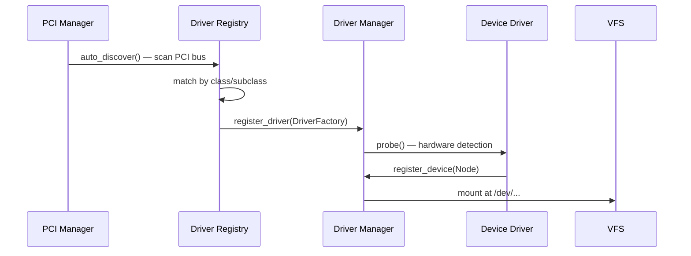
```mermaid
sequenceDiagram
    participant P as PCI Manager
    participant DR as Driver Registry
    participant DM as Driver Manager
    participant D as Device Driver

    P->>DR: auto_discover() — scan PCI bus
    DR->>DR: match by class/subclass
    DR->>DM: register_driver(DriverFactory)
    DM->>D: probe() — hardware detection
    D->>DM: register_device(Node)
    DM->>VFS: mount at /dev/...
```

Drivers register via class/subclass matching (Newbus-inspired). The driver registry maps PCI class codes to factory functions. During probe, the driver checks hardware presence and registers itself as a VFS node.

Key files: `Include/Kernel/Driver/Registry/driver_registry.h`, `Include/Kernel/Driver/Device/driver_manager.h`

## 4. Interrupt Lifecycle

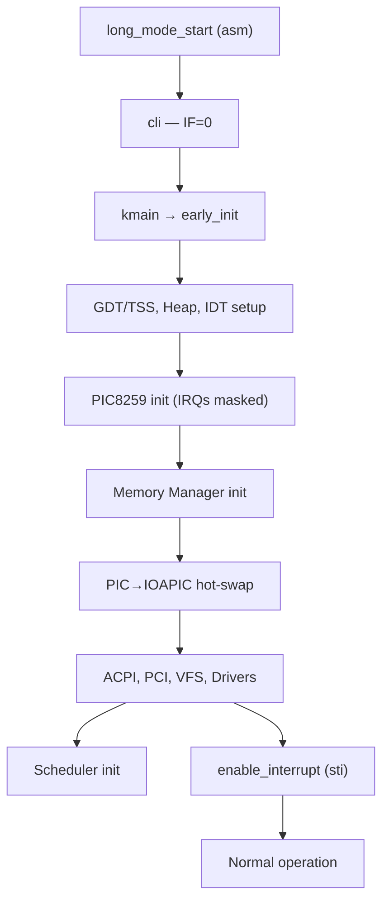
```mermaid
flowchart TD
    A["long_mode_start (asm)"] --> B["cli — IF=0"]
    B --> C["kmain → early_init"]
    C --> D["GDT/TSS, Heap, IDT setup"]
    D --> E["PIC8259 init (IRQs masked)"]
    E --> F["Memory Manager init"]
    F --> G["PIC→IOAPIC hot-swap"]
    G --> H["ACPI, PCI, VFS, Drivers"]
    H --> I["Scheduler init"]
    H --> J["enable_interrupt (sti)"]
    J --> K["Normal operation"]
```

Key rules:
- Interrupts DISABLED throughout early_init and most of init
- `enable_interrupt()` called ONLY at end of init, after scheduler
- All hardware access in dispatch path must be phase-guarded
- IST1 (double fault) uses dedicated 16 KiB stack

Key files: `Src/Kernel/Arch/x86_64/Init/early_init.cpp`, `Src/Kernel/Init/init.cpp`

## 5. Process Lifecycle

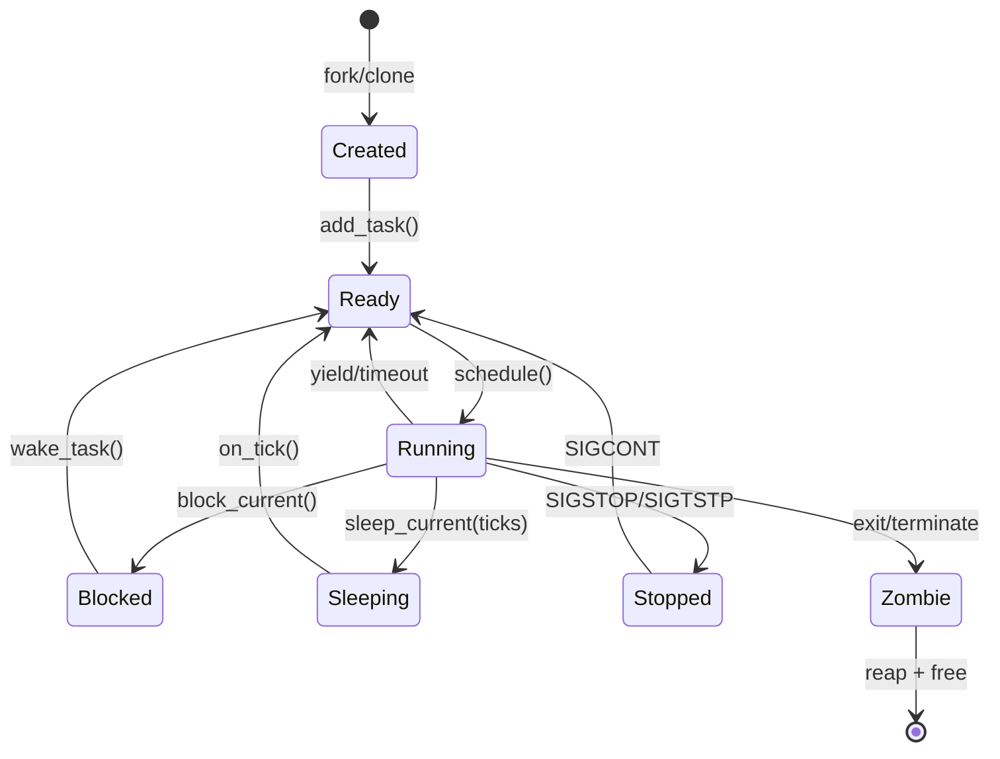
```mermaid
stateDiagram-v2
    [*] --> Created: fork/clone
    Created --> Ready: add_task()
    Ready --> Running: schedule()
    Running --> Ready: yield/timeout
    Running --> Blocked: block_current()
    Running --> Sleeping: sleep_current(ticks)
    Running --> Stopped: SIGSTOP/SIGTSTP
    Stopped --> Ready: SIGCONT
    Blocked --> Ready: wake_task()
    Sleeping --> Ready: on_tick()
    Running --> Zombie: exit/terminate
    Zombie --> [*]: reap + free
```

- `Task` struct contains all per-process state (registers, memory map, file table, signal mask)
- Zombie processes are reaped by parent via `wait4()`
- `SchedulerManager` maintains per-CPU current task pointers
- PID generation uses `__sync_fetch_and_add` for atomic increment

Key files: `Include/Kernel/Scheduler/Task/task.h`, `Include/Kernel/Scheduler/Core/scheduler.h`

## 6. Capability Lifecycle

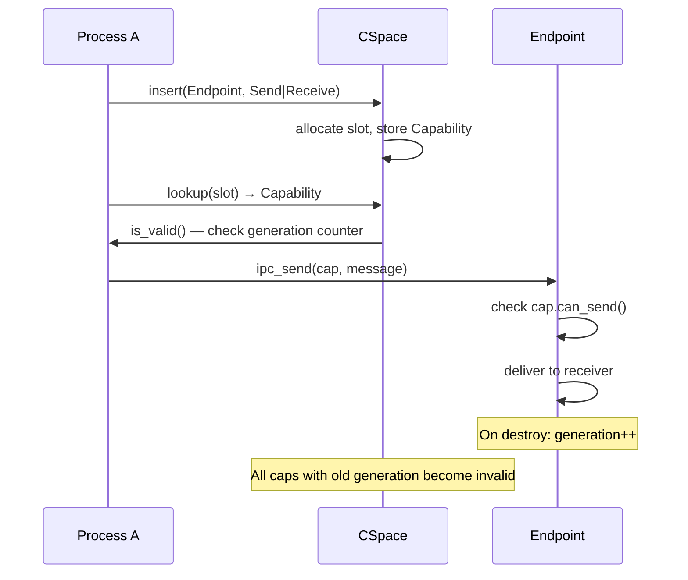
```mermaid
sequenceDiagram
    participant A as Process A
    participant CS as CSpace
    participant E as Endpoint

    A->>CS: insert(Endpoint, Send|Receive)
    CS->>CS: allocate slot, store Capability
    A->>CS: lookup(slot) → Capability
    CS->>A: is_valid() — check generation counter
    A->>E: ipc_send(cap, message)
    E->>E: check cap.can_send()
    E->>E: deliver to receiver
    Note over E: On destroy: generation++
    Note over CS: All caps with old generation become invalid
```

Key pattern: Capabilities carry a `revoke_counter` pointer and `issued_generation`. When the IPC object is destroyed, its generation increments, and all outstanding capabilities are automatically invalidated without needing to遍历 CSpace.

Key files: `Include/Kernel/Ipc/Capabilities/capability.h`, `Include/Kernel/Ipc/Capabilities/cspace.h`

## 7. Storage Stack Layering

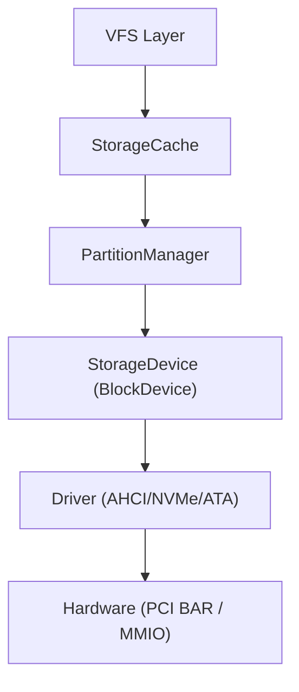
```mermaid
flowchart TD
    VFS["VFS Layer"]
    SC["StorageCache"]
    PM["PartitionManager"]
    SD["StorageDevice (BlockDevice)"]
    DRV["Driver (AHCI/NVMe/ATA)"]
    HW["Hardware (PCI BAR / MMIO)"]

    VFS --> SC
    SC --> PM
    PM --> SD
    SD --> DRV
    DRV --> HW
```

- **StorageCache**: Caches sector reads/writes to reduce hardware access
- **PartitionManager**: Scans MBR/GPT, creates child block devices per partition
- **StorageDevice**: Abstract block device interface (read_sectors/write_sectors)
- **Driver**: Concrete hardware driver (AHCI, NVMe, ATA PIO/DMA)

Key files: `Include/Kernel/Driver/Storage/Interfaces/storage_cache.h`, `Include/Kernel/Driver/Storage/Partitions/partition_manager.h`

## 8. ELF Loading Pipeline


```mermaid
flowchart LR
    A["ParserDomain<br/>ELF headers"] --> B["LoadDomain<br/>Load segments"]
    B --> C["MemoryDomain<br/>Map pages"]
    C --> D["DynamicDomain<br/>PLT/GOT relocs"]
    D --> E["InterpreterDomain<br/>Load ld.so"]
```

Each domain is a separate class in its own file. The `ElfLoader` coordinates them. Security features enforced during loading:
- **ASLR**: Random load base for ET_DYN executables
- **NX**: No-execute bit on non-executable segments
- **RELRO**: Partial/full relocation read-only
- **SMEP/SMAP**: Kernel-mode execution/access prevention (set in CR4)

Key files: `Include/Kernel/Loader/Domains/`, `Src/Kernel/Loader/`

## 9. Terminal and PTY System

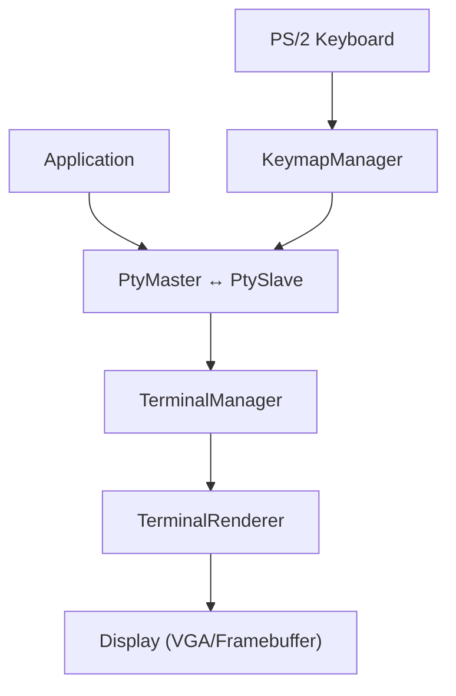
```mermaid
flowchart TD
    APP["Application"] --> PTY["PtyMaster ↔ PtySlave"]
    PTY --> TM["TerminalManager"]
    TM --> TR["TerminalRenderer"]
    TR --> DISP["Display (VGA/Framebuffer)"]
    KB["PS/2 Keyboard"] --> KM["KeymapManager"]
    KM --> PTY
```

- **PTY**: Pseudoterminal pair (master/slave) for shell sessions
- **TerminalManager**: Tracks active TTY, foreground process group
- **TerminalRenderer**: ANSI escape sequence rendering to display
- **KeymapManager**: Keyboard layout mapping (US-QWERTY default)

Key files: `Include/Kernel/Driver/Terminal/terminal_manager.h`, `Include/Kernel/Driver/Pty/pty_master.h`

## 10. Network Stack

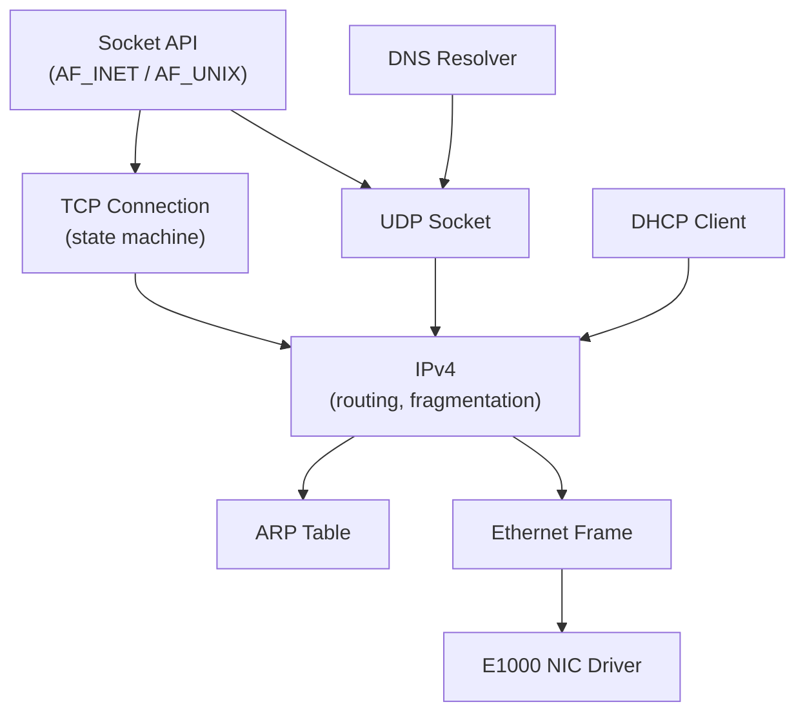
```mermaid
flowchart TD
    SOCK["Socket API<br/>(AF_INET / AF_UNIX)"]
    TCP["TCP Connection<br/>(state machine)"]
    UDP["UDP Socket"]
    IP["IPv4<br/>(routing, fragmentation)"]
    ARP["ARP Table"]
    ETH["Ethernet Frame"]
    NIC["E1000 NIC Driver"]
    DHCP["DHCP Client"]
    DNS["DNS Resolver"]

    SOCK --> TCP
    SOCK --> UDP
    TCP --> IP
    UDP --> IP
    IP --> ARP
    IP --> ETH
    ETH --> NIC
    DHCP --> IP
    DNS --> UDP
```

Full userspace-compatible TCP/IP stack:
- TCP: Three-way handshake, sliding window, state machine (SYN_SENT→ESTABLISHED→CLOSED)
- UDP: Connectionless datagrams
- ARP: Address resolution with cache
- ICMP: Ping/echo support
- DHCP: Automatic IP configuration
- DNS: Name resolution via UDP
- Routing table with longest-prefix matching

Key files: `Include/Kernel/Net/`, `Src/Kernel/Net/`

## 11. ProcFs Node Pattern

Each `/proc` entry is a separate class inheriting from `ProcFsNode`:

```
proc/
├── cpuinfo      → ProcCpuinfoNode
├── meminfo      → ProcMeminfoNode
├── uptime       → ProcUptimeNode
├── version      → ProcVersionNode
├── stat         → ProcStatNode
├── mounts       → ProcMountsNode
├── partitions   → ProcPartitionsNode
├── loadavg      → ProcLoadavgNode
├── self → /proc/[pid] (symlink)
├── [pid]/
│   ├── cmdline  → ProcPidCmdlineNode
│   ├── stat     → ProcPidStatNode
│   └── ... (directory node)
└── sys/
    └── kernel/  → ProcSysKernelNode
```

Each node implements `read()` returning formatted text on demand. No data is cached — it's generated fresh on each read (Linux-compatible behavior).

Key files: `Include/Kernel/Fs/Virtual/ProcFs/` (27 node headers)

## 12. Non-standard Syscalls

Beyond the Linux POSIX ABI, FKernel implements native syscalls for IPC, capability management, kernel event notification, and kernel TTY management:

| Syscall | Purpose |
|---------|---------|
| `SYS_IPC_SEND` | Send message via capability-guarded Endpoint |
| `SYS_IPC_RECEIVE` | Blocking receive on Endpoint |
| `SYS_IPC_CALL` | Send + receive rendezvous |
| `SYS_CAP_REVOKE` | Revoke all capabilities referencing a kernel object |
| `SYS_CAP_TRANSFER` | Transfer capability to another process's CSpace |
| `SYS_CAP_GRANT` | Grant capability access to another process |
| `SYS_KQUEUE` | Create kqueue event notification descriptor |
| `SYS_KEVENT` | Register/retrieve kqueue events |
| `SYS_TTY_CREATE` | Create kernel TTY device |
| `SYS_TTY_DELETE` | Delete kernel TTY device |
| `SYS_TTY_LIST` | List kernel TTY devices |

Key files: `Include/Kernel/Syscall/syscall.h`, `Src/Kernel/Syscall/`

## 13. Slab Cache Object Sizes

The SlabAllocator (`Src/Kernel/Memory/ObjectMemory/slab_allocator.cpp`) maintains 10 fixed-size caches:

| Cache Index | Object Size | Pages per Slab |
|------------:|------------:|---------------:|
| 0 | 16 bytes | 1 |
| 1 | 32 bytes | 1 |
| 2 | 64 bytes | 1 |
| 3 | 128 bytes | 1 |
| 4 | 256 bytes | 1 |
| 5 | 512 bytes | 1 |
| 6 | 1024 bytes | 1 |
| 7 | 2048 bytes | 1 |
| 8 | 4096 bytes | 1 |
| 9 | 8192 bytes | 2 |

Allocations are rounded up to the next cache size. Caches grow by adding new slabs (page(s) + free list header). The `CACHE_COUNT = 10` and `CACHE_SIZES` array are defined in `slab_allocator.cpp`.

## 14. Subsystem Completion Status

Estimated implementation maturity as of current codebase:

| Subsystem | Completion | Key Features |
|-----------|-----------:|--------------|
| Memory Management | 95% | Buddy + Zones + Slab, VMM 4-level paging, CoW fork, demand paging, MMIO remapping |
| Process/Scheduling | 90% | Priority queues, work stealing, SMP AP boot (INIT/STARTUP IPI), SCHED_FIFO/RR (32 levels), lazy FPU context switch |
| Filesystems | 95% | VFS (BSD dentry/vnode/mount), Ext2/3/4, FAT12/16/32, exFAT, ISO9660, MinixFS, 13 virtual FS types |
| Networking | 85% | TCP state machine + sliding window + exponential backoff retransmit, UDP, ARP, ICMP, DHCP, DNS, AF_UNIX/AF_INET |
| IPC/Capabilities | 80% | seL4-style CSpace, generation-based revocation, Endpoint rendezvous, Notification, SCM_RIGHTS/CREDENTIALS |
| ELF/Loader | 90% | ASLR (ChaCha20, 30-bit), RELRO, W^X, NX, SMEP/SMAP, TLS, dynamic linking |
| Drivers | 75% | ATA PIO/DMA, AHCI, NVMe, E1000, PS/2 keyboard, serial, PTY, USB (headers only) |
# FKernel — Kernel Architecture Overview

## Kernel Architecture

FKernel follows a **hybrid kernel architecture** with strict layer separation:

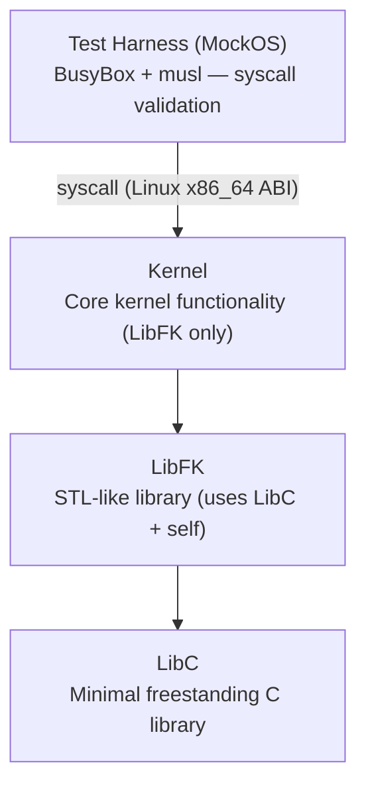
```mermaid
flowchart TD
    T["Test Harness (MockOS)<br/>BusyBox + musl — syscall validation"]
    K["Kernel<br/>Core kernel functionality (LibFK only)"]
    LFK["LibFK<br/>STL-like library (uses LibC + self)"]
    LC["LibC<br/>Minimal freestanding C library"]
    T -->|"syscall (Linux x86_64 ABI)"| K
    K --> LFK
    LFK --> LC
```

### Kernel Context


```mermaid
flowchart LR
    subgraph MockOS["MockOS (Test Harness)"]
        BB["BusyBox 1.36.1"]
        MUSL["musl 1.2.4"]
    end
    subgraph FKernel["FKernel Kernel"]
        MEM["Memory<br/>Buddy+Zones+VMM"]
        SCHED["Scheduler<br/>Priority+WorkStealing"]
        VFS["VFS<br/>Ext2/3/4, FAT, TmpFs, ..."]
        IPC["IPC<br/>seL4 Capabilities"]
        NET["Networking<br/>TCP/IP+E1000"]
        ELF["ELF Loader<br/>ASLR+TLS+RELRO"]
    end
    subgraph Hardware
        CPU["x86_64 CPU<br/>SMEP/SMAP/NX"]
        DISK["Storage<br/>ATA/AHCI/NVMe"]
        NIC["Network<br/>E1000"]
    end
    BB --> MUSL
    MUSL -->|"syscalls"| FKernel
    FKernel --> Hardware
```

## Architectural Identity

FKernel is a **hybrid kernel** — see [design-philosophy.md](design-philosophy.md) for full rationale:
- **ABI**: Linux x86_64 (syscall numbers, ELF loading)
- **Internals**: BSD-inspired (VFS, scheduler, process model, kqueue, driver framework)
- **Practices**: Rust-style errors, seL4 capabilities, Object Calisthenics

## Project Status

**Kernel Completion**: ~70% — POSIX-compatible x86_64 hobby kernel, boots to MockOS test harness with BusyBox 1.36.1 (~60 applets, ~40 fully functional)
**POSIX Compliance**: ~60% (206 implemented syscall handlers, ELF dynamic linking, real-time scheduling, major FS families)
**Immediate Priority**: Kernel test coverage (Phase 43 — 10 kernel test files so far, target 75% of critical paths)
**Long-term Goal**: Full POSIX compliance for a well-designed hobby kernel

> **Note**: FKernel is a **kernel**, not an operating system. MockOS is a test harness for validating POSIX syscall compatibility, not a userspace OS. BusyBox, musl, and OpenRC are validation tools, not the project's "userspace."

## Architectural Principles

### 1. Strict Layer Separation
- **LibC**: Minimal C standard library (strings, memory, types) — C17 freestanding
- **LibFK**: STL-like containers and utilities (uses only LibC) — C++20 freestanding
- **Kernel**: Core kernel functionality (uses only LibFK, NEVER LibC)

### 2. Domain-Based Organization
- Each directory represents a **cohesive domain**
- Files contain **exactly one** struct/class (SECRET RULE)
- Self-documenting hierarchy

### 3. Object Calisthenics
- Max 200 lines per class, 20 lines per method
- No `else` keyword, one dot per line
- Max 2 instance variables per class
- Rich domain models, no getters/setters

### 4. Hardware Compatibility
- ACPI-driven discovery (HPET, MCFG/ECAM, MADT)
- PCI driver matching (class/subclass based)
- Supports real hardware, not just QEMU — with caveats: ATA DMA, E1000, PS/2 verified on real hardware; NVMe (PRP2, interrupt-driven) and AHCI async DMA implemented; **VBE real-mode bridge is a placeholder** (framebuffer via Multiboot2 only). IOMMU VT-d parses DMAR but does not translate (3/3 methods `NotImplemented`).

## Key Domains

### Core Kernel Domains
- **Memory**: Physical (Buddy+Zones), Virtual (4-level paging), Object (Slab)
- **Process**: Task management, scheduling (priority + work stealing + real-time SCHED_FIFO/RR with 32 priority levels), SMP AP startup (INIT/STARTUP IPI), IPC, lazy FPU context switching
- **Hardware**: CPU, ACPI, PCI, APIC/IOAPIC, MSI-X
- **Filesystem**: VFS (BSD-style dentry/vnode/mount), Ext2/3/4, FAT12/16/32, exFAT, ISO9660, MinixFS, TmpFs, DevFs, ProcFs, DebugFs, PtsFs, SemFs, MqueueFs, ShmFs, PipeFs, Epoll, EventFd, SignalFd, TimerFd
- **Drivers**: Storage (ATA/AHCI/NVMe), Network (E1000), PS/2 mouse, Serial, PTY, USB (headers)
- **Syscalls**: POSIX-compatible Linux x86_64 interface (206 registered syscalls)

### Networking (Full Stack)
- **E1000**: MMIO, RX/TX rings, MAC
- **IPv4**: TCP, UDP, ARP, ICMP
- **Sockets**: AF_UNIX, AF_INET
- **Advanced**: TCP sliding window, retransmit with exponential backoff, routing table, DHCP client, DNS resolver

### Security & Isolation
- **Capabilities**: seL4-style fine-grained rights (send/receive/manage) via CSpace + generation-based revocation. Used by raw `sys_ipc_*` syscalls. Phase 27 implemented: POSIX FDs install as CSpace capabilities (`Task::add_file_descriptor` → `CSpace::install_fd`, per-FD rights derived from open flags; revoke on close/dup2).
- **IPC**: Endpoint (synchronous rendezvous), Notification (async bitmask + payload queue), SharedMemory (page-level). SCM_RIGHTS and SCM_CREDENTIALS via sendmsg/recvmsg. PipeNode, EventFd, Semaphore, Mqueue, Epoll/KQueue, SignalFd all use Notification embedded members.
- **Kernel Events**: EVFILT_PROC, EVFILT_SIGNAL, EVFILT_TIMER in kqueue.
- **ELF Security**: ASLR (ChaCha20 CSPRNG, 30-bit), NX, SMEP, SMAP, W^X enforcement, RELRO (all segments), TLS, dynamic linking.
- **Memory**: NX pages, user/kernel isolation, SMAP/SMEP enabled, CoW fork (`clone_table_recursive`), demand paging (`handle_demand_paging`).

> **Known security gaps**: KPTI (Meltdown mitigation) not implemented; IOMMU (VT-d) parses DMAR but does not translate DMA; ASLR entropy comes from the CSPRNG (seeded via RDTSC) — no RDRAND/other hardware entropy sources yet.

## Design Patterns

### Error Handling
- `Result<T, Error>` for fallible operations
- `Optional<T>` for nullable values
- `TRY` macro for error propagation
- No exceptions, no RTTI

### Memory Management
- RAII with smart pointers (`OwnPtr`, `RefPtr`)
- Stack allocation preferred
- No C++ standard library

### Hardware Interaction
- Strategy pattern for different hardware types
- Abstract interfaces with concrete implementations
- Volatile access for MMIO registers

## Technology Stack

- **Language**: C++20 (freestanding), C17 (LibC), NASM (assembly)
- **Build System**: XMake (Lua-based)
- **Compiler**: Clang/LLD with freestanding flags (`-ffreestanding`, `-fno-exceptions`, `-fno-rtti`)
- **Boot**: GRUB + Multiboot2
- **Testing**: Custom framework (coverage targets: LibC 90%, LibFK 85%)
- **Test Harness**: BusyBox 1.36.1 + musl 1.2.4 via MockOS ISO image

## Development Philosophy

1. **Extensible over Rewritable**: Build on existing abstractions
2. **Strategy Pattern Consistency**: Maintain architectural coherence
3. **Code Quality First**: Object Calisthenics non-negotiable
4. **Security by Design**: Capabilities, isolation, minimal trust
5. **Hardware Realism**: Support real hardware, not just emulation
6. **ABI Pragmatism**: Linux compatibility for test tooling, BSD design for kernel internals
# Unconventional Design Decisions

FKernel deliberately cherry-picks ideas from multiple traditions: Rust's error handling, seL4's capability model, Smalltalk's coding discipline, BSD's event mechanism, and domain-driven design. None of these are typical in a hybrid C++ kernel. This document explains the non-obvious choices and why they exist.

## 1. Rust-Style Error Handling in a C++ Kernel

FKernel uses `Result<T, Error>` and `TRY` macro instead of C++ exceptions (disabled via `-fno-exceptions`) or raw error codes. This is inspired by Rust's `Result<T, E>` type.

- `Result<T, E>` uses `fk::memory::Optional<T>` internally for the value
- `TRY(expression)` macro propagates errors via GCC statement expressions
- `Optional<T>` for nullable values
- No exceptions, no RTTI, no hidden control flow
- Eliminates unchecked return values and null dereferences

Example:
```cpp
Result<Page*, Error> allocate_page();
auto page = TRY(allocate_page());  // Propagates error on failure
```

Key files: `Include/LibFK/Core/result.h`, `Include/LibFK/Memory/optional.h`

## 2. seL4-Style Capability-Based IPC in a Hybrid Kernel

Most hybrid kernels use traditional Unix IPC (pipes, shared memory, signals). FKernel implements seL4-style capabilities with CSpace (capability space), endpoints, notifications, and rights-based access control.

- **Capability**: Typed (Endpoint/Notification/SharedMemory) + rights (Send/Receive/Manage)
- **CSpace**: Per-process capability space mapping slots to capabilities
- **Revocation**: Generation counter mechanism — when an IPC object is destroyed, its generation increments, invalidating all capabilities pointing to it
- **Rights decomposition**: `with_rights()` creates a derived capability with restricted rights

This provides fine-grained access control properties uncommon in traditional Unix IPC, even though it runs in a hybrid (not microkernel) architecture.

Key files: `Include/Kernel/Ipc/Capabilities/capability.h`, `Include/Kernel/Ipc/Capabilities/cspace.h`, `Include/Kernel/Ipc/Endpoints/endpoint.h`

## 3. Object Calisthenics Enforcement

The codebase follows strict Smalltalk-inspired coding rules — unconventional in kernel development:

- **No `else` keyword**: Early returns only
- **Max 2 instance variables per class**: Compose objects instead
- **Max 20 lines per method**: Extract helper methods
- **Max 200 lines per class**: Keep entities small
- **No getters/setters**: `is_running()` / `block()` not `state()` / `set_state()`
- **One dot per line**: `process->thread_name()` not `process->thread()->name()`
- **No abbreviations**: `ProcessManager` not `ProcMgr`
- **Wrap all primitives**: `ProcessId` not `int`, `BlockSize` not `u64`

This is non-negotiable and enforced by automated validators.

## 4. NVMe Hyper-Decomposition (One-Class-Per-File Extreme)

The NVMe driver is the most extreme application of the "one struct/class per file" rule: **21 header files and 14 source files** for a single storage controller.

Each concept gets its own class:
- `NvmeCommandIdManager` — tracks command IDs
- `NvmeInterruptLine` — manages a single interrupt line
- `NvmePendingOperations` — tracks in-flight operations
- `NvmeQueueSetup` — configures submission/completion queues
- `NvmeRegisterMapper` — maps MMIO registers
- `NvmeCompletionProcessor` — processes completion queue entries
- `NvmeInterruptConfigurator` — configures MSI-X
- `NvmeDeviceConfiguration` — stores device configuration
- `NvmeControllerState` — state machine

Each class is small (50-150 lines), single-responsibility, and independently testable.

Key files: `Include/Kernel/Driver/Storage/Controllers/Nvme/` (all 21 headers)

## 5. Allocator Backend Injection Pattern

LibFK (the STL-like library) must remain independent of the Kernel. But it needs dynamic memory allocation. The solution: a callback-based allocator backend.

```cpp
// Include/LibFK/Memory/Allocators/allocator_backend.h
struct AllocatorBackend {
  void *(*allocate)(size_t size);
  void *(*reallocate)(void *ptr, size_t size);
  void (*free)(void *ptr);
};
```

The Kernel sets the backend during early init:
```cpp
fk::memory::set_allocator_backend(&kernel_allocator);
```

LibFK containers and smart pointers call through the backend interface, never including Kernel headers. This maintains strict layer separation (LibC → LibFK → Kernel).

**Known violation**: `Src/LibFK/Memory/Allocators/heap_malloc.cpp` directly includes Kernel headers, breaking this pattern. Tracked in TODO.md.

## 6. Domain-Driven ELF Loader

Most ELF loaders are monolithic functions. FKernel decomposes loading into 5 domain objects:

- **ParserDomain**: Parses ELF headers, program headers, section headers
- **LoadDomain**: Loads segments into memory at correct virtual addresses
- **DynamicDomain**: Handles PT_DYNAMIC, PLT/GOT relocation
- **MemoryDomain**: Manages memory region allocation and permission bits
- **InterpreterDomain**: Loads dynamic linker (ld-linux.so equivalent)

Each domain is in its own file (one class per file), making the loader independently testable and extensible. The `ElfLoader` class coordinates them via a pipeline.

Key files: `Include/Kernel/Loader/Domains/`, `Src/Kernel/Loader/Domains/`

## 7. PIC→IOAPIC Hot-Swap with IRQ State Tracking

During boot, the interrupt controller switches from legacy 8259 PIC to IOAPIC. `HardwareInterruptManager` tracks unmasked IRQs in a `m_unmasked_irqs` bitmask. When the controller switches (after memory manager init), all previously unmasked IRQs are re-applied automatically.

This allows:
- Boot with PIC (no memory management needed)
- Seamless transition to IOAPIC (after paging enabled)
- No lost IRQ state during the transition

## 8. Phase-Guarded Interrupt Dispatch

The interrupt dispatch path runs on EVERY exception, including faults during early boot before hardware is initialized. Accessing APIC MMIO before it's mapped causes triple faults.

Solution: Every hardware access in the dispatch path is guarded:
```cpp
if (SchedulerManager::the().is_initialized() &&
    SchedulerManager::the().is_need_resched()) {
  SchedulerManager::the().schedule();
}
```

The same applies to `current_processor()` — falls back to `m_processors[0]` before APIC is ready.

## 9. kqueue Over epoll

Despite using Linux syscall ABI, the kernel implements BSD kqueue instead of Linux epoll. This provides:
- Unified event mechanism (files, signals, timers, processes in one call)
- Better scalability (O(1) notification vs O(n) polling)
- Simpler kernel implementation

The trade-off: musl/BusyBox expect epoll. A compatibility shim maps epoll syscalls to kqueue internally.

Key files: `Include/Kernel/Fs/Vfs/Events/kqueue.h`, `Src/Kernel/Fs/Vfs/Events/kqueue.cpp`

## 10. IntrusiveList for Zero-Overhead Scheduler Queues

Scheduler queues (wait, sleep, zombie) use `fk::containers::IntrusiveList` — a linked list where the next/prev pointers are embedded directly in the `Task` struct via pointer-to-member.

```cpp
IntrusiveList<Task, &Task::wait_node> m_wait_queue;
```

This means:
- No allocation needed for queue operations
- No separate node objects
- Cache-friendly traversal
- O(1) insert/remove

## 11. Type Wrappers for Preventing Accidental Swaps

Every domain-specific integer is wrapped in a strong type:
- `ProcessId` (not `uint64_t`)
- `PhysicalAddress` / `VirtualAddress` (not `uintptr_t`)
- `SectorSize` / `SectorCount` (not `size_t`)
- `BuddyOrder` (not `uint8_t`)
- `FrameIndex` (not `uint64_t`)

These compile to zero overhead but prevent accidental type mixing at compile time.

Key files: `Include/LibFK/Types/` (11 type wrapper headers)

## 12. 4-Layer Logging Pipeline

The logging system has 4 distinct layers:

1. **klog/kwarn/kerror** (LibFK) — formatted log with level and prefix
2. **kprintf** (LibC) — vsprintf to 512-byte stack buffer
3. **libc_puts** (LibC) — hook-based dispatch with SpinlockIRQ protection
4. **kernel_puts_impl** (Kernel) — fan-out to 3 targets: Serial (COM1), Display (VGA/framebuffer), DebugFS (ring buffer)

Log targets are controlled by a bitmask and can be changed at runtime. This extreme decomposition allows:
- Serial-only logging during early boot
- Display logging after framebuffer init
- DebugFS ring buffer for dmesg
- SpinlockIRQ protection for concurrent output

## 13. Dual-Inheritance Storage Drivers

Storage controllers like NVMe and AHCI inherit from both `Driver` and `StorageDevice`:

```cpp
class NVMeController final : public Driver, public StorageDevice { ... };
```

This means a single object serves as both:
- A PCI-matched driver (probed via driver registry)
- A block device (registered in VFS)

The alternative (separate driver and device objects) would require indirection and lifetime management complexity.

## 14. Syscall Organization by Domain

Rather than one monolithic syscall dispatch file, each syscall family lives in its own subdirectory:

| Directory | Count | Examples |
|-----------|-------|---------|
| FileSystem/ | 52 | open, read, write, mount, epoll, kqueue |
| Process/ | 35 | fork, execve, clone, wait4, setpgid |
| Networking/ | 16 | socket, bind, connect, sendmsg |
| Memory/ | 6 | mmap, mprotect, brk |
| Time/ | 7 | clock_gettime, nanosleep |
| Signals/ | 5 | tgkill, sigaltstack |
| Posix/ | 3 | futex, openpty |
| System/ | 4 | uname, reboot, getrandom |
| Ipc/ | 4 | ipc_call, ipc_send |
| Terminal/ | 3 | tty_create, tty_list |

Each file is self-contained with a single handler function.

## 15. Dual C/C++ in LibC

LibC is predominantly `.c` files but has one `.cpp` file: `Src/LibC/stdio/_impl/libc_putc.cpp`. This file bridges LibC output to LibFK's logging system. It's a deliberate exception to the "LibC is pure C" rule, allowed because it's the only way to route printf output without duplicating the logging infrastructure.

Similarly, `Src/Kernel/Io/kernel_puts.cpp` and `Src/Kernel/Arch/x86_64/Panic/panic.cpp` are the only two Kernel files allowed to include LibC directly.
# Development Workflow Guide

## Quick Start

1. **Read AI Memory**: Always check `.ai-docs/` for current state
2. **Understand Domain**: Identify which domain you're working in
3. **Follow SECRET RULE**: One struct/class per file
4. **Object Calisthenics**: Follow all 9 rules strictly
5. **Test Everything**: Ensure coverage before commit

## Development Phases

### Phase 1: Understanding
```
1. Read .ai-docs/architectural-decisions/
2. Read domain-knowledge/[domain].md
3. Read development-patterns/
4. Understand current issues in TODO.md
```

### Phase 2: Implementation
```
1. Create/modify exactly ONE struct/class per file
2. Follow Object Calisthenics rules
3. Use Result<T, Error> for error handling
4. Add comprehensive documentation
5. Write corresponding tests
```

### Phase 3: Validation
```
1. Run: xmake build
2. Run: lua .gemini/fkernel_validator.lua
3. Run: xmake run Test (when fixed)
4. Update .ai-docs/ with changes
5. Create/update Docs/ if needed
```

## Domain-Based Development

### Understanding Domains
Each directory in `Src/` and `Include/` represents a domain:

```
Src/Kernel/
├── Memory/           # Memory management domain
├── Driver/           # Hardware drivers domain
├── Fs/              # Filesystem domain
├── Hardware/         # Hardware abstraction domain
├── Ipc/             # Inter-process communication domain
└── Scheduler/       # Process scheduling domain
```

### Working Within Domains
1. **Identify Domain**: Know which domain you're modifying
2. **Respect Boundaries**: Don't cross-contaminate domains
3. **Use Interfaces**: Follow domain interface patterns
4. **Document Decisions**: Update domain knowledge

## File Organization Rules

### The SECRET RULE
**Exactly ONE struct or class per file.**

### Naming Conventions
- **Directories**: PascalCase (domains)
- **Files**: snake_case (matches class name)
- **Classes**: PascalCase matching file name

### Examples
```
Include/Kernel/Driver/Storage/Controllers/
├── Ata/
│   ├── ata_controller.h     // class AtaController
│   ├── ata_device.h         // class AtaDevice
│   └── pio_strategy.h       // class PioStrategy
└── Ahci/
    ├── ahci_controller.h    // class AhciController
    └── ahci_port.h          // class AhciPort
```

## Object Calisthenics Quick Reference

### The 9 Rules
1. **One indentation level** per method
2. **No `else` keyword** - use early returns
3. **Wrap primitives** - create type-safe wrappers
4. **First-class collections** - encapsulate data structures
5. **One dot per line** - follow Law of Demeter
6. **No abbreviations** - use descriptive names
7. **Keep entities small** - ≤200 lines/class, ≤20 lines/method
8. **Max 2 instance variables** - prefer composition
9. **No getters/setters** - use rich domain methods

### Error Handling Pattern
```cpp
auto result = some_operation();
if (result.is_error())
    return result.error();

auto value = result.value();
// Continue with value
```

## Testing Requirements

### Coverage Targets
- **LibC**: 90% coverage required
- **LibFK**: 85% coverage required  
- **Kernel**: 0% coverage today — Phase 43 target: 75%+ for critical paths

### Test Structure
```
tests/
├── LibC/
│   ├── test_string_memory.cpp
│   └── test_stdio_comprehensive.cpp
├── LibFK/
│   ├── test_containers.cpp
│   └── test_memory.cpp
└── Kernel/
    ├── test_memory_manager.cpp
    └── test_scheduler.cpp
```

## Code Review Process

### Before Commit
1. **Validator Pass**: `lua .gemini/fkernel_validator.lua`
2. **Build Success**: `xmake build`
3. **Tests Pass**: `xmake run Test` (when fixed)
4. **Documentation Updated**: Both `.ai-docs/` and `Docs/`

### Review Checklist
- [ ] One struct/class per file
- [ ] Object Calisthenics compliance
- [ ] Proper error handling
- [ ] Comprehensive documentation
- [ ] Tests written and passing
- [ ] Domain boundaries respected

## Common Pitfalls

### ❌ Don't Do This
```cpp
// Multiple classes in one file
class Controller { /* ... */ };
class Device { /* ... */ };

// Using else keyword
if (condition) {
    do_something();
} else {
    do_other();
}

// Method chaining
auto value = obj.get_manager().get_device().get_status();
```

### ✅ Do This Instead
```cpp
// Separate files
// controller.h
class Controller { /* ... */ };

// device.h  
class Device { /* ... */ };

// Early returns instead of else
if (condition) {
    do_something();
    return;
}
do_other();

// Delegation instead of chaining
auto value = obj.device_status();
```

## Getting Help

1. **Read Memory**: Check `.ai-docs/` first
2. **Check Patterns**: Look in `development-patterns/`
3. **Domain Knowledge**: Read specific domain docs
4. **Architecture**: Review system architecture guides
5. **Ask**: Use question tool for clarification

---

This workflow ensures **consistent, maintainable, and high-quality** contributions to FKernel.# Getting Started with FKernel Development

## Environment Setup
To develop for FKernel, you need:
- `xmake` (Build system)
- `nasm` (Assembler)
- `llvm/lld` (Linker and compiler)
- `qemu-system-x86_64` (Emulator)
- `xorriso` and `grub-mkrescue` (ISO creation)

## Build and Run
```bash
xmake build FKernel
xmake run FKernel
```

## Object Calisthenics
We enforce strict coding rules:
1. One level of indentation per method.
2. Don't use the `ELSE` keyword.
3. Wrap all primitives and strings.
4. First class collections.
5. One dot per line.
6. Don't abbreviate.
7. Keep all entities small (Classes < 200 lines).
8. No classes with more than two instance variables.
9. No getters/setters/properties.
# Developing Updates for FKernel

## Adding a New Subsystem
1. Create the header in `Include/Kernel/SubsystemName/`.
2. Implement the logic in `Src/Kernel/SubsystemName/`.
3. Add the directory to `kernel_non_architecture_related` in `xmake.lua`.
4. Initialize the subsystem in `Src/Kernel/Init/init.cpp`.

## Adding a System Call
1. Add the number to `Include/LibFK/Syscalls/numbers.h`.
2. Implement the handler in `Src/Kernel/Syscall/syscall_list/<Domain>/` — one `sys_*` handler per file, file name = handler name minus the `sys_` prefix (shared support files with zero handlers are allowed).
3. Register it in `Src/Kernel/Syscall/syscall.cpp`.
4. Run `xmake check-syscalls` to verify the one-handler-per-file rule.

## Modifying Architecture Specific Code
Architecture specific code resides in `Src/Kernel/Arch/x86_64/`. When updating these:
- Maintain SystemV ABI compatibility.
- Ensure any assembly changes are matched with C++ declarations.
- Update documentation in `Docs/Architecture/` if changes affect the memory layout or task switching.

## Testing Against Validation Tooling (BusyBox, musl)
To validate syscall compatibility:
1.  **Toolchain**: Use scripts in `Toolchain/` to download and patch projects.
2.  **LibC**: Musl is the preferred validation library. Patch it to use FKernel's `syscall` interface.
3.  **BusyBox**: Provides `ash` and standard tools (`ls`, `cat`, `mkdir`). Compiled statically against Musl for MockOS test ISO.
# Driver Framework

## Overview

FKernel's driver framework is inspired by **FreeBSD's Newbus** -- drivers register for device classes, and the PCI subsystem matches devices to drivers automatically. The framework supports storage, network, input, and terminal devices.

## Architecture

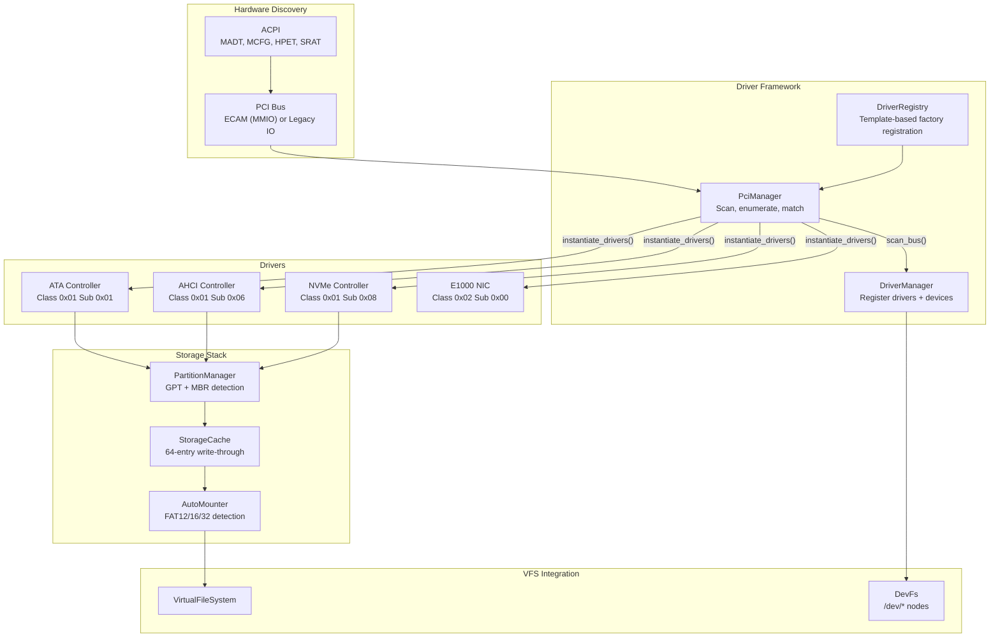
```mermaid
flowchart TD
    subgraph "Hardware Discovery"
        ACPI["ACPI<br/>MADT, MCFG, HPET, SRAT"]
        PCI_BUS["PCI Bus<br/>ECAM (MMIO) or Legacy IO"]
    end
    subgraph "Driver Framework"
        DRM["DriverManager<br/>Register drivers + devices"]
        DR["DriverRegistry<br/>Template-based factory registration"]
        PCI_MGR["PciManager<br/>Scan, enumerate, match"]
    end
    subgraph "Drivers"
        ATA["ATA Controller<br/>Class 0x01 Sub 0x01"]
        AHCI["AHCI Controller<br/>Class 0x01 Sub 0x06"]
        NVME["NVMe Controller<br/>Class 0x01 Sub 0x08"]
        E1K["E1000 NIC<br/>Class 0x02 Sub 0x00"]
    end
    subgraph "Storage Stack"
        PART["PartitionManager<br/>GPT + MBR detection"]
        CACHE["StorageCache<br/>64-entry write-through"]
        AUTO["AutoMounter<br/>FAT12/16/32 detection"]
    end
    subgraph "VFS Integration"
        VFS["VirtualFileSystem"]
        DEVFS["DevFs<br/>/dev/* nodes"]
    end

    ACPI --> PCI_BUS
    PCI_BUS --> PCI_MGR
    PCI_MGR -->|"scan_bus()"| DRM
    DR --> PCI_MGR
    PCI_MGR -->|"instantiate_drivers()"| ATA
    PCI_MGR -->|"instantiate_drivers()"| AHCI
    PCI_MGR -->|"instantiate_drivers()"| NVME
    PCI_MGR -->|"instantiate_drivers()"| E1K
    ATA --> PART
    AHCI --> PART
    NVME --> PART
    PART --> CACHE
    CACHE --> AUTO
    AUTO --> VFS
    DRM --> DEVFS
```

## PCI Driver Matching (Newbus-inspired)

### Registration Flow

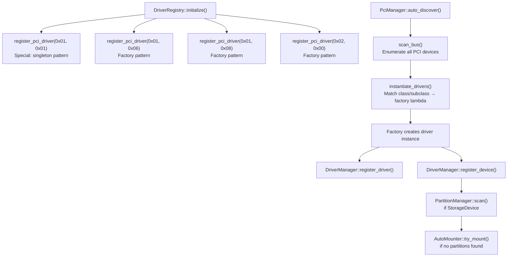
```mermaid
flowchart TD
    INIT["DriverRegistry::initialize()"]
    REG_ATA["register_pci_driver<ATA>(0x01, 0x01)<br/>Special: singleton pattern"]
    REG_AHCI["register_pci_driver<AHCI>(0x01, 0x06)<br/>Factory pattern"]
    REG_NVME["register_pci_driver<NVMe>(0x01, 0x08)<br/>Factory pattern"]
    REG_E1K["register_pci_driver<E1000>(0x02, 0x00)<br/>Factory pattern"]
    DISCOVER["PciManager::auto_discover()"]
    SCAN["scan_bus()<br/>Enumerate all PCI devices"]
    MATCH["instantiate_drivers()<br/>Match class/subclass → factory lambda"]
    CREATE["Factory creates driver instance"]
    REG_DRV["DriverManager::register_driver()"]
    REG_DEV["DriverManager::register_device()"]
    PART_SCAN["PartitionManager::scan()<br/>if StorageDevice"]
    MOUNT["AutoMounter::try_mount()<br/>if no partitions found"]

    INIT --> REG_ATA
    INIT --> REG_AHCI
    INIT --> REG_NVME
    INIT --> REG_E1K
    DISCOVER --> SCAN --> MATCH --> CREATE
    CREATE --> REG_DRV
    CREATE --> REG_DEV
    REG_DEV --> PART_SCAN --> MOUNT
```

### Device Classes

| Class | Subclass | Driver | Pattern |
|-------|----------|--------|---------|
| 0x01 (Mass Storage) | 0x01 (IDE) | ATA Controller | Singleton |
| 0x01 (Mass Storage) | 0x06 (AHCI) | AHCI Controller | Factory |
| 0x01 (Mass Storage) | 0x08 (NVMe) | NVMe Controller | Factory |
| 0x02 (Network) | 0x00 (Ethernet) | E1000 | Factory |

### Driver Implementation Status

| Driver | Status | Notes |
|--------|--------|-------|
| ATA | ✅ | PIO and DMA modes (strategy pattern) |
| AHCI | ✅ | Full HBA, command lists, FIS, PRDT |
| NVMe | ✅ | Controller/Namespace/Queue/Command decomposition |
| E1000 | ✅ | Interrupt-driven, full duplex |
| HPET | ✅ | System timer from ACPI HPET table |
| PS/2 Keyboard | ✅ | IRQ1, scancode translation |
| PS/2 Mouse | ✅ | IRQ12, 3-byte packet decoding |
| VGA Text Mode | ✅ | 80x25, ANSI parser |
| Framebuffer | ✅ | ANSI parser |

## Storage Stack

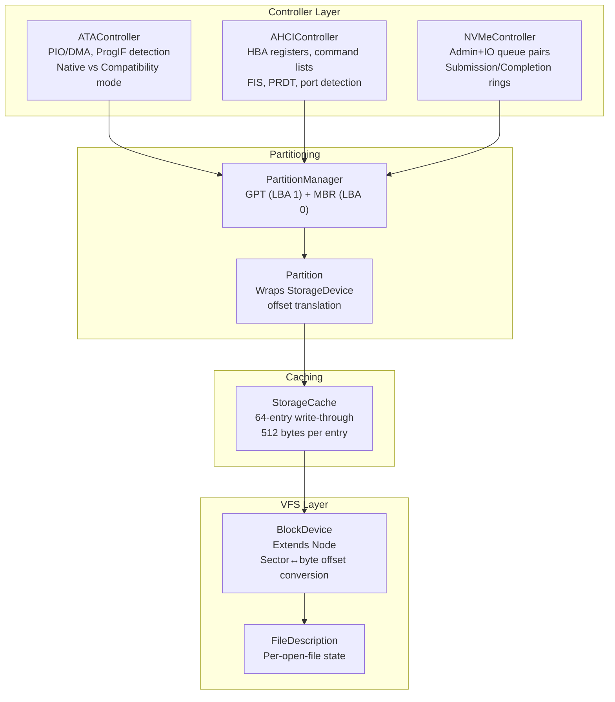
```mermaid
flowchart TD
    subgraph "Controller Layer"
        ATA_C["ATAController<br/>PIO/DMA, ProgIF detection<br/>Native vs Compatibility mode"]
        AHCI_C["AHCIController<br/>HBA registers, command lists<br/>FIS, PRDT, port detection"]
        NVME_C["NVMeController<br/>Admin+IO queue pairs<br/>Submission/Completion rings"]
    end
    subgraph "Partitioning"
        PM["PartitionManager<br/>GPT (LBA 1) + MBR (LBA 0)"]
        P["Partition<br/>Wraps StorageDevice<br/>offset translation"]
    end
    subgraph "Caching"
        SC["StorageCache<br/>64-entry write-through<br/>512 bytes per entry"]
    end
    subgraph "VFS Layer"
        BD["BlockDevice<br/>Extends Node<br/>Sector↔byte offset conversion"]
        FD["FileDescription<br/>Per-open-file state"]
    end

    ATA_C --> PM
    AHCI_C --> PM
    NVME_C --> PM
    PM --> P
    P --> SC
    SC --> BD
    BD --> FD
```

### ATA Strategy Pattern

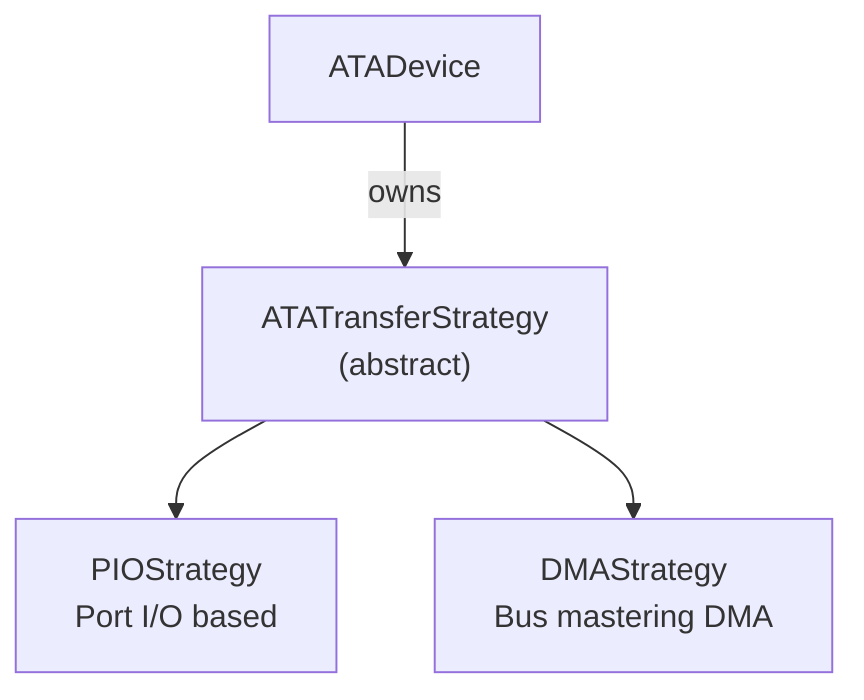
```mermaid
flowchart TD
    AD["ATADevice"]
    STRAT["ATATransferStrategy<br/>(abstract)"]
    PIO["PIOStrategy<br/>Port I/O based"]
    DMA["DMAStrategy<br/>Bus mastering DMA"]

    AD -->|"owns"| STRAT
    STRAT --> PIO
    STRAT --> DMA
```

### Data Flow (Read from Disk)

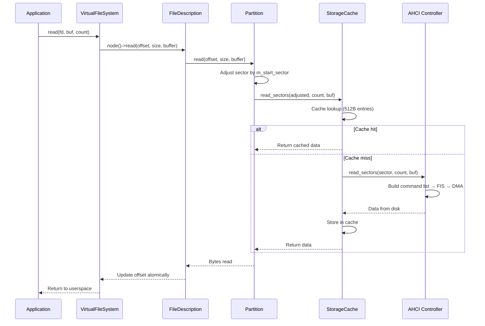
```mermaid
sequenceDiagram
    participant APP as Application
    participant VFS as VirtualFileSystem
    participant FD as FileDescription
    participant P as Partition
    participant SC as StorageCache
    participant HBA as AHCI Controller

    APP->>VFS: read(fd, buf, count)
    VFS->>FD: node()->read(offset, size, buffer)
    FD->>P: read(offset, size, buffer)
    P->>P: Adjust sector by m_start_sector
    P->>SC: read_sectors(adjusted, count, buf)
    SC->>SC: Cache lookup (512B entries)
    alt Cache hit
        SC-->>P: Return cached data
    else Cache miss
        SC->>HBA: read_sectors(sector, count, buf)
        HBA->>HBA: Build command list → FIS → DMA
        HBA-->>SC: Data from disk
        SC->>SC: Store in cache
        SC-->>P: Return data
    end
    P-->>FD: Bytes read
    FD-->>VFS: Update offset atomically
    VFS-->>APP: Return to userspace
```

### NVMe Controller Decomposition

The NVMe driver is decomposed into specialized classes (SECRET RULE: one class per file):

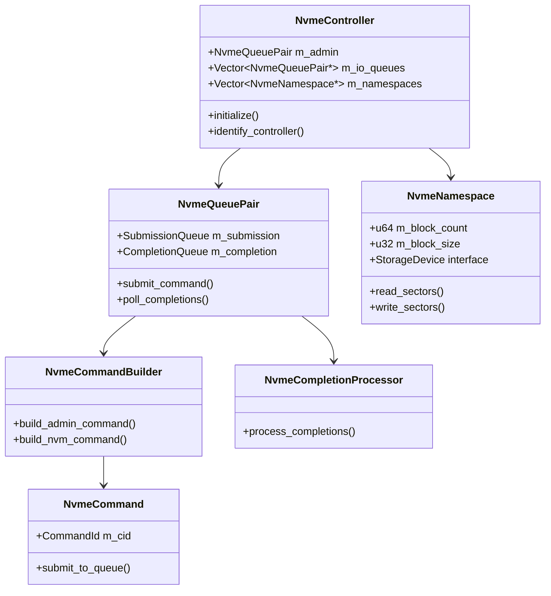
```mermaid
classDiagram
    class NvmeController {
        +NvmeQueuePair m_admin
        +Vector~NvmeQueuePair*~ m_io_queues
        +Vector~NvmeNamespace*~ m_namespaces
        +initialize()
        +identify_controller()
    }
    class NvmeQueuePair {
        +SubmissionQueue m_submission
        +CompletionQueue m_completion
        +submit_command()
        +poll_completions()
    }
    class NvmeNamespace {
        +u64 m_block_count
        +u32 m_block_size
        +StorageDevice interface
        +read_sectors()
        +write_sectors()
    }
    class NvmeCommandBuilder {
        +build_admin_command()
        +build_nvm_command()
    }
    class NvmeCommand {
        +CommandId m_cid
        +submit_to_queue()
    }
    class NvmeCompletionProcessor {
        +process_completions()
    }
    NvmeController --> NvmeQueuePair
    NvmeController --> NvmeNamespace
    NvmeQueuePair --> NvmeCommandBuilder
    NvmeQueuePair --> NvmeCompletionProcessor
    NvmeCommandBuilder --> NvmeCommand
```

## Network Drivers

### E1000 (Intel Gigabit Ethernet)

- MMIO register access via BAR0
- RX/TX descriptor rings (128 entries each)
- MAC address from RAL/RAH registers (EEPROM)
- PCI bus mastering enabled for DMA
- Interrupt-driven TX/RX (full duplex)

## Input Drivers

| Device | Interface | Device Node | Notes |
|--------|-----------|-------------|-------|
| PS/2 Mouse | IRQ12 | `/dev/mouse` | 3-byte packet decoding |
| Serial Terminal | UART polling | `/dev/ttyS0` | Read via DR bit, write via THR |
| Keyboard | IRQ1 | (internal) | PS/2 scancode set |

## Terminal Drivers

### Pseudo-Terminal (PTY)

- `PtyMaster` / `PtySlave` / `PtyBuffer`
- `SYS_OPENPTY=503` syscall for userspace allocation
- `/dev/ptmx` pseudo-device
- Blocking reads via `Notification::wait()`

### VGATerminal

- Hardware VGA text mode (80x25)
- Terminal I/O control: TCGETS/TCSETS (echo, raw mode)
- Job control: TIOCGPGRP/TIOCSPGRP/TIOCSCTTY
- Foreground process group signal delivery (Ctrl+C/Z/\)
- Window size reporting (TIOCGWINSZ)

## USB Status (Phase 50) — Não implementado

USB existe **apenas como interface scaffolding** em `Include/Kernel/Driver/Usb/` — não há um único `.cpp` em `Src/Kernel/` (verificado 2026-08-04: `glob Src/**/*usb*` = 0 hits). Para o alvo "laptop moderno" (sem PS/2), teclado/mouse/storage USB ficam inoperantes — é o bloqueador #1 de hardware real.

| Header | Conteúdo | Status |
|--------|----------|--------|
| `usb_device.h` | `USBDevice` (address/port) — 19 linhas | Stub |
| `usb_host_controller.h` | `USBHostController` abstrato (initialize / enumerate_device / submit_transfer) | Interface apenas |
| `usb_transfer.h` | `USBTransfer` | Stub |
| `usb_transfer_direction.h` / `usb_transfer_type.h` | Enums | Definição |

Falta: xHCI (BAR MMIO + ring management), EHCI, HID (teclado/mouse), mass storage (BOT/UAS). Nenhuma classe PCI 0x0C registrada no `PciManager`.

## Hardware Discovery

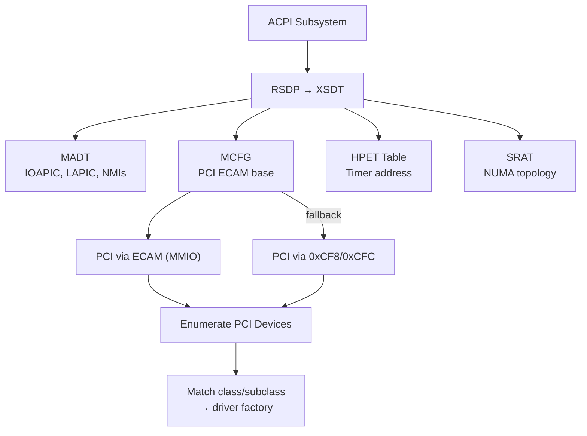
```mermaid
flowchart TD
    ACPI_INIT["ACPI Subsystem"]
    RSDP["RSDP → XSDT"]
    MADT["MADT<br/>IOAPIC, LAPIC, NMIs"]
    MCFG["MCFG<br/>PCI ECAM base"]
    HPET_TBL["HPET Table<br/>Timer address"]
    SRAT["SRAT<br/>NUMA topology"]

    ACPI_INIT --> RSDP
    RSDP --> MADT
    RSDP --> MCFG
    RSDP --> HPET_TBL
    RSDP --> SRAT

    MCFG --> PCI_ECAM["PCI via ECAM (MMIO)"]
    MCFG -->|"fallback"| PCI_LEGACY["PCI via 0xCF8/0xCFC"]

    PCI_ECAM --> DEVICES["Enumerate PCI Devices"]
    PCI_LEGACY --> DEVICES
    DEVICES --> DRIVER_MATCH["Match class/subclass<br/>→ driver factory"]
```

### ACPI Status

| Table | Status | Notes |
|-------|--------|-------|
| FADT | Partial | Complete ACPI 6.x fields pending |
| HPET | ✅ | Address from ACPI table (was hardcoded) |
| MCFG | ✅ | ECAM base, legacy fallback |
| MADT | ✅ | IOAPIC, LAPIC from MSR |
| SRAT | 60% | NUMA topology parsing |
| DSDT/SSDT | ❌ | AML interpreter pending |
| DMAR | ✅ | DMAR parsed; DMA translation not yet enabled |

### DMAR (DMA Remapping)

The DMAR (DMA Remapping) table provides IOMMU/VT-d information:

- **DRHD (DMA Remapping Hardware Definition)**: Identifies IOMMU units and their scope
- **RMRR (Reserved Memory Region Reporting)**: Reserved memory regions requiring identity mapping
- The IOMMU parses the DMAR table but **does not translate DMA** (translation methods are `NotImplemented`); no DMA remapping is enforced yet

## SMP Boot

The SMP boot path starts Application Processors (APs) via the INIT/STARTUP IPI sequence:

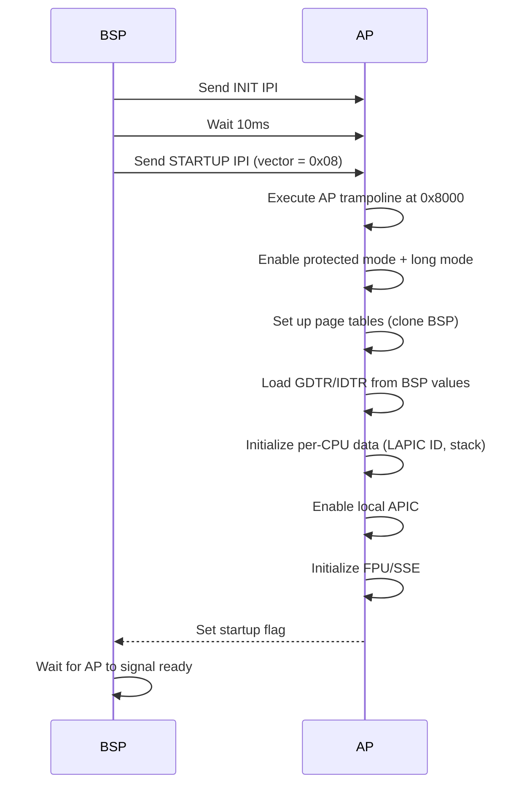
```mermaid
sequenceDiagram
    participant BSP as BSP
    participant AP as AP
    BSP->>AP: Send INIT IPI
    BSP->>AP: Wait 10ms
    BSP->>AP: Send STARTUP IPI (vector = 0x08)
    AP->>AP: Execute AP trampoline at 0x8000
    AP->>AP: Enable protected mode + long mode
    AP->>AP: Set up page tables (clone BSP)
    AP->>AP: Load GDTR/IDTR from BSP values
    AP->>AP: Initialize per-CPU data (LAPIC ID, stack)
    AP->>AP: Enable local APIC
    AP->>AP: Initialize FPU/SSE
    AP-->>BSP: Set startup flag
    BSP->>BSP: Wait for AP to signal ready
```

### Per-CPU Data

Each CPU has a dedicated per-CPU data structure accessible via `GS_BASE`:

- LAPIC ID
- Kernel stack pointer
- Process idling state
- Scheduler run queue
- Local timer state

## Key Design Decisions

- **Newbus-style PCI matching** over Linux's `struct pci_driver` — simpler, class-based
- **Strategy pattern**: Abstract driver interfaces with concrete implementations (ATA PIO vs DMA)
- **Dual-inheritance controllers**: AHCI/NVMe are both `Driver` and `StorageDevice`
- **Partition as StorageDevice**: Transparent offset, can be mounted directly in VFS
- **Interrupt-driven storage**: AHCI (`interrupt_driven_ahci.cpp`) e NVMe (`interrupt_driven_nvme.cpp`) com async read/write via ISR + completion processing; ATA permanece PIO/DMA síncrono
- **ACPI-driven discovery** over hardcoded addresses (progressive removal complete)
- **VFS integration**: All devices appear as files in `/dev`
# ELF Loader

## Overview

FKernel's ELF loader handles loading ELF64 executables (ET_EXEC and ET_DYN) with full support for dynamic linking (DT_NEEDED shared libraries, ld.so self-relocation), ASLR (ChaCha20PRNG, 30-bit entropy), W^X enforcement, full RELRO, TLS (Variant II), SMAP-safe user memory access, and cross-object symbol resolution.

## Loading Pipeline

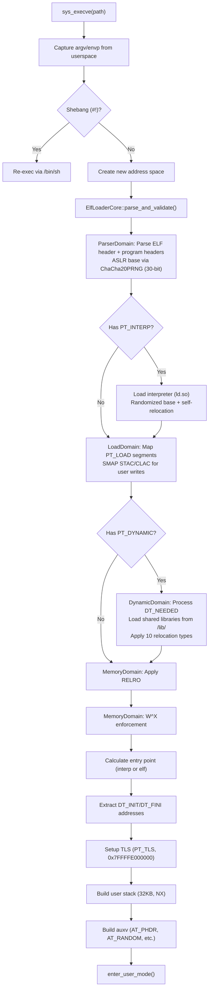
```mermaid
flowchart TD
    A["sys_execve(path)"] --> B["Capture argv/envp from userspace"]
    B --> C{"Shebang (#!)?"}
    C -->|Yes| D["Re-exec via /bin/sh"]
    C -->|No| E["Create new address space"]
    E --> F["ElfLoaderCore::parse_and_validate()"]
    F --> G["ParserDomain: Parse ELF header + program headers<br/>ASLR base via ChaCha20PRNG (30-bit)"]
    G --> H{"Has PT_INTERP?"}
    H -->|Yes| I["Load interpreter (ld.so)<br/>Randomized base + self-relocation"]
    H -->|No| J["LoadDomain: Map PT_LOAD segments<br/>SMAP STAC/CLAC for user writes"]
    I --> J
    J --> K{"Has PT_DYNAMIC?"}
    K -->|Yes| L["DynamicDomain: Process DT_NEEDED<br/>Load shared libraries from /lib/<br/>Apply 10 relocation types"]
    K -->|No| M["MemoryDomain: Apply RELRO"]
    L --> M
    M --> N["MemoryDomain: W^X enforcement"]
    N --> O["Calculate entry point (interp or elf)"]
    O --> P["Extract DT_INIT/DT_FINI addresses"]
    P --> Q["Setup TLS (PT_TLS, 0x7FFFFE000000)"]
    Q --> R["Build user stack (32KB, NX)"]
    R --> S["Build auxv (AT_PHDR, AT_RANDOM, etc.)"]
    S --> T["enter_user_mode()"]
```

## Domain Objects

```mermaid
classDiagram
    class ElfLoaderCore {
        -m_node Node
        -m_context LoadContext
        +parse_and_validate()
        +handle_interpreter()
        +load_segments()
        +process_dynamic()
        +calculate_entry_point()
        +apply_relro()
    }
    class ParserDomain {
        +validate_header()  checks EI_MAGIC, EI_CLASS, EI_DATA, e_machine
        +parse_program_headers()
        +calculate_load_base()  ChaCha20PRNG ASLR
    }
    class LoadDomain {
        +process_load_segments()  SMAP STAC/CLAC
        +copy_segment_data()
        +zero_fill_bss()
    }
    class DynamicDomain {
        +load_dependencies()  DT_NEEDED
        +load_shared_library()
        +apply_relocations()  DT_RELA + DT_JMPREL
        +resolve_symbol_cross()  global library scan
        +apply_single_rela()  10 types + SMAP
    }
    class MemoryDomain {
        +map_page()
        +apply_final_permissions()  W^X check
        +apply_relro()
    }
    class InterpreterDomain {
        +check_interpreter_needed()
        +extract_interpreter_path()
        +load_interpreter()  self-relocates PT_DYNAMIC
    }
    ElfLoaderCore --> ParserDomain
    ElfLoaderCore --> LoadDomain
    ElfLoaderCore --> DynamicDomain
    ElfLoaderCore --> MemoryDomain
    ElfLoaderCore --> InterpreterDomain
```

## Dynamic Linking

### DT_NEEDED Pipeline

1. `load_dependencies()` scans `DT_NEEDED` entries in dynamic segment, deduplicates via global `s_global_libraries`
2. `load_shared_library()` opens `/lib/<name>` via VFS, parses ELF header + PHDRs, loads PT_LOAD segments, extracts symtab/strtab, applies relocations
3. Libraries registered in global `LibraryContext` vector for cross-object symbol resolution

### Cross-Object Symbol Resolution

`resolve_symbol_cross()` — if local resolution fails for `SHN_UNDEF` symbols:
1. Tries matching `sym_idx` in each library's symtab
2. Falls back to linear name scan (up to 65536 entries per library)
3. Handles `SHN_COMMON` (returns 0 with debug log)

### Relocation Types

All 10 X86_64 relocation types implemented with SMAP STAC/CLAC:

| Type | Action |
|------|--------|
| `R_X86_64_NONE` | No-op |
| `R_X86_64_RELATIVE` | Base + addend |
| `R_X86_64_64` | Symbol value + addend |
| `R_X86_64_GLOB_DAT` | Global data symbol + addend |
| `R_X86_64_JUMP_SLOT` | PLT/GOT entry (eager binding) + addend |
| `R_X86_64_COPY` | Copy data from shared library (addend = size) |
| `R_X86_64_IRELATIVE` | Indirect function call (ifunc at base + addend) |
| `R_X86_64_TPOFF64` | TLS offset + symbol + addend |
| `R_X86_64_DTPMOD64` | TLS module ID (always 1) |
| `R_X86_64_DTPOFF64` | TLS offset within module + addend |

## Supported Features

### Program Headers Processed
| Type | Purpose |
|------|---------|
| `PT_LOAD` | Loadable segments (code, data, BSS) |
| `PT_DYNAMIC` | Dynamic linking information |
| `PT_INTERP` | Interpreter (dynamic linker) path |
| `PT_TLS` | Thread-local storage template |
| `PT_GNU_STACK` | Stack permissions (NX enforcement) |
| `PT_GNU_RELRO` | Read-only after relocation — all segments, start rounded UP, interpreter RELRO included |
| `PT_PHDR` | Program header table location (for auxv) |

### Security Features
- **ASLR**: ChaCha20PRNG with 30-bit entropy. Main executable: `[0x10000000, 0x70000000)`. ld.so base independently randomized.
- **NX**: ExecuteDisable on non-executable segments. PT_GNU_STACK enforces NX stack by default.
- **W^X**: `apply_final_permissions()` rejects segments with both Writable and !ExecuteDisable.
- **RELRO**: All PT_GNU_RELRO segments processed (no single-segment limit). Start rounded UP `(addr + 0xFFF) & ~0xFFF`. Interpreter RELRO applied.
- **SMAP**: `arch_smap_begin()`/`arch_smap_end()` in all user-memory write paths: `copy_segment_data`, `zero_fill_bss`, `apply_single_rela` targets, `map_single_page` zero-fill.
- **SMEP**: CR4.SMEP enabled — kernel cannot execute user pages.
- **Architecture check**: `e_machine` must be `EM_X86_64`.
- **Bounds checking**: `e_phoff`, `e_phnum`, and per-segment `p_offset + p_filesz` validated against file size.
- **Endianness checking**: `EI_DATA` verified to match host endianness (little-endian).

### Security Features Matrix

| Feature | Status | Details |
|---------|--------|---------|
| W^X | ✅ | Rejects Writable+Executable segments at load |
| RELRO | ✅ | All PT_GNU_RELRO segments, correct alignment |
| ASLR | ✅ | ChaCha20PRNG, 30-bit entropy, randomized ld.so |
| NX | ✅ | PT_GNU_STACK, non-exec segments |
| SMAP | ✅ | STAC/CLAC in all user-memory paths |
| SMEP | ✅ | CR4.SMEP enabled |
| kASLR | 🔄 Planned | Kernel image randomization |
| CET Shadow Stack | 🔄 Planned | Intel CET hardware shadow stack |
| Retpoline Injection | 🔄 Planned | Spectre v2 mitigation |

### TLS (Variant II)
- TLS block allocated at `0x7FFFFE000000`
- Self-referencing thread pointer (points to TLS block)
- FS_BASE set via `arch_prctl`
- Full relocation types for TLS: `R_X86_64_TPOFF64`, `R_X86_64_DTPMOD64`, `R_X86_64_DTPOFF64`

## Key Files

| File | Lines | Purpose |
|------|-------|---------|
| `elf_loader.cpp` | ~17 | Entry point, delegates to ElfLoaderCore |
| `elf_loader_core.cpp` | ~260 | Pipeline orchestration, RELRO, entry point, init/fini extraction |
| `parser_domain.cpp` | ~92 | ELF header validation, ASLR base via ChaCha20PRNG |
| `load_domain.cpp` | ~100 | PT_LOAD segment mapping with SMAP |
| `dynamic_domain.cpp` | ~367 | DT_NEEDED loading, all 10 relocations, cross-object symbols |
| `memory_domain.cpp` | ~106 | Page allocation, W^X enforcement, final permissions |
| `interpreter_domain.cpp` | ~94 | Dynamic linker loading, self-relocation |

## Notable Design Decisions

- **Domain-driven design**: Each concern isolated in its own class, independently testable
- **Global library registry**: `s_global_libraries` vector for cross-object symbol resolution
- **SMAP everywhere**: Every user-memory write uses `arch_smap_begin()`/`arch_smap_end()`
- **ChaCha20PRNG ASLR**: 30-bit entropy with hardware CSPRNG seed (was 16-bit deterministic)
- **All RELRO segments**: No break-after-first; start correctly rounded UP
- **W^X enforcement**: Rejects Writable+Executable segments at load time
- **Init/fini extraction**: DT_INIT, DT_FINI, DT_INIT_ARRAY, DT_FINI_ARRAY addresses in load result

## Current Status

~90% complete. ET_EXEC and ET_DYN loading fully functional. Dynamic linking with DT_NEEDED + shared library loading + ld.so self-relocation. All 10 X86_64 relocation types. Cross-object symbol resolution via global library registry. ASLR with ChaCha20PRNG + 30-bit entropy + randomized ld.so base. Full RELRO (all segments, correct alignment, interpreter RELRO). W^X enforcement. SMAP STAC/CLAC safety. TLS Variant II at 0x7FFFFE000000. Init/fini addresses extracted. Endianness checking (EI_DATA) implemented. Per-segment file-size bounds checking implemented. Remaining: symbol versioning (DT_VERSYM/DT_VERNEED macros defined, parsing not implemented). ET_REL not yet supported. Planned security features: kASLR, Intel CET shadow stack, retpoline injection.
# IPC and Capabilities

## Overview

FKernel's IPC subsystem is inspired by **seL4's capability-based model**. Instead of traditional Unix IPC (pipes, signals, sockets), FKernel uses **capabilities** for fine-grained access control over communication channels.

## Architecture

```mermaid
flowchart TD
    subgraph "Process A"
        CSA["CSpace A"]
        CA1["Capability: Send+Receive"]
        CA2["Capability: Send only"]
        CSA --> CA1
        CSA --> CA2
    end
    subgraph "Kernel IPC Objects"
        EP["Endpoint<br/>Synchronous rendezvous"]
        NTF["Notification<br/>Async bitmask signal"]
        SHM["SharedMemory<br/>Page-level sharing"]
    end
    subgraph "Process B"
        CSB["CSpace B"]
        CB1["Capability: Receive"]
        CB2["Capability: Manage"]
        CSB --> CB1
        CSB --> CB2
    end
    CA1 -->|"bidirectional"| EP
    CA2 -->|"send only"| EP
    CB1 -->|"receive only"| EP
    CB2 -->|"manage/revoke"| EP
    NTF -.->|"pipe/kqueue signals"| EP
```

## Capability Model

### Core Concepts
- **Capability**: An unforgeable token granting access to a kernel object
- **CSpace**: Per-task capability table (slot array with free-list)
- **Rights**: Bitmask controlling allowed operations on a capability
- **Revocation**: Invalidation of capabilities via generation counter

### Rights

| Right | Permission |
|-------|-----------|
| `Send` | Send a message through this capability |
| `Receive` | Receive a message through this capability |
| `Manage` | Modify/move/revoke this capability |

### Capability Types

| Type | Kernel Object | Access |
|------|--------------|--------|
| `Endpoint` | Synchronous IPC channel | Send, Receive, Manage |
| `IRQ` | Interrupt line binding | Ack, Manage |
| `IO` | I/O port range | In, Out, Manage |
| `Memory` | Physical memory region | Map, Read, Write, Manage |
| `Node` | VFS filesystem node | Read, Write, Lookup, Manage |
| `Process` | Process handle | Kill, Signal, Manage |
| `Thread` | Thread handle | Suspend, Resume, SetPriority, Manage |
| `SharedMemory` | Shared memory region | Map, Read, Write, Manage |

### CSpace

- Array of capability slots per task
- Free-list for O(1) slot allocation
- Each slot holds: pointer to kernel object, rights mask, generation counter
- `cspace_insert()` copies a capability between CSpaces with rights masking

### Revocation Mechanism

```mermaid
flowchart LR
    EP["Endpoint<br/>m_generation = 3"]
    CAP1["Capability A<br/>issued_gen = 3"]
    CAP2["Capability B<br/>issued_gen = 2"]
    REV["sys_cap_revoke()"]
    REV -->|"m_generation++"| EP
    EP -->|"gen mismatch"| CAP1["Valid ✓"]
    EP -->|"gen mismatch"| CAP2["Invalid ✗"]
```

No need to search all process CSpaces — just increment the generation counter and capabilities become invalid on next use.

### Revocation Details

Revocation uses a **lazy** strategy: each Capability stores an `m_issued_generation` from the moment of its creation/transfer. The kernel object holds a `m_revoke_counter` (monotonically incrementing generation). On `revoke()`, the counter increments — all existing capabilities with a stale generation become invalid on next use without scanning CSpaces.

```cpp
struct Capability {
  CapabilityType m_type;
  Rights m_rights;
  uint64_t m_revoke_counter;   // matches object's counter at issuance
  uint64_t m_generation;       // CSpace slot generation for reuse
  KernelObject* m_object;
};

struct KernelObject {
  uint64_t m_revoke_counter;   // incremented on each revoke()
};
```

- `sys_cap_revoke(handle)`: increments `object->m_revoke_counter`, invalidates all copies
- `check_validity()`: compares `cap->m_revoke_counter == object->m_revoke_counter`
- No CSpace traversal required — O(1) per capability check

## IPC Primitives

### Migration from Port-Based IPC

Earlier FKernel versions used a **port** abstraction (similar to L4) for message passing. The current architecture migrates to **Endpoint** as the sole synchronous IPC primitive:

| Aspect | Old (Port) | Current (Endpoint) |
|--------|-----------|-------------------|
| Binding | Port needs explicit binding | Endpoint referenced via capability |
| Wait queues | Single shared queue | Separate `m_senders` / `m_receivers` |
| Reply routing | Port-based reply | Direct `m_call_sender` tracking |
| Capability transfer | Not supported | `send_cap()` / `recv_cap()` |
| Revocation | Port deletion | Generation counter (O(1)) |

### IPC Syscalls

| Syscall | Purpose |
|---------|---------|
| `sys_ipc_send(ep_handle, msg_info, args...)` | Send message via Endpoint capability |
| `sys_ipc_recv(ep_handle, msg_info)` | Receive message via Endpoint capability |
| `sys_ipc_send_cap(ep_handle, cap_handle)` | Transfer a capability through an Endpoint |
| `sys_ipc_recv_cap(ep_handle)` | Receive a capability through an Endpoint |
| `sys_ipc_call(ep_handle, msg_info, args...)` | Atomic send+recv (blocking RPC) |
| `sys_cap_grant(pid, local_handle, rights)` | Copy capability to another process's CSpace |
| `sys_cap_revoke(handle)` | Increment revoke counter on kernel object |

Total syscall count: **206**.

### Endpoint

- Bidirectional synchronous rendezvous channel
- Separate `m_senders` and `m_receivers` wait lists (both `IntrusiveList<Task>`)
- `send()`: blocks sender if no receiver waiting, otherwise delivers immediately
- `receive()`: blocks receiver if no sender waiting, otherwise delivers immediately
- Message passing via CPU registers (rdi, rsi, rdx, r10, r8, r9) — zero-copy for short messages

### MessageInfo

Packed into a single 64-bit register:

```
[Label (48 bits) | Length (12 bits) | Flags (4 bits)]
```

### Notification

- Non-blocking signaling mechanism using a 64-bit bitmask (`m_pending_bits`)
- `signal(bits)`: sets bits, wakes waiting task with accumulated bits
- `wait()`: returns pending bits immediately or blocks until signal
- `poll()`: non-blocking check, returns and clears pending bits
- Same generation-based revocation as Endpoint

### Signal Delivery

```mermaid
flowchart TD
    KILL["kill(target, signum)"]
    PENDING["Set pending bit on target"]
    WAKE{Target sleeping?}
    HANDLER{Has sigaction handler?}
    IGN{SIG_IGN?}
    DF{SIG_DFL?}
    TERM["Default: terminate"]
    STOP["SIGSTOP: stop task"]
    CONT["SIGCONT: resume task"]
    FRAME["Build KernelSignalFrame<br/>on user stack"]
    REDIR["Redirect to sa_handler<br/>via signal trampoline"]
    RET["sigreturn restores<br/>full register state"]

    KILL --> PENDING --> WAKE
    WAKE -->|Yes| HANDLER
    WAKE -->|No| HANDLER
    HANDLER --> IGN
    IGN -->|Yes| IGNORE["Ignore signal"]
    IGN -->|No| DF
    DF -->|Yes| TERM
    DF -->|Yes| STOP
    DF -->|Yes| CONT
    DF -->|No| FRAME --> REDIR
    REDIR --> RET
```

## IPC Flow

```mermaid
sequenceDiagram
    participant A as Process A
    participant EP as Endpoint
    participant B as Process B

    Note over A: sys_ipc_call(ep_handle, info)
    A->>EP: Lookup capability in CSpace<br/>Check Send right
    EP->>EP: No receiver waiting?
    EP->>A: Block sender (add to m_senders)

    Note over B: sys_ipc_receive(ep_handle)
    B->>EP: Lookup capability in CSpace<br/>Check Receive right
    EP->>EP: Sender A waiting!
    EP->>EP: deliver_message()<br/>Copy registers: rdi,rsi,rdx,r10,r8,r9
    EP->>B: Wake receiver with A's message
    EP->>A: Wake sender, resume A

    Note over A: A resumes with reply in rax
```

## Integration with Other Subsystems

```mermaid
flowchart TD
    IPC["IPC Core<br/>Endpoint, Notification"]
    PIPE["PipeNode<br/>Uses Notification for<br/>DATA_AVAILABLE / SPACE_AVAILABLE"]
    KQ["KQueue<br/>BSD event polling<br/>5 EVFILT types"]
    EPOLL["Epoll<br/>Linux-compatible<br/>EPOLLIN/OUT/ET"]
    PTY["PTY Master/Slave<br/>Blocking reads via<br/>Notification::wait()"]
    SIG["Unix Signals<br/>KernelSignalFrame<br/>sa_restorer trampoline"]
    PIPE --> IPC
    KQ --> IPC
    EPOLL --> IPC
    PTY --> IPC
    SIG --> IPC
```

### Pipes
- `PipeNode` uses separate `Notification` objects for DATA_AVAILABLE and SPACE_AVAILABLE
- Reader blocks via `Notification::wait()`, writer signals via `Notification::signal()`

### KQueue
- BSD-style event notification with `EVFILT_READ`, `EVFILT_WRITE`, `EVFILT_PROC`, `EVFILT_SIGNAL`, `EVFILT_TIMER`
- Integrates with scheduler for proper blocking with timeout
- Used by `select()`/`poll()` implementations (epoll available as a separate VFS node)

### PTY
- `PtyMaster`/`PtySlave` block reader via `Notification::wait()`
- Writer signals reader via `Notification::signal()`

## Key Design Decisions

- **seL4-style capabilities** over traditional Unix permission model
- **Revocation via generation counter** (not reference counting) — O(1) revocation
- **Separate send/receive wait nodes** to prevent corruption
- **Register-passing IPC** — short messages in CPU registers, no memory copies
- **OS-level integration**: signals, pipes, kqueue all use underlying IPC primitives

### Userspace Drivers and Filesystems (Architectural Support)

The Capability model enables userspace drivers and filesystems natively:

1. **Userspace Drivers**: A driver process holds `IO` capabilities for port ranges and `IRQ` capabilities for interrupt lines. Interrupt delivery routes through Endpoint IPC (the IRQ capability is bound to an Endpoint, and the handler's `recv()` blocks waiting for interrupt notifications).

2. **Userspace Filesystems**: A filesystem process holds `Node` capabilities. The VFS layer can delegate `read()`/`write()`/`lookup()` operations via Endpoint IPC to a userspace server, analogous to FUSE but built directly on the capability primitives.

**Status**: Architectural foundation is complete (CSpace, Endpoint IPC, capability types). **Implementation: pending** — no userspace drivers or filesystem servers are active in the current boot flow.

## Enhanced IPC Primitives (2026-07-26)

### Notification::wait_timeout()

Blocks with a deadline. Returns delivered bits or 0 on timeout. Uses `sleep_current(ticks)` under the hood, allowing the scheduler timer to wake the task. The caller checks list membership after waking to distinguish timeout from signal.

```cpp
uint64_t timeout_ticks = freq * timeout_ms / 1000;
uint64_t result = notif.wait_timeout(timeout_ticks);
if (result == 0) // timeout
if (result > 0)  // signal received, result = accumulated bits
```

Used by: pipes O_NONBLOCK, eventfd O_NONBLOCK, epoll_wait with timeout, futex FUTEX_WAIT with timeout.

### Notification::signal_with_payload()

Enqueues a `NotificationPayload` (64-byte data + bitmask) alongside the signal. Up to 16 payloads buffered in a circular queue. Wakeup delivers accumulated bits; payload is accessible on next `poll()`.

```cpp
siginfo_t si = {.si_signo = SIGCHLD, .si_pid = child_pid, ...};
notif.signal_with_payload(1 << SIGCHLD, &si, sizeof(si));
```

Used by: signal delivery (siginfo_t → SA_SIGINFO handlers), eventfd value preservation.

### Endpoint::call()

Atomic send+receive: sends a message and immediately waits for a reply without allowing another task to intercept. The kernel marks the caller as `m_call_sender` so the reply is routed directly back.

```cpp
auto result = endpoint.call(MessageInfo::create(label, len, flags));
// result contains the reply MessageInfo
```

### Endpoint::send_timeout() / receive_timeout()

Time-bounded variants. Return `Error::Timeout` on expiry. Use same `sleep_current()` mechanism as `Notification::wait_timeout()`.

### SharedMemory

Page-by-page physical memory sharing. Allocates individual 4KB pages via `PhysicalMemoryManager::alloc_page()`. Maps into multiple tasks' address spaces via `VirtualMemoryManager::map_page()`.

```cpp
auto* shm = SharedMemory::create(4096);  // 1 page
shm->map_into(task_a, 0x700000000000, PageFlags::Present | PageFlags::Writable | PageFlags::User);
shm->map_into(task_b, 0x700000000000, PageFlags::Present | PageFlags::User);
shm->revoke();  // invalidates all capability holders
```

Integrated via `ShmNode` VFS node at `/dev/shm/`. `mmap(MAP_SHARED, fd)` calls `shm->map_into()`.

## POSIX over IPC Architecture

All POSIX IPC mechanisms are implemented as VFS nodes backed by native IPC primitives:

```mermaid
flowchart TD
    subgraph "POSIX API"
        PIPE["pipe()/mkfifo()"]
        EVENT["eventfd()"]
        SEM["sem_open/wait/post"]
        MQ["mq_open/send/receive"]
        SHM["shm_open/mmap"]
        SIG["kill/sigaction"]
        FUTEX["futex()"]
        EPOLL["epoll_wait()"]
    end
    subgraph "VFS Nodes"
        PN["PipeNode<br/>ring buffer 64KB"]
        EN["EventFdNode<br/>uint64 counter"]
        SN["SemNode<br/>count + max"]
        MQN["MqueueNode<br/>priority queue"]
        SHMN["ShmNode<br/>SharedMemory ptr"]
        EP["EpollNode<br/>fd list"]
    end
    subgraph "IPC Substrate"
        NTF["Notification<br/>wait/wait_timeout<br/>signal_with_payload"]
        EPT["Endpoint<br/>send/receive/call<br/>register-based"]
        SHM["SharedMemory<br/>page-by-page<br/>map_into/unmap_from"]
    end
    PIPE --> PN --> NTF
    EVENT --> EN --> NTF
    SEM --> SN --> NTF
    MQ --> MQN --> NTF
    SHM --> SHMN --> SHM
    SIG --> NTF
    FUTEX --> NTF
    EPOLL --> EP --> NTF
```

### Namespace Layout

```
/dev/
├── pts/       # PTY slaves (existing)
├── sem/       # POSIX named semaphores (SemDirNode → SemNode)
├── mqueue/    # POSIX message queues (MqueueDirNode → MqueueNode)
└── shm/       # POSIX shared memory (ShmDirNode → ShmNode)
```

### Capability Transfer

Runtime capability sharing between processes (see IPC syscall table above):

- `sys_cap_grant(pid, handle, rights_mask)` — copies capability from current CSpace to target
- `sys_ipc_send_cap(ep_handle, cap_handle)` — transfers a capability through an Endpoint
- `sys_ipc_recv_cap(ep_handle)` — receives a capability through an Endpoint

All transfer operations require `Manage` rights on the source capability.
# Kernel Logging Architecture

## Overview

FKernel uses a structured logging pipeline that routes messages to multiple output targets (serial, display, ring buffer). The system is designed for debugging kernel boot and runtime behavior.

## Pipeline

```mermaid
graph TD
    subgraph "Application Layer"
        A1["klog(\"VFS\", \"Mounted %s\", path)"]
        A2["kwarn(\"NVME\", \"Size mismatch\")"]
        A3["kerror(\"MEM\", \"Alloc failed\")"]
    end
    subgraph "LibC Layer"
        B["kprintf() → vsnprintf(512B buffer) → libc_puts()"]
    end
    subgraph "Kernel Layer"
        C["kernel_puts_impl()"]
        D["Serial (COM1)"]
        E["Display (VGA/ANSI)"]
        F["DebugLogNode (64KB ring)"]
    end
    A1 --> B
    A2 --> B
    A3 --> B
    B --> C
    C --> D
    C --> E
    C --> F
```

## Design Decisions

### Why fan-out to multiple targets?
- **Serial**: Always available, works before display init, captured in `logs/serial.log`
- **Display**: Visual feedback during development
- **DebugLogNode**: Persistent ring buffer accessible via `dmesg` (sys_syslog nr 103)

### Why SpinlockIRQ for libc_puts?
The logging path is called from interrupt handlers, scheduler, and normal code. `SpinlockIRQ` prevents deadlocks when an interrupt fires while the lock is held.

### Why hook-based dispatch?
The LibC layer (`libc_puts`) cannot depend on Kernel headers. The hook pattern (`libc_register_puts_hook`) allows the Kernel to register its fan-out function without violating layer separation.

## Log Levels

| Level | Function | Behavior | When to Use |
|-------|----------|----------|-------------|
| FATAL | `kfatal()` | Halts CPU | Unrecoverable: page table corruption, triple fault |
| ERROR | `kerror()` | Returns | Recoverable or unclassified errors (split `kfatal`/`kerror` done) |
| EXCEPTION | `kexception()` | Returns | Exception handler output (does not halt) |
| WARN | `kwarn()` | Returns | Degraded but continues: sector size mismatch, timeout |
| INFO | `klog()` | Returns | State changes: mount, init, connection |
| DEBUG | `kdebug()` | Returns | Diagnostic: function entry, buffer contents |

## Compile-Time Log Level Filtering

Log messages are filtered at compile time via the `FKERNEL_LOG_LEVEL` macro:

| Level | Value | Description |
|-------|-------|-------------|
| TRACE | 0 | Most verbose — all output |
| DEBUG | 1 | Debug diagnostics |
| INFO | 2 | Normal operational messages |
| WARN | 3 | Warnings only |
| ERROR | 4 | Errors only |
| NONE | 5 | No output |

Messages below the configured log level are stripped at compile time, eliminating runtime overhead for disabled levels. Runtime filtering via `get_log_level()` / `set_log_level()` is also available for dynamic control.

## Log Output Bitmask

Log output targets are controlled by a bitmask, allowing independent enable/disable of each channel:

| Bit | Target | Description |
|-----|--------|-------------|
| 0 | Display (VGA/Framebuffer) | Visual feedback via ANSI terminal |
| 1 | Serial (COM1) | Always available, works before display init |
| 2 | DebugFS (ring buffer) | Persistent buffer accessible via `dmesg` |

The bitmask is configured at boot via `kernel.log_mask` kernel parameter or at runtime via `/debug/log_mask`. Default: all targets enabled.

## DebugFs Ring Buffers

| Node | Buffer Size | DebugFs Path | Content |
|------|------------|--------------|---------|
| DebugLogNode | 64 KB | `/debug/klog` | All kernel log output |
| SyscallLogNode | 128 KB | `/debug/syscalls` | Syscall entry/exit tracing |
| IpcLogNode | 64 KB | `/debug/ipc` | IPC endpoint/notification/signal events |

## dmesg Integration

The `syslog()` syscall (nr 103) provides Linux-compatible `dmesg` access:

```cpp
// SYSLOG_ACTION_READ_ALL (3) — read ring buffer
// SYSLOG_ACTION_SIZE_BUFFER (9) — get buffer size
// SYSLOG_ACTION_SIZE_UNREAD (10) — get unread bytes
```

## Current Limitations

1. ~~No runtime log-level filtering~~ **Implemented** — compile-time `FKERNEL_LOG_LEVEL` + runtime `get_log_level()` check
2. No compile-time log stripping in release builds
3. Panic output bypasses the logging system
4. ~~`kerror()` halts on every call~~ — split done: `kfatal()` halts, `kerror()` is non-halting
5. 512-byte message truncation is silent

## Future: Proposed Log Levels

```
FATAL   — halts the system (cli;hlt) — current kerror() behavior
ERROR   — non-halting error, requires attention
WARN    — warning, operation degraded but continues
INFO    — normal operational messages (init, state changes)
DEBUG   — verbose diagnostic output (gated behind LogLevel in release)
TRACE   — extremely verbose (function entry/exit)
```

## See Also

- [Kernel Logging README](../Kernel/Logging/README.md) — file reference and API
- [Logging Development Pattern](../../.ai-docs/development-patterns/kernel-logging.md) — AI agent conventions
# Memory Management Domain Guide

## Overview

The Memory Management domain handles all memory operations in FKernel, from physical page allocation to virtual memory management. Features: dual bitmap+buddy per zone, CoW reference counting with fork support, slab allocator, demand paging for anonymous and file-backed memory, 2MB huge pages for direct map, ASLR, W^X enforcement, RELRO, and NUMA-aware zone selection.

## Architecture

```mermaid
flowchart TD
    MM["MemoryManager<br/>Top-level coordinator"]
    PMM["PhysicalMemoryManager<br/>Zone-based allocation"]
    VMM["VirtualMemoryManager<br/>4-level page tables"]
    SLAB["SlabAllocator<br/>10 caches (16B-8192B)"]
    HEAP["Kernel Heap<br/>First-fit linked list<br/>tries Slab first"]
    IOMMU["IOMMU<br/>Intel VT-d (abstract)"]

    MM --> PMM
    MM --> VMM
    MM --> SLAB
    MM --> HEAP
    MM --> IOMMU

    subgraph "Per-Zone Components"
        BUDDY["BuddyAllocator<br/>Orders 12-21 (4KB-2MB)<br/>Embedded FreeBlock in free pages"]
        BITMAP["Bitmap<br/>Individual pages<br/>O(1) alloc"]
        COW["CoW Refcounts<br/>per-frame uint16_t[]<br/>allocated from zone"]
    end
    PMM --> BUDDY
    PMM --> BITMAP
    PMM --> COW

    subgraph "Physical Zones"
        Z1["DMA Zone<br/>< 16MB"]
        Z2["NORMAL Zone<br/>16MB - 4GB"]
        Z3["HIGH Zone<br/>> 4GB"]
    end
    PMM --> Z1
    PMM --> Z2
    PMM --> Z3
```

## Initialization Flow

```mermaid
flowchart TD
    INIT["MemoryManager::initialize()"]
    PMM_INIT["PhysicalMemoryManager::initialize()"]
    TOPO["TopologyManager::initialize()<br/>NUMA discovery via SRAT"]
    MEMMAP["Read multiboot2 memory map"]
    CREATE_ZONES["create_zone() for each range"]
    CLASSIFY{Classify range}
    DMA["DMA Zone (< 16MB)"]
    NORMAL["NORMAL Zone (16MB-4GB)"]
    HIGH["HIGH Zone (> 4GB)"]
    RESERVE["Reserve kernel, heap,<br/>bitmap, AP trampoline,<br/>multiboot, modules"]
    COW_ALLOC["Allocate per-zone CoW<br/>uint16_t refcount arrays"]
    VMM_INIT["VirtualMemoryManager::initialize()"]
    PML4["Allocate PML4 page table"]
    IDENTITY["Identity-map lower memory + framebuffer"]
    CR3["Write CR3 register"]
    DIRECT_MAP["extend_direct_map()<br/>2MB huge pages at KERNEL_VIRT_BASE"]
    RECONCILE["reconcile_buddies()<br/>sync buddy from bitmap"]
    SLAB_INIT["SlabAllocator::initialize()<br/>10 caches"]
    HEAP_INIT["MemoryManager::initialize_heap()<br/>linked-list heap + LibFK backend"]

    INIT --> PMM_INIT
    PMM_INIT --> TOPO --> MEMMAP --> CREATE_ZONES
    CREATE_ZONES --> CLASSIFY
    CLASSIFY -->|"< 16MB"| DMA
    CLASSIFY -->|"16MB-4GB"| NORMAL
    CLASSIFY -->|"> 4GB"| HIGH
    CREATE_ZONES --> RESERVE
    RESERVE --> COW_ALLOC
    INIT --> VMM_INIT
    VMM_INIT --> PML4 --> IDENTITY --> CR3
    VMM_INIT --> DIRECT_MAP
    INIT --> RECONCILE
    INIT --> SLAB_INIT
    INIT --> HEAP_INIT
```

## Physical Memory Manager

### Dual Allocator per Zone

| Allocator | Use Case | Operation |
|-----------|----------|-----------|
| **Bitmap** | Single 4KB pages | `bitmap.alloc()` — O(1) first clear bit |
| **Buddy** | Contiguous blocks (orders 12-21) | `buddy.alloc(order)` — power-of-two splits |

`alloc_page()` uses bitmap first, then invalidates the buddy page. `alloc_contiguous()` uses buddy first, then marks all resulting pages in bitmap. Both are reconciled via `reconcile_buddies()` after the direct map is available.

### Zone Selection (NUMA-aware)

```mermaid
flowchart TD
    REQ["alloc_page(preferred_type, preferred_node)"]
    F1{"preferred type +<br/>preferred node?"}
    F2{"any type +<br/>preferred node?"}
    F3{"preferred type +<br/>any node?"}
    F4["NORMAL zone, any node"]
    FALLBACK["zone[0] if nothing else"]
    SELECT["Select zone"]
    TRY_BITMAP["Bitmap.alloc()<br/>O(1)"]
    BITMAP_OK{Bitmap free?}
    ALLOC_FAIL["Return 0 (failure)"]

    REQ --> F1
    F1 -->|Yes| SELECT
    F1 -->|No| F2
    F2 -->|Yes| SELECT
    F2 -->|No| F3
    F3 -->|Yes| SELECT
    F3 -->|No| F4 --> SELECT
    F4 -->|No zone found| FALLBACK --> SELECT
    SELECT --> TRY_BITMAP --> BITMAP_OK
    BITMAP_OK -->|Yes| DONE["Return phys addr<br/>refcount = 1"]
    BITMAP_OK -->|No| ALLOC_FAIL
```

### Buddy Allocator

Orders 12-21 (4KB to 2MB blocks):

```mermaid
flowchart TD
    ALLOC["alloc(order)"]
    FIND["Find smallest available block<br/>in free_lists[order..MAX_ORDER]"]
    FOUND{Found at<br/>exact order?}
    SPLIT["Split: remove from free_lists[i]<br/>Add buddy to free_lists[i-1]"]
    SPLIT_LOOP["Repeat until target order"]
    RETURN["Return block"]

    ALLOC --> FIND --> FOUND
    FOUND -->|Yes| RETURN
    FOUND -->|No| SPLIT --> SPLIT_LOOP --> RETURN

    FREE["free(ptr, order)"]
    CHECK{"Buddy free<br/>and in range?"}
    MERGE["Merge: XOR buddy addr<br/>Remove buddy from free_lists<br/>Add merged to free_lists[order+1]"]
    LOOP["Repeat up to MAX_ORDER"]
    ADD["Add to free_lists[order]"]

    FREE --> CHECK
    CHECK -->|Yes| MERGE --> LOOP --> ADD
    CHECK -->|No| ADD
```

**Embedded FreeBlock**: Buddy metadata (`FreeBlock` node) is stored IN the free pages themselves, accessed via the `KERNEL_VIRT_BASE` direct map. This saves ~1MB of BSS compared to a static pool. A 16384-entry static pool is also available for bootstrap before the direct map is ready.

### Buddy Orders (M1 — absolute orders)

Buddy orders are **absolute** (MIN_ORDER = 12 → 4KiB, MAX_ORDER = 21 → 2MiB), NOT `log2(page_count)`:

- `order_to_size(order)` = `1 << order` bytes
- `size_to_order(size)` rounds a byte count up to the smallest order that fits

Every caller must convert byte counts / page counts with `size_to_order()` before calling `alloc()`/`alloc_contiguous()`. Passing a raw page count (e.g. `(size + 4095) / 4096`) under-allocates for blocks > 4KiB and over-allocates for single pages. This was fixed in the DMA path (`dma_buffer.cpp`, `interrupt_driven_nvme.cpp`) and in `grow_slab()`.

### Buddy ↔ Bitmap Reconcile (M3)

- `alloc_page()` splits a buddy block when the bitmap hands out an interior page: `invalidate_page()` finds the maximal free block containing the page, splits it down to isolate the page, and re-inserts the sibling halves as free blocks — so the bitmap and buddy stay consistent and no page is ever double-allocated.
- `FreeBlock.list_idx` records which free-list a node belongs to; `remove()` rejects stale lookups so a page that is free at order N can never be unlinked from order M > N.
- `free()` re-merges through the XOR-buddy chain, restoring the original block when the full set of siblings is released.

### Buddy Math

$$\text{buddy}(ptr, order) = ptr \oplus (2^{order})$$

Merge condition: both the block and its buddy must be free and within the zone bounds.

### CoW Reference Counting

Each zone has a per-frame `uint16_t` reference count array, allocated from the zone's own physical pages:

- `alloc_page()`: sets refcount = 1
- `free_page()`: decrements refcount; only frees when it reaches 0
- `increment_refcount(phys)`: ++ on CoW fork
- `decrement_refcount(phys)`: -- on page unmap
- `get_refcount(phys)`: read-only query

## Virtual Memory Manager

### 4-Level Page Table Walk

```mermaid
flowchart LR
    PML4["PML4<br/>(CR3)"]
    PDPT["PDPT"]
    PD["PD"]
    PT["PT"]
    PTE["Page Table Entry"]

    PML4 -->|"PML4E[47:39]"| PDPT
    PDPT -->|"PDPTE[38:30]"| PD
    PD -->|"PDE[29:21]"| PT
    PT -->|"PTE[20:12]"| PTE
```

### Map Page Flow

```mermaid
flowchart TD
    MAP["map_page(virt, phys, flags)"]
    E_PML4["ensure_table(PML4, idx)<br/>Create/copy if missing<br/>COW-safe: copy kernel tables for user bit"]
    E_PDPT["ensure_table(PDPT, idx)"]
    E_PD["ensure_table(PD, idx)"]
    SET_PTE["Set PTE: phys | flags | Present"]
    TLB{"Changed<br/>parent tables?"}
    FLUSH["flush_tlb()"]
    INVLPG["invlpg(virt)"]

    MAP --> E_PML4 --> E_PDPT --> E_PD --> SET_PTE --> TLB
    TLB -->|Yes| FLUSH
    TLB -->|No| INVLPG
```

### Page Flags

| Flag | Bit | Purpose |
|------|-----|---------|
| Present | 0 | Page is in physical memory |
| Writable | 1 | Page is writable |
| User | 2 | Page accessible from ring 3 |
| WriteThrough | 3 | Write-through caching |
| CacheDisabled | 4 | Disable caching (MMIO) |
| Accessed | 5 | Page has been accessed (set by CPU) |
| Dirty | 6 | Page has been written (set by CPU) |
| HugePage | 7 | 2MB huge page (used in direct map) |
| Global | 8 | Global page (not flushed on CR3 switch) |
| ExecuteDisable | 63 | NX bit (no-execute) |

### Fork vs Exec Address Space

```mermaid
flowchart TD
    FORK["fork()"]
    CLONE_DEEP["clone_address_space(cr3)<br/>Deep copy user pages with CoW<br/>Writable → read-only in both<br/>Increment CoW refcount"]
    EXEC["execve()"]
    CLONE_SHALLOW["create_address_space()<br/>Clone page table hierarchy<br/>Share user pages (exec will swap)"]

    FORK --> CLONE_DEEP
    EXEC --> CLONE_SHALLOW
```

### CoW Fork Details

`clone_table_recursive(cr3, target_cr3, virtual_address, max_depth, deep_copy)` implements the actual page table copying:
- `deep_copy = true` (fork): Allocates new physical pages at every table level, copies entries, sets user pages read-only and increments CoW refcounts
- `deep_copy = false` (exec): Creates a shallow clone of the table hierarchy (will be swapped during ELF loading)

### Demand Paging

Memory is mapped lazily on first access. The page fault handler (`pf_handler.cpp` — `handle_demand_paging()`) handles two types of regions:

1. **Anonymous memory** (`mmap MAP_ANONYMOUS`):
   - **Not-present fault**: Allocate + zero-fill a physical page, map into user address space
   - **Write-protection fault**: CoW break — allocate new page, copy data, update PTE with Writable

2. **File-backed memory** (`mmap of a file descriptor`):
   - **Not-present fault**: Read the missing page via `backing_node->read(file_offset, PAGE_SIZE)` (M10 — file-backed demand paging, sem page cache); map into address space
   - **Write-protection fault**: CoW break for private mappings; for shared mappings, write-through to page cache

### Direct Map

`extend_direct_map()` maps ALL physical RAM at `KERNEL_VIRT_BASE` using 2MB huge pages (`PageFlags::HugePage`). This provides a linear kernel-accessible view of all physical memory, used by:
- Buddy allocator's embedded FreeBlock metadata
- CoW refcount arrays (accessed as `phys + KERNEL_VIRT_BASE`)
- Any kernel code needing physical address access

### User Access Safety

- `copy_from_user()` / `copy_to_user()` validate addresses are in userspace (`< 0x800000000000`)
- Uses STAC/CLAC instructions when hardware SMAP is available
- Returns `Result<void, Error>` for error propagation

## ASLR, W^X, and RELRO

Implemented in Phase 30b:

**ASLR (Address Space Layout Randomization)**:
- Randomizes `mmap` base address and ELF load address per process
- Stack and heap randomization included
- Entropy sources: CPU RDRAND or TSC-based seed mixed with per-process PID

**W^X Enforcement**:
- No page may be simultaneously writable and executable
- ELF segment mapping sets W or X, never both
- `mprotect` rejects PROT_WRITE | PROT_EXEC combinations
- Applied at page-table level via NX bit (bit 63) and Writable bit

**RELRO (Relocation Read-Only)**:
- After ELF relocations are applied, the GOT is marked read-only
- Full RELRO: entire GOT read-only after initialization
- Partial RELRO: GOT entries used before initialization remain writable

## Slab Allocator

`SlabAllocator` provides fast, fixed-size object allocation with 10 caches:

| Cache Size | Use Case |
|------------|----------|
| 16B | Tiny objects, pointers |
| 32B | Small objects |
| 64B | Medium objects |
| 128B | |
| 256B | |
| 512B | |
| 1024B | |
| 2048B | |
| 4096B | Page-sized allocations |
| 8192B | Large kernel objects |

The kernel heap (`MemoryManager::allocate()`) tries slab first for allocations ≤2048 bytes, falling back to the linked-list heap only when the slab cache is exhausted.

Multi-page slabs (4096B/8192B caches) allocate their backing pages via `size_to_order(slab_size)` (absolute buddy order, M1). Slab-backed objects have **no `BlockHeader`**, so `MemoryManager::reallocate()` first checks `SlabAllocator::is_slab_allocation(ptr)` and routes growing/frees through `SlabAllocator::reallocate()` — this prevents a growing LibFK `Vector`/`String` from tripping the heap `0xC0FFEE` magic check (M4).

## Kernel Heap

Simple first-fit linked-list allocator:

- 16-byte alignment for all allocations
- Block splitting: if free block is large enough, carve out exactly needed size + split remainder
- Free coalescing: merges both forward and backward with adjacent free blocks
- Magic number `0xC0FFEE` checked on every operation for corruption detection
- `reallocate()` routes slab-backed pointers through `SlabAllocator::reallocate()` first (M4) — only heap-allocated blocks carry a `BlockHeader`
- Interrupt-safe: saves/restores RFLAGS, acquires `m_heap_lock` spinlock
- LibFK integration via `AllocatorBackend` callback structure

## Integration Points

```mermaid
flowchart TD
    MM["Memory Manager"]
    PROC["Process Management<br/>fork: clone_address_space (CoW)<br/>exec: create_address_space"]
    DRV["Driver Framework<br/>DMA buffer allocation<br/>MMIO mapping"]
    FS["Filesystem<br/>Block device read/write<br/>via direct map"]
    ELF["ELF Loader<br/>W^X enforcement, ASLR<br/>segment mapping"]
    SYS["Syscalls<br/>mmap, munmap, mprotect, brk"]
    PF["Page Fault Handler<br/>demand paging, CoW break"]

    PROC --> MM
    DRV --> MM
    FS --> MM
    ELF --> MM
    SYS --> MM
    PF --> MM
```

## Key Design Decisions

- **Dual allocator per zone**: Bitmap for fast single-page, Buddy for contiguous — reconciled, not redundant
- **Embedded buddy metadata**: FreeBlock stored in free pages via direct map, saving ~1MB BSS
- **CoW refcounts**: Per-zone uint16_t arrays for accurate shared page tracking
- **COW-safe table creation**: `ensure_table()` copies shared kernel tables when user bit needed
- **2MB huge pages**: Direct map via `PageFlags::HugePage` for low TLB pressure
- **Slab-first heap**: `allocate()` tries slab for ≤2048B, falls back to linked-list heap
- **ASLR**: Randomized mmap/ELF/stack/heap base per process (Phase 30b)
- **W^X**: No page may be simultaneously writable and executable; enforced at PTE level
- **RELRO**: GOT marked read-only after ELF relocations applied (Phase 30b)
- **NUMA-aware**: Zone selection considers proximity domain with 4-level fallback
- **SMAP/STAC-CLAC**: Hardware-enforced user/kernel memory access control

## Future Enhancements

### Short Term
1. Per-CPU page caches to reduce PMM lock contention
2. Memory compaction for long-running systems
3. Per-segment ELF bounds validation (p_offset + p_filesz)

### Long Term
1. Transparent huge pages (2MB/1GB) for user mappings
2. Swap support
3. Memory hot-plug
4. Advanced NUMA policies with distance metrics (Phase 34)
# Networking Stack

## Overview

FKernel implements a complete TCP/IP networking stack with E1000 ethernet driver, supporting IPv4, TCP, UDP, ARP, ICMP, DHCP, and DNS. The stack is designed for both kernel-internal use (NFS, remote debugging) and userspace applications.

## Architecture

```mermaid
flowchart TD
    subgraph "Userspace"
        APP["Applications<br/>BSD socket API"]
    end
    subgraph "Socket Layer"
        US["Unix Sockets<br/>AF_UNIX"]
        TS["TCP Sockets<br/>AF_INET SOCK_STREAM"]
        US2["UDP Sockets<br/>AF_INET SOCK_DGRAM"]
    end
    subgraph "Transport Layer"
        TCP["TCP<br/>3-way handshake, streams"]
        UDP["UDP<br/>Datagrams, port demux"]
    end
    subgraph "Network Layer"
        IP["IPv4<br/>Routing, fragmentation"]
        ARP["ARP<br/>MAC resolution"]
        ICMP["ICMP<br/>Echo/ping"]
    end
    subgraph "Link Layer"
        E1K["E1000 Driver<br/>MMIO, RX/TX rings"]
    end
    subgraph "Services"
        DHCP["DHCP Client<br/>DISCOVER/OFFER/REQUEST/ACK"]
        DNS["DNS Resolver<br/>UDP A-record query"]
        ROUTE["Routing Table<br/>Default GW + subnets"]
    end
    APP --> US
    APP --> TS
    APP --> US2
    US --> TCP
    US --> UDP
    TS --> TCP
    US2 --> UDP
    TCP --> IP
    UDP --> IP
    IP --> ARP
    IP --> ICMP
    IP --> ROUTE
    IP --> E1K
    DHCP --> UDP
    DNS --> UDP
```

## TCP Connection State Machine

```mermaid
stateDiagram-v2
    [*] --> CLOSED
    CLOSED --> SYN_SENT : connect() (client)
    CLOSED --> LISTEN : listen() (server)
    LISTEN --> SYN_RECEIVED : receive SYN
    SYN_SENT --> ESTABLISHED : receive SYN-ACK, send ACK
    SYN_RECEIVED --> ESTABLISHED : receive ACK
    ESTABLISHED --> FIN_WAIT_1 : close() (active)
    ESTABLISHED --> CLOSE_WAIT : receive FIN (passive)
    FIN_WAIT_1 --> FIN_WAIT_2 : receive ACK
    FIN_WAIT_1 --> CLOSING : receive FIN simultaneously
    FIN_WAIT_2 --> TIME_WAIT : receive FIN
    CLOSE_WAIT --> LAST_ACK : close()
    LAST_ACK --> CLOSED : receive ACK
    TIME_WAIT --> CLOSED : 2MSL timeout
```

## Key Components

### E1000 Ethernet Driver
- MMIO register access via BAR0
- RX/TX descriptor rings (128 entries each)
- MAC address from RAL/RAH registers
- Interrupt-driven TX/RX (full duplex)
- PCI bus mastering enabled for DMA

### TCP Implementation
- 3-way handshake (SYN → SYN-ACK → ACK)
- MSS segmentation (1460 bytes)
- FIN-based connection teardown
- Per-connection state machine
- Port-based demultiplexing
- Retransmission with exponential backoff (RTO_TICKS=5, MAX_RETRANSMITS=5)
- Checksum validation on receive (pseudo-header + segment)

#### TCP Retransmission

- `arm_retransmit()`: Start/restart retransmit timer with current RTO
- `cancel_retransmit()`: Cancel pending retransmit on ACK
- `do_retransmit()`: Timer callback — retransmits head of send buffer, doubles RTO
- Exponential backoff: RTO doubles on each timeout up to MAX_RETRANSMITS
- Connection aborted after MAX_RETRANSMITS consecutive timeouts

#### TCP Checksum Validation

- Pseudo-header checksum computed from source/destination IP and protocol number
- Full TCP segment checksum verified on receive
- Packets with invalid checksums are dropped silently
- TX checksum offload not yet implemented (software computation in progress)

**Known Limitations:**
- No congestion control
- No out-of-order buffer

### UDP Implementation
- Simple send/receive
- Port-based demultiplexing
- No checksum verification

### ARP
- Request/reply handling
- Vector-based table (no expiry)

### DHCP Client
- Full DORA protocol
- Option parsing (message type, server ID, subnet, router, DNS)
- Configures IP/GW/DNS on NetworkStack

### DNS Resolver
- UDP A-record queries
- Name compression support
- Multiple retry attempts

### Unix Sockets

Unix domain sockets support both `SOCK_STREAM` and `SOCK_DGRAM`:

- **SCM_RIGHTS**: File descriptor passing via ancillary data (`cmsg(3)`) — transfer of open fds between processes
- **SCM_CREDENTIALS**: Credential passing — sender PID, UID, GID attached to messages
- Path-based addressing (`AF_UNIX` with `sun_path`)
- Connection-oriented (`SOCK_STREAM`) and datagram (`SOCK_DGRAM`) semantics

## Socket API

| Syscall | Implementation |
|---------|---------------|
| `socket(domain, type, protocol)` | Creates AF_UNIX, AF_INET TCP/UDP socket |
| `bind(fd, addr, len)` | Binds to port/IP |
| `connect(fd, addr, len)` | TCP 3-way handshake or UDP remote set |
| `listen(fd, backlog)` | TCP server mode |
| `accept(fd, addr, len)` | Blocking accept from connection queue |
| `send/recv/sendto/recvto` | Data transfer |

## Known Issues

1. **No IP fragmentation** — packets > MTU dropped
2. **No TCP congestion control** — no slow start, congestion avoidance, or fast recovery
3. **No TCP out-of-order buffer** — out-of-order segments dropped
4. **No TX checksum offload** — software checksum computed on TX
5. **ARP entries never expire** — stale entries accumulate
6. **No ICMP redirect handling**
7. **Fixed-size socket arrays** — no dynamic growth
# Process and Scheduling

## Overview

FKernel implements an **XNU-inspired Quality-of-Service (QoS) scheduler** with a classic 4-level **Multi-Level Feedback Queue (MLFQ)**, periodic priority boost for starvation prevention, and **turnstile-based priority inheritance** for IPC. The design eliminates priority inversion, provides QoS-aware scheduling across six classes, and uses work-stealing for SMP load balancing.

- **QoS Classes**: 6-tier (UserInteractive → Maintenance) mapped to internal priority bands
- **MLFQ**: 4 levels with escalating quantum and allotment, demotion on exhaustion, periodic boost every 500 ticks
- **Turnstiles**: Transitive priority inheritance through `Endpoint::send()`/`receive()`
- **Linux ABI**: `sched_*`, `nice`/`getpriority`/`setpriority`, and custom `SYS_THREAD_SET/GET_QOS_CLASS` syscalls

## QoS Classes

Six QoS classes (inspired by XNU/Darwin) determine base priority, quantum, allotment, and default MLFQ level:

| QoS Class | Priority Band | Quantum (ticks) | Allotment (ticks) | Default MLFQ Level | Linux Policy Mapping |
|-----------|---------------|-----------------|-------------------|-------------------|---------------------|
| `UserInteractive` (0) | 112–127 | 2 | 8 | 0 | — |
| `UserInitiated` (1) | 80–119 | 4 | 16 | 0 | SCHED_FIFO, SCHED_RR |
| `Default` (2) | 60–99 | 8 | 32 | 1 | SCHED_OTHER |
| `Utility` (3) | 40–79 | 16 | 64 | 2 | SCHED_BATCH |
| `Background` (4) | 20–59 | 32 | 128 | 2 | — |
| `Maintenance` (5) | 0–39 | 64 | 256 | 3 | SCHED_IDLE |

Within each QoS band, `nice` values (-20 to +19) adjust the base priority by up to ±8:
- `nice = -20` → +7 priority
- `nice = 0` → +0 priority  
- `nice = +19` → -8 priority

```mermaid
graph TD
    subgraph QoS Bands
        UI["UserInteractive<br/>112–127"]
        UN["UserInitiated<br/>80–119"]
        DF["Default<br/>60–99"]
        UT["Utility<br/>40–79"]
        BG["Background<br/>20–59"]
        MN["Maintenance<br/>0–39"]
    end

    UI -->|"nice ±8"| UI_OFF["adjusted priority"]
    UN -->|"nice ±8"| UN_OFF["adjusted priority"]
    DF -->|"nice ±8"| DF_OFF["adjusted priority"]
    UT -->|"nice ±8"| UT_OFF["adjusted priority"]
    BG -->|"nice ±8"| BG_OFF["adjusted priority"]
    MN -->|"nice ±8"| MN_OFF["adjusted priority"]

    UI_OFF --> Q0["MLFQ Level 0<br/>quantum=2"]
    UN_OFF --> Q0
    DF_OFF --> Q1["MLFQ Level 1<br/>quantum=4"]
    UT_OFF --> Q2["MLFQ Level 2<br/>quantum=8"]
    BG_OFF --> Q2
    MN_OFF --> Q3["MLFQ Level 3<br/>quantum=16"]
```

### QoS Inheritance

QoS is inherited across process creation:
- `fork()`/`vfork()`/`clone()`: child inherits parent's `qos`, `policy`, `nice`, and `mlfq_level`
- `create_a_new_task()`: idle tasks use `Background`, init uses `Default`
- Turnstile boost: temporary QoS elevation during IPC delivery

## MLFQ Scheduler

### Architecture

Each CPU has 4 MLFQ levels (`MLFQ_LEVELS = 4`). Higher-priority levels are scanned first:

```mermaid
flowchart TD
    PICK["pick_next()"] --> L0{"Level 0<br/>non-empty?"}
    L0 -->|"Yes"| DEQ0["dequeue & run<br/>quantum=2"]
    L0 -->|"No"| L1{"Level 1<br/>non-empty?"}
    L1 -->|"Yes"| DEQ1["dequeue & run<br/>quantum=4"]
    L1 -->|"No"| L2{"Level 2<br/>non-empty?"}
    L2 -->|"Yes"| DEQ2["dequeue & run<br/>quantum=8"]
    L2 -->|"No"| L3{"Level 3<br/>non-empty?"}
    L3 -->|"Yes"| DEQ3["dequeue & run<br/>quantum=16"]
    L3 -->|"No"| STEAL["steal_task()"]
    STEAL -->|"found"| RUN["run stolen task"]
    STEAL -->|"not found"| IDLE["run idle task"]
```

### Demotion (on_tick)

When a task exhausts its quantum at the current level, it is demoted one level (unless already at level 3). New level receives a fresh quantum matching that level:

```mermaid
stateDiagram-v2
    [*] --> Level0 : add_task() / priority_boost()
    Level0 --> Level1 : quantum exhausted
    Level1 --> Level2 : quantum exhausted
    Level2 --> Level3 : quantum exhausted
    Level0 --> Level0 : FIFO policy (no demotion)
    Level0 --> [*] : terminate
    Level1 --> Level0 : priority_boost_all()
    Level2 --> Level0 : priority_boost_all()
    Level3 --> Level0 : priority_boost_all()
```

Quantum per level:
| Level | Quantum (ticks) |
|-------|----------------|
| 0 | 2 |
| 1 | 4 |
| 2 | 8 |
| 3 | 16 |

### Priority Boost (Aging)

Every `BOOST_PERIOD_TICKS` (500 ticks), `priority_boost_all()` moves all tasks from levels 1–3 back to level 0. This prevents starvation of CPU-bound tasks that were demoted to lower levels. Tasks reset their `cpu_time_consumed` counter and receive a fresh level-0 quantum.

### Scheduling Policies

| Policy | Behavior |
|--------|----------|
| `Normal` | MLFQ with demotion and boost (default) |
| `Fifo` | Runs until blocked; no demotion, no preemption |
| `RoundRobin` | Yield on quantum expiry; re-enqueues at same level |
| `Batch` | Normal MLFQ behavior |
| `Idle` | Runs only when nothing else is ready |

### Real-Time Scheduling

Real-time scheduling follows the POSIX SCHED_FIFO and SCHED_RR policies with 32 priority levels (0–31), managed within the MLFQ framework:

**SCHED_FIFO**:
- Run-to-completion: a running task is never preempted by another FIFO task of equal or lower priority
- Preempted only by a higher-priority FIFO task or a SCHED_RR task of higher priority
- No time-slicing; tasks yield voluntarily or block on I/O/IPC
- Mapped to `SchedulingPolicy::Fifo` in the QoS system

**SCHED_RR**:
- Time-sliced round-robin within the same priority level
- Each task receives a fixed quantum (configurable, default 4 ticks)
- On quantum expiry, the task is re-enqueued at the tail of its priority level
- Mapped to `SchedulingPolicy::RoundRobin` in the QoS system

Priority levels 0–31 map directly into MLFQ level 0, ensuring real-time tasks are scheduled before any non-real-time work. The `sched_setscheduler()` syscall accepts `SCHED_FIFO` and `SCHED_RR` with `sched_priority` in the range [1, 99] (Linux ABI), which is mapped to internal level [0, 31].

### Work Stealing

`steal_task()` scans all CPUs for the busiest run queue, then steals from the **lowest** MLFQ level (scanning 3→0) to minimize disruption to interactive tasks at higher levels.

```mermaid
flowchart LR
    CPU0["CPU 0<br/>(idle)"] --> FIND["find busiest CPU"]
    FIND --> STEAL["steal from level 3→0"]
    STEAL --> RUN0["run on CPU 0"]

    CPU1["CPU 1<br/>level 0: [A,B,C]"]
    CPU2["CPU 2<br/>level 0: [D]"]
```

## Turnstiles (QoS-over-IPC)

Turnstiles implement priority inheritance for IPC. When a higher-QoS task is waiting on a lower-QoS task (via endpoint send/receive), the lower-QoS task is temporarily boosted to the waiter's QoS.

### Flow

```mermaid
sequenceDiagram
    participant S as Sender (QoS=Utility)
    participant E as Endpoint
    participant R as Receiver (QoS=UserInteractive)

    Note over R: R calls receive() → blocks<br/>(no sender waiting)
    R->>E: receive() → block_current()

    Note over S: S calls send()
    S->>E: send()
    E->>E: m_receivers not empty
    E->>E: create_turnstile(sender, receiver)
    E->>E: boost_qos_if_needed(receiver, sender)
    Note over S: Receiver has HIGHER QoS<br/>→ boost sender to UserInteractive
    S->>R: deliver_message()
    E->>E: unboost_task(sender)
    E->>E: destroy_turnstile(ts)
    E->>R: wake_task(receiver)
    Note over S: Sender QoS restored to Utility
```

```mermaid
sequenceDiagram
    participant S as Sender (QoS=UserInteractive)
    participant E as Endpoint
    participant R as Receiver (QoS=Utility)

    Note over S: S calls send() → blocks<br/>(no receiver waiting)
    S->>E: send() → block_current_noqueue()

    Note over R: R calls receive()
    R->>E: receive()
    E->>E: m_senders not empty
    E->>E: create_turnstile(receiver, sender)
    E->>E: boost_qos_if_needed(sender, receiver)
    Note over R: Sender has HIGHER QoS<br/>→ boost receiver to UserInteractive
    E->>R: deliver_message()
    E->>E: unboost_task(receiver)
    E->>E: destroy_turnstile(ts)
    R->>S: wake_task(sender)
    Note over R: Receiver QoS restored to Utility
```

### Key Turnstile Functions

| Function | Behavior |
|----------|----------|
| `create_turnstile(holder, waiter)` | Allocates turnstile, records original QoS |
| `boost_qos_if_needed(waiter, holder)` | If waiter QoS > holder QoS, boost holder |
| `unboost_task(task)` | Restore original QoS, remove boost flag |
| `destroy_turnstile(ts)` | Recursively destroys chained turnstiles |
| `reprioritize_task(task)` | Recalculates priority from QoS + nice |

### Rules

- Boost triggers only if waiter QoS > holder QoS AND holder is not already boosted
- Unboost restores original QoS and recalculates priority
- Chain depth limited (MAX_CHAIN_DEPTH for future transitive chain support)

## Task States

```mermaid
stateDiagram-v2
    [*] --> CREATED
    CREATED --> READY : add_task() (MLFQ level 0)
    READY --> RUNNING : pick_next()
    RUNNING --> READY : on_tick() (demotion / preemption)
    RUNNING --> BLOCKED : sleep_current() / IPC wait
    BLOCKED --> READY : wake_task() (preserves MLFQ level)
    RUNNING --> BLOCKED_TURNSTILE : turnstile_wait (PI mutex)
    BLOCKED_TURNSTILE --> READY : turnstile_unblock (priority restored)
    RUNNING --> STOPPED : SIGSTOP/SIGTSTP/SIGTTIN/SIGTTOU
    STOPPED --> READY : SIGCONT
    RUNNING --> ZOMBIE : terminate_current()
    ZOMBIE --> [*] : reap_zombie() (parent calls wait4)
```

- **CREATED**: Task allocated but not yet scheduled
- **READY**: Runnable, waiting for CPU at a specific MLFQ level
- **RUNNING**: Currently executing on a CPU
- **BLOCKED**: Waiting on a resource (I/O, sleep, IPC endpoint)
- **BLOCKED_TURNSTILE**: Blocked on a PI mutex via turnstile; priority inheritance active
- **STOPPED**: Suspended by signal (job control)
- **ZOMBIE**: Terminated, awaiting `wait4()`/`waitpid()`

## Context Switch

```mermaid
sequenceDiagram
    participant T1 as Task A (prev)
    participant S as SchedulerManager
    participant T2 as Task B (next)
    participant CPU as CPU Registers

    Note over S: Timer interrupt or yield
    S->>S: on_tick() — decrement quantum, check demotion
    S->>S: schedule() called (need_resched == true)
    S->>S: pick_next() — scan MLFQ levels 0→3
    S->>CPU: switch_address_space(prev, next)
    S->>T1: Save context (RSP, RIP, RFLAGS, FS/GS_BASE)
    S->>CPU: switch_context(prev_stack, next_stack)
    Note over CPU: FXSAVE (FPU/SSE state) of Task A
    Note over CPU: FXRSTOR (FPU/SSE state) of Task B
    CPU->>T2: Load context (registers, MSRs)
    T2->>T2: Task B resumes execution
```

## Task Structure

```cpp
struct TaskLifecycle {
    TaskState state;
    uint8_t priority;           // Effective priority (QoS + nice + boost)
    int8_t nice;                // Nice value (-20 to +19)

    // QoS and MLFQ
    QoSClass qos{QoSClass::Default};
    SchedulingPolicy policy{SchedulingPolicy::Normal};
    uint8_t base_priority{0};   // Priority before MLFQ/boost adjustments
    uint8_t mlfq_level{0};      // Current MLFQ level (0–3)
    uint64_t cpu_time_consumed{0};
    uint64_t allotment_ticks{0};
    bool boosted{false};
    QoSClass original_qos{QoSClass::Default};

    uint64_t time_slice_ticks;
    uint64_t wake_up_time_ticks;
    // ... other fields
};

struct TaskIpc {
    Turnstile* pending_turnstile{nullptr};  // Turnstile where this task is waiter
    Turnstile* active_turnstile{nullptr};   // Turnstile where this task is holder (boosted)
};
```

## Syscalls

### QoS Syscalls (custom, non-Linux)

| Syscall | Number | Description |
|---------|--------|-------------|
| `SYS_THREAD_SET_QOS_CLASS` | 504 | `sys_thread_set_qos_class(pid, qos_class)` — sets QoS class, recalculates priority |
| `SYS_THREAD_GET_QOS_CLASS` | 505 | `sys_thread_get_qos_class(pid)` — returns QoS class (0–5) |

### Linux-Compatible Syscalls

| Syscall | Description |
|---------|-------------|
| `nice(increment)` | Adjusts nice value (-20..+19), recalculates priority within QoS band |
| `getpriority/setpriority` | Query/set priority (20 - nice), QoS-aware |
| `sched_getscheduler(pid)` | Returns Linux policy number mapped from SchedulingPolicy |
| `sched_setscheduler(pid, policy, param)` | Sets scheduling policy, optionally sets fixed priority (SCHED_FIFO/RR) |
| `sched_getparam/setparam` | Get/set sched_priority from Task |
| `sched_get_priority_max/min` | Returns 99/1 for FIFO/RR, 0 for OTHER/BATCH/IDLE |

## Process Groups and Sessions

- **Session**: Collection of process groups. Created by `setsid()`
- **Session Leader**: First process in session (usually a shell)
- **Process Group**: Collection of processes in same job. Created by `setpgid()`
- **Foreground Process Group**: Receives terminal I/O and signals
- **Controlling Terminal**: Assigned via `TIOCSCTTY`

## Signals

### Delivery
- Signals are delivered via `sigaction()` registered handlers or default actions
- Kernel pushes a signal trampoline frame on the user stack before redirecting to `sa_handler`
- `sigreturn` syscall restores full register state from kernel frame

### Terminal Signal Delivery (ISIG)
Keyboard input flows through a chain that delivers signals to the foreground process group:

```mermaid
flowchart LR
    A["PS/2 IRQ1"] --> B["handle_scancode()"]
    B --> C["KeymapManager::translate()<br/>(Ctrl held → control char)"]
    C --> D["TerminalManager::handle_input()"]
    D --> E["VGATerminal::on_char()"]
    E --> F{"ISIG enabled<br/>& fg_pgid set?"}
    F -->|Yes| G{"Control char?"}
    G -->|"\x03 (Ctrl+C)"| H["send_signal_to_pgrp(SIGINT)"]
    G -->|"\x1C (Ctrl+\)"| I["send_signal_to_pgrp(SIGQUIT)"]
    G -->|"\x1A (Ctrl+Z)"| J["send_signal_to_pgrp(SIGTSTP)"]
    G -->|"\x04 (Ctrl+D)"| K{"Queue empty?<br/>→ EOF flag"}
    F -->|No| L["Enqueue to input buffer"]
    H --> M["SignalDelivery::send_signal()"]
    I --> M
    J --> M
    M --> N["target task pending bitmask set"]
    N --> O["handle_pending_signals() at<br/>syscall return / interrupt exit"]
```

### Default Actions
| Signal | Action |
|--------|--------|
| SIGSTOP/SIGTSTP/SIGTTIN/SIGTTOU | TaskState::Stopped, yield |
| SIGCONT | TaskState::Ready, wake |
| SIGPIPE | Terminate (delivered on write to broken pipe) |
| SIGINT/SIGQUIT | Terminate (sent to foreground group on Ctrl+C/\) |
| Most others | Terminate |

## Lifecycle

1. **Fork**: `sys_clone()` creates child with copied page tables, FDs, and inherited QoS
2. **Exec**: `sys_execve()` loads ELF binary, replaces address space
3. **Exit**: `sys_exit()` sets Zombie state, notifies parent via SIGCHLD
4. **Wait**: `sys_wait4()` collects child exit status
5. **Reap**: Zombie resources deallocated (stack, page tables, FDs)

## Key Design Decisions

- **XNU-inspired QoS**: 6 classes with banded priority ranges, not flat priority levels
- **Classic MLFQ**: 4 levels with escalating quantum (2→4→8→16 config ticks) for CPU-I/O balance
- **Periodic boost**: 500-tick anti-starvation (`priority_boost_all()`) moves all tasks to level 0
- **Turnstile inheritance**: IPC Endpoint boost/unboost cycle prevents priority inversion
- **Work stealing**: Idle CPUs steal from lowest MLFQ levels first (3→0), preserving interactive latency
- **BSD-style process groups** over Linux's `CLONE_*` flags for most cases
- `ScopedLockIRQ` for interrupt-safe scheduler state access
- `SchedulingPolicy::Fifo` tasks are exempt from MLFQ demotion (real-time semantics)
- **Real-time scheduling**: SCHED_FIFO (run-to-completion) and SCHED_RR (time-sliced) with 32 priority levels mapped to MLFQ level 0
- **Per-CPU run queues**: Each CPU has its own run queue with work-stealing for load balance

## Future Enhancements

### Planned
1. CPU affinity (`sched_setaffinity`/`sched_getaffinity`) — Phase 34
2. CPU hotplug — Phase 34
3. Energy-aware scheduling (EAS) with frequency scaling hints

## Key Files

| File | Purpose |
|------|---------|
| `Include/Kernel/Scheduler/Qos/qos.h` | QoSClass enum, SchedulingPolicy, mapping table, helper declarations |
| `Include/Kernel/Scheduler/Qos/mlfq_queue.h` | MLFQQueue struct (IntrusiveList + quantum + allotment) |
| `Include/Kernel/Scheduler/Sync/turnstile.h` | Turnstile struct and boost/unboost function declarations |
| `Src/Kernel/Scheduler/Qos/qos.cpp` | QoS→priority/quantum/allotment mappings, nice→offset, Linux policy conversion |
| `Src/Kernel/Scheduler/Sync/turnstile.cpp` | Turnstile create/destroy/boost/unboost/reprioritize |
| `Src/Kernel/Scheduler/Core/scheduler_manager.cpp` | Scheduler init, pick_next (MLFQ), steal_task, context switch |
| `Src/Kernel/Scheduler/Core/scheduler_lifecycle.cpp` | add_task, wake_task, yield, on_tick (demotion), priority_boost_all |
| `Include/Kernel/Scheduler/Task/task.h` | TaskLifecycle (QoS/MLFQ fields), TaskIpc (turnstile pointers) |
| `Src/Kernel/Ipc/Endpoints/endpoint.cpp` | Turnstile boost/unboost in send()/receive() |
| `Src/Kernel/Syscall/syscall_list/Process/thread_get_qos_class.cpp` | SYS_THREAD_GET_QOS_CLASS handler |
| `Src/Kernel/Syscall/syscall_list/Process/thread_set_qos_class.cpp` | SYS_THREAD_SET_QOS_CLASS handler |
| `Src/Kernel/Syscall/syscall_list/Process/nice.cpp` | QoS-aware nice/getpriority/setpriority |
| `Src/Kernel/Syscall/syscall_list/Process/sched_setscheduler.cpp` | Real-time scheduling policy setter |
| `Src/Kernel/Syscall/syscall_list/Process/sched_getparam.cpp` | sched_getparam/sched_setparam handlers |
| `Include/LibFK/Syscalls/numbers.h` | SYS_THREAD_SET_QOS_CLASS=504, SYS_THREAD_GET_QOS_CLASS=505 |
# VFS Architecture

## Overview

FKernel's Virtual File System (VFS) is inspired by the **BSD vnode/dentry/mount** model. It provides a unified interface for multiple filesystem types, device nodes, and process information.

## Architecture

```mermaid
flowchart TD
    U["Userspace<br/>open/read/write/ioctl via syscalls"]
    FD["FileDescription<br/>Per-process file descriptor<br/>offset, flags, cloexec"]
    VFS["VirtualFilesystem<br/>Mount table, path resolution<br/>dentry cache"]
    D["Dentry<br/>Directory entry cache<br/>Node stack for mount overlay"]
    N["Node<br/>Abstract filesystem node<br/>read/write/ioctl vtable"]
    FS["FS Drivers<br/>10 on-disk + 13 virtual<br/>Ext2/3/4, FAT, TmpFs, DevFs, ..."]

    U -->|"syscall layer"| FD
    FD --> VFS
    VFS --> D
    D --> N
    N --> FS
```

### Path Resolution Flow

```mermaid
flowchart TD
    START["resolve_path(path)"]
    ABS{Starts with '/'?}
    ROOT["Start at m_root"]
    CWD["Start at CWD or base dentry"]
    PARSE["Parse next component"]
    SEP{Is separator?}
    SKIP["Skip, continue"]
    DOT{Is '.'?}
    DOTDOT{Is '..'?}
    GO_PARENT["current = current.parent"]
    LOOKUP["current.lookup(name)"]
    CACHED{In cache?}
    WALK["Walk node stack top-to-bottom<br/>call Node::lookup()"]
    CACHE["Push into dentry cache"]
    SYMLINK{Is symlink?}
    RECURSE["Resolve symlink target<br/>(depth limit: 8)"]
    MORE{More components?}
    DONE["Return final Dentry"]

    START --> ABS
    ABS -->|Yes| ROOT
    ABS -->|No| CWD
    ROOT --> PARSE
    CWD --> PARSE
    PARSE --> SEP
    SEP -->|Yes| SKIP --> PARSE
    SEP -->|No| DOT
    DOT -->|Yes| PARSE
    DOT -->|No| DOTDOT
    DOTDOT -->|Yes| GO_PARENT --> PARSE
    DOTDOT -->|No| LOOKUP
    LOOKUP --> CACHED
    CACHED -->|Yes| SYMLINK
    CACHED -->|No| WALK --> CACHE --> SYMLINK
    SYMLINK -->|Yes| RECURSE --> PARSE
    SYMLINK -->|No| MORE
    MORE -->|Yes| PARSE
    MORE -->|No| DONE
```

### Mount Point Overlay

The Dentry uses a **node stack** for mount-point overlaying. When a filesystem is mounted at `/mnt`, its `Node` is pushed onto the existing dentry's stack:

```mermaid
flowchart LR
    subgraph D["Dentry: /mnt"]
        direction TB
        TOP["Top: Fat32Node (mounted)"]
        BOT["Bottom: TmpFsNode (original)"]
    end
    TOP -->|"top_node() = active"| OPS["read/write/ioctl"]
    BOT -.->|"hidden by mount"| OPS2["..."]
```

Multiple filesystems can be stacked on the same dentry. The topmost node wins for operations. Directory listings merge entries from ALL stack layers with deduplication.

## Key Components

### FileDescription

- Per-process, per-open-file state
- Wraps a `Dentry` reference + `m_current_offset` + `m_flags` + `m_cloexec`
- Read/write operations delegate to `node()->read()/write()` and atomically advance offset
- Created by `open()`/`creat()`, duplicated by `dup()`/`dup2()`/`dup3()`

### VirtualFilesystem

- Global singleton (`VirtualFileSystem::the()`)
- Mount table management (mount/umount)
- Path resolution (`resolve_path()` -> traverse dentry tree)
- Inode number allocation (monotonic, lock-free via `__sync_fetch_and_add`)
- All operations use `ScopedLockIRQ` (interrupt-safe locking)

### Dentry

- In-memory directory entry with a **node stack** (`DentryNodeStack`) for mount overlay
- `lookup(name)` checks cached children first, then walks the node stack
- Supports `.` and `..` directly
- Lock held during lookup to prevent TOCTOU races

### Node (filesystem node)

- Abstract interface for all filesystem objects (`RefCounted`)
- I/O: `read()`, `write()`, `ioctl()`, `truncate()`, `fsync()`, `select()`, `poll()`
- Directory ops: `lookup()`, `list_dir()`, `create_child()`, `mkdir()`, `symlink()`, `rmdir()`, `unlink()`, `link()`, `rename()`, `readlink()`
- Metadata: `stat()`, `chmod()`, `chown()`, `utimens()`
- Socket ops: `bind()`, `connect()`, `accept()`, `listen()`, `shutdown()`, `getsockname()`, `getpeername()`, `setsockopt()`, `getsockopt()`
- Type queries: `is_directory()`, `is_symlink()`, `is_block_device()`, `is_character_device()`, `is_pipe()`
- Atomic inode allocation via `__sync_fetch_and_add`

## Filesystem Implementations

| Filesystem | Mount Point | Type | Key Features |
|------------|------------|------|--------------|
| **Ext2** | `/mnt/<disk>` | Disk-backed | Linux ext2, block-oriented, inode table |
| **Ext3** | `/mnt/<disk>` | Disk-backed | ext2 + journaling, V1/V2 superblocks |
| **Ext4** | `/mnt/<disk>` | Disk-backed | extents, flex_bg, 48-bit block numbers, journal |
| **FAT32** | `/mnt/<disk>` | Disk-backed | LFN support, cluster chain traversal, write support |
| **FAT16** | `/mnt/<disk>` | Disk-backed | LFN support, cluster chain reading |
| **FAT12** | `/mnt/<disk>` | Disk-backed | Floppy images, cluster chain traversal |
| **ExFAT** | `/mnt/<disk>` | Disk-backed | Large file support, contiguous clusters |
| **ISO9660** | `/mnt/<disk>` | Disk-backed | CD/DVD images, Rock Ridge extensions |
| **MinixFS** | `/mnt/<disk>` | Disk-backed | Minix v1/v2/v3 filesystem |
| **TmpFs** | `/tmp`, `/var/run` | In-memory | Temporary file storage |
| **DevFs** | `/dev` | Virtual | Dynamic device registration, pseudo-devices |
| **ProcFs** | `/proc` | Virtual | Per-pid entries: cmdline, status, mem, fd, maps, cwd, exe, root |
| **DebugFs** | `/debug` | Virtual | Debug info, IPC log at `/debug/ipc` |
| **PtsFs** | `/dev/pts` | Virtual | PTY slave device files |
| **SemFs** | `/dev/sem` | Virtual | POSIX named semaphores |
| **MqueueFs** | `/dev/mqueue` | Virtual | POSIX message queues |
| **ShmFs** | `/dev/shm` | Virtual | POSIX shared memory |
| **Pipe** | (anonymous) | In-memory | Circular buffer, Notification-based signaling |
| **Epoll** | (anonymous) | In-memory | Full epoll implementation, fd event monitoring |
| **EventFd** | (anonymous) | In-memory | eventfd counter + Notification signaling |
| **SignalFd** | (anonymous) | In-memory | Signal-to-fd demultiplexing |
| **TimerFd** | (anonymous) | In-memory | Timer expiration via file descriptor |
| **KQueue** | (anonymous) | In-memory | BSD event polling (EVFILT_READ/WRITE/PROC/SIGNAL/TIMER) |

### Userspace FS via Capabilities

Filesystem operations in userspace are architecturally supported through the Capability model (see `ipc-capabilities.md`). A userspace process can serve as a filesystem driver by receiving Node capabilities, handling `read()`/`write()`/`lookup()` via Endpoint IPC, and exposing results through the VFS layer. This enables FUSE-like functionality natively through the capability system. **Phase: pending — not yet implemented.**

## Event Notification

Two event notification subsystems coexist in FKernel:

### KQueue (BSD-style)

Full `kqueue()` implementation with the following event filters:

| Filter | Trigger |
|--------|---------|
| `EVFILT_READ` | Data available on fd |
| `EVFILT_WRITE` | Space available on fd |
| `EVFILT_PROC` | Process lifecycle events (exit, fork, exec) |
| `EVFILT_SIGNAL` | Signal delivery |
| `EVFILT_TIMER` | Timer expiration |

### Epoll (Linux-compatible)

Full `epoll_create()`/`epoll_ctl()`/`epoll_wait()` implementation backed by `EpollNode`, supporting `EPOLLIN`, `EPOLLOUT`, `EPOLLERR`, `EPOLLET` (edge-triggered), and `EPOLLONESHOT`.

## AutoMounter and Fstab

```mermaid
flowchart TD
    BOOT["Boot / sys_mount()"]
    FSTAB{fstab exists?}
    PARSE_FSTAB["Parse fstab entries"]
    MOUNT_ENTRY["Mount each entry<br/>proc, tmpfs, devfs, device-backed"]
    SCAN["PartitionManager::scan()"]
    TRY["AutoMounter::try_mount()"]
    DETECT{Detect FS type?}
    MOUNT["Mount at /mnt/<device_name>"]
    SKIP_FS["Skip (unsupported)"]

    BOOT --> FSTAB
    FSTAB -->|Yes| PARSE_FSTAB --> MOUNT_ENTRY
    FSTAB -->|No| SCAN
    SCAN --> TRY
    TRY --> DETECT
    DETECT -->|Ext2/3/4, FAT12/16/32,<br/>ExFAT, ISO9660, MinixFS| MOUNT
    DETECT -->|Unknown| SKIP_FS
```

## Key Design Decisions

- **BSD-style layered VFS** over Linux's single-struct inode model
- **Node stack mount overlay** — multiple FS on one dentry, topmost wins
- **Dentry cache** for fast path resolution (not a full dcache like Linux)
- **FileDescription** separates per-open state from inode (like BSD's file struct)
- **Interrupt-safe locking** — all VFS operations use `ScopedLockIRQ`
- **Lock-free inode allocation** — atomic counter, no lock contention
# Boot Process

## Overview

FKernel boots via Multiboot2 (BIOS). The bootloader loads the kernel binary, which transitions from 32-bit protected mode through long mode setup into the C++ `kmain()` entry point. BootInfo is initialized early, then serial/VGA output is available before any subsystem init runs.

## Architecture

```mermaid
flowchart TD
    A["BIOS/UEFI"] --> B["GRUB Multiboot2"]
    B --> C["long_mode_start.asm<br/>GDT, paging, long mode"]
    C --> D["kmain(magic, mb_ptr)<br/>Validate magic, init BootInfo"]
    D --> E["kernel_entry()<br/>Serial + VGA init"]
    E --> F["early_init()<br/>Memory, heap, interrupts"]
    F --> G["init()<br/>PCI, VFS, drivers, scheduler, syscalls, IRQs"]
    G --> H["smp_ap_start()<br/>INIT/STARTUP IPI → per-CPU init"]
    H --> I["schedule()"]
    I --> J["idle_task_entry()"]
    J --> K["Create init task (PID 1)"]
    K --> L["init_task_entry()<br/>ELF load /sbin/init"]
    L --> M["enter_user_mode()"]
    M --> N["Userspace (init process)"]
```

## Boot Flow

### Stage 1: Assembly (`long_mode_start.asm`)
- GDT setup and protected mode entry
- Page table setup (`setup_page_tables.asm`) for initial identity mapping
- Long mode enable and jump to `kmain()`

### Stage 2: kmain (`kmain.cpp`)
- Validates Multiboot2 magic (`0x36d76289`)
- Calls `BootInfo::the().initialize_from_multiboot2()` to parse tags
- Calls `kernel_entry()`

### Stage 3: kernel_entry (`kernel_entry.cpp`)
- Initializes serial port (COM1) for logging
- Initializes VGA adapter for display
- Asserts BootInfo is initialized
- Logs framebuffer info if available
- Calls `early_init()`

### Stage 4: early_init (`early_init.cpp`)
- `PhysicalMemoryManager::the().initialize()` — zones, bitmaps, reserves
- `VirtualMemoryManager::the().initialize()` — PML4, identity map, framebuffer map
- Heap initialization (`MemoryManager`)
- Interrupt/timer setup

### Stage 5: init (`init.cpp`)
- Kernel puts hook (routes libc_puts to serial/VGA/DebugFS)
- PCI discovery (`PciManager::the().initialize()`)
- VFS init (TmpFS root, DevFS, ProcFS, DebugFS)
- Driver registry + auto-discover PCI devices
- Display switch to framebuffer if available
- Terminal manager init
- PS/2 keyboard + mouse init
- `SchedulerManager::the().initialize()`
- `SyscallManager::the().initialize()`
- Enable hardware interrupts (timer, keyboard, clock, mouse, ATA)
- `SmpManager::the().start_aps()` — INIT/STARTUP IPI sequence, per-CPU data init
- `SchedulerManager::the().schedule()`

### Stage 6: SMP AP startup
- `smp_ap_start()` sends INIT IPI → STARTUP IPI to each AP
- APs enter `ap_entry.cpp` (under `Arch/x86_64/Smp`), set up GDT, load per-CPU data
- APs initialize local APIC timer and enter idle loop

### Stage 7: idle_task → init_task
- `idle_task_entry()` creates PID 1 on first invocation
- `init_task_entry()` loads `/sbin/init` via ELF loader
- Mounts RamDisk + DevFS, opens `/dev/tty0` for stdio
- Maps user stack (32KB), builds System V ABI stack (argc, argv, envp, auxv)
- `enter_user_mode()` transitions to ring 3

## Key Files

| File | Purpose |
|------|---------|
| `Src/Kernel/Arch/x86_64/Boot/long_mode_start.asm` | Assembly entry: GDT, paging, long mode |
| `Src/Kernel/Arch/x86_64/Boot/setup_page_tables.asm` | Initial page table setup |
| `Src/Kernel/Boot/Multiboot/kmain.cpp` | Multiboot2 entry point, magic validation |
| `Src/Kernel/Boot/Core/kernel_entry.cpp` | Early HW init, serial/VGA, calls `early_init()` |
| `Src/Kernel/Boot/Core/boot_info.cpp` | Multiboot2 tag parser (memory map, framebuffer, modules) |
| `Src/Kernel/Arch/x86_64/Init/early_init.cpp` | Physical/virtual memory, heap, interrupts |
| `Src/Kernel/Init/init.cpp` | PCI, VFS, drivers, scheduler, interrupts |
| `Src/Kernel/Scheduler/Task/init_task.cpp` | PID 1 bootstrap (ELF load, user stack, auxv) |
| `Src/Kernel/Scheduler/Task/idle_task.cpp` | Idle task entry, spawns init on first run |

## Multiboot2 Tags Parsed

- Memory map (type 6) — physical regions for PMM zones
- Framebuffer (type 8) — VGA/LFB for early display (indexed or RGB only)
- Module info (type 3) — initrd location and command line

## BootInfo Singleton

`BootInfo` is a Meyer's singleton providing unified access to boot data:
- `get_memory_map_iterator()` — deferred iterator creation after heap init
- `get_framebuffer_info()` — resolution, pitch, BPP, RGB positions
- `get_modules()` — initrd start/end addresses
- `get_acpi_info()` — RSDP/RSDT/XSDT pointers (reserved for future use)

## Initial Address Space

- Kernel: Higher-half identity-mapped
- User: 32KB stack at top of user address space
- ELF: Loaded at ASLR-randomized base (ET_DYN) or fixed (ET_EXEC)
- Auxv: AT_PHDR, AT_PHENT, AT_PHNUM, AT_PAGESZ, AT_UID, AT_GID, AT_SECURE, AT_RANDOM, AT_EXECFN, AT_TLS

## Notable Design Decisions

- **Two-phase iterator creation**: `BootInfo::create_iterators()` is called after heap init to allocate the memory map iterator, since early boot has no heap
- **Deferred module discovery**: Multiboot2 modules are scanned lazily via the raw multiboot pointer
- **Framebuffer type filtering**: EGA text mode (type 2) is explicitly rejected in favor of VGA text mode fallback
- **Serial-first logging**: Serial port is initialized before VGA so boot messages are always visible on hardware

## Current Status

~95% complete. Multiboot2 boot path is fully functional. UEFI boot is not yet implemented (BootMode enum has placeholder for future expansion). SMP AP boot via INIT/STARTUP IPI implemented.
# Hardware Abstraction Layer

## Overview

FKernel implements a comprehensive hardware abstraction layer that manages CPU detection, ACPI table parsing, PCI bus enumeration, and interrupt controllers. The HAL provides singleton managers for unified hardware discovery and configuration during boot and runtime.

## Architecture

```mermaid
flowchart TD
    A["ACPIManager::initialize()"] --> B["Find RSDP (0xE0000-0xFFFFF)"]
    B --> C{"Revision >= 2?"}
    C -->|Yes| D["Parse XSDT"]
    C -->|No| E["Parse RSDT"]
    D --> F["initialize_fadt_from_acpi()"]
    E --> F
    D --> G["initialize_madt()"]
    E --> G
    G --> G1["Parse LAPIC entries"]
    G --> G2["Parse IOAPIC entries"]
    G --> G3["Parse interrupt source overrides"]

    H["PciManager::initialize()"] --> I{"Has MCFG (PCIe ECAM)?"}
    I -->|Yes| J["Memory-map ECAM region<br/>Map first 32 buses"]
    I -->|No| K["Detect legacy ports 0xCF8/0xCFC"]
    J --> L["auto_discover()"]
    K --> L
    L --> M["Class-based driver matching"]

    N["CPU singleton"] --> O["CPUID detection<br/>vendor, brand string"]
    O --> P["Feature flags<br/>SMEP, SMAP, NX, APIC, x2APIC"]
    O --> Q["initialize_features()<br/>SSE, NX, SMEP, SMAP"]

    R["TopologyManager::initialize()"] --> S["Parse SRAT for NUMA nodes"]
```

## Key Files

| File | Purpose |
|------|---------|
| `Src/Kernel/Hardware/Firmware/Acpi/acpi.cpp` | RSDP scan, RSDT/XSDT parsing, table lookup by signature |
| `Src/Kernel/Hardware/Firmware/Acpi/topology_manager.cpp` | NUMA node and CPU affinity mapping from SRAT |
| `Src/Kernel/Hardware/Firmware/Madt/madt.cpp` | MADT entry parsing (LAPIC, IOAPIC, overrides, local APIC address) |
| `Src/Kernel/Hardware/Firmware/Fadt/fadt_manager.cpp` | FADT power management configuration |
| `Src/Kernel/Hardware/Buses/Pci/pci.cpp` | PCI config space read/write (ECAM + legacy), bus scanning, driver matching |
| `Src/Kernel/Hardware/Buses/Pci/pci_node.cpp` | VFS node for `/sys/pci/` |
| `Src/Kernel/Hardware/Cpu/cpu.cpp` | CPUID vendor/brand, feature detection (SMEP, SMAP, NX, APIC) |
| `Src/Kernel/Hardware/Cpu/cpu_register.cpp` | Register abstraction (CR0, CR3, EFER, etc.) |
| `Src/Kernel/Hardware/Cpu/cpu_context.cpp` | Context save/restore (FPU/SSE state) |
| `Src/Kernel/Driver/Storage/Controllers/Ahci/ahci_controller.cpp` | AHCI SATA controller |
| `Src/Kernel/Driver/Storage/Controllers/Nvme/nvme_controller.cpp` | NVMe SSD controller |
| `Src/Kernel/Driver/Storage/Controllers/Ata/ata_controller.cpp` | Legacy ATA PIO/DMA |
| `Src/Kernel/Driver/Network/E1000/e1000.cpp` | Intel E1000 NIC (interrupt-driven) |

## Key Data Structures

| Structure | Purpose |
|-----------|---------|
| `ACPIManager` | Singleton: RSDP scan, table lookup, checksum validation |
| `PciManager` | Singleton: PCI bus enumeration, ECAM/legacy I/O, driver registration |
| `CPU` | Singleton: CPUID feature detection, MSR read/write, SMEP/SMAP/NX |
| `Processor` | Per-CPU state: current task, idle task, run queue, need_resched |
| `PciDevice` | PCI device descriptor: address, vendor/device IDs, class codes |
| `PciAddress` | Bus/device/function encoding for config space access |
| `Madt` | MADT table with variable-length entry array |
| `TopologyManager` | NUMA proximity domain → node mapping for physical memory |

## ACPI Tables

| Table | Purpose | Status |
|-------|---------|--------|
| RSDP | Root System Description Pointer (entry point) | Active |
| RSDT/XSDT | Root/Extended System Description Table (table directory) | Active |
| MADT | Multiple APIC Description Table (interrupt controllers) | Active |
| FADT | Fixed ACPI Description Table (power management) | Active |
| MCFG | PCI Express Memory-Mapped Configuration (ECAM) | Active |
| SRAT | System Resource Affinity Table (NUMA topology) | Active (via TopologyManager) |
| HPET | High Precision Event Timer | Detected via CPUID + table lookup |
| DMAR | DMA Remapping Table (IOMMU) | Parsed — DMA translation not yet enabled |

## PCI Enumeration

Two access methods:
- **PCIe ECAM**: Memory-mapped config space via MCFG table (preferred). First 32MB identity-mapped for bus scanning.
- **Legacy I/O**: Port 0xCF8 (address) and 0xCFC (data) for pre-PCIe systems.

Driver registration uses class/subclass codes with factory functions for automatic instantiation during `auto_discover()`. PCI device node registered in DevFS at `/dev/pci`.

## CPU Feature Detection

CPUID-based detection at construction:
- Vendor string (leaf 0), brand string (leaf 0x80000002-0x80000004)
- APIC (leaf 1, EDX bit 9), x2APIC (leaf 1, ECX bit 21)
- NX support (leaf 0x80000001, EDX bit 20) — enables EFER.NXE
- SMEP (leaf 7, EBX bit 7) — prevents kernel from executing user pages
- SMAP (leaf 7, EBX bit 20) — prevents kernel from accessing user pages directly
- SSE/FPU — CR0.EM cleared, CR4.OSFXSR/OSXMMEXCPT set

## Notable Design Decisions

- **Singleton pattern**: `ACPIManager`, `PciManager`, `CPU`, `TopologyManager` use Meyer's singleton for global access
- **Flexible array members**: MADT uses `uint8_t entries[]` for variable-length entry parsing
- **Checksum validation**: All ACPI tables validated via byte checksum before use
- **ECAM memory mapping**: First 32 buses identity-mapped for PCIe scanning
- **Per-CPU state**: `Processor` struct tracks per-core scheduling state for SMP support
- **SRAT integration**: TopologyManager reads NUMA proximity domains and assigns them to physical memory zones

## Current Status

~90% complete. ACPI table parsing is functional (RSDP, RSDT/XSDT, MADT, FADT, MCFG, SRAT, DMAR, HPET). PCI enumeration works via both ECAM and legacy paths. CPU feature detection covers SMEP, SMAP, NX, APIC, x2APIC, xSAVE. IOMMU parses DMAR but does not translate DMA. SMP support with per-CPU Processor data and INIT/STARTUP IPI boot. Storage: AHCI and NVMe **interrupt-driven with async DMA** (`interrupt_driven_ahci.cpp` / `interrupt_driven_nvme.cpp`) plus legacy ATA PIO/DMA. **USB: headers only in `Include/Kernel/Driver/Usb/`, zero implementation (Phase 50)** — a PS/2-less modern laptop has no keyboard/mouse. **ACPI: no AML interpreter (DSDT/SSDT)** — no battery/thermal/sleep. Networking: Intel E1000 interrupt-driven NIC. HPET detected and configured. No IOAPIC rebalancing. No CPU hotplug.
# ELF Loader

## Overview

FKernel implements a domain-driven ELF64 loader supporting static executables, dynamically linked binaries (DT_NEEDED + ld.so), and shared libraries. Features include ASLR (ChaCha20PRNG, 30-bit entropy), NX enforcement, full RELRO, W^X protection, TLS, SMAP-safe user memory access, cross-object symbol resolution, endianness validation, and file-size bounds checking.

## Architecture

```mermaid
flowchart TD
    A["ElfLoader::load()"] --> B["ElfLoaderCore::execute_load_with_base()"]

    B --> C["ParserDomain::validate_header()"]
    C --> D["ParserDomain::parse_program_headers()"]
    D --> E["ParserDomain::calculate_load_base()<br/>ASLR via ChaCha20PRNG"]

    E --> F{"Has PT_INTERP?"}
    F -->|Yes| G["InterpreterDomain::load_interpreter()<br/>Randomized ld.so base<br/>Self-relocates PT_DYNAMIC"]
    F -->|No| H["LoadDomain::process_load_segments()<br/>Map PT_LOAD segments<br/>SMAP STAC/CLAC for user writes"]
    G --> H

    H --> I{"Has PT_DYNAMIC?"}
    I -->|Yes| J["DynamicDomain::process_dynamic_segment()"]
    J --> J1["load_dependencies()<br/>Scan DT_NEEDED entries"]
    J1 --> J2["load_shared_library()<br/>Open /lib/&lt;name> via VFS<br/>Load segments, apply relocs"]
    J2 --> J3["apply_relocations()<br/>DT_RELA + DT_JMPREL"]
    I -->|No| K["MemoryDomain::apply_final_permissions()"]

    J3 --> L["apply_relro()<br/>All PT_GNU_RELRO segments<br/>Round start UP"]
    L --> M["MemoryDomain::apply_final_permissions()<br/>W^X enforcement"]
    M --> N["ElfLoaderCore::calculate_entry_point()<br/>Extract DT_INIT/DT_FINI<br/>elf_entry or interp_entry"]
    N --> O["Return ElfLoadOperationResult"]
```

## Domain Pipeline

Five specialized domains with single responsibility:

| Domain | Responsibility |
|--------|----------------|
| `ParserDomain` | Validate ELF header (e_machine=EM_X86_64), parse program headers, calculate ASLR load base |
| `InterpreterDomain` | Check for PT_INTERP, extract dynamic linker path, load and self-relocate interpreter |
| `LoadDomain` | Process PT_LOAD segments: map pages, copy data via SMAP STAC/CLAC, zero BSS |
| `MemoryDomain` | Allocate physical pages, map virtual addresses, apply W^X enforcement, apply RELRO |
| `DynamicDomain` | Process PT_DYNAMIC, load DT_NEEDED shared libraries, apply all relocation types, cross-object symbol resolution |

## Dynamic Linking

### DT_NEEDED Processing

`DynamicDomain::load_dependencies()` scans the dynamic segment for `DT_NEEDED` entries and records them in a global `s_global_libraries` vector. `DynamicDomain::load_shared_library()` resolves each library path as `/lib/<name>`, opens via VFS, parses its ELF header, loads its PT_LOAD segments, extracts symtab/strtab, and applies its relocations.

### Cross-Object Symbol Resolution

`DynamicDomain::resolve_symbol_cross()` first tries local symbol resolution. For unresolved symbols (`SHN_UNDEF`), it scans all loaded shared libraries' symbol tables, matching by name. Handles `SHN_COMMON` symbols (returns 0 with debug log).

### Relocation Types

All 10 relocation types are implemented with SMAP STAC/CLAC safety:

| Type | Action |
|------|--------|
| `R_X86_64_NONE` | No-op |
| `R_X86_64_RELATIVE` | Base + addend |
| `R_X86_64_64` | Symbol value + addend |
| `R_X86_64_GLOB_DAT` | Global data symbol + addend |
| `R_X86_64_JUMP_SLOT` | PLT/GOT entry (eager binding) + addend |
| `R_X86_64_COPY` | Copy symbol data from shared library (addend = size) |
| `R_X86_64_IRELATIVE` | Indirect function (call ifunc at load_base + addend) |
| `R_X86_64_TPOFF64` | TLS offset + symbol value + addend |
| `R_X86_64_DTPMOD64` | TLS module ID (always 1) |
| `R_X86_64_DTPOFF64` | TLS offset within module + addend |

All write targets are accessed via `arch_smap_begin()` / `arch_smap_end()` pairs.

## Security Features

| Feature | Implementation |
|---------|---------------|
| **ASLR** | ChaCha20PRNG with 30-bit entropy. Main executable: `[0x10000000, 0x70000000)`. ld.so base independently randomized. |
| **NX** | ExecuteDisable flag on non-executable segments, NX stack by default (PT_GNU_STACK) |
| **W^X** | `apply_final_permissions()` rejects segments with both Writable and !ExecuteDisable |
| **RELRO** | All PT_GNU_RELRO segments processed (no single-segment limit). Start rounded UP. Interpreter RELRO also applied. |
| **SMAP** | `arch_smap_begin()`/`arch_smap_end()` in all user-memory write paths: `copy_segment_data`, `zero_fill_bss`, `apply_single_rela` targets, `map_single_page` zero-fill |
| **TLS** | PT_TLS parsed; TLS block at 0x7FFFFE000000 (Variant II); FS_BASE set via `arch_prctl` |

## ELF Types Supported

| Type | Support Level |
|------|---------------|
| ET_EXEC | Static executables, fixed base address |
| ET_DYN | PIE and shared libraries, ASLR-randomized base |
| ET_REL | Not yet supported |

## Program Headers Processed

| Type | Purpose |
|------|---------|
| `PT_LOAD` | Loadable segments (code, data, BSS) |
| `PT_DYNAMIC` | Dynamic linking information (DT_NEEDED, DT_RELA, DT_JMPREL, DT_SYMTAB, DT_STRTAB) |
| `PT_INTERP` | Dynamic linker path |
| `PT_TLS` | Thread-local storage template |
| `PT_GNU_STACK` | Stack NX enforcement |
| `PT_GNU_RELRO` | Read-only after relocations (all segments) |
| `PT_PHDR` | Program header table location (for auxv) |

## Key Files

| File | Purpose |
|------|---------|
| `Src/Kernel/Loader/elf_loader.cpp` | Public API entry point |
| `Src/Kernel/Loader/elf_loader_core.cpp` | Orchestrates domain pipeline, RELRO, entry point calculation |
| `Src/Kernel/Loader/Domains/parser_domain.cpp` | ELF header validation, PHDR parsing, ASLR base calculation |
| `Src/Kernel/Loader/Domains/interpreter_domain.cpp` | ld.so loading and self-relocation |
| `Src/Kernel/Loader/Domains/load_domain.cpp` | PT_LOAD segment mapping (SMAP-safe user writes) |
| `Src/Kernel/Loader/Domains/memory_domain.cpp` | Page allocation, permissions, W^X enforcement |
| `Src/Kernel/Loader/Domains/dynamic_domain.cpp` | DT_NEEDED loading, all 10 relocation types, cross-object symbols |
| `Src/Kernel/Loader/Domains/Base/elf_domain.cpp` | Base class for all domains |
| `Src/Kernel/Loader/Domains/Types/load_context.cpp` | Shared context state across domains |

## Key Data Structures

| Structure | Purpose |
|-----------|---------|
| `ElfLoaderCore` | Orchestrates domain pipeline execution |
| `LoadContext` | Shared state: header, load_base, has_interpreter, interpreter_entry, interpreter_path |
| `ElfLoadResult` | Entry point, PHDR info, TLS info, stack flags, init/fini addresses |
| `TlsInfo` | PT_TLS metadata (vaddr, filesz, memsz, align) |
| `LibraryContext` | Per-shared-library tracking: load_base, symtab, strtab, name |
| `SymbolContext` | Symbol resolution context: symtab + strtab pointers |

## Notable Design Decisions

- **Domain-driven design**: Each concern isolated in its own domain class, independently testable
- **Global library registry**: `s_global_libraries` vector tracks all loaded shared libraries for cross-object resolution
- **SMAP everywhere**: Every write to user memory goes through `arch_smap_begin()`/`arch_smap_end()`
- **ChaCha20PRNG ASLR**: Hardware CSPRNG-seeded randomness, 30-bit entropy (was 16-bit + deterministic)
- **All RELRO segments**: No single-segment limit; start address rounded UP for safety
- **W^X enforcement**: Rejects segments with both Writable and !ExecuteDisable at load time
- **Init/fini extraction**: DT_INIT, DT_FINI, DT_INIT_ARRAY, DT_FINI_ARRAY addresses passed in ElfLoadResult
- **Fallible operations**: All public APIs use `Result<T, Error>` without exceptions

## Current Status

~85% complete. ET_EXEC and ET_DYN loading functional. Full dynamic linking: DT_NEEDED shared library loading, cross-object symbol resolution, all 10 X86_64 relocation types. ASLR with ChaCha20PRNG + 30-bit entropy + randomized ld.so base. Full RELRO with correct alignment + interpreter RELRO. W^X enforcement active. SMAP STAC/CLAC in all user-memory write paths. TLS block at 0x7FFFFE000000 with FS_BASE. Init/fini addresses extracted. Endianness validation (EI_DATA) and file-size bounds checks on p_offset + p_filesz implemented. Remaining: symbol versioning (DT_VERSYM/DT_VERNEED). ET_REL not yet supported.
# Kernel Logging Subsystem

## Architecture

The kernel uses a four-layer logging pipeline:

```mermaid
graph TD
    A[Application Code] --> B["fk::algorithms::klog/kwarn/kerror/kdebug"]
    B --> C["kprintf() — LibC<br/>vsprintf to 512-byte buffer"]
    C --> D["libc_puts() — LibC<br/>SpinlockIRQ + hook dispatch"]
    D --> E["kernel_puts_impl() — Kernel<br/>fan-out to targets"]
    E --> F["serial::write() — COM1"]
    E --> G["vga::the().write_ansi() — Display"]
    E --> H["DebugLogNode::append() — Ring Buffer"]
```

## Key Files

| File | Path | Role |
|------|------|------|
| Log functions | `Include/LibFK/Algorithms/Logging/log.h` | `klog`, `kwarn`, `kerror`, `kdebug`, `kexception`, `klog_color` |
| kprintf | `Src/LibC/stdio/kprintf.c` | Printf implementation, 512-byte stack buffer |
| libc_puts dispatch | `Src/LibC/stdio/_impl/libc_putc.cpp` | Hook registration, target bitmask, SpinlockIRQ |
| Kernel fan-out | `Src/Kernel/Io/kernel_puts.cpp` | Routes to serial + VGA + DebugLogNode |
| DebugLogNode | `Src/Kernel/Fs/Virtual/DebugFs/debug_fs.cpp` | 64 KB ring buffer for dmesg |
| SyscallLogNode | `Src/Kernel/Fs/Virtual/DebugFs/debug_fs.cpp` | 128 KB ring buffer for syscall tracing |
| IpcLogNode | `Src/Kernel/Ipc/Endpoints/ipc_log_node.cpp` | 64 KB ring buffer for IPC tracing |
| Panic | `Src/Kernel/Arch/x86_64/Panic/panic.cpp` | Panic output (currently bypasses logging) |

## Log Levels

| Function | Color | Halts | Use Case |
|----------|-------|-------|----------|
| `kfatal(prefix, fmt, ...)` | Red | **Yes** | Unrecoverable errors (halts CPU) |
| `kerror(prefix, fmt, ...)` | Red | No | Errors (recoverable or unclassified) — does NOT halt |
| `kexception(prefix, fmt, ...)` | Red | No | Exception handler output |
| `kwarn(prefix, fmt, ...)` | Yellow | No | Warnings, degraded operation |
| `kdebug(prefix, fmt, ...)` | White | No | Debug diagnostics |
| `klog(prefix, fmt, ...)` | Green | No | Normal operational messages |
| `klog_color(prefix, color, fmt, ...)` | Custom | No | Custom-colored output |

## Log Targets

Controlled by bitmask in `libc_putc.cpp`:

```cpp
enum LogTarget : uint32_t {
    None     = 0,
    Display  = 1 << 0,   // VGA/framebuffer
    Serial   = 1 << 1,   // COM1
    DebugFS  = 1 << 2,   // Ring buffer for dmesg
    All      = Display | Serial | DebugFS
};
```

### Boot Stage Target Changes

| Stage | Targets | File:Line |
|-------|---------|-----------|
| Default | All (Display \| DebugFS \| Serial) | `libc_putc.cpp:5-8` |
| Early HW init | Serial only | `init.cpp:23` |
| After display ready | Serial \| Display | `init.cpp:43-44` |
| Idle task spawns init | All | `idle_task.cpp:23-25` |

## Usage

```cpp
#include <LibFK/Algorithms/Logging/log.h>

// Standard logging
fk::algorithms::klog("VFS", "Mounted %s at %s", fstype, path);
fk::algorithms::kwarn("NVME", "Sector size mismatch: expected %u got %u", expected, actual);
fk::algorithms::kerror("MEMORY", "Page allocation failed: order=%u", order);

// Exception logging (does not halt)
fk::algorithms::kexception("PAGE_FAULT", "RIP=%p CR2=%p error=%u", rip, cr2, error);
```

## Known Issues

1. **No log-level filtering** — all levels always compiled in
2. **Panic bypasses logging** — messages never reach dmesg
3. ~~**`kerror()` halts on every call**~~ — split done: `kfatal()` halts, `kerror()` is non-halting
4. **Inconsistent prefix naming** — mixed conventions across ~100+ call sites
5. **Dead code** — StdoutLogNode/StderrLogNode never instantiated
6. **`set_log_target_bits()` declared but not implemented** in `kernel_puts.h`
7. **512-byte buffer truncation is silent**

## Future: Proposed Log Levels

```
FATAL   — halts the system (cli;hlt) — `kfatal()`
ERROR   — non-halting error, requires attention
WARN    — warning, operation degraded but continues
INFO    — normal operational messages (init, state changes)
DEBUG   — verbose diagnostic output (gated behind LogLevel in release)
TRACE   — extremely verbose (function entry/exit)
```

## Related Documentation

- [Logging Development Pattern](../../.ai-docs/development-patterns/kernel-logging.md) — AI agent conventions
- [Logging Domain Guide](../../Docs/Domains/logging.md) — Architecture overview
# Memory Management

## Overview

FKernel implements a multi-layered memory management system: physical memory (bitmap + buddy allocator with CoW reference counting), virtual memory (4-level paging with demand paging), a slab allocator for kernel objects, a linked-list kernel heap, NUMA-aware zone selection, SMAP-aware user memory access, and an IOMMU abstraction.

## Architecture

```mermaid
flowchart TD
    subgraph Physical
        A["PhysicalMemoryManager"]
        A --> B["Buddy Allocator<br/>orders 12-21 (4KB-2MB)<br/>Embedded FreeBlock in free pages"]
        A --> C["Bitmap per Zone<br/>fast single-page tracking<br/>O(1) alloc"]
        A --> D["Zones<br/>DMA / NORMAL / HIGH<br/>NUMA proximity domains"]
        A --> E["CoW Refcount Arrays<br/>per-zone uint16_t[]<br/>allocated from zone itself"]
    end

    subgraph Object
        F["SlabAllocator<br/>10 caches: 16B, 32B, 64B, 128B,<br/>256B, 512B, 1KB, 2KB, 4KB, 8KB"]
    end

    subgraph Virtual
        G["VirtualMemoryManager"]
        G --> H["4-level paging<br/>PML4 → PDPT → PD → PT"]
        G --> I["Direct map at KERNEL_VIRT_BASE<br/>2MB huge pages for all RAM"]
        G --> J["CoW fork via clone_table_recursive()"]
        G --> K["Demand paging for MAP_ANONYMOUS<br/>handled in pf_handler"]
        G --> L["RegionSplitter<br/>munmap region split/merge"]
        G --> M["Address space free<br/>walks user half of PML4"]
    end

    subgraph Heap
        N["MemoryManager"]
        N --> O["Linked-list heap<br/>kmalloc/kfree<br/>tries Slab first ≤2048B"]
        N --> P["AllocatorBackend<br/>LibFK integration"]
    end

    subgraph UserAccess
        Q["copy_to_user / copy_from_user<br/>SMAP-aware (STAC/CLAC)"]
    end

    A --> G
    F --> N
    N --> A
    N --> G
```

## Physical Memory Management

### Dual Allocator per Zone

Each zone has both a bitmap (for fast single-page allocation) and a buddy allocator (for contiguous multi-page blocks):

| Allocator | Use Case | Operation |
|-----------|----------|-----------|
| **Bitmap** | Single 4KB pages | `bitmap.alloc()` — O(1) set first clear bit |
| **Buddy** | Contiguous blocks (orders 12-21) | `buddy.alloc(order)` — power-of-two splits |

`alloc_page()` uses bitmap first, invalidating the corresponding buddy page. `alloc_contiguous()` uses buddy first, then marks all resulting bitmap pages as used. Both are reconciled during init via `reconcile_buddies()`.

### Zones

Physical memory divided into zones based on hardware constraints:

| Zone | Range | Purpose |
|------|-------|---------|
| DMA | Below 16MB | Legacy hardware (ISA DMA) |
| NORMAL | Up to 4GB | Standard system memory |
| HIGH | Above 4GB | Extended memory (x86_64) |

Zone selection is NUMA-aware: 4-level fallback across type and proximity domain preferences.

### CoW Reference Counting

Each zone has a per-frame `uint16_t` reference count array, allocated from the zone's own physical pages during initialization (`physical_memory_manager.cpp:156-181`). Used by:

- `fork()` — `clone_table_recursive()` increments refcount for shared writable pages
- `free_page()` — only frees when refcount reaches 0
- `increment_refcount()` / `decrement_refcount()` — explicit frame-level tracking

### Buddy Allocator

Orders 12-21 (4KB to 2MB). Key details:

- **Embedded FreeBlock**: metadata stored IN the free pages themselves via `KERNEL_VIRT_BASE` direct map — no separate metadata allocation
- **Static pool**: 16384 pre-allocated `FreeBlock` nodes for bootstrap (avoids chicken-and-egg allocation)
- **Buddy address**: `buddy(ptr, order) = ptr ⊕ (1 << order)`
- **Merge condition**: both block and its buddy must be free, within zone bounds

## Virtual Memory Management

### 4-Level Paging (x86_64)

PML4 → PDPT → PD → PT. Key operations:

| Operation | Description |
|-----------|-------------|
| `map_page()` | Map virtual to physical with flags, `ensure_table()` creates intermediate tables |
| `unmap_page()` | Remove single mapping, flush TLB |
| `protect_page()` | Change page flags in-place (used for RELRO, CoW) |
| `translate()` | Virtual → physical address walk |
| `create_address_space()` | Clone kernel PML4 hierarchy, share user pages (for execve) |
| `clone_address_space()` | Deep copy user pages with CoW semantics (for fork) |
| `free_address_space()` | Walk user half of PML4, free all pages + intermediate tables |
| `unmap_page_range()` | Unmap range, free underlying pages, clean up empty tables |
| `extend_direct_map()` | Map ALL physical RAM at `KERNEL_VIRT_BASE` using 2MB huge pages |

### ensure_table() — COW-Safe Table Creation

When a user mapping needs intermediate page tables, `ensure_table()` checks if existing entries are kernel-only. If a user bit is needed but the entry lacks it, the table is **copied** to a new page rather than modifying shared kernel page tables. This prevents user mappings from corrupting kernel address space.

### Demand Paging

Anonymous memory (`mmap MAP_ANONYMOUS`) is mapped lazily. The page fault handler (`pf_handler.cpp`) allocates and zero-fills a physical page on first access. Only triggers for not-present faults (`error_code & 1 == 0`).

### CoW Fork

`clone_table_recursive()` deep-copies the page table hierarchy. At the leaf (PT) level:
- **Writable pages**: remove Writable bit in BOTH parent and child PTEs, increment CoW refcount
- **Non-writable pages**: share PTE directly
- **Kernel mappings**: copy entry (no CoW needed)

Write-protection faults trigger `handle_write_protection()` which allocates a new physical page, copies data, and updates the PTE.

### Direct Map

`extend_direct_map()` maps all physical memory at `KERNEL_VIRT_BASE` using 2MB huge pages (`PageFlags::HugePage`). This allows kernel code to access any physical address as `phys + KERNEL_VIRT_BASE`, used by the buddy allocator's embedded FreeBlock metadata.

## Slab Allocator

`SlabAllocator` provides fast, fixed-size object allocation with 10 caches:

| Cache | Object Size |
|-------|-------------|
| 16B | Small objects, pointers |
| 32B | Medium objects |
| 64B | Larger objects |
| 128B | |
| 256B | |
| 512B | |
| 1KB | |
| 2KB | |
| 4KB | |
| 8KB | Max slab size |

The kernel heap (`MemoryManager::allocate()`) tries slab first for allocations ≤2KB before falling back to the linked-list heap.

## Kernel Heap

- Linked-list first-fit allocator with block splitting and 16-byte alignment
- Free coalesces both forward and backward with adjacent blocks
- Magic number (`0xC0FFEE`) checked on every operation for corruption detection
- Interrupt-safe: saves/restores RFLAGS, acquires spinlock
- LibFK integration via `AllocatorBackend` callback structure

## UserAccess

SMAP-aware memory copy between kernel and userspace:
- `copy_to_user()` / `copy_from_user()` with address validation
- `is_user_address()` checks range is `< 0x800000000000`
- STAC/CLAC instructions when CPU supports SMAP
- Returns `Result<void, Error>` for error propagation

## Initialization Flow

1. **PhysicalMemoryManager::initialize()** — scans Multiboot2 memory map, creates zones, reserves kernel/heap/bitmap/modules, allocates CoW refcount arrays
2. **VirtualMemoryManager::initialize()** — allocates PML4, identity-maps lower memory + framebuffer, writes CR3
3. **VirtualMemoryManager::extend_direct_map()** — maps all physical RAM at KERNEL_VIRT_BASE with 2MB huge pages
4. **PhysicalMemoryManager::reconcile_buddies()** — syncs buddy state from bitmap (requires direct map)
5. **SlabAllocator::initialize()** — sets up 10 object caches (16B through 8KB)
6. **IntelIOMMU::initialize()** — probes VT-d hardware, parses DMAR (DMA translation not yet enabled)
7. **MemoryManager::initialize_heap()** — sets up linked-list heap, wires LibFK allocator backend

## Key Files

| File | Purpose |
|------|---------|
| `Src/Kernel/Memory/memory_manager.cpp` | Central orchestrator: heap, page alloc/free wrappers |
| `Src/Kernel/Memory/PhysicalMemory/physical_memory_manager.cpp` | Zone creation, bitmap + buddy allocation, CoW refcounts |
| `Src/Kernel/Memory/PhysicalMemory/Buddy/buddy_allocator.cpp` | Buddy allocator (orders 12-21) |
| `Src/Kernel/Memory/PhysicalMemory/Buddy/buddy_state.cpp` | Buddy state tracking |
| `Src/Kernel/Memory/VirtualMemory/virtual_memory_manager.cpp` | 4-level paging, address space management, direct map |
| `Src/Kernel/Memory/VirtualMemory/RegionSplitter/region_splitter.cpp` | Virtual memory region split/merge |
| `Src/Kernel/Memory/ObjectMemory/slab_allocator.cpp` | Slab allocator (10 caches, 16B–8KB) |
| `Src/Kernel/Memory/UserAccess/user_access.cpp` | SMAP-aware user memory copy |
| `Include/Kernel/Memory/iommu.h` | IOMMU abstract interface |
| `Src/Kernel/Arch/x86_64/Interrupt/Handler/Exception/pf_handler.cpp` | Page fault handler (demand paging + CoW) |

## Notable Design Decisions

- **Dual allocator per zone**: Bitmap for fast single-page, Buddy for contiguous blocks — reconciled, not redundant
- **Embedded buddy metadata**: FreeBlock stored in free pages via direct map, saving ~1MB BSS
- **CoW refcounts**: Per-zone uint16_t arrays for accurate page sharing tracking
- **COW-safe page table cloning**: `ensure_table()` copies shared kernel tables when user bit needed
- **2MB huge pages**: Direct map uses `PageFlags::HugePage` for low TLB pressure
- **Slab-first heap**: kernel `allocate()` tries slab for ≤2KB, falls back to linked-list heap
- **ASLR/W^X/RELRO**: Page permissions enforce NX, W^X, and RELRO via mprotect and PTE flag manipulation
- **NUMA-aware**: Zone selection considers proximity domain from SRAT
- **Interrupt-safe**: All heap and PMM operations save/restore interrupt state

## Current Status

~90% complete. Physical buddy + bitmap + zones functional. Virtual memory with 4-level paging, CoW fork, demand paging for anonymous memory. Slab allocator with 10 caches (16B–8KB). Kernel heap operational. Direct map with 2MB huge pages. CoW refcount arrays per zone. UserAccess with SMAP support. IOMMU (Intel VT-d) parses DMAR but does not yet translate DMA. ASLR, W^X, and RELRO enforced via page permissions. No swap support. No transparent huge pages beyond the kernel direct map.
# Process Management

## Overview

FKernel implements BSD-style process management with Linux x86_64 ABI compatibility. Each task is represented by a `Task` struct containing identity, lifecycle, resources (memory, files, IPC), and CPU context. Process groups, sessions, and job control signals are fully wired.

## Architecture

```mermaid
flowchart TD
    A["create_a_new_task()"] --> B["Allocate 16KB kernel stack"]
    B --> C["Setup initial registers<br/>R12=arg1, R13=arg2, R14=entry"]
    C --> D["Init IPC CSpace + Signal Notification"]
    D --> E["Set TaskState::Ready"]
    E --> F["add_task() → run queue"]

    G["fork()"] --> H["clone_address_space()<br/>deep copy user pages with CoW"]
    H --> I["Duplicate FD table + CSpace"]
    I --> J["Create child Task with inherited QoS"]

    K["execve()"] --> L["free_address_space()"]
    L --> M["ELF loader pipeline"]
    M --> N["Setup user stack + auxv + TLS"]

    O["exit()"] --> P["terminate_current()"]
    P --> Q["release_all_file_locks()"]
    Q --> R["send SIGCHLD to parent (full siginfo_t)"]
    R --> S["zombify_current() → await reap"]

    T["SIGSTOP/SIGTSTP"] --> U["TaskState::Stopped"]
    V["SIGCONT"] --> W["TaskState::Ready → add_task()"]
```

## Task States

```mermaid
stateDiagram-v2
    [*] --> Created : create_a_new_task()
    Created --> Ready : add_task()
    Ready --> Running : pick_next()
    Running --> Ready : preemption / yield
    Running --> Blocked : block_current() / IPC wait
    Running --> Sleeping : sleep_current()
    Blocked --> Ready : wake_task()
    Sleeping --> Ready : wake_task() (on_tick)
    Running --> Stopped : SIGSTOP/SIGTSTP/SIGTTIN/SIGTTOU
    Stopped --> Ready : SIGCONT
    Running --> Zombie : terminate_current()
    Zombie --> [*] : reap_zombie() → Task::destroy()
```

All states are actively used. `Stopped` is set by `SignalDelivery::apply_default()` and restored by SIGCONT handling. `Zombie` is reaped by parent via `wait4()`.

## Task Structure

### Identity (`TaskIdentity`)
| Field | Type | Description |
|-------|------|-------------|
| `id` | `ProcessId` | Unique PID (atomic via `__sync_fetch_and_add`) |
| `ppid` | `ProcessId` | Parent PID |
| `pgid` | `ProcessId` | Process group ID |
| `sid` | `ProcessId` | Session ID |
| `uid`/`gid` | `uint32_t` | User/group ID |
| `name` | `fixed_string<64>` | Task name |

### Lifecycle (`TaskLifecycle`)
| Field | Description |
|-------|-------------|
| `state` | Current `TaskState` (Created/Ready/Running/Blocked/Sleeping/Stopped/Zombie) |
| `qos` | QoSClass (0-5), mapped to MLFQ level + quantum |
| `policy` | SchedulingPolicy (Normal/Fifo/RoundRobin/Batch/Idle) |
| `nice` | Nice value (-20 to +19), adjusts priority within QoS band |
| `mlfq_level` | Current MLFQ level (0-3) |
| `time_slice_ticks` | Remaining time slice at current level |
| `cpu_time_consumed` | Accumulated CPU time for demotion decisions |
| `allotment_ticks` | CPU allotment before demotion |
| `priority` | Effective priority (QoS base + nice + boost) |
| `cpu_affinity` | CPU affinity mask |
| `wake_up_time_ticks` | Wake-up deadline for sleeping tasks |
| `boosted` / `original_qos` | Turnstile priority inheritance state |
| `is_a_kernel_task` | Kernel vs user task flag |
| `terminated` | Exit requested flag |
| `exit_status` | Exit code |
| `clear_child_tid` | For `clone()` CLONE_CHILD_CLEARTID |
| `vfork_*` | vfork synchronization fields |

### Resources
| Sub-struct | Contents |
|------------|----------|
| `TaskMemory` | CR3, heap/mmap regions, memory region list |
| `TaskFiles` | CWD (`"/"`), file descriptor table (dynamic `Vector<RefPtr<FileDescription>>`) |
| `TaskIpc` | CSpace pointer, signal notification endpoint, pending/blocked signal masks, sigaction array, pending turnstile, active turnstile |
| `TaskContext` | CPU registers, kernel/user stack pointers, FPU/SSE state (512 bytes), FS/GS base, saved RIP/RSP/RFLAGS |

## Process Groups & Sessions

- **Session**: Collection of process groups. Created by `setsid()`
- **Session Leader**: First process in session (usually a shell)
- **Process Group**: Collection of processes in same job. Created by `setpgid()`
- **Foreground Process Group**: Receives terminal I/O and signals (tracked per-terminal)
- **Controlling Terminal**: Assigned via `TIOCSCTTY`
- Signal delivery respects process groups: `kill(-pgid, sig)` → all members of group

## Zombie Reaping

1. `terminate_current()` sets `terminated = true`, `exit_status`, sends SIGCHLD, calls `zombify_current()`
2. `zombify_current()` sets `state = Zombie`, `terminated = true`, adds to zombie queue
3. Parent notified via `SignalDelivery::send_signal(parent, SIGCHLD, &siginfo_t)`
4. Parent's `wait4()` collects exit status from zombie queue
5. `reap_zombie()` calls `Task::destroy()`:
   - Unregisters signal notification from global IPC table
   - Frees CSpace and signal notification
   - Frees kernel stack (16KB)
   - Frees prev_cr3 (pre-execve address space)
   - Frees current user address space

## PID Generation

Atomic PID allocation via `__sync_fetch_and_add` in `SchedulerManager::generate_pid()` — lock-free, SMP-safe. Starts at PID 2 (PID 0 = idle, PID 1 = init).

## Demand Paging

Anonymous memory allocated via `mmap(MAP_ANONYMOUS)` is mapped lazily. The page fault handler (`pf_handler.cpp`) detects not-present faults on anonymous regions and allocates a zero-filled physical page on first access. This defers physical page allocation until actual memory use, reducing memory overhead for sparse mappings.

## Lazy FPU Context Switching

FPU/SSE state (512 bytes per task) is saved and restored lazily. On context switch, the current task's FPU state is saved only if it was used since the last save. On first FPU access by a new task, a `DeviceNotAvailable` (#NM) exception triggers `fpu_restore()` which reloads the saved state. This minimizes the cost of FPU context switching for tasks that don't use floating-point.

## vfork Semantics

`vfork()` creates a child that shares the parent's address space. Parent is blocked (`vfork_waiting = true`) until child calls `execve()` or `exit()`. `terminate_current()` checks `vfork_parent_id` and clears `vfork_waiting` on child exit.

## Key Files

| File | Purpose |
|------|---------|
| `Src/Kernel/Scheduler/Task/task.cpp` | Task creation, destruction, FD management |
| `Src/Kernel/Scheduler/Core/scheduler_manager.cpp` | Core scheduler: pick_next, schedule, steal_task, PID generation |
| `Src/Kernel/Scheduler/Core/scheduler_lifecycle.cpp` | Task lifecycle: add, block, sleep, zombify, wake, on_tick, terminate_current |
| `Src/Kernel/Scheduler/Core/scheduler_introspection.cpp` | Debug: print_all_tasks, find_task |
| `Src/Kernel/Scheduler/Task/idle_task.cpp` | Idle task entry, spawns init on first run |
| `Src/Kernel/Scheduler/Task/init_task.cpp` | PID 1 bootstrap, ELF loading, user stack + TLS setup |
| `Src/Kernel/Scheduler/Task/start_user_task.cpp` | User task entry, signal delivery before iret |
| `Src/Kernel/Scheduler/Qos/qos.cpp` | QoS↔priority/quantum/allotment mappings |
| `Src/Kernel/Scheduler/Sync/turnstile.cpp` | Turnstile create/destroy/boost/unboost |
| `Src/Kernel/Ipc/Signals/signal_delivery.cpp` | Signal delivery, default actions (Stop/Continue/Terminate) |
| `Src/Kernel/Syscall/syscall_list/Process/fork.cpp` | fork() — CoW clone |
| `Src/Kernel/Syscall/syscall_list/Process/vfork.cpp` | vfork() — shared address space |
| `Src/Kernel/Syscall/syscall_list/Process/clone.cpp` | clone() — with flags |
| `Src/Kernel/Syscall/syscall_list/Process/execve.cpp` | execve() — ELF load + address space swap |
| `Src/Kernel/Syscall/syscall_list/Process/exit.cpp` | exit/exit_group |
| `Src/Kernel/Syscall/syscall_list/Process/wait4.cpp` | wait4() — zombie reaping |

## Key Syscalls

| Syscall | Number | Description |
|---------|--------|-------------|
| `fork` | 57 | Clone task, CoW page tables, duplicate FDs |
| `vfork` | 58 | Fork with shared address space, parent blocked |
| `clone` | 56 | Clone with flags (CLONE_CHILD_CLEARTID, etc.) |
| `execve` | 59 | Load ELF, replace address space, setup TLS + auxv |
| `exit` | 60 | Set zombie, notify parent |
| `exit_group` | 231 | Exit all threads in process |
| `wait4` | 61 | Collect child exit status |
| `getpid`/`gettid` | 39/186 | Return task PID/thread ID |
| `getppid` | 110 | Return parent PID |
| `kill`/`tgkill` | 62/234 | Send signal to process/thread/group |
| `setsid` | 112 | Create new session |
| `setpgid`/`getpgid`/`getpgrp` | 109/121/111 | Process group management |

## Notable Design Decisions

- **16KB kernel stacks**: Each task gets a 16KB kernel stack allocated via `kmalloc`
- **Intrusive list nodes**: Tasks use `IntrusiveListNode<Task>` members (run_node, wait_node, recv_wait_node, sleep_node, zombie_node) for zero-allocation queue ops
- **Per-task signal notification**: Each task has its own IPC notification endpoint for siginfo_t delivery
- **CoW fork**: `clone_address_space()` deep-copies user pages with CoW semantics; kernel pages shared via entry copy
- **Lock IRQ-safe FD table**: File descriptor operations acquire per-task spinlock with IRQs disabled
- **QoS inheritance**: Child inherits parent's QoS, policy, nice, and MLFQ level on fork/vfork/clone
- **Turnstile inheritance**: Priority inheritance during IPC operations

## Current Status

~85% complete. Fork, vfork, clone, execve, exit, wait4 all functional. Process groups, sessions, and job control signals (SIGSTOP/SIGCONT/SIGTSTP) wired. Signal delivery with siginfo_t via notification endpoint. CoW fork with refcounted physical pages. Demand paging for anonymous memory via not-present page faults. Lazy FPU context switching with #NM trap and delayed restore. Zombie reaping with full resource cleanup. vfork parent blocking. Thread groups (CLONE_THREAD) partial — tgid tracking and CLONE_THREAD implemented (`clone.cpp:45-46`); signal delivery per group incomplete (Phase 44). No resource limits enforcement (rlimit returns unlimited). No cgroups.
# Scheduler

## Overview

FKernel implements an **XNU-inspired QoS-aware scheduler** with a 4-level **Multi-Level Feedback Queue (MLFQ)**, periodic priority boost for starvation prevention, and **turnstile-based priority inheritance** for IPC. SMP support with work-stealing load balancing across up to 32 per-CPU processors.

## Architecture

```mermaid
flowchart TD
    subgraph "QoS Classes (6 tiers)"
        UI["UserInteractive<br/>quantum=2, allot=8"]
        UN["UserInitiated<br/>quantum=4, allot=16"]
        DF["Default<br/>quantum=8, allot=32"]
        UT["Utility<br/>quantum=16, allot=64"]
        BG["Background<br/>quantum=32, allot=128"]
        MN["Maintenance<br/>quantum=64, allot=256"]
    end

    UI --> L0["MLFQ Level 0<br/>quantum=2"]
    UN --> L0
    DF --> L1["MLFQ Level 1<br/>quantum=4"]
    UT --> L2["MLFQ Level 2<br/>quantum=8"]
    BG --> L2
    MN --> L3["MLFQ Level 3<br/>quantum=16"]

    L0 --> DEMOTE{quantum exhausted?}
    L1 --> DEMOTE
    L2 --> DEMOTE
    DEMOTE -->|"cpu_time >= allotment"| NEXT_LEVEL["level++ (max 3)"]
    DEMOTE -->|"fresh quantum"| SAME_LEVEL["same level"]

    BOOST["priority_boost_all()<br/>every 500 ticks"] --> L0
```

### Scheduling Flow

```mermaid
flowchart TD
    A["Timer Tick (on_tick)"] --> A1["Wake sleeping tasks past wake_up_time"]
    A1 --> A2["Process itimers, POSIX timers, timerfd, TCP retransmit"]
    A2 --> A3{"Run queue non-empty OR<br/>time slice expired OR<br/>current is idle?"}
    A3 -->|Yes| H["set_need_resched(true)"]
    A3 -->|No| I["Continue running"]

    H --> J["schedule()"]
    J --> K["pick_next()"]
    K --> L0{"Level 0 (q=2)<br/>non-empty?"}
    L0 -->|Yes| DEQ0["dequeue & run"]
    L0 -->|No| L1{"Level 1 (q=4)<br/>non-empty?"}
    L1 -->|Yes| DEQ1["dequeue & run"]
    L1 -->|No| L2{"Level 2 (q=8)<br/>non-empty?"}
    L2 -->|Yes| DEQ2["dequeue & run"]
    L2 -->|No| L3{"Level 3 (q=16)<br/>non-empty?"}
    L3 -->|Yes| DEQ3["dequeue & run"]
    L3 -->|No| STEAL["steal_task()<br/>scan all CPUs, steal from level 3→0"]
    STEAL -->|"found"| RUN["run stolen task"]
    STEAL -->|"not found"| IDLE["run idle task"]
```

## Task States

```mermaid
stateDiagram-v2
    [*] --> Created : create_a_new_task()
    Created --> Ready : add_task()
    Ready --> Running : pick_next()
    Running --> Ready : preemption / yield
    Running --> Blocked : block_current() / IPC wait
    Running --> Sleeping : sleep_current()
    Blocked --> Ready : wake_task()
    Sleeping --> Ready : wake_task() (on_tick)
    Running --> Stopped : SIGSTOP/SIGTSTP/SIGTTIN/SIGTTOU
    Stopped --> Ready : SIGCONT
    Running --> Zombie : terminate_current()
    Zombie --> [*] : reap_zombie()
```

All states are actively used in scheduler code. `Stopped` is set by `SignalDelivery::apply_default()` (`signal_delivery.cpp:77-84`), and `SIGCONT` transitions back to `Ready` via `SchedulerManager::add_task()`.

## QoS Classes and MLFQ Mapping

| QoS Class | Priority Band | Quantum (ticks) | Allotment (ticks) | Default MLFQ Level |
|-----------|---------------|------------------|--------------------|---------------------|
| `UserInteractive` (0) | 112–127 | 2 | 8 | 0 |
| `UserInitiated` (1) | 80–119 | 4 | 16 | 0 |
| `Default` (2) | 60–99 | 8 | 32 | 1 |
| `Utility` (3) | 40–79 | 16 | 64 | 2 |
| `Background` (4) | 20–59 | 32 | 128 | 2 |
| `Maintenance` (5) | 0–39 | 64 | 256 | 3 |

Within each QoS band, `nice` values (-20 to +19) adjust base priority by ±7..-8.

## MLFQ Levels

4 levels (`MLFQ_LEVELS = 4`) with escalating quantum:

| Level | Quantum (ticks) |
|-------|----------------|
| 0 | 2 |
| 1 | 4 |
| 2 | 8 |
| 3 | 16 |

### Demotion (on_tick)

When a task exhausts its quantum AND its `cpu_time_consumed >= allotment_ticks`, it is demoted one level (unless already at level 3). `SchedulingPolicy::Fifo` tasks are exempt from demotion.

### Priority Boost (Aging)

Every `BOOST_PERIOD_TICKS` (500 ticks), `priority_boost_all()` moves all tasks from levels 1–3 back to level 0. This prevents starvation of CPU-bound tasks demoted to lower levels.

## Scheduling Policies

| Policy | Behavior |
|--------|----------|
| `Normal` | MLFQ with demotion and boost (default) |
| `Fifo` | Runs until blocked; no demotion, no preemption |
| `RoundRobin` | Yield on quantum expiry; re-enqueues at same level |
| `Batch` | Normal MLFQ behavior |
| `Idle` | Runs only when nothing else is ready |

## Work Stealing

`steal_task()` scans all CPUs for the busiest run queue, then steals from the **lowest** MLFQ level (scanning 3→0) to minimize disruption to interactive tasks. When all run queues are empty, returns the idle task.

## Turnstiles (Priority Inheritance)

Turnstiles prevent priority inversion during IPC. When a higher-QoS task waits on a lower-QoS task via `Endpoint::send()`/`receive()`, the lower-QoS task is temporarily boosted:

- `boost_qos_if_needed()` — if waiter QoS > holder QoS, boost holder
- `unboost_task()` — restore original QoS after IPC completes
- Called in `Endpoint::wake_and_unblock()` during message delivery

## Per-CPU Processors

Up to 32 processors. Each `Processor` struct contains:
- Current task pointer
- Idle task pointer (per-CPU idle task, runs when no other task is ready)
- 4 MLFQ run queues (intrusive linked lists)
- `run_queue_lock` (Spinlock, IRQ-safe)
- `need_resched` flag

### Real-Time Scheduling

SCHED_FIFO tasks run until they block or yield; they are never demoted across MLFQ levels and are exempt from the priority boost mechanism. SCHED_RR tasks are similar but yield voluntarily when their timeslice expires and are re-enqueued at the same priority. Both enforce strict priority ordering: a real-time task at any MLFQ level preempts non-real-time tasks at the same or lower level.

## Context Switch

```mermaid
sequenceDiagram
    participant Scheduler
    participant OldTask
    participant NewTask
    participant CPU

    Scheduler->>Scheduler: Disable interrupts (ScopedInterruptDisabler)
    Scheduler->>Scheduler: switch_address_space(prev, next) if CR3 changed
    Scheduler->>OldTask: Save user RSP, RIP, RFLAGS, FS/GS_BASE
    Scheduler->>CPU: Load next task's kernel stack, user RSP, MSRs
    Scheduler->>CPU: switch_context() ASM — FXSAVE/FXRSTOR
    CPU->>NewTask: Task B resumes execution
```

Assembly: `Src/Kernel/Arch/x86_64/Scheduler/context_switch.asm`.

## Notable Design Decisions

- **QoS + MLFQ**: 6 QoS classes mapped to 4 MLFQ levels with escalating quantum
- **Turnstile inheritance**: IPC Endpoint boost/unboost cycle prevents priority inversion
- **Per-CPU run queues**: Minimize contention with per-processor spinlock
- **Intrusive lists**: Tasks use `IntrusiveListNode<Task>` members for zero-allocation queue ops
- **Atomic PID allocation**: `__sync_fetch_and_add` for lock-free generation
- **Interrupt-safe scheduling**: Context switch runs with interrupts disabled
- **Linux ABI**: `sched_*`, `nice`/`getpriority`/`setpriority`, custom `SYS_THREAD_SET/GET_QOS_CLASS` syscalls

## Key Files

| File | Purpose |
|------|---------|
| `Src/Kernel/Scheduler/Core/scheduler_manager.cpp` | Core: pick_next (MLFQ), schedule, steal_task, SMP AP startup, context switch |
| `Src/Kernel/Scheduler/Core/scheduler_lifecycle.cpp` | Lifecycle: add, block, sleep, zombify, wake, on_tick (demotion + boost) |
| `Src/Kernel/Scheduler/Qos/qos.cpp` | QoS↔priority/quantum/allotment mappings, nice↔offset, Linux policy conversion |
| `Src/Kernel/Scheduler/Sync/turnstile.cpp` | Turnstile create/destroy/boost/unboost/reprioritize |
| `Src/Kernel/Scheduler/Core/scheduler_introspection.cpp` | Debug: print_all_tasks, find_task |
| `Src/Kernel/Scheduler/Task/idle_task.cpp` | Idle task entry, spawns init on first run |
| `Src/Kernel/Scheduler/Task/init_task.cpp` | PID 1 bootstrap, ELF loading, user stack setup |
| `Src/Kernel/Scheduler/Task/start_user_task.cpp` | User task entry, signal delivery |
| `Src/Kernel/Scheduler/Task/task.cpp` | Task structure methods (FD management, memory regions) |
| `Src/Kernel/Arch/x86_64/Scheduler/context_switch.asm` | Assembly context switch |
| `Src/Kernel/Arch/x86_64/Scheduler/enter_user_mode.asm` | Ring 3 transition |
| `Include/Kernel/Scheduler/Qos/qos.h` | QoSClass, SchedulingPolicy enums, QoSLevel struct |
| `Include/Kernel/Scheduler/Qos/mlfq_queue.h` | MLFQQueue struct (IntrusiveList + quantum + allotment) |

## Current Status

~90% complete. MLFQ scheduler with 6 QoS classes and 4 levels functional. SCHED_FIFO and SCHED_RR real-time policies with strict priority ordering. Priority inheritance via turnstiles for IPC. Per-CPU processors with per-CPU idle tasks and work stealing implemented. Context switch with lazy FPU/SSE save/restore. Timer-based preemption with periodic priority boost. Stopped state wired for job control signals. Linux ABI: `sched_*`, `nice`/`getpriority`/`setpriority`, QoS syscalls, real-time policy setters. No CPU hotplug. No cgroup integration.
# Syscall Interface

## Overview

FKernel implements a Linux x86_64 ABI-compatible syscall interface with 206 registered handlers. The syscall stub (assembly) transitions from ring 3 to ring 0, saves registers, and calls the dispatcher. The dispatcher logs to DebugFS, looks up the handler in a dispatch table, and handles pending signals before returning to userspace.

## Architecture

```mermaid
flowchart TD
    A["Userspace<br/>syscall instruction"] --> B["syscall_stub.asm<br/>Save registers, load kernel stack"]
    B --> C["syscall_dispatcher()<br/>Log entry to SyscallLogNode"]
    C --> D["SyscallManager::handle()"]
    D --> E{"num >= SYS_MAX<br/>or handler == null?"}
    E -->|Yes| F["Return -ENOSYS (-38)"]
    E -->|No| G["handler(arg1..arg6, regs)"]
    G --> H["Log exit to SyscallLogNode"]
    H --> I{"User task?"}
    I -->|Yes| J["handle_pending_signals()<br/>Update GS-based return regs"]
    I -->|No| K["Return to caller"]
    J --> K
```

## Syscall Domains (206 handlers)

Organized into 11 domain directories under `Src/Kernel/Syscall/syscall_list/`. Each file defines at most one `sys_*` handler (file name = handler name minus the `sys_` prefix); shared support files with zero handlers are allowed (e.g. `Time/posix_timer.cpp`). Verified by `xmake check-syscalls`:

| Domain | Count | Key Syscalls |
|--------|-------|-------------|
| **FileSystem** | ~50 | open, close, read, write, readv, writev, lseek, stat, fstat, mkdir, rmdir, unlink, link, rename, pipe, pipe2, dup, dup2, dup3, mount, umount2, ioctl, openat, fcntl, fsync, flock, access, getdents64, sendfile, statfs, fstatfs, newfstatat, epoll_create1, epoll_ctl, epoll_wait, poll, select, signalfd, timerfd, eventfd, pselect6, ppoll, copy_file_range, fallocate, readahead, syncfs, name_to_handle_at |
| **Process** | ~35 | fork, vfork, clone, execve, exit, exit_group, wait4, waitid, yield, getpid, gettid, getppid, getuid, geteuid, getgid, getegid, getpgrp, getpgid, setpgid, setsid, setuid, setgid, setreuid, setregid, setresuid, getresuid, setresgid, getresgid, getgroups, setgroups, getrlimit, setrlimit, umask, chroot, nice, set_tid_address, arch_prctl, sysinfo, sched_* |
| **Memory** | ~10 | mmap, munmap, mprotect, brk, mlock, munlock, msync, mremap, madvise, mincore |
| **Time** | ~10 | nanosleep, clock_nanosleep, clock_gettime, clock_getres, clock_settime, gettimeofday, settimeofday, setitimer, getitimer, adjtimex |
| **Signals** | ~10 | kill, sigaction, sigprocmask, rt_sigsuspend, tgkill, tkill, sigaltstack, sigpending, rt_sigtimedwait, rt_sigqueueinfo, rt_tgsigqueueinfo |
| **Networking** | ~18 | socket, bind, connect, listen, accept, accept4, sendto, recvfrom, sendmsg, recvmsg, shutdown, getsockname, getpeername, socketpair, setsockopt, getsockopt, sendmmsg, recvmmsg |
| **IPC/Capability** | ~12 | ipc_send, ipc_receive, ipc_call, cap_revoke, cap_grant, cap_delete, semctl, semget, semop, shmctl, shmget, shmat, shmdt, msgctl, msgget, msgsnd, msgrcv |
| **KQueue** | ~8 | kqueue, kevent, kqueue_register |
| **System** | ~10 | uname, syslog, reboot, getrandom, sysinfo, prctl, getcpu, ioperm, iopl, acct |
| **Terminal** | ~8 | tty_create, tty_delete, tty_list, tcgetattr, tcsetattr, tcsendbreak, tcdrain, tty_ioctl |
| **Misc** | ~28 | openpty, futex, getpriority, setpriority, prlimit64, timer_create, timer_delete, timer_settime, timer_gettime, timer_getoverrun, memfd_create, eventfd, signalfd, userfaultfd, pidfd_open, pidfd_send_signal, close_range, fadvise64, io_setup, io_submit, io_getevents, io_destroy, io_cancel, getxattr, setxattr, listxattr, removexattr, sched_setattr, sched_getattr |

## Syscall Stub

Assembly stub at `Src/Kernel/Arch/x86_64/Syscall/syscall_stub.asm`:
- Validates syscall number against `SYS_MAX`
- Saves all registers to kernel stack
- Calls `syscall_dispatcher()`
- Restores registers and returns to userspace via `sysretq`

SMAP validation is performed by `syscall_stub_validation.cpp` for user-space pointer arguments.

## Dispatch Table

`SyscallManager` maintains a fixed-size array (`m_syscall_table[SYS_MAX]`) of function pointers. Registration happens in `initialize_syscalls()` via `register_syscall(num, fn)`.

## Key Files

| File | Purpose |
|------|---------|
| `Src/Kernel/Syscall/syscall.cpp` | Dispatcher, registration, signal handling, dmesg logging |
| `Src/Kernel/Arch/x86_64/Syscall/syscall_stub.asm` | Assembly entry/exit for syscalls |
| `Src/Kernel/Arch/x86_64/Syscall/syscall_stub_validation.cpp` | SMAP-aware user pointer validation |
| `Src/Kernel/Syscall/syscall_list/FileSystem/*.cpp` | FS syscall handlers (77 files) |
| `Src/Kernel/Syscall/syscall_list/Process/*.cpp` | Process syscall handlers (50 files) |
| `Src/Kernel/Syscall/syscall_list/Memory/*.cpp` | Memory syscall handlers (11 files) |
| `Src/Kernel/Syscall/syscall_list/Time/*.cpp` | Timer syscall handlers (13 files) |
| `Src/Kernel/Syscall/syscall_list/Signals/*.cpp` | Signal syscall handlers (6 files) |
| `Src/Kernel/Syscall/syscall_list/Networking/*.cpp` | Socket syscall handlers (16 files) |
| `Src/Kernel/Syscall/syscall_list/Ipc/*.cpp` | IPC + capability syscall handlers (19 files) |
| `Src/Kernel/Syscall/syscall_list/System/*.cpp` | System syscall handlers (4 files) |
| `Src/Kernel/Syscall/syscall_list/Terminal/*.cpp` | TTY management handlers (3 files) |
| `Src/Kernel/Syscall/syscall_list/Posix/*.cpp` | POSIX misc (futex, openpty, signal) (6 files) |
| `Src/Kernel/Syscall/syscall_list/Sync/*.cpp` | Robust-list sync handlers (2 files) |

## Syscall Logging

Every syscall entry and exit is logged to the `SyscallLogNode` (128KB ring buffer) with format:
```
[SYSCALL >] Task <pid> (<name>): <number> (args: ...)
[SYSCALL <] Task <pid> (<name>): <number> -> <result>
```

## Notable Design Decisions

- **Linux ABI compatibility**: Syscall numbers match Linux x86_64 for userspace compatibility
- **Dispatcher logging**: Entry/exit logged to DebugFS ring buffer for dmesg tracing
- **Signal delivery at return**: `handle_pending_signals()` called after every syscall return for user tasks
- **GS-based return registers**: `CpuControlBlock` (GS-segment) updated with modified `regs` for signal frame correctness
- **SA_RESTART support**: Original syscall number saved in signal frame for restart after signal interruption

## Current Status

~80% complete. 206 syscalls registered across 11 domains. Core FS, process, memory, and time syscalls functional. Networking syscalls with TCP/UDP socket implementations. IPC syscalls integrated with capability system (SCM_RIGHTS, SCM_CREDENTIALS). KQueue syscalls (kqueue, kevent) with EVFILT_PROC/SIGNAL/TIMER. Signal delivery working with frame installation. No seccomp or ptrace yet.
# Virtual File System

## Overview

FKernel's VFS is inspired by BSD's vnode/dentry/mount model. It provides a unified interface for 23 filesystem types (10 on-disk, 13 virtual), device nodes, and process information. Supports mount namespaces, `pivot_root`, and KQueue as the unified event notification backend.

## Architecture

```mermaid
flowchart TD
    U["Userspace<br/>open/read/write/ioctl via syscalls"]
    FD["FileDescription<br/>Per-process: dentry, offset, flags, cloexec"]
    VFS["VirtualFileSystem<br/>Mount table, path resolution, dentry cache"]
    D["Dentry<br/>Directory entry cache<br/>Node stack for mount overlay"]
    N["Node<br/>Abstract filesystem node<br/>read/write/ioctl/lookup vtable"]
    FS["FS Drivers<br/>Fat32, DevFs, ProcFs, TmpFs<br/>PipeNode, KQueue, Epoll"]

    U -->|"syscall layer"| FD
    FD --> VFS
    VFS --> D
    D --> N
    N --> FS
```

## VFS Operation Flow

```mermaid
flowchart TD
    A["sys_open(path, flags)"] --> B["resolve_path()<br/>Traverse dentry tree"]
    B --> C{"Path component<br/>is mountpoint?"}
    C -->|Yes| D["Cross mount boundary<br/>(mount namespace stack)"]
    C -->|No| E["Continue in same FS"]
    D --> F{"Last component?"}
    E --> F
    F -->|No| B
    F -->|Yes| G{"O_CREAT and<br/>node missing?"}
    G -->|Yes| H["resolve parent → node->create_child()<br/>new Dentry + push_node"]
    G -->|No| I["Return existing node"]
    H --> I
    I --> J["FileDescription(dentry, flags)"]
    J --> K["Return fd to userspace"]
```

## Mount System

### Mount Namespaces

`MountNamespace` provides per-process mount isolation. Each namespace maintains:
- Mount records (path, fstype, dev_id) independent of global mounts
- Per-dentry node stacks that override the default stack
- `clone_mount_namespace()` deep-copies the current namespace for use with `clone()`/`unshare()`

Operations query `current_mount_namespace()` first, falling back to global `s_mounts`:

| Operation | Behavior |
|-----------|----------|
| `mount()` | Pushes node onto dentry's namespace stack (or global stack) |
| `unmount()` | Pops node from namespace stack, removes mount record |
| `pivot_root()` | Swaps root and put_old, updates all mount records |
| `for_each_mount()` | Iterates current namespace or global mounts |
| `dev_id_for_path()` | Longest-prefix matching against mount paths |

### pivot_root

Full `pivot_root(new_root, put_old)` implementation:
1. Validates put_old is under new_root
2. Swaps root dentry node with new_root dentry node
3. Moves old root to put_old
4. Updates all mount records to reflect the new hierarchy
5. Supports both namespace and global mount tables

### Filesystem Types — On-Disk (10)

| FS | Mount Point | Type | Notes |
|----|-------------|------|-------|
| Ext2 | Auto-detected | Disk | Extended FS v2 |
| Ext3 | Auto-detected | Disk | Extended FS v3 with journal |
| Ext4 | Auto-detected | Disk | Extended FS v4 with extents |
| FAT12 | Auto-detected | Disk | Floppy images with LFN |
| FAT16 | Auto-detected | Disk | Legacy support with LFN |
| FAT32 | Auto-detected | Disk | Primary disk FS with LFN, full metadata write |
| exFAT | Auto-detected | Disk | Extended FAT for large volumes |
| ISO9660 | Auto-detected | Disk | CD/DVD optical media |
| MinixFS | Auto-detected | Disk | Minix filesystem (v1/v2/v3) |

### Filesystem Types — Virtual (13)

| FS | Mount Point | Type | Notes |
|----|-------------|------|-------|
| TmpFs | `/` | In-memory | Root filesystem, directory + file nodes |
| DevFs | `/dev` | Dynamic | Device nodes (null, zero, urandom, ptmx, tty, serial, console) |
| ProcFs | `/proc` | Virtual | Process info (27 node types: stat, meminfo, uptime, version, mounts, pid/, self→ symlink) |
| DebugFs | `/debug` | Virtual | Kernel debug ring buffers (debug_log, syscall_log, ipc_log) |
| PtsFs | `/dev/pts` | Virtual | Pseudo-terminal slave devices |
| SemFs | `/dev/sem` | Virtual | POSIX semaphores |
| MqueueFs | `/dev/mqueue` | Virtual | POSIX message queues |
| ShmFs | `/dev/shm` | Virtual | POSIX shared memory |
| PipeFs | — | Virtual | Anonymous pipe pairs |
| Epoll | — | Virtual | Event poll backend |
| EventFd | — | Virtual | Event notification file descriptors |
| SignalFd | — | Virtual | Signal delivery file descriptors |
| TimerFd | — | Virtual | Timer file descriptors |

## KQueue — Unified Event Backend

KQueue (`kqueue.cpp`) serves as the unified event notification backend used by `epoll`, `poll`, and `select`:

- **Filter types**: EVFILT_READ, EVFILT_WRITE, EVFILT_TIMER, EVFILT_VNODE, EVFILT_PROC, EVFILT_SIGNAL, EVFILT_USER
- **Event-driven**: I/O paths call `notify_kqueue_readers()`/`notify_kqueue_writers()` → KNoteHook on watched Nodes → immediate wake via Notification
- **Blocking**: Uses `Notification::wait_timeout()` for proper scheduler-integrated timeout
- **Flags**: EV_ONESHOT, EV_CLEAR, EV_DISPATCH semantics

## Key Operations

| Operation | Implementation |
|-----------|---------------|
| `open` | `vfs_operations.cpp` — path resolution + O_CREAT node creation + FileDescription |
| `read`/`write` | `file_description.cpp` — offset-based, atomic offset update |
| `ioctl` | `file_description.cpp` — delegates to node ioctl |
| `mkdir` | `vfs_operations.cpp` — resolve parent, node->mkdir(), create Dentry |
| `mkfifo` | `vfs_operations.cpp` — creates PipeNode, wraps in Dentry |
| `symlink` | `vfs_operations.cpp` — resolve parent, node->symlink(target) |
| `rmdir` | `vfs_operations.cpp` — resolve parent, node->rmdir(name) |
| `unlink` | `vfs_operations.cpp` — resolve parent, node->unlink(name) |
| `link` | `vfs_operations.cpp` — resolve parent, node->link(name, target) |
| `rename` | `vfs_operations.cpp` — resolve both parents, node->rename(old, new) |
| `mount` | `virtual_filesystem.cpp` — dentry::push_node() + mount record |
| `unmount` | `virtual_filesystem.cpp` — dentry::pop_node() + remove record |
| `pivot_root` | `virtual_filesystem.cpp` — swap + update all records |
| `stat` | `vfs_operations.cpp` — fills stat from node metadata (inode, size, mode, uid/gid, timestamps) |
| `truncate` | `vfs_operations.cpp` — node->truncate(size) |
| `fsync` | `vfs_operations.cpp` — node->fsync() |
| `chmod`/`chown` | `vfs_operations.cpp` — node->set_permissions()/set_owner() |

All VFS operations acquire `m_lock` (Spinlock, IRQ-safe) during path resolution.

## Path Resolution

`PathResolver` handles component-by-component traversal:
- **Absolute paths**: Start at root dentry
- **Relative paths**: Start at CWD or provided base dentry
- **Mount crossing**: When dentry has a mount namespace override stack, uses top of that stack
- **Symlink resolution**: Recursive with depth limit (8)
- **Cache**: Dentry children cached in `Dentry::m_children` HashMap

## Node Hierarchy

```
Node (RefCounted)
├── Ext2Node, Ext3Node, Ext4Node          (journaling disk FS)
├── Fat12Node, Fat16Node, Fat32Node       (FAT disk FS)
├── ExFatNode                             (exFAT disk FS)
├── Iso9660Node                           (optical media FS)
├── MinixNode                             (Minix FS)
├── TmpFsNode, TmpFsDirectoryNode         (in-memory filesystem)
├── DevFs: NullDevice, ZeroDevice, UrandomDevice, PtmxDevice, SerialNode, ConsoleNode
├── PipeNode, EventFdNode, TimerFdNode, SignalFdNode
├── EpollNode, KQueueNode
├── ProcFsNode → 27 /proc/* node types
├── PtsDirNode, SemDirNode, MqueueDirNode, ShmDirNode
└── PTY: PtyMaster, PtySlave
```

## Key Files

| File | Purpose |
|------|---------|
| `Src/Kernel/Fs/Vfs/Core/virtual_filesystem.cpp` | VFS init, mount/unmount/pivot_root, mount namespaces, dev_id |
| `Src/Kernel/Fs/Vfs/Core/vfs_operations.cpp` | open, mkdir, mkfifo, symlink, rmdir, unlink, link, rename, stat, truncate, chmod, chown |
| `Src/Kernel/Fs/Vfs/Core/dentry.cpp` | Dentry cache, child lookup/add, node stack |
| `Src/Kernel/Fs/Vfs/Core/path_resolver.cpp` | Path component traversal, mount crossing, symlink resolution |
| `Src/Kernel/Fs/Vfs/Core/file_description.cpp` | Read/write/ioctl with atomic offset, seek, FileLock |
| `Src/Kernel/Fs/Vfs/Events/kqueue.cpp` | KQueue backend: event registration, kevent, KNoteHook |
| `Src/Kernel/Fs/Vfs/Mount/mount_namespace.cpp` | Per-process mount isolation |
| `Src/Kernel/Fs/Vfs/Mount/auto_mounter.cpp` | FAT type detection and auto-mount |
| `Include/Kernel/Fs/Vfs/Core/node.h` | Abstract Node interface (read, write, ioctl, lookup, mkdir, etc.) |
| `Include/Kernel/Fs/Vfs/Core/dentry.h` | Dentry with node stack, mount namespace stack |

## Notable Design Decisions

- **BSD vnode/dentry/mount model**: Clean layered design with mount overlay stacks
- **Mount namespaces**: Per-process mount isolation for container support
- **KQueue over epoll**: BSD kqueue as unified backend; `epoll`/`poll`/`select` compat shims
- **Interrupt-safe**: All VFS ops use `ScopedLockIRQ` on `m_lock` for SMP safety
- **Longest-prefix dev_id**: Accurate device identification for stat()
- **Node vtable**: Every filesystem operation is virtual, allowing heterogeneous FS composition
- **Dentry cache**: In-memory cache of directory entries for fast repeated lookups

## Current Status

~85% complete. Full VFS operations: open (with O_CREAT), mkdir, mkfifo, symlink, rmdir, unlink, link, rename, mount, unmount, pivot_root, stat, truncate, chmod, chown, fsync. Mount namespaces for per-process isolation. KQueue as unified event backend for epoll/poll/select. 10 on-disk filesystems: Ext2/3/4, FAT12/16/32, exFAT, ISO9660, MinixFS. 13 virtual filesystems: TmpFs, DevFs, ProcFs, DebugFs, PtsFs, SemFs, MqueueFs, ShmFs, PipeFs, Epoll, EventFd, SignalFd, TimerFd. DevFs with all standard device nodes. ProcFs with 27 node types. TmpFs for root. DebugFs ring buffers. No page cache. No extended attributes (xattr). No ACLs.
# FKernel — Audit Reports

> Source-code audits and architectural gap analyses. Each section records what was found, what was fixed, and what remains open. Cross-reference with `TODO.md` for open items and `ROADMAP.md` for planned remediation phases.

---

## TODO ↔ Source Verification Audit (2026-08-05)

Verificação ponto-a-ponto de `TODO.md` contra `Include/` + `Src/` (greps, sub-agentes e leituras diretas). Objetivo: TODO.md deve refletir o código real — nada de itens ✅ que não estão no código, nada de bugs abertos já corrigidos.

### Resultado

| Auditoria | Aberto | Corrigido/Confirmado |
|-----------|--------|----------------------|
| Memória (M) | M6/M11/M12 ⚠️; get_refcount, `BuddyAllocator::initialize()` dead, resíduo M5, identidade 4 GiB parcial | M1–M5, M7–M10, M13 ✅ |
| Exceções (I) | `apic_timer_handler` dead, `send_eoi` vector−32 | I1–I5 ✅ |
| Recuperação (R) | fixup/extable, watchdog real, depth de exceção (futuro) | R1–R4 ✅ |
| LibC/LibFK (L) | L1–L11 (todos) | — |
| Conformidade (C) | C1–C4 | C5 + checkers ✅ |

**7 claims stale/invertidas corrigidas no TODO.md:** syscalls 207→206 (206 `register_syscall` em `syscall.cpp:264-469`); ext2 triple-indirect confirmado (`ext2_fs.cpp:262-296`); I1 spurious handler confirmado (`interrupt_controller.cpp:69`); R1 Design A confirmado (`user_access.cpp:20-35`); **C1 refutado** — `fadt_manager.cpp:69` ainda tem asm cru (proposta `__sync_synchronize()` não aplicada); include order **315/325 (97%)** não 320/462; DmaBuffer legacy **21 call sites**.

**Fatos novos confirmados:** slab tem **10 caches (16–8192B)** (`slab_allocator.cpp:17-18`) — header comentário 16–2048 era stale; kernel tem **10 suites / 99 testes** no target Test (xmake.lua:218-227); NVMe PRP2 (`interrupt_driven_nvme.cpp:137-144`) e AHCI async (`interrupt_driven_ahci.cpp`) implementados; `arch_cpu_idle()` implementado (`cpu_ops.cpp:151`).

**Correções de docs no mesmo dia:** 207→206 syscalls (system-overview, Syscalls README, ipc-capabilities, DocsSummary, current-state-analysis); NVMe PRP2/AHCI async documentados como implementados; slab 10 caches; split `kfatal`/`kerror` em AGENTS.md + 3 docs de logging; `arch_cpu_idle` removido do Phase 42; testes kernel 0→10 suites/99.

### Itens abertos para as próximas auditorias

- C1: 6 `asm` crus no kernel genérico + 4 no LibFK — `xmake check-arch-asm` falha em 10 arquivos.
- L6: 8 testes órfãos do target `Test`; `LibC_Testing` só compila `string/*.c` + `ctype.c`.
- M6/M11/M12, C3/C4 (detalhes em `TODO.md`).

---

## IPC Substrate Fragmentation Audit (2026-07-26)

### Finding

Source-code audit of all 10 POSIX IPC mechanisms revealed that the claimed "unified Notification/Endpoint/SharedMemory substrate" does not exist. Each mechanism used `ipc::Notification` independently as an embedded member. The seL4-style capability model (CSpace/Capability/Endpoint) is a **parallel subsystem** used only by `sys_ipc_send/receive/call` — zero POSIX mechanisms route through it.

### Reality (post-Phase 29a fixes)

| POSIX Mechanism | Notification | Endpoint | SharedMemory | CSpace | Blocking via |
|-----------------|:---:|:---:|:---:|:---:|---|
| Pipe | No | **Yes** ✅ | No | No | `m_endpoint.wait()` |
| EventFd | No | **Yes** ✅ | No | No | `m_endpoint.wait()` |
| Posix Semaphore | No | **Yes** ✅ | No | No | `m_endpoint.wait()` |
| SignalFd | No | **Yes** ✅ | No | No | `m_endpoint.wait()` |
| TimerFd | No | **Yes** ✅ | No | No | `m_endpoint.wait()` |
| Epoll | Yes (via KQueueNode) | No | No | No | Event-driven via KNoteHook |
| kqueue | Yes (1, per instance) | No | No | No | KNoteHook → m_notification.signal() |
| Futex | Yes (256 static global) | No | No | No | `notif.wait_timeout()` |
| Message Queue | No | **Yes** ✅ | No | No | `m_endpoint.wait()` |
| Shared Memory | No | No | Yes | No | N/A (page mapping) |
| Unix Socket | No | **Yes** ✅ | No | No | `m_accept_endpoint.wait()` |

### Fixes Applied

| Gap | Status |
|-----|--------|
| 6 POSIX nodes use raw Notification | ✅ Fixed — migrated to `ipc::Endpoint` (Phase 29a) |
| No unified revocation | ✅ Fixed — `SemNode`/`MqueueNode` dropped own `m_generation`, delegate to `Endpoint::generation()` |
| Epoll busy-loop | ✅ Fixed — event-driven via KNoteHook (Phase 11) |
| UnixSocket raw block_current | ✅ Fixed — migrated to `ipc::Endpoint` (Phase 29a) |
| Capability model is an island | **OPEN** — CSpace wiring for POSIX fds not yet done (Phase 27 + 29b tasks 9/11) |
| No rights decomposition for POSIX | **OPEN** — raw fds have no Send/Receive/Manage rights |

### Target Architecture

```
app A                    kernel                    app B
  │                         │                        │
  ├─ pipe()/sem_open/... ──►│                        │
  │                         ├─ POSIX thin wrapper    │
  │                         ├─ Capability{Send|Recv|Manage}
  │                         ├─ CSpace::lookup()      │
  │                         ├─ Endpoint/Notification │
  │                         ├─ generation check      │
  │  SINGLE enforcement path│                        │
  │  SINGLE revocation path │                        │
  │  SINGLE rights model    │                        │
```

### Remaining Open Tasks

| # | Task | Files | Priority |
|---|------|-------|----------|
| 9 | Wire POSIX fd operations through CSpace capability lookup | All POSIX node types + syscall handlers | HIGH |
| 11 | Add rights enforcement at POSIX syscall boundary (cap_transfer/grant on fds) | Syscall handlers + CSpace | MEDIUM |

See **Phase 27** (ROADMAP.md) for the full VFS+Capability integration plan.

---

## ELF Loader Deep Audit (2026-07-26)

### Finding

Audit of all 13 ELF loader files (10 .cpp, 3 headers). Documentation claimed "full dynamic linking." Reality: only static ELF binaries worked. Dynamically linked programs failed at two independent points.

### Critical Issues — ALL FIXED (Phase 30) ✅

| # | Issue | Fix Applied |
|---|-------|-------------|
| 1 | No `DT_NEEDED` processing | `load_dependencies()` + `load_shared_library()` implemented |
| 2 | ld.so relocations not processed | `DynamicDomain::apply_relocations()` called after `process_load_segments()` for interpreter |
| 3 | No SMAP safety in load paths | `arch_smap_begin()`/`arch_smap_end()` around all user-memory writes |

### Security Issues — 5 of 6 FIXED (Phase 30b) ✅

| # | Issue | Status |
|---|-------|--------|
| 4 | Zero W^X enforcement | ✅ `apply_final_permissions()` rejects W+X segments |
| 5 | ASLR 16-bit entropy + deterministic PRNG | ✅ ChaCha20PRNG with 30-bit entropy; ld.so base randomised |
| 6 | ld.so at fixed `0x70000000` | ✅ Now randomised in [0x10000000, 0x70000000) |
| 7 | GLOB_DAT/JUMP_SLOT ignores r_addend | ✅ Both use `resolve_symbol_cross(...) + r_addend` |
| 8 | Only first PT_GNU_RELRO processed | ✅ Removed `break`; start rounded UP; interpreter RELRO applied |

### Medium Issues — 3 of 6 FIXED ✅

| # | Issue | Status |
|---|-------|--------|
| 10 | Missing relocation types | ✅ R_X86_64_COPY, IRELATIVE, TPOFF64, DTPMOD64, DTPOFF64 |
| 11 | Missing dynamic tags | ✅ DT_INIT/FINI/INIT_ARRAY/FINI_ARRAY/FLAGS/GNU_HASH macros + extraction |
| 12 | No symbol versioning | ⚠️ PARTIAL — DT_VERSYM/VERNEED macros defined; parsing not implemented |
| 13 | SHN_COMMON | ✅ Returns 0 with debug log |
| 14 | No endianness check | ✅ EI_DATA validated |
| 15 | No file-size bounds | ✅ `p_offset + p_filesz > node->size()` checked |

### Low Issues — Remaining Open

| # | Issue | Files | Priority |
|---|-------|-------|----------|
| 16 | `parse_program_headers()` called 3-4x per load | `elf_loader_core.cpp:50,86,108,146` | LOW |
| 22 | Zero ELF loader tests | `tests/Loader/` | LOW |
| 23 | TLS setup split across 3 files | `elf_loader_core.cpp`, `execve.cpp`, `init_task.cpp` | LOW |

### Documentation vs Reality (current)

| Doc Claim | Reality (post-Phase 30) |
|-----------|------------------------|
| "full dynamic linking" | **True** ✅ — DT_NEEDED, ld.so relocs, SMAP-safe, cross-object symbol resolution |
| "ASLR: [0x10000000, 0x70000000)" | **True** ✅ — 30-bit ChaCha20 entropy, ld.so randomised |
| "Full RELRO" | **True** ✅ — all segments processed, start rounded UP, interpreter RELRO applied |
| "Bounds checking on PHDRs" | **True** ✅ — file-size bounds, alignment checks |
| "Symbol versioning" | **False** — macros defined, parsing not implemented |
| "TLS in loader" | **False** — split across execve.cpp + init_task.cpp; init_task has NO TLS setup |

---

## POSIX Compliance Audit (2026-07-26)

### Finding

Audit across 4 subsystems (syscalls, TTY/PTY, process/memory, VFS/filesystems) identified blockers for full POSIX / Linux uABI compliance. FKernel has ~194 functional syscalls against 450+ required for full POSIX.

### 31a — Critical Kernel Gaps

| # | Gap | Status |
|---|-----|--------|
| 1 | No Copy-on-Write in fork | ✅ **DONE** — verified in source (Phase 27-28) |
| 2 | No demand paging for anonymous memory | ✅ **DONE** — verified in source (Phase 28) |
| 3 | No writable persistent filesystem | **PARTIAL** — FAT32 data writes work; `create()`/`mkdir()`/`unlink()` between dirs still return `NotImplemented` or `NotADirectory` in FAT variants |

### 31b — Runtime Gaps (still open)

| # | Gap | Files | Fix |
|---|-----|-------|-----|
| 4 | No permission check in `open()` | `FileSystem/open.cpp` | Call same access check as `access()` before VFS delegation |
| 5 | `MAX_OPEN_FILES = 128` hardcoded | `task.h` | Raise to 1024 or switch `static_vector` to `Vector` |
| 6 | `exit_group` == `exit` (single-thread only) | `Process/exit_group.cpp` | Iterate all tasks in tgid, terminate each |
| 7 | `TIOCGWINSZ` missing on PtyMaster | `pty_master.cpp` | Add `TIOCGWINSZ`/`TIOCSWINSZ`; default 80x24 |
| 8 | No SIGTTIN/SIGTTOU | `vga_terminal.cpp`, `signal_delivery.cpp` | Deliver SIGTTIN on read by background process |

### 31c — Bugs (still open)

| # | Gap | Files | Fix |
|---|-----|-------|-----|
| 9 | `stat`/`chdir`/`mkdir` unsafe user pointer | `stat.cpp`, `chdir.cpp`, `mkdir.cpp` | Use `copy_from_user()` — already correct in `open.cpp`/`execve.cpp` |
| 10 | `utimensat` not registered | `syscall_numbers.h`, `syscall.cpp` | Register as syscall 280 (implementation already exists) |
| 11 | fcntl advisory locks are no-ops | `FileSystem/fcntl.cpp` | Implement per-node lock list: (pid, type, start, len) tuples |
| 12 | `getrandom` uses xorshift64 | `System/getrandom.cpp`, `urandom_device.cpp` | Seed from hardware entropy (RDTSC + jitter) |
| 13 | `close()` doesn't call `node->close()` | `FileSystem/close.cpp` | Call `desc->node()->close()` before clearing slot |

### 31d — Missing Subsystems

| # | Gap | Priority |
|---|-----|----------|
| 14 | No `mmap MAP_SHARED` file-backed | MEDIUM |
| 15 | No `mmap MAP_FIXED` | HIGH |
| 16 | No file-backed mmap with PROT_WRITE | HIGH |
| 17 | No mmap shared mapping writeback / msync | MEDIUM |
| 18 | No inotify | LOW |
| 19 | No `/proc/sys/` writable nodes beyond hostname | LOW |
| 20 | No coredumps | LOW |

### 31e — PTY Completeness

| # | Gap | Files |
|---|-----|-------|
| 21 | No `TIOCSCTTY` on PtyMaster | `pty_master.cpp` |
| 22 | No `TIOCGPGRP`/`TIOCSPGRP` on PtyMaster | `pty_master.cpp` |
| 23 | PtyLineDiscipline: no ICANON editing | `pty_line_discipline.cpp` |
| 24 | PtyLineDiscipline: no OPOST output processing | `pty_line_discipline.cpp` |
| 25 | No userspace terminal emulator | New program needed |

---

## LibFK Comparative Analysis (2026-07-23)

Comparison vs. SerenityOS AK and BSD libkern.

| Aspect | LibFK | AK (SerenityOS) | BSD libkern | Gap |
|--------|-------|-----------------|-------------|-----|
| HashMap strategy | Robin Hood + backshift ✅ | Robin Hood + backshift | Chaining | Fixed (was linear probing) |
| HashMap load factor | 80% ✅ | 80% | N/A | Fixed |
| String SSO | Yes (16B inline) ✅ | Yes (7B inline) | N/A | Fixed |
| Smart pointers | OwnPtr, RefPtr, NonnullOwnPtr, NonnullRefPtr, WeakPtr ✅ | Same | refcount(9) only | Fixed |
| Error handling | Result<T,E> + TRY() | ErrorOr<T,E> + TRY() | int + errno | Comparable |
| Allocator backend | Pluggable ✅ | Hardcoded kmalloc | Hardcoded malloc(9) | LibFK wins |
| Spinlock | Recursive + lock rank + IRQ save ✅ | Same | mutex(9) adaptive | Fixed |
| Format system | printf-style | {}-style, compile-time checked | printf-style | Missing type safety |
| Intrusive list | IntrusiveList (pointer-to-member) | Same | LIST/TAILQ macros | Comparable |
| RB tree | Static pool (no heap) ✅ | Heap-allocated | Splay tree | LibFK wins |
| Type safety | Strong types (ProcessId, etc.) ✅ | DistinctNumeric | Plain typedef | LibFK wins |
| memcpy/memset | rep movsb/stosb ✅ | Optimised | Arch-specific assembly | Fixed |

**Remaining gaps vs AK**: type-safe format system (lowest priority given freestanding constraint).

---

## x86_64 Architecture Audit (2026-07-26)

Gap analysis against Intel SDM Vol. 3 across all arch files.

### Critical — All Fixed ✅

| Issue | Fix |
|-------|-----|
| `g_cpu_block` global (not per-CPU) | → `g_cpu_blocks[MAX_CPUS]` array (session 16) |
| Boot PWT+PCD both set (reserved combination) | → WB cache flags (session 15) |
| CR0.WP not set | → `arch_enable_cpu_features()` (session 15) |
| CR4.OSXSAVE never set, XCR0 not programmed | → Both set in `cpu_ops.cpp` (session 15) |
| Only FXSAVE/FXRSTOR (loses AVX state) | → `xsave64`/`xrstor64` with fallback (session 16) |

### Important — Mostly Fixed ✅

| Issue | Status |
|-------|--------|
| PCID not enabled | ✅ CR4.PCIDE enabled via CPUID |
| No MCA handling | ✅ MCi_STATUS/ADDR/MISC logged before halt |
| IA32_MISC_ENABLE not read | ✅ Fast Strings + ERMSB detected |
| MSR_SFMASK = 0x200 | ✅ Changed to 0x4700 |
| MCFG/ECAM | ✅ Already done in pci.cpp |
| HPET | ✅ Already done in timer_interrupt.cpp |
| No Meltdown mitigation (KPTI) | ⏭ Deferred (two PML4 roots, invasive) |
| No early serial fallback | ⏭ Deferred (low QEMU impact) |

### Feature Detection Gaps (Phase 34c)

| # | Gap | CPUID Leaf |
|---|-----|-----------|
| 14 | Physical/virtual address width | `0x80000008` |
| 15 | 1GB page support | `0x80000001.EDX[26]` |
| 16 | INVPCID | `0x07.EBX[10]` |
| 17 | FSGSBASE | `0x07.EBX[0]` |
| 18 | UMIP | `0x07.EBX[2]` |
| 19 | AVX2/AVX-512/FMA/BMI/RDRAND | `0x07.EBX`, `0x01.ECX` |
| 20 | LA57 (5-level paging) | `0x07.ECX[16]` |
| 21 | CET (Shadow Stack + IBT) | `0x07.ECX[7]` |

### SMP Hardening Gaps (Phase 34d)

| # | Gap | Priority |
|---|-----|----------|
| 22 | No IRQ affinity / load balancing | MEDIUM |
| 23 | No microcode update on AP | MEDIUM |
| 24 | No MTRR synchronisation | MEDIUM |
| 25 | SMP trampoline at 0x8000 (may conflict with SMM) | LOW |
| 26 | No APIC ID → topology mapping | LOW |

---

## Source Code Audit — Open Bugs (2026-07-19 / 2026-07-20)

Four bugs remain open from the comprehensive source code audit:

### Bug 9 — CSPRNG not seeded before ASLR

**Severity**: High (security)  
**Files**: `init.cpp`, `Src/LibFK/Algorithms/chacha20.cpp`  
**Detail**: `init.cpp` has no ChaCha20 initialisation. ASLR may use an unseeded PRNG producing deterministic/detectable addresses at boot.  
**Fix**: Seed ChaCha20 from RDTSC + RDRAND (or HPET counter) early in `init()`, before the first ELF load.

### Bug 10 — `s_global_libraries` not SMP-safe

**Severity**: High (data corruption on SMP)  
**Files**: `dynamic_domain.cpp:12,54-59,67-71,122-128`  
**Detail**: Global `static Vector<LibraryContext>` accessed without lock in `load_dependencies()` (push) and `load_shared_library()` (read/write). Two CPUs doing concurrent `execve()` corrupt the vector.  
**Fix**: Guard with Spinlock, or make per-process by moving from global to `LoadContext`/`ElfLoadResult`.

### Bug 18 — `Endpoint::wait()` data race on `m_pending_bits`

**Severity**: High (race condition)  
**Files**: `endpoint.cpp:250-265`  
**Detail**: After `block_current_noqueue()` returns and `ScopedLockIRQ` scope ends (:261), reads `m_pending_bits` + `clear_all()` (:262-264) without holding `m_lock`. `signal()` from another CPU can corrupt bits concurrently.  
**Fix**: Keep `m_lock` held through the read+clear, or use atomic exchange.

### Bug 19 — `Endpoint::wait_timeout()` data race

**Severity**: High (race condition)  
**Files**: `endpoint.cpp:285-296`  
**Detail**: Same pattern as Bug 18 — reads+clears `m_pending_bits` without lock at :294-296 after timeout path.  
**Fix**: Same as Bug 18 — hold lock through read+clear.

### Bug 20 — `Endpoint::signal_with_payload()` discards payload

**Severity**: Medium (silent data loss)  
**Files**: `endpoint.cpp:306-308`  
**Detail**: `data` and `len` parameters are `[[maybe_unused]]`; only calls `signal(bits)`, discarding the payload entirely.  
**Fix**: Implement payload storage (ring buffer or last-payload-wins); expose via wait/poll return.
# FKernel — Changelog (Completed Work)

> Everything listed here is verified complete in the source tree. For pending work see `TODO.md`. For future roadmap see `ROADMAP.md`. For audit findings see `AUDITS.md`.

---

## Auditoria LibC/LibFK — L1/L3/L6/L10(metade)/L11 ✅ (2026-08-05)

### L1 — errno ABI (contrato musl/BusyBox) ✅
- `Include/LibFK/Core/errno_codes.h` **deletado** (grep: zero referências) — fonte única virou `<LibC/errno.h>`.
- `Include/LibFK/Core/error.h` → `#include <LibC/errno.h>`; `Error::InvalidData 100→1001`, `NotASymlink 101→1000` (anotadas colisões com `ENETDOWN=100`/`ENETUNREACH=101`).
- `Include/Kernel/Posix/sys/errno.h` → inclui `<LibC/errno.h>` (fachada ABI userspace).
- `Include/Kernel/Syscall/syscall_utils.h`: `NotASymlink→22 (EINVAL)`, `InvalidData→22`, comentário `PermissionDenied→EPERM` corrigido.
- **Checker**: `check_layer_separation.lua` ganhou exceção documentada para `Kernel/Posix/sys/errno.h` (fachada ABI, não código de kernel) e agora aplica a tabela de exceções também a headers (antes só `.cpp`).
- **Teste**: `tests/Kernel/test_errno_abi.cpp` (static_asserts Linux: EAGAIN=11, ENOSYS=38, ENOTEMPTY=39, ENAMETOOLONG=36, ELOOP=40, ETIMEDOUT=110, EINVAL=22, ENETUNREACH=101, ENETDOWN=100 + `error_to_errno` runtime) → suite `Kernel::ErrnoABI`.

### L3 — signed overflow no formatting ✅
- `Src/LibC/string/itoa.c`, `Include/LibC/string.h:39` (`itoa_signed`) e `Src/LibC/stdio/vsnprintf.c:106`: magnitude calculada como `0 - (uint64_t)val` (nunca `-val` em int64/int → UB para INT_MIN/INT64_MIN, índice negativo em `digits[]`).
- **Teste**: `test_itoa_int_min` em `test_string_memory_comprehensive.cpp` + `test_format_int64_min` (INT64_MIN/INT32_MIN) no stdio.

### L6 — testes órfãos re-linkados ✅
- `LibC_Testing` passa a compilar `stdio/vsnprintf.c` + `stdio/snprintf.c` (renames `kernel_*` já existiam).
- `tests/LibC/test_stdio_comprehensive.cpp` reescrito para `kernel_snprintf`/`kernel_vsnprintf` (wrapper variádico real), **corrigido bug de teste**: `strncmp("String: test", 13)` comparava até o NUL do literal → agora `"String: test, Char: A", 21`.
- **Deletado** `tests/LibC/test_string_memory.cpp` (redundante com o comprehensive).
- **Relinkados** 6 suites kernel órfãs: `Kernel::Turnstile`, `Kernel::MLFQQueue`, `Kernel::TcpConnection`, `Kernel::PathResolver`, `Kernel::FileDescription`, `Driver::Nvme::Refactoring` (convertido de `main()` para runner). Fontes/stubs adicionados: `turnstile.cpp`, `tcp_connection.cpp`, `path_resolver.cpp`, `file_description.cpp`, `scheduler_stubs.cpp`, `vfs_resolver_stubs.cpp`.
- Total: **41 suites / 450 tests** (kernel: **17 suites / 145 tests**), `xmake run Test` verde.

### L10 (metade) — vsnprintf retorno C11 ✅
- `vsnprintf` agora conta o total mesmo com buffer cheio/null (helpers com `total*`), retornando o comprimento completo (C11 §7.21.6.5/12 — `snprintf(nullptr,0,...)` vira query de tamanho); `%p` não impõe mais width=18. Buffer null/`max==0` é seguro.
- **Restante de L10** (precision `%.5d` em inteiros) permanece em aberto no TODO.md.

### L11 — `operator new` OOM ✅
- `Src/LibFK/Memory/Allocators/new.cpp`: `operator new`/`new[]` com `heap_malloc` null → `kfatal("HEAP", ...)` + `__builtin_unreachable()` (com `-fno-exceptions` não há canal de propagação; simplifica L2).

---

## TODO ↔ source verification + docs sync ✅ (2026-08-05)

Verificação completa do `TODO.md` contra o código real (sub-agentes + greps + reads diretos). 7 claims stale/invertidas corrigidas; todas as auditorias M/I/R re-derivadas do código; docs sincronizadas.

**Claims corrigidas no TODO.md:**
- **Syscalls: 207 → 206 registrados** — verificado: 206 `register_syscall` em `syscall.cpp:264-469`; `syscall_list/` tem 207 arquivos (206 handlers + 1 suporte `Time/posix_timer.cpp` sem handler). `check-syscalls` passa.
- **Ext2 triple-indirect ✅** — `ext2_fs.cpp:262-296` implementa L1→L2→leaf com `ensure_indirect` (TODO dizia o contrário).
- **I1 confirmado** — handler spurious APIC (0xFF) registrado em `interrupt_controller.cpp:69` (no-op sem EOI; não cai no `default_handler`). Resíduo: normalizar `vector−32` no dispatch (check spurious do PIC em `8259_pic.cpp:73-76` continua código morto).
- **R1 confirmado** — `user_range_is_accessible()` em `user_access.cpp:20-35` (Design A).
- **C1 refutado** (TODO anterior dizia "fadt fix aplicado") — `fadt_manager.cpp:69` **ainda tem** `asm volatile("" ::: "memory")` cru; proposta `__sync_synchronize()` NÃO aplicada.
- **Include order: 315/325 (97%)**, não 320/462 (re-derivado via `rg` + `check_layers.lua`).
- **DmaBuffer legacy: 21 call sites** (NVMe 12, AHCI 3, ATA 2, E1000 4) — não removível sem migrar 4 consumers.

**Verificações confirmadas:** M1–M4 corrigidos com testes (`test_buddy_allocator.cpp`, `test_slab_allocator.cpp`); M5/M7–M10/M13 ✅; M6/M11/M12 ⚠️ abertos; I2–I5 ✅; R2–R4 ✅; L1–L11 abertos; C5 + checkers corrigidos; C1–C4 abertos; kernel **10 suites / 99 testes** (xmake.lua:218-227); slab **10 caches (16–8192B)** — header dizia "16–2048", corrigido.

**TODO.md limpo:** removidas todas as seções concluídas (itens ✅ das auditorias M/I/R, sprint de estabilidade, Recuperação de Falhas, Phase 43, Phase 40a, Limites Rígidos, scaffolding vazio, um-handler-por-arquivo). Restam só bugs abertos e trabalho pendente; seções MEDIUM re-numeradas 3–18.

**Docs sincronizadas:**
- `Docs/Architecture/system-overview.md`: 207→206; NVMe PRP2 + AHCI async removidos dos caveats (implementados); VBE placeholder mantido.
- `Docs/Kernel/Syscalls/README.md` (3 pontos) + `Docs/Domains/ipc-capabilities.md`: 207→206.
- `DocsSummary.md`: syscall 206 (6 pontos), ext2 triple-indirect ✅, NotImplemented 8, test coverage (10 suites/99 kernel), logging split.
- `.ai-docs/architectural-decisions/current-state-analysis.md`: slab 8→10 caches, syscalls ~139→~206, kernel tests 0→10 suites/99.
- `AGENTS.md`: `arch_cpu_idle()` removido do Phase 42 (já implementado em `cpu_ops.cpp:151`, usado em `scheduler_manager.cpp:321`); tabela de logging `kerror` "halts" → "returns" (split `kfatal`/`kerror`).
- Docs de logging (`Docs/Kernel/Logging/README.md`, `Docs/Domains/logging.md`, `.ai-docs/development-patterns/kernel-logging.md`): split `kfatal`/`kerror` refletido.
- `Include/Kernel/Memory/ObjectMemory/slab_allocator.h`: comentário "16–2048 bytes" → "16–8192 bytes".

---

## Sprint de estabilidade — completo ✅ (2026-08-04)

Continuação do sprint de corretude + latência de exceções/interrupções.

**I2 — DPL=3 para #DB e #BP:**
- `Include/Kernel/Arch/x86_64/Interrupt/gate_type.h`: `UserTrapGate = 0xEF` (P=1, DPL=3, Type=Trap) adicionado ao enum `GateType`.
- `Src/Kernel/Arch/x86_64/Interrupt/interrupt_controller.cpp`: vetores 1 (#DB) e 3 (#BP) re-setados com `UserTrapGate` após o loop geral. `int3`/`int1` de user space agora entregam SIGTRAP em vez de #GP→SIGILL.

**I5 — static_assert PtRegs↔InterruptFrame:**
- `Src/Kernel/Arch/x86_64/Interrupt/interrupt_dispatch.cpp`: `static_assert` de `sizeof` + `__builtin_offsetof` para `rip`/`rflags`/`rsp` em ambos os structs. Qualquer mudança de layout nos dois structs falha o build imediatamente.

**R2-resíduo — `return` defensivo pós-kill:**
- `pf_handler.cpp`: `return;` adicionado após cada `kill_current_from_exception(SIGSEGV)` em `handle_demand_paging` (OOM) e `handle_write_protection` (CoW break OOM). Código com `phys=0` era dead-code-por-atributo; agora é dead-code-por-estrutura.

**R1 Design A — EFAULT em copy_from_user/copy_to_user:**
- Já implementado: `user_range_is_accessible()` em `user_access.cpp` faz validação por página via `is_address_in_allowed_regions()`. Marcado como ✅ no TODO.

**R4 / Layer 3 — panic_exception() unificado:**
- Já implementado: `panic.cpp:33-59` + macros `GENERIC_EXCEPTION_HANDLER*` em `exception_macros.h`. Marcado como ✅ no TODO.

**Hot path #PF — double O(N) scan eliminado:**
- `pf_handler.cpp`: `resolve_region_flags()` (função separada) fundida com o loop de file-backing em `handle_demand_paging`. Um único passe O(N) agora deriva flags e lida com backing; a função auxiliar foi removida.

**TSC instrumentation (Item 1):**
- `interrupt_dispatch.cpp`: `g_tsc_max_irq[256]` + `irq_tsc_now()` — max cycles per interrupt vector medido em cada `interrupt_dispatch`; dump periódico de 5 s via `tsc_latency_dump()` integrado ao loop de avaliação de IRQ storm.
- `syscall.cpp`: `g_tsc_max_syscall` — max cycles do `SyscallManager::handle()` medido em cada `syscall_dispatcher`; resetado junto com os IRQ maxes no dump de 5 s.

**I4 — sinais no epilogue do syscall:**
- Já implementado: `syscall_dispatcher` chama `handle_pending_signals(task, regs, orig_syscall_num)` antes de retornar para `sysret`. POSIX: sinais entregues antes de voltar ao user. Marcado como ✅.

**Sprint completo:** todos os 10 itens do sprint de estabilidade (corretude + latência) estão fechados. Próximo sprint: Phase 51c (IPC fastpath reply+recv fusion).

---

## IRQ storm fix + interrupt hardening ✅ (2026-08-04)

**Root cause** of 387k page-fault storm on SMP: `VirtualMemoryManager::m_pml4` is a global singleton field. On SMP, whenever any CPU calls `switch_address_space()` (e.g. CPU 1 scheduling its idle task) the shared `m_pml4` field changes globally. CPU 0, while handling a CoW write-protection fault for busybox-init, called `translate(user_vaddr)` which walked the WRONG (idle/kernel) PML4, returned 0, and `handle_write_protection` returned without fixing the mapping → infinite fault retry → 387k faults/second.

**Fixes:**

- `Src/Kernel/Memory/VirtualMemory/virtual_memory_manager.cpp`: Added `cpu_pml4()` static helper that reads the actual CPU CR3 via `arch_read_cr3()`. All per-CPU page table operations now use `cpu_pml4()` instead of the stale `m_pml4` singleton field: `translate`, `get_page_flags`, `map_page`, `protect_page`, `get_pte`, `unmap_page_range`. Kernel-init operations (`initialize`, `extend_direct_map`) keep using `m_pml4` (correct at boot, no user tasks running).

- `Src/Kernel/Arch/x86_64/Interrupt/Handler/Exception/pf_handler.cpp` + `Include/Kernel/Scheduler/Task/task_memory_regions.h`: Per-task page fault rate-limit (R3) — 500 faults per 10 ticks (100ms) triggers `kill_current_from_exception(SIGSEGV)`. Fields `pf_count`/`pf_window_ticks` added to `TaskMemoryRegions`.

- `Src/Kernel/Arch/x86_64/Interrupt/Handler/Routine/apic_spurious_handler.cpp` + `interrupt_controller.cpp` (I1): APIC spurious interrupt (vector 0xFF) now handled by a no-op that does NOT send EOI (Intel SDM §10.9). Prevents kernel halt on any EOI race with PCI/MSI + LAPIC.

- `Src/Kernel/Loader/Domains/elf_loader_core.cpp`: AT_PHDR fallback formula fixed for ET_EXEC without PT_PHDR — now uses `load_base + phdr.p_vaddr + (e_phoff - phdr.p_offset)` matching Linux `binfmt_elf.c`. For busybox: `0 + 0x400000 + (0x40 - 0) = 0x400040` (was `0x40` → musl crash at `__init_tls`).

---

## Documentation sync — hardware/storage/memory gaps ✅ (2026-08-04)

- TODO.md: `NotImplemented` 12→**8 em 4 arquivos** (re-derivado por `rg "NotImplemented" Src/Kernel`); M10 (file-backed) ✅ na Quick Status; nova linha **Hardware/Firmware (ACPI)** (AML ❌); Drivers: USB = headers-only, AHCI/NVMe interrupt-driven; nova seção 20 ACPI.
- `Docs/Domains/drivers-framework.md`: corrigido claim stale "polling-based storage (interrupt-driven removed)" → AHCI/NVMe interrupt-driven async; nova seção **USB Status (Phase 50)**; decomposição NVMe atualizada (NvmeController/NvmeQueuePair/NvmeNamespace/NvmeCommand/NvmeCommandBuilder/NvmeCompletionProcessor).
- `Docs/Domains/memory-management-guide.md`: slab-first heap ≤**2048**B (era 8192); demand paging file-backed via `backing_node->read()` (não "page cache").
- `Docs/Kernel/Hardware/README.md`: Current Status com storage interrupt-driven + USB headers-only + AML ausente.
- `Docs/Kernel/Process/README.md`: thread groups (CLONE_THREAD) parcial — tgid existe, signal routing incompleto (Phase 44).

---

## Status sync + ASLR entropy fix ✅ (session 23)

- `Src/Kernel/Loader/Domains/parser_domain.cpp`: `aslr_random_base()` agora usa `ChaCha20PRNG` (CSPRNG seeded em `init.cpp`) em vez de `TickManager::get_ticks()`. Corrige também bug de entropia: `(seed & 0x0FFFF000)` limitava o range efetivo do ASLR a 1 MiB (~14 bits) em vez de 1.5 GiB. Removido include arch-específico `tick_manager.h` do loader genérico (portabilidade Phase 42).
- Docs sincronizados com a realidade do código (verificado por grep/read em 2026-07-31):
  - TODO.md: syscalls → **207 registrados** (214 definidos na enumeração `SyscallNumber`); Phase 27 (fd→CSpace) DONE; UDP `sendto`/`recvfrom` reais (não stub); LVM/RAID implementados mas órfãos; alguns `.cpp` NVMe documentados como scaffolding.
  - system-overview.md: 199 → 207 syscalls; Phase 27 pending → done; notas honestas sobre NVMe PRP2 / AHCI async / KPTI / IOMMU.
  - ROADMAP.md: Phase 27 marcado como concluído (referência histórica mantida).

---

## Syscall handlers split — one handler per file ✅ (session 22)

- `Src/Kernel/Syscall/syscall_list/`: refactored so each file defines **at most one** `sys_*` handler; file name = handler name minus the `sys_` prefix (shared support files with zero handlers are allowed, e.g. `Time/posix_timer.cpp`). ~50+ per-handler files added across the 11 domain directories.
- `Meta/x86_64-tools/check_one_syscall_per_file.lua` (NEW): enforces the one-handler-per-file rule; wired as `xmake check-syscalls`.
- `Include/Kernel/Syscall/posix_timer.h` (NEW): unified `PosixTimer` struct replacing the scheduler's private `PosixTimerEntry`; single definition in `Src/Kernel/Syscall/syscall_list/Time/posix_timer.cpp`. `scheduler_lifecycle.cpp` now includes `<Kernel/Syscall/posix_timer.h>`.
- `Src/Kernel/Syscall/syscall.cpp`: newly registered `sys_utimes` (SYS_UTIMES=235) and `sys_futimesat` (SYS_FUTIMESAT=261); `sys_newfstatat` registration now uses the `SYS_NEWFSTATAT` constant (=262) instead of the raw number.

---

## Boot crash fix — BuddyState::remove() HHDM guard ✅ (session 21)

- **`Src/Kernel/Memory/PhysicalMemory/Buddy/buddy_state.cpp`**: `BuddyState::remove()` now checks `m_free_lists[idx] == nullptr` before dereferencing `KERNEL_VIRT_BASE + phys`.

Root cause: `alloc_page_internal()` → `buddy.invalidate_page()` → `BuddyState::remove()` is called during VMM initialization (before `extend_direct_map()` maps the HHDM). At that point all buddy lists are `nullptr` (populated only by `reconcile_buddies()` which runs after `extend_direct_map()`). The HHDM access caused a Not Present page fault at `0xffff800001000000`. The null-list guard makes `remove()` return `false` immediately without HHDM access when the buddy is empty, which is always semantically correct — an empty list cannot contain the block.

---

## x86_64 Audit Bugs 21–36 ✅ (session 21)

### 🔴 Critical

- **Bug 21** (`x2apic.h/cpp`, `ap_entry.cpp`): Added `X2APIC::initialize_on_ap()` — sets `IA32_APIC_BASE[10:11]` and enables SVR per SDM §10.12.5.1. `ap_entry` now calls it before any x2APIC MSR access.
- **Bug 22** (`bss.asm`): Expanded per-CPU stack BSS from 64 KiB (4 slots) to 512 KiB (32 slots × 16 KiB). AP≥4 no longer overflows into heap.
- **Bug 23** (`tss_stacks.h`, `gdt.cpp`): IST array reshaped to `[MAX_CPUS][7][IST_STACK_SIZE]`; `fill_tss_impl` now indexes as `ist_stacks[cpu_index][i]`. `set_kernel_stack` reads `get_current_cpu_id()` to update the correct CPU's TSS `rsp0`.
- **Bug 24** (`syscall_stub.asm`): Moved `swapgs` + user-context save + kernel RSP load to **before** the `cmp rax,512` bounds check. `invalid_syscall_handler` now runs entirely on the kernel stack.

### 🟠 High

- **Bug 25** (`ap_entry.cpp`): `CPU::the().initialize_features()` called on every AP before timer init — enables SMEP/SMAP/NX/OSXSAVE/XSAVE on all cores.
- **Bug 26** (`pit.h/cpp`, `tick_manager.cpp`): Added `PITTimer::pit_wait_ms(ms)` that polls PIT channel 2 (no IRQ, no busy-count guess). Pre-scheduler `TickManager::sleep` now delegates to it instead of `loops_per_ms=200000`.
- **Bug 27** (`pit.h/cpp`, `timer_interrupt.cpp`): Added `PITTimer::disable()` — puts channel 0 in one-shot mode with count=0, silencing periodic IRQ0. Called automatically by `TimerManager` when switching away from PIT.

### 🟡 Medium

- **Bug 28** (`syscall_init.cpp`): SFMASK corrected from `0x4700` to `0x47700` — now also clears AC (bit 18), preventing user-controlled SMAP bypass.
- **Bug 29** (`pf_handler.cpp`, `vesa.cpp`): `kerror()` → `kwarn()` in recoverable paths; user-mode PF now calls `terminate_current` without halting the kernel; VESA mode-set failure returns `IOError` without panic.
- **Bug 30** (`x2apic.cpp`): `wait_ipi_delivery` now polls ICR bit 12 (Delivery Status) per SDM §10.6.1 instead of a single `pause`.
- **Bug 31** (`msi_helpers.cpp`): MSI vector pool start raised from `0x40` to `0x60` — leaves 0x20–0x5F for up to 64 IOAPIC GSIs without collision.

### ⚪ Low

- **Bug 32** (`tick_manager.cpp`): `increment_ticks` uses `__sync_add_and_fetch` — now SMP-safe.
- **Bug 33** (`write_on_cr3.asm`): Removed unconditional `cli/sti` around CR3 write — CR3 is atomic; `sti` was breaking callers with IF=0.
- **Bug 34** (`setup_page_tables.asm`): `enable_paging` now sets `EFER.NXE` (bit 11) alongside `EFER.LME` — NX protection active from the first kernel page table.
- **Bug 36** (`syscall_stub.asm`, `syscall_init.cpp`): Removed dead BSS symbols `syscall_user_rsp` / `syscall_kernel_stack`; removed the `extern` reference and sync write from `syscall_init.cpp`.

---

## Phase 43b (partial) — Dentry cache tests ✅ (session 20)

- `tests/Kernel/test_dentry.cpp` (NEW): 9 tests covering `Dentry::create()`, `get_path()`, `lookup(".", "..")`, `add_child()` + cache hit, missing entry returns `NotFound`
- `tests/Kernel/stubs/vfs_stubs.cpp` (NEW): `current_mount_namespace() → nullptr` + linker stubs for `MountNamespace::get_stack/ensure_stack` (unreachable branches in dentry.cpp)
- `tests/test_mock.cpp` (NEW): C++ stubs for `fk::memory::allocate/reallocate/free` that forward to `kmalloc/krealloc/kfree` from `test_mock.c`; enables `fk::make_ref<Dentry>` in host builds
- `Include/LibC/string.h`: moved `strncat` outside the `__STDC_HOSTED__` guard (it has no const-returning C++ overload so cannot conflict)
- `xmake.lua`: added `test_dentry.cpp`, `dentry.cpp`, `dentry_node_stack.cpp`, `node.cpp`, `djb2.cpp`, `vfs_stubs.cpp`, `test_mock.cpp` to Test target

---

## Phase 43e (partial) — Scheduler QoS tests ✅ (session 20)

- `tests/Kernel/test_qos.cpp` (NEW): 14 tests for `qos_level()`, `priority_for_qos()` (including clamping), `allotment_for_qos()`, `quantum_for_level()` (including overflow clamp), `nice_to_priority_offset()`, `qos_from_linux_policy()`, `linux_policy_from_qos()` — all pure computation, no Task/scheduler state needed
- `xmake.lua`: added `test_qos.cpp` and `Src/Kernel/Scheduler/Qos/qos.cpp` to Test target

---

## Phase 39a — Bitmap alloc hint ✅ (session 19)

- `Include/LibFK/Container/bitmap.h`:
  - Added `m_alloc_hint{0}` (word index to start scan from)
  - `alloc()` now two-pass: starts at `m_alloc_hint`, wraps to word 0 if needed — O(1) amortized
  - `set(idx, false)` regresses hint when freeing a word before current hint
  - `clear_all()` resets hint to 0
- `tests/LibFK/test_bitmap_unordered_set.cpp`: 3 new tests — `hint_cross_word`, `hint_regresses_on_free`, `hint_wraparound`

---

## Phase 39f — KQueue O(R) → O(1) ✅ (session 19)

- `Include/Kernel/Fs/Vfs/Events/kqueue.h`:
  - Added `#include <LibFK/Container/hash_map.h>`
  - Added `HashMap<uint64_t, size_t> m_event_index` — keyed by packed (ident, filter) 64-bit composite
  - Added `uint64_t m_nearest_timer_deadline{0}` — cached min EVFILT_TIMER deadline (0 = dirty/none)
  - Added `min_timer_deadline()` private method declaration
- `Src/Kernel/Fs/Vfs/Events/kqueue.cpp`:
  - `event_key(ident, filter)`: packs `(ident & 0x0000FFFFFFFFFFFF) | (uint16_t)filter<<48` into a unique 64-bit key for practical fd/pid/signal idents
  - `process_changelist`: EV_ADD updates existing if (ident,filter) in index; EV_DELETE O(1) via index + index-consistent swap-erase; EV_ENABLE/DISABLE O(1) via index; timer min maintained on every add/remove/enable/disable
  - `scan_ready_events`: EV_ONESHOT removal now updates `m_event_index`; timer delivery sets `m_nearest_timer_deadline = 0` (dirty)
  - `min_timer_deadline()`: O(1) when clean, O(T) rescan on dirty; replaces old static O(R) scan on every wait iteration
  - Static `nearest_timer_deadline` function removed; `kevent()` now calls `min_timer_deadline()`

---

## Phase 40a #1 — IrqBinding: IRQ → Endpoint ✅ (session 19)

- `Include/Kernel/Ipc/Capabilities/capability_type.h`: added `CapabilityType::Irq`
- `Include/LibFK/Syscalls/numbers.h`: added `SYS_BIND_IRQ = 406`, `SYS_UNBIND_IRQ = 407`
- `Include/Kernel/Ipc/Notifications/irq_binding.h` (NEW): `IrqBinding` class — static `Endpoint* s_endpoints[256]` table (BSS-zeroed); `install(vector, ep)` registers ISR and stores endpoint; `remove(vector)` unregisters; `on_irq(vector, frame)` sends EOI then signals endpoint
- `Src/Kernel/Ipc/Notifications/irq_binding.cpp` (NEW): implementation; `install` validates vector ≥ 32, returns `AlreadyExists` if already bound; calls `InterruptController::the().register_interrupt(on_irq, vector)`; `on_irq` calls `HardwareInterruptManager::the().send_eoi(vector)` then `ep->signal(NotificationBits(1))`
- `Src/Kernel/Syscall/syscall_list/Ipc/sys_bind_irq.cpp` (NEW): `sys_bind_irq(vector, ep_handle)` — validates vector [32,255], resolves `CapabilityType::Endpoint` from CSpace, calls `IrqBinding::install()`, installs `CapabilityType::Irq` in caller's CSpace; `sys_unbind_irq(vector)` removes binding
- `Src/Kernel/Syscall/syscall.cpp`: extern declarations + `register_syscall(SYS_BIND_IRQ/SYS_UNBIND_IRQ, ...)`
- Also done this session: `DmaShm` (`Include/Kernel/Ipc/SharedMemory/dma_shm.h` + `Src/Kernel/Ipc/SharedMemory/dma_shm.cpp`) — contiguous physical allocation via `alloc_contiguous(order)`; mapped with `PageFlags::CacheDisabled | Writable | User`; exposes `phys_base()` for DMA address

---

## Phase 39c — CSpace::grant_all_to early-exit ✅ (session 19)

- `Include/Kernel/Ipc/Capabilities/cspace.h`: `grant_all_to()` now uses `size()` countdown — exits when all valid caps found; skips trailing free holes; O(V + holes_before_last_valid) vs prior O(C_total)

---

## Phase 39a — BuddyState::remove() O(L)→O(1) ✅ (session 19)

- `Include/Kernel/Memory/PhysicalMemory/Buddy/free_blocks.h`: added `FreeBlock* prev` — doubly-linked free list
- `Src/Kernel/Memory/PhysicalMemory/Buddy/buddy_state.cpp`:
  - `push()`: sets `prev = nullptr` on new block, updates old head's `prev`
  - `pop()`: clears `next->prev` on new head
  - `remove(idx, phys)`: computes `block = (FreeBlock*)(KERNEL_VIRT_BASE + phys)` directly (no scan), splices via `prev/next` — O(1) vs prior O(L); all 10 coalesce-step removals per `free()` are now O(1)

---

## Phase 39e — TCP Accept Queue O(Q)→O(1) ✅ (session 19)

- `Include/Kernel/Net/Tcp/tcp_socket.h`: replaced single `m_accept_queue` with two vectors: `m_pending` (SynReceived children) and `m_accept_queue` (Established, ready for `accept()`)
- `Src/Kernel/Net/Tcp/tcp_socket.cpp`:
  - `process_handshake`: child pushed to `m_pending` (not accept queue) at SynReceived state
  - `process_ack` (Listen path): scans `m_pending` for matching ACK sequence, transitions child to Established, swap-removes from `m_pending` O(1), pushes to `m_accept_queue`
  - `accept()`: `m_accept_queue` always contains only Established sockets; `pop_back()` is O(1) — no per-call scan, no left-shift

---

## Phase 43c — Memory Tests: BuddyState + Zone ✅ (session 20)

### BuddyState (8 tests) — `tests/Kernel/test_buddy_state.cpp`
- Host-testable via "fake phys" trick: `fake_phys = ptr - KERNEL_VIRT_BASE` wraps unsigned 64-bit so `KERNEL_VIRT_BASE + fake_phys == ptr`; buffer slots serve as simulated physical frames
- Compiled `Src/Kernel/Memory/PhysicalMemory/Buddy/buddy_state.cpp` into Test target
- Tests: `reset_clears_lists`, `push_pop_single`, `push_pop_lifo`, `remove_head`, `remove_tail`, `remove_middle`, `remove_unpushed_false`, `different_orders_independent`

### Zone + classify_zone (12 tests) — `tests/Kernel/test_zone_allocator.cpp`
- Tests `classify_zone()` at DMA/NORMAL/HIGH boundaries; `zone_limit()` for all three types
- Tests `Zone` default (uninitialized → accessors return 0), `populate_zone()`, constructor, frame_count math
- **Bug fixed**: `Zone(base, length, type)` constructor did not set `m_initialized = true` — accessors returned 0 despite valid data. Fixed by adding `m_initialized(true)` to constructor initializer list in `Include/Kernel/Memory/ObjectMemory/Zone/zone_allocator.h`

### List<T> new methods + fix (3 tests added to existing suite)
- `List<T>` (`Include/LibFK/Container/list.h`) gained `insert_before()`, `insert_sorted()`, and double-remove guard in `remove()` (matching `IntrusiveList` semantics)
- `tests/LibFK/test_stack_queue_staticvec.cpp`: 3 new tests — `test_list_insert_before`, `test_list_insert_sorted`, `test_list_double_remove_guard`

---

## Phase 40a #3 — PCI Config Space ioctl ✅ (session 18)

- `Include/Kernel/Hardware/Buses/Pci/pci_node.h`: Added `PIOC_READ_CONFIG = 0x5001`, `PIOC_WRITE_CONFIG = 0x5002` constants; `PiocConfigOp` struct `{bus, dev, fn, width, offset, value}`; `ioctl()` override declaration
- `Src/Kernel/Hardware/Buses/Pci/pci_node.cpp`: `PCIDeviceNode::ioctl()` — copies `PiocConfigOp` from userspace via `fkernel::memory::copy_from_user`, validates width (1/2/4) and offset (0–255), dispatches to `PciManager::read/write_config_{byte,word,dword}`, writes result back for reads; non-PCI requests return `NotImplemented`
- Userspace interface: open `/dev/pci`, call `ioctl(fd, PIOC_READ_CONFIG, &op)` with BDF + offset to read any config register; `PIOC_WRITE_CONFIG` to modify

---

## Phase 43d — ELF Header Validation Tests ✅ (session 18)

- `Include/Kernel/Loader/elf_validation.h` (NEW): `elf_check_header(const Elf64_Ehdr&)` inline function — pure validation with no I/O, no hardware, no Node dependency; checks magic, endian, class, machine, phnum limit, phoff bounds
- `Src/Kernel/Loader/Domains/parser_domain.cpp`: `validate_header()` now delegates field-level checks to `elf_check_header()`; read path unchanged
- `tests/Kernel/test_elf_header.cpp` (NEW): 15 tests — valid EXEC/DYN, wrong magic (all 4 bytes), big-endian, 32-bit class, wrong machine, phnum at/above limit, phoff overlap with header, phoff=0 with no phdrs, phoff exact boundary, return value preserves all fields

---

## Phase 39b — Sleep Queue O(S)→O(1) ✅ (session 18)

- `Include/LibFK/Container/intrusive_list.h`:
  - `remove()` now guards against double-remove: `if (prev==null && next==null && head!=obj) return;` — prevents head/tail corruption and m_size underflow on duplicate remove (pre-existing bug fixed)
  - `insert_before(T* position, T* obj)` added — O(1) splice before a known node
  - `insert_sorted(T* obj, Cmp&& cmp)` template method added — walks list once to find sorted position, then calls `insert_before`
- `Src/Kernel/Scheduler/Core/scheduler_lifecycle.cpp`:
  - `sleep_current()` uses `insert_sorted` with `wake_up_time_ticks` comparator — sleep queue now always sorted earliest-first
  - `on_tick()` sleep scan changed from full iteration to front-check loop: stops at the first task not yet due, making average cost O(1) per tick (was O(S))
  - Old O(S) per-tick worst case replaced by O(W) where W = tasks waking up this tick (usually 0)

---

## Phase 43a — Kernel Test Harness: Infrastructure ✅ (session 18)

### 43a-1 Mock infrastructure ✅
- `tests/Kernel/mocks/mock_page_allocator.h` — `posix_memalign`-based 4 KiB page allocator stub
- `tests/Kernel/mocks/mock_timer.h` — manual-tick `MockTimer` singleton
- `tests/Kernel/mocks/mock_interrupt_controller.h` — mask/EOI no-ops with assertion counters

### 43a-2 Host-side kernel tests ✅
- `Include/LibFK/Synchronization/spinlock.h` — `ScopedLockIRQ` aliased to `ScopedLock` on non-`__fkernel__` builds, enabling kernel `.cpp` files to compile on the host
- `tests/Kernel/test_file_lock.cpp` — 11 tests for `FileLockList`: RDLCK/WRLCK semantics, conflict detection, `release()`, `release_all_for_process()` swap-and-pop correctness, boundary / non-overlapping ranges, `test_conflict()` idempotency
- `tests/Kernel/test_cspace.cpp` — 12 tests for `CSpace`: install/get, invalid handle, remove, `contains`, `find_by_object`, `remove_by_object`, `grant`, `transfer`, `grant_all_to` with type filter, `size()` tracking, free-list slot reuse
- `Src/Kernel/Fs/Vfs/FileLock/file_lock_list.cpp` added to `Test` xmake target

### 43a-3 CI integration ✅
- `xmake run Test` now covers 23 kernel unit tests (FileLockList + CSpace) in addition to existing LibFK/LibC tests (all pass)

---

## Phase 38 — Kernel Hot-Path Performance ✅ (session 16)

### 38a — memcpy/memmove optimisation ✅
- `memcpy`/`memset` already used `rep movsb`/`rep stosb`
- `memmove` forward case updated to `rep movsb`; backward case: `std; rep movsb; cld`
- ERMSB detection via `g_has_ermsb` global exported from `cpu_ops.cpp`

### 38b — Lazy FPU save via CR0.TS + #NM handler ✅
- `Processor.last_fpu_task` added to per-CPU struct
- `context_switch.asm` no longer saves/restores FPU; sets `CR0.TS=1` on switch
- `schedule()` saves FPU only if `prev_task == last_fpu_task`
- `#NM` handler: loads current task's FPU, clears TS, updates `last_fpu_task`
- `initialize_task()` pre-initialises `fx_state` with FCW=0x037F / MXCSR=0x1F80

### 38c — Fast syscall path ⏭ DEFERRED
High risk; deferred.

### 38d — Slab caches 4KB/8KB ✅
- `SlabCache.pages_order` field added
- CACHE_COUNT expanded from 8 to 10 (adds 4096 and 8192 size classes)
- `grow_slab()` uses `alloc_contiguous(order)` for multi-page slabs
- Order computed dynamically: smallest 2^n pages fitting header + one object

### 38e — KQueue event-driven ✅ (already done in Phase 37)
`deliver_event()` handles EVFILT_PROC/SIGNAL/TIMER via event-driven `pending_fflags`.

---

## Phase 37 — KQueue Completeness ✅ (session 16)

### 37a — EVFILT_PROC ✅
- `KNoteHook::pending_fflags` added to `KNoteHook` struct (`node.h`)
- `TaskIpc::proc_knotes` + `proc_knotes_lock` added (`task.h`)
- `notify_proc_kqueue()` implemented (`kqueue.cpp`)
- Hooked: `terminate_current()` (NOTE_EXIT), `sys_execve()` (NOTE_EXEC), `fork()`/`clone()` (NOTE_FORK|child_pid)

### 37b — EVFILT_SIGNAL ✅
- `TaskIpc::signal_knotes` + `signal_knotes_lock` added (`task.h`)
- `notify_signal_kqueue()` implemented (`kqueue.cpp`)
- Hooked into `SignalDelivery::send_signal()` (`signal_delivery.cpp`)

### 37c — EVFILT_TIMER ✅
- `RegisteredEvent::timer_deadline_ticks` added (`kqueue.h`)
- `compute_timer_deadline()` converts NOTE_SECONDS/NOTE_MSECONDS to absolute ticks
- `nearest_timer_deadline()` drives smart wait in `kevent()` loop
- `deliver_event()` handles EVFILT_TIMER with periodic reload

### Task non-copyable refactor ✅
- `create_a_new_task()` → `void initialize_task(Task*, ...)` (in-place init)
- Updated: `task.cpp`, `idle_task.cpp`, `scheduler_manager.cpp`

---

## Phase 36 — Desktop IPC: SCM_RIGHTS & SCM_CREDENTIALS ✅ (session 16)

### 36a — SCM_RIGHTS (FD passing via Unix sockets) ✅
- `sendmsg()` parses `msg_control` cmsgs; SCM_RIGHTS → sender's fds → `send_fds()` into peer's `m_pending_fds[]`
- `recvmsg()` drains `recv_fds()`, installs each via `task->add_file_descriptor()`, writes SCM_RIGHTS cmsg back
- `m_pending_fds[MAX_PENDING_FDS=64]` + `m_pending_fd_count` on UnixSocket

### 36b — SCM_CREDENTIALS (peer authentication) ✅
- `PeerCredentials` struct (pid/uid/gid) added to `unix_socket.h`
- `connect()` captures caller's `identity.id/uid/gid` into `m_peer_creds`
- `getsockopt(SOL_SOCKET=1, SO_PEERCRED=17)` returns `m_peer_creds` to caller

### 36c — siginfo_t truncation fix ✅
- `NOTIFICATION_PAYLOAD_SIZE` increased from 64 → 128 bytes (`notification.h`)

---

## Phase 35b — Real-Time Scheduling ✅ (session 16)

- `pick_next()` FIFO: skip demotion (`scheduler_lifecycle.cpp`)
- `on_tick()` skips demotion for FIFO/RoundRobin
- RoundRobin re-enqueues at same MLFQ level
- `pick_next()` filters by `cpu_affinity`
- `steal_task()` respects `cpu_affinity`

---

## Phase 34a — Critical x86_64 Fixes ✅ (sessions 15-16)

| Fix | Detail |
|-----|--------|
| `g_cpu_block` → `g_cpu_blocks[MAX_CPUS]` | Each AP sets own MSR_GS_BASE; `get_current_cpu_id()` via `gs:32` |
| Boot page tables PWT+PCD fix | `setup_page_tables.asm` flag `0b10011011` → `0b10000011` (WB cache) |
| CR0.WP set | `arch_enable_cpu_features()` sets `cr0 |= (1<<16)` |
| CR4.OSXSAVE + XCR0 | OSXSAVE set in CR4 when `has_xsave`; `xsetbv(0, x87|SSE|AVX)` called |
| XSAVE/XRSTOR context switch | `context_switch.asm` uses `xsave64`/`xrstor64` when available; `g_use_xsave`/`g_xsave_area_size` set in `cpu_ops.cpp` |

## Phase 34b — Important x86_64 Fixes (partial) ✅ (session 16)

| Fix | Status |
|-----|--------|
| PCID (CR4.PCIDE) | ✅ Enabled via CPUID detection |
| KPTI (Meltdown) | ⏭ Deferred — two PML4 roots too invasive |
| MCA handling | ✅ `machine_check.cpp` reads MCG_CAP banks, dumps MCi_STATUS/ADDR/MISC before halt |
| IA32_MISC_ENABLE | ✅ Enables Fast Strings (bit 0) + detects ERMSB via CPUID[7].EBX[9] |
| MSR_SFMASK = 0x4700 | ✅ Clears IF, TF, DF, AC, NT on syscall entry |
| MCFG/ECAM | ✅ Already done in `pci.cpp` (reads MCFG, maps ECAM range) |
| HPET | ✅ Already done in `timer_interrupt.cpp` |
| Early serial fallback | ⏭ Deferred (low impact for QEMU) |

---

## Phase 32 — New Filesystem Drivers ✅ (session 17)

### 32a — MinixFS ✅
- `minix_super.h`, `minix_fs.h/cpp`, `minix_node.h/cpp`
- Magic 0x137F/0x138F; direct+indirect+double-indirect block traversal
- Full read/write: bitmap alloc/free for inodes and zones, `create_in_inode`, `remove_from_inode`, `truncate_inode`
- Registered in `AutoMounter` as `"minix"`

### 32b — ExFAT ✅
- `exfat_bpb.h`, `exfat_fs.h/cpp`, `exfat_node.h/cpp`
- OEM name "EXFAT   " validation; allocation bitmap; cluster chain I/O
- Entry type state machine: File+StreamExt+FileName sets; UCS-2 LE → ASCII name
- `create_entry`, `delete_entry`, `update_stream_ext`; case-insensitive ASCII lookup
- Registered in `AutoMounter` as `"exfat"`

### 32e — ISO9660 ✅
- `iso9660_vd.h`, `iso9660_fs.h/cpp`, `iso9660_node.h/cpp`
- PVD (type 1) + Joliet SVD (type 2) + Rock Ridge SUSP detection
- DR chain walker, Rock Ridge NM/SL, Joliet UCS-2 BE → ASCII
- Read-only; all write ops return `NotImplemented`
- Registered in `AutoMounter` as `"iso9660"`

### 32f — ext2 ✅
- `ext2_super.h`, `ext2_fs.h/cpp`, `ext2_node.h/cpp`
- Magic 0xEF53; block groups; direct+single+double+triple-indirect blocks
- Bitmap alloc/free; `create_in_dir`/`remove_from_dir`; `truncate_inode`
- Short symlink inline path (`read_link()`)
- Registered in `AutoMounter` as `"ext2"`

### 32g — ext3 ✅
- `ext3_super.h`, `ext3_fs.h/cpp`
- JBD journal recovery on mount (reads inode 8, validates JBD magic 0xC03B3998 BE)
- Revoke block support; clears `s_start` after replay; delegates writes to Ext2FileSystem
- Registered in `AutoMounter` as `"ext3"`

### 32h — ext4 ✅
- `ext4_super.h`, `ext4_fs.h/cpp`, `ext4_node.h/cpp`
- Extent tree: recursive `walk_extent_node()` for depth 0 (leaf) and depth>0 (index)
- 48-bit block numbers via `ee_start_hi`/`ee_start_lo`; detection via `EXT4_INCOMPAT_EXTENTS`
- JBD2 journal recovery (same as ext3 path); delegates writes to Ext2FileSystem
- `EXT4_INCOMPAT_ACCEPTED` = 0x0002|0x0004|0x0040|0x0080|0x0200
- Registered in `AutoMounter` as `"ext4"` (probed before ext3)

---

## Phase 31 — Distro Readiness Gaps (partial) ✅

- **CoW fork**: verified complete (`clone_table_recursive` + `handle_write_protection` + PMM per-frame refcount)
- **Anonymous demand paging**: verified complete (`handle_demand_paging` zero-fill on page fault)
- **FAT32 truncate**: shrink (walk chain, mark EOC, free trailing clusters) + extend (allocate clusters)
- **FAT32 rmdir**: emptiness check before removal

---

## Phase 30 — ELF Loader Fixes ✅ (session 12)

### 30a — Dynamic Linking ✅
- `load_dependencies()` scans DT_NEEDED entries; `load_shared_library()` loads/relocates each .so
- `s_global_libraries` Vector for cross-object symbol resolution
- ld.so `PT_DYNAMIC` processed via `DynamicDomain::apply_relocations()`
- `R_X86_64_COPY`, `R_X86_64_IRELATIVE`, `R_X86_64_TPOFF64/DTPMOD64/DTPOFF64` all handled

### 30b — Security Hardening ✅
- SMAP-aware access (`arch_smap_begin/end`) in all user-memory write paths
- W^X enforcement: reject segments with PF_W + PF_X in `apply_final_permissions()`
- ASLR: ChaCha20PRNG with 30-bit entropy; ld.so base randomised (was hardcoded `0x70000000`)
- RELRO: all PT_GNU_RELRO segments processed (removed `break`); start rounded UP; interpreter RELRO applied
- Endianness check: `e_ident[EI_DATA] != ELFDATA2LSB` → reject
- File-size bounds: `p_offset + p_filesz > node->size()` → `InvalidParameter`
- `remap_page_with_permissions()` returns `Error::NotFound` when `translate()` returns 0

---

## Phase 29a — POSIX Nodes via Endpoint ✅ (session 12)

All 6 POSIX IPC nodes migrated from raw `ipc::Notification` to `ipc::Endpoint`:

| Node | Change |
|------|--------|
| PipeNode | 2 raw Notifications → 1 Endpoint (Send=write, Receive=read) |
| EventFdNode | 1 raw Notification → 1 Endpoint |
| SemNode | 1 raw Notification + own m_generation → 1 Endpoint (delegates generation) |
| MqueueNode | 2 raw Notifications + own m_generation → 1 Endpoint (delegates generation) |
| SignalFdNode | 1 raw Notification → 1 Endpoint |
| TimerFdNode | 1 raw Notification → 1 Endpoint |

### 29b — Epoll Event-Driven ✅ (Phase 11 / session 12)
`EpollNode` delegates to `KQueueNode` which uses `KNoteHook` attached to watched Nodes. I/O paths call `notify_kqueue_readers/writers()` to immediately wake `kevent()` callers.

### 29c — UnixSocket Migration ✅
`UnixSocket::accept()` now uses `ipc::Endpoint` (was raw `SchedulerManager::block_current()`).

---

## Phase 28 — Memory Improvements ✅

- DMA vaddr free-list (replaces leaky bump allocator)
- Embedded `FreeBlock` in free pages via `KERNEL_VIRT_BASE` (1MB BSS savings)
- `-ENOSYS` stubs for missing syscalls
- **Slab allocator**: 8 caches 16B–2048B
- **Anonymous demand paging**: `mmap MAP_ANONYMOUS` lazy + `handle_demand_paging` zero-fill
- `extend_direct_map()` with 2MB huge pages
- Init flow restructured

## Phase 27 (Memory) — Bug Fixes ✅

- Bitmap↔buddy reconciliation; `alloc_page` bitmap-only; `free_page` dead code removal
- `alloc_contiguous`/`free_contiguous` bitmap sync
- `heap_stats` lock

---

## Phase 26 — QoS/MLFQ/Turnstiles ✅

- 6-class QoS scheduler (`UserInteractive`, `UserInitiated`, `Default`, `Utility`, `Background`, `Maintenance`)
- MLFQ demotion on allotment expiry; priority boost for interactive tasks
- Turnstile priority inheritance: `boost_qos_if_needed()` / `unboost_task()`
- Work-stealing across CPUs with least-loaded-CPU selection

---

## Phase 25 — Boot Optimisation (partial) ✅

- NMI/MCE IST stacks (IST2→NMI, IST3→MCE)
- IOAPIC destination field from `CPU::lapic_id()` via CPUID.01h:EBX[31:24]
- MSR_CSTAR removed (Intel-only dead code)
- sys_kill negative PIDs → `send_signal_to_pgrp()`
- `send_signal` UAF guard: checks `is_valid()` + terminated before access
- SA_SIGINFO: `rdx` now points to `saved_regs` (was NULL)

## Phase 24 — LibFK/LibC Improvements ✅

| Component | Change |
|-----------|--------|
| Robin Hood HashMap | Replaces linear-probing+tombstones; 80% load factor |
| String SSO | 16-byte inline buffer; heap only for > 16 chars |
| NonnullOwnPtr / NonnullRefPtr | Null-safety wrappers |
| WeakPtr | Weak reference implementation |
| BumpAllocator | For scoped temporary allocations |
| Lock rank checking | Deadlock detection via compile-time rank ordering |
| memcpy/memset | Already use `rep movsb`/`rep stosb` |
| LibC stdio | fopen/fclose/fread/fwrite/fgets fully implemented |
| LibC strtol | endptr logic fixed; strtoll/strtoull correct unsigned parse |

---

## Phase 23 — Manager Pattern (partial) ✅

Most kernel subsystem managers converted to canonical singleton form:
- Private default constructor + deleted copy/move
- `is_initialized()` accessor
- `fkernel::` namespace; `using` alias at bottom
- Double-init guard; `m_is_initialized = true` at end of `initialize()`

---

## Phase 22 — File Naming Cleanup ✅

All source/header files renamed to `snake_case`. `git mv` used throughout. All `#include` references updated.

---

## Phase 18 — TCP/UDP Checksums ✅

TX+RX checksums computed via RFC 793/768 pseudo-header in `tcp_socket.cpp`, `udp_socket.cpp`, `network_stack.cpp`.

## Phase 17 — Security & Concurrency ✅

- Triple fault IST stack
- `kcalloc` overflow guard
- VMM lock in `switch_address_space()`
- `copy_from/to_user` with SMAP STAC/CLAC
- E1000 interrupt-driven TX
- DNS/DHCP deadline-based timeout (was busy-wait)

---

## IPC/POSIX Phases 0–11 ✅ (2026-07-26)

All 10 POSIX IPC phases complete. ~81 files created/modified.

| Phase | Features |
|-------|----------|
| 0. IPC Primitives | wait_timeout, signal_with_payload, Endpoint::call/timeout, SharedMemory, cap_transfer/grant |
| 1. Signals | SA_SIGINFO, SA_ONSTACK, SA_RESETHAND, siginfo_t (128B), SIGSTOP/CONT, sigreturn trampoline |
| 2. Pipes+Named | O_NONBLOCK, mkfifo via VFS, mknod S_IFIFO |
| 3. Eventfd/Signalfd/Timerfd | O_NONBLOCK via wait_timeout(0) |
| 4. Epoll | Event-driven via KQueueNode + KNoteHook |
| 5. Futex | Notification[256] replaces hash table; FUTEX_REQUEUE |
| 6. Semaphores | SemNode, /dev/sem/, sem_open/wait/post/getvalue/unlink |
| 7. Msg Queues | MqueueNode priority queue; mq_open/send/receive/unlink |
| 8. Shared Memory | ShmNode, /dev/shm/, mmap MAP_SHARED |
| 9. PTY | Termios, PtyLineDiscipline (^C/^\/^Z), TCSETS/TCGETS ioctls |
| 10. TCP | Retransmission timer, exponential backoff, socket registry |
| 11. KQueue | Unified backend: epoll/poll/select; EVFILT_TIMER/VNODE/PROC/SIGNAL/USER; EV_ONESHOT/EV_CLEAR/EV_DISPATCH |

---

## Phases 1–14 — Foundation ✅

| Phase | What was done |
|-------|--------------|
| 1 — Compilation Blockers | List/Queue/HashMap/Optional/Result all fixed |
| 2 — Critical Bugs | Memory, scheduler, VFS, IPC, containers |
| 3 — Security | SMEP/SMAP enabled, atomic refcounts, TLB fence |
| 4 — Architecture | Layer violations fixed, Error enum unique values |
| 5 — POSIX Foundation | LibFK Text/Containers, LibC headers + functions |
| 6 — Core Features | VFS truncate/fsync/O_CREAT, IPC caps, ELF validation |
| 7 — Networking | ARP, IPv4, ICMP, UDP, TCP, AF_INET, routing table, DNS, DHCP |
| 8 — USB/Drivers (partial) | PS/2 Mouse, PTY, Serial /dev/ttyS0 |
| 9 — Code Quality | Dead code removed, type wrappers, 45 tests |
| 10 — BusyBox | PID 1 init, shell, ls/cat/uname/clear, xmake setup-hda |
| 12 — BusyBox ~60 applets | pipe2/dup3/mprotect/*at() family, signal defaults, device nodes |
| 14 — BusyBox job control | Process groups/sessions, readv, pread64/pwrite64, flock/fcntl |

---

## All P0–P3 Bugs ✅

All critical, high, and medium bugs resolved:

- P0 Compilation Blockers: 7 bugs — List, Queue, HashMap, Optional, Result (all ✅)
- P0 BusyBox Showstoppers: 22 bugs — syscall collisions, signal defaults, setsid/setpgid, pipe2/dup3, PTY blocking, at() family (all ✅)
- P0 Boot Blockers: 7 bugs — initrd, userspace binaries, disk partitioning (all ✅)
- P0 Source Code Bugs: 33 bugs — 29 ✅ fixed, **4 OPEN** (see TODO.md)
- P0 Comprehensive Audit: 60+ bugs across LibC, LibFK, Scheduler, VFS, IPC, Drivers (all ✅)
- P1: Boot failures, filesystem gaps, syscall stubs, hardware gaps (all ✅)
- P2: Security — NX, SMEP, SMAP, RefPtr atomicity (all ✅)
- P3: Architecture violations, layer separation (all ✅)

## P6 — LibFK Migration ✅

- `byte_order.h`, `io.h`, `syscall_numbers.h` moved to LibFK
- Algorithm consolidation: case-insensitive compare, RFC 1071 checksum, queue dequeue-N, FAT 8.3 name formatting, dedup-on-insert, binary search (all ✅)
- DJB2 deduplication, base-N formatting shared helper (all ✅)

---

## Session 20 — 2026-07-30 ✅

### Phase 27 — VFS + Capability Integration

All POSIX FDs routed through CSpace capabilities. `CapabilityType::FileDescriptor`, `CapabilityRights` (Read/Write/Seek/Ioctl), `CSpace::install_fd/lookup_fd/revoke_fd/clone_fd` implemented. `TaskFiles` parallel `cap_handles` vector wired throughout task fd lifecycle. Rights enforced in `FileDescription::read()/write()` via `O_ACCMODE` check. Pipe creates separate `O_RDONLY`/`O_WRONLY` descriptions with correct rights. Fork uses new `CSpace::clone_fd()`. Execve revokes `FD_CLOEXEC` caps. Mmap and socket use validated `get/add_file_descriptor`.

### Phase 29b — CSpace Wiring + Phase 29d — Unified Revocation

All POSIX syscall handlers go through CSpace. `SemNode`/`MqueueNode` already delegated generation to `ipc::Endpoint` — no separate `m_generation` to remove. CSpace revoke called from `close_file_descriptor`.

### Bugs 9, 10, 18, 19, 20 ✅

- Bug 9 (CSPRNG): Already seeded via `arch_read_tsc()` at init.cpp:30–32
- Bug 10 (`s_global_libraries`): Already guarded by `s_library_lock` (ScopedLockIRQ) at all call sites
- Bugs 18/19 (Endpoint wait data race): Fixed in prior session (noted in session 19)
- Bug 20 (signal_with_payload): Fixed in prior session

### P1 Manager Pattern + P1 Arch Portability ✅

All 13 managers converted (session 19). All inline x86_64 asm extracted to `arch_*` functions (session 19).

### Phase 32d — HFS+ / HFSX

7 headers + 6 sources in `Include/Kernel/Fs/Disk/HfsPlus/` and `Src/Kernel/Fs/Disk/HfsPlus/`:
- `hfsplus_vh.h` — all on-disk structures (Volume Header, B-tree nodes, Catalog records, Extents)
- `hfsplus_unicode.h/cpp` — UCS-2 BE ↔ UTF-8, 256-entry case-folding table, case-sensitive compare
- `hfsplus_btree.h/cpp` — `BTreeNode`, `BTreeFile` (fork-backed B-tree I/O), B-tree descent for catalog lookup, catalog list (enumeration by parentID across leaf chain), extents overflow lookup
- `hfsplus_catalog.h/cpp` — `make_catalog_key()` helper
- `hfsplus_extents.h/cpp` — `HFSPlusForkReader`: 8 inline extents + overflow B-tree for large files; partial-block reads
- `hfsplus_fs.h/cpp` — `HFSPlusFileSystem` (VFS Node, `create()` factory, `lookup()`/`list_dir()`, HFSX case-sensitive support)
- `hfsplus_node.h/cpp` — `HFSPlusNode` (file/dir/symlink VFS Node, reads via `HFSPlusForkReader`)
- Registered in `AutoMounter::try_mount()` and `try_mount_at()` as `"hfsplus"`

## Session 21 (2026-07-30)

### Phase 44 — Thread Group Signal Delivery

**44a — Signal Delivery to Thread Groups:**
- `SignalDelivery::deliver_to_group(sig, tgid, info)` added to `signal_delivery.h/cpp`:
  - Iterates all tasks via `last_pid()` + `find_task()` loop
  - Picks first thread in group where signal is not blocked
  - Falls back to tgid leader (thread with `id == tgid`) if all threads block the signal
- `sys_tgkill` fixed: was finding task by `tgid` value (wrong); now finds by `tid`, verifies `task->tgid == tgid`
- `sys_kill(pid > 0)`: replaced `find_task(pid)` + `send_signal` with `deliver_to_group(sig, ProcessId(pid))` — correct for multi-threaded processes
- `scheduler_lifecycle.cpp` SIGCHLD: replaced `send_signal(parent)` with `deliver_to_group(SIGCHLD, parent->tgid)` — delivers to any thread in parent group

**44b — Signal Mask Inheritance:**
- CLONE_THREAD signal mask inheritance already done (clone.cpp:84 `blocked = parent->blocked`)
- execve now kills sibling threads (SIGKILL loop before address space switch) — POSIX multi-thread exec semantics
- `execve.cpp`: removed incorrect `signals.blocked = 0` (POSIX: signal mask preserved across exec); replaced with `signals.pending = 0` (clear pending signals on exec, correct per POSIX)
- sigsuspend/rt_sigtimedwait already per-task — no changes needed
# FKernel AI Memory System

## Overview

This directory serves as **AI conceptual memory** -- containing architectural decisions, recent modifications, development patterns, and domain knowledge that AI agents should read to understand the current state of FKernel before making changes.

## Memory Structure

```
.ai-docs/
+-- README.md                           # This file
+-- architectural-decisions/            # High-level design decisions
|   +-- capability-ipc.md                  # seL4-style capability model
|   +-- current-state-analysis.md         # Current project state (July 2026)
|   +-- comparative-analysis.md           # FKernel vs Linux/FreeBSD/seL4/SerenityOS
|   +-- hardcoded-values-removal.md       # Hardcoded values removal (HPET, PCI ECAM, ATA)
|   +-- kqueue-over-epoll.md              # Event notification design choice
|   +-- nvme-decomposition.md             # NVMe driver architecture
+-- development-patterns/               # Established patterns and conventions
|   +-- algorithm-consolidation.md      # Algorithm consolidation policy
|   +-- allocator-backend.md            # Allocator backend injection pattern
|   +-- error-handling.md               # Error handling conventions (Result<T,E>)
|   +-- interrupt-handling.md           # Interrupt handler patterns
|   +-- interrupt-hot-swap.md           # Interrupt hot-swap mechanism
|   +-- kernel-logging.md               # Kernel logging conventions
|   +-- one-struct-per-file.md          # SECRET RULE documentation
|   +-- syscall-organization.md         # Syscall organization patterns
+-- recent-modifications/               # Track recent code changes
```

**Note**: For design philosophy, see `Docs/Architecture/design-philosophy.md`.

## Memory Access Protocol

**AI agents MUST read this directory first** before making any changes to understand:

1. **Current state** of each domain
2. **Recent modifications** and their impact
3. **Architectural decisions** made over time
4. **Established patterns** and conventions
5. **Domain boundaries** and responsibilities

## Memory Updates

Every significant change should update corresponding memory files:

- **Architectural changes** -> `architectural-decisions/`
- **Code modifications** -> `recent-modifications/`
- **Pattern establishment** -> `development-patterns/`

## See Also

- `Docs/Architecture/` for system overview and design philosophy
- `Docs/Domains/` for per-domain guides
- `Docs/Development/` for workflow and getting started
- `AGENTS.md` for build commands and coding conventions

## Memory Principles

1. **Always current** - Memory reflects real system state
2. **Conceptual clarity** - Focus on understanding, not implementation details
3. **Domain boundaries** - Clear separation of concerns
4. **Historical context** - Why decisions were made
5. **Pattern documentation** - Established conventions
# FKernel — Roadmap (Future Phases)

> All phases listed here are **not yet started** or **partially complete**. Completed work lives in `CHANGELOG.md`. Open bugs live in `TODO.md`. Audit findings live in `AUDITS.md`.

---

## Priority Legend

| Level | Meaning |
|-------|---------|
| **IMMEDIATE** | Blocking correct kernel operation (crash, corruption, security) |
| **HIGH** | Blocking real-world use or a planned phase |
| **MEDIUM** | Improves capability but kernel works without |
| **LOW** | Polish / long-term |

---

## Phase 27 — VFS + Capability Integration — ✅ COMPLETED (2026-07-31)

> **Implementado**: `CSpace::install_fd`/`revoke_fd` + `Task::add_file_descriptor`/`get_file_descriptor` com `fd_flags_to_rights()` em `Src/Kernel/Scheduler/Task/task.cpp`. FDs POSIX viram capabilities com rights por-FD; revoke em close/dup2; `cap_handles` rastreados na FdTable. Sub-fases 27a–27e concluídas. Detalhes em `.ai-docs/CHANGELOG.md`.

> O conteúdo abaixo (27a–27e, Key Design Decisions) é mantido como referência histórica do escopo original.

### 27a — Expand Capability Subsystem (1 day)

| # | Task | Files |
|---|------|-------|
| 1 | Add `CapabilityType::FileDescriptor` variant | `Include/Kernel/Ipc/Capabilities/capability.h` |
| 2 | Add rights bitmask: `cap_rights_t` with `CAP_READ`, `CAP_WRITE`, `CAP_SEEK`, `CAP_MMAP`, `CAP_IOCTL` | `capability.h` |
| 3 | `Capability<FileDescription>` with generation counter | `capability.h` |
| 4 | `CSpace::lookup_fd(cap_index)` → validates type + generation | `cspace.h`, `cspace.cpp` |
| 5 | `CSpace::revoke_fd(cap_index)` → invalidates generation | `cspace.h`, `cspace.cpp` |
| 6 | `CSpace::clone()` → copy all fd capabilities with same backing objects | `cspace.h`, `cspace.cpp` |

### 27b — Transition FileDescription (1.5 days)

| # | Task | Files |
|---|------|-------|
| 1 | `FileDescription` holds `Capability<Dentry>` instead of raw `RefPtr<Dentry>` | `file_description.h`, `file_description.cpp` |
| 2 | Add `resolve_dentry()` → does capability lookup + validates rights | `file_description.cpp` |
| 3 | `read()`/`write()`/`seek()` all call `resolve_dentry()` first | `file_description.cpp` |

### 27c — Transition Syscalls (2 days)

| File | Change |
|------|--------|
| `FileSystem/open.cpp` | Install capability into CSpace on open |
| `FileSystem/close.cpp` | Revoke capability from CSpace |
| `FileSystem/dup2.cpp` | Copy capability (independent revoke) |
| `FileSystem/dup3.cpp` | Copy capability + flags |
| `FileSystem/fcntl.cpp` | F_DUPFD via capability copy |
| `FileSystem/pipe.cpp` | Two capabilities (Read + Write) on same dentry |
| `Process/fork.cpp` | CSpace clone |
| `Process/execve.cpp` | FD_CLOEXEC via capability revoke |
| `Memory/mmap.cpp` | File capability for file-backed mmap |
| `Networking/socket.cpp` | Capability install on socket creation |

### 27d — Transition FdTable (1 day)

| # | Task | Files |
|---|------|-------|
| 1 | Task's `FdTable` becomes `Vector<CapabilityIndex>` (view into CSpace) | `task.h`, `task.cpp` |
| 2 | `get_file_description(fd)` → CSpace lookup | `task.cpp` |
| 3 | `add_file_descriptor(desc)` → CSpace install | `task.cpp` |

### 27e — Integration Testing (0.5 day)

| # | Task | Files |
|---|------|-------|
| 1 | Verify `open()`/`read()`/`write()`/`close()`/`dup2()` through new path | Manual QEMU boot |
| 2 | Verify CSpace clone on `fork()` | — |
| 3 | Verify FD_CLOEXEC via `execve()` | — |
| 4 | Verify `pipe()` read+write cap rights | — |
| 5 | Test BusyBox applets: `ls`, `cat`, `cp`, `mv`, `rm`, `grep`, `find` | — |

### Key Design Decisions

1. FDs stay FDs to userspace. Mapping `fd → Capability` is kernel-internal. POSIX ABI unchanged.
2. VFS NOT refactored. Dentry, Node, path resolution — zero changes.
3. Rights are per-capability, not per-resource.
4. Revoke does NOT free the resource; RefCounted backing object cleans up lazily.
5. CSpace clone on fork creates independent generation counters.
6. `FileDescription` wraps `Capability<Dentry>`. It is NOT a capability type.
7. Signals/Notifications use the SAME CSpace.

---

## Phase 29b — CSpace Wiring + Rights Enforcement (HIGH)

Completes the POSIX → Capability migration after Phase 27.

| # | Task | Files | Priority |
|---|------|-------|----------|
| 9 | Wire POSIX fd operations through CSpace capability lookup | All POSIX node types + syscall handlers | HIGH |
| 11 | Add rights enforcement at POSIX syscall boundary (cap_transfer/grant on fds) | Syscall handlers + CSpace | MEDIUM |

### Phase 29d — Unified Revocation (0.5 day)

| # | Task | Files |
|---|------|-------|
| 1 | Remove `SemNode::m_generation`, delegate to Endpoint/Notification generation | `sem_node.h/cpp` |
| 2 | Remove `MqueueNode::m_generation`, delegate to Endpoint/Notification generation | `mqueue_node.h/cpp` |
| 3 | Ensure all POSIX IPC close/release paths call CSpace revoke | All node types |

---

## Phase 32c — UFS/UFS2 (~4000 LOC, 5–7 days) — HIGH

BSD native filesystem. Inodes (128B UFS1 / 256B UFS2) with 12 direct + single/double/triple indirect blocks. Cylinder groups with per-CG bitmaps and superblock backup.

| # | Task | Files | Priority |
|---|------|-------|----------|
| 1 | Headers: `ufs_fs.h`, `ufs_node.h`, `ufs_super.h`, `ufs_dir.h`, `ufs_endian.h` | `Include/Kernel/Fs/Disk/Ufs/` | HIGH |
| 2 | Sources: `ufs_fs.cpp` (~1800 lines), `ufs_node.cpp` (~500 lines), `ufs_endian.cpp` (~50 lines) | `Src/Kernel/Fs/Disk/Ufs/` | HIGH |
| 3 | Triple-indirect block traversal (recursive `get_data_block()` to depth 3) | `ufs_fs.cpp` | HIGH |
| 4 | Fragment support: `di_blocks` counts fragments, not blocks | `ufs_fs.cpp` | MEDIUM |
| 5 | Register in `AutoMounter` as `"ufs"` (magic: UFS1=0x011954, UFS2=0x19540119) | `auto_mounter.cpp` | HIGH |
| 6 | Symlink support: short links (< 60 chars) inline in `di_shortlink` over `di_db` | `ufs_node.cpp` | MEDIUM |

---

## Phase 32d — HFS+ (~5000 LOC, 10–14 days) — HIGH

macOS native filesystem. B-trees for catalog and extents overflow, Unicode UCS-2 (NFD), case-insensitive lookup, fork-based I/O, 8 inline extents per fork.

| # | Task | Files | Priority |
|---|------|-------|----------|
| 1 | Headers: `hfsplus_fs.h`, `hfsplus_node.h`, `hfsplus_vh.h`, `hfsplus_catalog.h`, `hfsplus_btree.h`, `hfsplus_extents.h`, `hfsplus_unicode.h` | `Include/Kernel/Fs/Disk/HfsPlus/` | HIGH |
| 2 | Sources: `hfsplus_fs.cpp` (~1000L), `hfsplus_node.cpp` (~500L), `hfsplus_btree.cpp` (~2000L), `hfsplus_catalog.cpp` (~600L), `hfsplus_extents.cpp` (~300L), `hfsplus_unicode.cpp` (~200L) | `Src/Kernel/Fs/Disk/HfsPlus/` | HIGH |
| 3 | **B-tree**: search, insert (split with redistribution), delete (merge). Node cache with LRU eviction | `hfsplus_btree.cpp` | **CRITICAL** |
| 4 | Catalog: `lookup(parent_cnid, name)` via B-tree key `(parentCNID, nodeName Unicode NFD)` | `hfsplus_catalog.cpp` | HIGH |
| 5 | Unicode: UCS-2 BE ↔ UTF-8 (ASCII-only subset); case-insensitive via 256-byte folding table | `hfsplus_unicode.cpp` | MEDIUM |
| 6 | Fork I/O: 8 inline extents + B-tree overflow; allocate via allocation bitmap for extends | `hfsplus_fs.cpp` | HIGH |
| 7 | Hard links: follow indirect link chain to resolve CNID | `hfsplus_fs.cpp` | LOW |
| 8 | Register in `AutoMounter` as `"hfsplus"` (signature "H+" or "HX" at VolumeHeader, sector 2) | `auto_mounter.cpp` | HIGH |

---

## Phase 33 — Volume Layer: LVM, RAID, dm-crypt (~5.5–8.5 days) — MEDIUM

Block device transformations sitting between filesystem and hardware. Zero VFS changes.

```
Filesystem (FAT32/ExFAT/UFS/HFS+/ISO9660)
  └── BlockDevice::read_sectors() / write_sectors()
        └── LvmDevice      → LV offset → (PV, PV offset)
              └── RaidDevice  → stripe/mirror calculation
                    └── CryptoDevice → AES-XTS encrypt/decrypt
                          └── StorageDevice → Hardware (AHCI/NVMe)
```

### 33a — StackableBlockDevice Base Class (~200 LOC, 0.5 day)

| # | Task | Files | Priority |
|---|------|-------|----------|
| 1 | `StackableBlockDevice` holding `Vector<RefPtr<BlockDevice>> m_children` | `Include/Kernel/Driver/Device/BlockDevice/stackable_block_device.h` | HIGH |
| 2 | Subclasses implement `read_sectors()`, `write_sectors()`, `sector_size()`, `sector_count()` | — | HIGH |

### 33b — dm-crypt / AES-XTS (~800 LOC, 2–3 days)

| # | Task | Files | Priority |
|---|------|-------|----------|
| 1-2 | `crypto_device.h/cpp` with AES-XTS via AES-NI (`AESENC`/`AESDEC`/`AESKEYGENASSIST`) | `CryptoDevice` files | HIGH |
| 3 | Per-sector XTS tweak (sector number as tweak; no two sectors encrypt identically) | `crypto_device.cpp` | HIGH |
| 4 | LUKS1/LUKS2 header parser: magic `LUKS\xBA\xBE`, cipher name, key size, PBKDF2 params, key slots | `crypto_device.cpp` | HIGH |
| 5 | PBKDF2-HMAC-SHA256 for key derivation (~200 lines) | `crypto_device.cpp` | MEDIUM |
| 6 | `CryptoDevice::create(child, luks_header)` factory | `crypto_device.cpp` | HIGH |

### 33c — RAID 0/1 (~600 LOC, 1–2 days)

**RAID 0**: `sector_count()` = min(all) × num_disks; chunk-based stripe mapping.  
**RAID 1**: `sector_count()` = min(all); read round-robin; write to ALL disks; degraded mode.

| # | Task | Files | Priority |
|---|------|-------|----------|
| 1-2 | `raid_device.h/cpp` | — | HIGH |
| 3 | Linux mdadm superblock parser (magic `0xa92b4efc` at 4K from end) | `raid_device.cpp` | HIGH |
| 4 | RAID 0 stripe read/write with chunk boundary splitting | `raid_device.cpp` | HIGH |
| 5 | RAID 1 mirror write + round-robin read; degraded mode | `raid_device.cpp` | MEDIUM |

### 33d — LVM: Logical Volume Manager (~1000 LOC, 2–3 days)

| # | Task | Files | Priority |
|---|------|-------|----------|
| 1-2 | `lvm_device.h/cpp` | — | HIGH |
| 3 | PV header parser (sector 0; UUID + metadata area offsets) | `lvm_device.cpp` | HIGH |
| 4 | VG/LV text metadata parser → segment table: `Vector<Segment>` mapping LV extents → (PV, PV extent) | `lvm_device.cpp` | **CRITICAL** |
| 5 | `read_sectors`/`write_sectors` with O(log n) segment table lookup; split I/O on extent boundaries | `lvm_device.cpp` | HIGH |
| 6 | Striped LV: round-robin extent distribution across PVs | `lvm_device.cpp` | MEDIUM |

**Future sub-phases (not planned)**: RAID 5/6 (~1500L parity), LVM snapshots (~800L block-level CoW), dm-integrity/dm-verity.

---

## Phase 34c — Feature Detection (1 day) — MEDIUM

| # | Gap | CPUID Leaf | Priority |
|---|-----|-----------|----------|
| 14 | Physical/virtual address width | `0x80000008 EAX[7:0]/[15:8]` | MEDIUM |
| 15 | 1GB page support | `0x80000001.EDX[26]` | LOW |
| 16 | INVPCID | `0x07.EBX[10]` | LOW |
| 17 | FSGSBASE | `0x07.EBX[0]` | LOW |
| 18 | UMIP | `0x07.EBX[2]` | LOW |
| 19 | AVX2/AVX-512/FMA/BMI/RDRAND detection | `0x07.EBX`, `0x01.ECX` | LOW |
| 20 | LA57 (5-level paging) | `0x07.ECX[16]` | LOW |
| 21 | CET (Shadow Stack + IBT) | `0x07.ECX[7]` | LOW |

## Phase 34d — SMP Hardening (1–2 days) — MEDIUM

| # | Gap | Fix | Priority |
|---|-----|-----|----------|
| 22 | No IRQ affinity / load balancing | Logical destination mode or APIC flat cluster | MEDIUM |
| 23 | No microcode update on AP | Load `IA32_BIOS_UPDT_TRIG` on each AP before `online_flag = 1` | MEDIUM |
| 24 | No MTRR synchronisation | Read BSP MTRRs; program identically on AP | MEDIUM |
| 25 | Trampoline at 0x8000 may conflict with SMM | Relocate to 0x10000 if SMM detected | LOW |
| 26 | No APIC ID → topology mapping | Parse CPUID 0x0B or 0x1F; build `CpuTopology` struct | LOW |

---

## Phase 35a — QoS Exposure in /proc (0.5 day) — MEDIUM

| # | Task | Files |
|---|------|-------|
| 1 | Add QoSClass, nice, SchedulingPolicy, mlfq_level, cpu_affinity to `/proc/<pid>/stat` | `proc_pid_stat_node.cpp` |
| 2 | Add `QoS:`, `Nice:`, `Policy:`, `MLFQ:`, `Cpus_allowed:` to `/proc/<pid>/status` | `proc_process_node.cpp` |
| 3 | New `/proc/<pid>/sched` node | `proc_pid_sched_node.h/cpp` |
| 4 | `/proc/sys/kernel/sched_qos_stats` showing per-QoS-class task counts | `proc_sys_kernel_node.cpp` |

**Impact**: `ps -eo pid,qos,nice,policy` becomes possible. `top`/`htop` show real scheduling state.

## Phase 35c — Transitive Turnstile Chain (1 day) — MEDIUM

| # | Task | Files |
|---|------|-------|
| 1 | Walk `holder->active_turnstile->chain` to boost waiter's QoS transitively | `turnstile.cpp:25-56` |
| 2 | `unboost_task()`: walk chain, restore all intermediate tasks' original QoS | `turnstile.cpp:58-76` |
| 3 | `MAX_CHAIN_DEPTH = 8` enforcement (already declared in `turnstile.h`) | `turnstile.h` |
| 4 | Test: 3 tasks A→B→C, verify C gets A's QoS through chain | `tests/Scheduler/test_turnstile.cpp` |

**Impact**: Priority inversion with 3+ participants (proxies, middleware, notification chains) solved transitively.

---

---

## Phase 20 — POSIX Networking Syscalls — MEDIUM

~25 advanced networking syscalls still missing:

| Group | Syscalls |
|-------|---------|
| Advanced socket opts | `SO_RCVBUF`, `SO_SNDBUF`, `SO_KEEPALIVE`, `SO_LINGER`, `SO_REUSEADDR`, `SO_REUSEPORT` |
| Multicast | `IP_ADD_MEMBERSHIP`, `IP_DROP_MEMBERSHIP`, `IP_MULTICAST_IF` |
| Non-blocking I/O | `MSG_DONTWAIT` in send/recv; `O_NONBLOCK` on sockets |
| Address info | `getaddrinfo` (requires resolver integration) |
| Advanced TCP | `TCP_NODELAY`, `TCP_KEEPIDLE`, `TCP_KEEPINTVL`, `TCP_KEEPCNT` |
| Ancillary data | `sendmmsg(307)`, `recvmmsg(299)` |

---

## Phase 43 — Kernel Test Harness (Phase 21 reborn) — HIGH

Target: Kernel critical paths at 75%.

### 43a — Test Infrastructure (2 days)
| # | Task | Files |
|---|------|-------|
| 1 | Kernel test runner — run in host context with mocked hardware | `tests/Kernel/test_runner.cpp` |
| 2 | Mock page allocator, mock timer, mock interrupt controller | `tests/Kernel/mocks/` |
| 3 | CI integration — `xmake run Test` covers kernel tests | `xmake.lua` |

### 43b — VFS Tests (3 days)
- Path resolution (absolute, relative, symlink chains, mount point crossing)
- Dentry caching (insert, evict, concurrent access)
- File description offset, seek, concurrent read/write

### 43c — Memory Manager Tests (2 days)
- Buddy allocator: alloc/free at each order (0–10)
- Fragmentation scenario: alloc N pages of order 0, free alternating, alloc order 1
- Multi-zone: alloc from NORMAL zone, exhaust, verify DMA zone not touched
- SlabAllocator: alloc/free from each cache size

### 43d — ELF Loader Tests (2 days)
- Header validation: wrong magic, wrong class, wrong machine
- Relocation application: R_X86_64_64, R_X86_64_RELATIVE, R_X86_64_GLOB_DAT
- Segment loading: PT_LOAD with gap, overlapping segments (should reject), file-size bounds

### 43e — Scheduler Tests (2 days)
- MLFQ level demotion on allotment expiry
- QoS class priority ordering
- Turnstile chain boost/unboost (priority inheritance)
- Work-stealing between CPU queues

### 43f — TCP State Machine Tests (2 days)
- SYN → SYN-ACK → ACK (connect)
- Data exchange + sliding window
- FIN → FIN-ACK → ACK (close)
- Retransmit timer: send packet, drop ACK, verify retransmit

---

## ELF Loader — Remaining Low-Priority Items

| # | Task | Files | Priority |
|---|------|-------|----------|
| 13 | Cache program headers — parse once, pass `Vector<Elf64_Phdr>` by const ref | `elf_loader_core.cpp` | LOW (was reverted: caused Error 0 on init loading; needs investigation) |
| 16 | Unify TLS setup — move FS_BASE write into loader; init_task.cpp has no TLS | `elf_loader_core.cpp`, `execve.cpp`, `init_task.cpp` | LOW |
| 17 | ELF loader tests | `tests/Loader/` | LOW |
| Symbol versioning | DT_VERSYM/VERNEED parsing | `dynamic_domain.cpp` | LOW |

---

## Phase 44 — Thread Group Signal Delivery — HIMMEDIATE

Signal delivery currently targets individual threads, not thread groups. POSIX requires signals to be deliverable to any thread in the group (with specific rules for SIGCHLD, SIGSTOP, etc.). CLONE_THREAD and tgid tracking exist, but signal routing is incomplete.

### 44a — Signal Delivery to Thread Groups (3 days)

| # | Task | Files |
|---|------|-------|
| 1 | `tgkill()` syscall — signal specific thread within tgid | `Process/signal_tgkill.cpp`, `syscall.cpp` |
| 2 | `SignalManager::deliver_to_group(sig, tgid)` — pick target thread via priority/fallback | `signal_delivery.cpp` |
| 3 | Handle `SIGCHLD` for parent's thread group | `Process/exit.cpp` |
| 4 | `exit_group()` properly signals all threads in tgid | `Process/exit_group.cpp` |

### 44b — Signal Mask Inheritance (1 day)

| # | Task | Files |
|---|------|-------|
| 1 | CLONE_THREAD inherits parent's signal mask | `clone.cpp` |
| 2 | execve resets signal masks for all threads | `execve.cpp` |
| 3 | sigsuspend/rt_sigtimedwait work per-thread within group | `signal_syscalls.cpp` |

---

## Phase 45 — Security Hardening — MEDIUM

### 45a — CSPRNG Seeding (0.5 day)

| # | Task | Files |
|---|------|-------|
| 1 | Seed ChaCha20 from RDTSC + RDRAND early in init() | `init.cpp`, `chacha20.cpp` |
| 2 | Uncomment seed path (currently lines 105-107) | `init.cpp` |
| 3 | Verify /dev/urandom produces non-deterministic output | `urandom_device.cpp` |

### 45b — KPTI / Meltdown Mitigation (2 days)

| # | Task | Files |
|---|------|-------|
| 1 | Two PML4 roots: kernel root + user root (kernel unmapped in user mode) | `virtual_memory_manager.cpp` |
| 2 | CR3 swap on syscall entry/exit and interrupt entry/exit | `syscall_entry.cpp`, `interrupt_controller.cpp` |
| 3 | Trampoline pages (kernel mappings in user page table for entry/exit) | `trampoline.S` |

### 45c — Address Space Layout Randomisation Hardening (1 day)

| # | Task | Files |
|---|------|-------|
| 1 | Randomise mmap base address (currently fixed) | `mmap.cpp` |
| 2 | Randomise stack base on execve | `execve.cpp` |
| 3 | Add guard page below stack | `execve.cpp` |

---

## Phase 46 — Compressed Swap (ZRam/ZSwap) — HIGH

> Contexto (audit 2026-08-03): FKernel hoje **não tem swap, page cache, reclaim nem OOM killer**. Slab OOM = `kerror`/halt (`slab_allocator.cpp:135`). `CONCEPTS.md:11-13` já previa "compressão como etapa anterior ao swap". Alvo: laptop moderno (>4 GiB RAM, NVMe). **Sem swap core, zram = disco RAM**. Sub-fases ordenadas por dependência.

```
Userspace (mmap anonymous / page fault)
   └── VirtualMemoryManager → swap PTE (bit1=1, bits 12–43 = slot)
         └── SwapManager (slot <-> (swap dev, offset))
               ├── 46a Swap Core        → zram 46b, reclaim 46c
               ├── 46b ZramDevice       → BlockDevice + CompressionCodec (Phase 47)
               ├── 46c Reclaim (síncrono)
               └── 46d Zswap (deferível, exige swap em disco)
```

### 46a — Swap Core (~600 LOC, 2–3 dias)

| # | Task | Files | Priority |
|---|------|-------|----------|
| 1 | `SwapManager` (subsystem manager: `SwapManager::the()`, `is_initialized()`) | `Include/Kernel/Memory/Swap/swap_manager.h`, `Src/Kernel/Memory/Swap/swap_manager.cpp` | HIGH |
| 2 | Slot table: `SlotState` bitmap + per-slot `SwapSlot` (dev id, sector offset) — one struct/class per file (SECRET RULE) | `Include/Kernel/Memory/Swap/swap_slot.h`, `slot_state.h` | HIGH |
| 3 | Swap PTE encoding: `Present=0` + **bit1 (`Writable`) como marcador swap** + slot em **bits 12–43**; bit0 0 distingue de não-mapeada (zero-fill) | `Include/Kernel/Memory/VirtualMemory/Pages/page_flags.h` (novos helpers `encode_swap_slot()/decode_swap_slot()`) | HIGH |
| 4 | `swapon(path)` / `swapoff(path)` syscalls — `SYS_SWAPON=167`, `SYS_SWAPOFF=168` livres (`Include/LibFK/Syscalls/numbers.h`, `SYS_MAX=512`) | `Src/Kernel/Syscall/syscall_list/Memory/swap.cpp` (1 handler/arquivo) | HIGH |
| 5 | `swap_out(page)` → alloc slot, write via `BlockDevice`, set swap PTE; `swap_in(slot)` → read, clear PTE, restore flags | `swap_manager.cpp` | HIGH |
| 6 | Reclaim: **síncrono** — walk process list (round-robin start), pick cleanest anon page, `swap_out`; retry com backoff | `src/.../Reclaim/reclaim_manager.cpp` | HIGH |
| 7 | `pf_handler` hook: **swap PTE detectado antes do zero-fill** → `swap_in` | `Src/Kernel/Arch/x86_64/Interrupt/Handler/Exception/pf_handler.cpp:19-35` (região onde M5 já foi corrigido) | HIGH |
| 8 | zram como swap device: `ZramDevice : BlockDevice` — `read_sectors/write_sectors/sector_size/sector_count` (`Include/Kernel/Driver/Device/BlockDevice/block_device.h`) | `Include/Kernel/Driver/Device/BlockDevice/Zram/zram_device.h`, `Src/Kernel/Driver/Device/BlockDevice/Zram/zram_device.cpp` | HIGH |
| 9 | OOM fallback: quando reclaim não libera nada e slab falha → `kwarn` + matar tarefa mais pesada (substitui halt); se for kernel task → halt | `src/.../Oom/oom_manager.cpp` | MEDIUM |

**Design decisions:**
1. **Identidade do slot**: `SwapSlot` = (swap device, 4KiB-aligned offset). Slot index derivado do offset → bitmap por device.
2. **bit1 como marcador**: `PageFlags` hoje usa bit0=Present, bit1=Writable. Swap PTE = Present(0), Writable(1), slot nos bits 12–43. Colide com nada atual — verificado em `page_flags.h`.
3. **swap_in preserva flags reais**: lembrar user-ness/kernel-ness da página original (resíduo do antigo M5 não pode voltar — ver `pf_handler.cpp:30`).
4. **Reclaim síncrono primeiro**: async/kswapd fica para depois; síncrono simplifica o modelo de clock.
5. **Dirty tracking**: usamos `Accessed`/`Dirty` bits do hardware (`get_page_flags` mascara — M11 ⚠️); página limpa pode ser dropada sem escrita.

### 46b — Zram Driver (~350 LOC, 1–2 dias)

| # | Task | Files | Priority |
|---|------|-------|----------|
| 1 | `ZramDevice` com array de slots em RAM; compress/decompress por página via `CompressionCodec` (Phase 47) | `zram_device.cpp` | HIGH |
| 2 | **Inline < 4KiB**: LZVN (LZSS, sem entropia) para entradas <4096B — mesma troca do kernel Apple | `zram_device.cpp` | HIGH |
| 3 | **Página incompressível**: guardar raw + flag; `write_sectors` devolve tamanho comprimido real | `zram_device.cpp` | MEDIUM |
| 4 | `swapoff` limpa slots e devolve memória ao buddy | `zram_device.cpp` | MEDIUM |
| 5 | Testes: round-trip de página; página incompressível; swap_on/swap_off repetidos | `tests/Kernel/test_zram.cpp` | HIGH |

### 46c — Reclaim Síncrono (~300 LOC, 1 dia)

| # | Task | Files | Priority |
|---|------|-------|----------|
| 1 | Walk das tarefas (round-robin), páginas anônimas limpas → drop, sujas → `swap_out` | `Reclaim/reclaim_manager.cpp` | HIGH |
| 2 | **Não toca**: página do kernel, page tables, tarefa em execução no momento do walk | `reclaim_manager.cpp` | HIGH |
| 3 | Watermarks: `HIGH_WATERMARK`/`LOW_WATERMARK`; reclaim dispara abaixo de LOW | `reclaim_manager.cpp` | MEDIUM |
| 4 | Teste: alloc até LOW → reclaim → verify swap_out + PTE swap | `tests/Kernel/test_reclaim.cpp` | HIGH |

### 46d — Zswap (deferível, 1–2 dias) — LOW

Compressed cache **em frente ao swap em disco** (requer swap device real, não-zram). Zswap = zram com writeback lazy para disco. **Deferido**: exige page cache / writeback que ainda não existem.

---

## Phase 47 — LZFSE Codec (LibFK) — HIGH

> **Decisão (2026-08-03)**: reimplementar LZFSE em LibFK freestanding (não port do C da Apple). Licença do `lzfse/lzfse` = BSD-3-Clause. Swap prioriza velocidade, mas user manteve LZFSE (ratio superior para workloads de texto/JSON/code). Interface genérica de codec serve zram/zswap e o futuro zstd.

### 47a — Codec Interface (~100 LOC, 0.5 dia)

| # | Task | Files | Priority |
|---|------|-------|----------|
| 1 | `CompressionCodec` virtual: `compress(src, size, dst, capacity) -> Result<size_t, Error>` + `decompress(...)` | `Include/LibFK/Compression/compression_codec.h`, `Src/LibFK/Compression/compression_codec.cpp` | HIGH |
| 2 | `NullCodec` (identity) — desbloqueia 46a sem LZFSE pronto | `Include/LibFK/Compression/null_codec.h` | HIGH |
| 3 | Registry por `CodecId` (enum): `None`, `Lzvn`, `Lzfse` — zram escolhe por tamanho (`<4096 → Lzvn`) | `Include/LibFK/Compression/codec_id.h` | HIGH |

### 47b — LZVN (LZSS) (~400 LOC, 1–2 dias)

| # | Task | Files | Priority |
|---|------|-------|----------|
| 1 | LZSS com distância ≤ 8KiB, match ≥ 4 bytes, literal runs | `Include/LibFK/Compression/lzvn_codec.h`, `Src/LibFK/Compression/lzvn_codec.cpp` | HIGH |
| 2 | **Obrigatório**: entradas < 4KiB (página = fronteira) | `lzvn_codec.cpp` | HIGH |
| 3 | Golden vectors: pares (input, esperado) gerados no host com CLI `lzfse` | `tests/LibFK/test_lzvn.cpp` | HIGH |

### 47c — LZFSE (~1200 LOC, 4–6 dias)

| # | Task | Files | Priority |
|---|------|-------|----------|
| 1 | LZ-style back-references (matches, literals) | `Src/LibFK/Compression/lzfse_codec.cpp` | HIGH |
| 2 | **Entropia**: estimador do "best case" LZ77 + símbolos LZ → código binário de Huffman estático; depois arithmetic coder (`lzma_encoder`) | `lzfse_codec.cpp`, `Src/LibFK/Compression/lzma_encoder.cpp` | HIGH |
| 3 | **Decodificador com decodificação incremental de um único byte** (estado mantido entre chamadas — necessário para streaming zram) | `lzfse_codec.cpp` | HIGH |
| 4 | Tamanhos de bloco fixos (`block_size` negociação; fim de entrada = tamanho exato) | `lzfse_codec.cpp` | HIGH |
| 5 | Testes: round-trip aleatório (seeded), golden vectors vs CLI `lzfse`, **streaming byte-a-byte** | `tests/LibFK/test_lzfse.cpp` | HIGH |
| 6 | Interop: compressão FKernel decompressível pelo CLI `lzfse` (e vice-versa) | `tests/LibFK/test_lzfse.cpp` | HIGH |

**Design decisions:**
1. **Licença**: BSD-3-Clause compatível; implementação própria em LibFK freestanding (flags do kernel se aplicam).
2. **Sem entropia para <4KiB**: LZVN (LZSS puro) — page size 4KiB fica na fronteira exata da troca do formato Apple.
3. **Streaming**: o decodificador precisa suportar decodificação incremental — zram comprime página a página, mas o codificador streaming evita buffer duplo.
4. **Prioridade a testabilidade**: golden vectors gerados no host; CI roda `xmake run Test` que inclui LibFK.

---

## Phase 48 — Traits Modernization (LibFK) — MEDIUM

> Contexto (audit 2026-08-03): `Include/LibFK/Traits/type_traits.h` tem 14 traits mas só 2 consumers produtivos (`driver_registry.cpp:52-76`). Containers usam builtins crus (`vector.h:67` `__is_trivially_constructible`, `circular_buffer.h:78`).

| # | Task | Files | Priority |
|---|------|-------|----------|
| 1 | `void_t`/`declval` (SFINAE helpers) | `Include/LibFK/Traits/type_traits.h` | MEDIUM |
| 2 | Envolver builtins crus de `vector.h:67`, `circular_buffer.h:78` em traits nomeadas (`is_trivially_constructible`/`is_trivially_destructible`) | `Include/LibFK/Containers/vector.h`, `Include/LibFK/Containers/circular_buffer.h` | MEDIUM |
| 3 | `is_constructible`/`is_convertible` p/ factory functions | `type_traits.h` | MEDIUM |
| 4 | **Concepts C++20** (projeto é C++20, `xmake.lua:6`): `ConceptContainer`, `ConceptBlockDevice` etc. — substituem asserts de interface | novo `Include/LibFK/Concepts/` | LOW |
| 5 | `Traits<T>` (hash/dump) genérico via template specialisation + detection idiom | `Include/LibFK/Traits/traits.h` | LOW |
| 6 | Testes: static_asserts p/ cada trait; detection idiom em `rb_tree` morto | `tests/LibFK/test_traits.cpp` | MEDIUM |

**Decisão**: foco em **consumers reais** (containers, factory, interface asserts). `rb_tree.h` morto (0 consumers) vira banco de testes de concepts ou é removido.

---

## Phase 49 — Kernel → LibFK Extraction — MEDIUM

> Contexto (audit 2026-08-03): 12 candidatos catalogados. Estratégia: **wins pequenos primeiro** (código duplicado 3–5×), depois estruturas (slot_map). Padrão consolidado em `notes/fs-to-libfk-extraction.md` + `development-patterns/algorithm-consolidation.md`.

| # | Candidato | Duplicação hoje | Esforço | Prioridade |
|---|-----------|-----------------|---------|------------|
| 1 | `time_math` / `datetime_to_epoch` | 5 cópias | 0.5 dia | MEDIUM |
| 2 | pseudo-header checksum (IPv4/TCP/UDP) | 3 cópias | 0.5 dia | MEDIUM |
| 3 | `id_generator` (generation counters) | 5 sites | 0.5 dia | MEDIUM |
| 4 | **`slot_map`** (delete-slot reuso + generation) | CSpace `cspace.h:13-118`, fd table `task.cpp:186-261`, posix timers | 2-3 dias | MEDIUM |
| 5 | free-list (SLAB per-size freelists) | `slab_free_list.cpp` + buddy free lists | 1 dia | LOW |
| 6 | `utf8` decode/encode (HFS+, ISO9660, terminal) | 3 cópias parciais | 1 dia | LOW |
| 7 | bitmap allocator (PMM + zram slot bitmap) | PMM bitmap + futuro zram | 1 dia | LOW |

**Regras de extração:**
1. LibFK depende só de LibC + self (nunca Kernel) — usar `allocator_backend.h` p/ callbacks de alocação.
2. One struct/class per file, `snake_case`, métodos/APIs no estilo LibFK (`fk::containers::`).
3. Cada extração move código e **rewrite dos consumers no mesmo commit** — sem deprecação em duas fases.
4. `xmake check-layers` deve passar após cada item (boundary LibFK↔Kernel enforced por build).
5. slot_map primeiro consumer = CSpace; testes `tests/LibFK/test_slot_map.cpp` antes do rewrite. |
# Capability-Based IPC (seL4-Inspired)

> AI-agent conceptual memory. Read before modifying IPC, capability, or signal code.

## Decision

FKernel uses seL4-style capability-based IPC instead of traditional Unix IPC (pipes, shared memory, signals).

## Why Capabilities Over Pipes?

| Aspect | Traditional Unix | FKernel Capabilities |
|--------|-----------------|---------------------|
| Access control | File descriptors (implicit) | Explicit rights (Send/Receive/Manage) |
| Revocation | Close fd (manual) | Generation counter (automatic) |
| Security | Coarse-grained | Fine-grained per-object |
| Overhead | Kernel-mediated | Direct endpoint delivery |

## Core Concepts

### Capability
Typed handle with rights:
```cpp
struct Capability {
  void* object;           // Points to Endpoint/Notification/SharedMemory
  CapabilityType type;    // Endpoint | Notification | SharedMemory
  CapabilityRights rights; // Send | Receive | Manage (bitmask)
  uint64_t* revoke_counter;  // Points to object's generation counter
  uint64_t issued_generation; // Generation when capability was created
};
```

### CSpace (Capability Space)
Per-process array mapping slot numbers to capabilities. Process holds capabilities in numbered slots.

### Endpoint
Synchronous IPC channel. Sender blocks until receiver accepts. Used for request/response patterns.

### Notification
Asynchronous signal-like mechanism. Non-blocking send sets bits. Receiver polls or waits.

### Revocation
When an IPC object is destroyed, its generation counter increments. All capabilities pointing to it become invalid automatically:
```cpp
bool is_valid() const {
  if (revoke_counter && *revoke_counter != issued_generation)
    return false;  // Revoked!
  return true;
}
```

## Key Files

| File | Role |
|------|------|
| `Include/Kernel/Ipc/Capabilities/capability.h` | Capability struct with rights and revocation |
| `Include/Kernel/Ipc/Capabilities/cspace.h` | Per-process capability space |
| `Include/Kernel/Ipc/Endpoints/endpoint.h` | Synchronous IPC endpoint |
| `Include/Kernel/Ipc/Notifications/notification.h` | Asynchronous notification |
| `Include/Kernel/Ipc/Endpoints/badge.h` | Badge values for endpoint differentiation |
| `Include/Kernel/Ipc/Endpoints/message_info.h` | IPC message metadata |
| `Include/Kernel/Ipc/Endpoints/global_endpoint_manager.h` | System-wide endpoint registry |
| `Include/Kernel/Ipc/Signals/signal_delivery.h` | Signal delivery via capabilities |

## Syscall Interface

| Syscall | Description |
|---------|-------------|
| `ipc_call(ep_cap, msg)` | Send message and wait for reply |
| `ipc_send(ep_cap, msg)` | Send message without waiting |
| `ipc_receive(ep_cap, msg)` | Wait for and receive message |
| `cap_revoke(cap_slot)` | Revoke a capability |

## When Modifying

- Rights checks must happen BEFORE any IPC operation
- Generation counter is the ONLY revocation mechanism — don't add manual cleanup
- `with_rights()` creates derived capabilities — don't modify original
- Signal delivery uses capability endpoints internally
# Comparative Analysis: FKernel vs Other Kernels

## Overview

This document captures architectural insights from comparing FKernel against Linux, FreeBSD, seL4, SerenityOS, and Windows NT. Use this when making design decisions — understand what's been tried elsewhere and why.

## Architectural Identity

FKernel is a **hybrid kernel** combining:
- **Linux x86_64 ABI** (syscall numbers, ELF loading) — pragmatic compatibility for test tooling
- **BSD internals** (VFS vnode/dentry/mount, scheduler, process model) — cleaner design
- **seL4 capability model** (CSpace, Endpoints, revocation) — security primitives
- **SerenityOS C++ style** (smart pointers, containers, error handling) — modern practices

This combination is unusual and a deliberate design choice documented in `design-philosophy.md`.

## Key Architectural Insights

### 1. Dual Bitmap+Buddy Allocator

FKernel uses **both** a bitmap (O(1) amortized single-page alloc) and buddy allocator (contiguous multi-page) per physical memory zone. Linux uses buddy only; FreeBSD uses buddy + UMA; seL4 uses simple buddy.

**Decision:** Keep this design. It gives optimal single-page allocation (bitmap) with contiguous fallback (buddy). The tradeoff is ~32MB bitmap overhead for 1TB support, which is acceptable.

### 2. seL4 Capabilities in a Monolithic Kernel

seL4 uses capabilities because it's a microkernel — all services run in userspace and must communicate via IPC. FKernel runs drivers in kernel space but still uses capability-based IPC for process-to-process communication.

**Decision:** Keep the hybrid model. Capabilities provide fine-grained security properties (revocation, rights decomposition) without the performance penalty of microkernel IPC for driver operations.

### 3. No COW for fork() — Critical Gap (Fixed)

CoW fork is now implemented (`clone_table_recursive()` with per-frame refcount arrays). Previously a deep-copy bottleneck.

### 4. Scheduler Simplicity vs Fairness

FKernel's scheduler is a priority+round-robin design (similar to 4.4BSD SVR4) with XNU-inspired QoS (6 classes) + MLFQ (4 levels) + turnstile priority inheritance. SMP with work stealing.

**Current gap:** `nice` values are stored but not used in scheduling decisions.

**Recommendation:** Wire `nice` into priority calculation.

### 5. Fixed 32MB Heap — Architectural Limitation

The kernel heap is statically defined in the linker script at 32MB. Linux has vmalloc + kmalloc with dynamic growth. FreeBSD has UMA zones.

**Risk:** Heap exhaustion under load (many open files, many processes) causes silent failure or kernel panic.

**Recommendation:** Implement vmalloc-style virtually-contiguous allocation, or make heap size configurable at boot.

### 6. VFS Mount Overlay — BSD-Inspired DentryNodeStack

FKernel's `DentryNodeStack` pushes/pops filesystem nodes on a dentry for mount overlaying. Merges directory listings from ALL layers with deduplication.

**Decision:** Keep. The merge behavior is more flexible than Linux's opaque mount overlay.

### 7. Event Notification Breadth

FKernel supports kqueue (BSD), epoll (Linux), select (POSIX), eventfd, timerfd, and signalfd — all as VFS nodes. Deliberate breadth-over-simplicity choice.

**Decision:** Keep all mechanisms. They serve different userspace programs (BSD apps use kqueue, Linux apps use epoll, legacy apps use select).

### 8. Layer Separation Enforcement (Build-Time)

FKernel's `xmake check-layers` script scans for forbidden include patterns. Neither Linux, FreeBSD, nor SerenityOS has automated layer enforcement.

**Decision:** This is a strength. Keep and extend. Consider adding LibC→LibFK direction check.

### 9. Heap Corruption Detection (0xC0FFEE Magic)

Every heap block header carries a magic number checked on every operation.

**Decision:** Keep. Consider adding guard pages between heap blocks.

### 10. Three-Tier Smart Pointers

OwnPtr (unique), RefPtr (intrusive ref-counted), and RetainPtr (non-intrusive, deprecated). SerenityOS has NonnullRefPtr + OwnPtr. Linux has none.

**Decision:** Keep OwnPtr + RefPtr. RetainPtr is deprecated (zero production call sites).

## Comparison Tables

### Memory Management

| Aspect | FKernel | Linux | FreeBSD | SerenityOS | seL4 |
|--------|---------|-------|---------|------------|------|
| Physical allocator | Bitmap+Buddy per zone | Buddy orders 0-10 | Buddy+UMA | Buddy | Simple buddy |
| COW | Yes (fixed) | Yes | Yes | Yes | N/A |
| Slab/UMA | Slab (10 caches, 16B-8192B) | SLUB | UMA | Slab-like | None |
| Heap | 32MB fixed, first-fit | kmalloc+vmalloc | UMA zones | Growing heap | Static pool |
| Page tables | 4-level PML4 | 4/5-level | 4/5-level | 4-level | 4-level |
| NUMA | Basic zone selection | Full NUMA | Full NUMA | Basic | None |
| IOMMU | Interface stub | Full framework | Intel IOMMU | None | None |

### Scheduling

| Aspect | FKernel | Linux (EEVDF) | FreeBSD | SerenityOS |
|--------|---------|---------------|---------|------------|
| Algorithm | QoS + MLFQ + RR | Earliest Eligible VFD | Priority decay | Priority + RR |
| QoS classes | 6 (XNU-inspired) | cgroups | None | None |
| Priority inheritance | Turnstile chain (depth 8) | PI-futex | Priority propagation | None |
| Time slice | Fixed 5 ticks | Dynamic (weight-based) | Variable | Fixed |
| nice integration | Stored, unused | Weight-based | Decay modifier | Used |
| SMP balancing | Work stealing | Periodic load balance | Per-CPU + polling | Work stealing |

### VFS & Filesystems

| Aspect | FKernel | Linux | FreeBSD | SerenityOS |
|--------|---------|-------|---------|------------|
| Core model | Node+Dentry+Stack | inode+dentry | vnode+namecache | Inode+dentry |
| Supported FS | 13 FS: Ext2/3/4, FAT12/16/32, ExFAT, ISO9660, MinixFS, TmpFs, DevFs, ProcFs, DebugFs, PtsFs, SemFs, MqueueFs, ShmFs, PipeFs, Epoll, EventFd, SignalFd, TimerFd | ext4, Btrfs, XFS, FAT, NFS... | UFS, ZFS, FAT, NFS... | Ext2, FAT, TmpFs |
| Event polling | kqueue+epoll+select+eventfd+timerfd+signalfd | epoll+select+poll+signalfd | kqueue+poll | kqueue+select |
| Mount overlay | DentryNodeStack (merge) | mount-on-dentry | mount-on-vnode | mount-on-vnode |

### IPC

| Aspect | FKernel | seL4 | Linux | SerenityOS |
|--------|---------|------|-------|------------|
| Model | POSIX signals + Capabilities | Pure capabilities | Signals + pipes + sockets | Custom LibIPC |
| Endpoints | Synchronous rendezvous | Synchronous rendezvous | N/A (sockets) | Synchronous rendezvous |
| Notifications | Bitfield async | Async endpoints | Signals | Custom |
| Revocation | Generation counter | CSpace deletion | N/A | N/A |
| Futex | Linux-compatible | None | None | None |

### Drivers & Hardware

| Aspect | FKernel | Linux | FreeBSD | SerenityOS |
|--------|---------|-------|---------|------------|
| Driver matching | Class-based (simplified Newbus) | OF-style matching | Full Newbus hierarchy | Simple flat |
| PCI | ECAM+legacy+hotplug | Full PCI subsystem | PCI+PCIe hotplug | PCI |
| ACPI | MADT+HPET+MCFG (no AML) | Full AML | Full AML | MADT+HPET |
| Storage | ATA+AHCI+NVMe | Hundreds | Dozens | AHCI+NVMe+VirtIO |
| Network | E1000 | Thousands | Hundreds | E1000+VirtIO+RTL8168 |

## Lessons Learned

1. **Start simple, iterate** — FKernel's scheduler works for 40 applets. CFS complexity not needed yet.

2. **COW is not optional for production** — Now fixed. CoW fork with per-frame refcounts.

3. **Slab/UMA is necessary for kernel longevity** — First-fit heap fragments badly. SlabAllocator (10 caches) implemented.

4. **Layer enforcement is rare and valuable** — FKernel's automated layer checking is ahead of most projects.

5. **Capabilities in monolithic is unusual** — seL4-style capabilities normally only in microkernels. FKernel explores hybrid context.

6. **Test coverage is the biggest debt** — At 0% kernel tests, FKernel needs a dedicated test infrastructure (Phase 43).

## References

- Intel SDM Vol. 3 — x86 memory management, paging, protection
- Linux kernel documentation — scheduler design (docs.kernel.org/scheduler/)
- seL4 Reference Manual v16.0 — capability model, IPC, CSpace design
- FreeBSD Architecture Handbook — Newbus driver framework, VFS vnode model
- SerenityOS AK library — container and smart pointer design patterns
# Current Project State Analysis (July 2026)

*Updated: 2026-07-27 -- source-code audit refreshed all subsystem states*

## Executive Summary

FKernel is a hobby kernel at ~70% kernel completeness -- boots successfully to MockOS test harness with BusyBox 1.36.1 in QEMU. The codebase contains ~400 source files (362 Kernel .cpp + 324 Kernel headers + 39 LibC .c + 12 LibFK .cpp). All major kernel subsystems functional: PCI, VFS (BSD-style), drivers (AHCI/NVMe/E1000/ATA/PS2/PTY), QoS+MLFQ scheduler with turnstile priority inheritance + SMP, networking (full TCP/IP), ELF loader (DT_NEEDED dynamic linking + ASLR + W^X + RELRO), and IPC (capability-based with POSIX wrappers). ~5 bugs open. Phases 1-31b complete.

## Completed Milestones

### Phase 1-9: Foundation (Complete)
- All compilation blockers and critical bugs fixed
- Security: SMEP, SMAP, NX, ASLR, RELRO, atomic refcounts, SMAP-aware user access
- Networking: full TCP/IP stack

### Phase 10-12: MockOS + BusyBox Integration (Complete)
- Minimal init + shell, FAT32 rewritten (lookup, list_dir, subdirectory, LFN, metadata write)
- /dev/null, /dev/zero, /dev/urandom, /dev/ptmx registered
- PTY blocking reads, select/poll blocking, TCP connect/accept
- *at() syscall family (12 syscalls)

### Phase 13: Kernel -> LibFK Migration (Complete)
- byte_order.h, io.h, syscall_numbers.h moved to LibFK
- ~15 duplicated algorithms consolidated (DJB2, internet checksum, FAT name formatting, binary search)

### Phases 24-26: QoS + MLFQ + Turnstiles (Complete)
- XNU-inspired 6-class QoS scheduler with 4-level MLFQ, periodic priority boost, work stealing
- Turnstile-based priority inheritance for IPC (Endpoint boost/unboost)

### Phases 27-28: Memory Improvements (Complete)
- Bitmap+buddy reconciliation, CoW fork with per-frame refcount arrays
- Direct map at KERNEL_VIRT_BASE with 2MB huge pages
- Embedded FreeBlock buddy metadata in free pages (saves ~1MB BSS)
- SlabAllocator: 10 caches (16B-8192B)
- Anonymous demand paging: lazy zero-fill on first access

### Phases 30-30b: ELF Loader (Complete)
- DT_NEEDED shared library loading via VFS, ld.so self-relocation
- 10 relocation types (NONE, RELATIVE, 64, GLOB_DAT, JUMP_SLOT, COPY, IRELATIVE, TPOFF64, DTPMOD64, DTPOFF64)
- Cross-object symbol resolution via global library registry
- ASLR: ChaCha20PRNG with 30-bit entropy, randomized ld.so base
- W^X enforcement, full RELRO (all segments, correct alignment, interpreter RELRO)
- SMAP STAC/CLAC in all user-memory write paths

### Phase 31a-31b: Verification + FAT32 Metadata (Complete)
- CoW fork + demand paging verified complete
- FAT32 truncate (shrink + extend), rmdir emptiness check

### IPC/POSIX Phases 0-10 (Complete)
- Enhanced Notification (wait_timeout, signal_with_payload), Endpoint (call, send_timeout, receive_timeout)
- SharedMemory page-level sharing, cap_transfer/grant syscalls
- Signals with full siginfo_t, altstack, SA_RESETHAND, SA_NODEFER, SA_RESTART
- Pipes, FIFOs, eventfd, signalfd, timerfd, epoll, futex, semaphores, message queues, shared memory
- PTY discipline, TCP retransmission timer, KQueue unified event backend

## Current State by Subsystem

| Subsystem | Status | Files | Notes |
|-----------|--------|-------|-------|
| LibFK | ~75% | ~78 | Containers, text, core, algorithms solid |
| LibC | ~65% | ~37 | Strings/stdio/ctype complete |
| Memory | ~90% | ~19 | Buddy+zones+CoW; VMM with demand paging; SlabAllocator (10 caches); 2MB huge page direct map |
| Scheduler | ~90% | ~12 | QoS (6 classes) + MLFQ (4 levels) + Turnstiles; SMP with work stealing |
| VFS | ~85% | ~24 | BSD-style dentry/vnode/mount; FAT12/16/32 LFN+write; mount namespaces; pivot_root; KQueue |
| Drivers | ~70% | ~53 | ATA/AHCI/NVMe/E1000 + PS/2 + PTY + Serial; USB headers only |
| Networking | ~85% | ~12 | Full TCP/IP: ARP, ICMP, IP, TCP (handshake+window+retransmit), UDP, DHCP, DNS, routing |
| ELF Loader | ~85% | ~12 | DT_NEEDED + 10 reloc types + cross-object symbols + ASLR + W^X + RELRO + SMAP |
| IPC | ~75% | ~8 | seL4-style CSpace/Endpoint/Notification; POSIX wrappers use Notification directly |
| Syscalls | ~80% | ~144 | ~206 registered handlers across 11 domain directories |
| Arch/x86_64 | ~85% | ~77 | GDT/IDT/TSS, page tables, context switch with FPU, syscall entry, SMP AP startup |

## Key Architecture Insights (from Source Audit)

### What Actually Works (verified in source code)

- CoW fork: clone_table_recursive() with per-zone uint16_t refcount arrays
- Anonymous demand paging: pf_handler allocates + zero-fills on first access
- SlabAllocator: 10 caches, tried first in kernel heap allocate()
- 2MB huge pages: extend_direct_map() maps all RAM at KERNEL_VIRT_BASE
- Embedded buddy FreeBlock: metadata in free pages via direct map, no BSS allocation
- Full POSIX signal delivery: SA_SIGINFO, SA_RESTART (rip -= 2), SA_ONSTACK, SA_RESETHAND, SA_NODEFER, builtin restorer trampoline
- TCP checksums: RFC 793 pseudo-header computation in tcp_socket.cpp
- TCP retransmission: exponential backoff (RTO * (1 << attempt)), max 4 retries
- Mount namespaces: per-process isolation via MountNamespace + dentry stack overrides
- pivot_root: full implementation with mount record updates
- MLFQ demotion: cpu_time_consumed >= allotment_ticks triggers level demotion
- Stopped state: wired through signal_delivery.cpp -> TaskState::Stopped

### What Still Has Gaps

| Gap | Detail |
|-----|--------|
| IPC fragmentation | POSIX mechanisms use Notification directly; CSpace/Endpoint is parallel subsystem (Phase 27) |
| Thread group signal delivery | CLONE_THREAD tgid set, but signal delivery to thread groups not implemented |
| TCP out-of-order | process_data() only accepts in-order segments (seq must match recv_next exactly) |
| Kernel tests | Phase 43 started -- 10 kernel suites / 99 tests (kernel coverage target 75%) |
| CSPRNG | init.cpp lines 105-107 commented out; ASLR may use unseeded PRNG |
| POSIX networking syscalls | ~25 advanced socket options still missing |

## Test Coverage

| Library | Tests | Coverage |
|---------|-------|----------|
| LibC (string/memory/stdio) | ~65 | ~60% |
| LibFK containers | ~110 | ~75% |
| LibFK text/algos/core/memory | ~55 | ~60-80% |
| Kernel | 10 suites / 99 | 0% (target 75%) |
| Total | ~330 test cases (incl. 99 kernel) | ~40-50% |

## Strategic Recommendations

1. Phase 27 (IPC Capability Integration) -- route POSIX mechanisms through CSpace/Endpoint for unified security model
2. Phase 43 (Kernel Test Harness) -- VFS, scheduler, and memory manager test coverage
3. Phase 44 (Signal Completion) -- thread group signal delivery for multi-threaded POSIX compliance
4. Fix remaining ELF gaps -- endianness check, file-size bounds, symbol versioning
5. Enable CSPRNG seeding -- uncomment init.cpp:105-107 for real ASLR entropy
6. Complete POSIX networking syscalls (~25 remaining)
# Hardcoded Values Removal

## Changes Made

### 1. HPET (High Precision Event Timer)
- **File:** `Src/Kernel/Arch/x86_64/Interrupt/HardwareInterrupts/TimerController/hpet.cpp`
- **Change:** Removed hardcoded base address `0xFED00000`. Address is now obtained dynamically from the ACPI "HPET" table.
- **New Dependency:** `Include/Kernel/Hardware/Firmware/Acpi/hpet.h` (created).

### 2. PCI Manager
- **Files:**
    - `Include/Kernel/Hardware/Buses/Pci/pci.h`
    - `Src/Kernel/Hardware/Buses/Pci/pci.cpp`
- **Change:** Added support for the Enhanced Configuration Access Mechanism (ECAM) via the ACPI "MCFG" table.
- **Logic:** If the MCFG table is found, `PciManager` uses MMIO to access PCI configuration space. Otherwise, it falls back to legacy I/O ports (`0xCF8`/`0xCFC`).
- **New Dependency:** `Include/Kernel/Hardware/Firmware/Acpi/mcfg.h` (created).

### 3. ATA Controller
- **Files:**
    - `Include/Kernel/Driver/Storage/Controllers/Ata/ata_controller.h`
    - `Src/Kernel/Driver/Storage/Controllers/Ata/ata_controller.cpp`
- **Change:** Refactored device detection to prioritize PCI-discovered IDE controllers.
- **Logic:**
    - The controller now reads the PCI `ProgIF` to determine whether channels are in "Native" or "Compatibility" mode.
    - In Native mode, it uses BAR addresses.
    - In Compatibility mode (or if no PCI controller is found), it uses legacy ports (`0x1F0`, `0x3F6`, etc.).

### 4. PCI Driver Matching System
- **Files:**
    - `Include/Kernel/Hardware/Buses/Pci/pci.h`
    - `Src/Kernel/Hardware/Buses/Pci/pci.cpp`
    - `Src/Kernel/Init/init.cpp`
- **Change:** Implemented a driver registration system based on `Class Code` and `Subclass`.
- **Logic:**
    - `PciManager` now allows registering lambdas or functions as driver factories via `register_driver`.
    - The `instantiate_drivers()` method iterates all detected devices and executes matching factories.
    - This decouples `init.cpp` from driver-specific logic, enabling more modular initialization.
- **Integration:** `ATAController` was migrated to this system, registered as the driver for class `0x01` (Mass Storage) and subclass `0x01` (IDE).

## Verification

- Boot in QEMU with and without `-machine q35` (to test MCFG vs Legacy).
- Verify kernel logs for "Found HPET at physical address", "MCFG found", and ATA detection messages.
# kqueue Over epoll

> AI-agent conceptual memory. Read before modifying event notification code.

## Decision

FKernel implements BSD kqueue instead of Linux epoll, despite using Linux syscall ABI.

## Rationale

| Aspect | Linux epoll | BSD kqueue |
|--------|-------------|------------|
| Event types | Files only | Files, signals, timers, processes, VM, etc. |
| Scalability | O(n) scan on trigger | O(1) notification |
| API | epoll_create + epoll_ctl + epoll_wait | Single kevent() call |
| Kernel complexity | Moderate | Lower |
| Userspace compat | Native Linux | Needs shim for musl/BusyBox |

kqueue is more unified and simpler to implement correctly. The trade-off is userspace compatibility.

## Compatibility Layer

musl and BusyBox expect `epoll_create`, `epoll_ctl`, `epoll_wait` syscalls. FKernel provides compatibility by mapping these to kqueue internally:

- `epoll_create()` → allocates kqueue
- `epoll_ctl()` → translates to kevent registration
- `epoll_wait()` → translates to kevent wait

This is transparent to userspace.

## Key Files

| File | Role |
|------|------|
| `Include/Kernel/Fs/Vfs/Events/kqueue.h` | kqueue implementation |
| `Src/Kernel/Fs/Vfs/Events/kqueue.cpp` | kqueue operations |
| `Src/Kernel/Syscall/syscall_list/FileSystem/EventOps/epoll.cpp` | epoll→kqueue shim |
| `Src/Kernel/Syscall/syscall_list/FileSystem/EventOps/kqueue.cpp` | Native kqueue syscall |
| `Src/Kernel/Syscall/syscall_list/FileSystem/EventOps/kevent.cpp` | kevent syscall |
| `Src/Kernel/Syscall/syscall_list/FileSystem/EventOps/poll.cpp` | poll→kqueue shim |
| `Src/Kernel/Syscall/syscall_list/FileSystem/EventOps/select.cpp` | select→kqueue shim |

## When Modifying

- When adding a new event type, add it to kqueue filter list
- The epoll shim translates EPOLLIN→EVFILT_READ, EPOLLOUT→EVFILT_WRITE
- poll() and select() also map through kqueue for unified implementation
- Don't bypass kqueue for event notification — it's the single source of truth
# NVMe Driver Hyper-Decomposition

> AI-agent conceptual memory. Read before modifying NVMe driver code.

## Decision

The NVMe driver is decomposed into **19 header files and 14 source files** — one class per file, following the SECRET RULE.

## Rationale

NVMe is inherently complex: submission/completion queues, MMIO registers, interrupt handling, namespace management, command building, and error recovery. Decomposing into fine-grained classes:

1. **Single responsibility**: Each class does exactly one thing
2. **Independent testability**: `NvmeCommandIdManager` can be tested without hardware
3. **Clear naming**: File name reveals responsibility immediately
4. **Small classes**: Most are 50-150 lines

## File → Responsibility Map

| Header | Class | Responsibility |
|--------|-------|----------------|
| `nvme_controller.h` | `NVMeController` | Main controller, dual-inherits Driver + StorageDevice |
| `nvme_command.h` | `NvmeCommand` | Command structure (16 bytes, packed) |
| `nvme_command_builder.h` | `NvmeCommandBuilder` | Builds read/write/identify commands |
| `nvme_command_id_manager.h` | `NvmeCommandIdManager` | Tracks in-flight command IDs |
| `nvme_completion_processor.h` | `NvmeCompletionProcessor` | Processes completion queue entries |
| `nvme_queue_setup.h` | `NvmeQueueSetup` | Configures admin + IO queues |
| `nvme_register_mapper.h` | `NvmeRegisterMapper` | Maps PCI BAR to MMIO pointers |
| `nvme_register_access.h` | `NvmeRegisterAccess` | Read/write NVMe registers |
| `nvme_interrupt_handler.h` | `NvmeInterruptHandler` | Handles NVMe IRQs |
| `nvme_interrupt_configurator.h` | `NvmeInterruptConfigurator` | Configures MSI-X |
| `nvme_interrupt_line.h` | `NvmeInterruptLine` | Manages single interrupt line |
| `nvme_pending_operations.h` | `NvmePendingOperations` | Tracks in-flight I/O |
| `nvme_device_configuration.h` | `NvmeDeviceConfiguration` | Stores device config (queue sizes, etc.) |
| `nvme_controller_state.h` | `NvmeControllerState` | State machine (reset → ready → live) |
| `nvme_async_operation.h` | `NvmeAsyncOperation` | Async I/O completion tracking |
| `nvme_utilities.h` | `NvmeUtilities` | Helper functions |
| `interrupt_driven_nvme.h` | `InterruptDrivenNVMe` | Interrupt-driven I/O wrapper |
| `NvmeCompletionProcessor.h` | (alternate naming) | Legacy/compat header |
| `NvmeQueueManager.h` | (alternate naming) | Legacy/compat header |

## Architecture

```mermaid
flowchart TD
    NIC["NVMeController<br/>(Driver + StorageDevice)"]
    BUILDER["NvmeCommandBuilder"]
    CID["NvmeCommandIdManager"]
    QSETUP["NvmeQueueSetup"]
    REG["NvmeRegisterMapper"]
    COMP["NvmeCompletionProcessor"]
    INTR["NvmeInterruptHandler"]
    PENDING["NvmePendingOperations"]
    STATE["NvmeControllerState"]

    NIC --> BUILDER
    NIC --> QSETUP
    NIC --> REG
    NIC --> COMP
    NIC --> INTR
    NIC --> PENDING
    NIC --> STATE
    BUILDER --> CID
```

## Gotchas

- Some headers use PascalCase naming (`NvmeCompletionProcessor.h`) while others use snake_case (`nvme_completion_processor.h`). This is an inconsistency being tracked.
- The `NVMeController` class has nested structs (`Namespace`, `QueuePair`, `Command`, `Completion`) — these are NVMe-spec-defined structures, not arbitrary nesting.
- `NVMeController` dual-inherits from `Driver` and `StorageDevice` — see dual-inheritance pattern.
# Algorithm Consolidation Policy

## Overview

This document establishes the policy for consolidating known algorithms used across multiple FKernel domains into `LibFK/Algorithms/` for maximum reusability and maintainability.

## Policy Statement

**All known algorithms used across multiple kernel domains MUST be consolidated in `LibFK/Algorithms/` rather than being duplicated in domain-specific implementations.**

## Implemented Algorithms

The following algorithms have been consolidated into `LibFK/Algorithms/`:

| File | Content | Status |
|------|---------|--------|
| `binary_search.h` | `lower_bound`, `upper_bound` | Done |
| `byte_checksum.h` | ACPI table byte-sum validation | Done |
| `byte_order.h` | `htons`, `htonl`, `ntohs`, `ntohl` | Done |
| `container_algorithms.h` | `find_if`, `find_and_remove`, `swap_remove`, `insert_if_absent` | Done |
| `crc32.h` | CRC32 checksum | Done |
| `djb2.h` | DJB2 hash function | Done |
| `fat_name.h` | 8.3 FAT name formatting (trim + concat) | Done |
| `gather.h` | Gather copy from iovec | Done |
| `internet_checksum.h` | RFC 1071 internet checksum | Done |
| `log.h` | Kernel logging utilities | Done |
| `math.h` | `abs()`, `swap()` | Done |
| `string_algorithms.h` | Case-insensitive string compare | Done |

## Planned Algorithms

These are planned but not yet implemented:

| Category | Algorithm | Priority |
|----------|-----------|----------|
| Archive | TAR, ZIP, GZIP | Medium |
| Compression | LZ4, ZLIB, DEFLATE | Low |
| Checksum | MD5, SHA256 | Low |
| Encoding | Base64, Hex, URL | Low |
| Parsing | INI, JSON, ELF, PE | Low (ELF parser already in Loader) |
| Data Structures | Bloom Filter, LRU Cache | Low |

## Implementation Guidelines

### File Organization
```
Include/LibFK/Algorithms/
+-- (flat directory -- all headers at top level for simplicity)
```

### API Design Principles

1. **Domain-Agnostic**: Algorithms must not depend on specific kernel domains
2. **LibC Only**: Use only LibC and other LibFK algorithms
3. **Result-Based**: Return `Result<T, Error>` for fallible operations
4. **Memory Safe**: Use LibFK memory management, no raw pointers
5. **Template-Friendly**: Use templates for generic implementations

## Migration Process

### 1. Identification
- Search for duplicate algorithm implementations across domains
- Identify commonly used algorithms
- Catalog existing implementations

### 2. Consolidation
- Extract best implementation from existing duplicates
- Generalize for domain-agnostic use
- Move to `LibFK/Algorithms/` with proper naming

### 3. Integration
- Replace domain-specific implementations with LibFK calls
- Update all include paths
- Ensure compilation across all domains

### 4. Testing
- Create comprehensive test suite for consolidated algorithms
- Test across all use cases from different domains

### 5. Documentation
- Update algorithm documentation
- Document usage patterns

## Enforcement

- Code review should flag duplicated algorithm implementations
- New algorithm implementations should justify staying domain-specific
- Use existing LibFK algorithms where possible

## Exception Process

Algorithms can remain domain-specific only if:

1. **Domain-Specific Requirements**: Algorithm has unique requirements for that domain
2. **Performance Critical**: Domain-specific implementation provides significant performance benefits
3. **Hardware Dependencies**: Algorithm depends on specific hardware features
4. **Legacy Compatibility**: Required for compatibility with existing interfaces

Exceptions must be documented.
# Allocator Backend Pattern

> AI-agent conceptual memory. Read before modifying LibFK memory allocation or Kernel heap code.

## The Problem

LibFK (STL-like library) must remain independent of the Kernel. But LibFK containers (`Vector`, `HashMap`, etc.) and smart pointers need dynamic memory allocation. The Kernel provides the actual allocator. How do they connect without LibFK including Kernel headers?

## The Solution: Callback Injection

`LibFK/Memory/Allocators/allocator_backend.h` defines a C-style callback interface:

```cpp
struct AllocatorBackend {
  void *(*allocate)(size_t size);
  void *(*reallocate)(void *ptr, size_t size);
  void (*free)(void *ptr);
};
```

The Kernel sets the backend during early init:

```cpp
// In kernel heap initialization
static AllocatorBackend kernel_backend = {
  .allocate = kernel_malloc,
  .reallocate = kernel_realloc,
  .free = kernel_free,
};
fk::memory::set_allocator_backend(&kernel_backend);
```

LibFK containers and smart pointers call through the backend, never including Kernel headers.

## Layer Separation Enforcement

```
LibC (std types) → LibFK (uses allocator_backend callbacks) → Kernel (provides backend)
```

**Rule**: LibFK MUST NOT include Kernel headers. The allocator backend is the ONLY bridge for memory allocation.

## Current Violations

`Src/LibFK/Memory/Allocators/heap_malloc.cpp` directly includes Kernel headers. This is a known violation tracked in TODO.md. The fix is to route all heap allocation through the backend pattern.

## Key Files

| File | Role |
|------|------|
| `Include/LibFK/Memory/Allocators/allocator_backend.h` | Backend interface definition |
| `Include/LibFK/Memory/Allocators/heap_malloc.h` | Heap malloc header |
| `Src/LibFK/Memory/Allocators/heap_malloc.cpp` | Implementation (has layer violation) |
| `Src/Kernel/Memory/memory_manager.cpp` | Kernel-side backend registration |

## When Modifying

- **Adding new LibFK containers**: Use `fk::memory::get_allocator_backend()->allocate()` for all allocations
- **Changing Kernel heap**: Update the backend callbacks, not LibFK code
- **Adding new allocation patterns**: Add to the backend struct, not to LibFK directly
# Error Handling Conventions

> AI-agent conceptual memory. Read before writing kernel code that can fail.

## Core Types

### Result<T, E>
For fallible operations. Returns either a value or an error:

```cpp
Result<Page*, Error> allocate_page();
Result<size_t, Error> read(uint64_t offset, size_t size, uint8_t* buffer);
```

### TRY Macro
Propagates errors automatically:

```cpp
Result<void, Error> initialize() {
  auto page = TRY(allocate_page());
  TRY(map_page(page, addr));
  return {};
}
```

`TRY()` uses GCC statement expressions. On error, returns immediately. On success, yields the value.

### Optional<T>
For nullable values:

```cpp
Optional<Task*> find_task(ProcessId pid);
auto task = find_task(pid);
if (task.has_value()) {
  // use task.value()
}
```

## When to Use What

| Situation | Use | Example |
|-----------|-----|---------|
| Operation can fail | `Result<T, Error>` | File read, page alloc, syscall |
| Value may not exist | `Optional<T>` | Find process, lookup path |
| Unrecoverable error | `kerror()` | Page alloc failure in critical path |
| Recoverable warning | `kwarn()` | Deprecated feature used |
| Informational | `klog()` | Init messages, state changes |
| Debug output | `kdebug()` | Hot path diagnostics |

## Rules

1. **NEVER use raw error codes** — always wrap in `Result<T, Error>`
2. **NEVER use C++ exceptions** — they are disabled (`-fno-exceptions`)
3. **NEVER use `kerror()` for recoverable errors** — it halts the CPU
4. **ALWAYS use `TRY()` to propagate errors** — don't check manually
5. **ALWAYS include error context** — `"Failed to read: offset=0x%x size=%zu"`, not just `"Failed to read"`

## Error Enum

The `Error` enum (`Include/LibFK/Core/error.h`) contains domain-agnostic codes:
- `None`, `NotFound`, `PermissionDenied`, `InvalidArgument`, `NotImplemented`
- `OutOfMemory`, `Busy`, `Timeout`, `WouldBlock`, `Interrupted`
- `NotADirectory`, `NotASymlink`, `AlreadyExists`, `NotEmpty`

For domain-specific errors, extend the pattern with custom error types.

## Key Files

| File | Role |
|------|------|
| `Include/LibFK/Core/result.h` | Result<T, E> + TRY macro |
| `Include/LibFK/Core/error.h` | Error enum |
| `Include/LibFK/Memory/optional.h` | Optional<T> |
| `Include/LibFK/Core/assertions.h` | ASSERT for debug checks |
# Interrupt Handling Conventions

> This file is AI-agent conceptual memory. Read before modifying interrupt/exception handling code.

## Boot Sequence: Interrupt Lifecycle

```
long_mode_start (asm)
  cli                          <- Explicit IF=0
  call kmain

early_init()
  GDT/TSS (IST1 stack allocated)
  Heap
  InterruptController::initialize()
    cli                        <- Redundant but safe
    IDT setup (all 256 gates)
    IST1 -> vector 8 (double fault)
    IDT loaded (lidt)
    TimerManager::initialize(1000)  <- PIT configured, but IRQs masked
    NMI enabled
    HardwareInterruptManager::initialize() -> PIC8259 (m_has_memory_manager=false)
    ClockManager::initialize()
    *** NO enable_interrupt() ***
    *** NO unmask_interrupt() ***
  MemoryManager::initialize()
    PhysicalMemory + VirtualMemory
    HardwareInterruptManager::set_memory_manager(true)
      -> PIC8259 disable, IOAPIC enable
      -> Re-apply m_unmasked_irqs on new controller
    TimerManager::set_memory_manager(true) -> APIC timer if available
  ACPI, CPU features

init()
  kernel_puts hook (kprintf now routes to serial/VGA)
  PCI, VFS, drivers, keyboard, mouse
  SchedulerManager::initialize()
  SyscallManager::initialize()
  *** Unmask IRQs (0,1,8,12,14,15) ***
  *** enable_interrupt() (sti) ***
  SchedulerManager::schedule()
```

## Key Rule: Phase Guarding

The interrupt dispatch path (`interrupt_dispatch`) runs on EVERY exception,
including faults that occur during early boot before hardware is initialized.

**NEVER** access hardware MMIO in the dispatch path without a phase guard:

```cpp
// CORRECT: guard with is_initialized()
if (SchedulerManager::the().is_initialized() &&
    SchedulerManager::the().is_need_resched()) {
  SchedulerManager::the().schedule();
}

// WRONG: unguarded access to APIC MMIO
if (SchedulerManager::the().is_need_resched()) {
  SchedulerManager::the().schedule();
}
```

The same applies to `current_processor()`:

```cpp
// CORRECT: guard APIC access
fkernel::Processor& SchedulerManager::current_processor() {
  if (!m_is_initialized)
    return m_processors[0];   // Safe fallback
  uint32_t id = APIC::the().get_id();
  ...
}
```

## Key Files

| File | Role |
|------|------|
| `Src/Kernel/Arch/x86_64/Boot/long_mode_start.asm` | Entry point, cli |
| `Src/Kernel/Arch/x86_64/Init/early_init.cpp` | Phase 1+2 init |
| `Src/Kernel/Init/init.cpp` | Phase 3 init, enables interrupts |
| `Src/Kernel/Arch/x86_64/Interrupt/interrupt_controller.cpp` | IDT setup, IST1 wiring |
| `Src/Kernel/Arch/x86_64/Interrupt/interrupt_dispatch.cpp` | Central dispatch (phase-guarded) |
| `Src/Kernel/Arch/x86_64/Interrupt/interrupt_stub.asm` | ISR stubs (256 vectors) |
| `Src/Kernel/Arch/x86_64/Interrupt/HardwareInterrupts/hardware_interrupt.cpp` | PIC/IOAPIC management, unmask tracking |
| `Src/Kernel/Scheduler/Core/scheduler_manager.cpp` | current_processor() with phase guard |
| `Include/Kernel/Arch/x86_64/Interrupt/Handler/interrupt_frame.h` | CPU frame layout |
| `Include/Kernel/Arch/x86_64/Interrupt/Handler/exception_macros.h` | Exception handler macros |

## PIC -> IOAPIC Hot-Swap

`HardwareInterruptManager` tracks unmasked IRQs in `m_unmasked_irqs` bitmask.
When the controller switches from PIC8259 to IOAPIC (after memory manager init),
all previously unmasked IRQs are re-applied on the new controller automatically.

## IST1 (Interrupt Stack Table 1)

Vector 8 (double fault) uses IST1: a dedicated 16 KiB stack in BSS.
This prevents triple faults when the normal kernel stack is corrupted.
All other vectors use the default RSP (current stack).

## Exceptions With Error Codes

Vectors 8, 10, 11, 12, 13, 14, 17 push error codes automatically.
The ISR stub does NOT push a dummy error code for these vectors.
All other vectors get a dummy 0 error code pushed by the ISR stub.

## Conventions

- Interrupts are DISABLED throughout early_init and most of init
- `enable_interrupt()` is called ONLY at the end of init(), after scheduler
- `kerror()` halts (cli;hlt) -- never call from interrupt context unless fatal
- `kexception()` does NOT halt -- used for exception logging before halt_forever()
- Panic handler (`panic.cpp`) is allowed to include LibC directly (exception file)
- `kernel_puts.cpp` is allowed to include LibC directly (exception file)
# Interrupt Controller Hot-Swap

> AI-agent conceptual memory. Read before modifying interrupt handling code.

## The PIC→IOAPIC Transition

During boot, the interrupt controller switches from legacy 8259 PIC to IOAPIC. This happens when the memory manager initializes (because IOAPIC requires MMIO mapping).

```
Boot Phase 1: PIC8259 (no memory management)
  ↓ Memory Manager init
Boot Phase 2: IOAPIC (MMIO mapped)
```

## State Tracking

`HardwareInterruptManager` tracks unmasked IRQs in `m_unmasked_irqs` bitmask. When the controller switches:

1. PIC8259 is disabled
2. IOAPIC is enabled
3. All previously unmasked IRQs are re-applied on IOAPIC

This means IRQs unmasked during PIC phase (timer=0, keyboard=1, etc.) automatically work after the switch.

## Phase Guarding

The interrupt dispatch path runs on EVERY exception, including faults during early boot. Accessing APIC MMIO before it's mapped causes triple faults.

**Rule**: NEVER access hardware MMIO in the dispatch path without a phase guard:

```cpp
// CORRECT
if (SchedulerManager::the().is_initialized() &&
    SchedulerManager::the().is_need_resched()) {
  SchedulerManager::the().schedule();
}

// WRONG — unguarded APIC access
if (SchedulerManager::the().is_need_resched()) {
  SchedulerManager::the().schedule();
}
```

Same applies to `current_processor()` — falls back to `m_processors[0]` before APIC is ready.

## IST1 (Interrupt Stack Table 1)

Vector 8 (double fault) uses IST1: a dedicated 16 KiB stack in BSS. Prevents triple faults when the normal kernel stack is corrupted. All other vectors use the default RSP.

## Exceptions With Error Codes

Vectors 8, 10, 11, 12, 13, 14, 17 push error codes automatically. The ISR stub does NOT push a dummy error code for these. All other vectors get a dummy 0 error code.

## Key Files

| File | Role |
|------|------|
| `Src/Kernel/Arch/x86_64/Interrupt/interrupt_dispatch.cpp` | Central dispatch (phase-guarded) |
| `Src/Kernel/Arch/x86_64/Interrupt/interrupt_stub.asm` | ISR stubs (256 vectors) |
| `Src/Kernel/Arch/x86_64/Interrupt/HardwareInterrupts/hardware_interrupt.cpp` | PIC/IOAPIC management, unmask tracking |
| `Src/Kernel/Arch/x86_64/Interrupt/HardwareInterrupts/InterruptController/8259_pic.cpp` | Legacy PIC |
| `Src/Kernel/Arch/x86_64/Interrupt/HardwareInterrupts/InterruptController/apic.cpp` | Local APIC |
| `Src/Kernel/Arch/x86_64/Interrupt/HardwareInterrupts/InterruptController/ioapic.cpp` | I/O APIC |
| `Src/Kernel/Arch/x86_64/Interrupt/interrupt_controller.cpp` | IDT setup, IST1 wiring |
| `Src/Kernel/Init/init.cpp` | Phase 3 init, enables interrupts |

## When Modifying

- Always check `is_initialized()` before accessing hardware in interrupt context
- `kerror()` halts — never call from interrupt context unless fatal
- `kexception()` does NOT halt — used for logging before halt_forever()
- New interrupt vectors must be added to IDT in `interrupt_controller.cpp`
- IST1 is ONLY for vector 8 — don't use for other vectors
# IPC-as-Universal-Substrate Pattern

## Principle

Every POSIX IPC mechanism (pipes, signals, semaphores, message queues, shared memory, eventfd, epoll, futex) is implemented as a **VFS node** backed by one or more native **IPC primitives** (Notification, Endpoint, SharedMemory). This eliminates per-mechanism blocking logic and provides a unified concurrency model.

## Pattern

```
POSIX API → VFS Node → IPC Primitive(s) → Scheduler
```

- **Blocking** → `Notification::wait()` or `Notification::wait_timeout()`
- **Waking** → `Notification::signal()` or `Notification::signal_with_payload()`
- **Data transfer** → ring buffer in VFS node (pipes), shared pages (shm), register passing (endpoints)
- **Access control** → Capability in CSpace

## VFS Node Template

Each POSIX IPC VFS node follows this template:

```cpp
class XxxNode : public Node {
    Spinlock m_lock;           // protects state
    ipc::Notification m_read;  // reader/consumer blocks
    ipc::Notification m_write; // writer/producer blocks (optional)
    bool m_nonblock{false};    // O_NONBLOCK flag
    
    // read() → m_read.wait() or wait_timeout(0) if nonblock
    // write() → m_write.wait() or wait_timeout(0) if nonblock
    // poll() → check state without blocking
};
```

## Non-blocking Convention

```cpp
if (m_nonblock)
    return Error::WouldBlock;  // instead of wait()
m_notif.wait();                // otherwise block
```

The nonblock flag is set by the syscall layer (e.g., `sys_eventfd2` checks `EFD_NONBLOCK`).

## Namespace Convention

Named IPC objects live in `/dev/` subdirectories as DevFs children:

```
/dev/sem/    → SemDirNode (registered via DevFs::register_device("sem"))
/dev/mqueue/ → MqueueDirNode (registered via DevFs::register_device("mqueue"))
/dev/shm/    → ShmDirNode (registered via DevFs::register_device("shm"))
```

Each directory node overrides `is_directory()`, `lookup()`, `list_dir()`, and `create_child()`.

## Timeout Pattern

Both Notification and Endpoint use the same timeout mechanism:

1. Add task to internal wait list (Notification::m_waiting_tasks / Endpoint::m_senders or m_receivers)
2. Call `SchedulerManager::sleep_current(ticks)` — task goes to SleepQueue
3. On wakeup (by signal or timer), check list membership:
   - Still on list → timeout (remove self, return 0/Error::Timeout)
   - Not on list → signal() removed us, result is in `task->registers().rax`

This pattern avoids modifying the scheduler and reuses the existing sleep_current/wake_task mechanism.

## Anti-Patterns

- ❌ Per-mechanism spinlock + custom wait queue (use Notification instead)
- ❌ Busy-polling with sleep_current(1) (use wait_timeout with deadline)
- ❌ Static hash tables with linear probing for waiters (use Notification hash)
- ❌ Custom blocking logic in syscall handlers (delegate to VFS node)
# Kernel Logging Conventions

> This file is AI-agent conceptual memory. Read before making changes to kernel logging code.

## Current Architecture

```
Application code
    ↓
fk::algorithms::klog/kwarn/kerror/kdebug/kexception  (log level + formatting)
    ↓
kprintf() [LibC]  (vsprintf to 512-byte buffer, calls libc_puts)
    ↓
libc_puts() [LibC]  (hook-based dispatch, protected by SpinlockIRQ)
    ↓
kernel_puts_impl()  (fan-out to up to 3 targets based on bitmask)
    ├── serial::write()          [COM1 hardware output]
    ├── vga::the().write_ansi()  [framebuffer/VGA ANSI renderer]
    └── DebugLogNode::append()   [in-memory ring buffer for dmesg]
```

## 4-Layer Pipeline Detail

### Layer 1: `klog/kwarn/kerror/kdebug/kexception` (LibFK)

Public API entry points defined in `Include/LibFK/Algorithms/Logging/log.h`. Each function accepts a compile-time prefix string and variadic format arguments. The function selects the appropriate log level tag (`[INFO]`, `[WARN]`, `[ERROR]`, `[DEBUG]`, `[EXCEPTION]`), prepends it along with the subsystem prefix, and forwards to `kprintf()` for formatting. `kerror()` additionally triggers a `cli;hlt` after output.

### Layer 2: `kprintf` (LibC)

`kprintf()` in `Src/LibC/stdio/kprintf.c` is a freestanding printf implementation. It formats the message into a 512-byte stack-allocated buffer using `vsprintf`, then calls `libc_puts()` with the completed string. No heap allocation occurs. Messages longer than 512 bytes are silently truncated.

### Layer 3: `libc_puts` (LibC)

`libc_puts()` in `Src/LibC/stdio/_impl/libc_putc.cpp` is the central dispatch point. It acquires a `SpinlockIRQ` to protect the log target bitmask and hook table, then iterates over registered output hooks. Each hook receives the formatted string for delivery to its backing target. The spinlock ensures consistent bitmask reads and prevents interleaved output when logging from interrupt context.

### Layer 4: `kernel_puts_impl` (Kernel)

`kernel_puts_impl()` in `Src/Kernel/Io/kernel_puts.cpp` is the kernel-side fan-out function registered as a hook by `libc_puts`. It reads the current log target bitmask and dispatches the formatted string to each enabled target:
- `serial::write()` — direct COM1 hardware output
- `vga::the().write_ansi()` — framebuffer/VGA ANSI escape sequence renderer
- `DebugLogNode::append()` — in-memory ring buffer for dmesg

Each target is checked against the bitmask before invocation, so disabling a target skips it entirely.

## Log Target Bitmask

Log targets are controlled by a bitmask stored in a global variable. Each bit enables one output path:

| Bit | Target | Availability |
|-----|--------|-------------|
| `0x1` | **Serial (COM1)** | Always available from earliest boot |
| `0x2` | **Display (VGA/framebuffer)** | Available after display initialization |
| `0x4` | **DebugFS (ring buffer)** | Available after VFS initialization |

**Runtime control**: Targets can be changed at any time via `set_log_targets(bits)`. This is thread-safe (protected by the same SpinlockIRQ used by `libc_puts`). Disabling a target mid-session stops output to that target immediately; re-enabling resumes it.

Default bitmask at boot is `0x7` (all targets), adjusted at each boot stage as hardware comes online.

## Color Support

`klog_color()` (defined in `Include/LibFK/Algorithms/Logging/log.h`) accepts ANSI escape sequences embedded in the log message. It forwards the raw string through the standard pipeline.

The Display target (`vga::the().write_ansi()`) interprets ANSI escape sequences and renders colored text to the VGA/framebuffer terminal. The Serial and DebugFS targets receive the raw string including escape codes; serial terminal emulators (e.g., minicom, picocom) may interpret them, while DebugFS stores them as-is.

## Thread Safety

- **`libc_puts` is protected by SpinlockIRQ** — safe to call from any context (thread, interrupt handler, preemption-disabled code). The lock disables interrupts on the local CPU while held, preventing deadlocks from interrupt-context logging on the same CPU.
- **Log target bitmask changes are safe** — `set_log_targets()` acquires the same SpinlockIRQ before writing.
- **DebugLogNode/SyscallLogNode/IpcLogNode `append()` is protected by ScopedLockIRQ** — concurrent appends from multiple CPUs or interrupt contexts are serialized by the per-node lock.

## Key Files

| File | Role |
|------|------|
| `Include/LibFK/Algorithms/Logging/log.h` | Log level functions (klog, kwarn, kerror, kdebug, kexception, klog_color) |
| `Src/LibC/stdio/kprintf.c` | Printf implementation, 512-byte stack buffer |
| `Src/LibC/stdio/_impl/libc_putc.cpp` | Central dispatch: hook registration, log target bitmask, SpinlockIRQ |
| `Src/Kernel/Io/kernel_puts.cpp` | Fan-out router: serial + VGA + DebugLogNode |
| `Include/Kernel/Io/kernel_puts.h` | Declares set_log_target_bits (NOT IMPLEMENTED) |
| `Src/Kernel/Fs/Virtual/DebugFs/debug_fs.cpp` | DebugLogNode + SyscallLogNode ring buffers (with ScopedLockIRQ) |
| `Src/Kernel/Ipc/Endpoints/ipc_log_node.cpp` | IpcLogNode ring buffer (with ScopedLockIRQ) |
| `Src/Kernel/Arch/x86_64/Panic/panic.cpp` | Panic output (bypasses logging system) |

## Known Issues

1. **No log-level filtering** — all levels always compiled in; 20 `kdebug()` calls commented out waiting for LogLevel feature
2. **Panic bypasses logging** — `panic.cpp` uses raw `kprintf()`, messages never reach dmesg ring buffer
3. ~~**`kerror()` halts on every call**~~ — split `kfatal()`/`kerror()` DONE (2026-08-05): `kfatal()` halts, `kerror()` returns
4. **Inconsistent prefix naming** — ALL_CAPS, mixed case, lowercase, hyphenated all used across codebase
5. **Dead code** — StdoutLogNode/StderrLogNode headers exist but are never instantiated
6. **`set_log_target_bits()` declared but not implemented** in `kernel_puts.h`
7. **512-byte buffer truncation is silent** — long messages are cut off with no indication to caller or reader
8. **No log-level filter at runtime** — cannot dynamically suppress DEBUG/INFO from production without recompilation
9. **Color codes leak into serial/DebugFS output** — `klog_color()` escape sequences stored raw in ring buffer and sent to serial without stripping

## Proposed Log Levels

```
FATAL   — halts the system (cli;hlt)
ERROR   — non-halting error, requires attention
WARN    — warning, operation degraded but continues
INFO    — normal operational messages (init, state changes)
DEBUG   — verbose diagnostic output (gated behind LogLevel in release)
TRACE   — extremely verbose (function entry/exit)
```

## Conventions (When Writing New Code)

- **Prefix format**: `SUBSYSTEM_NAME` — always UPPER_SNAKE_CASE, max 20 chars
- **Prefix examples**: `SCHEDULER`, `VFS`, `MEMORY`, `NETWORK`, `DRIVER_AHCI`, `SYSCALL`
- **Error messages**: Include error code/name: `"Failed to mount: error=NOT_FOUND path=/dev/sda1"`
- **Init messages**: Log at INFO level during subsystem init
- **Debug messages**: Use `kdebug()` for hot paths; gate behind LogLevel
- **Panic path**: Always route through logging system before halt
- **Never use raw `kprintf()`** in kernel code — use `fk::algorithms::klog/kwarn/kerror`
- **Never use `kerror()` for recoverable errors** — use `kwarn()` or a future `kerror` that doesn't halt

## Log Target Management

| Boot Stage | Targets | File |
|-----------|---------|------|
| Default | Display \| DebugFS \| Serial | `libc_putc.cpp` |
| Early HW init | Serial only | `init.cpp:23` |
| After display ready | Serial \| Display | `init.cpp:43-44` |
| Idle task spawns init | Serial \| DebugFS \| Display (all) | `idle_task.cpp:23-25` |
# Keyboard Input Pipeline

## Architecture

The keyboard input pipeline transforms hardware scancodes into characters, control signals, and terminal events.

### Flow

```
PS/2 Hardware → IRQ1 → handle_scancode() → KeymapManager::translate() → TerminalManager::handle_input() → VGATerminal::on_char()
```

### Key Files

| File | Role |
|------|------|
| `Src/Kernel/Driver/Keyboard/ps2_keyboard.cpp` | PS/2 driver, scancode processing, modifier tracking |
| `Src/Kernel/Driver/Keyboard/keymap_manager.cpp` | Layout tables, character translation, dead key state machine |
| `Src/Kernel/Driver/Terminal/vga_terminal.cpp` | Input buffering, canonical/raw mode, signal delivery |
| `Include/Kernel/Driver/Keyboard/keymap_manager.h` | KeyboardLayout enum, KeymapManager interface |

## Modifier Keys

PS2Keyboard tracks three modifiers via scancode byte 0x80 (release bit):

| Modifier | Scancode (press) | Scancode (release) |
|----------|-------------------|---------------------|
| Left/Right Shift | 0x2A / 0x36 | 0xAA / 0xB6 |
| Left Alt | 0x38 | 0xB8 |
| Left Ctrl | 0x1D | 0x9D |

## Control Characters (Ctrl modifier)

When `ctrl_pressed` is true, `KeymapManager::translate()` produces control characters directly, bypassing the layout map:

| Key | Scancode | Control Char |
|-----|----------|-------------|
| Ctrl+A through Ctrl+Z | 0x1E..0x39 | \x01..\x1A |
| Ctrl+[ | 0x1A | \x1B (ESC) |
| Ctrl+\ | 0x2B | \x1C (SIGQUIT) |
| Ctrl+] | 0x1B | \x1D |

## Keyboard Layouts

### Supported Layouts

| Layout | Enum | Default | Notes |
|--------|------|---------|-------|
| US | `KeyboardLayout::US` | No | Standard QWERTY, no dead keys |
| US International | `KeyboardLayout::US_INTL` | Yes | Dead keys for accented characters |
| ABNT2 | `KeyboardLayout::ABNT2` | No | Brazilian layout |

### Layout Switching

Runtime layout switching via ioctl on any terminal FD:

```c
// Set layout (0=US, 1=US_INTL, 2=ABNT2)
sys_ioctl(fd, 0x4B01 /* KBDIO_SETLAYOUT */, (void*)1);

// Get current layout
int layout = sys_ioctl(fd, 0x4B02 /* KBDIO_GETLAYOUT */, 0);

// Toggle compose mode (dead keys on/off)
sys_ioctl(fd, 0x4B03 /* KBDIO_SETCOMPOSE */, (void*)1);
```

### FKMAP File Format

Binary keymap files can be loaded from VFS:

```
Offset 0: "FKMAP" (5 bytes header)
Offset 8: Normal map (128 bytes)
Offset 136: Shift map (128 bytes)
Offset 264: Alt/AltGr map (128 bytes)
```

## Dead Key State Machine (US_INTL)

Dead keys (backtick, apostrophe, Shift+6=circumflex, Shift+`=tilde) use a 3-state machine:

```
IDLE → [dead key pressed] → DEAD_BUFFERED → [next key pressed]
  ├─ if combine → return accented char → IDLE
  ├─ if space → return dead key literal → IDLE
  └─ if no combine → return dead key literal, buffer current key → PENDING_FLUSH
PENDING_FLUSH → return buffered key → IDLE
```

### Dead Key Combinations

| Dead Key | Combinations | Result |
|----------|-------------|--------|
| `` ` `` | a/e/i/o/u | à/è/ì/ò/ù |
| `'` | a/e/i/o/u, c/C | á/é/í/ó/ú, ç/Ç |
| `^` | a/e/i/o/u | â/ê/î/ô/û |
| `~` | a/n/o | ã/ñ/õ |

## Terminal Modes

### Canonical Mode (default)
- Input buffered until newline
- Line editing (backspace) handled by terminal
- Ctrl+C/Z/\ deliver signals
- Ctrl+D signals EOF when queue empty

### Raw Mode
- Characters passed through immediately
- No signal delivery from Ctrl keys
- No line editing
- Used by programs that handle their own input (e.g., vi, less)

## Signal Delivery from Terminal

When ISIG is enabled in termios (default) and a foreground process group exists:

| Control Char | Signal | Effect |
|-------------|--------|--------|
| \x03 (Ctrl+C) | SIGINT | Terminate foreground group |
| \x1C (Ctrl+\) | SIGQUIT | Terminate with core dump |
| \x1A (Ctrl+Z) | SIGTSTP | Stop foreground group |
| \x04 (Ctrl+D) | EOF | Return 0 from read() |
# SECRET RULE: One Struct/Class Per File

## The Golden Rule

**Every header/source file must contain exactly ONE struct or class definition.**

This is non-negotiable and enforced by GEMINI validators.

## Why This Rule Exists

### 1. Deep Autodocumentation
- File name immediately reveals its content
- No ambiguity about what's defined where
- Self-documenting codebase structure

### 2. Architectural Clarity
- Each concept lives in its own space
- Clear boundaries between components
- Easy to understand system composition

### 3. Maintenance Isolation
- Changes to one struct don't affect others
- Reduced merge conflicts
- Clear responsibility ownership

### 4. Discovery & Navigation
- Developers can find functionality by file name
- IDE support works optimally
- Code review becomes trivial

## Enforcement

The GEMINI validator checks:
- **Count**: Exactly one `class` OR one `struct` per file
- **Name**: File should match the struct/class name (camelCase → PascalCase)
- **Scope**: No nested class/struct definitions as primary types

## Examples

### ✅ CORRECT
```cpp
// cpu_context.h
class CpuContext {
    // CPU context implementation
};

// ata_controller.h  
class AtaController {
    // ATA controller implementation
};
```

### ❌ FORBIDDEN
```cpp
// devices.h
class AtaController { /* ... */ };
class NvmeController { /* ... */ };  // ❌ Multiple classes

// cpu_context.h
class CpuContext { /* ... */ };
struct CpuRegister { /* ... */ };      // ❌ Mixed types
```

## Directory Integration

With domain-based directories, this creates a **perfectly discoverable structure**:

```
Include/Kernel/Driver/Storage/
├── Ata/
│   ├── ata_controller.h    // class AtaController
│   ├── ata_device.h        // class AtaDevice
│   └── pio_strategy.h     // class PioStrategy
├── Ahci/
│   ├── ahci_controller.h   // class AhciController  
│   └── ahci_port.h        // class AhciPort
└── Nvme/
    ├── nvme_controller.h   // class NvmeController
    └── nvme_queue.h        // class NvmeQueue
```

## Domain Knowledge

Each domain directory contains **cohesive concepts** that work together:
- **Domain**: High-level responsibility area
- **Files**: Individual concepts within that domain
- **Structure**: Self-documenting hierarchy

## Compliance

All new code MUST follow this rule. Existing violations are being refactored incrementally.

**This rule is the foundation of FKernel's maintainable architecture.**# Syscall Organization

> AI-agent conceptual memory. Read before adding or modifying syscall handlers.

## Structure

Syscalls are organized by domain in `Src/Kernel/Syscall/syscall_list/`:

```
syscall_list/
├── FileSystem/    (52 files — open, read, write, mount, epoll, kqueue, ...)
├── Process/       (35 files — fork, execve, clone, wait4, setpgid, ...)
├── Networking/    (16 files — socket, bind, connect, sendmsg, ...)
├── Memory/        (6 files — mmap, mprotect, brk, madvise, mlock, msync)
├── Time/          (7 files — clock_gettime, nanosleep, setitimer, ...)
├── Signals/       (5 files — tgkill, sigaltstack, sigpending, ...)
├── Posix/         (3 files — futex, openpty, signal)
├── System/        (4 files — uname, reboot, getrandom, syslog)
├── Ipc/           (4 files — ipc_call, ipc_send, ipc_receive, cap_revoke)
└── Terminal/      (3 files — tty_create, tty_delete, tty_list)
```

**Total**: ~135 syscall handlers across 10 domains.

## Adding a New Syscall

1. Choose the correct domain directory
2. Create `Src/Kernel/Syscall/syscall_list/<Domain>/<name>.cpp`
3. Implement the handler function
4. Register in `Src/Kernel/Syscall/syscall.cpp` dispatch table
5. Add number to `Include/Kernel/Syscall/syscall_numbers.h` (must match Linux x86_64)

## Handler Pattern

Every handler follows this pattern:

```cpp
#include <Kernel/Syscall/syscall_utils.h>
#include <LibFK/Core/result.h>

// Handler function signature
SyscallResult sys_<name>(uint64_t arg1, uint64_t arg2, uint64_t arg3,
                          uint64_t arg4, uint64_t arg5, uint64_t arg6) {
  // Validate arguments
  // Perform operation
  // Return result via SyscallResult
}
```

## Key Files

| File | Role |
|------|------|
| `Src/Kernel/Syscall/syscall.cpp` | Dispatch table (maps numbers to handlers) |
| `Include/Kernel/Syscall/syscall_numbers.h` | Linux x86_64 syscall numbers |
| `Include/Kernel/Syscall/syscall.h` | SyscallManager class |
| `Include/Kernel/Syscall/syscall_types.h` | SyscallResult type |
| `Include/Kernel/Syscall/syscall_utils.h` | Helper macros and validation |
| `Src/Kernel/Arch/x86_64/Syscall/syscall_init.cpp` | MSR setup (STAR, LSTAR) |
| `Src/Kernel/Arch/x86_64/Syscall/syscall_stub.asm` | Entry/exit stub |
| `Src/Kernel/Arch/x86_64/Syscall/syscall_stub_validation.cpp` | Argument validation |

## Gotchas

- Syscall numbers MUST match Linux x86_64 exactly — userspace binaries depend on them
- `syscall_stub_validation.cpp` validates pointer arguments before kernel access (SMAP protection)
- The stub switches from user stack to kernel stack automatically
- `kerror()` in a syscall handler halts the entire system — use `kwarn()` + error return instead
# task_0017 - Reduce file sizes to 200 lines max

## Date
2026-02-02 19:35:14

## Category
Phase 4: Quality

## Priority
critical

## Description
Reduce large files to comply with Object Calisthenics: interrupt_driven_nvme.cpp: 484 -> 200 lines, virtual_memory_manager.cpp: 397 -> 200 lines, ahci_controller.cpp: 393 -> 200 lines

## Implementation Status
completed

## Changes Made
- Commit: N/A

## Lessons Learned
TBD

## Notes for Future Work
TBD
# task_0019 - Use delegation, Target: <10 violations

## Date
2026-02-04 01:44:21

## Category
Phase 4: Quality

## Priority
critical

## Description
Use delegation to reduce Object Calisthenics violations to under 10

## Implementation Status
completed

## Changes Made
- Commit: N/A

## Lessons Learned
TBD

## Notes for Future Work
TBD
# Documentation Overhaul: Mermaid Diagrams + Source Code Bug Review

## Date
2026-07-19 21:00:00

## Category
Documentation + Code Quality

## Priority
high

## Description
Comprehensive update of Docs/ to use Mermaid diagrams (replacing ASCII art), fill empty Kernel/ README stubs, add source code bug inventory to TODO.md, and enforce documentation maintenance rules in AGENTS.md/CLAUDE.md.

## Implementation Status
completed

## Changes Made
- `TODO.md` — Added P0 Source Code Bugs section (30 bugs: 8 critical, 9 high, 13 medium)
- `Docs/Architecture/system-overview.md` — Mermaid layer + C4 context diagrams
- `Docs/Domains/process-scheduling.md` — Mermaid state machine + sequence + flowchart
- `Docs/Domains/vfs-architecture.md` — Mermaid layer + path resolution + mount overlay
- `Docs/Domains/ipc-capabilities.md` — Mermaid capability model + revocation + IPC flow
- `Docs/Domains/memory-management-guide.md` — Mermaid init flow + buddy allocator + page tables + MathJax
- `Docs/Domains/drivers-framework.md` — Mermaid PCI matching + storage stack + hardware discovery
- `Docs/Domains/networking.md` — New file: TCP/IP stack + TCP state machine
- `Docs/Domains/elf-loader.md` — New file: loading pipeline + security features
- `Docs/Kernel/Boot/README.md` — Filled stub with boot sequence
- `Docs/Kernel/Process/README.md` — Filled stub with task states + syscalls
- `Docs/Kernel/Syscalls/README.md` — Filled stub with dispatch flow
- `Docs/Kernel/VFS/README.md` — Filled stub with VFS operations
- `Docs/directory-structure.md` — Added Mermaid layer diagram
- `AGENTS.md` — Added Documentation Maintenance section
- `CLAUDE.md` — Added Documentation Rules
- `.claude/rules/documentation.md` — New rule file for Docs/ paths
- `.ai-docs/architectural-decisions/hardcoded-values-removal.md` — Translated from Portuguese to English
- `.ai-docs/recent-modifications/` — Cleaned duplicates, added template + this entry

## Lessons Learned
- The4 domain files (VFS, IPC, Memory, Drivers) had outdated ASCII diagrams that didn't reflect actual source code
- The source code has real bugs (layer violations, missing user buffer validation) that should be addressed before claiming POSIX compliance
- Mermaid diagrams significantly improve readability over ASCII art in markdown

## Notes for Future Work
- Address the 8 critical P0 bugs in TODO.md
- Update networking.md and elf-loader.md Mermaid diagrams to match source code
- Fill remaining empty Docs/Kernel/ README stubs (Hardware/, Loader/, Scheduler/)
# Boot Sequence: Triple-Fault Fix + Interrupt Timing

## Date
2026-07-21 12:00:00

## Category
Bugfix

## Priority
critical

## Description
Fixed triple-fault reset loop during early boot (CR0 toggling 0x11/0x10, repeated INT=0x08 double faults). Root cause: `interrupt_dispatch()` unconditionally accessed `SchedulerManager::the().is_need_resched()` after every exception, which called `current_processor()` -> `APIC::the().get_id()` before the APIC was initialized, causing a page fault inside the double fault handler -> triple fault -> CPU reset.

## Implementation Status
completed

## Changes Made
- `Src/Kernel/Arch/x86_64/Boot/long_mode_start.asm` -- Added explicit `cli` at64-bit entry
- `Include/Kernel/Arch/x86_64/Interrupt/HardwareInterrupts/hardware_interrupt.h` -- Added `m_unmasked_irqs` bitmask to track unmasked IRQs across controller switches
- `Src/Kernel/Arch/x86_64/Interrupt/HardwareInterrupts/hardware_interrupt.cpp` -- Track unmasked IRQs in mask/unmask, re-apply on controller switch (PIC->IOAPIC)
- `Src/Kernel/Arch/x86_64/Interrupt/interrupt_controller.cpp` -- Removed `enable_interrupt()` and `unmask_interrupt()` calls from `initialize()`; interrupts now enabled only after scheduler init
- `Src/Kernel/Arch/x86_64/Init/early_init.cpp` -- Removed redundant `set_memory_manager(true)` call (already done inside `MemoryManager::initialize()`)
- `Src/Kernel/Init/init.cpp` -- Added IRQ unmask + `enable_interrupt()` after scheduler/syscall init, before `schedule()`
- `Src/Kernel/Arch/x86_64/Interrupt/interrupt_dispatch.cpp` -- Added `is_initialized()` guard before scheduler reschedule check
- `Src/Kernel/Scheduler/SchedulerManager.cpp` -- Added `m_is_initialized` guard in `current_processor()` to avoid APIC access before init

## Lessons Learned

### Boot Sequence Phase Enforcement
The kernel has three distinct phases, and hardware access must respect them:

```
Phase 1 (early_init, interrupts OFF):
  GDT/TSS -> Heap -> IDT (no enable) -> PIC8259 init

Phase 2 (early_init, interrupts OFF):
  MemoryManager -> IOAPIC hot-swap -> ACPI -> CPU features

Phase 3 (init, interrupts OFF until end):
  Drivers -> Scheduler -> Syscalls -> enable_interrupt() -> schedule()
```

### Why The Triple Fault Happened
1. `interrupt_dispatch()` ran after EVERY exception, including faults during early boot
2. It called `SchedulerManager::the().is_need_resched()` unconditionally
3. This called `current_processor()` -> `APIC::the().get_id()`
4. APIC MMIO wasn't mapped yet -> page fault (vector 14)
5. Page fault inside double fault handler (both on IST1) -> triple fault -> CPU reset

### Key Rule
**Never access hardware MMIO (APIC, IOAPIC, etc.) in the interrupt dispatch path without checking that the relevant subsystem is initialized.** The dispatch path runs on every exception, including faults during early boot before hardware is ready.

### PIC -> IOAPIC Hot-Swap
When switching from PIC8259 to IOAPIC, previously unmasked IRQs are lost on the new controller. The `m_unmasked_irqs` bitmask tracks which IRQs were unmasked so they can be re-applied after the switch.

## Notes for Future Work
- Consider adding an `InitPhase` enum to formally track boot phases
- The `InterruptFrame` struct should be verified against actual ISR stub stack layout
- NMIs during `halt_forever()` can still wake the CPU; consider masking NMI in panic paths
# 2026-07-25: VFS Fix, Signal Chain, US_INTL Keyboard Layout

## Changes

### VFS: /tmp directory creation
- Added `/tmp` directory creation in `VirtualFileSystem::initialize()` (`Src/Kernel/Fs/Vfs/virtual_filesystem.cpp:46`)
- Added `TmpFsNode::truncate()` override (`Src/Kernel/Fs/Virtual/TmpFs/tmp_fs.cpp:47-50`)
- Fixes 4 failing VFS regression tests that relied on `/tmp` existing

### Signal chain: Ctrl+C/Z/\ completion
- Added `ctrl_pressed` tracking to PS2Keyboard driver (`Include/Kernel/Driver/Keyboard/ps2_keyboard.h:25`)
- Modified `KeymapManager::translate()` to accept `ctrl` parameter and produce control characters (`Src/Kernel/Driver/Keyboard/keymap_manager.cpp:235`)
- Added Ctrl+D (EOF) handling in VGATerminal: empty queue sets `eof_pending` flag (`Src/Kernel/Driver/Terminal/vga_terminal.cpp:49-54`)
- Init process now calls `TIOCSCTTY` after `setsid()` to set foreground process group (`Src/Userland/init/main.c:29`)
- Shell sets SIGINT/SIGQUIT/SIGTSTP to SIG_IGN, restores SIG_DFL in children (`Src/Userland/shell/main.c:36-47`)

### Keyboard: US International layout
- Added `US_INTL` to `KeyboardLayout` enum (`Include/Kernel/Driver/Keyboard/keymap_manager.h:10`)
- Added US_INTL layout tables with dead key markers (`Src/Kernel/Driver/Keyboard/keymap_manager.cpp:93-140`)
- Implemented dead key state machine with `resolve_dead_key()` combining tables (`Src/Kernel/Driver/Keyboard/keymap_manager.cpp:142-200`)
- Added `compose_mode` flag to toggle dead keys on/off (`Include/Kernel/Driver/Keyboard/keymap_manager.h:47`)
- Default layout changed from ABNT2 to US_INTL (`Src/Kernel/Driver/Keyboard/ps2_keyboard.cpp:78`)
- Added runtime layout switching via custom ioctls KBDIO_SETLAYOUT/GETLAYOUT/SETCOMPOSE (`Src/Kernel/Driver/Terminal/vga_terminal.cpp:321-335`)

### Documentation
- Updated `Docs/Domains/process-scheduling.md` with terminal signal delivery flowchart
- Created `.ai-docs/development-patterns/keyboard-input.md` documenting the full input pipeline
# 2026-07-26: IPC/POSIX Phases 0-10

## Summary

Implemented unified IPC substrate and all POSIX IPC mechanisms on top of it. ~81 files created/modified across 10 phases. x86_64 architecture fixes applied.

## IPC Substrate (Phase 0)

- **Notification::wait_timeout()** — timed blocking with race-safe timeout detection via `sleep_current()` + list membership check
- **Notification::signal_with_payload()** — 64-byte data payload queue (16 slots) alongside bitmask signals
- **Endpoint::call()** — atomic send+receive with `m_call_sender` tracking
- **Endpoint::send_timeout() / receive_timeout()** — return `Error::Timeout` on expiry
- **SharedMemory** — page-by-page physical page allocation + per-task mapping
- **cap_transfer / cap_grant** syscalls (404, 405) — runtime capability sharing

## POSIX over IPC (Phases 1-10)

All POSIX IPC mechanisms are VFS nodes backed by Notification/Endpoint/SharedMemory:

| Mechanism | Backend | Namespace |
|-----------|---------|-----------|
| Signals (SA_SIGINFO) | signal_with_payload (siginfo_t) | — |
| Pipes/FIFOs | PipeNode + 2× Notification | /dev/ + tmpfs |
| eventfd | EventFdNode + Notification | anonymous fd |
| signalfd | SignalFdNode + Notification | anonymous fd |
| timerfd | TimerFdNode + Notification + tick registry | anonymous fd |
| epoll | EpollNode + Notification::wait_timeout() | anonymous fd |
| futex | Notification[256] hash + wait_timeout | — |
| Semaphores | SemNode + Notification | /dev/sem/ |
| Message Queues | MqueueNode (priority entries) + Notification | /dev/mqueue/ |
| Shared Memory | ShmNode + SharedMemory IPC | /dev/shm/ |
| PTY discipline | Termios + PtyLineDiscipline + signal | /dev/pts/ |

## Architecture Fixes

- IST for NMI (#2, IST2) and Machine Check (#18, IST3) per Intel SDM/AMD APM
- IOAPIC destination LAPIC ID extraction via CPUID.01h:EBX[31:24]
- Removed Intel-only MSR_CSTAR (dead code, #GP on AMD)
- `sys_kill` handles negative PIDs → `send_signal_to_pgrp()`
- `send_signal` rejects terminated tasks (UAF protection)
- `SA_SIGINFO` passes saved_regs pointer as ucontext (was NULL)
- AMD/Intel compatibility audit: all CPUID leaves, MSRs, and feature bits confirmed cross-vendor

## File Impact

- New: `Include/Kernel/Ipc/shared_memory.h`, `Include/Kernel/Fs/Virtual/SemFs/`, `Include/Kernel/Fs/Virtual/MqueueFs/`, `Include/Kernel/Fs/Virtual/ShmFs/`, `Include/Kernel/Driver/Pty/pty_line_discipline.h`
- Modified: `notification.h/cpp`, `endpoint.h/cpp`, `cspace.h`, `signal_delivery.h/cpp`, `signal_defs.h`, `signal_frame.h`, `pipe_node.h/cpp`, `event_fd_node.h/cpp`, `signal_fd_node.h/cpp`, `timer_fd_node.h/cpp`, `epoll_node.h/cpp`, `futex.cpp`, `node.h`, `syscall.cpp`, `numbers.h`, `virtual_filesystem.cpp`, `mmap.cpp`, `tcp_socket.h/cpp`, `tcp_connection.h`, `scheduler_lifecycle.cpp`, `cpu.h/cpp`, `ioapic.h/cpp`, `interrupt_controller.cpp`, `syscall_arch.h`, `signal.cpp`, `gp_handler.cpp`, `tgkill.cpp`
# 2026-07-27: Source-Code Audit and Documentation Refresh

## Summary

Conducted full source-code audit of ~15 core implementation files across all kernel subsystems (scheduler, memory, VFS, IPC, ELF loader, TCP). Identified and corrected 27+ discrepancies between actual code and documentation across 10 doc files.

## Key Findings

### Documentation vs Reality Gaps

| Doc File | Issues Found | Fixed |
|-----------|-------------|-------|
| Docs/Kernel/Scheduler/README.md | Stopped state claimed unused (code uses it), MLFQ not mentioned, quantum wrong | Yes |
| Docs/Kernel/Memory/README.md | "No demand paging", "no huge pages", "no slab" -- all implemented | Yes |
| Docs/Kernel/Loader/README.md | "Symbol resolution partial" -- full 10 types + cross-object implemented | Yes |
| Docs/Kernel/Process/README.md | Stopped state missing from diagram | Yes |
| Docs/Kernel/VFS/README.md | Only 49 lines; missing mount namespaces, pivot_root, kqueue | Yes |
| Docs/Domains/elf-loader.md | Missing DT_NEEDED, full reloc types, SMAP | Yes |
| Docs/Domains/memory-management-guide.md | Missing Slab, CoW, huge pages, correct buddy orders | Yes |
| Docs/Architecture/system-overview.md | Completion % outdated, IPC description misleading | Yes |
| .ai-docs/architectural-decisions/current-state-analysis.md | Still reported "No COW", "No slab", "SMP=1" (all fixed) | Yes |

### Implementation Confirmations (what the code actually does)

- MLFQ: MLFQ_LEVELS=4 with per-level quanta (2,4,8,16) from s_level_quanta
- QoS: 6 classes mapped to MLFQ levels via default_mlfq_level (qos.cpp)
- CoW fork: clone_table_recursive() with per-zone uint16_t refcount arrays
- SlabAllocator: 8 caches (16B-2048B), tried first in kernel heap allocate()
- Direct map: extend_direct_map() uses PageFlags::HugePage for 2MB pages
- Signals: full SA_SIGINFO, SA_RESTART (rip -= 2), SA_ONSTACK, builtin restorer trampoline
- TCP: checksums via RFC 793 pseudo-header, retransmit with exponential backoff
- ELF: all 10 relocation types with SMAP STAC/CLAC, cross-object symbol scan (65536 entries)
- VFS: mount namespaces, pivot_root, KQueue unified backend
- Scheduler: Stopped state active via SignalDelivery::apply_default()

### Remaining Gaps (confirmed in code)

- IPC fragmentation: POSIX mechanisms use Notification directly, not through CSpace/Endpoint
- ELF: no endianness check (EI_DATA), no file-size bounds on p_offset+p_filesz
- TCP: process_data() only accepts in-order segments
- CSPRNG: init.cpp:105-107 commented out; ASLR uses unseeded PRNG
- Kernel tests: 0% coverage

## Files Changed

- Docs/Kernel/Scheduler/README.md -- full rewrite
- Docs/Kernel/Memory/README.md -- full rewrite
- Docs/Kernel/Loader/README.md -- full rewrite
- Docs/Kernel/Process/README.md -- full rewrite
- Docs/Kernel/VFS/README.md -- full rewrite
- Docs/Domains/elf-loader.md -- full rewrite
- Docs/Domains/memory-management-guide.md -- full rewrite
- Docs/Architecture/system-overview.md -- patch: completion %, IPC description
- .ai-docs/architectural-decisions/current-state-analysis.md -- full rewrite
- .ai-docs/recent-modifications/20260727_source_audit.md -- new file

## Lessons Learned

- Documentation in a rapidly evolving kernel requires periodic source-code audits to stay trustworthy
- TODO.md was mostly accurate but detailed domain docs had rotted significantly
- Schedule scheduler docs said MLFQ was 4 levels but described it as generic priority-based
- Memory docs reported features as missing (demand paging, huge pages) that had been implemented in Phases 27-28
# TODO.md Re-audit + New Phases 46–49 (Swap/LZFSE/Traits/Extraction)

## Date
2026-08-03

## Category
Documentation / Roadmap

## Priority
high

## Description
Re-audited `TODO.md` against actual source (3 explore subagents + direct reads + bash verification) and updated the roadmap with four new phases: compressed swap (zram/zswap), LZFSE codec reimplemented in LibFK, traits modernization, and Kernel→LibFK extraction. Alvo declarado do hardware: laptop moderno (sem PS/2, NVMe, >4 GiB RAM).

## Implementation Status
completed

## Changes Made

### TODO.md
- **Quick Status table**: removed stale claims ("47 NotImplemented", "8 suites/89 tests", "task.h viola SECRET RULE"). Added new "Memory Pressure | ❌ Ausente" row (sem swap/page cache/reclaim/OOM killer; slab OOM = halt). Added "sem USB (xHCI/EHCI/HID)" to Drivers and "triple-indirect write ❌" to VFS.
- **Memory audit (2026-08-01 → re-audit 2026-08-03)**: M5/M7/M8/M9/M13 marked ✅ (with evidence line refs); M10 stays ❌ (file-backed paging; docs `memory-management-guide.md:246-248` stale); M6/M11/M12 ⚠️. New BAIXO item promoted to ALTO: identity map 4 GiB × zone HIGH now reachable via M8 fallback (`candidate_zones` steps 4-5).
- **New HIGH section "0. Hardware Real — Laptop Moderno"**: 8 blockers ordered by real-world impact (USB #1, NVMe PRP2, 4GiB identity, swap/reclaim, M10, AHCI, VBE, ext2 triple-indirect).
- **MEDIUM item 14**: "47 NotImplemented" → "12 ocorrências em 7 arquivos" (mlock + UDP connect/listen implemented).
- **MEDIUM items 15–18**: new phase summaries (46 Swap, 47 LZFSE, 48 Traits, 49 Extraction) pointing to ROADMAP.md for full design.
- **Code Quality**: SECRET RULE table now only remaining offenders (task.h/boot_info.h/dynamic_domain.h/nvme_utilities.h refatorados, commit `fdaf30f`); Include Order count corrected to 320/462 (69%); files>500 sizes updated; added "Dead Code — rb_tree.h (0 consumers)" section.
- **LOW**: removed "UDP server" (implemented); added swap-on-disk/zswap and hardware-test-matrix rows.
- **Phase 43 header**: "3 testes / 60K linhas" → "10 suites / 99 testes / ~40K linhas".

### ROADMAP.md (`.ai-docs/ROADMAP.md`)
- **Phase 46 — Compressed Swap**: 46a Swap Core (SwapManager, slot table, swap PTE encoding using bit1 + bits 12–43, SYS_SWAPON=167/SWAPOFF=168, swap_out/in, pf_handler hook BEFORE zero-fill, synchronous reclaim, OOM fallback replacing halt), 46b ZramDevice (BlockDevice interface, inline<4KiB→LZVN, incompressible pages raw), 46c Reclaim síncrono (watermarks), 46d Zswap deferível.
- **Phase 47 — LZFSE Codec**: 47a `CompressionCodec` interface + `NullCodec` (unblocks 46a early), 47b LZVN (LZSS, mandatory <4KiB), 47c LZFSE reimplemented (LZ + static Huffman + LZMA arithmetic coder, incremental byte decoding for streaming). Golden vectors vs CLI `lzfse`.
- **Phase 48 — Traits**: void_t/declval, wrap raw builtins (`vector.h:67`, `circular_buffer.h:78`), is_constructible/is_convertible, C++20 concepts (project is C++20, `xmake.lua:6`).
- **Phase 49 — Extraction**: wins pequenos first (time_math 5×, checksum 3×, id_generator 5 sites) → slot_map (CSpace, fd table, posix timers); rules (LibFK never Kernel, allocator_backend, check-layers after each item).

## Notes for Future Work
- USB (xHCI/EHCI/HID) é o maior gap para laptop moderno — nova Phase 50.
- zswap (46d) exige swap em disco + writeback/page cache que ainda não existem.
- Resíduo do antigo M5: `handle_demand_paging` OR `User` incondicionalmente (`pf_handler.cpp:30`), alcançável via AC path kernel.
- Counts re-verificados por bash: NotImplemented=12/7 arquivos; testes 10 suites/99 testes; kernel .cpp=462; include order kernel-first=320.
# Docs/AI-docs Sync — Hardware/Storage/Memory Gaps

## Date
2026-08-04

## Category
code_review

## Priority
medium

## Description
Synchronized `Docs/`, `.ai-docs/` and `TODO.md` with the actual source tree (verified by grep/glob/read on 2026-08-04): AHCI/NVMe are interrupt-driven (not polling), USB is headers-only scaffolding, ACPI has no AML interpreter, and several memory-guide claims were stale.

## Implementation Status
completed

## Changes Made
- File: TODO.md — NotImplemented 12→8 in 4 files; M10 (file-backed) ✅ in Quick Status; new Hardware/Firmware (ACPI) row; Drivers row: USB headers-only + interrupt-driven AHCI/NVMe; new section 20 ACPI.
- File: Docs/Domains/drivers-framework.md — fixed stale "polling-based storage" claim; new USB Status (Phase 50) section; updated NVMe decomposition classes.
- File: Docs/Domains/memory-management-guide.md — slab-first heap ≤2048B (was 8192); file-backed demand paging via backing_node->read() (not "page cache").
- File: Docs/Kernel/Hardware/README.md — Current Status: interrupt-driven storage, USB headers-only, no AML interpreter.
- File: Docs/Kernel/Process/README.md — thread groups (CLONE_THREAD) partial; rlimit note corrected.

## Lessons Learned
- Claims of "interrupt-driven removed for code quality" rot; always re-verify driver claims via grep before trusting history.
- NotImplemented count changes fast (12→8 in one day): TODO.md must point to `rg "NotImplemented" Src/Kernel` as the source of truth.
- USB exists only in `Include/` (`glob Src/**/*usb*` = 0 hits) — document as "headers-only", not "no USB".

## Notes for Future Work
- Phase 50 (USB/xHCI) remains the #1 gap for a modern laptop.
- AML interpreter (DSDT/SSDT) is a prerequisite for battery/thermal/sleep.
# TODO/Docs Verification + Sync — 2026-08-05

## Date
2026-08-05

## Category
code_review

## Priority
high

## Description
Verified every TODO.md claim against the source tree (sub-agents + greps + direct reads). Corrected 7 stale/inverted claims, re-derived all M/I/R audits, cleaned TODO.md to only open work, and synced Docs/, DocsSummary.md, AGENTS.md and .ai-docs/ to reality.

## Implementation Status
completed

## Changes Made
- File: TODO.md — syscalls 207→206; ext2 triple-indirect marked ✅; I1/R1 confirmed; C1 corrected (fadt fix NOT applied); include order 315/325 (97%); DmaBuffer legacy 21 call sites; removed all completed sections (memory audit ✅ items, exceptions sprint, recovery, Phase 43, Phase 40a, Limites Rígidos, empty scaffolding, one-handler-per-file); MEDIUM renumbered 3–18.
- File: Docs/Architecture/system-overview.md — 207→206 syscalls (2 spots); removed NVMe PRP2 / AHCI async from hardware caveats (implemented).
- File: Docs/Kernel/Syscalls/README.md — 207→206 (3 spots).
- File: Docs/Domains/ipc-capabilities.md — 207→206.
- File: DocsSummary.md — syscall 206 (6 spots), ext2 triple-indirect ✅, NotImplemented 8, test coverage rows (10 kernel suites/99 tests), kfatal/kerror split (5 spots).
- File: .ai-docs/architectural-decisions/current-state-analysis.md — slab 8→10 caches, syscalls ~139→~206, kernel tests 0→10 suites/99.
- File: AGENTS.md — arch_cpu_idle removed from Phase 42 (implemented cpu_ops.cpp:151); logging table kerror "halts" → "returns" (kfatal/kerror split exists).
- File: Docs/Kernel/Logging/README.md, Docs/Domains/logging.md, .ai-docs/development-patterns/kernel-logging.md — kfatal/kerror split reflected.
- File: Include/Kernel/Memory/ObjectMemory/slab_allocator.h — comment "16–2048 bytes" → "16–8192 bytes".
- File: .ai-docs/CHANGELOG.md — new 2026-08-05 entry (verification + corrections).
- File: .ai-docs/AUDITS.md — new "TODO ↔ Source Verification Audit (2026-08-05)" section.

## Lessons Learned
- TODO rows marked ✅ can rot in the wrong direction too: a claim "fix already applied" was false (C1/fadt). Always re-derive from source, don't trust history.
- Syscall count changed 199→207→206 across sessions; the canonical source is `rg "register_syscall" Src/Kernel/Syscall/syscall.cpp`, and the handler-file count (207) ≠ registered count (206) — one support file has zero handlers.
- DocsSummary.md is a concatenated dump of the other docs — stale claims multiply across it; fix canonical docs first, then the dump.
- Slab cache range comment (16–2048) contradicted the actual CACHE_SIZES array (16–8192) for a long time — header comments about sizing limits need periodic re-check against the array.

## Notes for Future Work
- Next concrete fixes per TODO priority: L1 (errno ABI), L2+L3+L11 (memory error paths), C3 (kfatal in operator new OOM), C1 (replace 6 raw asm with arch_* calls).
- Phase 51c (IPC fastpath reply+recv fusion) is the next sprint after stabilization.
# Recent Modifications

This directory tracks significant code changes. Each entry documents what was changed, why, and any lessons learned.

## Naming Convention

```
YYYYMMDD_HHMMSS_<category>.md
```

Categories: `task_XXXX`, `code_review`, `bugfix`, `refactor`, `feature`

## Template

```markdown
# <Title>

## Date
YYYY-MM-DD HH:MM:SS

## Category
<Phase/Category>

## Priority
<critical|high|medium|low>

## Description
<What was changed and why>

## Implementation Status
<in-progress|completed|blocked>

## Changes Made
- File: path/to/file.cpp — description of change

## Lessons Learned
<TBD or key insights>

## Notes for Future Work
<TBD or follow-up items>
```
# FKernel — Audit Reports

> Source-code audits and architectural gap analyses. Each section records what was found, what was fixed, and what remains open. Cross-reference with `TODO.md` for open items and `ROADMAP.md` for planned remediation phases.

---

## TODO ↔ Source Verification Audit (2026-08-05)

Verificação ponto-a-ponto de `TODO.md` contra `Include/` + `Src/` (greps, sub-agentes e leituras diretas). Objetivo: TODO.md deve refletir o código real — nada de itens ✅ que não estão no código, nada de bugs abertos já corrigidos.

### Resultado

| Auditoria | Aberto | Corrigido/Confirmado |
|-----------|--------|----------------------|
| Memória (M) | M6/M11/M12 ⚠️; get_refcount, `BuddyAllocator::initialize()` dead, resíduo M5, identidade 4 GiB parcial | M1–M5, M7–M10, M13 ✅ |
| Exceções (I) | `apic_timer_handler` dead, `send_eoi` vector−32 | I1–I5 ✅ |
| Recuperação (R) | fixup/extable, watchdog real, depth de exceção (futuro) | R1–R4 ✅ |
| LibC/LibFK (L) | L1–L11 (todos) | — |
| Conformidade (C) | C1–C4 | C5 + checkers ✅ |

**7 claims stale/invertidas corrigidas no TODO.md:** syscalls 207→206 (206 `register_syscall` em `syscall.cpp:264-469`); ext2 triple-indirect confirmado (`ext2_fs.cpp:262-296`); I1 spurious handler confirmado (`interrupt_controller.cpp:69`); R1 Design A confirmado (`user_access.cpp:20-35`); **C1 refutado** — `fadt_manager.cpp:69` ainda tem asm cru (proposta `__sync_synchronize()` não aplicada); include order **315/325 (97%)** não 320/462; DmaBuffer legacy **21 call sites**.

**Fatos novos confirmados:** slab tem **10 caches (16–8192B)** (`slab_allocator.cpp:17-18`) — header comentário 16–2048 era stale; kernel tem **10 suites / 99 testes** no target Test (xmake.lua:218-227); NVMe PRP2 (`interrupt_driven_nvme.cpp:137-144`) e AHCI async (`interrupt_driven_ahci.cpp`) implementados; `arch_cpu_idle()` implementado (`cpu_ops.cpp:151`).

**Correções de docs no mesmo dia:** 207→206 syscalls (system-overview, Syscalls README, ipc-capabilities, DocsSummary, current-state-analysis); NVMe PRP2/AHCI async documentados como implementados; slab 10 caches; split `kfatal`/`kerror` em AGENTS.md + 3 docs de logging; `arch_cpu_idle` removido do Phase 42; testes kernel 0→10 suites/99.

### Itens abertos para as próximas auditorias

- C1: 6 `asm` crus no kernel genérico + 4 no LibFK — `xmake check-arch-asm` falha em 10 arquivos.
- L6: 8 testes órfãos do target `Test`; `LibC_Testing` só compila `string/*.c` + `ctype.c`.
- M6/M11/M12, C3/C4 (detalhes em `TODO.md`).

---

## IPC Substrate Fragmentation Audit (2026-07-26)

### Finding

Source-code audit of all 10 POSIX IPC mechanisms revealed that the claimed "unified Notification/Endpoint/SharedMemory substrate" does not exist. Each mechanism used `ipc::Notification` independently as an embedded member. The seL4-style capability model (CSpace/Capability/Endpoint) is a **parallel subsystem** used only by `sys_ipc_send/receive/call` — zero POSIX mechanisms route through it.

### Reality (post-Phase 29a fixes)

| POSIX Mechanism | Notification | Endpoint | SharedMemory | CSpace | Blocking via |
|-----------------|:---:|:---:|:---:|:---:|---|
| Pipe | No | **Yes** ✅ | No | No | `m_endpoint.wait()` |
| EventFd | No | **Yes** ✅ | No | No | `m_endpoint.wait()` |
| Posix Semaphore | No | **Yes** ✅ | No | No | `m_endpoint.wait()` |
| SignalFd | No | **Yes** ✅ | No | No | `m_endpoint.wait()` |
| TimerFd | No | **Yes** ✅ | No | No | `m_endpoint.wait()` |
| Epoll | Yes (via KQueueNode) | No | No | No | Event-driven via KNoteHook |
| kqueue | Yes (1, per instance) | No | No | No | KNoteHook → m_notification.signal() |
| Futex | Yes (256 static global) | No | No | No | `notif.wait_timeout()` |
| Message Queue | No | **Yes** ✅ | No | No | `m_endpoint.wait()` |
| Shared Memory | No | No | Yes | No | N/A (page mapping) |
| Unix Socket | No | **Yes** ✅ | No | No | `m_accept_endpoint.wait()` |

### Fixes Applied

| Gap | Status |
|-----|--------|
| 6 POSIX nodes use raw Notification | ✅ Fixed — migrated to `ipc::Endpoint` (Phase 29a) |
| No unified revocation | ✅ Fixed — `SemNode`/`MqueueNode` dropped own `m_generation`, delegate to `Endpoint::generation()` |
| Epoll busy-loop | ✅ Fixed — event-driven via KNoteHook (Phase 11) |
| UnixSocket raw block_current | ✅ Fixed — migrated to `ipc::Endpoint` (Phase 29a) |
| Capability model is an island | **OPEN** — CSpace wiring for POSIX fds not yet done (Phase 27 + 29b tasks 9/11) |
| No rights decomposition for POSIX | **OPEN** — raw fds have no Send/Receive/Manage rights |

### Target Architecture

```
app A                    kernel                    app B
  │                         │                        │
  ├─ pipe()/sem_open/... ──►│                        │
  │                         ├─ POSIX thin wrapper    │
  │                         ├─ Capability{Send|Recv|Manage}
  │                         ├─ CSpace::lookup()      │
  │                         ├─ Endpoint/Notification │
  │                         ├─ generation check      │
  │  SINGLE enforcement path│                        │
  │  SINGLE revocation path │                        │
  │  SINGLE rights model    │                        │
```

### Remaining Open Tasks

| # | Task | Files | Priority |
|---|------|-------|----------|
| 9 | Wire POSIX fd operations through CSpace capability lookup | All POSIX node types + syscall handlers | HIGH |
| 11 | Add rights enforcement at POSIX syscall boundary (cap_transfer/grant on fds) | Syscall handlers + CSpace | MEDIUM |

See **Phase 27** (ROADMAP.md) for the full VFS+Capability integration plan.

---

## ELF Loader Deep Audit (2026-07-26)

### Finding

Audit of all 13 ELF loader files (10 .cpp, 3 headers). Documentation claimed "full dynamic linking." Reality: only static ELF binaries worked. Dynamically linked programs failed at two independent points.

### Critical Issues — ALL FIXED (Phase 30) ✅

| # | Issue | Fix Applied |
|---|-------|-------------|
| 1 | No `DT_NEEDED` processing | `load_dependencies()` + `load_shared_library()` implemented |
| 2 | ld.so relocations not processed | `DynamicDomain::apply_relocations()` called after `process_load_segments()` for interpreter |
| 3 | No SMAP safety in load paths | `arch_smap_begin()`/`arch_smap_end()` around all user-memory writes |

### Security Issues — 5 of 6 FIXED (Phase 30b) ✅

| # | Issue | Status |
|---|-------|--------|
| 4 | Zero W^X enforcement | ✅ `apply_final_permissions()` rejects W+X segments |
| 5 | ASLR 16-bit entropy + deterministic PRNG | ✅ ChaCha20PRNG with 30-bit entropy; ld.so base randomised |
| 6 | ld.so at fixed `0x70000000` | ✅ Now randomised in [0x10000000, 0x70000000) |
| 7 | GLOB_DAT/JUMP_SLOT ignores r_addend | ✅ Both use `resolve_symbol_cross(...) + r_addend` |
| 8 | Only first PT_GNU_RELRO processed | ✅ Removed `break`; start rounded UP; interpreter RELRO applied |

### Medium Issues — 3 of 6 FIXED ✅

| # | Issue | Status |
|---|-------|--------|
| 10 | Missing relocation types | ✅ R_X86_64_COPY, IRELATIVE, TPOFF64, DTPMOD64, DTPOFF64 |
| 11 | Missing dynamic tags | ✅ DT_INIT/FINI/INIT_ARRAY/FINI_ARRAY/FLAGS/GNU_HASH macros + extraction |
| 12 | No symbol versioning | ⚠️ PARTIAL — DT_VERSYM/VERNEED macros defined; parsing not implemented |
| 13 | SHN_COMMON | ✅ Returns 0 with debug log |
| 14 | No endianness check | ✅ EI_DATA validated |
| 15 | No file-size bounds | ✅ `p_offset + p_filesz > node->size()` checked |

### Low Issues — Remaining Open

| # | Issue | Files | Priority |
|---|-------|-------|----------|
| 16 | `parse_program_headers()` called 3-4x per load | `elf_loader_core.cpp:50,86,108,146` | LOW |
| 22 | Zero ELF loader tests | `tests/Loader/` | LOW |
| 23 | TLS setup split across 3 files | `elf_loader_core.cpp`, `execve.cpp`, `init_task.cpp` | LOW |

### Documentation vs Reality (current)

| Doc Claim | Reality (post-Phase 30) |
|-----------|------------------------|
| "full dynamic linking" | **True** ✅ — DT_NEEDED, ld.so relocs, SMAP-safe, cross-object symbol resolution |
| "ASLR: [0x10000000, 0x70000000)" | **True** ✅ — 30-bit ChaCha20 entropy, ld.so randomised |
| "Full RELRO" | **True** ✅ — all segments processed, start rounded UP, interpreter RELRO applied |
| "Bounds checking on PHDRs" | **True** ✅ — file-size bounds, alignment checks |
| "Symbol versioning" | **False** — macros defined, parsing not implemented |
| "TLS in loader" | **False** — split across execve.cpp + init_task.cpp; init_task has NO TLS setup |

---

## POSIX Compliance Audit (2026-07-26)

### Finding

Audit across 4 subsystems (syscalls, TTY/PTY, process/memory, VFS/filesystems) identified blockers for full POSIX / Linux uABI compliance. FKernel has ~194 functional syscalls against 450+ required for full POSIX.

### 31a — Critical Kernel Gaps

| # | Gap | Status |
|---|-----|--------|
| 1 | No Copy-on-Write in fork | ✅ **DONE** — verified in source (Phase 27-28) |
| 2 | No demand paging for anonymous memory | ✅ **DONE** — verified in source (Phase 28) |
| 3 | No writable persistent filesystem | **PARTIAL** — FAT32 data writes work; `create()`/`mkdir()`/`unlink()` between dirs still return `NotImplemented` or `NotADirectory` in FAT variants |

### 31b — Runtime Gaps (still open)

| # | Gap | Files | Fix |
|---|-----|-------|-----|
| 4 | No permission check in `open()` | `FileSystem/open.cpp` | Call same access check as `access()` before VFS delegation |
| 5 | `MAX_OPEN_FILES = 128` hardcoded | `task.h` | Raise to 1024 or switch `static_vector` to `Vector` |
| 6 | `exit_group` == `exit` (single-thread only) | `Process/exit_group.cpp` | Iterate all tasks in tgid, terminate each |
| 7 | `TIOCGWINSZ` missing on PtyMaster | `pty_master.cpp` | Add `TIOCGWINSZ`/`TIOCSWINSZ`; default 80x24 |
| 8 | No SIGTTIN/SIGTTOU | `vga_terminal.cpp`, `signal_delivery.cpp` | Deliver SIGTTIN on read by background process |

### 31c — Bugs (still open)

| # | Gap | Files | Fix |
|---|-----|-------|-----|
| 9 | `stat`/`chdir`/`mkdir` unsafe user pointer | `stat.cpp`, `chdir.cpp`, `mkdir.cpp` | Use `copy_from_user()` — already correct in `open.cpp`/`execve.cpp` |
| 10 | `utimensat` not registered | `syscall_numbers.h`, `syscall.cpp` | Register as syscall 280 (implementation already exists) |
| 11 | fcntl advisory locks are no-ops | `FileSystem/fcntl.cpp` | Implement per-node lock list: (pid, type, start, len) tuples |
| 12 | `getrandom` uses xorshift64 | `System/getrandom.cpp`, `urandom_device.cpp` | Seed from hardware entropy (RDTSC + jitter) |
| 13 | `close()` doesn't call `node->close()` | `FileSystem/close.cpp` | Call `desc->node()->close()` before clearing slot |

### 31d — Missing Subsystems

| # | Gap | Priority |
|---|-----|----------|
| 14 | No `mmap MAP_SHARED` file-backed | MEDIUM |
| 15 | No `mmap MAP_FIXED` | HIGH |
| 16 | No file-backed mmap with PROT_WRITE | HIGH |
| 17 | No mmap shared mapping writeback / msync | MEDIUM |
| 18 | No inotify | LOW |
| 19 | No `/proc/sys/` writable nodes beyond hostname | LOW |
| 20 | No coredumps | LOW |

### 31e — PTY Completeness

| # | Gap | Files |
|---|-----|-------|
| 21 | No `TIOCSCTTY` on PtyMaster | `pty_master.cpp` |
| 22 | No `TIOCGPGRP`/`TIOCSPGRP` on PtyMaster | `pty_master.cpp` |
| 23 | PtyLineDiscipline: no ICANON editing | `pty_line_discipline.cpp` |
| 24 | PtyLineDiscipline: no OPOST output processing | `pty_line_discipline.cpp` |
| 25 | No userspace terminal emulator | New program needed |

---

## LibFK Comparative Analysis (2026-07-23)

Comparison vs. SerenityOS AK and BSD libkern.

| Aspect | LibFK | AK (SerenityOS) | BSD libkern | Gap |
|--------|-------|-----------------|-------------|-----|
| HashMap strategy | Robin Hood + backshift ✅ | Robin Hood + backshift | Chaining | Fixed (was linear probing) |
| HashMap load factor | 80% ✅ | 80% | N/A | Fixed |
| String SSO | Yes (16B inline) ✅ | Yes (7B inline) | N/A | Fixed |
| Smart pointers | OwnPtr, RefPtr, NonnullOwnPtr, NonnullRefPtr, WeakPtr ✅ | Same | refcount(9) only | Fixed |
| Error handling | Result<T,E> + TRY() | ErrorOr<T,E> + TRY() | int + errno | Comparable |
| Allocator backend | Pluggable ✅ | Hardcoded kmalloc | Hardcoded malloc(9) | LibFK wins |
| Spinlock | Recursive + lock rank + IRQ save ✅ | Same | mutex(9) adaptive | Fixed |
| Format system | printf-style | {}-style, compile-time checked | printf-style | Missing type safety |
| Intrusive list | IntrusiveList (pointer-to-member) | Same | LIST/TAILQ macros | Comparable |
| RB tree | Static pool (no heap) ✅ | Heap-allocated | Splay tree | LibFK wins |
| Type safety | Strong types (ProcessId, etc.) ✅ | DistinctNumeric | Plain typedef | LibFK wins |
| memcpy/memset | rep movsb/stosb ✅ | Optimised | Arch-specific assembly | Fixed |

**Remaining gaps vs AK**: type-safe format system (lowest priority given freestanding constraint).

---

## x86_64 Architecture Audit (2026-07-26)

Gap analysis against Intel SDM Vol. 3 across all arch files.

### Critical — All Fixed ✅

| Issue | Fix |
|-------|-----|
| `g_cpu_block` global (not per-CPU) | → `g_cpu_blocks[MAX_CPUS]` array (session 16) |
| Boot PWT+PCD both set (reserved combination) | → WB cache flags (session 15) |
| CR0.WP not set | → `arch_enable_cpu_features()` (session 15) |
| CR4.OSXSAVE never set, XCR0 not programmed | → Both set in `cpu_ops.cpp` (session 15) |
| Only FXSAVE/FXRSTOR (loses AVX state) | → `xsave64`/`xrstor64` with fallback (session 16) |

### Important — Mostly Fixed ✅

| Issue | Status |
|-------|--------|
| PCID not enabled | ✅ CR4.PCIDE enabled via CPUID |
| No MCA handling | ✅ MCi_STATUS/ADDR/MISC logged before halt |
| IA32_MISC_ENABLE not read | ✅ Fast Strings + ERMSB detected |
| MSR_SFMASK = 0x200 | ✅ Changed to 0x4700 |
| MCFG/ECAM | ✅ Already done in pci.cpp |
| HPET | ✅ Already done in timer_interrupt.cpp |
| No Meltdown mitigation (KPTI) | ⏭ Deferred (two PML4 roots, invasive) |
| No early serial fallback | ⏭ Deferred (low QEMU impact) |

### Feature Detection Gaps (Phase 34c)

| # | Gap | CPUID Leaf |
|---|-----|-----------|
| 14 | Physical/virtual address width | `0x80000008` |
| 15 | 1GB page support | `0x80000001.EDX[26]` |
| 16 | INVPCID | `0x07.EBX[10]` |
| 17 | FSGSBASE | `0x07.EBX[0]` |
| 18 | UMIP | `0x07.EBX[2]` |
| 19 | AVX2/AVX-512/FMA/BMI/RDRAND | `0x07.EBX`, `0x01.ECX` |
| 20 | LA57 (5-level paging) | `0x07.ECX[16]` |
| 21 | CET (Shadow Stack + IBT) | `0x07.ECX[7]` |

### SMP Hardening Gaps (Phase 34d)

| # | Gap | Priority |
|---|-----|----------|
| 22 | No IRQ affinity / load balancing | MEDIUM |
| 23 | No microcode update on AP | MEDIUM |
| 24 | No MTRR synchronisation | MEDIUM |
| 25 | SMP trampoline at 0x8000 (may conflict with SMM) | LOW |
| 26 | No APIC ID → topology mapping | LOW |

---

## Source Code Audit — Open Bugs (2026-07-19 / 2026-07-20)

Four bugs remain open from the comprehensive source code audit:

### Bug 9 — CSPRNG not seeded before ASLR

**Severity**: High (security)  
**Files**: `init.cpp`, `Src/LibFK/Algorithms/chacha20.cpp`  
**Detail**: `init.cpp` has no ChaCha20 initialisation. ASLR may use an unseeded PRNG producing deterministic/detectable addresses at boot.  
**Fix**: Seed ChaCha20 from RDTSC + RDRAND (or HPET counter) early in `init()`, before the first ELF load.

### Bug 10 — `s_global_libraries` not SMP-safe

**Severity**: High (data corruption on SMP)  
**Files**: `dynamic_domain.cpp:12,54-59,67-71,122-128`  
**Detail**: Global `static Vector<LibraryContext>` accessed without lock in `load_dependencies()` (push) and `load_shared_library()` (read/write). Two CPUs doing concurrent `execve()` corrupt the vector.  
**Fix**: Guard with Spinlock, or make per-process by moving from global to `LoadContext`/`ElfLoadResult`.

### Bug 18 — `Endpoint::wait()` data race on `m_pending_bits`

**Severity**: High (race condition)  
**Files**: `endpoint.cpp:250-265`  
**Detail**: After `block_current_noqueue()` returns and `ScopedLockIRQ` scope ends (:261), reads `m_pending_bits` + `clear_all()` (:262-264) without holding `m_lock`. `signal()` from another CPU can corrupt bits concurrently.  
**Fix**: Keep `m_lock` held through the read+clear, or use atomic exchange.

### Bug 19 — `Endpoint::wait_timeout()` data race

**Severity**: High (race condition)  
**Files**: `endpoint.cpp:285-296`  
**Detail**: Same pattern as Bug 18 — reads+clears `m_pending_bits` without lock at :294-296 after timeout path.  
**Fix**: Same as Bug 18 — hold lock through read+clear.

### Bug 20 — `Endpoint::signal_with_payload()` discards payload

**Severity**: Medium (silent data loss)  
**Files**: `endpoint.cpp:306-308`  
**Detail**: `data` and `len` parameters are `[[maybe_unused]]`; only calls `signal(bits)`, discarding the payload entirely.  
**Fix**: Implement payload storage (ring buffer or last-payload-wins); expose via wait/poll return.
# FKernel — Changelog (Completed Work)

> Everything listed here is verified complete in the source tree. For pending work see `TODO.md`. For future roadmap see `ROADMAP.md`. For audit findings see `AUDITS.md`.

---

## Auditoria LibC/LibFK — L1/L3/L6/L10(metade)/L11 ✅ (2026-08-05)

### L1 — errno ABI (contrato musl/BusyBox) ✅
- `Include/LibFK/Core/errno_codes.h` **deletado** (grep: zero referências) — fonte única virou `<LibC/errno.h>`.
- `Include/LibFK/Core/error.h` → `#include <LibC/errno.h>`; `Error::InvalidData 100→1001`, `NotASymlink 101→1000` (anotadas colisões com `ENETDOWN=100`/`ENETUNREACH=101`).
- `Include/Kernel/Posix/sys/errno.h` → inclui `<LibC/errno.h>` (fachada ABI userspace).
- `Include/Kernel/Syscall/syscall_utils.h`: `NotASymlink→22 (EINVAL)`, `InvalidData→22`, comentário `PermissionDenied→EPERM` corrigido.
- **Checker**: `check_layer_separation.lua` ganhou exceção documentada para `Kernel/Posix/sys/errno.h` (fachada ABI, não código de kernel) e agora aplica a tabela de exceções também a headers (antes só `.cpp`).
- **Teste**: `tests/Kernel/test_errno_abi.cpp` (static_asserts Linux: EAGAIN=11, ENOSYS=38, ENOTEMPTY=39, ENAMETOOLONG=36, ELOOP=40, ETIMEDOUT=110, EINVAL=22, ENETUNREACH=101, ENETDOWN=100 + `error_to_errno` runtime) → suite `Kernel::ErrnoABI`.

### L3 — signed overflow no formatting ✅
- `Src/LibC/string/itoa.c`, `Include/LibC/string.h:39` (`itoa_signed`) e `Src/LibC/stdio/vsnprintf.c:106`: magnitude calculada como `0 - (uint64_t)val` (nunca `-val` em int64/int → UB para INT_MIN/INT64_MIN, índice negativo em `digits[]`).
- **Teste**: `test_itoa_int_min` em `test_string_memory_comprehensive.cpp` + `test_format_int64_min` (INT64_MIN/INT32_MIN) no stdio.

### L6 — testes órfãos re-linkados ✅
- `LibC_Testing` passa a compilar `stdio/vsnprintf.c` + `stdio/snprintf.c` (renames `kernel_*` já existiam).
- `tests/LibC/test_stdio_comprehensive.cpp` reescrito para `kernel_snprintf`/`kernel_vsnprintf` (wrapper variádico real), **corrigido bug de teste**: `strncmp("String: test", 13)` comparava até o NUL do literal → agora `"String: test, Char: A", 21`.
- **Deletado** `tests/LibC/test_string_memory.cpp` (redundante com o comprehensive).
- **Relinkados** 6 suites kernel órfãs: `Kernel::Turnstile`, `Kernel::MLFQQueue`, `Kernel::TcpConnection`, `Kernel::PathResolver`, `Kernel::FileDescription`, `Driver::Nvme::Refactoring` (convertido de `main()` para runner). Fontes/stubs adicionados: `turnstile.cpp`, `tcp_connection.cpp`, `path_resolver.cpp`, `file_description.cpp`, `scheduler_stubs.cpp`, `vfs_resolver_stubs.cpp`.
- Total: **41 suites / 450 tests** (kernel: **17 suites / 145 tests**), `xmake run Test` verde.

### L10 (metade) — vsnprintf retorno C11 ✅
- `vsnprintf` agora conta o total mesmo com buffer cheio/null (helpers com `total*`), retornando o comprimento completo (C11 §7.21.6.5/12 — `snprintf(nullptr,0,...)` vira query de tamanho); `%p` não impõe mais width=18. Buffer null/`max==0` é seguro.
- **Restante de L10** (precision `%.5d` em inteiros) permanece em aberto no TODO.md.

### L11 — `operator new` OOM ✅
- `Src/LibFK/Memory/Allocators/new.cpp`: `operator new`/`new[]` com `heap_malloc` null → `kfatal("HEAP", ...)` + `__builtin_unreachable()` (com `-fno-exceptions` não há canal de propagação; simplifica L2).

---

## TODO ↔ source verification + docs sync ✅ (2026-08-05)

Verificação completa do `TODO.md` contra o código real (sub-agentes + greps + reads diretos). 7 claims stale/invertidas corrigidas; todas as auditorias M/I/R re-derivadas do código; docs sincronizadas.

**Claims corrigidas no TODO.md:**
- **Syscalls: 207 → 206 registrados** — verificado: 206 `register_syscall` em `syscall.cpp:264-469`; `syscall_list/` tem 207 arquivos (206 handlers + 1 suporte `Time/posix_timer.cpp` sem handler). `check-syscalls` passa.
- **Ext2 triple-indirect ✅** — `ext2_fs.cpp:262-296` implementa L1→L2→leaf com `ensure_indirect` (TODO dizia o contrário).
- **I1 confirmado** — handler spurious APIC (0xFF) registrado em `interrupt_controller.cpp:69` (no-op sem EOI; não cai no `default_handler`). Resíduo: normalizar `vector−32` no dispatch (check spurious do PIC em `8259_pic.cpp:73-76` continua código morto).
- **R1 confirmado** — `user_range_is_accessible()` em `user_access.cpp:20-35` (Design A).
- **C1 refutado** (TODO anterior dizia "fadt fix aplicado") — `fadt_manager.cpp:69` **ainda tem** `asm volatile("" ::: "memory")` cru; proposta `__sync_synchronize()` NÃO aplicada.
- **Include order: 315/325 (97%)**, não 320/462 (re-derivado via `rg` + `check_layers.lua`).
- **DmaBuffer legacy: 21 call sites** (NVMe 12, AHCI 3, ATA 2, E1000 4) — não removível sem migrar 4 consumers.

**Verificações confirmadas:** M1–M4 corrigidos com testes (`test_buddy_allocator.cpp`, `test_slab_allocator.cpp`); M5/M7–M10/M13 ✅; M6/M11/M12 ⚠️ abertos; I2–I5 ✅; R2–R4 ✅; L1–L11 abertos; C5 + checkers corrigidos; C1–C4 abertos; kernel **10 suites / 99 testes** (xmake.lua:218-227); slab **10 caches (16–8192B)** — header dizia "16–2048", corrigido.

**TODO.md limpo:** removidas todas as seções concluídas (itens ✅ das auditorias M/I/R, sprint de estabilidade, Recuperação de Falhas, Phase 43, Phase 40a, Limites Rígidos, scaffolding vazio, um-handler-por-arquivo). Restam só bugs abertos e trabalho pendente; seções MEDIUM re-numeradas 3–18.

**Docs sincronizadas:**
- `Docs/Architecture/system-overview.md`: 207→206; NVMe PRP2 + AHCI async removidos dos caveats (implementados); VBE placeholder mantido.
- `Docs/Kernel/Syscalls/README.md` (3 pontos) + `Docs/Domains/ipc-capabilities.md`: 207→206.
- `DocsSummary.md`: syscall 206 (6 pontos), ext2 triple-indirect ✅, NotImplemented 8, test coverage (10 suites/99 kernel), logging split.
- `.ai-docs/architectural-decisions/current-state-analysis.md`: slab 8→10 caches, syscalls ~139→~206, kernel tests 0→10 suites/99.
- `AGENTS.md`: `arch_cpu_idle()` removido do Phase 42 (já implementado em `cpu_ops.cpp:151`, usado em `scheduler_manager.cpp:321`); tabela de logging `kerror` "halts" → "returns" (split `kfatal`/`kerror`).
- Docs de logging (`Docs/Kernel/Logging/README.md`, `Docs/Domains/logging.md`, `.ai-docs/development-patterns/kernel-logging.md`): split `kfatal`/`kerror` refletido.
- `Include/Kernel/Memory/ObjectMemory/slab_allocator.h`: comentário "16–2048 bytes" → "16–8192 bytes".

---

## Sprint de estabilidade — completo ✅ (2026-08-04)

Continuação do sprint de corretude + latência de exceções/interrupções.

**I2 — DPL=3 para #DB e #BP:**
- `Include/Kernel/Arch/x86_64/Interrupt/gate_type.h`: `UserTrapGate = 0xEF` (P=1, DPL=3, Type=Trap) adicionado ao enum `GateType`.
- `Src/Kernel/Arch/x86_64/Interrupt/interrupt_controller.cpp`: vetores 1 (#DB) e 3 (#BP) re-setados com `UserTrapGate` após o loop geral. `int3`/`int1` de user space agora entregam SIGTRAP em vez de #GP→SIGILL.

**I5 — static_assert PtRegs↔InterruptFrame:**
- `Src/Kernel/Arch/x86_64/Interrupt/interrupt_dispatch.cpp`: `static_assert` de `sizeof` + `__builtin_offsetof` para `rip`/`rflags`/`rsp` em ambos os structs. Qualquer mudança de layout nos dois structs falha o build imediatamente.

**R2-resíduo — `return` defensivo pós-kill:**
- `pf_handler.cpp`: `return;` adicionado após cada `kill_current_from_exception(SIGSEGV)` em `handle_demand_paging` (OOM) e `handle_write_protection` (CoW break OOM). Código com `phys=0` era dead-code-por-atributo; agora é dead-code-por-estrutura.

**R1 Design A — EFAULT em copy_from_user/copy_to_user:**
- Já implementado: `user_range_is_accessible()` em `user_access.cpp` faz validação por página via `is_address_in_allowed_regions()`. Marcado como ✅ no TODO.

**R4 / Layer 3 — panic_exception() unificado:**
- Já implementado: `panic.cpp:33-59` + macros `GENERIC_EXCEPTION_HANDLER*` em `exception_macros.h`. Marcado como ✅ no TODO.

**Hot path #PF — double O(N) scan eliminado:**
- `pf_handler.cpp`: `resolve_region_flags()` (função separada) fundida com o loop de file-backing em `handle_demand_paging`. Um único passe O(N) agora deriva flags e lida com backing; a função auxiliar foi removida.

**TSC instrumentation (Item 1):**
- `interrupt_dispatch.cpp`: `g_tsc_max_irq[256]` + `irq_tsc_now()` — max cycles per interrupt vector medido em cada `interrupt_dispatch`; dump periódico de 5 s via `tsc_latency_dump()` integrado ao loop de avaliação de IRQ storm.
- `syscall.cpp`: `g_tsc_max_syscall` — max cycles do `SyscallManager::handle()` medido em cada `syscall_dispatcher`; resetado junto com os IRQ maxes no dump de 5 s.

**I4 — sinais no epilogue do syscall:**
- Já implementado: `syscall_dispatcher` chama `handle_pending_signals(task, regs, orig_syscall_num)` antes de retornar para `sysret`. POSIX: sinais entregues antes de voltar ao user. Marcado como ✅.

**Sprint completo:** todos os 10 itens do sprint de estabilidade (corretude + latência) estão fechados. Próximo sprint: Phase 51c (IPC fastpath reply+recv fusion).

---

## IRQ storm fix + interrupt hardening ✅ (2026-08-04)

**Root cause** of 387k page-fault storm on SMP: `VirtualMemoryManager::m_pml4` is a global singleton field. On SMP, whenever any CPU calls `switch_address_space()` (e.g. CPU 1 scheduling its idle task) the shared `m_pml4` field changes globally. CPU 0, while handling a CoW write-protection fault for busybox-init, called `translate(user_vaddr)` which walked the WRONG (idle/kernel) PML4, returned 0, and `handle_write_protection` returned without fixing the mapping → infinite fault retry → 387k faults/second.

**Fixes:**

- `Src/Kernel/Memory/VirtualMemory/virtual_memory_manager.cpp`: Added `cpu_pml4()` static helper that reads the actual CPU CR3 via `arch_read_cr3()`. All per-CPU page table operations now use `cpu_pml4()` instead of the stale `m_pml4` singleton field: `translate`, `get_page_flags`, `map_page`, `protect_page`, `get_pte`, `unmap_page_range`. Kernel-init operations (`initialize`, `extend_direct_map`) keep using `m_pml4` (correct at boot, no user tasks running).

- `Src/Kernel/Arch/x86_64/Interrupt/Handler/Exception/pf_handler.cpp` + `Include/Kernel/Scheduler/Task/task_memory_regions.h`: Per-task page fault rate-limit (R3) — 500 faults per 10 ticks (100ms) triggers `kill_current_from_exception(SIGSEGV)`. Fields `pf_count`/`pf_window_ticks` added to `TaskMemoryRegions`.

- `Src/Kernel/Arch/x86_64/Interrupt/Handler/Routine/apic_spurious_handler.cpp` + `interrupt_controller.cpp` (I1): APIC spurious interrupt (vector 0xFF) now handled by a no-op that does NOT send EOI (Intel SDM §10.9). Prevents kernel halt on any EOI race with PCI/MSI + LAPIC.

- `Src/Kernel/Loader/Domains/elf_loader_core.cpp`: AT_PHDR fallback formula fixed for ET_EXEC without PT_PHDR — now uses `load_base + phdr.p_vaddr + (e_phoff - phdr.p_offset)` matching Linux `binfmt_elf.c`. For busybox: `0 + 0x400000 + (0x40 - 0) = 0x400040` (was `0x40` → musl crash at `__init_tls`).

---

## Documentation sync — hardware/storage/memory gaps ✅ (2026-08-04)

- TODO.md: `NotImplemented` 12→**8 em 4 arquivos** (re-derivado por `rg "NotImplemented" Src/Kernel`); M10 (file-backed) ✅ na Quick Status; nova linha **Hardware/Firmware (ACPI)** (AML ❌); Drivers: USB = headers-only, AHCI/NVMe interrupt-driven; nova seção 20 ACPI.
- `Docs/Domains/drivers-framework.md`: corrigido claim stale "polling-based storage (interrupt-driven removed)" → AHCI/NVMe interrupt-driven async; nova seção **USB Status (Phase 50)**; decomposição NVMe atualizada (NvmeController/NvmeQueuePair/NvmeNamespace/NvmeCommand/NvmeCommandBuilder/NvmeCompletionProcessor).
- `Docs/Domains/memory-management-guide.md`: slab-first heap ≤**2048**B (era 8192); demand paging file-backed via `backing_node->read()` (não "page cache").
- `Docs/Kernel/Hardware/README.md`: Current Status com storage interrupt-driven + USB headers-only + AML ausente.
- `Docs/Kernel/Process/README.md`: thread groups (CLONE_THREAD) parcial — tgid existe, signal routing incompleto (Phase 44).

---

## Status sync + ASLR entropy fix ✅ (session 23)

- `Src/Kernel/Loader/Domains/parser_domain.cpp`: `aslr_random_base()` agora usa `ChaCha20PRNG` (CSPRNG seeded em `init.cpp`) em vez de `TickManager::get_ticks()`. Corrige também bug de entropia: `(seed & 0x0FFFF000)` limitava o range efetivo do ASLR a 1 MiB (~14 bits) em vez de 1.5 GiB. Removido include arch-específico `tick_manager.h` do loader genérico (portabilidade Phase 42).
- Docs sincronizados com a realidade do código (verificado por grep/read em 2026-07-31):
  - TODO.md: syscalls → **207 registrados** (214 definidos na enumeração `SyscallNumber`); Phase 27 (fd→CSpace) DONE; UDP `sendto`/`recvfrom` reais (não stub); LVM/RAID implementados mas órfãos; alguns `.cpp` NVMe documentados como scaffolding.
  - system-overview.md: 199 → 207 syscalls; Phase 27 pending → done; notas honestas sobre NVMe PRP2 / AHCI async / KPTI / IOMMU.
  - ROADMAP.md: Phase 27 marcado como concluído (referência histórica mantida).

---

## Syscall handlers split — one handler per file ✅ (session 22)

- `Src/Kernel/Syscall/syscall_list/`: refactored so each file defines **at most one** `sys_*` handler; file name = handler name minus the `sys_` prefix (shared support files with zero handlers are allowed, e.g. `Time/posix_timer.cpp`). ~50+ per-handler files added across the 11 domain directories.
- `Meta/x86_64-tools/check_one_syscall_per_file.lua` (NEW): enforces the one-handler-per-file rule; wired as `xmake check-syscalls`.
- `Include/Kernel/Syscall/posix_timer.h` (NEW): unified `PosixTimer` struct replacing the scheduler's private `PosixTimerEntry`; single definition in `Src/Kernel/Syscall/syscall_list/Time/posix_timer.cpp`. `scheduler_lifecycle.cpp` now includes `<Kernel/Syscall/posix_timer.h>`.
- `Src/Kernel/Syscall/syscall.cpp`: newly registered `sys_utimes` (SYS_UTIMES=235) and `sys_futimesat` (SYS_FUTIMESAT=261); `sys_newfstatat` registration now uses the `SYS_NEWFSTATAT` constant (=262) instead of the raw number.

---

## Boot crash fix — BuddyState::remove() HHDM guard ✅ (session 21)

- **`Src/Kernel/Memory/PhysicalMemory/Buddy/buddy_state.cpp`**: `BuddyState::remove()` now checks `m_free_lists[idx] == nullptr` before dereferencing `KERNEL_VIRT_BASE + phys`.

Root cause: `alloc_page_internal()` → `buddy.invalidate_page()` → `BuddyState::remove()` is called during VMM initialization (before `extend_direct_map()` maps the HHDM). At that point all buddy lists are `nullptr` (populated only by `reconcile_buddies()` which runs after `extend_direct_map()`). The HHDM access caused a Not Present page fault at `0xffff800001000000`. The null-list guard makes `remove()` return `false` immediately without HHDM access when the buddy is empty, which is always semantically correct — an empty list cannot contain the block.

---

## x86_64 Audit Bugs 21–36 ✅ (session 21)

### 🔴 Critical

- **Bug 21** (`x2apic.h/cpp`, `ap_entry.cpp`): Added `X2APIC::initialize_on_ap()` — sets `IA32_APIC_BASE[10:11]` and enables SVR per SDM §10.12.5.1. `ap_entry` now calls it before any x2APIC MSR access.
- **Bug 22** (`bss.asm`): Expanded per-CPU stack BSS from 64 KiB (4 slots) to 512 KiB (32 slots × 16 KiB). AP≥4 no longer overflows into heap.
- **Bug 23** (`tss_stacks.h`, `gdt.cpp`): IST array reshaped to `[MAX_CPUS][7][IST_STACK_SIZE]`; `fill_tss_impl` now indexes as `ist_stacks[cpu_index][i]`. `set_kernel_stack` reads `get_current_cpu_id()` to update the correct CPU's TSS `rsp0`.
- **Bug 24** (`syscall_stub.asm`): Moved `swapgs` + user-context save + kernel RSP load to **before** the `cmp rax,512` bounds check. `invalid_syscall_handler` now runs entirely on the kernel stack.

### 🟠 High

- **Bug 25** (`ap_entry.cpp`): `CPU::the().initialize_features()` called on every AP before timer init — enables SMEP/SMAP/NX/OSXSAVE/XSAVE on all cores.
- **Bug 26** (`pit.h/cpp`, `tick_manager.cpp`): Added `PITTimer::pit_wait_ms(ms)` that polls PIT channel 2 (no IRQ, no busy-count guess). Pre-scheduler `TickManager::sleep` now delegates to it instead of `loops_per_ms=200000`.
- **Bug 27** (`pit.h/cpp`, `timer_interrupt.cpp`): Added `PITTimer::disable()` — puts channel 0 in one-shot mode with count=0, silencing periodic IRQ0. Called automatically by `TimerManager` when switching away from PIT.

### 🟡 Medium

- **Bug 28** (`syscall_init.cpp`): SFMASK corrected from `0x4700` to `0x47700` — now also clears AC (bit 18), preventing user-controlled SMAP bypass.
- **Bug 29** (`pf_handler.cpp`, `vesa.cpp`): `kerror()` → `kwarn()` in recoverable paths; user-mode PF now calls `terminate_current` without halting the kernel; VESA mode-set failure returns `IOError` without panic.
- **Bug 30** (`x2apic.cpp`): `wait_ipi_delivery` now polls ICR bit 12 (Delivery Status) per SDM §10.6.1 instead of a single `pause`.
- **Bug 31** (`msi_helpers.cpp`): MSI vector pool start raised from `0x40` to `0x60` — leaves 0x20–0x5F for up to 64 IOAPIC GSIs without collision.

### ⚪ Low

- **Bug 32** (`tick_manager.cpp`): `increment_ticks` uses `__sync_add_and_fetch` — now SMP-safe.
- **Bug 33** (`write_on_cr3.asm`): Removed unconditional `cli/sti` around CR3 write — CR3 is atomic; `sti` was breaking callers with IF=0.
- **Bug 34** (`setup_page_tables.asm`): `enable_paging` now sets `EFER.NXE` (bit 11) alongside `EFER.LME` — NX protection active from the first kernel page table.
- **Bug 36** (`syscall_stub.asm`, `syscall_init.cpp`): Removed dead BSS symbols `syscall_user_rsp` / `syscall_kernel_stack`; removed the `extern` reference and sync write from `syscall_init.cpp`.

---

## Phase 43b (partial) — Dentry cache tests ✅ (session 20)

- `tests/Kernel/test_dentry.cpp` (NEW): 9 tests covering `Dentry::create()`, `get_path()`, `lookup(".", "..")`, `add_child()` + cache hit, missing entry returns `NotFound`
- `tests/Kernel/stubs/vfs_stubs.cpp` (NEW): `current_mount_namespace() → nullptr` + linker stubs for `MountNamespace::get_stack/ensure_stack` (unreachable branches in dentry.cpp)
- `tests/test_mock.cpp` (NEW): C++ stubs for `fk::memory::allocate/reallocate/free` that forward to `kmalloc/krealloc/kfree` from `test_mock.c`; enables `fk::make_ref<Dentry>` in host builds
- `Include/LibC/string.h`: moved `strncat` outside the `__STDC_HOSTED__` guard (it has no const-returning C++ overload so cannot conflict)
- `xmake.lua`: added `test_dentry.cpp`, `dentry.cpp`, `dentry_node_stack.cpp`, `node.cpp`, `djb2.cpp`, `vfs_stubs.cpp`, `test_mock.cpp` to Test target

---

## Phase 43e (partial) — Scheduler QoS tests ✅ (session 20)

- `tests/Kernel/test_qos.cpp` (NEW): 14 tests for `qos_level()`, `priority_for_qos()` (including clamping), `allotment_for_qos()`, `quantum_for_level()` (including overflow clamp), `nice_to_priority_offset()`, `qos_from_linux_policy()`, `linux_policy_from_qos()` — all pure computation, no Task/scheduler state needed
- `xmake.lua`: added `test_qos.cpp` and `Src/Kernel/Scheduler/Qos/qos.cpp` to Test target

---

## Phase 39a — Bitmap alloc hint ✅ (session 19)

- `Include/LibFK/Container/bitmap.h`:
  - Added `m_alloc_hint{0}` (word index to start scan from)
  - `alloc()` now two-pass: starts at `m_alloc_hint`, wraps to word 0 if needed — O(1) amortized
  - `set(idx, false)` regresses hint when freeing a word before current hint
  - `clear_all()` resets hint to 0
- `tests/LibFK/test_bitmap_unordered_set.cpp`: 3 new tests — `hint_cross_word`, `hint_regresses_on_free`, `hint_wraparound`

---

## Phase 39f — KQueue O(R) → O(1) ✅ (session 19)

- `Include/Kernel/Fs/Vfs/Events/kqueue.h`:
  - Added `#include <LibFK/Container/hash_map.h>`
  - Added `HashMap<uint64_t, size_t> m_event_index` — keyed by packed (ident, filter) 64-bit composite
  - Added `uint64_t m_nearest_timer_deadline{0}` — cached min EVFILT_TIMER deadline (0 = dirty/none)
  - Added `min_timer_deadline()` private method declaration
- `Src/Kernel/Fs/Vfs/Events/kqueue.cpp`:
  - `event_key(ident, filter)`: packs `(ident & 0x0000FFFFFFFFFFFF) | (uint16_t)filter<<48` into a unique 64-bit key for practical fd/pid/signal idents
  - `process_changelist`: EV_ADD updates existing if (ident,filter) in index; EV_DELETE O(1) via index + index-consistent swap-erase; EV_ENABLE/DISABLE O(1) via index; timer min maintained on every add/remove/enable/disable
  - `scan_ready_events`: EV_ONESHOT removal now updates `m_event_index`; timer delivery sets `m_nearest_timer_deadline = 0` (dirty)
  - `min_timer_deadline()`: O(1) when clean, O(T) rescan on dirty; replaces old static O(R) scan on every wait iteration
  - Static `nearest_timer_deadline` function removed; `kevent()` now calls `min_timer_deadline()`

---

## Phase 40a #1 — IrqBinding: IRQ → Endpoint ✅ (session 19)

- `Include/Kernel/Ipc/Capabilities/capability_type.h`: added `CapabilityType::Irq`
- `Include/LibFK/Syscalls/numbers.h`: added `SYS_BIND_IRQ = 406`, `SYS_UNBIND_IRQ = 407`
- `Include/Kernel/Ipc/Notifications/irq_binding.h` (NEW): `IrqBinding` class — static `Endpoint* s_endpoints[256]` table (BSS-zeroed); `install(vector, ep)` registers ISR and stores endpoint; `remove(vector)` unregisters; `on_irq(vector, frame)` sends EOI then signals endpoint
- `Src/Kernel/Ipc/Notifications/irq_binding.cpp` (NEW): implementation; `install` validates vector ≥ 32, returns `AlreadyExists` if already bound; calls `InterruptController::the().register_interrupt(on_irq, vector)`; `on_irq` calls `HardwareInterruptManager::the().send_eoi(vector)` then `ep->signal(NotificationBits(1))`
- `Src/Kernel/Syscall/syscall_list/Ipc/sys_bind_irq.cpp` (NEW): `sys_bind_irq(vector, ep_handle)` — validates vector [32,255], resolves `CapabilityType::Endpoint` from CSpace, calls `IrqBinding::install()`, installs `CapabilityType::Irq` in caller's CSpace; `sys_unbind_irq(vector)` removes binding
- `Src/Kernel/Syscall/syscall.cpp`: extern declarations + `register_syscall(SYS_BIND_IRQ/SYS_UNBIND_IRQ, ...)`
- Also done this session: `DmaShm` (`Include/Kernel/Ipc/SharedMemory/dma_shm.h` + `Src/Kernel/Ipc/SharedMemory/dma_shm.cpp`) — contiguous physical allocation via `alloc_contiguous(order)`; mapped with `PageFlags::CacheDisabled | Writable | User`; exposes `phys_base()` for DMA address

---

## Phase 39c — CSpace::grant_all_to early-exit ✅ (session 19)

- `Include/Kernel/Ipc/Capabilities/cspace.h`: `grant_all_to()` now uses `size()` countdown — exits when all valid caps found; skips trailing free holes; O(V + holes_before_last_valid) vs prior O(C_total)

---

## Phase 39a — BuddyState::remove() O(L)→O(1) ✅ (session 19)

- `Include/Kernel/Memory/PhysicalMemory/Buddy/free_blocks.h`: added `FreeBlock* prev` — doubly-linked free list
- `Src/Kernel/Memory/PhysicalMemory/Buddy/buddy_state.cpp`:
  - `push()`: sets `prev = nullptr` on new block, updates old head's `prev`
  - `pop()`: clears `next->prev` on new head
  - `remove(idx, phys)`: computes `block = (FreeBlock*)(KERNEL_VIRT_BASE + phys)` directly (no scan), splices via `prev/next` — O(1) vs prior O(L); all 10 coalesce-step removals per `free()` are now O(1)

---

## Phase 39e — TCP Accept Queue O(Q)→O(1) ✅ (session 19)

- `Include/Kernel/Net/Tcp/tcp_socket.h`: replaced single `m_accept_queue` with two vectors: `m_pending` (SynReceived children) and `m_accept_queue` (Established, ready for `accept()`)
- `Src/Kernel/Net/Tcp/tcp_socket.cpp`:
  - `process_handshake`: child pushed to `m_pending` (not accept queue) at SynReceived state
  - `process_ack` (Listen path): scans `m_pending` for matching ACK sequence, transitions child to Established, swap-removes from `m_pending` O(1), pushes to `m_accept_queue`
  - `accept()`: `m_accept_queue` always contains only Established sockets; `pop_back()` is O(1) — no per-call scan, no left-shift

---

## Phase 43c — Memory Tests: BuddyState + Zone ✅ (session 20)

### BuddyState (8 tests) — `tests/Kernel/test_buddy_state.cpp`
- Host-testable via "fake phys" trick: `fake_phys = ptr - KERNEL_VIRT_BASE` wraps unsigned 64-bit so `KERNEL_VIRT_BASE + fake_phys == ptr`; buffer slots serve as simulated physical frames
- Compiled `Src/Kernel/Memory/PhysicalMemory/Buddy/buddy_state.cpp` into Test target
- Tests: `reset_clears_lists`, `push_pop_single`, `push_pop_lifo`, `remove_head`, `remove_tail`, `remove_middle`, `remove_unpushed_false`, `different_orders_independent`

### Zone + classify_zone (12 tests) — `tests/Kernel/test_zone_allocator.cpp`
- Tests `classify_zone()` at DMA/NORMAL/HIGH boundaries; `zone_limit()` for all three types
- Tests `Zone` default (uninitialized → accessors return 0), `populate_zone()`, constructor, frame_count math
- **Bug fixed**: `Zone(base, length, type)` constructor did not set `m_initialized = true` — accessors returned 0 despite valid data. Fixed by adding `m_initialized(true)` to constructor initializer list in `Include/Kernel/Memory/ObjectMemory/Zone/zone_allocator.h`

### List<T> new methods + fix (3 tests added to existing suite)
- `List<T>` (`Include/LibFK/Container/list.h`) gained `insert_before()`, `insert_sorted()`, and double-remove guard in `remove()` (matching `IntrusiveList` semantics)
- `tests/LibFK/test_stack_queue_staticvec.cpp`: 3 new tests — `test_list_insert_before`, `test_list_insert_sorted`, `test_list_double_remove_guard`

---

## Phase 40a #3 — PCI Config Space ioctl ✅ (session 18)

- `Include/Kernel/Hardware/Buses/Pci/pci_node.h`: Added `PIOC_READ_CONFIG = 0x5001`, `PIOC_WRITE_CONFIG = 0x5002` constants; `PiocConfigOp` struct `{bus, dev, fn, width, offset, value}`; `ioctl()` override declaration
- `Src/Kernel/Hardware/Buses/Pci/pci_node.cpp`: `PCIDeviceNode::ioctl()` — copies `PiocConfigOp` from userspace via `fkernel::memory::copy_from_user`, validates width (1/2/4) and offset (0–255), dispatches to `PciManager::read/write_config_{byte,word,dword}`, writes result back for reads; non-PCI requests return `NotImplemented`
- Userspace interface: open `/dev/pci`, call `ioctl(fd, PIOC_READ_CONFIG, &op)` with BDF + offset to read any config register; `PIOC_WRITE_CONFIG` to modify

---

## Phase 43d — ELF Header Validation Tests ✅ (session 18)

- `Include/Kernel/Loader/elf_validation.h` (NEW): `elf_check_header(const Elf64_Ehdr&)` inline function — pure validation with no I/O, no hardware, no Node dependency; checks magic, endian, class, machine, phnum limit, phoff bounds
- `Src/Kernel/Loader/Domains/parser_domain.cpp`: `validate_header()` now delegates field-level checks to `elf_check_header()`; read path unchanged
- `tests/Kernel/test_elf_header.cpp` (NEW): 15 tests — valid EXEC/DYN, wrong magic (all 4 bytes), big-endian, 32-bit class, wrong machine, phnum at/above limit, phoff overlap with header, phoff=0 with no phdrs, phoff exact boundary, return value preserves all fields

---

## Phase 39b — Sleep Queue O(S)→O(1) ✅ (session 18)

- `Include/LibFK/Container/intrusive_list.h`:
  - `remove()` now guards against double-remove: `if (prev==null && next==null && head!=obj) return;` — prevents head/tail corruption and m_size underflow on duplicate remove (pre-existing bug fixed)
  - `insert_before(T* position, T* obj)` added — O(1) splice before a known node
  - `insert_sorted(T* obj, Cmp&& cmp)` template method added — walks list once to find sorted position, then calls `insert_before`
- `Src/Kernel/Scheduler/Core/scheduler_lifecycle.cpp`:
  - `sleep_current()` uses `insert_sorted` with `wake_up_time_ticks` comparator — sleep queue now always sorted earliest-first
  - `on_tick()` sleep scan changed from full iteration to front-check loop: stops at the first task not yet due, making average cost O(1) per tick (was O(S))
  - Old O(S) per-tick worst case replaced by O(W) where W = tasks waking up this tick (usually 0)

---

## Phase 43a — Kernel Test Harness: Infrastructure ✅ (session 18)

### 43a-1 Mock infrastructure ✅
- `tests/Kernel/mocks/mock_page_allocator.h` — `posix_memalign`-based 4 KiB page allocator stub
- `tests/Kernel/mocks/mock_timer.h` — manual-tick `MockTimer` singleton
- `tests/Kernel/mocks/mock_interrupt_controller.h` — mask/EOI no-ops with assertion counters

### 43a-2 Host-side kernel tests ✅
- `Include/LibFK/Synchronization/spinlock.h` — `ScopedLockIRQ` aliased to `ScopedLock` on non-`__fkernel__` builds, enabling kernel `.cpp` files to compile on the host
- `tests/Kernel/test_file_lock.cpp` — 11 tests for `FileLockList`: RDLCK/WRLCK semantics, conflict detection, `release()`, `release_all_for_process()` swap-and-pop correctness, boundary / non-overlapping ranges, `test_conflict()` idempotency
- `tests/Kernel/test_cspace.cpp` — 12 tests for `CSpace`: install/get, invalid handle, remove, `contains`, `find_by_object`, `remove_by_object`, `grant`, `transfer`, `grant_all_to` with type filter, `size()` tracking, free-list slot reuse
- `Src/Kernel/Fs/Vfs/FileLock/file_lock_list.cpp` added to `Test` xmake target

### 43a-3 CI integration ✅
- `xmake run Test` now covers 23 kernel unit tests (FileLockList + CSpace) in addition to existing LibFK/LibC tests (all pass)

---

## Phase 38 — Kernel Hot-Path Performance ✅ (session 16)

### 38a — memcpy/memmove optimisation ✅
- `memcpy`/`memset` already used `rep movsb`/`rep stosb`
- `memmove` forward case updated to `rep movsb`; backward case: `std; rep movsb; cld`
- ERMSB detection via `g_has_ermsb` global exported from `cpu_ops.cpp`

### 38b — Lazy FPU save via CR0.TS + #NM handler ✅
- `Processor.last_fpu_task` added to per-CPU struct
- `context_switch.asm` no longer saves/restores FPU; sets `CR0.TS=1` on switch
- `schedule()` saves FPU only if `prev_task == last_fpu_task`
- `#NM` handler: loads current task's FPU, clears TS, updates `last_fpu_task`
- `initialize_task()` pre-initialises `fx_state` with FCW=0x037F / MXCSR=0x1F80

### 38c — Fast syscall path ⏭ DEFERRED
High risk; deferred.

### 38d — Slab caches 4KB/8KB ✅
- `SlabCache.pages_order` field added
- CACHE_COUNT expanded from 8 to 10 (adds 4096 and 8192 size classes)
- `grow_slab()` uses `alloc_contiguous(order)` for multi-page slabs
- Order computed dynamically: smallest 2^n pages fitting header + one object

### 38e — KQueue event-driven ✅ (already done in Phase 37)
`deliver_event()` handles EVFILT_PROC/SIGNAL/TIMER via event-driven `pending_fflags`.

---

## Phase 37 — KQueue Completeness ✅ (session 16)

### 37a — EVFILT_PROC ✅
- `KNoteHook::pending_fflags` added to `KNoteHook` struct (`node.h`)
- `TaskIpc::proc_knotes` + `proc_knotes_lock` added (`task.h`)
- `notify_proc_kqueue()` implemented (`kqueue.cpp`)
- Hooked: `terminate_current()` (NOTE_EXIT), `sys_execve()` (NOTE_EXEC), `fork()`/`clone()` (NOTE_FORK|child_pid)

### 37b — EVFILT_SIGNAL ✅
- `TaskIpc::signal_knotes` + `signal_knotes_lock` added (`task.h`)
- `notify_signal_kqueue()` implemented (`kqueue.cpp`)
- Hooked into `SignalDelivery::send_signal()` (`signal_delivery.cpp`)

### 37c — EVFILT_TIMER ✅
- `RegisteredEvent::timer_deadline_ticks` added (`kqueue.h`)
- `compute_timer_deadline()` converts NOTE_SECONDS/NOTE_MSECONDS to absolute ticks
- `nearest_timer_deadline()` drives smart wait in `kevent()` loop
- `deliver_event()` handles EVFILT_TIMER with periodic reload

### Task non-copyable refactor ✅
- `create_a_new_task()` → `void initialize_task(Task*, ...)` (in-place init)
- Updated: `task.cpp`, `idle_task.cpp`, `scheduler_manager.cpp`

---

## Phase 36 — Desktop IPC: SCM_RIGHTS & SCM_CREDENTIALS ✅ (session 16)

### 36a — SCM_RIGHTS (FD passing via Unix sockets) ✅
- `sendmsg()` parses `msg_control` cmsgs; SCM_RIGHTS → sender's fds → `send_fds()` into peer's `m_pending_fds[]`
- `recvmsg()` drains `recv_fds()`, installs each via `task->add_file_descriptor()`, writes SCM_RIGHTS cmsg back
- `m_pending_fds[MAX_PENDING_FDS=64]` + `m_pending_fd_count` on UnixSocket

### 36b — SCM_CREDENTIALS (peer authentication) ✅
- `PeerCredentials` struct (pid/uid/gid) added to `unix_socket.h`
- `connect()` captures caller's `identity.id/uid/gid` into `m_peer_creds`
- `getsockopt(SOL_SOCKET=1, SO_PEERCRED=17)` returns `m_peer_creds` to caller

### 36c — siginfo_t truncation fix ✅
- `NOTIFICATION_PAYLOAD_SIZE` increased from 64 → 128 bytes (`notification.h`)

---

## Phase 35b — Real-Time Scheduling ✅ (session 16)

- `pick_next()` FIFO: skip demotion (`scheduler_lifecycle.cpp`)
- `on_tick()` skips demotion for FIFO/RoundRobin
- RoundRobin re-enqueues at same MLFQ level
- `pick_next()` filters by `cpu_affinity`
- `steal_task()` respects `cpu_affinity`

---

## Phase 34a — Critical x86_64 Fixes ✅ (sessions 15-16)

| Fix | Detail |
|-----|--------|
| `g_cpu_block` → `g_cpu_blocks[MAX_CPUS]` | Each AP sets own MSR_GS_BASE; `get_current_cpu_id()` via `gs:32` |
| Boot page tables PWT+PCD fix | `setup_page_tables.asm` flag `0b10011011` → `0b10000011` (WB cache) |
| CR0.WP set | `arch_enable_cpu_features()` sets `cr0 |= (1<<16)` |
| CR4.OSXSAVE + XCR0 | OSXSAVE set in CR4 when `has_xsave`; `xsetbv(0, x87|SSE|AVX)` called |
| XSAVE/XRSTOR context switch | `context_switch.asm` uses `xsave64`/`xrstor64` when available; `g_use_xsave`/`g_xsave_area_size` set in `cpu_ops.cpp` |

## Phase 34b — Important x86_64 Fixes (partial) ✅ (session 16)

| Fix | Status |
|-----|--------|
| PCID (CR4.PCIDE) | ✅ Enabled via CPUID detection |
| KPTI (Meltdown) | ⏭ Deferred — two PML4 roots too invasive |
| MCA handling | ✅ `machine_check.cpp` reads MCG_CAP banks, dumps MCi_STATUS/ADDR/MISC before halt |
| IA32_MISC_ENABLE | ✅ Enables Fast Strings (bit 0) + detects ERMSB via CPUID[7].EBX[9] |
| MSR_SFMASK = 0x4700 | ✅ Clears IF, TF, DF, AC, NT on syscall entry |
| MCFG/ECAM | ✅ Already done in `pci.cpp` (reads MCFG, maps ECAM range) |
| HPET | ✅ Already done in `timer_interrupt.cpp` |
| Early serial fallback | ⏭ Deferred (low impact for QEMU) |

---

## Phase 32 — New Filesystem Drivers ✅ (session 17)

### 32a — MinixFS ✅
- `minix_super.h`, `minix_fs.h/cpp`, `minix_node.h/cpp`
- Magic 0x137F/0x138F; direct+indirect+double-indirect block traversal
- Full read/write: bitmap alloc/free for inodes and zones, `create_in_inode`, `remove_from_inode`, `truncate_inode`
- Registered in `AutoMounter` as `"minix"`

### 32b — ExFAT ✅
- `exfat_bpb.h`, `exfat_fs.h/cpp`, `exfat_node.h/cpp`
- OEM name "EXFAT   " validation; allocation bitmap; cluster chain I/O
- Entry type state machine: File+StreamExt+FileName sets; UCS-2 LE → ASCII name
- `create_entry`, `delete_entry`, `update_stream_ext`; case-insensitive ASCII lookup
- Registered in `AutoMounter` as `"exfat"`

### 32e — ISO9660 ✅
- `iso9660_vd.h`, `iso9660_fs.h/cpp`, `iso9660_node.h/cpp`
- PVD (type 1) + Joliet SVD (type 2) + Rock Ridge SUSP detection
- DR chain walker, Rock Ridge NM/SL, Joliet UCS-2 BE → ASCII
- Read-only; all write ops return `NotImplemented`
- Registered in `AutoMounter` as `"iso9660"`

### 32f — ext2 ✅
- `ext2_super.h`, `ext2_fs.h/cpp`, `ext2_node.h/cpp`
- Magic 0xEF53; block groups; direct+single+double+triple-indirect blocks
- Bitmap alloc/free; `create_in_dir`/`remove_from_dir`; `truncate_inode`
- Short symlink inline path (`read_link()`)
- Registered in `AutoMounter` as `"ext2"`

### 32g — ext3 ✅
- `ext3_super.h`, `ext3_fs.h/cpp`
- JBD journal recovery on mount (reads inode 8, validates JBD magic 0xC03B3998 BE)
- Revoke block support; clears `s_start` after replay; delegates writes to Ext2FileSystem
- Registered in `AutoMounter` as `"ext3"`

### 32h — ext4 ✅
- `ext4_super.h`, `ext4_fs.h/cpp`, `ext4_node.h/cpp`
- Extent tree: recursive `walk_extent_node()` for depth 0 (leaf) and depth>0 (index)
- 48-bit block numbers via `ee_start_hi`/`ee_start_lo`; detection via `EXT4_INCOMPAT_EXTENTS`
- JBD2 journal recovery (same as ext3 path); delegates writes to Ext2FileSystem
- `EXT4_INCOMPAT_ACCEPTED` = 0x0002|0x0004|0x0040|0x0080|0x0200
- Registered in `AutoMounter` as `"ext4"` (probed before ext3)

---

## Phase 31 — Distro Readiness Gaps (partial) ✅

- **CoW fork**: verified complete (`clone_table_recursive` + `handle_write_protection` + PMM per-frame refcount)
- **Anonymous demand paging**: verified complete (`handle_demand_paging` zero-fill on page fault)
- **FAT32 truncate**: shrink (walk chain, mark EOC, free trailing clusters) + extend (allocate clusters)
- **FAT32 rmdir**: emptiness check before removal

---

## Phase 30 — ELF Loader Fixes ✅ (session 12)

### 30a — Dynamic Linking ✅
- `load_dependencies()` scans DT_NEEDED entries; `load_shared_library()` loads/relocates each .so
- `s_global_libraries` Vector for cross-object symbol resolution
- ld.so `PT_DYNAMIC` processed via `DynamicDomain::apply_relocations()`
- `R_X86_64_COPY`, `R_X86_64_IRELATIVE`, `R_X86_64_TPOFF64/DTPMOD64/DTPOFF64` all handled

### 30b — Security Hardening ✅
- SMAP-aware access (`arch_smap_begin/end`) in all user-memory write paths
- W^X enforcement: reject segments with PF_W + PF_X in `apply_final_permissions()`
- ASLR: ChaCha20PRNG with 30-bit entropy; ld.so base randomised (was hardcoded `0x70000000`)
- RELRO: all PT_GNU_RELRO segments processed (removed `break`); start rounded UP; interpreter RELRO applied
- Endianness check: `e_ident[EI_DATA] != ELFDATA2LSB` → reject
- File-size bounds: `p_offset + p_filesz > node->size()` → `InvalidParameter`
- `remap_page_with_permissions()` returns `Error::NotFound` when `translate()` returns 0

---

## Phase 29a — POSIX Nodes via Endpoint ✅ (session 12)

All 6 POSIX IPC nodes migrated from raw `ipc::Notification` to `ipc::Endpoint`:

| Node | Change |
|------|--------|
| PipeNode | 2 raw Notifications → 1 Endpoint (Send=write, Receive=read) |
| EventFdNode | 1 raw Notification → 1 Endpoint |
| SemNode | 1 raw Notification + own m_generation → 1 Endpoint (delegates generation) |
| MqueueNode | 2 raw Notifications + own m_generation → 1 Endpoint (delegates generation) |
| SignalFdNode | 1 raw Notification → 1 Endpoint |
| TimerFdNode | 1 raw Notification → 1 Endpoint |

### 29b — Epoll Event-Driven ✅ (Phase 11 / session 12)
`EpollNode` delegates to `KQueueNode` which uses `KNoteHook` attached to watched Nodes. I/O paths call `notify_kqueue_readers/writers()` to immediately wake `kevent()` callers.

### 29c — UnixSocket Migration ✅
`UnixSocket::accept()` now uses `ipc::Endpoint` (was raw `SchedulerManager::block_current()`).

---

## Phase 28 — Memory Improvements ✅

- DMA vaddr free-list (replaces leaky bump allocator)
- Embedded `FreeBlock` in free pages via `KERNEL_VIRT_BASE` (1MB BSS savings)
- `-ENOSYS` stubs for missing syscalls
- **Slab allocator**: 8 caches 16B–2048B
- **Anonymous demand paging**: `mmap MAP_ANONYMOUS` lazy + `handle_demand_paging` zero-fill
- `extend_direct_map()` with 2MB huge pages
- Init flow restructured

## Phase 27 (Memory) — Bug Fixes ✅

- Bitmap↔buddy reconciliation; `alloc_page` bitmap-only; `free_page` dead code removal
- `alloc_contiguous`/`free_contiguous` bitmap sync
- `heap_stats` lock

---

## Phase 26 — QoS/MLFQ/Turnstiles ✅

- 6-class QoS scheduler (`UserInteractive`, `UserInitiated`, `Default`, `Utility`, `Background`, `Maintenance`)
- MLFQ demotion on allotment expiry; priority boost for interactive tasks
- Turnstile priority inheritance: `boost_qos_if_needed()` / `unboost_task()`
- Work-stealing across CPUs with least-loaded-CPU selection

---

## Phase 25 — Boot Optimisation (partial) ✅

- NMI/MCE IST stacks (IST2→NMI, IST3→MCE)
- IOAPIC destination field from `CPU::lapic_id()` via CPUID.01h:EBX[31:24]
- MSR_CSTAR removed (Intel-only dead code)
- sys_kill negative PIDs → `send_signal_to_pgrp()`
- `send_signal` UAF guard: checks `is_valid()` + terminated before access
- SA_SIGINFO: `rdx` now points to `saved_regs` (was NULL)

## Phase 24 — LibFK/LibC Improvements ✅

| Component | Change |
|-----------|--------|
| Robin Hood HashMap | Replaces linear-probing+tombstones; 80% load factor |
| String SSO | 16-byte inline buffer; heap only for > 16 chars |
| NonnullOwnPtr / NonnullRefPtr | Null-safety wrappers |
| WeakPtr | Weak reference implementation |
| BumpAllocator | For scoped temporary allocations |
| Lock rank checking | Deadlock detection via compile-time rank ordering |
| memcpy/memset | Already use `rep movsb`/`rep stosb` |
| LibC stdio | fopen/fclose/fread/fwrite/fgets fully implemented |
| LibC strtol | endptr logic fixed; strtoll/strtoull correct unsigned parse |

---

## Phase 23 — Manager Pattern (partial) ✅

Most kernel subsystem managers converted to canonical singleton form:
- Private default constructor + deleted copy/move
- `is_initialized()` accessor
- `fkernel::` namespace; `using` alias at bottom
- Double-init guard; `m_is_initialized = true` at end of `initialize()`

---

## Phase 22 — File Naming Cleanup ✅

All source/header files renamed to `snake_case`. `git mv` used throughout. All `#include` references updated.

---

## Phase 18 — TCP/UDP Checksums ✅

TX+RX checksums computed via RFC 793/768 pseudo-header in `tcp_socket.cpp`, `udp_socket.cpp`, `network_stack.cpp`.

## Phase 17 — Security & Concurrency ✅

- Triple fault IST stack
- `kcalloc` overflow guard
- VMM lock in `switch_address_space()`
- `copy_from/to_user` with SMAP STAC/CLAC
- E1000 interrupt-driven TX
- DNS/DHCP deadline-based timeout (was busy-wait)

---

## IPC/POSIX Phases 0–11 ✅ (2026-07-26)

All 10 POSIX IPC phases complete. ~81 files created/modified.

| Phase | Features |
|-------|----------|
| 0. IPC Primitives | wait_timeout, signal_with_payload, Endpoint::call/timeout, SharedMemory, cap_transfer/grant |
| 1. Signals | SA_SIGINFO, SA_ONSTACK, SA_RESETHAND, siginfo_t (128B), SIGSTOP/CONT, sigreturn trampoline |
| 2. Pipes+Named | O_NONBLOCK, mkfifo via VFS, mknod S_IFIFO |
| 3. Eventfd/Signalfd/Timerfd | O_NONBLOCK via wait_timeout(0) |
| 4. Epoll | Event-driven via KQueueNode + KNoteHook |
| 5. Futex | Notification[256] replaces hash table; FUTEX_REQUEUE |
| 6. Semaphores | SemNode, /dev/sem/, sem_open/wait/post/getvalue/unlink |
| 7. Msg Queues | MqueueNode priority queue; mq_open/send/receive/unlink |
| 8. Shared Memory | ShmNode, /dev/shm/, mmap MAP_SHARED |
| 9. PTY | Termios, PtyLineDiscipline (^C/^\/^Z), TCSETS/TCGETS ioctls |
| 10. TCP | Retransmission timer, exponential backoff, socket registry |
| 11. KQueue | Unified backend: epoll/poll/select; EVFILT_TIMER/VNODE/PROC/SIGNAL/USER; EV_ONESHOT/EV_CLEAR/EV_DISPATCH |

---

## Phases 1–14 — Foundation ✅

| Phase | What was done |
|-------|--------------|
| 1 — Compilation Blockers | List/Queue/HashMap/Optional/Result all fixed |
| 2 — Critical Bugs | Memory, scheduler, VFS, IPC, containers |
| 3 — Security | SMEP/SMAP enabled, atomic refcounts, TLB fence |
| 4 — Architecture | Layer violations fixed, Error enum unique values |
| 5 — POSIX Foundation | LibFK Text/Containers, LibC headers + functions |
| 6 — Core Features | VFS truncate/fsync/O_CREAT, IPC caps, ELF validation |
| 7 — Networking | ARP, IPv4, ICMP, UDP, TCP, AF_INET, routing table, DNS, DHCP |
| 8 — USB/Drivers (partial) | PS/2 Mouse, PTY, Serial /dev/ttyS0 |
| 9 — Code Quality | Dead code removed, type wrappers, 45 tests |
| 10 — BusyBox | PID 1 init, shell, ls/cat/uname/clear, xmake setup-hda |
| 12 — BusyBox ~60 applets | pipe2/dup3/mprotect/*at() family, signal defaults, device nodes |
| 14 — BusyBox job control | Process groups/sessions, readv, pread64/pwrite64, flock/fcntl |

---

## All P0–P3 Bugs ✅

All critical, high, and medium bugs resolved:

- P0 Compilation Blockers: 7 bugs — List, Queue, HashMap, Optional, Result (all ✅)
- P0 BusyBox Showstoppers: 22 bugs — syscall collisions, signal defaults, setsid/setpgid, pipe2/dup3, PTY blocking, at() family (all ✅)
- P0 Boot Blockers: 7 bugs — initrd, userspace binaries, disk partitioning (all ✅)
- P0 Source Code Bugs: 33 bugs — 29 ✅ fixed, **4 OPEN** (see TODO.md)
- P0 Comprehensive Audit: 60+ bugs across LibC, LibFK, Scheduler, VFS, IPC, Drivers (all ✅)
- P1: Boot failures, filesystem gaps, syscall stubs, hardware gaps (all ✅)
- P2: Security — NX, SMEP, SMAP, RefPtr atomicity (all ✅)
- P3: Architecture violations, layer separation (all ✅)

## P6 — LibFK Migration ✅

- `byte_order.h`, `io.h`, `syscall_numbers.h` moved to LibFK
- Algorithm consolidation: case-insensitive compare, RFC 1071 checksum, queue dequeue-N, FAT 8.3 name formatting, dedup-on-insert, binary search (all ✅)
- DJB2 deduplication, base-N formatting shared helper (all ✅)

---

## Session 20 — 2026-07-30 ✅

### Phase 27 — VFS + Capability Integration

All POSIX FDs routed through CSpace capabilities. `CapabilityType::FileDescriptor`, `CapabilityRights` (Read/Write/Seek/Ioctl), `CSpace::install_fd/lookup_fd/revoke_fd/clone_fd` implemented. `TaskFiles` parallel `cap_handles` vector wired throughout task fd lifecycle. Rights enforced in `FileDescription::read()/write()` via `O_ACCMODE` check. Pipe creates separate `O_RDONLY`/`O_WRONLY` descriptions with correct rights. Fork uses new `CSpace::clone_fd()`. Execve revokes `FD_CLOEXEC` caps. Mmap and socket use validated `get/add_file_descriptor`.

### Phase 29b — CSpace Wiring + Phase 29d — Unified Revocation

All POSIX syscall handlers go through CSpace. `SemNode`/`MqueueNode` already delegated generation to `ipc::Endpoint` — no separate `m_generation` to remove. CSpace revoke called from `close_file_descriptor`.

### Bugs 9, 10, 18, 19, 20 ✅

- Bug 9 (CSPRNG): Already seeded via `arch_read_tsc()` at init.cpp:30–32
- Bug 10 (`s_global_libraries`): Already guarded by `s_library_lock` (ScopedLockIRQ) at all call sites
- Bugs 18/19 (Endpoint wait data race): Fixed in prior session (noted in session 19)
- Bug 20 (signal_with_payload): Fixed in prior session

### P1 Manager Pattern + P1 Arch Portability ✅

All 13 managers converted (session 19). All inline x86_64 asm extracted to `arch_*` functions (session 19).

### Phase 32d — HFS+ / HFSX

7 headers + 6 sources in `Include/Kernel/Fs/Disk/HfsPlus/` and `Src/Kernel/Fs/Disk/HfsPlus/`:
- `hfsplus_vh.h` — all on-disk structures (Volume Header, B-tree nodes, Catalog records, Extents)
- `hfsplus_unicode.h/cpp` — UCS-2 BE ↔ UTF-8, 256-entry case-folding table, case-sensitive compare
- `hfsplus_btree.h/cpp` — `BTreeNode`, `BTreeFile` (fork-backed B-tree I/O), B-tree descent for catalog lookup, catalog list (enumeration by parentID across leaf chain), extents overflow lookup
- `hfsplus_catalog.h/cpp` — `make_catalog_key()` helper
- `hfsplus_extents.h/cpp` — `HFSPlusForkReader`: 8 inline extents + overflow B-tree for large files; partial-block reads
- `hfsplus_fs.h/cpp` — `HFSPlusFileSystem` (VFS Node, `create()` factory, `lookup()`/`list_dir()`, HFSX case-sensitive support)
- `hfsplus_node.h/cpp` — `HFSPlusNode` (file/dir/symlink VFS Node, reads via `HFSPlusForkReader`)
- Registered in `AutoMounter::try_mount()` and `try_mount_at()` as `"hfsplus"`

## Session 21 (2026-07-30)

### Phase 44 — Thread Group Signal Delivery

**44a — Signal Delivery to Thread Groups:**
- `SignalDelivery::deliver_to_group(sig, tgid, info)` added to `signal_delivery.h/cpp`:
  - Iterates all tasks via `last_pid()` + `find_task()` loop
  - Picks first thread in group where signal is not blocked
  - Falls back to tgid leader (thread with `id == tgid`) if all threads block the signal
- `sys_tgkill` fixed: was finding task by `tgid` value (wrong); now finds by `tid`, verifies `task->tgid == tgid`
- `sys_kill(pid > 0)`: replaced `find_task(pid)` + `send_signal` with `deliver_to_group(sig, ProcessId(pid))` — correct for multi-threaded processes
- `scheduler_lifecycle.cpp` SIGCHLD: replaced `send_signal(parent)` with `deliver_to_group(SIGCHLD, parent->tgid)` — delivers to any thread in parent group

**44b — Signal Mask Inheritance:**
- CLONE_THREAD signal mask inheritance already done (clone.cpp:84 `blocked = parent->blocked`)
- execve now kills sibling threads (SIGKILL loop before address space switch) — POSIX multi-thread exec semantics
- `execve.cpp`: removed incorrect `signals.blocked = 0` (POSIX: signal mask preserved across exec); replaced with `signals.pending = 0` (clear pending signals on exec, correct per POSIX)
- sigsuspend/rt_sigtimedwait already per-task — no changes needed
# FKernel AI Memory System

## Overview

This directory serves as **AI conceptual memory** -- containing architectural decisions, recent modifications, development patterns, and domain knowledge that AI agents should read to understand the current state of FKernel before making changes.

## Memory Structure

```
.ai-docs/
+-- README.md                           # This file
+-- architectural-decisions/            # High-level design decisions
|   +-- capability-ipc.md                  # seL4-style capability model
|   +-- current-state-analysis.md         # Current project state (July 2026)
|   +-- comparative-analysis.md           # FKernel vs Linux/FreeBSD/seL4/SerenityOS
|   +-- hardcoded-values-removal.md       # Hardcoded values removal (HPET, PCI ECAM, ATA)
|   +-- kqueue-over-epoll.md              # Event notification design choice
|   +-- nvme-decomposition.md             # NVMe driver architecture
+-- development-patterns/               # Established patterns and conventions
|   +-- algorithm-consolidation.md      # Algorithm consolidation policy
|   +-- allocator-backend.md            # Allocator backend injection pattern
|   +-- error-handling.md               # Error handling conventions (Result<T,E>)
|   +-- interrupt-handling.md           # Interrupt handler patterns
|   +-- interrupt-hot-swap.md           # Interrupt hot-swap mechanism
|   +-- kernel-logging.md               # Kernel logging conventions
|   +-- one-struct-per-file.md          # SECRET RULE documentation
|   +-- syscall-organization.md         # Syscall organization patterns
+-- recent-modifications/               # Track recent code changes
```

**Note**: For design philosophy, see `Docs/Architecture/design-philosophy.md`.

## Memory Access Protocol

**AI agents MUST read this directory first** before making any changes to understand:

1. **Current state** of each domain
2. **Recent modifications** and their impact
3. **Architectural decisions** made over time
4. **Established patterns** and conventions
5. **Domain boundaries** and responsibilities

## Memory Updates

Every significant change should update corresponding memory files:

- **Architectural changes** -> `architectural-decisions/`
- **Code modifications** -> `recent-modifications/`
- **Pattern establishment** -> `development-patterns/`

## See Also

- `Docs/Architecture/` for system overview and design philosophy
- `Docs/Domains/` for per-domain guides
- `Docs/Development/` for workflow and getting started
- `AGENTS.md` for build commands and coding conventions

## Memory Principles

1. **Always current** - Memory reflects real system state
2. **Conceptual clarity** - Focus on understanding, not implementation details
3. **Domain boundaries** - Clear separation of concerns
4. **Historical context** - Why decisions were made
5. **Pattern documentation** - Established conventions
# FKernel — Roadmap (Future Phases)

> All phases listed here are **not yet started** or **partially complete**. Completed work lives in `CHANGELOG.md`. Open bugs live in `TODO.md`. Audit findings live in `AUDITS.md`.

---

## Priority Legend

| Level | Meaning |
|-------|---------|
| **IMMEDIATE** | Blocking correct kernel operation (crash, corruption, security) |
| **HIGH** | Blocking real-world use or a planned phase |
| **MEDIUM** | Improves capability but kernel works without |
| **LOW** | Polish / long-term |

---

## Phase 27 — VFS + Capability Integration — ✅ COMPLETED (2026-07-31)

> **Implementado**: `CSpace::install_fd`/`revoke_fd` + `Task::add_file_descriptor`/`get_file_descriptor` com `fd_flags_to_rights()` em `Src/Kernel/Scheduler/Task/task.cpp`. FDs POSIX viram capabilities com rights por-FD; revoke em close/dup2; `cap_handles` rastreados na FdTable. Sub-fases 27a–27e concluídas. Detalhes em `.ai-docs/CHANGELOG.md`.

> O conteúdo abaixo (27a–27e, Key Design Decisions) é mantido como referência histórica do escopo original.

### 27a — Expand Capability Subsystem (1 day)

| # | Task | Files |
|---|------|-------|
| 1 | Add `CapabilityType::FileDescriptor` variant | `Include/Kernel/Ipc/Capabilities/capability.h` |
| 2 | Add rights bitmask: `cap_rights_t` with `CAP_READ`, `CAP_WRITE`, `CAP_SEEK`, `CAP_MMAP`, `CAP_IOCTL` | `capability.h` |
| 3 | `Capability<FileDescription>` with generation counter | `capability.h` |
| 4 | `CSpace::lookup_fd(cap_index)` → validates type + generation | `cspace.h`, `cspace.cpp` |
| 5 | `CSpace::revoke_fd(cap_index)` → invalidates generation | `cspace.h`, `cspace.cpp` |
| 6 | `CSpace::clone()` → copy all fd capabilities with same backing objects | `cspace.h`, `cspace.cpp` |

### 27b — Transition FileDescription (1.5 days)

| # | Task | Files |
|---|------|-------|
| 1 | `FileDescription` holds `Capability<Dentry>` instead of raw `RefPtr<Dentry>` | `file_description.h`, `file_description.cpp` |
| 2 | Add `resolve_dentry()` → does capability lookup + validates rights | `file_description.cpp` |
| 3 | `read()`/`write()`/`seek()` all call `resolve_dentry()` first | `file_description.cpp` |

### 27c — Transition Syscalls (2 days)

| File | Change |
|------|--------|
| `FileSystem/open.cpp` | Install capability into CSpace on open |
| `FileSystem/close.cpp` | Revoke capability from CSpace |
| `FileSystem/dup2.cpp` | Copy capability (independent revoke) |
| `FileSystem/dup3.cpp` | Copy capability + flags |
| `FileSystem/fcntl.cpp` | F_DUPFD via capability copy |
| `FileSystem/pipe.cpp` | Two capabilities (Read + Write) on same dentry |
| `Process/fork.cpp` | CSpace clone |
| `Process/execve.cpp` | FD_CLOEXEC via capability revoke |
| `Memory/mmap.cpp` | File capability for file-backed mmap |
| `Networking/socket.cpp` | Capability install on socket creation |

### 27d — Transition FdTable (1 day)

| # | Task | Files |
|---|------|-------|
| 1 | Task's `FdTable` becomes `Vector<CapabilityIndex>` (view into CSpace) | `task.h`, `task.cpp` |
| 2 | `get_file_description(fd)` → CSpace lookup | `task.cpp` |
| 3 | `add_file_descriptor(desc)` → CSpace install | `task.cpp` |

### 27e — Integration Testing (0.5 day)

| # | Task | Files |
|---|------|-------|
| 1 | Verify `open()`/`read()`/`write()`/`close()`/`dup2()` through new path | Manual QEMU boot |
| 2 | Verify CSpace clone on `fork()` | — |
| 3 | Verify FD_CLOEXEC via `execve()` | — |
| 4 | Verify `pipe()` read+write cap rights | — |
| 5 | Test BusyBox applets: `ls`, `cat`, `cp`, `mv`, `rm`, `grep`, `find` | — |

### Key Design Decisions

1. FDs stay FDs to userspace. Mapping `fd → Capability` is kernel-internal. POSIX ABI unchanged.
2. VFS NOT refactored. Dentry, Node, path resolution — zero changes.
3. Rights are per-capability, not per-resource.
4. Revoke does NOT free the resource; RefCounted backing object cleans up lazily.
5. CSpace clone on fork creates independent generation counters.
6. `FileDescription` wraps `Capability<Dentry>`. It is NOT a capability type.
7. Signals/Notifications use the SAME CSpace.

---

## Phase 29b — CSpace Wiring + Rights Enforcement (HIGH)

Completes the POSIX → Capability migration after Phase 27.

| # | Task | Files | Priority |
|---|------|-------|----------|
| 9 | Wire POSIX fd operations through CSpace capability lookup | All POSIX node types + syscall handlers | HIGH |
| 11 | Add rights enforcement at POSIX syscall boundary (cap_transfer/grant on fds) | Syscall handlers + CSpace | MEDIUM |

### Phase 29d — Unified Revocation (0.5 day)

| # | Task | Files |
|---|------|-------|
| 1 | Remove `SemNode::m_generation`, delegate to Endpoint/Notification generation | `sem_node.h/cpp` |
| 2 | Remove `MqueueNode::m_generation`, delegate to Endpoint/Notification generation | `mqueue_node.h/cpp` |
| 3 | Ensure all POSIX IPC close/release paths call CSpace revoke | All node types |

---

## Phase 32c — UFS/UFS2 (~4000 LOC, 5–7 days) — HIGH

BSD native filesystem. Inodes (128B UFS1 / 256B UFS2) with 12 direct + single/double/triple indirect blocks. Cylinder groups with per-CG bitmaps and superblock backup.

| # | Task | Files | Priority |
|---|------|-------|----------|
| 1 | Headers: `ufs_fs.h`, `ufs_node.h`, `ufs_super.h`, `ufs_dir.h`, `ufs_endian.h` | `Include/Kernel/Fs/Disk/Ufs/` | HIGH |
| 2 | Sources: `ufs_fs.cpp` (~1800 lines), `ufs_node.cpp` (~500 lines), `ufs_endian.cpp` (~50 lines) | `Src/Kernel/Fs/Disk/Ufs/` | HIGH |
| 3 | Triple-indirect block traversal (recursive `get_data_block()` to depth 3) | `ufs_fs.cpp` | HIGH |
| 4 | Fragment support: `di_blocks` counts fragments, not blocks | `ufs_fs.cpp` | MEDIUM |
| 5 | Register in `AutoMounter` as `"ufs"` (magic: UFS1=0x011954, UFS2=0x19540119) | `auto_mounter.cpp` | HIGH |
| 6 | Symlink support: short links (< 60 chars) inline in `di_shortlink` over `di_db` | `ufs_node.cpp` | MEDIUM |

---

## Phase 32d — HFS+ (~5000 LOC, 10–14 days) — HIGH

macOS native filesystem. B-trees for catalog and extents overflow, Unicode UCS-2 (NFD), case-insensitive lookup, fork-based I/O, 8 inline extents per fork.

| # | Task | Files | Priority |
|---|------|-------|----------|
| 1 | Headers: `hfsplus_fs.h`, `hfsplus_node.h`, `hfsplus_vh.h`, `hfsplus_catalog.h`, `hfsplus_btree.h`, `hfsplus_extents.h`, `hfsplus_unicode.h` | `Include/Kernel/Fs/Disk/HfsPlus/` | HIGH |
| 2 | Sources: `hfsplus_fs.cpp` (~1000L), `hfsplus_node.cpp` (~500L), `hfsplus_btree.cpp` (~2000L), `hfsplus_catalog.cpp` (~600L), `hfsplus_extents.cpp` (~300L), `hfsplus_unicode.cpp` (~200L) | `Src/Kernel/Fs/Disk/HfsPlus/` | HIGH |
| 3 | **B-tree**: search, insert (split with redistribution), delete (merge). Node cache with LRU eviction | `hfsplus_btree.cpp` | **CRITICAL** |
| 4 | Catalog: `lookup(parent_cnid, name)` via B-tree key `(parentCNID, nodeName Unicode NFD)` | `hfsplus_catalog.cpp` | HIGH |
| 5 | Unicode: UCS-2 BE ↔ UTF-8 (ASCII-only subset); case-insensitive via 256-byte folding table | `hfsplus_unicode.cpp` | MEDIUM |
| 6 | Fork I/O: 8 inline extents + B-tree overflow; allocate via allocation bitmap for extends | `hfsplus_fs.cpp` | HIGH |
| 7 | Hard links: follow indirect link chain to resolve CNID | `hfsplus_fs.cpp` | LOW |
| 8 | Register in `AutoMounter` as `"hfsplus"` (signature "H+" or "HX" at VolumeHeader, sector 2) | `auto_mounter.cpp` | HIGH |

---

## Phase 33 — Volume Layer: LVM, RAID, dm-crypt (~5.5–8.5 days) — MEDIUM

Block device transformations sitting between filesystem and hardware. Zero VFS changes.

```
Filesystem (FAT32/ExFAT/UFS/HFS+/ISO9660)
  └── BlockDevice::read_sectors() / write_sectors()
        └── LvmDevice      → LV offset → (PV, PV offset)
              └── RaidDevice  → stripe/mirror calculation
                    └── CryptoDevice → AES-XTS encrypt/decrypt
                          └── StorageDevice → Hardware (AHCI/NVMe)
```

### 33a — StackableBlockDevice Base Class (~200 LOC, 0.5 day)

| # | Task | Files | Priority |
|---|------|-------|----------|
| 1 | `StackableBlockDevice` holding `Vector<RefPtr<BlockDevice>> m_children` | `Include/Kernel/Driver/Device/BlockDevice/stackable_block_device.h` | HIGH |
| 2 | Subclasses implement `read_sectors()`, `write_sectors()`, `sector_size()`, `sector_count()` | — | HIGH |

### 33b — dm-crypt / AES-XTS (~800 LOC, 2–3 days)

| # | Task | Files | Priority |
|---|------|-------|----------|
| 1-2 | `crypto_device.h/cpp` with AES-XTS via AES-NI (`AESENC`/`AESDEC`/`AESKEYGENASSIST`) | `CryptoDevice` files | HIGH |
| 3 | Per-sector XTS tweak (sector number as tweak; no two sectors encrypt identically) | `crypto_device.cpp` | HIGH |
| 4 | LUKS1/LUKS2 header parser: magic `LUKS\xBA\xBE`, cipher name, key size, PBKDF2 params, key slots | `crypto_device.cpp` | HIGH |
| 5 | PBKDF2-HMAC-SHA256 for key derivation (~200 lines) | `crypto_device.cpp` | MEDIUM |
| 6 | `CryptoDevice::create(child, luks_header)` factory | `crypto_device.cpp` | HIGH |

### 33c — RAID 0/1 (~600 LOC, 1–2 days)

**RAID 0**: `sector_count()` = min(all) × num_disks; chunk-based stripe mapping.  
**RAID 1**: `sector_count()` = min(all); read round-robin; write to ALL disks; degraded mode.

| # | Task | Files | Priority |
|---|------|-------|----------|
| 1-2 | `raid_device.h/cpp` | — | HIGH |
| 3 | Linux mdadm superblock parser (magic `0xa92b4efc` at 4K from end) | `raid_device.cpp` | HIGH |
| 4 | RAID 0 stripe read/write with chunk boundary splitting | `raid_device.cpp` | HIGH |
| 5 | RAID 1 mirror write + round-robin read; degraded mode | `raid_device.cpp` | MEDIUM |

### 33d — LVM: Logical Volume Manager (~1000 LOC, 2–3 days)

| # | Task | Files | Priority |
|---|------|-------|----------|
| 1-2 | `lvm_device.h/cpp` | — | HIGH |
| 3 | PV header parser (sector 0; UUID + metadata area offsets) | `lvm_device.cpp` | HIGH |
| 4 | VG/LV text metadata parser → segment table: `Vector<Segment>` mapping LV extents → (PV, PV extent) | `lvm_device.cpp` | **CRITICAL** |
| 5 | `read_sectors`/`write_sectors` with O(log n) segment table lookup; split I/O on extent boundaries | `lvm_device.cpp` | HIGH |
| 6 | Striped LV: round-robin extent distribution across PVs | `lvm_device.cpp` | MEDIUM |

**Future sub-phases (not planned)**: RAID 5/6 (~1500L parity), LVM snapshots (~800L block-level CoW), dm-integrity/dm-verity.

---

## Phase 34c — Feature Detection (1 day) — MEDIUM

| # | Gap | CPUID Leaf | Priority |
|---|-----|-----------|----------|
| 14 | Physical/virtual address width | `0x80000008 EAX[7:0]/[15:8]` | MEDIUM |
| 15 | 1GB page support | `0x80000001.EDX[26]` | LOW |
| 16 | INVPCID | `0x07.EBX[10]` | LOW |
| 17 | FSGSBASE | `0x07.EBX[0]` | LOW |
| 18 | UMIP | `0x07.EBX[2]` | LOW |
| 19 | AVX2/AVX-512/FMA/BMI/RDRAND detection | `0x07.EBX`, `0x01.ECX` | LOW |
| 20 | LA57 (5-level paging) | `0x07.ECX[16]` | LOW |
| 21 | CET (Shadow Stack + IBT) | `0x07.ECX[7]` | LOW |

## Phase 34d — SMP Hardening (1–2 days) — MEDIUM

| # | Gap | Fix | Priority |
|---|-----|-----|----------|
| 22 | No IRQ affinity / load balancing | Logical destination mode or APIC flat cluster | MEDIUM |
| 23 | No microcode update on AP | Load `IA32_BIOS_UPDT_TRIG` on each AP before `online_flag = 1` | MEDIUM |
| 24 | No MTRR synchronisation | Read BSP MTRRs; program identically on AP | MEDIUM |
| 25 | Trampoline at 0x8000 may conflict with SMM | Relocate to 0x10000 if SMM detected | LOW |
| 26 | No APIC ID → topology mapping | Parse CPUID 0x0B or 0x1F; build `CpuTopology` struct | LOW |

---

## Phase 35a — QoS Exposure in /proc (0.5 day) — MEDIUM

| # | Task | Files |
|---|------|-------|
| 1 | Add QoSClass, nice, SchedulingPolicy, mlfq_level, cpu_affinity to `/proc/<pid>/stat` | `proc_pid_stat_node.cpp` |
| 2 | Add `QoS:`, `Nice:`, `Policy:`, `MLFQ:`, `Cpus_allowed:` to `/proc/<pid>/status` | `proc_process_node.cpp` |
| 3 | New `/proc/<pid>/sched` node | `proc_pid_sched_node.h/cpp` |
| 4 | `/proc/sys/kernel/sched_qos_stats` showing per-QoS-class task counts | `proc_sys_kernel_node.cpp` |

**Impact**: `ps -eo pid,qos,nice,policy` becomes possible. `top`/`htop` show real scheduling state.

## Phase 35c — Transitive Turnstile Chain (1 day) — MEDIUM

| # | Task | Files |
|---|------|-------|
| 1 | Walk `holder->active_turnstile->chain` to boost waiter's QoS transitively | `turnstile.cpp:25-56` |
| 2 | `unboost_task()`: walk chain, restore all intermediate tasks' original QoS | `turnstile.cpp:58-76` |
| 3 | `MAX_CHAIN_DEPTH = 8` enforcement (already declared in `turnstile.h`) | `turnstile.h` |
| 4 | Test: 3 tasks A→B→C, verify C gets A's QoS through chain | `tests/Scheduler/test_turnstile.cpp` |

**Impact**: Priority inversion with 3+ participants (proxies, middleware, notification chains) solved transitively.

---

---

## Phase 20 — POSIX Networking Syscalls — MEDIUM

~25 advanced networking syscalls still missing:

| Group | Syscalls |
|-------|---------|
| Advanced socket opts | `SO_RCVBUF`, `SO_SNDBUF`, `SO_KEEPALIVE`, `SO_LINGER`, `SO_REUSEADDR`, `SO_REUSEPORT` |
| Multicast | `IP_ADD_MEMBERSHIP`, `IP_DROP_MEMBERSHIP`, `IP_MULTICAST_IF` |
| Non-blocking I/O | `MSG_DONTWAIT` in send/recv; `O_NONBLOCK` on sockets |
| Address info | `getaddrinfo` (requires resolver integration) |
| Advanced TCP | `TCP_NODELAY`, `TCP_KEEPIDLE`, `TCP_KEEPINTVL`, `TCP_KEEPCNT` |
| Ancillary data | `sendmmsg(307)`, `recvmmsg(299)` |

---

## Phase 43 — Kernel Test Harness (Phase 21 reborn) — HIGH

Target: Kernel critical paths at 75%.

### 43a — Test Infrastructure (2 days)
| # | Task | Files |
|---|------|-------|
| 1 | Kernel test runner — run in host context with mocked hardware | `tests/Kernel/test_runner.cpp` |
| 2 | Mock page allocator, mock timer, mock interrupt controller | `tests/Kernel/mocks/` |
| 3 | CI integration — `xmake run Test` covers kernel tests | `xmake.lua` |

### 43b — VFS Tests (3 days)
- Path resolution (absolute, relative, symlink chains, mount point crossing)
- Dentry caching (insert, evict, concurrent access)
- File description offset, seek, concurrent read/write

### 43c — Memory Manager Tests (2 days)
- Buddy allocator: alloc/free at each order (0–10)
- Fragmentation scenario: alloc N pages of order 0, free alternating, alloc order 1
- Multi-zone: alloc from NORMAL zone, exhaust, verify DMA zone not touched
- SlabAllocator: alloc/free from each cache size

### 43d — ELF Loader Tests (2 days)
- Header validation: wrong magic, wrong class, wrong machine
- Relocation application: R_X86_64_64, R_X86_64_RELATIVE, R_X86_64_GLOB_DAT
- Segment loading: PT_LOAD with gap, overlapping segments (should reject), file-size bounds

### 43e — Scheduler Tests (2 days)
- MLFQ level demotion on allotment expiry
- QoS class priority ordering
- Turnstile chain boost/unboost (priority inheritance)
- Work-stealing between CPU queues

### 43f — TCP State Machine Tests (2 days)
- SYN → SYN-ACK → ACK (connect)
- Data exchange + sliding window
- FIN → FIN-ACK → ACK (close)
- Retransmit timer: send packet, drop ACK, verify retransmit

---

## ELF Loader — Remaining Low-Priority Items

| # | Task | Files | Priority |
|---|------|-------|----------|
| 13 | Cache program headers — parse once, pass `Vector<Elf64_Phdr>` by const ref | `elf_loader_core.cpp` | LOW (was reverted: caused Error 0 on init loading; needs investigation) |
| 16 | Unify TLS setup — move FS_BASE write into loader; init_task.cpp has no TLS | `elf_loader_core.cpp`, `execve.cpp`, `init_task.cpp` | LOW |
| 17 | ELF loader tests | `tests/Loader/` | LOW |
| Symbol versioning | DT_VERSYM/VERNEED parsing | `dynamic_domain.cpp` | LOW |

---

## Phase 44 — Thread Group Signal Delivery — HIMMEDIATE

Signal delivery currently targets individual threads, not thread groups. POSIX requires signals to be deliverable to any thread in the group (with specific rules for SIGCHLD, SIGSTOP, etc.). CLONE_THREAD and tgid tracking exist, but signal routing is incomplete.

### 44a — Signal Delivery to Thread Groups (3 days)

| # | Task | Files |
|---|------|-------|
| 1 | `tgkill()` syscall — signal specific thread within tgid | `Process/signal_tgkill.cpp`, `syscall.cpp` |
| 2 | `SignalManager::deliver_to_group(sig, tgid)` — pick target thread via priority/fallback | `signal_delivery.cpp` |
| 3 | Handle `SIGCHLD` for parent's thread group | `Process/exit.cpp` |
| 4 | `exit_group()` properly signals all threads in tgid | `Process/exit_group.cpp` |

### 44b — Signal Mask Inheritance (1 day)

| # | Task | Files |
|---|------|-------|
| 1 | CLONE_THREAD inherits parent's signal mask | `clone.cpp` |
| 2 | execve resets signal masks for all threads | `execve.cpp` |
| 3 | sigsuspend/rt_sigtimedwait work per-thread within group | `signal_syscalls.cpp` |

---

## Phase 45 — Security Hardening — MEDIUM

### 45a — CSPRNG Seeding (0.5 day)

| # | Task | Files |
|---|------|-------|
| 1 | Seed ChaCha20 from RDTSC + RDRAND early in init() | `init.cpp`, `chacha20.cpp` |
| 2 | Uncomment seed path (currently lines 105-107) | `init.cpp` |
| 3 | Verify /dev/urandom produces non-deterministic output | `urandom_device.cpp` |

### 45b — KPTI / Meltdown Mitigation (2 days)

| # | Task | Files |
|---|------|-------|
| 1 | Two PML4 roots: kernel root + user root (kernel unmapped in user mode) | `virtual_memory_manager.cpp` |
| 2 | CR3 swap on syscall entry/exit and interrupt entry/exit | `syscall_entry.cpp`, `interrupt_controller.cpp` |
| 3 | Trampoline pages (kernel mappings in user page table for entry/exit) | `trampoline.S` |

### 45c — Address Space Layout Randomisation Hardening (1 day)

| # | Task | Files |
|---|------|-------|
| 1 | Randomise mmap base address (currently fixed) | `mmap.cpp` |
| 2 | Randomise stack base on execve | `execve.cpp` |
| 3 | Add guard page below stack | `execve.cpp` |

---

## Phase 46 — Compressed Swap (ZRam/ZSwap) — HIGH

> Contexto (audit 2026-08-03): FKernel hoje **não tem swap, page cache, reclaim nem OOM killer**. Slab OOM = `kerror`/halt (`slab_allocator.cpp:135`). `CONCEPTS.md:11-13` já previa "compressão como etapa anterior ao swap". Alvo: laptop moderno (>4 GiB RAM, NVMe). **Sem swap core, zram = disco RAM**. Sub-fases ordenadas por dependência.

```
Userspace (mmap anonymous / page fault)
   └── VirtualMemoryManager → swap PTE (bit1=1, bits 12–43 = slot)
         └── SwapManager (slot <-> (swap dev, offset))
               ├── 46a Swap Core        → zram 46b, reclaim 46c
               ├── 46b ZramDevice       → BlockDevice + CompressionCodec (Phase 47)
               ├── 46c Reclaim (síncrono)
               └── 46d Zswap (deferível, exige swap em disco)
```

### 46a — Swap Core (~600 LOC, 2–3 dias)

| # | Task | Files | Priority |
|---|------|-------|----------|
| 1 | `SwapManager` (subsystem manager: `SwapManager::the()`, `is_initialized()`) | `Include/Kernel/Memory/Swap/swap_manager.h`, `Src/Kernel/Memory/Swap/swap_manager.cpp` | HIGH |
| 2 | Slot table: `SlotState` bitmap + per-slot `SwapSlot` (dev id, sector offset) — one struct/class per file (SECRET RULE) | `Include/Kernel/Memory/Swap/swap_slot.h`, `slot_state.h` | HIGH |
| 3 | Swap PTE encoding: `Present=0` + **bit1 (`Writable`) como marcador swap** + slot em **bits 12–43**; bit0 0 distingue de não-mapeada (zero-fill) | `Include/Kernel/Memory/VirtualMemory/Pages/page_flags.h` (novos helpers `encode_swap_slot()/decode_swap_slot()`) | HIGH |
| 4 | `swapon(path)` / `swapoff(path)` syscalls — `SYS_SWAPON=167`, `SYS_SWAPOFF=168` livres (`Include/LibFK/Syscalls/numbers.h`, `SYS_MAX=512`) | `Src/Kernel/Syscall/syscall_list/Memory/swap.cpp` (1 handler/arquivo) | HIGH |
| 5 | `swap_out(page)` → alloc slot, write via `BlockDevice`, set swap PTE; `swap_in(slot)` → read, clear PTE, restore flags | `swap_manager.cpp` | HIGH |
| 6 | Reclaim: **síncrono** — walk process list (round-robin start), pick cleanest anon page, `swap_out`; retry com backoff | `src/.../Reclaim/reclaim_manager.cpp` | HIGH |
| 7 | `pf_handler` hook: **swap PTE detectado antes do zero-fill** → `swap_in` | `Src/Kernel/Arch/x86_64/Interrupt/Handler/Exception/pf_handler.cpp:19-35` (região onde M5 já foi corrigido) | HIGH |
| 8 | zram como swap device: `ZramDevice : BlockDevice` — `read_sectors/write_sectors/sector_size/sector_count` (`Include/Kernel/Driver/Device/BlockDevice/block_device.h`) | `Include/Kernel/Driver/Device/BlockDevice/Zram/zram_device.h`, `Src/Kernel/Driver/Device/BlockDevice/Zram/zram_device.cpp` | HIGH |
| 9 | OOM fallback: quando reclaim não libera nada e slab falha → `kwarn` + matar tarefa mais pesada (substitui halt); se for kernel task → halt | `src/.../Oom/oom_manager.cpp` | MEDIUM |

**Design decisions:**
1. **Identidade do slot**: `SwapSlot` = (swap device, 4KiB-aligned offset). Slot index derivado do offset → bitmap por device.
2. **bit1 como marcador**: `PageFlags` hoje usa bit0=Present, bit1=Writable. Swap PTE = Present(0), Writable(1), slot nos bits 12–43. Colide com nada atual — verificado em `page_flags.h`.
3. **swap_in preserva flags reais**: lembrar user-ness/kernel-ness da página original (resíduo do antigo M5 não pode voltar — ver `pf_handler.cpp:30`).
4. **Reclaim síncrono primeiro**: async/kswapd fica para depois; síncrono simplifica o modelo de clock.
5. **Dirty tracking**: usamos `Accessed`/`Dirty` bits do hardware (`get_page_flags` mascara — M11 ⚠️); página limpa pode ser dropada sem escrita.

### 46b — Zram Driver (~350 LOC, 1–2 dias)

| # | Task | Files | Priority |
|---|------|-------|----------|
| 1 | `ZramDevice` com array de slots em RAM; compress/decompress por página via `CompressionCodec` (Phase 47) | `zram_device.cpp` | HIGH |
| 2 | **Inline < 4KiB**: LZVN (LZSS, sem entropia) para entradas <4096B — mesma troca do kernel Apple | `zram_device.cpp` | HIGH |
| 3 | **Página incompressível**: guardar raw + flag; `write_sectors` devolve tamanho comprimido real | `zram_device.cpp` | MEDIUM |
| 4 | `swapoff` limpa slots e devolve memória ao buddy | `zram_device.cpp` | MEDIUM |
| 5 | Testes: round-trip de página; página incompressível; swap_on/swap_off repetidos | `tests/Kernel/test_zram.cpp` | HIGH |

### 46c — Reclaim Síncrono (~300 LOC, 1 dia)

| # | Task | Files | Priority |
|---|------|-------|----------|
| 1 | Walk das tarefas (round-robin), páginas anônimas limpas → drop, sujas → `swap_out` | `Reclaim/reclaim_manager.cpp` | HIGH |
| 2 | **Não toca**: página do kernel, page tables, tarefa em execução no momento do walk | `reclaim_manager.cpp` | HIGH |
| 3 | Watermarks: `HIGH_WATERMARK`/`LOW_WATERMARK`; reclaim dispara abaixo de LOW | `reclaim_manager.cpp` | MEDIUM |
| 4 | Teste: alloc até LOW → reclaim → verify swap_out + PTE swap | `tests/Kernel/test_reclaim.cpp` | HIGH |

### 46d — Zswap (deferível, 1–2 dias) — LOW

Compressed cache **em frente ao swap em disco** (requer swap device real, não-zram). Zswap = zram com writeback lazy para disco. **Deferido**: exige page cache / writeback que ainda não existem.

---

## Phase 47 — LZFSE Codec (LibFK) — HIGH

> **Decisão (2026-08-03)**: reimplementar LZFSE em LibFK freestanding (não port do C da Apple). Licença do `lzfse/lzfse` = BSD-3-Clause. Swap prioriza velocidade, mas user manteve LZFSE (ratio superior para workloads de texto/JSON/code). Interface genérica de codec serve zram/zswap e o futuro zstd.

### 47a — Codec Interface (~100 LOC, 0.5 dia)

| # | Task | Files | Priority |
|---|------|-------|----------|
| 1 | `CompressionCodec` virtual: `compress(src, size, dst, capacity) -> Result<size_t, Error>` + `decompress(...)` | `Include/LibFK/Compression/compression_codec.h`, `Src/LibFK/Compression/compression_codec.cpp` | HIGH |
| 2 | `NullCodec` (identity) — desbloqueia 46a sem LZFSE pronto | `Include/LibFK/Compression/null_codec.h` | HIGH |
| 3 | Registry por `CodecId` (enum): `None`, `Lzvn`, `Lzfse` — zram escolhe por tamanho (`<4096 → Lzvn`) | `Include/LibFK/Compression/codec_id.h` | HIGH |

### 47b — LZVN (LZSS) (~400 LOC, 1–2 dias)

| # | Task | Files | Priority |
|---|------|-------|----------|
| 1 | LZSS com distância ≤ 8KiB, match ≥ 4 bytes, literal runs | `Include/LibFK/Compression/lzvn_codec.h`, `Src/LibFK/Compression/lzvn_codec.cpp` | HIGH |
| 2 | **Obrigatório**: entradas < 4KiB (página = fronteira) | `lzvn_codec.cpp` | HIGH |
| 3 | Golden vectors: pares (input, esperado) gerados no host com CLI `lzfse` | `tests/LibFK/test_lzvn.cpp` | HIGH |

### 47c — LZFSE (~1200 LOC, 4–6 dias)

| # | Task | Files | Priority |
|---|------|-------|----------|
| 1 | LZ-style back-references (matches, literals) | `Src/LibFK/Compression/lzfse_codec.cpp` | HIGH |
| 2 | **Entropia**: estimador do "best case" LZ77 + símbolos LZ → código binário de Huffman estático; depois arithmetic coder (`lzma_encoder`) | `lzfse_codec.cpp`, `Src/LibFK/Compression/lzma_encoder.cpp` | HIGH |
| 3 | **Decodificador com decodificação incremental de um único byte** (estado mantido entre chamadas — necessário para streaming zram) | `lzfse_codec.cpp` | HIGH |
| 4 | Tamanhos de bloco fixos (`block_size` negociação; fim de entrada = tamanho exato) | `lzfse_codec.cpp` | HIGH |
| 5 | Testes: round-trip aleatório (seeded), golden vectors vs CLI `lzfse`, **streaming byte-a-byte** | `tests/LibFK/test_lzfse.cpp` | HIGH |
| 6 | Interop: compressão FKernel decompressível pelo CLI `lzfse` (e vice-versa) | `tests/LibFK/test_lzfse.cpp` | HIGH |

**Design decisions:**
1. **Licença**: BSD-3-Clause compatível; implementação própria em LibFK freestanding (flags do kernel se aplicam).
2. **Sem entropia para <4KiB**: LZVN (LZSS puro) — page size 4KiB fica na fronteira exata da troca do formato Apple.
3. **Streaming**: o decodificador precisa suportar decodificação incremental — zram comprime página a página, mas o codificador streaming evita buffer duplo.
4. **Prioridade a testabilidade**: golden vectors gerados no host; CI roda `xmake run Test` que inclui LibFK.

---

## Phase 48 — Traits Modernization (LibFK) — MEDIUM

> Contexto (audit 2026-08-03): `Include/LibFK/Traits/type_traits.h` tem 14 traits mas só 2 consumers produtivos (`driver_registry.cpp:52-76`). Containers usam builtins crus (`vector.h:67` `__is_trivially_constructible`, `circular_buffer.h:78`).

| # | Task | Files | Priority |
|---|------|-------|----------|
| 1 | `void_t`/`declval` (SFINAE helpers) | `Include/LibFK/Traits/type_traits.h` | MEDIUM |
| 2 | Envolver builtins crus de `vector.h:67`, `circular_buffer.h:78` em traits nomeadas (`is_trivially_constructible`/`is_trivially_destructible`) | `Include/LibFK/Containers/vector.h`, `Include/LibFK/Containers/circular_buffer.h` | MEDIUM |
| 3 | `is_constructible`/`is_convertible` p/ factory functions | `type_traits.h` | MEDIUM |
| 4 | **Concepts C++20** (projeto é C++20, `xmake.lua:6`): `ConceptContainer`, `ConceptBlockDevice` etc. — substituem asserts de interface | novo `Include/LibFK/Concepts/` | LOW |
| 5 | `Traits<T>` (hash/dump) genérico via template specialisation + detection idiom | `Include/LibFK/Traits/traits.h` | LOW |
| 6 | Testes: static_asserts p/ cada trait; detection idiom em `rb_tree` morto | `tests/LibFK/test_traits.cpp` | MEDIUM |

**Decisão**: foco em **consumers reais** (containers, factory, interface asserts). `rb_tree.h` morto (0 consumers) vira banco de testes de concepts ou é removido.

---

## Phase 49 — Kernel → LibFK Extraction — MEDIUM

> Contexto (audit 2026-08-03): 12 candidatos catalogados. Estratégia: **wins pequenos primeiro** (código duplicado 3–5×), depois estruturas (slot_map). Padrão consolidado em `notes/fs-to-libfk-extraction.md` + `development-patterns/algorithm-consolidation.md`.

| # | Candidato | Duplicação hoje | Esforço | Prioridade |
|---|-----------|-----------------|---------|------------|
| 1 | `time_math` / `datetime_to_epoch` | 5 cópias | 0.5 dia | MEDIUM |
| 2 | pseudo-header checksum (IPv4/TCP/UDP) | 3 cópias | 0.5 dia | MEDIUM |
| 3 | `id_generator` (generation counters) | 5 sites | 0.5 dia | MEDIUM |
| 4 | **`slot_map`** (delete-slot reuso + generation) | CSpace `cspace.h:13-118`, fd table `task.cpp:186-261`, posix timers | 2-3 dias | MEDIUM |
| 5 | free-list (SLAB per-size freelists) | `slab_free_list.cpp` + buddy free lists | 1 dia | LOW |
| 6 | `utf8` decode/encode (HFS+, ISO9660, terminal) | 3 cópias parciais | 1 dia | LOW |
| 7 | bitmap allocator (PMM + zram slot bitmap) | PMM bitmap + futuro zram | 1 dia | LOW |

**Regras de extração:**
1. LibFK depende só de LibC + self (nunca Kernel) — usar `allocator_backend.h` p/ callbacks de alocação.
2. One struct/class per file, `snake_case`, métodos/APIs no estilo LibFK (`fk::containers::`).
3. Cada extração move código e **rewrite dos consumers no mesmo commit** — sem deprecação em duas fases.
4. `xmake check-layers` deve passar após cada item (boundary LibFK↔Kernel enforced por build).
5. slot_map primeiro consumer = CSpace; testes `tests/LibFK/test_slot_map.cpp` antes do rewrite. |
